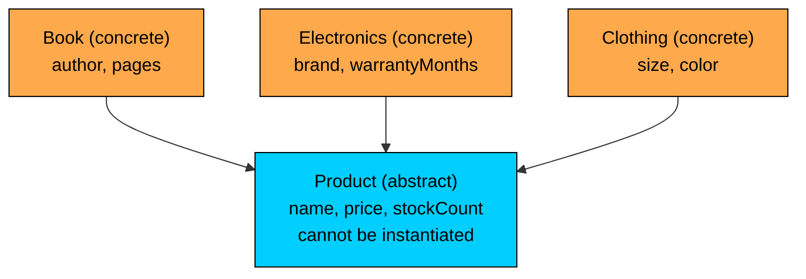
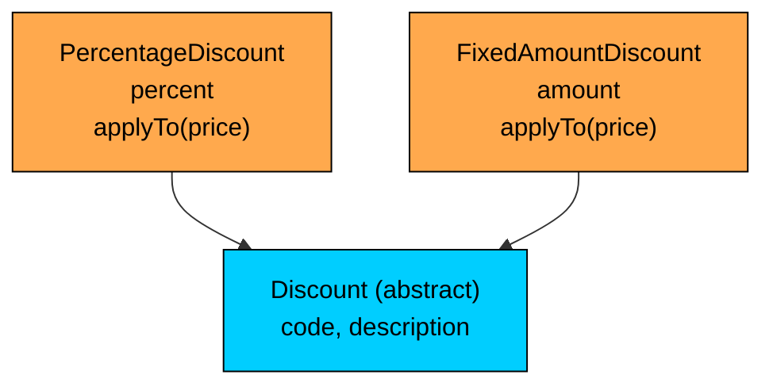
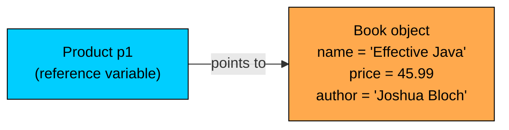

import React from 'react';
import CodeBlock from '../../../../components/ui/CodeBlock';
import Callout from '../../../../components/ui/Callout';

<div className="article-header">
  <div className="breadcrumb">
    <a href="/">Curated Notes</a>
    <span className="breadcrumb-separator">›</span>
    <span className="breadcrumb-current">Abstract Classes</span>
  </div>
  <h1>Abstract Classes</h1>
  <p style={{ color: 'var(--text-muted)', fontSize: '1.1rem', marginBottom: '16px', lineHeight: '1.6' }}>
    Master the essentials of Abstract Classes in this curated guide.
  </p>
  <div className="meta-info">
    <span className="meta-item">
      <svg width="14" height="14" viewBox="0 0 24 24" fill="none" stroke="currentColor" strokeWidth="2"><circle cx="12" cy="12" r="10"/><polyline points="12 6 12 12 16 14"/></svg>
      10 min read
    </span>
    <span className="difficulty-badge difficulty-badge--intermediate">Intermediate</span>
  </div>
</div>

<section className="content-section">

In the inheritance section we built inheritance hierarchies like `Book extends Product` where every class in the tree could be created with `new`. That works when every class in the hierarchy represents a real, concrete thing. It stops working when the superclass exists only to share state and behavior, never to be instantiated on its own. An abstract class is Java's way of declaring "this class is a building block for subclasses, not a finished thing you should ever create directly." This lesson covers what abstract classes are, what they can and can't do, and when to use one.

---

## Why Abstraction Exists

Look at the hierarchy we ended the Inheritance section with: `Product` at the top, with `Book`, `Electronics`, and `Clothing` extending it. Every product in the store is one of those three specific kinds. So what should this line do?


```java
Product p = new Product();
p.name = "Mystery Item";
p.price = 19.99;
```


It compiles. It runs. But what kind of product did we just create? Not a book, not an electronics item, not a piece of clothing. Just a bare `Product`. The store's catalog has no shelf for it. The checkout flow doesn't know how to display it. It's a `Product` in the type system and nothing in the real world.

The `Product` class was meant to be a shared base. It exists so its three subclasses can pull `name`, `price`, and `stockCount` from one place. It was never meant to be a thing in its own right. Java had no way to enforce that. The class compiled, `new Product()` worked, and a careful design relied entirely on programmer discipline.

That's the gap abstraction closes. Sometimes a class exists to define a shape that subclasses fill in. The class collects the common state, provides the common behavior, and explicitly forbids anyone from creating instances of itself. The `abstract` keyword is how Java lets you say that out loud.


```java
public abstract class Product {
    public String name;
    public double price;
    public int stockCount;
}
```


One word, big consequence. `Product` still has fields. It still compiles. Subclasses can still extend it. The only thing that changes is that `new Product()` is no longer legal. Any attempt to create a bare `Product` is now caught at compile time, not left as an error-prone pitfall for the next developer.

Abstraction is about modeling intent. The IS-A relationship from inheritance tells the compiler "a `Book` is a kind of `Product`." Marking `Product` as abstract tells the compiler "there's no such thing as a bare `Product`; every `Product` is some specific kind." Both statements together describe the catalog accurately.





The diagram looks like the hierarchical inheritance trees from before, with one important difference: the root is marked abstract. The leaves are concrete. You can call `new` on the orange boxes. You can't call `new` on the cyan one.

There's a second motivation. Abstract classes also let you define a **contract**: a set of methods that every subclass must provide, with the actual implementation left to each subclass. For this lesson, the focus stays on the class-level decision: marking a class abstract so it can't be created on its own.

---

## The `abstract` Keyword on a Class

The mechanics are small. Put `abstract` between the access modifier and the `class` keyword in a class declaration:


```java
public abstract class Product {
    public String name;
    public double price;
    public int stockCount;
}
```


That's the whole syntax. `abstract` is a modifier on the class. It doesn't change the body. The fields, the constructors, the methods, all of them look exactly like they did in a regular class. The only difference is the one extra word in the header.

`abstract` is a reserved keyword. You can't use it as a variable or method name. Its only job on a class declaration is to mark the class as "not directly instantiable."

A few rules about where `abstract` is allowed on a class:


| Combination | Legal? | Why |
| --- | --- | --- |
| `public abstract class Product` | Yes | Standard form |
| `abstract class Product` | Yes | Package-private abstract class |
| `abstract public class Product` | Yes | Order of modifiers doesn't matter |
| `public abstract final class Product` | No | `abstract` and `final` contradict each other |
| `abstract static class Product` | Only as a nested class | Top-level classes can't be `static` |


The `final` rule deserves attention. A `final` class can't be extended. An `abstract` class must be extended (otherwise it can never be used at all). Combining them would describe a class that is impossible to use, so the compiler rejects it outright:


```java
public abstract final class Product {  // compile error
    public String name;
}
```


The compiler error reads `illegal combination of modifiers: abstract and final`. The fix is to drop one or the other based on what you actually want. If you want subclasses, drop `final`. If you don't want subclasses, drop `abstract` and accept that the class is concrete.

Beyond classes, the `abstract` keyword also applies to methods, and that's where most of the interesting behavior lives. Methods can be marked abstract to declare that subclasses must provide an implementation.

---

## You Cannot Instantiate an Abstract Class

The single biggest behavioral change is that `new` doesn't work on an abstract class. The line that compiled before now fails:


```java
public abstract class Product {
    public String name;
    public double price;
    public int stockCount;
}

public class Mistake {
    public static void main(String[] args) {
        Product p = new Product();  // compile error
        p.name = "Mystery Item";
    }
}
```


The compiler emits:


```shell
Mistake.java:3: error: Product is abstract; cannot be instantiated
        Product p = new Product();
                    ^
1 error
```


That's a hard stop. The error happens at compile time, not at runtime. No JVM is launched, no class is loaded, no constructor is called. The compiler sees the `abstract` modifier and refuses to translate `new Product()` into bytecode. There's no flag, no trick, no reflective workaround at the language level. If you want a `Product`, you have to create one of its concrete subclasses instead.

The fix is to instantiate a subclass:


```java
public abstract class Product {
    public String name;
    public double price;
    public int stockCount;
}

public class Book extends Product {
    public String author;
}

public class FixDemo {
    public static void main(String[] args) {
        Book novel = new Book();
        novel.name = "Effective Java";
        novel.price = 45.99;
        novel.stockCount = 7;
        novel.author = "Joshua Bloch";

        System.out.println(novel.name + " by " + novel.author + " - $" + novel.price);
    }
}
```


`Book` is concrete, so `new Book()` is fine. The `Book` instance inherits the `name`, `price`, and `stockCount` fields from `Product`, even though `Product` itself can never be the type passed to `new`. The abstract class still does its job as a building block; it just can't be the final product.

Two attempts and what they do:


```java
Product p1 = new Product() {};        // legal, but creates an anonymous subclass
Product p2 = (Product) new Object();  // ClassCastException at runtime
```


The first line creates an anonymous subclass of `Product` and instantiates that subclass. It compiles because `new Product() {}` is shorthand for "define an unnamed class that extends `Product`, and create an instance of it." The second line is plain wrong: you can't cast an arbitrary `Object` to `Product`, and the JVM throws `ClassCastException` the moment the cast runs. Neither attempt is a real way to create a bare `Product`, because there's no such thing as a bare `Product` once the class is abstract.

The "abstract" check happens at compile time. There's zero runtime overhead from marking a class abstract. The JVM doesn't pay anything to enforce it.

---

## What an Abstract Class Can Still Have

A common misconception is that an abstract class is a "stripped-down" class with fewer features. It isn't. Other than the rule that you can't directly instantiate one, an abstract class can have everything a regular class can have.

#### Fields (Instance and Static)

Abstract classes can hold state. Every kind of field a regular class supports is also legal here: instance fields, static fields, final fields, fields with any access modifier.


```java
public abstract class Product {
    public String name;
    public double price;
    public int stockCount;

    private static int totalProductsCreated = 0;

    public static final double SHIPPING_TAX_RATE = 0.05;
}
```


`name`, `price`, and `stockCount` are normal instance fields. Every subclass instance gets its own copy. `totalProductsCreated` is a static field shared across all instances and subclasses. `SHIPPING_TAX_RATE` is a `public static final` constant available through `Product.SHIPPING_TAX_RATE` without ever creating a `Product` (which is good, because you can't).

The point: storing shared state on an abstract class is a perfectly normal thing to do. It's actually one of the main reasons to use an abstract class instead of an interface (interfaces traditionally don't hold instance state).

#### Constructors


```java
public abstract class Product {
    public String name;
    public double price;
    public int stockCount;

    public Product(String name, double price, int stockCount) {
        this.name = name;
        this.price = price;
        this.stockCount = stockCount;
    }
}
```


An abstract class can have constructors. It can have multiple constructors. It can have constructors that take arguments. None of this changes the rule that you can't write `new Product(...)`.

So what are the constructors for, if you can never call `new` on the class? They're for subclasses to call. When a subclass extends `Product`, the subclass's constructor must call one of `Product`'s constructors (either explicitly with `super(...)` or implicitly via the no-arg default). The only change from regular constructor chaining is that the parent in the chain happens to be an abstract class.

A concrete subclass shows it working:


```java
public class Book extends Product {
    public String author;

    public Book(String name, double price, int stockCount, String author) {
        super(name, price, stockCount);
        this.author = author;
    }
}

public class ConstructorDemo {
    public static void main(String[] args) {
        Book novel = new Book("Effective Java", 45.99, 7, "Joshua Bloch");
        System.out.println(novel.name + " by " + novel.author + " - $" + novel.price);
    }
}
```


The `Book` constructor takes four arguments. The first three are passed up to `Product`'s constructor with `super(name, price, stockCount)`. That `super` call runs the `Product` constructor, which assigns the three shared fields. Then the `Book` constructor continues and sets `this.author`. The result is a fully initialized `Book` whose `Product` part was set up by a constructor on an abstract class.

If you forget the `super(...)` call when the parent has no no-arg constructor, the compiler complains:


```shell
Book.java: error: constructor Product in class Product cannot be applied to given types;
  required: String,double,int
  found: no arguments
```


That's the same error you'd see with any superclass; the abstractness of the parent doesn't change how constructor chaining works.

#### Concrete Methods (with Real Bodies)

Methods on an abstract class are concrete by default. Unless you specifically mark a method abstract, it has a body just like a method on any other class.


```java
public abstract class Product {
    public String name;
    public double price;
    public int stockCount;

    public Product(String name, double price, int stockCount) {
        this.name = name;
        this.price = price;
        this.stockCount = stockCount;
    }

    public void printSummary() {
        System.out.println(name + " - $" + price + " (" + stockCount + " in stock)");
    }

    public boolean isInStock() {
        return stockCount > 0;
    }

    public double priceAfterDiscount(double percentOff) {
        return price * (1 - percentOff / 100);
    }
}
```


Every subclass inherits these methods. They run on subclass instances and use the subclass's field values. Nothing about being inside an abstract class makes them special.


```java
public class Book extends Product {
    public String author;

    public Book(String name, double price, int stockCount, String author) {
        super(name, price, stockCount);
        this.author = author;
    }
}

public class MethodDemo {
    public static void main(String[] args) {
        Book novel = new Book("Effective Java", 45.99, 7, "Joshua Bloch");
        novel.printSummary();
        System.out.println("In stock: " + novel.isInStock());
        System.out.println("After 20% off: $" + novel.priceAfterDiscount(20));
    }
}
```


Three method calls, three implementations, all of them living on the abstract `Product` class. `Book` didn't have to override any of them to use them.

This is the **template** flavor of an abstract class: shared behavior in the parent, specialized differences in the children, and the type system enforcing that nobody can pretend to have just the shared part without picking a specific kind.

#### Static Methods

Abstract classes can have static methods, and you call them on the class name like any other static method:


```java
public abstract class Product {
    public String name;
    public double price;
    public int stockCount;

    public Product(String name, double price, int stockCount) {
        this.name = name;
        this.price = price;
        this.stockCount = stockCount;
    }

    public static double applyShippingTax(double subtotal) {
        return subtotal * 1.05;
    }
}

public class StaticDemo {
    public static void main(String[] args) {
        double subtotal = 100.0;
        double withTax = Product.applyShippingTax(subtotal);
        System.out.println("Subtotal: $" + subtotal);
        System.out.println("With shipping tax: $" + withTax);
    }
}
```


`Product.applyShippingTax` doesn't need a `Product` instance. It belongs to the class, not to any object. So even though you can't write `new Product()`, you can still call `Product.applyShippingTax(...)`. Static methods on abstract classes are perfectly normal. They behave like static methods anywhere else.

#### Access Modifiers, `final`, and Everything Else

Fields and methods on an abstract class can be `public`, `protected`, package-private, or `private`. They can be `final`. They can be `static`. The abstract modifier on the class doesn't disable or change any of the other modifiers you'd use on members.

A summary table of what an abstract class can hold:


| Feature | Abstract class supports it? |
| --- | --- |
| Instance fields | Yes |
| Static fields | Yes |
| `final` fields and constants | Yes |
| Constructors (called by subclasses via `super`) | Yes |
| Concrete instance methods | Yes |
| Static methods | Yes |
| Abstract methods | Yes |
| `private`, `protected`, `public`, package-private members | Yes |
| Being instantiated with `new` | **No** |


The only "no" in that table is the line that gives abstract classes their identity. Everything else looks like a regular class.

---

## Zero Abstract Methods is Still Valid

An abstract class is not required to have any abstract methods. The class-level `abstract` modifier alone is enough to make a class abstract.


```java
public abstract class Product {
    public String name;
    public double price;
    public int stockCount;

    public Product(String name, double price, int stockCount) {
        this.name = name;
        this.price = price;
        this.stockCount = stockCount;
    }

    public void printSummary() {
        System.out.println(name + " - $" + price);
    }
}
```


This `Product` has fields, a constructor, and a concrete method. It declares no abstract methods at all. It is still a perfectly valid abstract class. It still can't be instantiated with `new`. The compiler enforces that based on the `abstract` keyword in the class header, not based on what's inside.

Why would you ever do this? The case is exactly the one we opened the lesson with. `Product` is a sensible shared base for `Book`, `Electronics`, and `Clothing`, and every subclass can fully use the inherited fields and methods without overriding anything. But there's no such thing as a "bare product." Marking the class abstract documents and enforces the design intent.

A subclass extending this kind of abstract class needs almost nothing extra:


```java
public class Clothing extends Product {
    public String size;
    public String color;

    public Clothing(String name, double price, int stockCount, String size, String color) {
        super(name, price, stockCount);
        this.size = size;
        this.color = color;
    }
}

public class ClothingDemo {
    public static void main(String[] args) {
        Clothing tshirt = new Clothing("Cotton T-Shirt", 19.99, 40, "M", "Blue");
        tshirt.printSummary();
        System.out.println("Size: " + tshirt.size + ", Color: " + tshirt.color);
    }
}
```


`Clothing` doesn't override `printSummary`. It doesn't need to. It just adds its own two fields and a constructor that chains up. The abstract `Product` provides the rest.

The "zero abstract methods" case is the cleanest illustration of the difference between an abstract class and an interface. An interface traditionally couldn't have instance state and required every method to be a contract. An abstract class with zero abstract methods is essentially a regular class with one extra restriction: no direct instantiation. That's a useful tool when shared state and shared method implementations are the whole point, and there's nothing for subclasses to "fill in."


&gt; **INFO**
&gt;
&gt; **Design note:** If your abstract class has zero abstract methods and you can't think of a reason a subclass would ever want to override a method, the abstract-ness is doing one job and one job only: preventing direct instantiation. That's a legitimate reason to use it, but it's a narrower benefit than the template-method use case.


---

## When to Use an Abstract Class

The mechanics are simple. The harder question is when to actually use one. There are three recurring situations where an abstract class fits well.

#### Shared State Plus Shared Behavior That No Subclass Should Skip

This is the case our running example fits. `Product` holds three shared fields and a few shared methods. Every subclass needs them. None of them want to redefine them. Putting them on a regular `Product` class and using single inheritance works, except that "regular" leaves the door open to `new Product()`, which the design doesn't intend.

Making `Product` abstract is the difference between "the design hopes nobody creates a bare `Product`" and "the design enforces that nobody can." The runtime cost is zero. The compile-time enforcement is real.

#### A Partial Implementation You Want Subclasses to Complete

An abstract class can supply most of a workflow and leave a few specific operations for subclasses to fill in. The parent provides the structure; the children provide the parts that vary.

A quick sketch shows why an abstract class fits this case rather than a regular class. If every product needs to provide a "display label" for the cart, but books, electronics, and clothing format their labels differently: An abstract class lets `Product` declare "every subclass must provide a `displayLabel()`" without committing to one implementation. A regular class would have to either supply a default (which might be wrong for everyone) or leave the method off entirely (which makes generic code awkward). Abstract methods are how you express "must be provided" formally.

#### A Class That Is a Type but Not a Concrete Thing

Sometimes a class exists purely to give a name to a category of things, with subclasses for each specific kind. The category itself isn't a thing anyone would point to. "Discount" might be that kind of category. A `PercentageDiscount` is a thing. A `FixedAmountDiscount` is a thing. A bare "discount" without a specific kind is a label, not an object.


```java
public abstract class Discount {
    public String code;
    public String description;

    public Discount(String code, String description) {
        this.code = code;
        this.description = description;
    }
}

public class PercentageDiscount extends Discount {
    public double percent;

    public PercentageDiscount(String code, String description, double percent) {
        super(code, description);
        this.percent = percent;
    }

    public double applyTo(double price) {
        return price * (1 - percent / 100);
    }
}

public class FixedAmountDiscount extends Discount {
    public double amount;

    public FixedAmountDiscount(String code, String description, double amount) {
        super(code, description);
        this.amount = amount;
    }

    public double applyTo(double price) {
        double result = price - amount;
        return result < 0 ? 0 : result;
    }
}

public class DiscountDemo {
    public static void main(String[] args) {
        PercentageDiscount fifteenOff = new PercentageDiscount("SAVE15", "15% off", 15);
        FixedAmountDiscount tenOff = new FixedAmountDiscount("FLAT10", "$10 off", 10);

        System.out.println(fifteenOff.code + ": $100 becomes $" + fifteenOff.applyTo(100));
        System.out.println(tenOff.code + ": $100 becomes $" + tenOff.applyTo(100));
    }
}
```


`Discount` exists so that anywhere the catalog says "this product has a discount," the variable can be typed as `Discount` without committing to which kind. The two subclasses fill in the specific behavior. A bare `new Discount(...)` would represent a "discount of unspecified type," which isn't something the system has any rule for. Marking `Discount` abstract documents that fact and prevents the construction.

Compared with the earlier `Product` example, the shape is the same: an abstract parent, two or three concrete children, each child supplying its own specifics. The abstract class is the shared concept, and the subclasses are the shapes that concept actually takes in the program.





The pattern repeats. Two concrete leaves under one abstract root. Shared state on the root, specialized state and behavior on the leaves. The root is a category. The leaves are the actual things.

#### When an Abstract Class is the Wrong Tool

The flip side matters too. Two common cases where using an abstract class is a mistake:

- **The class will actually be instantiated as itself.** If a bare `Product` is a real thing the program needs (say, "miscellaneous item, no specific category"), don't make it abstract. The abstract modifier means the class is incomplete on its own. If it isn't incomplete, leave it concrete.
- **The relationship is HAS-A, not IS-A.** Abstract classes are still classes; they use the same inheritance hierarchy. If you'd reject inheritance for a relationship because it isn't IS-A, abstract classes don't change that calculus. An `Order` is not a kind of `Cart`, abstract or otherwise. The IS-A test still applies.

---

## Reference Variables of Abstract Type

The fact that you can't create an instance of an abstract class doesn't mean you can't have a variable of that type.


```java
public abstract class Product {
    public String name;
    public double price;

    public Product(String name, double price) {
        this.name = name;
        this.price = price;
    }

    public void printSummary() {
        System.out.println(name + " - $" + price);
    }
}

public class Book extends Product {
    public String author;

    public Book(String name, double price, String author) {
        super(name, price);
        this.author = author;
    }
}

public class Electronics extends Product {
    public String brand;

    public Electronics(String name, double price, String brand) {
        super(name, price);
        this.brand = brand;
    }
}

public class CatalogPrinter {
    public static void main(String[] args) {
        Product p1 = new Book("Effective Java", 45.99, "Joshua Bloch");
        Product p2 = new Electronics("Aluminum Laptop", 1299.00, "Acme");

        p1.printSummary();
        p2.printSummary();
    }
}
```


The variables `p1` and `p2` are both typed as `Product`. Their values are a `Book` instance and an `Electronics` instance. The line `Product p1 = new Book(...)` is the key: the right-hand side creates a concrete object, and the left-hand side stores the reference in a variable whose declared type is the abstract parent. The compiler accepts it because `Book` is a `Product` (IS-A holds), so the assignment is widening a reference, not creating an abstract instance.

What you cannot do is the other direction:


```java
Product p = new Product("Mystery", 19.99);  // compile error
```


The declared type of the variable is fine. The `new Product(...)` is what fails. The type doesn't make the class instantiable; the class's own modifier does.

This pattern matters because it's the entire foundation of polymorphism over an inheritance hierarchy. You can write a method that operates on any product:


```java
public class PriceCalculator {
    public static double subtotal(Product[] items) {
        double sum = 0;
        for (int i = 0; i < items.length; i++) {
            sum = sum + items[i].price;
        }
        return sum;
    }

    public static void main(String[] args) {
        Product[] cart = new Product[2];
        cart[0] = new Book("Effective Java", 45.99, "Joshua Bloch");
        cart[1] = new Electronics("Aluminum Laptop", 1299.00, "Acme");

        double total = subtotal(cart);
        System.out.println("Cart subtotal: $" + total);
    }
}
```


The array `cart` is declared as `Product[]`. The actual objects in it are a `Book` and an `Electronics`. The `subtotal` method walks the array using the abstract `Product` type. It never creates a `Product`, it just receives references to subclass instances.

The diagram below captures the situation. The variable holds a `Product` reference. The reference points at a `Book` object. The object's actual class is `Book`, but the type the variable knows about is `Product`. You can call any method declared on `Product` through the variable. The method runs on the `Book` instance.





The abstract class works fine as a type. It just doesn't work as a value all by itself.

One consequence: through the `Product` reference, you can only see what `Product` declares. The `author` field, declared on `Book`, is not visible through a `Product` reference even though the underlying object has one:


```java
Product p1 = new Book("Effective Java", 45.99, "Joshua Bloch");
System.out.println(p1.author);  // compile error: cannot find symbol
```


The compiler looks at the declared type (`Product`), not the actual object. `Product` has no `author` field, so the access fails to compile. Getting at the `Book`-specific parts requires a cast. The rule that an abstract class makes a perfectly normal reference type doesn't lift the usual rules about what's visible through a parent reference.

---

## Common Compile Errors Around Abstract Classes

Three compiler errors come up over and over when working with abstract classes.

#### "ClassName is abstract; cannot be instantiated"

The headline error.


```java
public abstract class Product {
    public String name;
}

public class Demo {
    public static void main(String[] args) {
        Product p = new Product();  // error
    }
}
```


The compiler message:


```shell
Demo.java:3: error: Product is abstract; cannot be instantiated
        Product p = new Product();
                    ^
```


The fix is to create a concrete subclass instead, or to remove the `abstract` modifier if you actually do want bare instances.

#### "Illegal combination of modifiers: abstract and final"


```java
public abstract final class Product {  // error
    public String name;
}
```


The compiler message:


```shell
Product.java:1: error: illegal combination of modifiers: abstract and final
public abstract final class Product {
                            ^
```


The fix is to drop one. Abstract means "must be extended." Final means "cannot be extended." They directly contradict each other.

#### Constructor Argument Mismatch When the Abstract Parent Has Only a Parameterized Constructor


```java
public abstract class Product {
    public String name;

    public Product(String name) {
        this.name = name;
    }
}

public class Book extends Product {
    public String author;

    public Book(String author) {     // error: implicit super() with no args
        this.author = author;
    }
}
```


The compiler message:


```shell
Book.java:5: error: constructor Product in class Product cannot be applied to given types;
  required: String
  found: no arguments
```


When a subclass constructor doesn't explicitly call `super(...)`, Java inserts an implicit `super()` call. That requires the parent to have a no-arg constructor. The abstract `Product` here only defined a constructor taking a `String`, so the implicit call fails. The fix is to add an explicit `super(...)` call with the right arguments:


```java
public class Book extends Product {
    public String author;

    public Book(String name, String author) {
        super(name);
        this.author = author;
    }
}
```


This isn't a "because the parent is abstract" error. It's the standard constructor-chaining rule. It just shows up often with abstract classes because abstract classes frequently define parameterized constructors to initialize shared state.

None of these errors have a runtime equivalent. They're caught entirely at compile time, before any class is loaded. That's the whole point of the `abstract` modifier: enforcement at the cheapest possible time.

---

## A Larger Worked Example

Putting the pieces together, here's a realistic catalog using an abstract `Product` class with shared state, a shared method, a static helper, and three concrete subclasses.


```java
public abstract class Product {
    public String name;
    public double price;
    public int stockCount;

    public Product(String name, double price, int stockCount) {
        this.name = name;
        this.price = price;
        this.stockCount = stockCount;
    }

    public boolean isInStock() {
        return stockCount > 0;
    }

    public void printSummary() {
        String stockText = isInStock() ? stockCount + " in stock" : "out of stock";
        System.out.println(name + " - $" + price + " (" + stockText + ")");
    }

    public static double cartTotal(Product[] items) {
        double sum = 0;
        for (int i = 0; i < items.length; i++) {
            sum = sum + items[i].price;
        }
        return sum;
    }
}

public class Book extends Product {
    public String author;
    public int pages;

    public Book(String name, double price, int stockCount, String author, int pages) {
        super(name, price, stockCount);
        this.author = author;
        this.pages = pages;
    }
}

public class Electronics extends Product {
    public String brand;
    public int warrantyMonths;

    public Electronics(String name, double price, int stockCount, String brand, int warrantyMonths) {
        super(name, price, stockCount);
        this.brand = brand;
        this.warrantyMonths = warrantyMonths;
    }
}

public class Clothing extends Product {
    public String size;
    public String color;

    public Clothing(String name, double price, int stockCount, String size, String color) {
        super(name, price, stockCount);
        this.size = size;
        this.color = color;
    }
}

public class StoreDemo {
    public static void main(String[] args) {
        Book novel = new Book("Effective Java", 45.99, 7, "Joshua Bloch", 416);
        Electronics laptop = new Electronics("Aluminum Laptop", 1299.00, 0, "Acme", 24);
        Clothing tshirt = new Clothing("Cotton T-Shirt", 19.99, 40, "M", "Blue");

        Product[] cart = { novel, laptop, tshirt };

        for (int i = 0; i < cart.length; i++) {
            cart[i].printSummary();
        }

        System.out.println("Cart total: $" + Product.cartTotal(cart));
    }
}
```


Walk through what's happening:

1. `Product` is abstract. None of the three concrete types are. The compiler would reject `new Product(...)`, but it accepts all three subclass `new` calls.
2. The shared constructor on `Product` initializes the three shared fields. Each subclass constructor calls `super(...)` to delegate that initialization.
3. The shared methods `isInStock` and `printSummary` live on `Product`. They run on subclass instances using each instance's own field values.
4. The array is declared as `Product[]`, so it can hold any concrete subclass instance side by side. Iterating and calling `printSummary` works through the abstract type.
5. The static helper `Product.cartTotal` doesn't need a `Product` instance and is called through the class name, just like any other static method.

Nothing in this example was technically impossible without the `abstract` keyword. The abstract modifier doesn't unlock any new capability. What it does is encode the design rule "no bare `Product` instances" into the compiler, so the rule is enforced everywhere automatically. The cost is one word in the class header. The benefit is one less category of bug.

</section>
