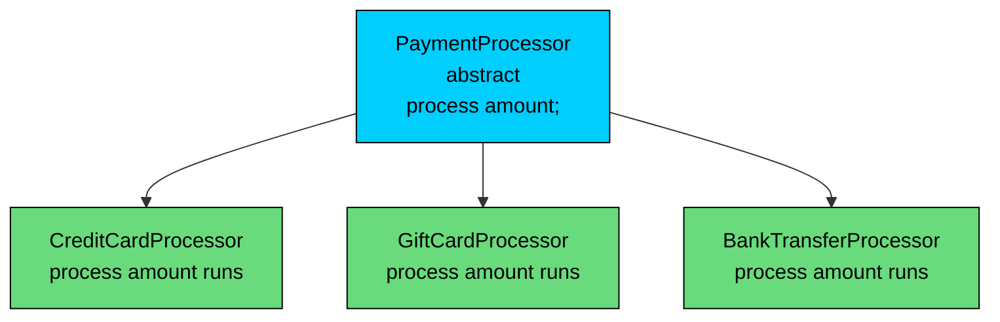
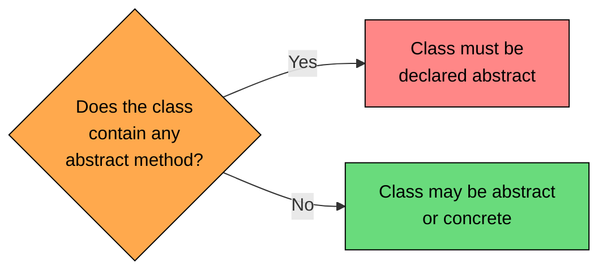
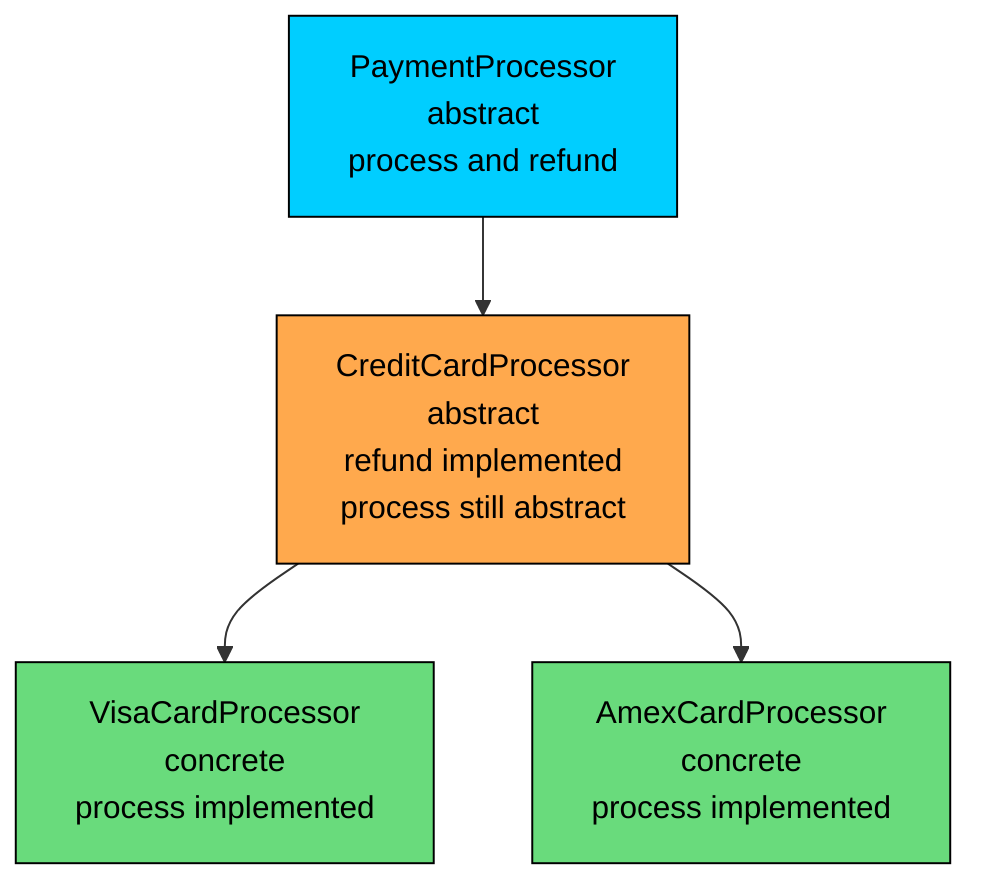

import React from 'react';
import CodeBlock from '../../../../components/ui/CodeBlock';
import Callout from '../../../../components/ui/Callout';

<div className="article-header">
  <div className="breadcrumb">
    <a href="/">Curated Notes</a>
    <span className="breadcrumb-separator">›</span>
    <span className="breadcrumb-current">Abstract Methods</span>
  </div>
  <h1>Abstract Methods</h1>
  <p style={{ color: 'var(--text-muted)', fontSize: '1.1rem', marginBottom: '16px', lineHeight: '1.6' }}>
    Master the essentials of Abstract Methods in this curated guide.
  </p>
  <div className="meta-info">
    <span className="meta-item">
      <svg width="14" height="14" viewBox="0 0 24 24" fill="none" stroke="currentColor" strokeWidth="2"><circle cx="12" cy="12" r="10"/><polyline points="12 6 12 12 16 14"/></svg>
      10 min read
    </span>
    <span className="difficulty-badge difficulty-badge--intermediate">Intermediate</span>
  </div>
</div>

<section className="content-section">

The previous lesson introduced abstract classes as containers that can't be instantiated. The interesting half of that story is what they hold. An abstract class becomes useful by declaring methods that have no body, just a signature and a semicolon, and forcing every concrete subclass to fill those in. Those declarations are abstract methods, and the rules around them shape how Java models contracts in a class hierarchy. This lesson covers the `abstract` keyword on methods, the modifiers it refuses to combine with, who has to implement what, and the compile errors that appear when any of these rules is broken.

---

## What an Abstract Method Is

An abstract method is a method declaration without an implementation. You write the signature, you mark it `abstract`, and you end it with a semicolon instead of a body.


```java
public abstract class PaymentProcessor {
    public abstract void process(double amount);
}
```


That single line tells anyone reading `PaymentProcessor` two things. First, every concrete subclass must define a `process` method that takes a `double` and returns nothing. Second, the parent class itself refuses to commit to one way of doing it, because "process a payment" means different things for credit cards, gift cards, store credit, and bank transfers. The abstract method is a contract, not an implementation.

Here's the same idea inside a tiny e-commerce flow that actually runs.


```java
public class PaymentDemo {
    public static void main(String[] args) {
        PaymentProcessor card = new CreditCardProcessor();
        PaymentProcessor giftCard = new GiftCardProcessor();

        card.process(49.99);
        giftCard.process(15.00);
    }
}

abstract class PaymentProcessor {
    public abstract void process(double amount);
}

class CreditCardProcessor extends PaymentProcessor {
    @Override
    public void process(double amount) {
        System.out.println("Charging $" + amount + " to credit card");
    }
}

class GiftCardProcessor extends PaymentProcessor {
    @Override
    public void process(double amount) {
        System.out.println("Deducting $" + amount + " from gift card balance");
    }
}
```


Two details. The parent has no body for `process`, just a signature and a semicolon. Both children supply a real method body with the same signature, marked `@Override` because they're overriding the parent's declaration. The method overriding rules (same name, same parameter list, compatible return type, no narrower access, no broader checked exceptions) all apply here unchanged. An abstract method is still a method to override; the only twist is that the parent never had a body to begin with.





The parent declares one method that has no body. Three concrete children each supply their own version. The parent has no opinion about how the work happens; the children carry that knowledge.

---

## Why Abstract Methods Exist

Abstract methods are the reason most abstract classes are abstract in the first place. They solve a specific design problem: how do you say "every kind of X must support operation Y, but I refuse to pick the one true way to do Y"?

Without abstract methods, you have two unsatisfying choices. You can give the parent a placeholder implementation that throws an exception or does nothing, and hope every subclass remembers to override it. Or you can leave the method off the parent entirely and rely on documentation to tell subclass authors what they need to write. Both approaches push enforcement out of the type system and into "I hope the next developer reads the docs."

Abstract methods move that enforcement into the compiler. Consider the placeholder approach first.


```java
class NaivePaymentProcessor {
    public void process(double amount) {
        throw new UnsupportedOperationException("Subclasses must implement process");
    }
}

class ForgetfulProcessor extends NaivePaymentProcessor {
    // Author forgot to override process.
    // Code compiles. Bug shows up at runtime, in production.
}
```


`ForgetfulProcessor` compiles cleanly. The bug appears only when someone calls `process` on a `ForgetfulProcessor` instance and the program crashes. Whoever wrote the subclass thought they were done. Their tests for unrelated methods passed. The failure happens far from the cause.

Compare the same idea with an abstract method.


```java
abstract class PaymentProcessor {
    public abstract void process(double amount);
}

class ForgetfulProcessor extends PaymentProcessor {
    // No process method.
}
```


This time the compiler stops the build:


```shell
error: ForgetfulProcessor is not abstract and does not override abstract method process(double) in PaymentProcessor
```


The error names the exact missing method. The fix is mechanical: either implement `process`, or mark `ForgetfulProcessor` abstract too and let one of its subclasses handle it. Either way, the unfinished class can never reach production by accident.

The same argument applies in reverse. When reading code and seeing an abstract method, two things are immediately clear: the parent doesn't have a working implementation, and every concrete subclass is forced to provide one. That's information the type system carries automatically.

---

## Where Abstract Methods Can Live

An abstract method can only live inside an abstract class or an interface. The reason is simple: if the class is concrete, callers can instantiate it, and they expect every method on that instance to actually do something. A concrete class with an abstract method would be a contradiction.

The compiler enforces this directly. The moment you write `abstract` in front of a method, the containing class must also be `abstract`.


```java
class OrderHandler { // not abstract
    public abstract void handle(); // compile error
}
```


The compiler responds with:


```shell
error: OrderHandler is not abstract and does not override abstract method handle() in OrderHandler
error: abstract methods cannot have a body
```


(The second error appears because the compiler tries to parse what comes after the signature; the first one is the meaningful one.)

The fix is to mark the class abstract:


```java
abstract class OrderHandler {
    public abstract void handle();
}
```


The rule cuts both ways. An abstract class is allowed to contain zero abstract methods if it wants, but a class containing even one abstract method must be declared abstract. Said the other way around: putting one abstract method in a class infects the whole class with abstractness.





An abstract class isn't required to have abstract methods, but having one forces the class to be abstract.

---

## Modifiers That Don't Combine With `abstract`

The keyword `abstract` declares an intent: "I'm a method that subclasses must implement." Several other modifiers contradict that intent so directly that combining them with `abstract` is a compile error. Six of them fail for different conceptual reasons.


| Modifier | Combined with `abstract`? | Why not |
| --- | --- | --- |
| `private` | Compile error | `private` methods aren't inherited, so subclasses can never implement them. |
| `final` | Compile error | `final` says "this can't be overridden." `abstract` says "this must be." Direct contradiction. |
| `static` | Compile error | `static` methods belong to the class, not instances, and aren't dispatched dynamically. |
| `synchronized` | Compile error | `synchronized` locks the method body, but there's no body to lock. |
| `native` | Compile error | `native` says "the body lives in C/C++ code." Abstract says "there is no body." |
| `strictfp` | Compile error | `strictfp` controls floating-point evaluation inside a body. No body, nothing to control. (Largely irrelevant since Java 17 made strict floating-point the default, but the rule still applies.) |


The rest of this section walks through each combination, the rationale, and the exact compiler error.

#### `abstract` + `private`

A `private` method isn't inherited. Subclasses can't see it, can't override it, and can't supply an implementation. An abstract method whose whole purpose is to force subclasses to implement it can't also be hidden from those subclasses.


```java
abstract class PaymentProcessor {
    private abstract void process(double amount); // compile error
}
```


The error:


```shell
error: illegal combination of modifiers: abstract and private
```


If you really need a helper that the abstract class controls and subclasses can't see, write it as a regular `private` method with a body. Abstract is for the contract, `private` is for hidden internals; they describe different things.

#### `abstract` + `final`

`final` on a method says "no subclass may override this." `abstract` on a method says "every concrete subclass must override this." These are direct opposites.


```java
abstract class PaymentProcessor {
    public abstract final void process(double amount); // compile error
}
```


The error:


```shell
error: illegal combination of modifiers: abstract and final
```


This is the cleanest illegal combination in the list. There is no version of "must be overridden, cannot be overridden" that makes sense.

#### `abstract` + `static`

`static` methods belong to the class, not an instance. They aren't dispatched based on the actual object's type, which is the whole mechanism that makes overriding work. Without dynamic dispatch, there's no way for a subclass implementation to be picked over the parent's, so making a `static` method abstract leaves the runtime no way to resolve calls.


```java
abstract class PaymentProcessor {
    public static abstract void process(double amount); // compile error
}
```


The error:


```shell
error: illegal combination of modifiers: abstract and static
```


If you want a class-level utility that varies by subtype, you've picked the wrong tool. Instance methods with overriding handle that. `static` methods are for class-bound utilities where the variable's declared type, not the actual object, is what selects the implementation.

#### `abstract` + `synchronized`

`synchronized` on a method tells the JVM to acquire the object's monitor lock before running the method body, and to release it on exit. An abstract method has no body, so there's nothing to wrap in a lock.


```java
abstract class PaymentProcessor {
    public abstract synchronized void process(double amount); // compile error
}
```


The error:


```shell
error: illegal combination of modifiers: abstract and synchronized
```


If a subclass implementation needs to be synchronized, the subclass can mark its override `synchronized`. The `synchronized` modifier isn't inherited from a parent declaration, so this is the only sensible place to put it.

#### `abstract` + `native`

`native` means "the implementation is written in another language (typically C or C++) and linked in at runtime." `abstract` means "there is no implementation here, every subclass must supply one." Both describe what the method body is, and they describe opposite things.


```java
abstract class PaymentProcessor {
    public abstract native void process(double amount); // compile error
}
```


The error:


```shell
error: illegal combination of modifiers: abstract and native
```


`native` rarely appears in normal application code. It shows up in the JDK itself (think `System.currentTimeMillis()` or `Object.hashCode()`), but the rule still applies.

#### `abstract` + `strictfp`

`strictfp` forces floating-point operations inside a method body to follow strict IEEE 754 rules across all JVMs. Without a body, there's nothing to constrain. (As of Java 17, all floating-point is strict by default, so `strictfp` is effectively a no-op modifier, but the combination rule remains in the language.)


```java
abstract class PaymentProcessor {
    public abstract strictfp void process(double amount); // compile error
}
```


The error:


```shell
error: illegal combination of modifiers: abstract and strictfp
```


The pattern across all six is the same: abstract describes "no implementation here," and every banned modifier describes some property of an implementation. You can't have a property of a thing that doesn't exist.

---

## Access Modifiers on Abstract Methods

Abstract methods can use any access level except `private`. `public`, `protected`, and package-private (no keyword) all work. The choice changes who in the world is required to be able to implement the method, but the implementation rule itself is identical in every case.


```java
abstract class PaymentProcessor {
    public abstract void process(double amount);
    protected abstract void logAttempt(String detail);
    abstract boolean validate(double amount); // package-private
}
```


A concrete subclass must supply all three. The access modifier on the subclass implementation must be the same or wider (the standard overriding rule). So a `protected` abstract method can be implemented as `protected` or `public` in the subclass, but never narrowed to package-private or `private`.


```java
class CreditCardProcessor extends PaymentProcessor {
    @Override
    public void process(double amount) { /* ... */ }

    @Override
    public void logAttempt(String detail) { /* widening from protected is fine */ }

    @Override
    boolean validate(double amount) { return amount > 0; }
}
```


Widening is allowed because callers who could reach the parent's declaration must still be able to reach the override; widening preserves that. Narrowing is forbidden for the same reason it's forbidden in normal overriding: it would silently break callers holding a parent-typed reference.

The package-private case has a wrinkle. A package-private abstract method can only be overridden by subclasses in the same package, because subclasses in other packages can't see the method at all. If you want a method that every subclass anywhere must implement, use `protected` or `public`. Package-private abstract methods are useful when you're keeping the entire hierarchy inside one package and want to limit the API surface; they're rare in practice.

---

## Abstract Methods With `throws` Clauses

An abstract method declaration can specify checked exceptions in a `throws` clause, just like any other method. The clause tells subclass implementations: "callers of this method will be required to handle these checked exceptions, so you may throw them."


```java
import java.io.IOException;

abstract class OrderExporter {
    public abstract void export(String orderId) throws IOException;
}

class FileOrderExporter extends OrderExporter {
    @Override
    public void export(String orderId) throws IOException {
        // write to a file, may throw IOException
    }
}

class InMemoryOrderExporter extends OrderExporter {
    @Override
    public void export(String orderId) {
        // throws nothing, allowed
    }
}
```


Both subclass declarations are valid. `FileOrderExporter` throws exactly what the parent declared. `InMemoryOrderExporter` throws nothing at all, which is fine because the standard overriding rule lets a subclass throw fewer checked exceptions than the parent (same, narrower subtype, or none). What it can't do is broaden the throws clause.


```java
class BadExporter extends OrderExporter {
    @Override
    public void export(String orderId) throws Exception { // compile error
    }
}
```


The error:


```shell
error: export(String) in BadExporter cannot override export(String) in OrderExporter
  overridden method does not throw java.lang.Exception
```


`Exception` is broader than `IOException`. Callers of `OrderExporter.export(...)` only know they need to catch `IOException`. If a subclass slipped a broader `Exception` in, those callers would suddenly have unhandled checked exceptions in code the compiler had previously approved. The rule keeps the parent's contract honest.

Unchecked exceptions (`RuntimeException` and its subclasses) bypass this rule entirely. A subclass can throw `IllegalArgumentException` from an override without the parent declaring anything, just like with any normal override.

---

## Forcing Implementation in the First Concrete Subclass

The rule that defines abstract methods at the hierarchy level is short: the first concrete subclass in the chain must implement every abstract method it has inherited. Otherwise, it must itself be abstract.

The word "first" matters. Abstract methods can pass through intermediate abstract classes without being implemented. The compiler only insists when it reaches a class that's not abstract.


```java
public class PaymentChainDemo {
    public static void main(String[] args) {
        PaymentProcessor visa = new VisaCardProcessor();
        PaymentProcessor amex = new AmexCardProcessor();

        visa.process(100.00);
        amex.process(250.00);
    }
}

abstract class PaymentProcessor {
    public abstract void process(double amount);
    public abstract void refund(double amount);
}

abstract class CreditCardProcessor extends PaymentProcessor {
    // Implements refund for all credit cards.
    // Leaves process abstract so each card brand fills it in.
    @Override
    public void refund(double amount) {
        System.out.println("Refunding $" + amount + " to credit card");
    }
}

class VisaCardProcessor extends CreditCardProcessor {
    @Override
    public void process(double amount) {
        System.out.println("Visa charge: $" + amount);
    }
}

class AmexCardProcessor extends CreditCardProcessor {
    @Override
    public void process(double amount) {
        System.out.println("Amex charge: $" + amount);
    }
}
```


`PaymentProcessor` declares two abstract methods. `CreditCardProcessor` implements one (`refund`) and leaves the other (`process`) abstract. That's legal because `CreditCardProcessor` is itself abstract. The compiler only starts enforcing at the first concrete class. `VisaCardProcessor` and `AmexCardProcessor` are both concrete, so each must supply a `process` implementation. They inherit `refund` from `CreditCardProcessor` and don't need to redeclare it.





The pattern (an abstract class partway down the chain that implements some methods and leaves others abstract) is common when a group of subclasses shares behavior for some operations but disagrees on others. The compiler is fine with multi-step chains as long as the last step that isn't abstract has everything covered.

The forgetting case looks like this:


```java
abstract class PaymentProcessor {
    public abstract void process(double amount);
}

class IncompleteProcessor extends PaymentProcessor {
    // No process implementation, and not declared abstract.
}
```


The error:


```shell
error: IncompleteProcessor is not abstract and does not override abstract method process(double) in PaymentProcessor
```


The compiler names the missing method. Two fixes work: implement it, or change `class IncompleteProcessor` to `abstract class IncompleteProcessor` and push the obligation down to whoever extends it next.

---

## Calling Abstract Methods From Concrete Ones

An abstract class is allowed to mix abstract methods with concrete ones, and the concrete methods can call the abstract ones. The parent code calls the contract; at runtime, the subclass's implementation fills in the blank.


```java
public class CheckoutFlow {
    public static void main(String[] args) {
        PaymentProcessor visa = new VisaCardProcessor();
        PaymentProcessor giftCard = new GiftCardProcessor();

        visa.checkout(120.00);
        System.out.println();
        giftCard.checkout(35.00);
    }
}

abstract class PaymentProcessor {
    public abstract boolean authorize(double amount);
    public abstract void charge(double amount);

    // Concrete method that depends on the abstract ones.
    public void checkout(double amount) {
        System.out.println("Starting checkout for $" + amount);
        if (authorize(amount)) {
            charge(amount);
            System.out.println("Checkout complete");
        } else {
            System.out.println("Authorization failed");
        }
    }
}

class VisaCardProcessor extends PaymentProcessor {
    @Override
    public boolean authorize(double amount) {
        System.out.println("Visa authorization for $" + amount);
        return true;
    }

    @Override
    public void charge(double amount) {
        System.out.println("Visa charging $" + amount);
    }
}

class GiftCardProcessor extends PaymentProcessor {
    @Override
    public boolean authorize(double amount) {
        System.out.println("Gift card balance check for $" + amount);
        return amount <= 50.00;
    }

    @Override
    public void charge(double amount) {
        System.out.println("Gift card deducting $" + amount);
    }
}
```


`checkout` is a concrete method on the abstract parent. It owns the high-level flow (announce, authorize, charge or fail). The `authorize` and `charge` steps are abstract because each payment type does them differently. When `checkout` calls `authorize(amount)` and `charge(amount)`, the runtime looks at the actual object (a `VisaCardProcessor` or a `GiftCardProcessor`) and dispatches to that class's implementation.

This pattern (a concrete parent method orchestrating abstract steps that subclasses fill in) is the Template Method design pattern. The _Design Patterns_ section covers it in detail. For this lesson the takeaway is that abstract methods can be called from inside the same class, and the call uses normal runtime dispatch.

Calls to abstract methods use the same virtual method table dispatch as any other instance method override. Expect one extra pointer hop versus a direct static call. The JIT compiler often inlines these calls when it can prove the actual object type, so in hot paths the cost frequently disappears at runtime.

One point: the abstract class can't construct itself and call its own concrete method directly, because abstract classes can't be instantiated. The pattern works because callers instantiate a concrete subclass, then call the concrete method on that instance. The parent method's code runs in the subclass's object, so when it calls the abstract method, the dispatch lands on the subclass's implementation.

---

## Real Compiler Errors

Most of this lesson's rules show up as compile errors. Here are the exact messages javac produces for each of the most common mistakes.

**Missing implementation in a concrete subclass:**


```shell
error: ConcreteClass is not abstract and does not override abstract method methodName() in ParentClass
```


**Abstract method in a non-abstract class:**


```shell
error: ClassName is not abstract and does not override abstract method methodName() in ClassName
error: abstract methods cannot have a body
```


**Abstract method with a body:**


```shell
error: abstract methods cannot have a body
```


(This happens if you write `abstract void foo() { }` instead of `abstract void foo();`.)

**Illegal modifier combinations:**


```shell
error: illegal combination of modifiers: abstract and private
error: illegal combination of modifiers: abstract and final
error: illegal combination of modifiers: abstract and static
error: illegal combination of modifiers: abstract and synchronized
error: illegal combination of modifiers: abstract and native
error: illegal combination of modifiers: abstract and strictfp
```


**Reducing access in an override:**


```shell
error: methodName(...) in SubClass cannot override methodName(...) in ParentClass
  attempting to assign weaker access privileges; was public
```


**Broadening a `throws` clause:**


```shell
error: methodName(...) in SubClass cannot override methodName(...) in ParentClass
  overridden method does not throw java.lang.Exception
```


When a build fails with one of these, the message itself almost always tells you which rule fired. The fix is usually mechanical: add `abstract` to a class, remove a conflicting modifier, supply the missing implementation, or widen access. The compiler is doing its job; the type system is keeping the contract honest.

---

## Putting It Together: A Small Hierarchy

A worked example pulls every rule above into one program. The setup is the e-commerce payment hierarchy from the start of the lesson, expanded so that all the rules come into play in one place.


```java
import java.io.IOException;

public class PaymentHierarchy {
    public static void main(String[] args) throws IOException {
        PaymentProcessor[] processors = {
            new VisaCardProcessor(),
            new AmexCardProcessor(),
            new GiftCardProcessor()
        };

        for (PaymentProcessor p : processors) {
            p.checkout(89.99);
            System.out.println();
        }
    }
}

abstract class PaymentProcessor {
    // Abstract: every concrete subclass must implement.
    public abstract boolean authorize(double amount) throws IOException;
    public abstract void charge(double amount);

    // Protected abstract: visible to subclasses, must still be implemented.
    protected abstract String displayName();

    // Concrete: orchestrates the abstract steps.
    public void checkout(double amount) throws IOException {
        System.out.println("[" + displayName() + "] Checkout for $" + amount);
        if (authorize(amount)) {
            charge(amount);
            System.out.println("[" + displayName() + "] Done");
        } else {
            System.out.println("[" + displayName() + "] Authorization failed");
        }
    }
}

abstract class CreditCardProcessor extends PaymentProcessor {
    // Implements one inherited abstract method.
    @Override
    public boolean authorize(double amount) {
        return amount > 0 && amount <= 1000.00;
    }

    // Leaves charge and displayName abstract for the brand-specific subclass.
}

class VisaCardProcessor extends CreditCardProcessor {
    @Override
    public void charge(double amount) {
        System.out.println("Visa charging $" + amount);
    }

    @Override
    protected String displayName() {
        return "Visa";
    }
}

class AmexCardProcessor extends CreditCardProcessor {
    @Override
    public void charge(double amount) {
        System.out.println("Amex charging $" + amount);
    }

    @Override
    protected String displayName() {
        return "Amex";
    }
}

class GiftCardProcessor extends PaymentProcessor {
    @Override
    public boolean authorize(double amount) {
        return amount <= 50.00;
    }

    @Override
    public void charge(double amount) {
        System.out.println("Gift card deducting $" + amount);
    }

    @Override
    protected String displayName() {
        return "Gift Card";
    }
}
```


Several rules from this lesson are visible in that code. `PaymentProcessor` is abstract and holds three abstract methods. `authorize` declares `throws IOException`, and concrete subclasses narrow it to throwing nothing. `displayName` is `protected abstract`, and every subclass implements it as `protected` (matching the parent's access). `CreditCardProcessor` is itself abstract, supplies `authorize` for all credit cards, and passes `charge` and `displayName` down to brand-specific subclasses. The `checkout` method on the parent calls the abstract methods; runtime dispatch picks the right implementation for each object.

The output confirms the dispatch: `Visa` and `Amex` go through the credit-card `authorize` (which approves up to $1000), while `Gift Card` uses its own stricter `authorize` (which caps at $50 and rejects the $89.99 charge). One concrete `checkout` method, three different runs, three different behaviors, all driven by which abstract method implementations get plugged in at runtime.

</section>
