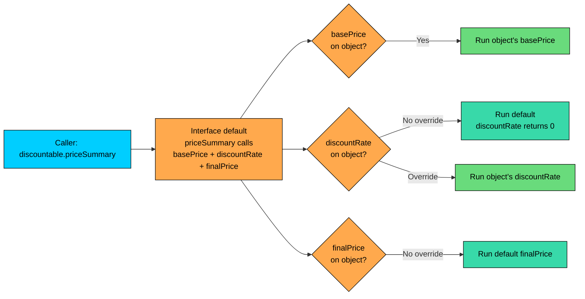
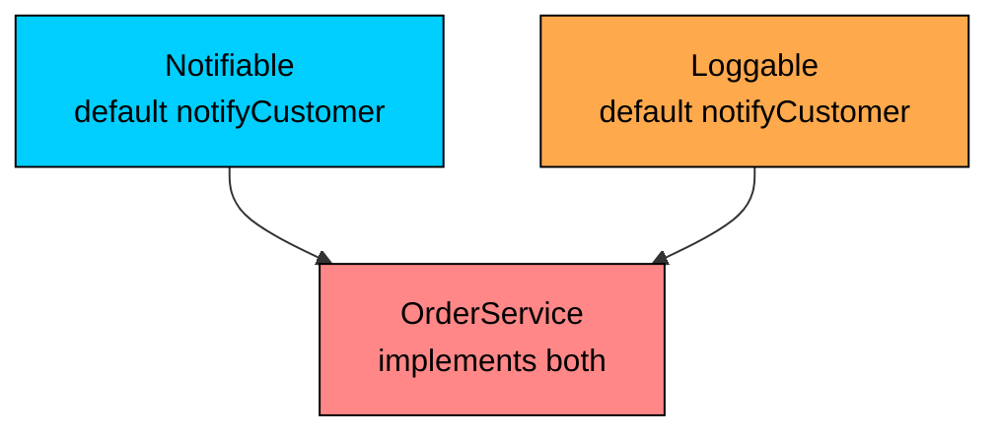
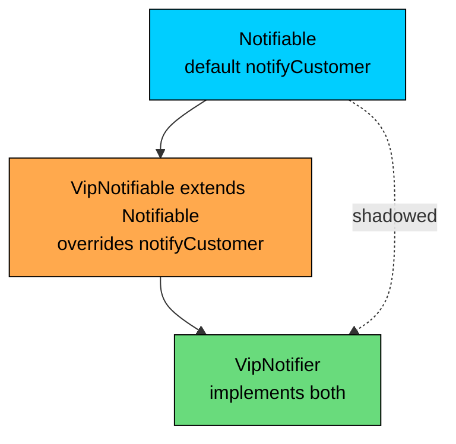

import React from 'react';
import CodeBlock from '../../../../components/ui/CodeBlock';
import Callout from '../../../../components/ui/Callout';

<div className="article-header">
  <div className="breadcrumb">
    <a href="/">Curated Notes</a>
    <span className="breadcrumb-separator">›</span>
    <span className="breadcrumb-current">Default Methods</span>
  </div>
  <h1>Default Methods</h1>
  <p style={{ color: 'var(--text-muted)', fontSize: '1.1rem', marginBottom: '16px', lineHeight: '1.6' }}>
    Master the essentials of Default Methods in this curated guide.
  </p>
  <div className="meta-info">
    <span className="meta-item">
      <svg width="14" height="14" viewBox="0 0 24 24" fill="none" stroke="currentColor" strokeWidth="2"><circle cx="12" cy="12" r="10"/><polyline points="12 6 12 12 16 14"/></svg>
      10 min read
    </span>
    <span className="difficulty-badge difficulty-badge--intermediate">Intermediate</span>
  </div>
</div>

<section className="content-section">

Interfaces started life as a pure contract: a list of method signatures that implementers had to fill in. That worked until Java 8 had to add new methods to interfaces like `Collection` and `Iterable` without breaking the millions of classes already implementing them. The fix was a small but powerful change to the language: an interface can now ship a method with a body, marked with the `default` keyword, that every implementing class inherits automatically. This lesson covers why default methods exist, how they behave, the diamond problem they introduce, and how the compiler forces it to be resolved.

---

## Why Default Methods Exist

Consider the situation Java's library team faced in 2014. The `java.util.Collection` interface had been around since 1998. Every `List`, `Set`, and `Queue` implementation across the ecosystem implemented it. Java 8 wanted to add `stream()` to `Collection` so any collection could produce a stream of its elements. The natural way would be to add a new abstract method to the interface.

That one line would have been catastrophic. Every class implementing `Collection` anywhere in the world would suddenly fail to compile because they didn't implement `stream()`. Library upgrades that should have been routine would have required code changes in every implementer.

A default method solves this. The interface ships with a working implementation. Existing classes inherit it without changing a line. Classes that want a smarter version can override it.


```java
import java.util.ArrayList;
import java.util.List;

public class WhyDefaultsExist {
    public static void main(String[] args) {
        List<String> wishlist = new ArrayList<>();
        wishlist.add("Wireless Mouse");
        wishlist.add("Mechanical Keyboard");

        // forEach is a default method on Iterable, added in Java 8.
        // ArrayList didn't change. It got forEach automatically.
        wishlist.forEach(item -> System.out.println("Want: " + item));
    }
}
```


`ArrayList` doesn't define `forEach`. It inherits the default from `Iterable`. The library team got to add behavior to an old interface and didn't break a single existing implementer. This is the design problem default methods were built to solve: backward-compatible interface evolution.

---

## Syntax and Basic Behavior

A default method looks like a regular method declaration except that it's inside an interface and it starts with the `default` keyword. The body is just a method body. No magic.


```java
public class DefaultSyntaxDemo {
    public static void main(String[] args) {
        Discountable book = new Book("Effective Java", 45.00);
        System.out.println("Original: $" + book.basePrice());
        System.out.println("Final: $" + book.finalPrice());
    }
}

interface Discountable {
    double basePrice();

    // Default method: gives every implementer a working finalPrice automatically.
    default double finalPrice() {
        return basePrice();
    }
}

class Book implements Discountable {
    private String name;
    private double price;

    public Book(String name, double price) {
        this.name = name;
        this.price = price;
    }

    @Override
    public double basePrice() {
        return price;
    }
}
```


`Book` only implements `basePrice()`. It picks up `finalPrice()` from the interface. The default body uses `basePrice()`, which dispatches polymorphically to `Book.basePrice()`, so the default can build on top of the abstract methods the implementer is required to provide.

A few rules sit underneath that example:


| Rule | What it means |
| --- | --- |
| `default` only inside an interface | A `default` method in a class is a compile error. |
| Always `public` | Interface members are implicitly public. Marking a default method `private` is a different feature, covered in a later chapter. |
| Has a body | The whole point. No body, no default. |
| Can call other interface methods | Including abstract ones, which dispatch to the implementer. |
| Counts as inherited, not implemented | Implementing classes don't have to write it, but they can. |


---

## Overriding a Default Method

Default methods are inherited, but they aren't sealed. An implementing class can override any default method to give a more specific implementation. The override looks exactly like overriding a normal method.


```java
public class OverrideDefault {
    public static void main(String[] args) {
        Discountable regular = new Book("Effective Java", 45.00);
        Discountable clearance = new ClearanceBook("Old Java Book", 30.00);

        System.out.println("Regular final: $" + regular.finalPrice());
        System.out.println("Clearance final: $" + clearance.finalPrice());
    }
}

interface Discountable {
    double basePrice();

    default double finalPrice() {
        return basePrice();
    }
}

class Book implements Discountable {
    protected String name;
    protected double price;

    public Book(String name, double price) {
        this.name = name;
        this.price = price;
    }

    @Override
    public double basePrice() {
        return price;
    }
}

class ClearanceBook extends Book {
    public ClearanceBook(String name, double price) {
        super(name, price);
    }

    // Override the default to apply a 40% clearance discount.
    @Override
    public double finalPrice() {
        return basePrice() * 0.6;
    }
}
```


`Book` inherits the default `finalPrice()` from `Discountable` and never overrides it. `ClearanceBook` overrides it to subtract 40%. When you call `finalPrice()` on a `Discountable` reference, the JVM does the same dynamic dispatch it does for any instance method: it looks at the actual object's class to pick the right body.

That property matters for performance and the design model. A default method dispatches like a virtual method. It is not a static call, it is not a copy paste into every implementer, and it is not pre resolved at compile time. The class that implements the interface either has its own override of the method (use that) or it does not (walk up to the interface's default).

Default method calls go through `invokeinterface`, which costs the same as any other virtual call: a method table lookup plus a jump. The JIT inlines monomorphic call sites like it does for class methods, so in normal code the cost is invisible.

---

## Default Methods Can Call Other Interface Methods

A useful pattern with default methods is layering. Declare a few small abstract methods that implementers must provide, then build richer default methods on top of them. The implementers only have to write the minimum, and they get the rest automatically.


```java
public class LayeredDefaults {
    public static void main(String[] args) {
        Discountable book = new Book("Effective Java", 45.00);
        Discountable bundle = new Bundle("Java Starter Kit", 120.00, 0.25);

        System.out.println(book.priceSummary());
        System.out.println(bundle.priceSummary());
    }
}

interface Discountable {
    double basePrice();

    default double discountRate() {
        return 0.0;
    }

    default double finalPrice() {
        return basePrice() * (1 - discountRate());
    }

    default String priceSummary() {
        return "Base: $" + basePrice()
            + ", Discount: " + (discountRate() * 100) + "%"
            + ", Final: $" + finalPrice();
    }
}

class Book implements Discountable {
    private String name;
    private double price;

    public Book(String name, double price) {
        this.name = name;
        this.price = price;
    }

    @Override
    public double basePrice() {
        return price;
    }
}

class Bundle implements Discountable {
    private String name;
    private double price;
    private double rate;

    public Bundle(String name, double price, double rate) {
        this.name = name;
        this.price = price;
        this.rate = rate;
    }

    @Override
    public double basePrice() {
        return price;
    }

    @Override
    public double discountRate() {
        return rate;
    }
}
```


`Book` only implements `basePrice()`. It inherits the default `discountRate()` (which returns 0), the default `finalPrice()`, and the default `priceSummary()`. `Bundle` adds an override for `discountRate()`, and everything else recomputes correctly because `finalPrice()` and `priceSummary()` call back into the interface methods, which dispatch to whichever implementation the actual object provides.

This is the same template-method pattern that abstract classes use, but it works without forcing implementers to extend a particular parent. A class can extend whatever it needs and still pick up the layered behavior by implementing the interface.





The diagram makes the dispatch chain visible. The default `priceSummary()` doesn't hard-code anything. Every call inside it goes back through dynamic dispatch, so each implementer can override whichever piece it cares about without rewriting the whole thing.

---

## The Diamond Problem

Single inheritance avoids one of the oldest headaches in object-oriented design: what happens when a class inherits the same method from two unrelated parents. Java's classes can only extend one parent, so the question used to never come up. A class can implement many interfaces, though, and once interfaces ship method bodies, the question is back. If two interfaces both define a `default` method with the same signature, which one does the implementing class get?

Consider this setup. An e-commerce app has two interfaces. `Notifiable` says "I can send a notification about an order" and provides a default body. `Loggable` says "I can log activity" and also provides a default `notify(String)` body (the names overlap on purpose to expose the conflict). A class that implements both interfaces inherits two competing defaults with the same signature.


```java
// THIS DOES NOT COMPILE.
public class DiamondConflict {
    public static void main(String[] args) {
        OrderService svc = new OrderService();
        svc.notifyCustomer("Order shipped");
    }
}

interface Notifiable {
    default void notifyCustomer(String message) {
        System.out.println("[Notification] " + message);
    }
}

interface Loggable {
    default void notifyCustomer(String message) {
        System.out.println("[Log] " + message);
    }
}

class OrderService implements Notifiable, Loggable {
    // Inherits two conflicting defaults. Compiler refuses.
}
```


The compiler's actual error reads:


```shell
error: class OrderService inherits unrelated defaults for notifyCustomer(String) from types Notifiable and Loggable
class OrderService implements Notifiable, Loggable {
^
```


This is Java's version of the diamond problem. Two unrelated paths bring the same default method into one class, and the language refuses to pick one without an explicit choice. The implementing class has to resolve the conflict explicitly.





The diagram is the classic diamond shape (minus the top point, since the two interfaces don't share an ancestor here). `OrderService` sits at the bottom and faces two defaults flowing into it from above. Java forces it to pick.

---

## Resolving the Conflict

The fix is to override the conflicting method in the implementing class. The override can hold any body, including calling one or both of the interface defaults explicitly with the `Interface.super.method(...)` syntax.


```java
public class DiamondResolved {
    public static void main(String[] args) {
        OrderService svc = new OrderService();
        svc.notifyCustomer("Order shipped");
    }
}

interface Notifiable {
    default void notifyCustomer(String message) {
        System.out.println("[Notification] " + message);
    }
}

interface Loggable {
    default void notifyCustomer(String message) {
        System.out.println("[Log] " + message);
    }
}

class OrderService implements Notifiable, Loggable {
    @Override
    public void notifyCustomer(String message) {
        // Call both parents in a chosen order.
        Notifiable.super.notifyCustomer(message);
        Loggable.super.notifyCustomer(message);
    }
}
```


The override solves the ambiguity in two ways at once. It signals the disambiguation to the compiler, and it documents exactly which behavior the class wants. `Notifiable.super.notifyCustomer(message)` is a special syntax that calls the default body from `Notifiable`. Without the `Notifiable.super` prefix, the compiler wouldn't know which interface's body was meant.

The override doesn't need to call either parent. It can do something completely different:


```java
class OrderService implements Notifiable, Loggable {
    @Override
    public void notifyCustomer(String message) {
        System.out.println("[OrderService] " + message + " (sent to all channels)");
    }
}
```


The implementing class is back in control. Once an override is in place, the inherited defaults are no longer in play unless the override explicitly calls them.

---

## Resolution Rule 1: Class Wins Over Interface

If a class inherits a method from both a superclass and an interface, the superclass version wins. The interface default is shadowed entirely. This rule keeps the language consistent with the pre-Java-8 world, where every method came from a class.


```java
public class ClassWinsDemo {
    public static void main(String[] args) {
        DiscountedOrder order = new DiscountedOrder();
        System.out.println(order.tag());
    }
}

interface Tagged {
    default String tag() {
        return "tag from interface";
    }
}

class Order {
    public String tag() {
        return "tag from class";
    }
}

class DiscountedOrder extends Order implements Tagged {
    // Inherits tag() from both Order (class) and Tagged (interface).
    // Class wins. No override needed.
}
```


`DiscountedOrder` doesn't write a single line about `tag()`, and the call resolves to `Order.tag()` because the superclass beats any interface default. This is sometimes called the "class wins" rule, and the reasoning is straightforward: an existing class hierarchy that worked before Java 8 still works the same way after Java 8, even with interface defaults around it.

To use the interface's version instead, override `tag()` in `DiscountedOrder` and explicitly call `Tagged.super.tag()`.

---

## Resolution Rule 2: More Specific Interface Wins

When two interfaces are involved and one extends the other, the more specific (sub-interface) one wins. The compiler doesn't see this as a conflict, because there's a clear precedence: the sub-interface refined the parent's contract.


```java
public class SubInterfaceWins {
    public static void main(String[] args) {
        VipNotifier notifier = new VipNotifier();
        notifier.notifyCustomer("Order shipped");
    }
}

interface Notifiable {
    default void notifyCustomer(String message) {
        System.out.println("[Standard] " + message);
    }
}

interface VipNotifiable extends Notifiable {
    @Override
    default void notifyCustomer(String message) {
        System.out.println("[VIP] " + message);
    }
}

class VipNotifier implements Notifiable, VipNotifiable {
    // Inherits notifyCustomer from both.
    // VipNotifiable extends Notifiable, so VipNotifiable wins. No conflict.
}
```


`VipNotifier` lists both interfaces in `implements`, but `VipNotifiable extends Notifiable`, so the compiler treats `VipNotifiable` as the more specific source. It picks `VipNotifiable.notifyCustomer` and never asks the class to disambiguate.





The dashed edge in the diagram shows that `Notifiable`'s default reaches `VipNotifier` only through `VipNotifiable`'s override. The original default never wins.

This rule is purely compile-time. It only affects which body the compiler binds to the call site through interface resolution. The runtime dispatch cost is identical.

---

## Resolution Rule 3: Otherwise, You Must Override

When neither rule 1 nor rule 2 applies (no superclass version, no sub-interface relationship between the conflicting interfaces), the class is stuck with two equally valid candidates. The compiler refuses to pick. The class must override the method, which is exactly what the `Notifiable` + `Loggable` example earlier did.

The three rules apply in order. The compiler walks through them top to bottom:


| Rule | What it checks | Outcome if matched |
| --- | --- | --- |
| 1. Class wins | Is there a superclass method with the same signature? | Use the superclass method. Interface defaults are ignored. |
| 2. More specific interface wins | Among interface candidates, is one a sub-interface of another? | Use the most specific interface's default. |
| 3. Otherwise | Two or more unrelated interface defaults remain. | Compile error. The class must override. |


---

## The `Interface.super.method()` Syntax

An override sometimes wants to reuse the original body. The syntax for calling a specific interface's default is `InterfaceName.super.methodName(args)`. It mirrors the `super.method()` syntax for calling a superclass method, but with the interface name attached.


```java
public class CallSpecificParent {
    public static void main(String[] args) {
        AuditedOrderService svc = new AuditedOrderService();
        svc.notifyCustomer("Order shipped");
    }
}

interface Notifiable {
    default void notifyCustomer(String message) {
        System.out.println("[Notification] " + message);
    }
}

interface Auditable {
    default void notifyCustomer(String message) {
        System.out.println("[Audit] " + message);
    }
}

class AuditedOrderService implements Notifiable, Auditable {
    @Override
    public void notifyCustomer(String message) {
        // Audit first, then notify. Order matters for the side effects.
        Auditable.super.notifyCustomer(message);
        Notifiable.super.notifyCustomer(message);
    }
}
```


Two notes on the syntax. First, the interface name has to be a direct parent of the class. Reaching two interfaces away with `GrandparentInterface.super.method()` doesn't work. Second, plain `super.method()` (without an interface name) refers to the superclass, not any interface. If the class doesn't extend a non-`Object` superclass, plain `super.method()` looks in `Object`, which is rarely the intended target.

A common mistake is forgetting the `.super` part:

**What's wrong with this code?**


```java
class AuditedOrderService implements Notifiable, Auditable {
    @Override
    public void notifyCustomer(String message) {
        Auditable.notifyCustomer(message); // compile error
    }
}
```


**Fix:**


```java
class AuditedOrderService implements Notifiable, Auditable {
    @Override
    public void notifyCustomer(String message) {
        Auditable.super.notifyCustomer(message);
    }
}
```


Without `.super`, `Auditable.notifyCustomer(message)` looks like an attempt to call a `static` method on the interface, which doesn't exist. The compiler reports `non-static method notifyCustomer(String) cannot be referenced from a static context`. The `.super` keyword selects the instance default method of this interface, called on the current object.

---

## Default Methods Can't Override `java.lang.Object`

There's one specific limit on what a default method can do: it can't override the methods that every class inherits from `java.lang.Object`. That means no `default String toString()`, no `default boolean equals(Object o)`, and no `default int hashCode()` on an interface. Java forbids this at the language level.


```java
// THIS DOES NOT COMPILE.
interface BadInterface {
    default String toString() {
        return "from interface";
    }
}
```


The compiler error reads:


```shell
error: default method toString in interface BadInterface overrides a member of java.lang.Object
    default String toString() {
                   ^
```


The rule is not arbitrary. Every class already inherits a working `toString()`, `equals()`, and `hashCode()` from `Object`. If interfaces could ship their own defaults for these, the resolution rules would have to answer a hard question: when a class inherits `toString()` from `Object` (a class) and from an interface (a default), which wins? Rule 1 says class wins, which would mean the interface's `toString` is always ignored without warning. That is error-prone: a `default toString()` would be expected to take effect and never would.

Java's designers cut the knot. Interfaces simply can't declare defaults for `Object` methods. For a custom `toString()` shared across all implementers of an interface, two options remain: provide an abstract class that implements the interface and overrides `toString()`, or accept that each implementing class needs to override `toString()` itself.

---

## Default Methods and the Single-Abstract-Method Rule

A **functional interface** is an interface with exactly one abstract method, which makes it usable as a lambda target. Default methods don't count toward that single-abstract-method rule. An interface can have one abstract method and ten default methods and still be a valid functional interface. The main point here is that adding default methods doesn't break the SAM rule.

---

## A Realistic Example: Notification Channels

Here's a more substantial example. An e-commerce app sends notifications about orders through different channels (email, SMS, push). Each channel implements a small set of abstract methods, and the interface ships rich default behavior on top.


```java
public class NotificationDemo {
    public static void main(String[] args) {
        NotificationChannel email = new EmailChannel("alice@example.com");
        NotificationChannel sms = new SmsChannel("+1-555-0100");

        email.notifyOrderShipped("ORD-9381");
        sms.notifyOrderShipped("ORD-9381");
    }
}

interface NotificationChannel {
    String channelName();

    void send(String recipient, String message);

    String recipient();

    default void notifyOrderShipped(String orderId) {
        String message = "Your order " + orderId + " has shipped.";
        send(recipient(), formatted(message));
    }

    default String formatted(String message) {
        return "[" + channelName() + "] " + message;
    }
}

class EmailChannel implements NotificationChannel {
    private String email;

    public EmailChannel(String email) {
        this.email = email;
    }

    @Override
    public String channelName() {
        return "Email";
    }

    @Override
    public String recipient() {
        return email;
    }

    @Override
    public void send(String recipient, String message) {
        System.out.println("To " + recipient + ": " + message);
    }
}

class SmsChannel implements NotificationChannel {
    private String phone;

    public SmsChannel(String phone) {
        this.phone = phone;
    }

    @Override
    public String channelName() {
        return "SMS";
    }

    @Override
    public String recipient() {
        return phone;
    }

    @Override
    public void send(String recipient, String message) {
        System.out.println("Text " + recipient + ": " + message);
    }
}
```


Each channel implements three small methods: `channelName()`, `recipient()`, and `send(...)`. The interface builds the higher-level `notifyOrderShipped(...)` and `formatted(...)` defaults on top of them. Adding a `PushChannel` later only requires implementing those three methods; the rest comes from the interface. A channel that formats messages differently can override `formatted(...)` without touching `notifyOrderShipped(...)`.

This is the same template-method pattern an abstract class would provide. The difference is reach: a class can only extend one abstract class, but it can implement many interfaces. `EmailChannel` is free to extend some unrelated class (a base `Service`, say) and still pick up the notification template by implementing `NotificationChannel`.

---

## When to Use Default Methods and When Not To

Default methods are powerful, and like most powerful tools, they pay off in a few specific situations and create mess everywhere else. A reasonable guide:

**Use default methods when:**

- Evolving a public interface where adding a new method would break every existing implementer. This is the original motivation.
- Layering common behavior on a small set of abstract methods, like the `priceSummary()` example. Each implementer writes the minimum; the interface fills in the rest.
- Template-method behavior is wanted without forcing implementers into a particular class hierarchy.

**Avoid default methods when:**

- State is needed. Interfaces have no fields. A default method can't store anything between calls. An `int counter` calls for an abstract class, not an interface.
- The behavior is non-trivial and shared by everything. An abstract class is usually clearer because it can hold helper fields and have a constructor.
- The default is just a placeholder so implementers don't have to write the method. That's a code smell; the implementers probably do need to think about it, and a default-with-empty-body just hides the question.

Default methods are an interface evolution mechanism first and a "free behavior" mechanism second. Treat the second use carefully.

---

## Performance Notes

A default method call uses the JVM's `invokeinterface` bytecode (the same one used for any interface call) and goes through the same method-table lookup that interface methods always have. Once the JIT decides a particular call site is monomorphic (only one implementing class shows up), it inlines the method body directly and the dispatch disappears.

The cost difference between an abstract method call on an interface and a default method call on an interface is zero. They both compile to `invokeinterface`, they both look up the same way, and they both inline when the JIT can prove it is safe. The only thing the `default` keyword changes is what happens when the implementing class does not provide the method: it falls back to the interface's body instead of failing.

Do not avoid default methods on performance grounds. The dispatch cost is the same as any other interface method call, which is the same as any other virtual call. Optimize for clarity; profile before assuming.

</section>
