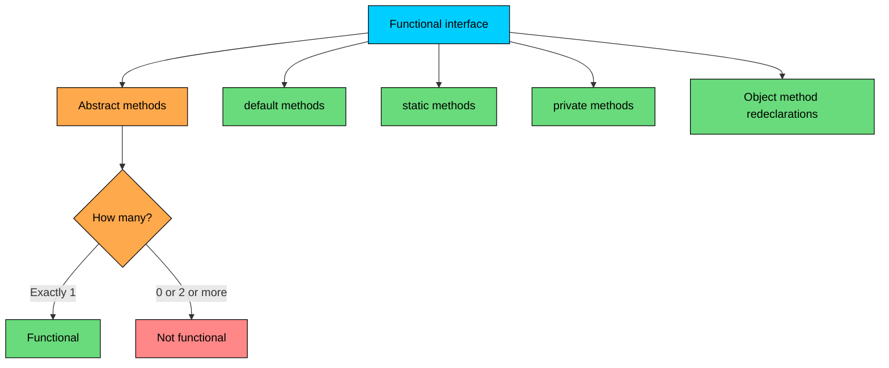
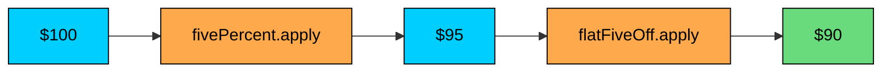

import React from 'react';
import CodeBlock from '../../../../components/ui/CodeBlock';
import Callout from '../../../../components/ui/Callout';

<div className="article-header">
  <div className="breadcrumb">
    <a href="/">Curated Notes</a>
    <span className="breadcrumb-separator">›</span>
    <span className="breadcrumb-current">Functional Interfaces</span>
  </div>
  <h1>Functional Interfaces</h1>
  <p style={{ color: 'var(--text-muted)', fontSize: '1.1rem', marginBottom: '16px', lineHeight: '1.6' }}>
    Master the essentials of Functional Interfaces in this curated guide.
  </p>
  <div className="meta-info">
    <span className="meta-item">
      <svg width="14" height="14" viewBox="0 0 24 24" fill="none" stroke="currentColor" strokeWidth="2"><circle cx="12" cy="12" r="10"/><polyline points="12 6 12 12 16 14"/></svg>
      10 min read
    </span>
    <span className="difficulty-badge difficulty-badge--intermediate">Intermediate</span>
  </div>
</div>

<section className="content-section">

A functional interface is an interface that declares exactly one abstract method. That single-method rule is what makes it special, because it's the shape Java needs in order to let you write a lambda expression in place of an object. This lesson defines the rule precisely, walks through the `@FunctionalInterface` annotation that enforces it at compile time, lists what does and doesn't count toward the "exactly one" limit, and shows why this little corner of the interface system is the bridge between the abstraction we've been building all section and lambda syntax.

---

## The Definition: One Abstract Method

A functional interface is an interface with exactly one abstract method. That's the entire definition. The acronym SAM (Single Abstract Method) shows up in older Java literature and JVM specifications for the same idea. Whether the interface has zero or two abstract methods, it stops being a functional interface, and you lose the ability to assign a lambda to it.

Here's the smallest functional interface you can write.


```java
public class DiscountStrategyDemo {
    public static void main(String[] args) {
        DiscountStrategy flat = new DiscountStrategy() {
            @Override
            public double apply(double price) {
                return price - 5.0;
            }
        };

        System.out.println("Final price: $" + flat.apply(49.99));
    }
}

interface DiscountStrategy {
    double apply(double price);
}
```


`DiscountStrategy` declares one abstract method, `apply`. That one method is what an implementation has to provide. The example uses an anonymous class to plug in a flat-five-dollars-off rule. Six lines to write, but the shape (one method, one implementation) is exactly what lets you replace the whole anonymous class with a one-line lambda later.

The "exactly one" count is strict. Add a second abstract method and the interface stops being functional.

---

## The `@FunctionalInterface` Annotation

Java 8 introduced an annotation named `@FunctionalInterface`. It's a marker the compiler reads to check that the interface really does have exactly one abstract method. The annotation is optional. An interface with one abstract method is functional whether you annotate it or not. The annotation just turns "I think this is a functional interface" into a compile-time guarantee, so you find out about violations the moment you save the file, not when some downstream caller fails to assign a lambda.


```java
public class PriceFilterDemo {
    public static void main(String[] args) {
        PriceFilter under50 = new PriceFilter() {
            @Override
            public boolean keep(double price) {
                return price < 50.0;
            }
        };

        System.out.println("Keep $29.99? " + under50.keep(29.99));
        System.out.println("Keep $79.99? " + under50.keep(79.99));
    }
}

@FunctionalInterface
interface PriceFilter {
    boolean keep(double price);
}
```


The interface is exactly as functional with or without the `@FunctionalInterface` line. What the annotation buys you is a safety net. If a teammate edits `PriceFilter` and adds a second abstract method by accident, the compiler stops them and points at the annotation. Without the annotation, the interface stops being assignable to a lambda without warning, and the breakage shows up wherever someone tries to use it that way.

Put `@FunctionalInterface` on every interface you intend to use with lambdas. It costs one line and prevents a category of mistake.

---

## What Doesn't Count Against the SAM Rule

"Exactly one abstract method" may sound restrictive for interfaces with lots of methods. The rule only counts methods that need an implementation, which excludes a surprising amount.

Four categories of method live inside a functional interface without affecting its SAM count:


| Method kind | Counts against SAM? | Why |
| --- | --- | --- |
| `default` method | No | Has a body already, no implementation needed |
| `static` method | No | Belongs to the interface, not to implementations |
| `private` method | No | Helper for default methods, not part of the contract |
| Override of a public `Object` method (`equals`, `hashCode`, `toString`) | No | Every class already inherits a body from `Object` |


You can pile on as many of each as you want. The interface stays functional as long as there's exactly one abstract method that isn't already covered by `Object`. Here's a deliberately busy example.


```java
public class CartValidatorDemo {
    public static void main(String[] args) {
        CartValidator notEmpty = new CartValidator() {
            @Override
            public boolean isValid(int itemCount) {
                return itemCount > 0;
            }
        };

        System.out.println("Empty cart valid? " + notEmpty.isValid(0));
        System.out.println("Three items valid? " + notEmpty.isValid(3));
        System.out.println("Explanation: " + notEmpty.explain(0));
        System.out.println("Library name: " + CartValidator.libraryName());
    }
}

@FunctionalInterface
interface CartValidator {

    boolean isValid(int itemCount);

    default String explain(int itemCount) {
        if (isValid(itemCount)) {
            return "Cart with " + itemCount + " items passes the rule";
        }
        return "Cart with " + itemCount + " items fails the rule";
    }

    default String summary(int itemCount) {
        return joinPrefix() + explain(itemCount);
    }

    private String joinPrefix() {
        return "[validator] ";
    }

    static String libraryName() {
        return "cart-validators-v1";
    }

    @Override
    boolean equals(Object other);

    @Override
    String toString();
}
```


Look at the interface body. There's a default method (`explain`), another default (`summary`), a private helper (`joinPrefix`), a static factory hint (`libraryName`), and two redeclared `Object` methods (`equals`, `toString`). The only method that actually needs an implementation is `isValid`. The `@FunctionalInterface` annotation passes, the lambda-compatible shape is preserved, and the implementer only has to write one method body.

The redeclared `Object` methods are the most surprising of the four. Why are they allowed? Because every class that implements the interface, even an anonymous one, already inherits an `equals`, `hashCode`, and `toString` from `java.lang.Object`. The interface declaring them again doesn't create new work for the implementer. It just narrows or documents the contract, and the compiler knows that `Object`'s versions cover them. So they don't count.





The diagram funnels every method kind into one of two buckets: counted or not counted. Only the "abstract" bucket has a quota, and that quota is exactly one.

---

## Why Functional Interfaces Matter: The Lambda Bridge

Up to now, when you wanted to plug a small piece of behavior into a method, you wrote an anonymous class. That works, but it's verbose. Six lines for something that's conceptually "given a price, return the discounted price". A lambda expression cuts those six lines down to one, and the shape of a functional interface is exactly what lets the language do that.

Look at the `DiscountStrategy` from the first section, written with an anonymous class and then with a lambda:


```java
public class LambdaBridge {
    public static void main(String[] args) {
        // Anonymous class: the verbose form
        DiscountStrategy flat = new DiscountStrategy() {
            @Override
            public double apply(double price) {
                return price - 5.0;
            }
        };

        // Lambda: the compact form, same interface
        DiscountStrategy percent = price -> price * 0.90;

        System.out.println("Flat: $" + flat.apply(49.99));
        System.out.println("Percent: $" + percent.apply(49.99));
    }
}

@FunctionalInterface
interface DiscountStrategy {
    double apply(double price);
}
```


Both `flat` and `percent` are `DiscountStrategy` values. The compiler treats the lambda `price -> price * 0.90` as an implementation of the interface's one abstract method. The reason the lambda works is precisely that `DiscountStrategy` has exactly one abstract method. With zero, there'd be nothing to implement. With two, the compiler couldn't tell which method the lambda's body refers to.

Creating an anonymous class instance creates a new class file (`OuterClass$1.class`) and a new instance every time the line runs. A lambda is much cheaper. The JVM uses `invokedynamic` internally and, in most cases, reuses a single instance per call site for stateless lambdas. The performance difference is small in cold paths and noticeable in hot loops.

A functional interface is what makes a lambda legal at all. Every lambda in Java is assigned to, returned from, or passed as a functional-interface type.

A small example of how the call sites get cleaner once lambdas are on the table:


```java
import java.util.List;

public class StrategyDemo {
    public static double finalPrice(double price, DiscountStrategy strategy) {
        return strategy.apply(price);
    }

    public static void main(String[] args) {
        List<DiscountStrategy> strategies = List.of(
            price -> price - 5.0,
            price -> price * 0.90,
            price -> price > 100 ? price - 20 : price
        );

        double cartPrice = 79.99;
        for (DiscountStrategy s : strategies) {
            System.out.println("Result: $" + finalPrice(cartPrice, s));
        }
    }
}

@FunctionalInterface
interface DiscountStrategy {
    double apply(double price);
}
```


Three different pricing rules in three lines, none of which need a named class. The `finalPrice` method doesn't know or care which strategy got passed; it just calls `apply`. That's the strategy pattern shrunk down to its essentials, and the functional-interface contract is what holds the whole thing together.

The lambda story is far richer than this. The parameter list can be empty or hold many parameters, the body can be a single expression or a block, you can reference enclosing variables, and there are method references (`String::length`) that capture an existing method as a lambda. Every one of those features hinges on the receiving type being a functional interface.

---

## Pre-Java-8 Functional Interfaces

Functional interfaces weren't added in Java 8. Several interfaces in the standard library happened to fit the SAM shape before lambdas existed, and Java 8 retroactively labeled them functional. They picked up the `@FunctionalInterface` annotation, and code that already used them with anonymous classes kept working, but newer code could now write them as lambdas.

The three most commonly used are `Runnable`, `Comparator`, and `Callable`.


```java
import java.util.concurrent.Callable;
import java.util.Comparator;
import java.util.List;
import java.util.ArrayList;

public class PreJava8Interfaces {
    public static void main(String[] args) throws Exception {
        // Runnable: no args, no return value
        Runnable greet = () -> System.out.println("Order received");
        greet.run();

        // Comparator: two args, returns int
        List<String> products = new ArrayList<>(List.of("Headphones", "USB Cable", "Mouse"));
        Comparator<String> byLength = (a, b) -> a.length() - b.length();
        products.sort(byLength);
        System.out.println("Sorted by length: " + products);

        // Callable: no args, returns a value (and can throw)
        Callable<Double> computeShipping = () -> 5.99;
        System.out.println("Shipping cost: $" + computeShipping.call());
    }
}
```


`Runnable.run()` is the one abstract method on `Runnable`. `Comparator.compare(a, b)` is the one abstract on `Comparator` (it has plenty of default methods like `reversed` and `thenComparing`, but only one abstract). `Callable.call()` is the one abstract on `Callable`. All three were functional in shape long before the `@FunctionalInterface` annotation existed; Java 8 just made the relationship official.

`Comparator` is a good demonstration of the "defaults don't count" rule in production code. The interface looks heavy. It has `reversed`, `thenComparing`, `thenComparingInt`, `thenComparingLong`, `thenComparingDouble`, `nullsFirst`, `nullsLast`, `comparing`, plus several others. Most of those are defaults or statics. The only abstract method is `compare`, which is what your lambda implements.


| Interface | Abstract method | Where it shows up |
| --- | --- | --- |
| `Runnable` | `run()` | Threads, executors, scheduled tasks |
| `Comparator<T>` | `compare(T, T)` | Sorting collections, priority queues |
| `Callable<V>` | `call()` | Tasks that return a value, futures |
| `Iterable<T>` | `iterator()` | `for-each` loops on custom collections |
| `ActionListener` | `actionPerformed(...)` | Swing UI event handlers |


These were all functional from day one of their existence. They just had to wait for lambdas to make calling them pleasant.

---

## Defining Your Own Functional Interface

Most of the time a custom functional interface isn't needed, because `java.util.function` already has shapes for almost every common signature. But sometimes a custom interface reads better at the call site, especially when the name carries domain meaning.

Here are three custom functional interfaces an e-commerce codebase might define.


```java
import java.util.List;
import java.util.ArrayList;

public class CustomFunctionalInterfaces {
    public static void main(String[] args) {
        DiscountStrategy festive = price -> price * 0.85;
        PriceFilter underTwenty = price -> price < 20.0;
        OrderValidator hasName = order -> order.customerName != null && !order.customerName.isBlank();

        double cartPrice = 50.0;
        System.out.println("Festive price: $" + festive.apply(cartPrice));
        System.out.println("Is $14.99 cheap enough? " + underTwenty.keep(14.99));

        Order placed = new Order("Alice", List.of("Mouse"));
        Order anonymous = new Order("", new ArrayList<>());
        System.out.println("Order 1 valid? " + hasName.check(placed));
        System.out.println("Order 2 valid? " + hasName.check(anonymous));
    }
}

@FunctionalInterface
interface DiscountStrategy {
    double apply(double price);
}

@FunctionalInterface
interface PriceFilter {
    boolean keep(double price);
}

@FunctionalInterface
interface OrderValidator {
    boolean check(Order order);
}

class Order {
    String customerName;
    List<String> items;

    Order(String customerName, List<String> items) {
        this.customerName = customerName;
        this.items = items;
    }
}
```


Each interface has one abstract method with a domain-specific name. `DiscountStrategy.apply`, `PriceFilter.keep`, `OrderValidator.check`. A method that takes one of these as a parameter reads almost like English: `applyDiscount(strategy)`, `filterCart(filter)`, `validateOrder(validator)`. You could express all three with the built-in `Function<Double, Double>`, `Predicate<Double>`, and `Predicate<Order>` from `java.util.function`. The trade-off is name clarity. A `DiscountStrategy` parameter says exactly what it's for; a `Function<Double, Double>` could be anything.

You can also pack in default methods to compose strategies, which is where custom functional interfaces start paying real dividends.


```java
public class ComposableStrategies {
    public static void main(String[] args) {
        DiscountStrategy fivePercent = price -> price * 0.95;
        DiscountStrategy flatFiveOff = price -> price - 5.0;
        DiscountStrategy combined = fivePercent.andThen(flatFiveOff);

        double cartPrice = 100.0;
        System.out.println("5% off: $" + fivePercent.apply(cartPrice));
        System.out.println("Flat $5 off: $" + flatFiveOff.apply(cartPrice));
        System.out.println("Both, in order: $" + combined.apply(cartPrice));
    }
}

@FunctionalInterface
interface DiscountStrategy {
    double apply(double price);

    default DiscountStrategy andThen(DiscountStrategy next) {
        return price -> next.apply(this.apply(price));
    }
}
```


`andThen` is a default method that takes another `DiscountStrategy` and returns a brand-new strategy that runs `this` first and pipes the result into `next`. The implementer of a `DiscountStrategy` never sees `andThen`. It comes free with the interface. The functional shape is preserved (`apply` is still the only abstract), so a lambda can implement `DiscountStrategy` and immediately call `.andThen(otherStrategy)` on it.





The chained pipeline runs left to right: 100 becomes 95 after the percent strategy, then 90 after the flat-amount strategy. Each box is one of the lambdas; the arrows are the data flow that `andThen` set up.

This composition pattern is everywhere in Java 8+ code. `Function.andThen`, `Predicate.and`, `Predicate.or`, `Comparator.thenComparing`. All built on the same recipe: keep one abstract method, add default methods that produce new instances of the interface itself.

---

## When Things Break: Misusing `@FunctionalInterface`

The annotation helps when someone modifies the interface and breaks the SAM rule. Both directions of breakage produce clear compile errors. Knowing what the errors look like helps you read them when they show up.

**Case 1: Zero abstract methods.** An interface tagged `@FunctionalInterface` with no abstract methods fails to compile.


```java
@FunctionalInterface
interface NotReallyFunctional {
    default String greet() {
        return "hello";
    }
}
```


The compiler reports:


```shell
error: Unexpected @FunctionalInterface annotation
@FunctionalInterface
^
  NotReallyFunctional is not a functional interface
    no abstract method found in interface NotReallyFunctional
```


The fix is to either remove the annotation (it's no longer a functional interface, and that's fine if you didn't need it to be) or add an abstract method.

**Case 2: Two or more abstract methods.** Same annotation, opposite mistake.


```java
@FunctionalInterface
interface TooManyMethods {
    double apply(double price);
    boolean keep(double price);
}
```


The compiler reports:


```shell
error: Unexpected @FunctionalInterface annotation
@FunctionalInterface
^
  TooManyMethods is not a functional interface
    multiple non-overriding abstract methods found in interface TooManyMethods
```


Two abstracts can't both be the SAM. Either remove the annotation and treat it as a regular interface (you'll never assign a lambda to it), or split the interface into two functional ones, or give one of the methods a default implementation. Each choice changes the design, which is the point. The annotation forces the conversation.

**Case 3: The hidden gotcha, inherited abstracts.** If an interface extends another interface, the count includes inherited abstracts.


```java
interface BaseStrategy {
    double apply(double price);
}

@FunctionalInterface
interface ExtendedStrategy extends BaseStrategy {
    double applyWithTax(double price);
}
```


The compiler reports:


```shell
error: Unexpected @FunctionalInterface annotation
@FunctionalInterface
^
  ExtendedStrategy is not a functional interface
    multiple non-overriding abstract methods found in interface ExtendedStrategy
```


`ExtendedStrategy` inherits `apply` from `BaseStrategy` and declares `applyWithTax` directly. That's two abstracts, and the SAM rule fails. The fix depends on intent: either drop the annotation, give `applyWithTax` a default implementation, or rethink the hierarchy so the extending interface really only needs one abstract.


&gt; **INFO**
&gt;
&gt; **Real-world tip:** When an `@FunctionalInterface` error fires after editing an interface, look at inherited methods first. Errors in interface hierarchies often come from forgetting that an extended interface contributes its own abstract method to the count.


**Case 4: An `Object`-redeclared method does not count.** Sanity check that this case is allowed.


```java
@FunctionalInterface
interface OrderValidator {
    boolean check(Order order);

    @Override
    boolean equals(Object other);

    @Override
    String toString();
}
```


This compiles fine. There's one abstract that isn't already covered by `Object` (`check`), and the two redeclarations of `Object` methods don't count. The annotation passes.

---

## Functional Interfaces and Method Resolution

A lambda can only be assigned to a functional interface type. The compiler uses the target type (the variable's declared type or the parameter type) to figure out which functional interface the lambda implements. The lambda itself is not a value with a fixed type. Its type is determined entirely by where it lands.


```java
public class TargetTyping {
    public static void main(String[] args) {
        // Same lambda, two different functional interface types
        DiscountStrategy discount = price -> price * 0.90;
        PriceFilter filter = price -> price < 50.0;

        // The compiler can't infer a type for a "bare" lambda
        // var bare = price -> price * 0.90;  // compile error: not a statement / lambda not in valid context

        System.out.println("Discounted $50: $" + discount.apply(50.0));
        System.out.println("Keep $25? " + filter.keep(25.0));
    }
}

@FunctionalInterface
interface DiscountStrategy {
    double apply(double price);
}

@FunctionalInterface
interface PriceFilter {
    boolean keep(double price);
}
```


The first lambda becomes a `DiscountStrategy` because that's the declared type of `discount`. The second becomes a `PriceFilter` for the same reason. A standalone `var x = price -> price * 0.90` fails to compile because the compiler has no target type to bind the lambda to. The lambda's signature happens to match both interfaces, but the target tells the compiler which one to actually use.

The functional interface type at the assignment site is what gives the lambda its identity.

---

## Performance Notes

Two small performance notes. Both relate to how the JVM realizes a functional-interface implementation.

First, lambdas are generally cheaper than anonymous classes. When `javac` compiles an anonymous class, it emits a separate `.class` file and each `new SomeInterface() { ... }` line allocates a fresh object. A lambda, by contrast, compiles to an `invokedynamic` instruction that the JVM realizes through a `LambdaMetafactory` call. For stateless lambdas (lambdas that don't capture any enclosing variables), the JVM is free to cache and reuse a single instance per call site. That means a stateless lambda inside a hot loop costs essentially nothing per iteration after the first call.

Second, capturing lambdas (lambdas that reference variables from the enclosing scope) are slightly more expensive than stateless ones. Each capture allocates a small object that holds the captured values. The cost is still low and usually invisible at the application level, but it matters when micro-optimizing tight inner loops. If a lambda is allocated per iteration and GC pressure is a concern, check whether you can hoist it out of the loop or make it stateless.

A stateless lambda assigned at startup and reused everywhere is essentially free. A capturing lambda inside a 1-million-iteration loop produces 1 million tiny objects unless the JIT manages to eliminate them. Profile before optimizing.

Both of these are minor in normal application code. The main reason to choose lambdas over anonymous classes is readability, not speed. The performance edge is a bonus.

---

## A Worked Example: A Pluggable Pricer

Putting the pieces together, a small e-commerce pricing pipeline built entirely on functional interfaces. It's a typical pattern for keeping pricing rules out of the cart code.


```java
import java.util.List;

public class PricingPipeline {

    public static double finalPrice(double basePrice, List<Pricer> pricers) {
        double current = basePrice;
        for (Pricer p : pricers) {
            current = p.price(current);
        }
        return current;
    }

    public static void main(String[] args) {
        Pricer addShipping = price -> price + 5.99;
        Pricer applyMemberDiscount = price -> price * 0.95;
        Pricer addTax = price -> price * 1.0875;

        List<Pricer> standardPipeline = List.of(applyMemberDiscount, addShipping, addTax);

        double cartSubtotal = 79.99;
        double finalAmount = finalPrice(cartSubtotal, standardPipeline);

        System.out.println("Subtotal: $" + cartSubtotal);
        System.out.println("Final amount: $" + String.format("%.2f", finalAmount));
    }
}

@FunctionalInterface
interface Pricer {
    double price(double currentPrice);
}
```


Three pricing rules, all written as one-line lambdas, all assigned to a `Pricer` functional interface. The pipeline is just a list of `Pricer` values. The `finalPrice` method walks the list and runs each step. Adding a new rule (a coupon, a gift card, a regional surcharge) takes one line. Removing one takes one line. Reordering is just rearranging the list.

The whole thing works because `Pricer` has exactly one abstract method, which lets a lambda satisfy it cleanly. Without the SAM constraint, the lambdas would stop being legal, and anonymous classes would be required for every rule. The functional-interface contract is invisible plumbing, but it's what makes this style of code possible.

</section>
