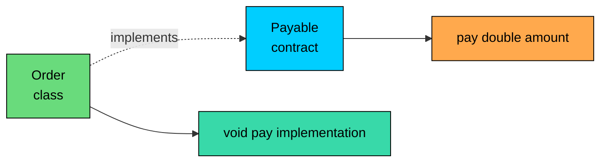
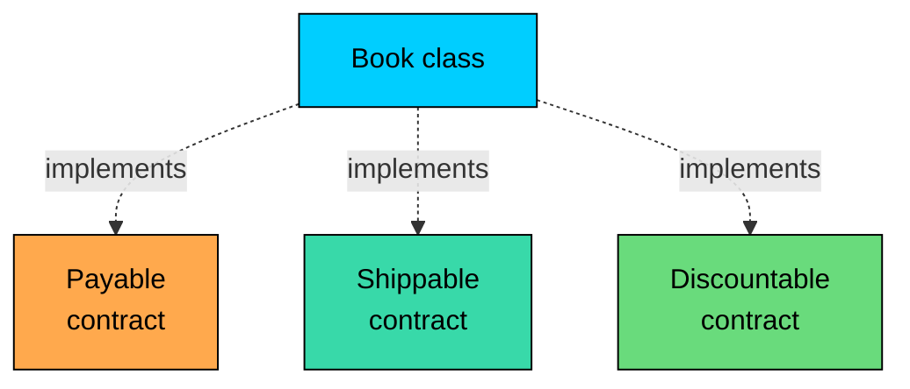
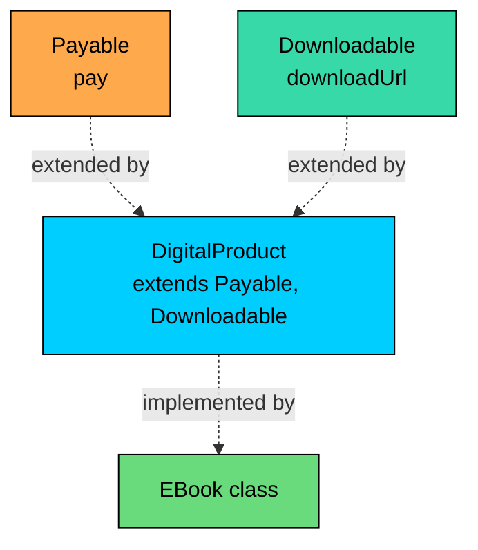
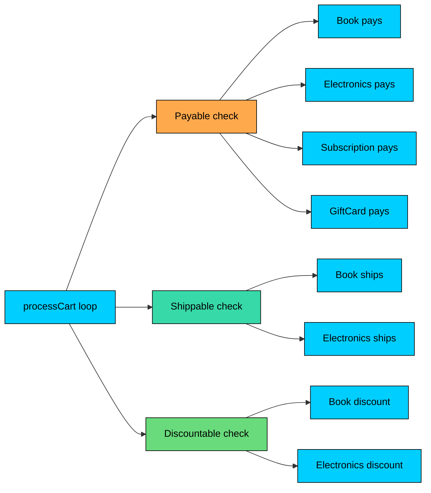

import React from 'react';
import CodeBlock from '../../../../components/ui/CodeBlock';
import Callout from '../../../../components/ui/Callout';

<div className="article-header">
  <div className="breadcrumb">
    <a href="/">Curated Notes</a>
    <span className="breadcrumb-separator">›</span>
    <span className="breadcrumb-current">Interfaces</span>
  </div>
  <h1>Interfaces</h1>
  <p style={{ color: 'var(--text-muted)', fontSize: '1.1rem', marginBottom: '16px', lineHeight: '1.6' }}>
    Master the essentials of Interfaces in this curated guide.
  </p>
  <div className="meta-info">
    <span className="meta-item">
      <svg width="14" height="14" viewBox="0 0 24 24" fill="none" stroke="currentColor" strokeWidth="2"><circle cx="12" cy="12" r="10"/><polyline points="12 6 12 12 16 14"/></svg>
      10 min read
    </span>
    <span className="difficulty-badge difficulty-badge--intermediate">Intermediate</span>
  </div>
</div>

<section className="content-section">

The previous two lessons used `abstract class` to share partial behavior between related types. That works when the subtypes really are related (every `Subscription` is a kind of `Product`). It falls apart the moment the design needs to express "these unrelated types all support paying" or "these unrelated types are all shippable." Java's answer is the `interface`: a pure contract that any class can sign, regardless of where it lives in the class hierarchy. This lesson covers what an interface is, how a class implements one or many of them, and why programming against an interface tends to age better than programming against a concrete class.

---

## What an Interface Is

An interface is a named contract. It lists method signatures that a class promises to provide, without saying how. It's like a job description: a `Payable` interface says "anything claiming to be `Payable` must answer `pay(amount)`," and a class signs up by promising to deliver.

The smallest possible interface and a class that implements it:


```java
public class FirstInterface {
    public static void main(String[] args) {
        Payable order = new Order(149.99);
        order.pay(149.99);
    }
}

interface Payable {
    void pay(double amount);
}

class Order implements Payable {
    double total;

    Order(double total) {
        this.total = total;
    }

    @Override
    public void pay(double amount) {
        System.out.println("Charging $" + amount + " for order");
    }
}
```


Three details about that snippet. The interface uses the `interface` keyword, not `class`. The method `pay` has no body, just a signature and a semicolon. The class uses `implements Payable` to declare that it provides every method the interface requires.

If `Order` had forgotten to implement `pay`, the compiler would have rejected the file. An interface is a promise the compiler enforces. Partial implementation is not allowed. Either every method has a body in the implementing class, or the class itself has to be `abstract` and pass the obligation down to its own subclasses.

The interface here is a pure contract: no fields with state, no implementation, just a name and a method signature. That's the original (pre-Java-8) idea of an interface, and it's still the simplest way to think about it. For this lesson, treat interfaces as contracts with method signatures and constants, nothing more.





The diagram shows the split: the interface describes a method that must exist, the class supplies the actual body. The dashed arrow ("implements") is the language-level promise that the class will deliver every signature the interface lists.

---

## Why Interfaces Exist

Abstract classes work fine when "is-a" makes sense (a `Book` is a `Product`, a `Subscription` is a `Product`). But software is full of "can-do" relationships that don't fit a single tree. A `PhysicalBook` and a `BackpackOrder` are completely unrelated as data, but both _can be shipped_. A digital `EBook`, a one-time `Order`, and a `SubscriptionRenewal` are unrelated, but all three _can be paid for_. Forcing every "can-do" capability into a class hierarchy creates either deep, brittle trees or duplicated code. Interfaces describe the capability separately from the data.

A small version of the problem without interfaces:


```java
public class WithoutInterfaces {
    public static void main(String[] args) {
        Book book = new Book("Effective Java", 45.00);
        Subscription sub = new Subscription("AlgoMaster Pro", 9.99);

        // We want to "pay for" each one. But there's no shared type.
        book.payForBook(book.price);
        sub.payForSub(sub.price);
    }
}

class Book {
    String title;
    double price;
    Book(String title, double price) {
        this.title = title; this.price = price;
    }
    public void payForBook(double amount) {
        System.out.println("Paid $" + amount + " for book " + title);
    }
}

class Subscription {
    String plan;
    double price;
    Subscription(String plan, double price) {
        this.plan = plan; this.price = price;
    }
    public void payForSub(double amount) {
        System.out.println("Paid $" + amount + " for subscription " + plan);
    }
}
```


The code works, but it's stuck. A `processPayment` method would have to know about every concrete type. Each new product would force every payment handler to grow a new branch. The two classes have nothing in common as data, so making them share a parent class would misrepresent the relationship.

Interfaces name the capability without inventing a fake hierarchy.


```java
public class WithInterfaces {
    public static void main(String[] args) {
        Payable[] charges = {
            new Book("Effective Java", 45.00),
            new Subscription("AlgoMaster Pro", 9.99)
        };

        for (Payable p : charges) {
            p.pay();
        }
    }
}

interface Payable {
    void pay();
}

class Book implements Payable {
    String title;
    double price;
    Book(String title, double price) {
        this.title = title; this.price = price;
    }
    @Override
    public void pay() {
        System.out.println("Paid $" + price + " for book " + title);
    }
}

class Subscription implements Payable {
    String plan;
    double price;
    Subscription(String plan, double price) {
        this.plan = plan; this.price = price;
    }
    @Override
    public void pay() {
        System.out.println("Paid $" + price + " for subscription " + plan);
    }
}
```


`Book` and `Subscription` still have nothing in common as data, and that's fine. They both signed the `Payable` contract, so a `Payable[]` can hold either, and the loop dispatches at runtime to each one's implementation. New product types plug in by implementing `Payable`, no existing code changes.

That benefit has three concrete names:

- **Decoupling.** Callers depend on `Payable`, not on `Book` or `Subscription`. Adding a new payable type doesn't ripple through callers.
- **Polymorphism without a class hierarchy.** Two classes with unrelated data can still be treated uniformly through a shared interface.
- **Testability.** A test can create a small stand-in class that implements `Payable` and exposes whatever behavior the test needs. The production code can't tell the difference.

---

## Implementing an Interface

The mechanics are simple. A class uses `implements InterfaceName` after its `extends` clause (if any). It must provide a body for every method the interface declares, marked `public` (because interface methods are implicitly `public`, and an implementation can't reduce visibility). The `@Override` annotation is optional but strongly recommended: it makes the compiler catch typos that would otherwise quietly create a new method.


```java
public class ImplementsBasics {
    public static void main(String[] args) {
        Shippable mouse = new Electronics("Wireless Mouse", 0.2);
        mouse.ship("742 Evergreen Terrace");
        System.out.println("Weight: " + mouse.weightKg() + " kg");
    }
}

interface Shippable {
    void ship(String address);
    double weightKg();
}

class Electronics implements Shippable {
    String name;
    double weightKg;

    Electronics(String name, double weightKg) {
        this.name = name;
        this.weightKg = weightKg;
    }

    @Override
    public void ship(String address) {
        System.out.println("Shipping " + name + " to " + address);
    }

    @Override
    public double weightKg() {
        return weightKg;
    }
}
```


A few rules show up in that snippet. Both methods are marked `public`. Writing `void ship(String address)` without `public` would fail to compile because the interface promised the method as `public` and the class would be trying to weaken that promise. `@Override` on both methods is a habit worth keeping: a typo like `shipp` instead of `ship` would produce a compile error instead of leaving the interface unsatisfied.

An interface can also be implemented inside an `abstract` class without providing every method. The unimplemented methods become the obligation of the next concrete subclass.


```java
public class AbstractMidway {
    public static void main(String[] args) {
        Shippable mouse = new Electronics("Wireless Mouse", 0.2);
        mouse.ship("742 Evergreen Terrace");
    }
}

interface Shippable {
    void ship(String address);
    double weightKg();
}

abstract class PhysicalProduct implements Shippable {
    String name;

    PhysicalProduct(String name) {
        this.name = name;
    }

    @Override
    public void ship(String address) {
        System.out.println("Shipping " + name + " to " + address);
    }
    // weightKg() is still abstract here.
}

class Electronics extends PhysicalProduct {
    double weightKg;

    Electronics(String name, double weightKg) {
        super(name);
        this.weightKg = weightKg;
    }

    @Override
    public double weightKg() {
        return weightKg;
    }
}
```


`PhysicalProduct` implements the part of `Shippable` that doesn't depend on each product's specifics, then passes the remaining `weightKg()` obligation down. This pattern is common in the JDK and shows up whenever part of an interface has a sensible default and part doesn't.

A call through an interface reference compiles to `invokeinterface`, which is a vtable lookup with one extra indirection compared to `invokevirtual` (the bytecode used for class-typed calls). On hot paths the JIT usually inlines both equally once it figures out the concrete type, so the gap is mostly invisible in real workloads. The difference shows up only when measuring microbenchmarks.

---

## Methods Are Implicitly `public abstract`

Inside a pre-Java-8 interface, every method declaration is implicitly `public abstract`. Either form is legal, but they mean the same thing.


```java
interface Discountable {
    // Both lines below mean exactly the same thing.
    double applyDiscount(double price);
    public abstract double applyDiscount(double price);
}
```


The second version is verbose and considered poor style because the modifiers are redundant. Most Java code uses the bare form. The longer form shows up in interview questions and old codebases, and it's not a trick: it's the literal contract the language enforces.

Two consequences fall out of the "implicitly `public abstract`" rule.

First, an interface method cannot be marked `private` or `protected`. The compiler rejects both. (Java 9 added `private` interface methods, but those are a different feature with a different role, covered three chapters from now.) Second, an interface method cannot have a body unless it uses one of the special forms (`default`, `static`, `private`), all of which are siblings to this lesson.

The verbose-but-equivalent version of `Shippable` from earlier:


```java
public class ExplicitModifiers {
    public static void main(String[] args) {
        Shippable mouse = new Electronics("Wireless Mouse", 0.2);
        mouse.ship("742 Evergreen Terrace");
    }
}

interface Shippable {
    public abstract void ship(String address);
    public abstract double weightKg();
}

class Electronics implements Shippable {
    String name;
    double weightKg;
    Electronics(String name, double weightKg) {
        this.name = name; this.weightKg = weightKg;
    }
    @Override public void ship(String address) {
        System.out.println("Shipping " + name + " to " + address);
    }
    @Override public double weightKg() { return weightKg; }
}
```


The behavior is identical to the earlier version. Most teams drop the redundant modifiers. The detail that matters is that the modifiers are _there_, supplied by the compiler, even when not typed explicitly.

---

## Constants in Interfaces

Any field declared inside an interface is implicitly `public static final`. That's all three modifiers, applied automatically, with no way to override them. This makes interfaces a natural home for shared constants.


```java
public class InterfaceConstants {
    public static void main(String[] args) {
        System.out.println("Free shipping over $" + ShippingPolicy.FREE_SHIPPING_THRESHOLD);
        System.out.println("Standard rate: $" + ShippingPolicy.STANDARD_RATE + " per kg");
    }
}

interface ShippingPolicy {
    double FREE_SHIPPING_THRESHOLD = 50.00;
    double STANDARD_RATE = 5.00;
    int MAX_WEIGHT_KG = 30;
}
```


Nothing in `ShippingPolicy` declared `public`, `static`, or `final`, but every one of those modifiers is in effect. The constants are reachable through the interface name (`ShippingPolicy.FREE_SHIPPING_THRESHOLD`), can't be reassigned at runtime, and don't belong to any instance. `ShippingPolicy.FREE_SHIPPING_THRESHOLD = 60.00` is illegal. The compiler treats it like assigning to `Math.PI`.

Be careful with constants in interfaces, though. A common anti-pattern is to make a class implement an interface to inherit its constants. That couples the class to the interface for a reason that has nothing to do with behavior, and constants end up showing up in the class's public type. The better way to share constants is a final class with `public static final` fields, or (since Java 5) `static import`. Interfaces as constant containers work, but most modern style guides discourage it.

The technical mechanics show up on interviews and in legacy code, for the same reason the verbose `public abstract` shows up.


| Declaration in interface | Equivalent declaration |
| --- | --- |
| `int MAX = 10;` | `public static final int MAX = 10;` |
| `String NAME = "x";` | `public static final String NAME = "x";` |
| `double rate = 0.05;` | `public static final double rate = 0.05;` (and yes, lowercase fields still become constants) |


---

## A Class Can Implement Multiple Interfaces

Java doesn't allow multiple inheritance of state (a class can `extend` only one parent class), but it does allow multiple inheritance of type. A class can implement as many interfaces as it needs by listing them after `implements`, separated by commas. Each interface contributes its own contract, and the class promises to satisfy all of them.

This is where interfaces start to outpace abstract classes. A real product might be `Payable` and `Shippable` and `Discountable` at the same time, with no single parent class that captures all three.


```java
public class MultipleInterfaces {
    public static void main(String[] args) {
        Book book = new Book("Effective Java", 45.00, 0.6);

        book.pay();
        book.ship("742 Evergreen Terrace");
        double discounted = book.applyDiscount(0.10);
        System.out.println("After 10% off: $" + discounted);
    }
}

interface Payable {
    void pay();
}

interface Shippable {
    void ship(String address);
    double weightKg();
}

interface Discountable {
    double applyDiscount(double percentOff);
}

class Book implements Payable, Shippable, Discountable {
    String title;
    double price;
    double weightKg;

    Book(String title, double price, double weightKg) {
        this.title = title;
        this.price = price;
        this.weightKg = weightKg;
    }

    @Override
    public void pay() {
        System.out.println("Paid $" + price + " for " + title);
    }

    @Override
    public void ship(String address) {
        System.out.println("Shipping " + title + " to " + address);
    }

    @Override
    public double weightKg() {
        return weightKg;
    }

    @Override
    public double applyDiscount(double percentOff) {
        return price * (1 - percentOff);
    }
}
```


`Book` wears three hats. A method that takes a `Payable` sees it as `Payable`. A method that takes a `Shippable` sees it as `Shippable`. The runtime object is the same; only the lens changes. This is the kind of layering that abstract classes can't provide because only one parent is allowed.





The diagram is intentionally fan-shaped: one class, three independent contracts. Each contract can be added or removed without disturbing the others. A new `Returnable` interface plugs in the same way: add `, Returnable` to the `implements` list, implement its methods, and every existing caller (every method that takes a `Payable`, every method that takes a `Shippable`) keeps working.

When a class implements multiple interfaces, name conflicts can happen if two interfaces declare a method with the same signature. The rule: the class supplies one body that satisfies both. The interfaces don't conflict; they're both asking for the same method, and one implementation answers both.


```java
public class OverlappingMethods {
    public static void main(String[] args) {
        AuditedOrder order = new AuditedOrder();
        order.process();
    }
}

interface Loggable {
    void process();
}

interface Auditable {
    void process();
}

class AuditedOrder implements Loggable, Auditable {
    @Override
    public void process() {
        System.out.println("Order processed and logged");
    }
}
```


One `process` method covers both contracts. The compiler doesn't complain about the overlap because the signatures match exactly.

---

## Interface Types as Variable Types

Once a class implements an interface, the interface name becomes a legal type for variables, method parameters, return values, and array element types. This is "programming to an interface," and it's the practical payoff of the lesson.

The rule of thumb: declare the variable using the most general type that still provides the methods needed. Almost always, that's the interface, not the concrete class.


```java
public class ProgrammingToAnInterface {
    public static void main(String[] args) {
        Payable[] charges = {
            new Order(149.99),
            new Subscription("AlgoMaster Pro", 9.99)
        };

        processCharges(charges);
    }

    static void processCharges(Payable[] charges) {
        double total = 0.0;
        for (Payable p : charges) {
            p.pay();
            total += p.amount();
        }
        System.out.println("Total charged: $" + total);
    }
}

interface Payable {
    void pay();
    double amount();
}

class Order implements Payable {
    double total;
    Order(double total) { this.total = total; }
    @Override public void pay() { System.out.println("Charged order: $" + total); }
    @Override public double amount() { return total; }
}

class Subscription implements Payable {
    String plan;
    double price;
    Subscription(String plan, double price) { this.plan = plan; this.price = price; }
    @Override public void pay() { System.out.println("Charged subscription: $" + price); }
    @Override public double amount() { return price; }
}
```


`processCharges` takes a `Payable[]`. It doesn't know about `Order` or `Subscription`. The day a new product type starts implementing `Payable` is the day it slides into `processCharges` automatically. The method's source file doesn't change. The test file doesn't change. The interface stays as the only shared contract.

The same thinking applies to return types. A factory method that returns a `Payable` lets callers depend on the contract, not the concrete class.


```java
public class FactoryReturnsInterface {
    public static void main(String[] args) {
        Payable today = chargeFor("order", 99.99);
        today.pay();
    }

    static Payable chargeFor(String type, double amount) {
        if (type.equals("order")) {
            return new Order(amount);
        }
        return new Subscription("Default Plan", amount);
    }
}

interface Payable {
    void pay();
}

class Order implements Payable {
    double total;
    Order(double total) { this.total = total; }
    @Override public void pay() { System.out.println("Order paid: $" + total); }
}

class Subscription implements Payable {
    String plan;
    double price;
    Subscription(String plan, double price) { this.plan = plan; this.price = price; }
    @Override public void pay() { System.out.println("Sub paid: $" + price); }
}
```


Callers see `Payable`, not the concrete return type. The factory is free to return a different implementation later without breaking any caller, as long as the new implementation still honors `Payable`.

A useful rule comes out of this: _accept the most general type, return the most general type that's useful_. For interfaces, this usually means accepting and returning interface types. It keeps callers from getting tangled up in concrete classes they don't need to know about.

---

## `instanceof` With Interfaces

`instanceof` works with interface types exactly the way it works with class types. The check asks "is this object's runtime type compatible with this interface?" That's true if the runtime class implements the interface, directly or through inheritance.


```java
public class InstanceofWithInterfaces {
    public static void main(String[] args) {
        Object[] items = {
            new Book("Effective Java", 45.00, 0.6),
            new DigitalSubscription("AlgoMaster Pro", 9.99)
        };

        for (Object item : items) {
            if (item instanceof Shippable s) {
                s.ship("742 Evergreen Terrace");
            } else {
                System.out.println(item + " does not need shipping");
            }
        }
    }
}

interface Shippable {
    void ship(String address);
}

class Book implements Shippable {
    String title;
    double price;
    double weightKg;
    Book(String title, double price, double weightKg) {
        this.title = title; this.price = price; this.weightKg = weightKg;
    }
    @Override
    public void ship(String address) {
        System.out.println("Shipping " + title + " to " + address);
    }
}

class DigitalSubscription {
    String plan;
    double price;
    DigitalSubscription(String plan, double price) {
        this.plan = plan; this.price = price;
    }
    @Override
    public String toString() { return "Subscription " + plan; }
}
```


Two details. First, `instanceof Shippable` is true for `Book` because `Book implements Shippable`, even though the check is against an interface rather than a class. Java doesn't care; "is-a" with interfaces is the same check. Second, the `item instanceof Shippable s` form is pattern matching for `instanceof` (Java 16+). It does the type test, the cast, and the binding to `s` in one go. The traditional form still works:


```java
if (item instanceof Shippable) {
    Shippable s = (Shippable) item;
    s.ship("742 Evergreen Terrace");
}
```


Use the pattern-matching form on Java 16 and later. It avoids the manual cast and reduces the chance of mismatched type names on the right-hand side.

The shape of "what implements what" can get more interesting once a class implements multiple interfaces or extends a class that implements interfaces. The rule stays consistent: `obj instanceof X` is true exactly when `obj.getClass()` is `X`, extends `X`, or implements `X` (directly or transitively).


```java
public class TransitiveInstanceof {
    public static void main(String[] args) {
        Object item = new HardcoverBook("Effective Java");
        System.out.println(item instanceof HardcoverBook);
        System.out.println(item instanceof Book);
        System.out.println(item instanceof Shippable);
        System.out.println(item instanceof Object);
    }
}

interface Shippable {}
class Book implements Shippable {
    String title;
    Book(String title) { this.title = title; }
}
class HardcoverBook extends Book {
    HardcoverBook(String title) { super(title); }
}
```


`HardcoverBook` inherits the `Shippable` interface implementation from `Book`. The `instanceof` check walks up the inheritance and implementation graph. The lack of an explicit `implements Shippable` on `HardcoverBook` doesn't matter: it _is_ a `Book`, and a `Book` _is_ `Shippable`, so a `HardcoverBook` _is_ `Shippable` too.

---

## Interfaces Can Extend Other Interfaces

Interfaces have their own inheritance graph, separate from classes. An interface can `extends` another interface (or several) to build a larger contract out of smaller ones. The semantics are simple: a class implementing the child interface promises every method from the child _and_ every method inherited from the parents.


```java
public class InterfaceExtendsInterface {
    public static void main(String[] args) {
        TrackedShippable book = new TrackedBook("Effective Java");
        book.ship("742 Evergreen Terrace");
        System.out.println("Tracking: " + book.trackingNumber());
    }
}

interface Shippable {
    void ship(String address);
}

interface TrackedShippable extends Shippable {
    String trackingNumber();
}

class TrackedBook implements TrackedShippable {
    String title;
    TrackedBook(String title) { this.title = title; }

    @Override
    public void ship(String address) {
        System.out.println("Shipping " + title + " to " + address);
    }

    @Override
    public String trackingNumber() {
        return "TRK-" + title.hashCode();
    }
}
```


`TrackedBook implements TrackedShippable` means it has to provide both `ship` (inherited from `Shippable`) and `trackingNumber` (added by `TrackedShippable`). Any code that needs only the shipping behavior can take a `Shippable`. Code that also needs tracking takes a `TrackedShippable`. The hierarchy lets clients pick the smallest contract that provides what they need.

Unlike classes, an interface can extend _multiple_ interfaces. This is one of the places Java relaxes the "single inheritance" rule because no state is involved; only method signatures get inherited, and signatures don't conflict the way state does.


```java
public class MultipleInterfaceExtends {
    public static void main(String[] args) {
        DigitalProduct ebook = new EBook("Effective Java", 35.00);
        ebook.pay();
        System.out.println("Download URL: " + ebook.downloadUrl());
    }
}

interface Payable {
    void pay();
}

interface Downloadable {
    String downloadUrl();
}

interface DigitalProduct extends Payable, Downloadable {
    // Inherits both pay() and downloadUrl()
}

class EBook implements DigitalProduct {
    String title;
    double price;
    EBook(String title, double price) {
        this.title = title; this.price = price;
    }
    @Override
    public void pay() { System.out.println("Paid $" + price + " for " + title); }
    @Override
    public String downloadUrl() { return "/downloads/" + title.replace(' ', '-'); }
}
```


`DigitalProduct` extends both `Payable` and `Downloadable`, gathering both contracts into a single named type. An `EBook` then satisfies the combined contract with one `implements` clause. This is a different kind of multiple inheritance from what classes get: interfaces inherit obligations (method signatures), not state, so there's no "which copy of the field is in effect?" problem.





The graph reads top-to-bottom: small contracts at the top, a combined contract in the middle, the implementing class at the bottom. Each layer adds obligations; nothing gets removed. The whole thing collapses into one set of method signatures the class must provide.

The corresponding rule for classes shows up next to this one in real code. A class can extend exactly one class but can implement many interfaces. The class-extends slot is for state inheritance (fields, partial implementation); the implements slots are for contract inheritance. Java keeps those two channels separate to avoid the diamond problem that affects C++.


```java
class TrackedBook extends Book implements Payable, Shippable, Trackable {
    // one parent class, three interfaces, all fine.
}
```


That single line is the canonical shape of a Java class: one parent for shared data and partial behavior, any number of interfaces for capabilities. The rest of the abstraction section builds on this split.

---

## Putting It Together: A Mixed E-Commerce Catalog

A payoff demo. Real catalogs hold a mix: physical books and electronics that need shipping and discounts, digital subscriptions that need neither, gift cards that need payment but no shipping. With three small interfaces (`Payable`, `Shippable`, `Discountable`), each product picks the contracts that fit, and one central piece of code processes them all.


```java
public class MixedCatalog {
    public static void main(String[] args) {
        Object[] cart = {
            new Book("Effective Java", 45.00, 0.6),
            new Electronics("Wireless Mouse", 29.99, 0.2),
            new Subscription("AlgoMaster Pro", 9.99),
            new GiftCard(50.00)
        };

        processCart(cart, "742 Evergreen Terrace", 0.10);
    }

    static void processCart(Object[] cart, String address, double discountRate) {
        double total = 0.0;

        for (Object item : cart) {
            // Apply discount if eligible.
            double price;
            if (item instanceof Discountable d) {
                price = d.applyDiscount(discountRate);
            } else if (item instanceof Payable p) {
                price = p.amount();
            } else {
                continue;
            }
            total += price;

            // Charge it.
            if (item instanceof Payable p) {
                p.pay();
            }

            // Ship if needed.
            if (item instanceof Shippable s) {
                s.ship(address);
            }
        }

        System.out.println("Cart total after discounts: $" + total);
    }
}

interface Payable {
    void pay();
    double amount();
}

interface Shippable {
    void ship(String address);
}

interface Discountable {
    double applyDiscount(double percentOff);
}

class Book implements Payable, Shippable, Discountable {
    String title;
    double price;
    double weightKg;
    Book(String title, double price, double weightKg) {
        this.title = title; this.price = price; this.weightKg = weightKg;
    }
    @Override public void pay() { System.out.println("Paid for book: " + title); }
    @Override public double amount() { return price; }
    @Override public void ship(String address) {
        System.out.println("Shipping book " + title + " to " + address);
    }
    @Override public double applyDiscount(double percentOff) {
        return price * (1 - percentOff);
    }
}

class Electronics implements Payable, Shippable, Discountable {
    String name;
    double price;
    double weightKg;
    Electronics(String name, double price, double weightKg) {
        this.name = name; this.price = price; this.weightKg = weightKg;
    }
    @Override public void pay() { System.out.println("Paid for electronics: " + name); }
    @Override public double amount() { return price; }
    @Override public void ship(String address) {
        System.out.println("Shipping electronics " + name + " to " + address);
    }
    @Override public double applyDiscount(double percentOff) {
        return price * (1 - percentOff);
    }
}

class Subscription implements Payable {
    String plan;
    double price;
    Subscription(String plan, double price) {
        this.plan = plan; this.price = price;
    }
    @Override public void pay() { System.out.println("Paid for subscription: " + plan); }
    @Override public double amount() { return price; }
}

class GiftCard implements Payable {
    double value;
    GiftCard(double value) { this.value = value; }
    @Override public void pay() { System.out.println("Bought gift card worth $" + value); }
    @Override public double amount() { return value; }
}
```


A few details in `processCart`. The cart is typed `Object[]` because no single interface covers everything (subscriptions don't ship, gift cards don't discount). The method asks each item what capabilities it has by using `instanceof` against each interface. A `Book` answers `yes` to all three; a `GiftCard` answers `yes` only to `Payable`. The method doesn't know or care what concrete class an item is. The interfaces are the only contracts it depends on.

A future `EBook` plugs in by implementing whichever interfaces fit (probably `Payable` and `Discountable`, not `Shippable`). `processCart` doesn't change. A future `PhysicalGiftCard` also plugs in (`Payable`, `Shippable`) without touching this code. That's the open/closed principle expressed in concrete classes, with interfaces playing the role of plug-in points.





The diagram shows the matrix: three capabilities along the top, four product types along the bottom, each cell either filled in (the product implements that interface) or empty (it doesn't). The cart code walks the matrix without knowing the column names ahead of time.

`instanceof` checks cost a handful of CPU cycles in the steady state because the JVM caches the answer on the object's class. They have a measurable cost in a tight inner loop, but in a cart-processing loop with a few items they're below the noise floor. Dozens of `instanceof` checks per item is a signal that the design wants a smaller, more focused interface.

---

## Interfaces vs Concrete Types as Parameters

Once interfaces are part of the toolkit, a small habit applies in almost every method: pick the parameter type by the contract actually used, not by the concrete class that happens to be in front of the call.


```java
public class TooSpecific {
    public static void main(String[] args) {
        Book book = new Book("Effective Java", 45.00);
        chargeWithBookOnly(book);
    }

    static void chargeWithBookOnly(Book book) {
        book.pay();
    }
}

interface Payable { void pay(); }
class Book implements Payable {
    String title;
    double price;
    Book(String title, double price) { this.title = title; this.price = price; }
    @Override public void pay() { System.out.println("Charged $" + price); }
}
```


The method works, but it's tied to `Book`. Adding a `Subscription` later means a new method or generics. The fix is to widen the parameter type to the interface.


```java
public class JustRight {
    public static void main(String[] args) {
        Book book = new Book("Effective Java", 45.00);
        Subscription sub = new Subscription("AlgoMaster Pro", 9.99);
        charge(book);
        charge(sub);
    }

    static void charge(Payable p) {
        p.pay();
    }
}

interface Payable { void pay(); }
class Book implements Payable {
    String title;
    double price;
    Book(String title, double price) { this.title = title; this.price = price; }
    @Override public void pay() { System.out.println("Book charged $" + price); }
}
class Subscription implements Payable {
    String plan;
    double price;
    Subscription(String plan, double price) { this.plan = plan; this.price = price; }
    @Override public void pay() { System.out.println("Sub charged $" + price); }
}
```


`charge` doesn't care about `Book` or `Subscription`. It cares about `Payable`. The signature reads like documentation: "this method does something with anything that's payable." The fewer assumptions a method makes about its arguments, the more places it fits, and the easier it is to test in isolation.

There's a balance to strike. Widening the parameter type costs nothing if the interface is right-sized, but a method that takes `Object` and then `instanceof`-checks everything has thrown away type safety. The interface should be wide enough to cover all the legitimate callers, no wider. Start narrow and widen when a second use case shows up.

</section>
