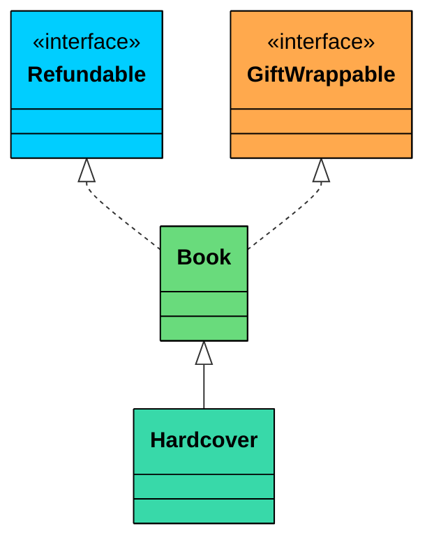
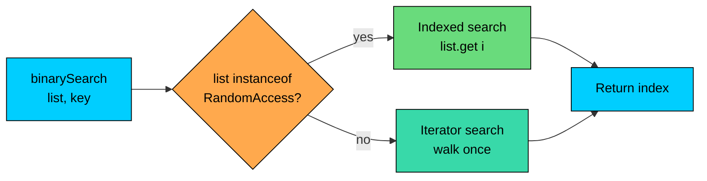

import React from 'react';
import CodeBlock from '../../../../components/ui/CodeBlock';
import Callout from '../../../../components/ui/Callout';

<div className="article-header">
  <div className="breadcrumb">
    <a href="/">Curated Notes</a>
    <span className="breadcrumb-separator">›</span>
    <span className="breadcrumb-current">Marker Interfaces</span>
  </div>
  <h1>Marker Interfaces</h1>
  <p style={{ color: 'var(--text-muted)', fontSize: '1.1rem', marginBottom: '16px', lineHeight: '1.6' }}>
    Master the essentials of Marker Interfaces in this curated guide.
  </p>
  <div className="meta-info">
    <span className="meta-item">
      <svg width="14" height="14" viewBox="0 0 24 24" fill="none" stroke="currentColor" strokeWidth="2"><circle cx="12" cy="12" r="10"/><polyline points="12 6 12 12 16 14"/></svg>
      10 min read
    </span>
    <span className="difficulty-badge difficulty-badge--intermediate">Intermediate</span>
  </div>
</div>

<section className="content-section">

A marker interface is an interface with no methods and no constants. It exists purely to tag a class with a capability, and the JVM or framework code reads that tag to change behavior. The pattern is older than annotations, still alive in the JDK, and worth understanding because the trade-offs between markers and annotations come up in interviews and in architectural decisions. This lesson covers what marker interfaces are, the four built-in ones in the JDK, how to write custom markers for an online store, and when annotations are the better choice.

---

## What a Marker Interface Actually Is

Most interfaces describe behavior. A `Comparable` interface declares a `compareTo` method. A `Runnable` interface declares a `run` method. A marker interface declares nothing. Its body is empty.


```java
public interface Refundable {
}
```


That's the entire declaration. No abstract methods, no default methods, no constants. A class that implements `Refundable` adds no methods. It gains a type that other code can detect.

The "marker" in the name is exactly what it sounds like. You're marking a class with a label that says "this class supports X." The compiler can see the marker through the type system, and runtime code can detect it with `instanceof` or `Class.isAssignableFrom`. That's the entire mechanism.


```java
public class MarkerBasics {
    interface Refundable {
    }

    static class DigitalBook {
        private final String title;
        public DigitalBook(String title) { this.title = title; }
        public String getTitle() { return title; }
    }

    static class PhysicalBook implements Refundable {
        private final String title;
        public PhysicalBook(String title) { this.title = title; }
        public String getTitle() { return title; }
    }

    public static void main(String[] args) {
        Object item1 = new DigitalBook("Effective Java");
        Object item2 = new PhysicalBook("Clean Code");

        System.out.println("Digital book is refundable? " + (item1 instanceof Refundable));
        System.out.println("Physical book is refundable? " + (item2 instanceof Refundable));
    }
}
```


Two classes, almost identical, but one of them implements `Refundable`. The runtime check `instanceof Refundable` separates them. The interface itself does nothing. The classes that implement it do nothing extra. The information lives entirely in the type system.

The question that follows is: why bother? Why not just add a `boolean isRefundable()` method, or a `refundable` field, or a `Set<String> capabilities`?

The answer is that markers communicate metadata about a type through the type system itself. The compiler can enforce it. A method that accepts a parameter of type `Refundable` won't accept any object that hasn't been marked. The check is compile-time, not a string comparison or a flag lookup. That's the value, and it's the reason `Serializable` is the way it is rather than a boolean method on every class.

---

## Four JDK Markers

The JDK ships a handful of marker interfaces. Four of them are common, and each one demonstrates a different reason markers exist.


| Interface | Purpose | What checks it |
| --- | --- | --- |
| `java.io.Serializable` | Class can be serialized to bytes | `ObjectOutputStream.writeObject` |
| `java.lang.Cloneable` | Class supports `Object.clone()` | `Object.clone` (native code) |
| `java.rmi.Remote` | Class methods can be invoked across JVMs | RMI runtime |
| `java.util.RandomAccess` | List supports fast positional access | `Collections.binarySearch`, `Collections.shuffle` |


#### `Serializable`

`Serializable` is the most familiar one. A class that wants to be writable by `ObjectOutputStream` has to implement it. The serialization machinery does an `instanceof Serializable` check on every object it encounters, and if the check fails, it throws `NotSerializableException`. The marker drives the decision.


```java
import java.io.ByteArrayOutputStream;
import java.io.IOException;
import java.io.ObjectOutputStream;
import java.io.Serializable;

public class SerializableMarker {
    static class CartItem implements Serializable {
        private static final long serialVersionUID = 1L;
        private final String name;
        private final double price;

        public CartItem(String name, double price) {
            this.name = name;
            this.price = price;
        }
    }

    static class CartTotal {
        private final double total;
        public CartTotal(double total) { this.total = total; }
    }

    public static void main(String[] args) throws IOException {
        ByteArrayOutputStream bytes = new ByteArrayOutputStream();
        try (ObjectOutputStream out = new ObjectOutputStream(bytes)) {
            out.writeObject(new CartItem("Wireless Mouse", 29.99));
            System.out.println("CartItem serialized, " + bytes.size() + " bytes.");
        }

        try (ObjectOutputStream out = new ObjectOutputStream(new ByteArrayOutputStream())) {
            out.writeObject(new CartTotal(99.95));
        } catch (java.io.NotSerializableException e) {
            System.out.println("CartTotal failed: " + e.getMessage());
        }
    }
}
```


The byte count varies by JDK version, but the shape is the same. `CartItem` carries the `Serializable` tag, so the stream accepts it. `CartTotal` doesn't, so the stream rejects it with `NotSerializableException`, and the exception message is the class name that failed the check. The check is purely an `instanceof Serializable` at the entry point.

`Serializable` could have been a boolean method, and it wasn't. The library authors wanted the type system involved: any field of type `Serializable` (think `Serializable payload`) is guaranteed to be writable by `ObjectOutputStream`, and a field of type `Object` is not. That's a guarantee a method-based approach can't provide.

#### `Cloneable`

`Cloneable` is an unusual marker in the JDK because the method it controls, `Object.clone`, isn't declared in the interface. Calling `clone` on an object that doesn't implement `Cloneable` throws `CloneNotSupportedException`. The check is inside the native `Object.clone` implementation.


```java
public class CloneableMarker {
    static class Coupon implements Cloneable {
        private final String code;
        private final double discount;

        public Coupon(String code, double discount) {
            this.code = code;
            this.discount = discount;
        }

        @Override
        public Object clone() throws CloneNotSupportedException {
            return super.clone();
        }

        @Override
        public String toString() {
            return "Coupon{" + code + ", " + discount + "}";
        }
    }

    static class WishlistEntry {
        private final String productName;

        public WishlistEntry(String productName) {
            this.productName = productName;
        }

        public Object tryClone() throws CloneNotSupportedException {
            return super.clone();
        }
    }

    public static void main(String[] args) throws CloneNotSupportedException {
        Coupon original = new Coupon("SAVE10", 0.10);
        Coupon copy = (Coupon) original.clone();
        System.out.println("Cloned coupon: " + copy);

        WishlistEntry entry = new WishlistEntry("Headphones");
        try {
            entry.tryClone();
        } catch (CloneNotSupportedException e) {
            System.out.println("WishlistEntry failed: not Cloneable");
        }
    }
}
```


The `Object.clone` source code is roughly "if `this` isn't a `Cloneable`, throw `CloneNotSupportedException`; otherwise return a shallow copy." The marker is the gate. `Cloneable` has its own deeper issues (it's often considered a design mistake), but the pattern itself is a classic marker interface.

#### `RandomAccess`

`RandomAccess` is an interesting marker because it carries no instruction. It carries a performance hint.

A `List` marked with `RandomAccess` promises that `list.get(i)` is fast (constant time). `ArrayList` implements it. `LinkedList` doesn't. Library algorithms check the marker and pick a different strategy depending on what they see.


```java
import java.util.ArrayList;
import java.util.LinkedList;
import java.util.List;
import java.util.RandomAccess;

public class RandomAccessHint {
    public static void main(String[] args) {
        List<String> arrayList = new ArrayList<>();
        List<String> linkedList = new LinkedList<>();

        System.out.println("ArrayList is RandomAccess? " + (arrayList instanceof RandomAccess));
        System.out.println("LinkedList is RandomAccess? " + (linkedList instanceof RandomAccess));
    }
}
```


The JDK's `Collections.binarySearch` does this check. If the list is `RandomAccess`, it uses indexed access. Otherwise it falls back to an iterator-based binary search, because calling `get(i)` repeatedly on a `LinkedList` is O(n) per call, which would turn an O(log n) search into O(n log n) accidental quadratic.

`binarySearch` on a `LinkedList` of 10,000 elements without the `RandomAccess` fallback would do roughly 14 lookups, each costing up to 10,000 traversal steps. The fallback to iterator-based search makes it linear time overall, which is much better than the naive version.

#### `Remote`

`Remote` from RMI (Remote Method Invocation) marks an interface whose methods can be called across a JVM boundary. It's the oldest of the four, and the pattern is identical. RMI's runtime checks `instanceof Remote` when deciding whether to generate a stub for an object.

---

## Why the Type System, Not a Boolean Method

Why not just write a `boolean isRefundable()` method on every product? Why introduce an empty interface?

There are three reasons, and the first is the strongest.

#### Reason 1: Compile-Time Checking

A method that takes a `Refundable` parameter can only be called with refundable objects. The compiler enforces it. There's no way to "forget" to mark something and then pass it to a refund handler.


```java
import java.util.ArrayList;
import java.util.List;

public class CompileTimeChecking {
    interface Refundable {
    }

    static class DigitalDownload {
        private final String name;
        public DigitalDownload(String name) { this.name = name; }
    }

    static class Book implements Refundable {
        private final String title;
        public Book(String title) { this.title = title; }
        @Override public String toString() { return "Book: " + title; }
    }

    static class Shoes implements Refundable {
        private final String model;
        public Shoes(String model) { this.model = model; }
        @Override public String toString() { return "Shoes: " + model; }
    }

    // The parameter type forces every caller to prove the item is refundable.
    static void processRefund(Refundable item) {
        System.out.println("Refund issued for " + item);
    }

    public static void main(String[] args) {
        List<Refundable> refundables = new ArrayList<>();
        refundables.add(new Book("Effective Java"));
        refundables.add(new Shoes("Running Shoes Size 9"));

        for (Refundable item : refundables) {
            processRefund(item);
        }

        // processRefund(new DigitalDownload("Album")); // would not compile
    }
}
```


If you uncomment the line, the file doesn't compile, because `DigitalDownload` isn't a `Refundable`. The compiler catches the bug at build time. A `boolean isRefundable()` method couldn't do that, because every call site would have to remember to check the flag, and one missing check is one bug.

A method-style `Set<String> capabilities` is even worse. The capability is a string, so a typo (`"refundabel"`) compiles fine and fails silently at runtime.

#### Reason 2: Inheritance Works Automatically

Markers participate in inheritance the same way any interface does. A subclass automatically inherits its parent's marker interfaces. A class can mark itself with several interfaces. A marker can extend another marker.





`Book` is both `Refundable` and `GiftWrappable`. `Hardcover` extends `Book`, so a `Hardcover` instance is both `Refundable` and `GiftWrappable` without writing a single extra line. With a method-based approach, you'd have to remember to override or re-declare each capability in every subclass.


```java
public class InheritedMarkers {
    interface Refundable {}
    interface GiftWrappable {}

    static class Book implements Refundable, GiftWrappable {
        private final String title;
        public Book(String title) { this.title = title; }
        public String getTitle() { return title; }
    }

    static class Hardcover extends Book {
        public Hardcover(String title) { super(title); }
    }

    public static void main(String[] args) {
        Hardcover item = new Hardcover("Effective Java");
        System.out.println("Is Refundable?    " + (item instanceof Refundable));
        System.out.println("Is GiftWrappable? " + (item instanceof GiftWrappable));
    }
}
```


The `Hardcover` class never mentions `Refundable` or `GiftWrappable`, but both checks return `true` because the markers travel down the hierarchy.

#### Reason 3: Cheap Runtime Checks

An `instanceof` check is one of the cheapest operations the JVM can do. On most JVMs it compiles down to a couple of pointer reads. The HotSpot JIT optimizes it aggressively, and the cost is comparable to a null check.

This is the foundation for why JDK code uses markers in hot paths. `Collections.binarySearch` performs an `instanceof RandomAccess` check exactly once per call, and the JIT can hoist or specialize it. The cost is invisible.

A single `instanceof` check is typically 1-3 nanoseconds on modern hardware. Reflection-based annotation reads, by contrast, can be 100-1000 times slower per call because they go through `Class.getAnnotation`, which builds maps and proxies. Cache annotation lookups if the cost matters.

---

## Building a Custom Marker: `Refundable` in a Cart

Consider an online store with several kinds of products. Some are refundable, some aren't. The cart's refund handler should only touch refundable items.


```java
import java.util.ArrayList;
import java.util.List;

public class RefundableCart {
    interface Refundable {
    }

    static abstract class Product {
        protected final String name;
        protected final double price;

        public Product(String name, double price) {
            this.name = name;
            this.price = price;
        }

        public double getPrice() { return price; }

        @Override
        public String toString() {
            return name + " ($" + price + ")";
        }
    }

    static class Book extends Product implements Refundable {
        public Book(String name, double price) { super(name, price); }
    }

    static class Headphones extends Product implements Refundable {
        public Headphones(String name, double price) { super(name, price); }
    }

    // Digital downloads in this store are non-refundable.
    static class DigitalDownload extends Product {
        public DigitalDownload(String name, double price) { super(name, price); }
    }

    // Final-sale clearance items skip the marker too.
    static class ClearanceItem extends Product {
        public ClearanceItem(String name, double price) { super(name, price); }
    }

    static class Cart {
        private final List<Product> items = new ArrayList<>();

        public void add(Product item) {
            items.add(item);
        }

        public double processRefunds() {
            double refunded = 0.0;
            for (Product item : items) {
                if (item instanceof Refundable) {
                    System.out.println("Refunded: " + item);
                    refunded += item.getPrice();
                } else {
                    System.out.println("Cannot refund: " + item);
                }
            }
            return refunded;
        }
    }

    public static void main(String[] args) {
        Cart cart = new Cart();
        cart.add(new Book("Effective Java", 39.99));
        cart.add(new DigitalDownload("Album: Greatest Hits", 9.99));
        cart.add(new Headphones("Studio Headphones", 89.99));
        cart.add(new ClearanceItem("Last-Season Shirt", 14.99));

        double total = cart.processRefunds();
        System.out.printf("Total refunded: $%.2f%n", total);
    }
}
```


The cart's `processRefunds` does not depend on specific subclasses. It checks one capability with `instanceof`, branches, and moves on. Adding a new refundable product type (say, `Toys`) is one line: `class Toys extends Product implements Refundable`. The cart code never changes.

Compare that to a flag-based design. With a boolean field, every new product class has to remember to set the flag correctly. With a method, every class has to override it. The marker version is harder to forget, because the type system flags the omission whenever a refund handler is involved.

---

## Multiple Markers on One Class

Markers compose. A single class can implement several markers without any conflict, because none of them declares anything that could collide. Orthogonal capabilities can be added independently.

An online store has four orthogonal capabilities a product might have. Some products are refundable. Some can be gift-wrapped. Some qualify for bulk-order pricing. Some can be cancelled after purchase. A given product might support any combination.


```java
import java.util.ArrayList;
import java.util.List;

public class MultipleMarkers {
    interface Refundable {}
    interface GiftWrappable {}
    interface BulkOrderable {}
    interface Cancellable {}

    static abstract class Product {
        protected final String name;
        public Product(String name) { this.name = name; }
        @Override public String toString() { return name; }
    }

    static class Book extends Product
            implements Refundable, GiftWrappable, BulkOrderable, Cancellable {
        public Book(String name) { super(name); }
    }

    static class Subscription extends Product implements Cancellable {
        public Subscription(String name) { super(name); }
    }

    static class GiftCard extends Product implements GiftWrappable, BulkOrderable {
        public GiftCard(String name) { super(name); }
    }

    static class DigitalDownload extends Product {
        public DigitalDownload(String name) { super(name); }
    }

    static void describe(Product item) {
        List<String> capabilities = new ArrayList<>();
        if (item instanceof Refundable) capabilities.add("refundable");
        if (item instanceof GiftWrappable) capabilities.add("gift-wrappable");
        if (item instanceof BulkOrderable) capabilities.add("bulk-orderable");
        if (item instanceof Cancellable) capabilities.add("cancellable");
        System.out.println(item + ": " + capabilities);
    }

    public static void main(String[] args) {
        describe(new Book("Effective Java"));
        describe(new Subscription("Monthly Magazine"));
        describe(new GiftCard("$50 Store Credit"));
        describe(new DigitalDownload("Album Download"));
    }
}
```


Each capability is a separate marker. Each class picks its own combination. The `describe` method asks four independent questions and gets four independent answers. There's no flag to forget, no string to typo, no enum to extend.

The last property matters. If `capabilities` were an enum, adding a new capability would require touching the enum file and every switch statement that uses it. With markers, adding `Returnable` is one line: declare the interface. Existing code doesn't compile against the new marker (it doesn't need to), and any class that wants to opt in adds it to its `implements` clause.

---

## How JDK Methods Actually Use Markers

`Serializable` and `RandomAccess` aren't the only markers used inside the JDK, but they're the two whose internal use is easy to verify. The pattern is the same in both cases: a piece of library code does an `instanceof` check at a single entry point and changes its behavior.

A sketch of what `ObjectOutputStream.writeObject` does, in pseudocode based on the real source:


```shell
writeObject(obj):
    if obj is null -> write null tag
    if obj is String -> write string
    if obj is array -> write array
    if obj is Enum -> write enum
    if obj instanceof Serializable -> serialize fields
    else throw NotSerializableException
```


The marker is the gate. Everything else in the serialization machinery (reading fields with reflection, handling cycles, writing the stream header) is downstream of that one check.

`Collections.binarySearch` is even cleaner:


```shell
binarySearch(list, key):
    if list instanceof RandomAccess or list.size() < THRESHOLD:
        indexedBinarySearch(list, key)   // uses list.get(i)
    else:
        iteratorBinarySearch(list, key)  // uses ListIterator.next()
```


Here the marker informs an algorithm choice, not a yes/no decision. Both paths return the same result. One is faster for the underlying list type. This is the second flavor of marker: not a permission gate, but a hint.





The diagram captures the entire decision. One `instanceof` check, two paths, one return point. Both paths produce the same answer, but one is much faster for the underlying list type.

---

## Marker Interfaces vs Annotations

Java 5 introduced annotations, and since then, the question "should I use a marker interface or an annotation?" has become one of the standard design choices. Both can tag a class. Both can be checked at runtime. They aren't interchangeable, and the trade-offs are real.

An annotation version of `Refundable` looks like this:


```java
import java.lang.annotation.ElementType;
import java.lang.annotation.Retention;
import java.lang.annotation.RetentionPolicy;
import java.lang.annotation.Target;

public class AnnotationMarker {
    @Retention(RetentionPolicy.RUNTIME)
    @Target(ElementType.TYPE)
    @interface Refundable {
    }

    static abstract class Product {
        protected final String name;
        protected final double price;

        public Product(String name, double price) {
            this.name = name;
            this.price = price;
        }

        @Override public String toString() { return name + " ($" + price + ")"; }
    }

    @Refundable
    static class Book extends Product {
        public Book(String name, double price) { super(name, price); }
    }

    static class DigitalDownload extends Product {
        public DigitalDownload(String name, double price) { super(name, price); }
    }

    static void processRefund(Product item) {
        if (item.getClass().isAnnotationPresent(Refundable.class)) {
            System.out.println("Refunded: " + item);
        } else {
            System.out.println("Cannot refund: " + item);
        }
    }

    public static void main(String[] args) {
        processRefund(new Book("Effective Java", 39.99));
        processRefund(new DigitalDownload("Album", 9.99));
    }
}
```


Functionally, this works. The check is `isAnnotationPresent` instead of `instanceof`, but the outcome is the same. The differences show up across five dimensions.


| Dimension | Marker Interface | Runtime Annotation |
| --- | --- | --- |
| Compile-time check | Yes (parameter type can be the marker) | No (can't write `void process(@Refundable Object o)` and have the compiler enforce it) |
| Runtime check cost | `instanceof`: 1-3 ns | `isAnnotationPresent`: 50-500 ns, builds maps |
| Inheritance | Inherited automatically by subclasses | Only with `@Inherited`, and only for class-level annotations on direct parents |
| Carries metadata | No (interface is empty) | Yes (annotation can have fields: `@Refundable(windowDays = 30)`) |
| Pollutes type hierarchy | Yes (every marker is another supertype) | No (annotation is a sidecar) |


The compile-time check is the marker's biggest advantage. If `processRefund` takes a `Refundable` parameter, only refundable items can be passed. The annotation version's parameter has to be `Object` or `Product`, and the check happens at runtime. If the check is omitted, the code still compiles.

The runtime cost difference matters in hot paths. `instanceof` is a JVM-level operation that the JIT can fold into nothing in some cases. `isAnnotationPresent` walks the class's annotation map, which involves hash lookups and (on first access) builds proxy objects. For a refund handler called once per order, neither cost matters. For a hot inner loop that classifies a million events per second, the difference is significant.

`Class.getAnnotation` and `isAnnotationPresent` build and cache an annotation map per class. The first call per class is slow (proxy creation, internal map setup). Subsequent calls are cheaper but still involve a `HashMap` lookup. Hot-path code should cache the result of the first check rather than calling `isAnnotationPresent` repeatedly.

Inheritance is where annotations get awkward. By default, an annotation on a parent class does not appear on a subclass. The annotation declaration needs `@Inherited`, and even then, only direct class-level annotations are inherited, not annotations on interfaces. A marker interface, being just an interface, follows the normal interface inheritance rules without any extra effort.


```java
import java.lang.annotation.ElementType;
import java.lang.annotation.Inherited;
import java.lang.annotation.Retention;
import java.lang.annotation.RetentionPolicy;
import java.lang.annotation.Target;

public class AnnotationInheritance {
    @Retention(RetentionPolicy.RUNTIME)
    @Target(ElementType.TYPE)
    @interface NonInherited {}

    @Retention(RetentionPolicy.RUNTIME)
    @Target(ElementType.TYPE)
    @Inherited
    @interface Inheritable {}

    @NonInherited
    @Inheritable
    static class Parent {}

    static class Child extends Parent {}

    public static void main(String[] args) {
        System.out.println("Child has @NonInherited? "
            + Child.class.isAnnotationPresent(NonInherited.class));
        System.out.println("Child has @Inheritable?  "
            + Child.class.isAnnotationPresent(Inheritable.class));
    }
}
```


`@NonInherited` is the default behavior: subclasses don't see the parent's annotation. `@Inheritable` flips that, but the option is opt-in and only covers class-level annotations. Marker interfaces bypass this entire complication.

The annotation's main feature is metadata. A marker is yes-or-no. An annotation can carry data:


```java
@Refundable(windowDays = 30, restockingFee = 0.10)
class Book extends Product { ... }
```


A marker can't express "refundable within 30 days with a 10% restocking fee." If a tag needs to carry parameters, use an annotation. If a tag is purely a yes-or-no flag, a marker is cleaner.

The last dimension, type hierarchy pollution, is more philosophical. Markers add supertypes. A `Book` that implements `Refundable, GiftWrappable, BulkOrderable, Cancellable` has five supertypes including `Object`. That's visible in IDE type hierarchies, in `getClass().getInterfaces()`, and in any code that walks the supertype chain. Some teams find this clarifying; others find it noisy. An annotation is invisible to the type hierarchy.

---

## When the Marker Approach Is Wrong

Markers aren't free, and there are situations where they're the wrong choice. Three patterns are common.

#### When You Need Metadata

A marker is a single bit of information: "this class supports X." If parameters need to be attached (a refund window, a tax rate, a priority level), the marker fails immediately. Extending the interface with constants is tempting, but constants in interfaces are public, inherited, and shared by every implementer. A per-class refund window cannot be stored on an interface.

This is where annotations win cleanly. `@Refundable(windowDays = 30)` is the right shape for parameterized metadata.

#### When the Tag Is About a Method, Not a Class

Markers apply to a whole class. To tag a single method (say, "this method is the entry point" or "this method should be retried on failure"), an annotation is required. There's no way to mark one method of a class with an interface.

Annotations have `@Target(ElementType.METHOD)`, which is the standard way to tag individual methods, fields, or parameters.

#### When the Tag Is About External Use, Not Internal Type

Frameworks like Spring, Hibernate, JUnit, and Jackson all use annotations heavily because the framework reads them at startup or via reflection without the class needing to participate in any type hierarchy. If the consumer of a tag is an external tool that scans classes, annotations are usually the right answer. The tool doesn't need to know about the type system.

A marker interface effectively says "this class has this capability for in-process code that knows about this interface." An annotation says "this class has this attribute that any tool can read."

---

## What Effective Java Says

*Effective Java* (Joshua Bloch's book) has long been the standard reference for Java design decisions. Item 41 in the third edition (originally Item 37 in the second edition) addresses marker interfaces directly. The short version of Bloch's argument is:

1. Marker interfaces define a type that allows compile-time checking. Annotations don't.
2. Marker interfaces can be targeted more precisely. An annotation can apply to any class; a marker interface can be required as a parameter type, which prevents misuse at compile time.
3. Annotations win when you need metadata or method-level targeting.
4. The two are complementary, not substitutes. Use markers when you need a type. Use annotations when you need metadata.

The recommendation hasn't changed much since 2008. The rise of annotation-driven frameworks has made annotations the default in most modern Java code, but the type-system advantage of markers is still real, and `Serializable`, `RandomAccess`, and `Cloneable` aren't going anywhere.

Practical guidance:

- If the tag is consumed by an external framework via reflection (Spring beans, JUnit tests, Jackson serialization config), use an annotation.
- If the tag needs to carry parameters, use an annotation.
- If the tag is checked in application code with `instanceof` and compile-time enforcement at API boundaries matters, use a marker interface.
- For tagging a method or a field, use an annotation; markers don't apply.
- For tagging classes that the JVM itself reads (`Serializable`, `Cloneable`), the choice was made decades ago.

---

## A Historical Note: Why So Many Markers Live On

Marker interfaces are older than annotations by about ten years. `Serializable` shipped in Java 1.1 (1997). `Cloneable` was in 1.0. `Remote` arrived in 1.1 with RMI. `RandomAccess` came in 1.4 (2002). Annotations didn't exist until Java 5 (2004).

If annotations had existed in 1997, some of those interfaces might have been annotations instead. `Serializable` is the strongest candidate, because the type-system role it plays is mostly "permission to write to a stream," and that's something a `@Serializable` annotation could express well enough. `RandomAccess`, on the other hand, is exactly the kind of tag that benefits from being a type: the `Collections.binarySearch` algorithm needs the compile-time guarantee that any `List & RandomAccess` is fast to index into.

The JDK can't remove these interfaces now. Too much code depends on them. So they stay, and they remain the canonical examples of the pattern. New JDK code added since Java 5 has generally used annotations instead. `@FunctionalInterface`, `@Override`, `@SafeVarargs`, `@SuppressWarnings`, `@Deprecated` are all annotations that could have been markers in an alternative history.

The takeaway is that markers are a historically grounded pattern with a real (smaller) niche in modern code. The reflex to use an annotation first is correct most of the time. The reflex to reject markers entirely is a mistake. When a compile-time-checkable type tag is needed, the marker is appropriate, and that situation still comes up.

</section>
