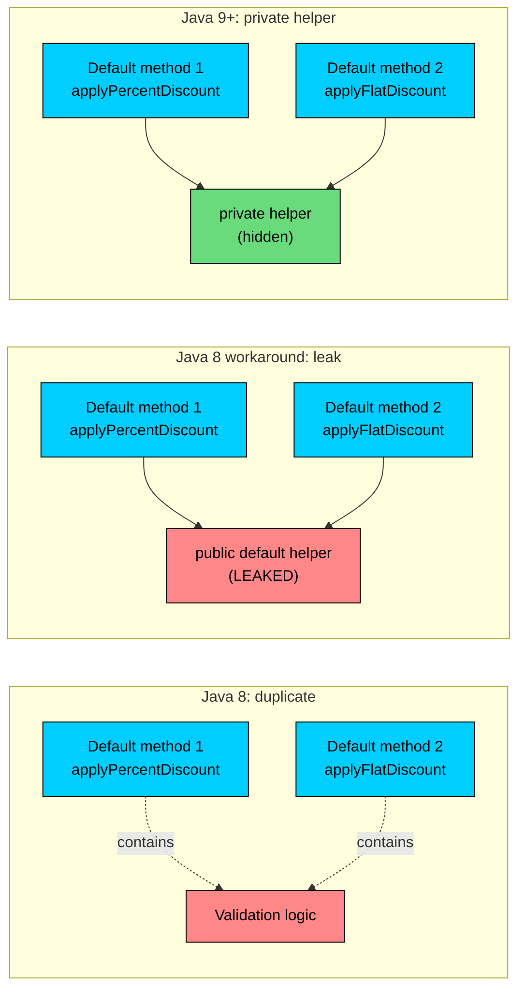

import React from 'react';
import CodeBlock from '../../../../components/ui/CodeBlock';
import Callout from '../../../../components/ui/Callout';

<div className="article-header">
  <div className="breadcrumb">
    <a href="/">Curated Notes</a>
    <span className="breadcrumb-separator">›</span>
    <span className="breadcrumb-current">Private Interface Methods</span>
  </div>
  <h1>Private Interface Methods</h1>
  <p style={{ color: 'var(--text-muted)', fontSize: '1.1rem', marginBottom: '16px', lineHeight: '1.6' }}>
    Master the essentials of Private Interface Methods in this curated guide.
  </p>
  <div className="meta-info">
    <span className="meta-item">
      <svg width="14" height="14" viewBox="0 0 24 24" fill="none" stroke="currentColor" strokeWidth="2"><circle cx="12" cy="12" r="10"/><polyline points="12 6 12 12 16 14"/></svg>
      10 min read
    </span>
    <span className="difficulty-badge difficulty-badge--intermediate">Intermediate</span>
  </div>
</div>

<section className="content-section">

By the time we got to default methods and static interface methods, interfaces stopped being pure contracts and started carrying real code. That's useful, but it created a new problem: two default methods inside the same interface often need the same helper logic, and there was nowhere clean to put it. Java 9 fixed this by letting an interface declare `private` and `private static` methods. This lesson is about that fix, the rules around it, and the refactoring patterns it enables.

---

## The Duplication Problem

Default methods let an interface ship a concrete implementation that every implementer inherits automatically. They're great until you write the second one.

Consider a `Discountable` interface for an online store. Anything that can be discounted, a cart, a single product, a subscription bundle, implements this interface. The interface knows how to apply a percentage discount and how to apply a flat-amount discount. Both operations have to validate the input first: the discount can't be negative, the price can't be negative, and the result can't go below zero.

In Java 8, before private interface methods existed:


```java
public class DiscountableBefore {
    public static void main(String[] args) {
        Cart cart = new Cart(120.0);

        System.out.println("Percent off:  $" + cart.applyPercentDiscount(20));
        System.out.println("Flat off:     $" + cart.applyFlatDiscount(15));
        System.out.println("Bad percent:  $" + cart.applyPercentDiscount(-5));
        System.out.println("Bad flat:     $" + cart.applyFlatDiscount(500));
    }
}

interface Discountable {
    double getPrice();

    default double applyPercentDiscount(double percent) {
        // Validation: duplicated
        if (percent < 0) {
            System.out.println("Warning: negative percent, clamping to 0");
            percent = 0;
        }
        if (percent > 100) {
            System.out.println("Warning: percent over 100, clamping to 100");
            percent = 100;
        }
        if (getPrice() < 0) {
            System.out.println("Warning: negative price, treating as 0");
            return 0;
        }

        double discounted = getPrice() * (1 - percent / 100);
        return Math.max(discounted, 0);
    }

    default double applyFlatDiscount(double amount) {
        // Validation: duplicated again
        if (amount < 0) {
            System.out.println("Warning: negative amount, clamping to 0");
            amount = 0;
        }
        if (getPrice() < 0) {
            System.out.println("Warning: negative price, treating as 0");
            return 0;
        }

        double discounted = getPrice() - amount;
        return Math.max(discounted, 0);
    }
}

class Cart implements Discountable {
    private double total;
    Cart(double total) { this.total = total; }

    @Override
    public double getPrice() { return total; }
}
```


Look at the two default methods. The price-validation block (`if (getPrice() < 0)`) and the "clamp negatives to zero" block appear in both. If we add a third discount type (say `applyTwoForOne`), we'd write the same validation a third time. If we ever change what "invalid price" means, we'd have to remember to update every default method.

In a regular class, the fix is trivial: extract the validation into a private helper method. In Java 8 interfaces, there was no such thing as a private method, so you had two bad options.

Option one: copy the validation logic into every default method. That's what we just did.

Option two: extract the helper as a `default` method, which makes it public and exposed to every implementing class and every caller.


```java
// The Java 8 workaround: make the helper a default method
interface DiscountableJava8Workaround {
    double getPrice();

    // Now part of the public contract, even though it's internal plumbing
    default boolean isValidPrice() {
        return getPrice() >= 0;
    }

    default double clampPercent(double percent) {
        if (percent < 0) return 0;
        if (percent > 100) return 100;
        return percent;
    }
}
```


The workaround leaks implementation details. Every class that implements `DiscountableJava8Workaround` inherits `isValidPrice` and `clampPercent` as public methods. Callers can call them from outside. Subclasses can override them, which means a poorly behaved subclass can break the parent's logic by overriding what was supposed to be a private helper. That's a contract leak.





The diagram lines up the three approaches. The first column duplicates validation inside every default method. The middle column hoists the helper to a `default` method, which works mechanically but exposes the helper to every implementer and caller. The right column is what Java 9 gave us: a real private method on the interface that the defaults can call, while nothing outside the interface can see it.

---

## Adding `private` Methods to an Interface (Java 9)

Java 9 added two new kinds of methods you can put inside an interface:

- `private` instance methods, callable from default methods and other private instance methods on the same interface.
- `private static` methods, callable from any method on the same interface (default, static, private instance, or private static).

The syntax is exactly what you'd write in a class:


```java
private ReturnType helper(parameters) {
    // body required
}

private static ReturnType staticHelper(parameters) {
    // body required
}
```


The keyword `private` does the same job here as it does in a class: it restricts access to the inside of the declaring type. Outside the interface, the method doesn't exist as far as the language is concerned.

Now the `Discountable` interface can extract its validation once and use it from both default methods:


```java
public class DiscountableAfter {
    public static void main(String[] args) {
        Cart cart = new Cart(120.0);

        System.out.println("Percent off:  $" + cart.applyPercentDiscount(20));
        System.out.println("Flat off:     $" + cart.applyFlatDiscount(15));
        System.out.println("Bad percent:  $" + cart.applyPercentDiscount(-5));
        System.out.println("Bad flat:     $" + cart.applyFlatDiscount(500));
    }
}

interface Discountable {
    double getPrice();

    default double applyPercentDiscount(double percent) {
        double safePercent = clampPercent(percent);
        double safePrice = safePrice();
        double discounted = safePrice * (1 - safePercent / 100);
        return Math.max(discounted, 0);
    }

    default double applyFlatDiscount(double amount) {
        double safeAmount = Math.max(amount, 0);
        double safePrice = safePrice();
        double discounted = safePrice - safeAmount;
        return Math.max(discounted, 0);
    }

    // Private helper: hidden inside the interface
    private double safePrice() {
        double price = getPrice();
        if (price < 0) {
            System.out.println("Warning: negative price, treating as 0");
            return 0;
        }
        return price;
    }

    // Private static helper: pure function, no instance needed
    private static double clampPercent(double percent) {
        if (percent < 0) {
            System.out.println("Warning: negative percent, clamping to 0");
            return 0;
        }
        if (percent > 100) {
            System.out.println("Warning: percent over 100, clamping to 100");
            return 100;
        }
        return percent;
    }
}

class Cart implements Discountable {
    private double total;
    Cart(double total) { this.total = total; }

    @Override
    public double getPrice() { return total; }
}
```


Two things changed. The shared validation lives in exactly one place (`safePrice` for the instance check, `clampPercent` for the pure percent-range check). And the public surface of `Discountable` is back to what it should be: `getPrice`, `applyPercentDiscount`, `applyFlatDiscount`. Nothing else leaked out.

The choice between `private` and `private static` matters here. The `safePrice` helper calls `getPrice()`, which is an abstract instance method, so the helper has to be an instance method to have access to `this`. The `clampPercent` helper only operates on its arguments, so it can be `private static`.

---

## `private` (Non-Static) Interface Methods

A `private` non-static method behaves like any other instance method, except for one thing: the only place it can be called from is inside the same interface, by another default or private instance method.

The "what can it call?" question goes the other direction too. From inside a private instance method, you can call:

- Other default methods on the same interface.
- Other private instance methods on the same interface.
- Private static methods on the same interface.
- Abstract methods declared in the interface (which dispatch to the implementing class at runtime, just like calls from inside a default method).
- Methods inherited from `Object` like `toString` on the implementing object via `this`, although that's rare.

This is what makes private instance methods useful: they can call the abstract methods of the interface, so they can do real work that depends on the implementing class's data.


```java
public class CartableExample {
    public static void main(String[] args) {
        ShoppingCart cart = new ShoppingCart();
        cart.add("Notebook", 12.99);
        cart.add("Pen", 3.50);
        cart.add("Eraser", 1.25);

        cart.printSummary();
        System.out.println();
        cart.printReceipt();
    }
}

interface Cartable {
    String getCustomerName();
    java.util.List<Double> getPrices();
    java.util.List<String> getItemNames();

    default void printSummary() {
        printHeader("SUMMARY");
        System.out.println("Items: " + getItemNames().size());
        System.out.println("Total: $" + formatPrice(computeTotal()));
    }

    default void printReceipt() {
        printHeader("RECEIPT");
        java.util.List<String> names = getItemNames();
        java.util.List<Double> prices = getPrices();
        for (int i = 0; i < names.size(); i++) {
            System.out.println(names.get(i) + " - $" + formatPrice(prices.get(i)));
        }
        System.out.println("---");
        System.out.println("Total: $" + formatPrice(computeTotal()));
    }

    // Private instance helper: uses abstract methods through this
    private double computeTotal() {
        double total = 0;
        for (double price : getPrices()) {
            total += price;
        }
        return total;
    }

    // Private instance helper: uses another abstract method
    private void printHeader(String label) {
        System.out.println("=== " + label + " for " + getCustomerName() + " ===");
    }

    // Private static helper: pure formatting, doesn't need this
    private static String formatPrice(double price) {
        return String.format("%.2f", price);
    }
}

class ShoppingCart implements Cartable {
    private java.util.List<String> names = new java.util.ArrayList<>();
    private java.util.List<Double> prices = new java.util.ArrayList<>();

    public void add(String name, double price) {
        names.add(name);
        prices.add(price);
    }

    @Override
    public String getCustomerName() { return "Anonymous"; }

    @Override
    public java.util.List<Double> getPrices() { return prices; }

    @Override
    public java.util.List<String> getItemNames() { return names; }
}
```


Both `printSummary` and `printReceipt` need to compute the total and need to print a header. Pulling that into `computeTotal` and `printHeader` keeps the two defaults focused on layout. And critically, `computeTotal` calls `getPrices()`, which is one of the interface's abstract methods. At runtime that call dispatches to whichever implementing class is on the other end (`ShoppingCart` in our case), so the helper still works against the real data.

Compare this with a `private static` helper. The `formatPrice` method only needs the argument; it doesn't use `this`. So it doesn't matter whether it's static or not for correctness, but static is the better choice because it documents the intent: this is a pure function with no dependence on the implementing class.

A private interface method is just a normal method on the interface type. The compiler emits a private bytecode method on the interface; calls to it are direct (not virtual). There's no extra indirection compared with a method on a class.

---

## `private static` Interface Methods

A `private static` interface method belongs to the interface itself, not to any instance. That changes what it's allowed to do. Inside a `private static` method you can't use `this`, can't call abstract methods on `this`, and can't call other instance methods on `this`.

What you **can** call from a `private static` method:

- Other `private static` methods on the same interface.
- `public static` methods on the same interface.

What you cannot call:

- Default methods (they need a `this` to run against).
- Abstract methods (same reason).
- Private instance methods (same reason).

This is exactly the same rule that governs `static` methods inside a class: a static method has no instance, so it can't reach into instance state.

A natural fit is shared parsing, formatting, or pure-math helpers. A slightly bigger refactor that pulls out a chain of pure helpers from an interface that prices items:


```java
public class PricingExample {
    public static void main(String[] args) {
        Product book = new Product("Effective Java", 39.99);
        Product mouse = new Product("Wireless Mouse", 24.50);

        System.out.println(book.priceWithTax("CA"));
        System.out.println(book.priceWithTax("OR"));
        System.out.println(mouse.discountedPriceWithTax("CA", 10));
        System.out.println(mouse.discountedPriceWithTax("OR", 25));
    }
}

interface Priced {
    double getBasePrice();

    default String priceWithTax(String state) {
        double tax = computeTax(getBasePrice(), state);
        double total = getBasePrice() + tax;
        return format(state, getBasePrice(), tax, total);
    }

    default String discountedPriceWithTax(String state, double percentOff) {
        double discounted = applyPercent(getBasePrice(), percentOff);
        double tax = computeTax(discounted, state);
        double total = discounted + tax;
        return format(state, discounted, tax, total);
    }

    // Pure function: no instance needed
    private static double computeTax(double price, String state) {
        double rate = taxRate(state);
        return round(price * rate);
    }

    // Pure function: arithmetic only
    private static double applyPercent(double price, double percentOff) {
        if (percentOff < 0) percentOff = 0;
        if (percentOff > 100) percentOff = 100;
        return round(price * (1 - percentOff / 100));
    }

    // Pure function: lookup
    private static double taxRate(String state) {
        switch (state) {
            case "CA": return 0.0725;
            case "OR": return 0.0;
            case "NY": return 0.04;
            default:   return 0.05;
        }
    }

    // Pure function: rounding
    private static double round(double value) {
        return Math.round(value * 100.0) / 100.0;
    }

    // Pure function: formatting
    private static String format(String state, double sub, double tax, double total) {
        return state + ": $" + sub + " + $" + tax + " tax = $" + total;
    }
}

class Product implements Priced {
    private String name;
    private double price;

    Product(String name, double price) {
        this.name = name;
        this.price = price;
    }

    @Override
    public double getBasePrice() { return price; }
}
```


Look at the call graph inside `Priced`. The two default methods (`priceWithTax`, `discountedPriceWithTax`) call `private static` helpers. Those helpers call other private statics: `computeTax` calls `taxRate` and `round`, `applyPercent` calls `round`. None of the statics ever needs `this`. None of them ever reaches back into the implementing class. They're pure functions that live inside the interface, scoped to it because nothing outside `Priced` should call them.

If you tried to call `getBasePrice()` from inside `computeTax`, the compiler would reject it:


```java
private static double computeTax(double price, String state) {
    double base = getBasePrice(); // compile error
    // ...
}
```


The error you'd see is:


```shell
error: non-static method getBasePrice() cannot be referenced from a static context
        double base = getBasePrice();
                      ^
```


That's the same error a static method in a class gives when it tries to use an instance method. The remedy is also the same: pass what the static needs in as a parameter (which is exactly what `computeTax(double price, String state)` does), or make the helper a private instance method.

---

## The Visibility and Inheritance Rules

It's worth stepping back and writing down the rules in one place. There are five method shapes you can declare inside an interface as of Java 9, and each one behaves differently.


| Method shape | Body required? | Inherited by implementer? | Callable from outside the interface? | Overridable? |
| --- | --- | --- | --- | --- |
| `public abstract` (implicit) | No | Yes, must be implemented | Yes, through the implementing object | Yes (implemented) |
| `default` | Yes | Yes, can be overridden | Yes, through the implementing object | Yes |
| `public static` | Yes | No (called as `Interface.method()`) | Yes, via the interface name | No |
| `private` (instance) | Yes | No | No | No |
| `private static` | Yes | No | No | No |


Three things stand out for private methods.

First, **the body is required**. A private method without a body is a compile error. The whole point of `private` here is to package implementation, not to declare a contract.

Second, **private methods are not inherited**. When a class implements an interface, it gets the abstract methods (which it must implement), the default methods (which it can use or override), and the static methods as part of the interface (callable via the interface name). It does not get the private methods at all. From the implementing class's perspective, those private methods don't exist.

Third, **private methods can't be overridden**. Override only makes sense for methods that are part of the visible contract. Private methods aren't part of the contract, they're internal helpers. A subclass or implementer can declare a method with the same name and signature, but that's a brand-new method on the class, completely unrelated to the interface's private helper.

Let's verify each rule with a compiler error.

#### Rule: body required


```java
interface Discountable {
    double getPrice();
    private double safePrice(); // compile error
}
```


Compiler:


```shell
error: private methods in interfaces must have a body
    private double safePrice();
                   ^
```


A private method can't be abstract. If you want an abstract method on the contract, leave it `public abstract` (the default for interface methods).

#### Rule: not callable from outside


```java
interface Discountable {
    double getPrice();

    private double safePrice() {
        return Math.max(getPrice(), 0);
    }
}

class Cart implements Discountable {
    public double getPrice() { return 100.0; }
}

public class TryToCallPrivate {
    public static void main(String[] args) {
        Cart cart = new Cart();
        cart.safePrice(); // compile error
    }
}
```


Compiler:


```shell
error: cannot find symbol
        cart.safePrice();
            ^
  symbol:   method safePrice()
  location: variable cart of type Cart
```


From outside the interface, the private method simply isn't visible. The compiler doesn't even acknowledge it exists. This is exactly the same behavior you'd get if `safePrice` were a private method on a class and you tried to call it from a different class.

#### Rule: not inherited, can't be overridden


```java
interface Discountable {
    double getPrice();

    private double safePrice() {
        return Math.max(getPrice(), 0);
    }
}

class Cart implements Discountable {
    public double getPrice() { return 100.0; }

    @Override
    public double safePrice() { return 50.0; } // compile error
}
```


Compiler:


```shell
error: method does not override or implement a method from a supertype
    @Override
    ^
```


The `@Override` annotation fails because there's nothing on the supertype called `safePrice` from `Cart`'s perspective. Drop the `@Override` and the class compiles, but `Cart.safePrice()` is now a brand-new public method on `Cart`, completely independent of the interface's private helper. Calls from inside the interface still go to the interface's `safePrice`. Calls from outside go to `Cart`'s `safePrice`. They share a name and nothing else.

This is the same reason a private method in a class isn't overridable. Private means "scoped to the declaring type." There's nothing to override because there's nothing visible to override.

```mermaid
flowchart TD
    A["Interface Discountable"]:::cyan
    B["public abstract getPrice"]:::orange
    C["default applyPercent"]:::orange
    D["public static parseRule"]:::teal
    E["private safePrice"]:::green
    F["private static clampPercent"]:::green

    G["Class Cart implements Discountable"]:::cyan
    H["inherits getPrice<br/>(must implement)"]:::orange
    I["inherits applyPercent<br/>(can override)"]:::orange
    J["does NOT inherit parseRule<br/>(call via Discountable.parseRule)"]:::teal
    K["does NOT see safePrice"]:::red
    L["does NOT see clampPercent"]:::red

    A --> B
    A --> C
    A --> D
    A --> E
    A --> F

    G --> H
    G --> I
    G --> J
    G --> K
    G --> L

    classDef cyan fill:#00ceff,stroke:#000,color:#000
    classDef orange fill:#ffa94d,stroke:#000,color:#000
    classDef teal fill:#38d9a9,stroke:#000,color:#000
    classDef green fill:#69db7c,stroke:#000,color:#000
    classDef red fill:#ff8787,stroke:#000,color:#000
```





The diagram lines up what an implementer sees with what the interface declares. The implementer is responsible for the abstract methods, inherits the default methods, can reach the static methods through the interface name, and is completely blind to the private methods. The privates only exist inside the interface's own body.

---

## A Real Refactor: Two Default Methods That Share Validation

Let's walk through a realistic e-commerce refactor. Imagine an `OrderProcessor` interface used by both a `RegularOrderProcessor` (for normal carts) and an `ExpressOrderProcessor` (for one-click buy). Both default methods, `processStandardCheckout` and `processExpressCheckout`, share validation logic: the cart can't be empty, the total can't be negative, the customer email must look valid.

Before private interface methods, the validation was either copy-pasted or hoisted into a leaky `default` method. Here's the duplicated version first.


```java
public class OrderProcessorBefore {
    public static void main(String[] args) {
        Order good = new Order(2, 49.99, "alice@example.com");
        Order empty = new Order(0, 0.0, "alice@example.com");
        Order badEmail = new Order(1, 19.99, "no-at-sign");

        StandardProcessor p = new StandardProcessor();
        System.out.println(p.processStandardCheckout(good));
        System.out.println(p.processStandardCheckout(empty));
        System.out.println(p.processExpressCheckout(badEmail));
    }
}

interface OrderProcessor {
    default String processStandardCheckout(Order order) {
        // Validation: duplicated
        if (order.itemCount <= 0) return "REJECTED: empty cart";
        if (order.total < 0) return "REJECTED: negative total";
        if (order.email == null || !order.email.contains("@")) return "REJECTED: bad email";

        return "STANDARD OK: charged $" + order.total + " to " + order.email;
    }

    default String processExpressCheckout(Order order) {
        // Validation: duplicated again
        if (order.itemCount <= 0) return "REJECTED: empty cart";
        if (order.total < 0) return "REJECTED: negative total";
        if (order.email == null || !order.email.contains("@")) return "REJECTED: bad email";

        return "EXPRESS OK: one-click $" + order.total + " to " + order.email;
    }
}

class StandardProcessor implements OrderProcessor {}

class Order {
    int itemCount;
    double total;
    String email;
    Order(int itemCount, double total, String email) {
        this.itemCount = itemCount;
        this.total = total;
        this.email = email;
    }
}
```


The two default methods are almost identical at the top. Each runs three validation checks in the same order. If a fourth rule ever shows up (say, the customer must be over 18), we'd have to touch both methods and keep them in sync.

Here's the refactor with a private helper.


```java
public class OrderProcessorAfter {
    public static void main(String[] args) {
        Order good = new Order(2, 49.99, "alice@example.com");
        Order empty = new Order(0, 0.0, "alice@example.com");
        Order badEmail = new Order(1, 19.99, "no-at-sign");

        StandardProcessor p = new StandardProcessor();
        System.out.println(p.processStandardCheckout(good));
        System.out.println(p.processStandardCheckout(empty));
        System.out.println(p.processExpressCheckout(badEmail));
    }
}

interface OrderProcessor {
    default String processStandardCheckout(Order order) {
        String error = validate(order);
        if (error != null) return error;
        return "STANDARD OK: charged $" + order.total + " to " + order.email;
    }

    default String processExpressCheckout(Order order) {
        String error = validate(order);
        if (error != null) return error;
        return "EXPRESS OK: one-click $" + order.total + " to " + order.email;
    }

    // Private static: pure function, doesn't need this
    private static String validate(Order order) {
        if (order.itemCount <= 0) return "REJECTED: empty cart";
        if (order.total < 0) return "REJECTED: negative total";
        if (order.email == null || !order.email.contains("@")) return "REJECTED: bad email";
        return null;
    }
}

class StandardProcessor implements OrderProcessor {}

class Order {
    int itemCount;
    double total;
    String email;
    Order(int itemCount, double total, String email) {
        this.itemCount = itemCount;
        this.total = total;
        this.email = email;
    }
}
```


Same output, but the validation rules live in one method. The two checkout flows are now visibly different from each other: each one runs validation, returns the error if there is one, and otherwise emits its own success message. Adding the age check is a one-line change inside `validate`.

`validate` is `private static` because it doesn't read or write any interface state. It only inspects its parameter. A useful rule of thumb: if a helper doesn't call any abstract or default method on the interface, prefer `private static`. It's a stronger signal to readers and prevents accidental coupling.

---

## Where the Two Kinds Differ in Practice

Both `private` and `private static` methods exist to hide implementation, so when do you pick which one?


| Choose `private` when... | Choose `private static` when... |
| --- | --- |
| The helper calls one of the interface's abstract methods (it needs `this`) | The helper only operates on its parameters |
| The helper calls a default method on the same interface | The helper is a pure function: same input, same output |
| The helper needs to dispatch to the implementing class's state | The helper is a lookup, validation, formatter, or pure math |
| You want the helper to be polymorphic with respect to the implementing class | You want the helper to behave the same regardless of who calls it |


A common pattern is to have a few `private static` utility methods (pure helpers) and one or two `private` instance methods (composed business logic that touches abstract state). Mixing both is common.

A small extension of the discounts example showing both kinds working together:


```java
public class MixedHelpersExample {
    public static void main(String[] args) {
        Cart cart = new Cart(80.0, "BLACKFRIDAY");
        System.out.println("Final price: $" + cart.applyCoupon());
    }
}

interface Couponable {
    double getPrice();
    String getCouponCode();

    default double applyCoupon() {
        double discount = lookupDiscount(getCouponCode());
        double base = safePrice();
        return round(base * (1 - discount));
    }

    // Private instance: needs getPrice() through this
    private double safePrice() {
        return Math.max(getPrice(), 0);
    }

    // Private static: pure lookup
    private static double lookupDiscount(String code) {
        if (code == null) return 0.0;
        switch (code) {
            case "BLACKFRIDAY": return 0.30;
            case "SPRING10":    return 0.10;
            case "NEWCUSTOMER": return 0.15;
            default:            return 0.0;
        }
    }

    // Private static: pure arithmetic
    private static double round(double value) {
        return Math.round(value * 100.0) / 100.0;
    }
}

class Cart implements Couponable {
    private double total;
    private String coupon;
    Cart(double total, String coupon) {
        this.total = total;
        this.coupon = coupon;
    }

    @Override public double getPrice() { return total; }
    @Override public String getCouponCode() { return coupon; }
}
```


The default method `applyCoupon` orchestrates the work using three private helpers. `safePrice` is `private` because it reads `getPrice()` through `this`. `lookupDiscount` and `round` are `private static` because they're pure functions over their arguments. The split makes the intent obvious: instance helpers depend on the implementing class, static helpers don't.

Calling a private static method on an interface compiles to an `invokestatic` instruction, the same as a static method call on a class. Calling a private instance method on an interface compiles to `invokespecial`, the same as a private method call inside a class. Both are direct calls with no virtual lookup, so there's no performance reason to pick one over the other.

---

## What This Does **Not** Change

It's easy to overread Java 9's addition. Private interface methods are a refactoring affordance, not a change to what interfaces are. A few things stay exactly as they were.

Interfaces still can't have private fields. A private method has no instance state to use inside the interface, only the abstract methods it can call through `this`. If you need state, you need a class.

Interfaces still aren't a replacement for abstract classes when you need shared state. Private methods help share **code**, not **data**.

A class implementing the interface still can't reach into the interface's private methods. The implementer's view of the interface is unchanged. From outside the interface, only the public contract exists.

And finally, private methods don't escape the interface even through reflection in the casual sense. They show up if you specifically look for declared methods, but they're not part of the type's public method set. If you write framework code that scans an interface for its callable methods, the private ones won't appear in the same lists.

</section>
