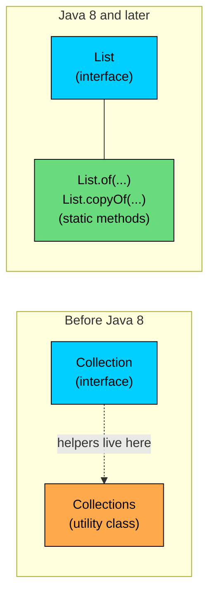
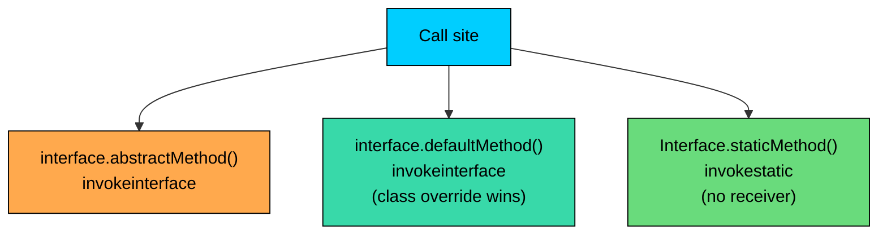
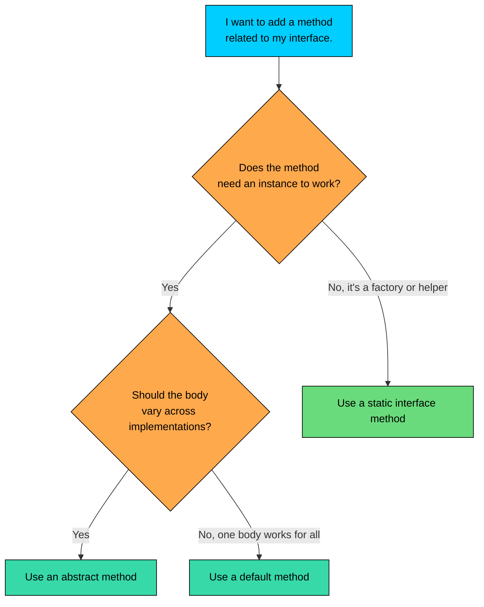

import React from 'react';
import CodeBlock from '../../../../components/ui/CodeBlock';
import Callout from '../../../../components/ui/Callout';

<div className="article-header">
  <div className="breadcrumb">
    <a href="/">Curated Notes</a>
    <span className="breadcrumb-separator">›</span>
    <span className="breadcrumb-current">Static Interface Methods</span>
  </div>
  <h1>Static Interface Methods</h1>
  <p style={{ color: 'var(--text-muted)', fontSize: '1.1rem', marginBottom: '16px', lineHeight: '1.6' }}>
    Master the essentials of Static Interface Methods in this curated guide.
  </p>
  <div className="meta-info">
    <span className="meta-item">
      <svg width="14" height="14" viewBox="0 0 24 24" fill="none" stroke="currentColor" strokeWidth="2"><circle cx="12" cy="12" r="10"/><polyline points="12 6 12 12 16 14"/></svg>
      10 min read
    </span>
    <span className="difficulty-badge difficulty-badge--intermediate">Intermediate</span>
  </div>
</div>

<section className="content-section">

Before Java 8, an interface could only declare abstract methods. Helper functions that "belonged" to an interface had to live in a separate companion class, which is why the JDK ships with `Collections` next to `Collection` and `Arrays` next to arrays. Java 8 fixed that by letting you declare `static` methods directly inside an interface. This lesson covers what those methods are, how they differ from `default` methods, how they get dispatched, and the e-commerce patterns where they pay off.

---

## Syntax and the One-Line Definition

A `static` method on an interface looks almost identical to a `static` method on a class. The keyword goes before the return type, the body is a regular block, and there's no `default` modifier and no `abstract` modifier.


```java
public interface Payable {
    double amount();

    static Payable zero() {
        return () -> 0.0;
    }
}

public class PayableDemo {
    public static void main(String[] args) {
        Payable nothing = Payable.zero();
        System.out.println("Amount owed: $" + nothing.amount());
    }
}
```


First, the call site is `Payable.zero()`, not `someInstance.zero()`. You invoke a static interface method through the interface name, the same way you invoke `Math.max` through the `Math` class. Second, the method has a real body. Unlike abstract methods, which only declare a shape, a static method on an interface ships with its own implementation that lives on the interface itself.

The method modifiers you can combine with `static` on an interface are limited. You can declare it `public` (which is the default and usually omitted) or `private`. You cannot declare it `abstract`, because a static method has a body. You cannot declare it `default`, because `default` is the keyword for instance methods that interfaces add. You cannot declare it `final`, because the language doesn't allow `final` on interface members and there's no overriding to forbid anyway.


```java
public interface Discount {
    double rate();

    // Legal
    static Discount flat(double rate) {
        return () -> rate;
    }

    // Compile error: modifier 'abstract' not allowed here
    // static abstract Discount empty();

    // Compile error: modifier 'default' not allowed here
    // static default Discount none() { return () -> 0.0; }
}
```


The commented lines won't compile. They're shown here so you recognize the errors if you accidentally write them.

---

## Why Static Interface Methods Exist

The reason static interface methods were added is mostly about code organization. Before Java 8, if you wanted a helper that produced or operated on instances of an interface, you had two unappealing options.

The first was to put the helper on a separate utility class. That's how `java.util.Collections` came to exist: it holds `sort`, `reverse`, `emptyList`, and dozens of other operations that conceptually belong to the `Collection` family, but couldn't live on the `Collection` interface itself because interfaces couldn't host implementation. The result is the awkward `Collections.sort(list)` instead of `list.sort()` or `List.sort(list)`.

The second was to put the helper on an implementing class. But then the helper is tied to one concrete implementation, which makes it harder to discover and impossible to call without picking a particular class.





The diagram contrasts the two patterns. On the left, the helpers sit in a separate utility class; the connection between `Collection` and `Collections` is naming-only and the compiler doesn't enforce it. On the right, the helpers live directly on the interface, so `List` and `List.of` are part of the same type and show up together in documentation, IDE autocomplete, and import statements.

The JDK itself uses this pattern heavily. `List.of(1, 2, 3)` returns an immutable list. `Set.of("a", "b")` returns an immutable set. `Map.entry(key, value)` returns a single entry. `Comparator.comparing(Product::name)` returns a comparator. `Stream.of("a", "b")` returns a stream. Each of these used to require a separate factory class or constructor call; now they're one short call on the interface itself.

For your own code, the typical use cases are factory methods that produce instances, validation helpers that operate on the kinds of values the interface deals with, and small calculations that belong logically with the interface. Each is covered below.

---

## Calling a Static Interface Method

Static interface methods are called through the interface name. The call site never goes through an instance, and instance references can't reach the method even if the type they point to is the interface.


```java
public interface Payable {
    double amount();

    static Payable fromCents(int cents) {
        double dollars = cents / 100.0;
        return () -> dollars;
    }
}

public class StaticCall {
    public static void main(String[] args) {
        Payable invoice = Payable.fromCents(2599);
        System.out.println("Invoice: $" + invoice.amount());

        // invoice.fromCents(100);  // would not compile
    }
}
```


The call `Payable.fromCents(2599)` uses the interface name as the receiver. The commented line `invoice.fromCents(100)` won't compile, because `fromCents` is not a member of any instance, only of the interface itself. The compiler error is:


```shell
error: static method fromCents(int) should be qualified by type name, Payable, instead of by an expression
```


That message tells you exactly what's wrong: the static method exists on `Payable`, not on instances of `Payable`. The same rule applies even when you have a reference variable typed as the interface. Java does not let you call a static method through an instance, the way some other languages do.

Static interface methods are dispatched with the `invokestatic` bytecode instruction, which is the cheapest call instruction the JVM has. There's no virtual lookup, no vtable, no receiver to load. Compare with `invokevirtual` for instance methods or `invokeinterface` for interface methods, both of which involve a runtime method resolution step. For tight loops over factory or helper calls, this difference can matter.

The JDK's `List.of` shows the same pattern in practice. You call it through the interface, you get back an instance of an internal implementation class, and the call site never knows or cares which implementation came back.


```java
import java.util.List;

public class ListOfDemo {
    public static void main(String[] args) {
        List<String> categories = List.of("Electronics", "Books", "Apparel");
        System.out.println(categories);
        System.out.println(categories.getClass().getSimpleName());
    }
}
```


The runtime type is some internal class inside `java.util.ImmutableCollections`, but you don't have to know that, and your code shouldn't depend on it. From outside, all you see is `List`, and the call is `List.of(...)`.

---

## Static Methods Are Not Inherited

This rule is worth showing rather than just stating. A class that implements an interface does **not** inherit the interface's static methods. The static method belongs to the interface, full stop. The implementing class cannot call it without qualifying it, and a reference of the class type cannot reach it.


```java
public interface Discount {
    double rate();

    static Discount percent(double percent) {
        double fraction = percent / 100.0;
        return () -> fraction;
    }
}

public class SeasonalDiscount implements Discount {
    private final double rate;

    public SeasonalDiscount(double rate) {
        this.rate = rate;
    }

    @Override
    public double rate() {
        return rate;
    }

    public static void main(String[] args) {
        // SeasonalDiscount.percent(20);  // would not compile
        Discount tenPercent = Discount.percent(10);
        System.out.println("Rate: " + tenPercent.rate());
    }
}
```


`SeasonalDiscount` implements `Discount`, but `SeasonalDiscount.percent(20)` would not compile. The compiler does not look up `percent` on the interface from a subclass call. Static methods are looked up by the receiver type written at the call site, and that type is `SeasonalDiscount`, not `Discount`. To call the static method, you write `Discount.percent(...)`.

The exact compiler message is:


```shell
error: cannot find symbol
  symbol:   method percent(int)
  location: class SeasonalDiscount
```


You'll see the same error if you try to call the static method through an instance reference whose declared type is the implementing class.

The reasoning behind this rule is consistency. If static methods were inherited, two interfaces with the same static signature would create a conflict in any class that implemented both, and there would be no clean way to resolve it. By making static methods belong only to the interface that declares them, the language sidesteps that problem entirely.


```java
public interface Payable {
    static String describe() {
        return "Payable static";
    }

    double amount();
}

public interface Refundable {
    static String describe() {
        return "Refundable static";
    }

    boolean refundable();
}

public class Receipt implements Payable, Refundable {
    @Override public double amount() { return 0; }
    @Override public boolean refundable() { return false; }

    public static void main(String[] args) {
        // Receipt.describe();  // ambiguous? no: not inherited, so simply not found
        System.out.println(Payable.describe());
        System.out.println(Refundable.describe());
    }
}
```


`Receipt` implements both interfaces, each with a static `describe()`. There's no ambiguity at the call site because there's no `Receipt.describe()` to resolve. You always reach the static method through the interface name, so the two methods coexist peacefully without any conflict.

---

## Static vs Default vs Abstract: A Side-by-Side

The three method kinds that can appear inside an interface have different jobs. The default methods lesson covered defaults in detail; here we contrast the three so you know which to pick.


| Kind | Has body? | Called through | Inherited by class? | Can be overridden? |
| --- | --- | --- | --- | --- |
| `abstract` (just `void foo();`) | No | Instance | Yes (class must implement) | Implemented, not overridden |
| `default void foo() { ... }` | Yes | Instance | Yes | Yes |
| `static void foo() { ... }` | Yes | Interface name | No | No |


The dispatch path is also different for each.





The diagram shows the three dispatch paths. Abstract methods go through `invokeinterface`, with the implementing class supplying the body. Default methods also go through `invokeinterface`, but the interface ships a body the class can choose to override. Static methods skip the receiver entirely and go through `invokestatic`, which is why no instance is involved.

Unlike `default` methods, which an implementing class can override to specialize behavior, `static` methods on interfaces are fixed at the interface itself. There's no polymorphism, no virtual dispatch, no way for a class to swap them out. If you need behavior that varies per implementation, you want a `default` or `abstract` method. If you need a helper that produces or operates on instances of the interface, you want `static`.


```java
public interface PriceFormatter {
    // abstract: each implementation does its own formatting
    String format(double amount);

    // default: a reasonable behavior implementations can override
    default String formatWithCurrency(double amount) {
        return "$" + format(amount);
    }

    // static: a helper that produces a standard formatter
    static PriceFormatter twoDecimal() {
        return amount -> String.format("%.2f", amount);
    }
}

public class FormatterDemo {
    public static void main(String[] args) {
        PriceFormatter formatter = PriceFormatter.twoDecimal();
        System.out.println(formatter.format(29.9));
        System.out.println(formatter.formatWithCurrency(29.9));
    }
}
```


`format` is abstract. `formatWithCurrency` is a default that builds on `format`. `twoDecimal` is a static factory that returns a `PriceFormatter`. Each method kind fills a different slot.

---

## Factory Methods: The Primary Use Case

The most common reason to write a static interface method is to provide a factory: a way for callers to create an instance of the interface without naming a particular implementation class. This is the pattern behind `List.of`, `Set.of`, `Map.of`, `Stream.of`, `Path.of`, `Optional.of`, and many others.

For your own code, the same pattern works for any small interface where callers want a quick way to get an instance.


```java
public interface Payable {
    double amount();

    static Payable fromDollars(double dollars) {
        return () -> dollars;
    }

    static Payable fromCents(int cents) {
        double dollars = cents / 100.0;
        return () -> dollars;
    }

    static Payable zero() {
        return () -> 0.0;
    }
}

public class PayableFactory {
    public static void main(String[] args) {
        Payable shippingFee = Payable.fromDollars(4.99);
        Payable subtotal = Payable.fromCents(8475);
        Payable refund = Payable.zero();

        System.out.println("Shipping: $" + shippingFee.amount());
        System.out.println("Subtotal: $" + subtotal.amount());
        System.out.println("Refund:   $" + refund.amount());
    }
}
```


Three factories, all on the interface. The caller never sees the concrete implementation, never picks a class, never imports anything beyond `Payable`. If the implementation later needs to change, say to use a record instead of a lambda, the call sites don't have to change at all.

This is a deliberate design move. Returning the interface type from a factory means the concrete class can evolve without affecting callers. Compare this to a constructor call like `new ConcretePayable(4.99)`, which locks every caller to that one class. Factories are how the JDK keeps `List.of` portable across the half-dozen internal classes it actually returns.

Each call to `Payable.fromDollars(...)` allocates a new lambda instance unless the JVM can intern it. For most application code this is fine, but if you find yourself calling the same factory inside a hot loop with the same argument, cache the result in a `static final` field.

A factory can also do validation. The static method is a good place to fail fast on bad input, because the call site is right there at the moment of construction.


```java
public interface Discount {
    double rate();

    static Discount percent(double percent) {
        if (percent < 0 || percent > 100) {
            throw new IllegalArgumentException("Discount percent must be 0 to 100, got: " + percent);
        }
        double fraction = percent / 100.0;
        return () -> fraction;
    }
}

public class DiscountFactory {
    public static void main(String[] args) {
        Discount summerSale = Discount.percent(15);
        System.out.println("Summer sale rate: " + summerSale.rate());

        try {
            Discount.percent(150);
        } catch (IllegalArgumentException e) {
            System.out.println("Error: " + e.getMessage());
        }
    }
}
```


`percent(15)` succeeds, `percent(150)` throws. The validation lives next to the type it validates, which is the whole point of putting the factory on the interface in the first place.

---

## Validation and Calculation Helpers

Factories aren't the only use case. Any operation that takes interface-typed arguments and produces a useful result can live as a static method on the interface. The JDK uses this for `Comparator.comparing(...)`, which takes a key extractor and returns a comparator.

A validation helper is a good example. Consider a check for whether a cart total is within a refund window.


```java
public interface CartTotal {
    double total();

    static boolean isRefundable(CartTotal cart, double maxRefund) {
        if (cart == null) {
            return false;
        }
        return cart.total() <= maxRefund;
    }
}

public class CartCheck {
    public static void main(String[] args) {
        CartTotal small = () -> 35.50;
        CartTotal large = () -> 250.00;

        System.out.println("Small refundable up to $50? " + CartTotal.isRefundable(small, 50.0));
        System.out.println("Large refundable up to $50? " + CartTotal.isRefundable(large, 50.0));
        System.out.println("Null refundable?           " + CartTotal.isRefundable(null, 50.0));
    }
}
```


The helper accepts a `CartTotal` (the interface type), does a null check, and returns a boolean. The call site is `CartTotal.isRefundable(...)`, which reads naturally and keeps the helper next to the type it operates on.

A calculation helper follows the same shape. Consider a `LineItem` interface for items in a cart.


```java
public interface LineItem {
    double unitPrice();
    int quantity();

    static double totalFor(LineItem item) {
        if (item.quantity() < 0) {
            throw new IllegalArgumentException("Quantity cannot be negative");
        }
        return item.unitPrice() * item.quantity();
    }

    static double totalFor(java.util.List<LineItem> items) {
        double sum = 0.0;
        for (LineItem item : items) {
            sum += totalFor(item);
        }
        return sum;
    }
}

public class LineItemTotals {
    static class CartLine implements LineItem {
        final double price;
        final int qty;
        CartLine(double price, int qty) { this.price = price; this.qty = qty; }
        @Override public double unitPrice() { return price; }
        @Override public int quantity() { return qty; }
    }

    public static void main(String[] args) {
        LineItem mouse = new CartLine(29.99, 2);
        LineItem cable = new CartLine(9.99, 3);

        System.out.println("Mouse line: $" + LineItem.totalFor(mouse));
        System.out.println("Cable line: $" + LineItem.totalFor(cable));
        System.out.println("Cart total: $" + LineItem.totalFor(java.util.List.of(mouse, cable)));
    }
}
```


Two overloaded statics, both named `totalFor`. One takes a single line item, the other takes a list. They share validation logic and the second one calls the first. Without static interface methods, this would have lived in a separate `LineItems` utility class, with the call site being `LineItems.totalFor(cart)`. Now it lives on `LineItem` itself and reads as `LineItem.totalFor(cart)`.

A static interface method can also call a `private static` helper inside the same interface to share logic across multiple statics.

---

## A Realistic Comparator Example

The JDK ships `Comparator.comparing(...)`, a static method on the `Comparator` interface that takes a key extractor and returns a comparator. It's used so much that it's worth showing both the JDK version and an analogous custom version.


```java
import java.util.Comparator;
import java.util.List;
import java.util.ArrayList;

public class ProductSort {
    static class Product {
        final String name;
        final double price;
        Product(String name, double price) { this.name = name; this.price = price; }
        @Override public String toString() { return name + " $" + price; }
    }

    public static void main(String[] args) {
        List<Product> products = new ArrayList<>(List.of(
            new Product("Wireless Mouse", 29.99),
            new Product("USB Cable", 9.99),
            new Product("Headphones", 79.99)
        ));

        Comparator<Product> byPrice = Comparator.comparingDouble(p -> p.price);
        products.sort(byPrice);

        for (Product product : products) {
            System.out.println(product);
        }
    }
}
```


`Comparator.comparingDouble(...)` is a static method on the `Comparator` interface. The lambda `p -> p.price` is a key extractor: given a `Product`, it returns the value to sort by. The returned object is a `Comparator<Product>` that sorts ascending by that key. The call site doesn't pick a comparator implementation; it just calls the static factory.

An analogous custom helper. Suppose an e-commerce app has many places that want to sort by a customer's loyalty points. A small factory can live on a `LoyaltyMember` interface.


```java
import java.util.Comparator;
import java.util.List;
import java.util.ArrayList;

public interface LoyaltyMember {
    String name();
    int points();

    static Comparator<LoyaltyMember> byPointsDescending() {
        return (a, b) -> Integer.compare(b.points(), a.points());
    }
}

public class LoyaltyRanking {
    static class Member implements LoyaltyMember {
        final String name;
        final int points;
        Member(String name, int points) { this.name = name; this.points = points; }
        @Override public String name() { return name; }
        @Override public int points() { return points; }
        @Override public String toString() { return name + " (" + points + " pts)"; }
    }

    public static void main(String[] args) {
        List<LoyaltyMember> members = new ArrayList<>(List.of(
            new Member("Alice", 1200),
            new Member("Bob", 450),
            new Member("Carol", 3100)
        ));

        members.sort(LoyaltyMember.byPointsDescending());

        for (LoyaltyMember member : members) {
            System.out.println(member);
        }
    }
}
```


The static method returns a `Comparator<LoyaltyMember>`. Every caller that needs to rank by points calls `LoyaltyMember.byPointsDescending()`. If the ranking logic ever changes (for example, breaking ties by name), the fix happens in one place, and every caller picks up the new behavior on recompile. Without static interface methods, this would have lived as `LoyaltyComparators.byPointsDescending()` in some other class.

---

## Static Methods Don't Participate in Polymorphism

A `default` method on an interface can be overridden by an implementing class, and which version runs depends on the runtime type of the receiver. That's polymorphism. A `static` method has no receiver, so there's nothing to look up at runtime; the version that runs is whichever one the compiler picked based on the type written at the call site.

This means you cannot "override" a static method on an interface from a class. You can declare a static method with the same name on a class, but it's a completely separate method, not an override.


```java
public interface Discount {
    static double cap() {
        return 0.5;
    }
}

public class HolidayDiscount implements Discount {
    public static double cap() {
        return 0.8;
    }

    public static void main(String[] args) {
        System.out.println("Interface cap: " + Discount.cap());
        System.out.println("Class cap:     " + HolidayDiscount.cap());
    }
}
```


Two `cap` methods, completely independent. `Discount.cap()` returns `0.5`, `HolidayDiscount.cap()` returns `0.8`. The class did not override the interface method; it declared a new static method that happens to share a name. There's no `@Override` annotation possible here, because there's nothing to override.

This matters because it shapes what you should and shouldn't put in a static interface method. If the behavior is going to vary across implementations, `static` is the wrong choice. Use `abstract` (and let each class implement it) or `default` (and let classes override the standard behavior). If the behavior is fixed and tied to the interface itself, `static` is exactly right.

Because static interface methods skip the receiver, the JIT compiler has an easier time inlining them than instance methods. There's no virtual call site to deoptimize and no megamorphic dispatch to worry about. For small helpers called in hot paths, the JIT will often inline them away entirely.

---

## When to Use a Static Interface Method

A few rules of thumb cover most situations.


| Situation | Use |
| --- | --- |
| Need a factory that produces instances of the interface | `static` method on the interface |
| Need a helper that takes interface-typed arguments and returns a result | `static` method on the interface |
| Need behavior that varies across implementations | `abstract` method (each class implements) |
| Need a sensible default behavior that classes can override | `default` method |
| Need behavior that uses other methods on the interface | `default` method |
| Need to validate input before constructing an instance | `static` factory on the interface |


The decision tree below condenses the same advice into a flowchart.





The first question is whether you need an instance. If you don't, `static` is the answer. If you do, the second question is whether the body should change across implementations. Yes points to `abstract`, no points to `default`.

There's also a question about whether the method belongs on the interface at all. A static method that has nothing to do with the interface's purpose belongs in a separate utility class, not on the interface. For example, if a `Payable` interface needs a `Math.max`-style helper that compares two arbitrary doubles, that helper isn't about `Payable`. Put it on a `MathUtils` class instead, so the `Payable` interface stays focused on payable things.

---

## Common Mistakes

A few patterns are easy to get wrong. Each one has a one-line fix.

**Mistake 1: Calling a static interface method through an instance.**


```java
interface Discount {
    static Discount flat(double rate) { return () -> rate; }
    double rate();
}

class Wrong {
    public static void main(String[] args) {
        Discount d = Discount.flat(0.1);
        // Discount.flat(0.2);  // correct
        // d.flat(0.2);         // compile error
    }
}
```


The fix is to call through the interface name: `Discount.flat(0.2)`.

**Mistake 2: Calling a static interface method from an implementing class without qualifying it.**


```java
interface Payable {
    static Payable zero() { return () -> 0; }
    double amount();
}

class Receipt implements Payable {
    public double amount() { return 0; }

    public static Payable empty() {
        // return zero();        // compile error: cannot find symbol
        return Payable.zero();   // correct
    }
}
```


Static methods aren't inherited, so the unqualified call doesn't resolve. Always write `Payable.zero()`.

**Mistake 3: Adding `default` or `abstract` to a static method.**


```java
interface Discount {
    // static default Discount none() { return () -> 0; }  // compile error
    static Discount none() { return () -> 0; }            // correct
}
```


The modifiers don't combine. A static method has its own body and doesn't need (or accept) `default`.

**Mistake 4: Expecting a class to override a static interface method.**


```java
interface Discount {
    static double cap() { return 0.5; }
}

class HolidayDiscount implements Discount {
    @Override
    // public static double cap() { return 0.8; }  // compile error on @Override
    public static double cap() { return 0.8; }    // legal but it's a NEW method, not an override
}
```


You can write a static method with the same name on the class, but `@Override` won't compile because there's nothing to override. The two methods are independent.

</section>
