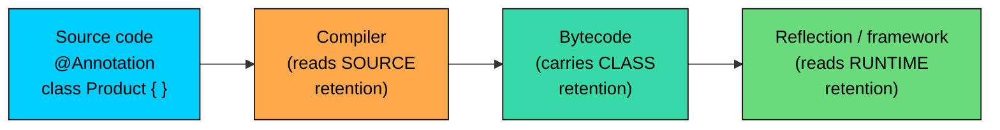
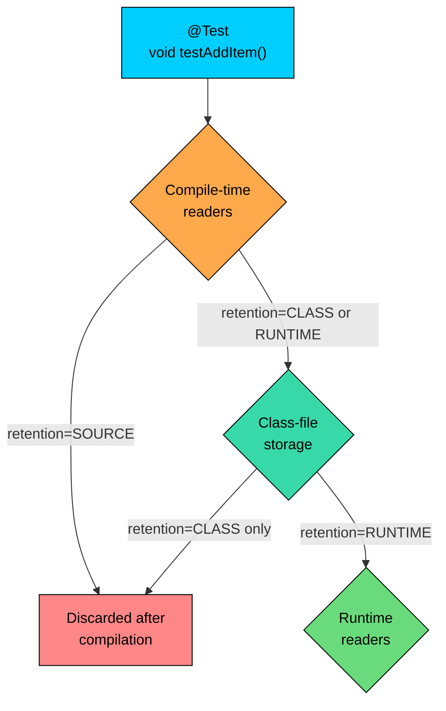

import React from 'react';
import CodeBlock from '../../../../components/ui/CodeBlock';
import Callout from '../../../../components/ui/Callout';

<div className="article-header">
  <div className="breadcrumb">
    <a href="/">Curated Notes</a>
    <span className="breadcrumb-separator">›</span>
    <span className="breadcrumb-current">Annotations Basics</span>
  </div>
  <h1>Annotations Basics</h1>
  <p style={{ color: 'var(--text-muted)', fontSize: '1.1rem', marginBottom: '16px', lineHeight: '1.6' }}>
    Master the essentials of Annotations Basics in this curated guide.
  </p>
  <div className="meta-info">
    <span className="meta-item">
      <svg width="14" height="14" viewBox="0 0 24 24" fill="none" stroke="currentColor" strokeWidth="2"><circle cx="12" cy="12" r="10"/><polyline points="12 6 12 12 16 14"/></svg>
      10 min read
    </span>
    <span className="difficulty-badge difficulty-badge--intermediate">Intermediate</span>
  </div>
</div>

<section className="content-section">

An annotation is a small piece of metadata you attach to your Java code. It does not run, it does not store state, and it does not change what the surrounding method or class does on its own. It sits next to the code like a sticky note that the compiler, the JVM, or some framework can read and react to. This lesson covers what annotations are, what they look like, where you can put them, and how the platform sees them at a high level.

If you have ever written `@Override` above a method, you have already used an annotation. That single line told the compiler to verify the method actually overrides something from a parent class. The rest of this section will explain how that mechanism works, how to build your own annotations, and what frameworks like Spring and JUnit do with them. We start with the syntax and the model.

---

## What an Annotation Is

An annotation is a marker that lives in your source code and carries information about the code it is attached to. The information is read by a tool. The tool might be the compiler (rejecting your code if the annotation says something is inconsistent), the JVM at startup (turning on certain checks), a framework like Spring or JUnit (wiring beans or running test methods), or a code generator like Lombok (writing extra source for you at build time).

The key idea is that the annotation itself does nothing. It is data. Without a reader, an annotation is inert. A `@Test` method in a JUnit test class is just a regular method until the JUnit runner walks the class with reflection, finds the methods marked `@Test`, and calls them. A `@Entity` class in a JPA application is just a plain class until Hibernate scans the classpath, sees the annotation, and maps the class to a database table.

This separation between the marker and its reader is what makes annotations so flexible. The same syntax can be used to tell the compiler one thing, the JVM something else, and a framework a third thing. The annotations are uniform; the readers decide what to do with them.





The diagram shows the three places an annotation can be read. The compiler reads it during compilation. The bytecode can carry it forward so that the JVM or a framework reads it at runtime. Each annotation declares which of these stages it sticks around for.

Before annotations existed, Java code that needed metadata used naming conventions, marker interfaces, or external XML configuration. A test framework might have required every test method to start with the prefix `test`. A serialization library might have required your class to implement `java.io.Serializable`, an empty marker interface with no methods. A web framework might have asked you to register every controller in an XML file. Annotations replaced all three patterns with a single uniform mechanism: put a marker on the element, and let the tool find it.

Here is the simplest possible example. A class that has been around for a while is marked as deprecated so that the compiler can warn anyone who still uses it.


```java
public class DeprecatedExample {

    @Deprecated
    static double oldDiscountRate() {
        return 0.05;
    }

    public static void main(String[] args) {
        double rate = oldDiscountRate();
        System.out.println("Discount: " + rate);
    }
}
```


The program compiles and runs. The `@Deprecated` annotation does not stop the call. It tells the compiler to print a warning, which shows up in IDEs as a strikethrough on the method name and in the compiler output as a "uses or overrides a deprecated API" message. The annotation is the marker. The compiler is the reader. The behavior at runtime is unchanged.

---

## Anatomy of an Annotation

Every annotation starts with `@` followed by the annotation's name. The name resolves like any other class name: if the annotation is declared in `java.lang`, no import is needed. Otherwise you import it like a class. Beyond the name, an annotation can carry zero or more named parameters called **elements**. Those elements give the annotation its data.

There are three shapes you will see in practice.

**Marker annotation (no elements).** The annotation carries no data, only the fact that it is present. `@Override` is the classic example.


```java
public class MarkerExample {

    static class Product {
        String name;

        @Override
        public String toString() {
            return "Product[" + name + "]";
        }
    }

    public static void main(String[] args) {
        Product item = new Product();
        item.name = "Notebook";
        System.out.println(item);
    }
}
```


The `@Override` annotation has no parameters. Its presence tells the compiler to verify that `toString` actually overrides a method from `Object`, which it does. If you misspelled the method name as `tostring`, the compiler would reject the code because there is no `tostring` in `Object` to override. The annotation is doing no work at runtime. It just trips the compiler check at build time.

**Single-element annotation.** The annotation has one element, and Java lets you omit the element name when there is only one and it is named `value`.


```java
public class SingleValueExample {

    @SuppressWarnings("unchecked")
    static java.util.List<String> loadProductNames() {
        java.util.List raw = new java.util.ArrayList();
        raw.add("Notebook");
        raw.add("Pen");
        return raw;
    }

    public static void main(String[] args) {
        java.util.List<String> names = loadProductNames();
        System.out.println(names);
    }
}
```


`@SuppressWarnings("unchecked")` is shorthand for `@SuppressWarnings(value = "unchecked")`. Because the element is named `value` and it is the only one, you can drop the `value =` part. This is the most common annotation shape after marker annotations.

**Multi-element annotation.** The annotation has multiple elements, and each one is supplied as `name = value`. Order does not matter.


```java
import java.lang.annotation.Annotation;

public class MultiElementExample {

    // A made-up framework annotation used here for illustration only.
    @interface Endpoint {
        String path();
        String method() default "GET";
    }

    @Endpoint(path = "/products", method = "POST")
    static void createProduct() {
        System.out.println("Creating product");
    }

    public static void main(String[] args) throws Exception {
        Endpoint marker = MultiElementExample.class
                .getDeclaredMethod("createProduct")
                .getAnnotation(Endpoint.class);
        System.out.println("path=" + marker.path() + ", method=" + marker.method());
    }
}
```


The element list looks like the argument list of a method call, but with `name = value` pairs separated by commas. Elements can have default values, in which case you can leave them out and they take the default. We are using a custom annotation here only to show the shape.

---

## Where Annotations Can Appear

Early versions of Java let you put annotations on a handful of declarations: classes, methods, fields. Over the years the language has opened up more locations, especially in Java 8, which added type-use annotations. Knowing where an annotation is allowed matters because the same annotation cannot be placed everywhere. Each annotation declares a list of legal targets, and the compiler enforces it.

Here is a tour of the legal locations.

**On a class, interface, enum, or record.**


```java
public class ClassLevelExample {

    @Deprecated
    static class LegacyCart {
        int itemCount;
    }

    public static void main(String[] args) {
        LegacyCart cart = new LegacyCart();
        cart.itemCount = 3;
        System.out.println("items=" + cart.itemCount);
    }
}
```


The annotation goes on its own line above the type declaration. The compiler attaches it to the type. Frameworks like JPA (`@Entity`), Spring (`@Service`, `@Controller`), and JUnit Jupiter (`@TestInstance`) lean heavily on class-level annotations to identify components.

**On a method.**


```java
public class MethodLevelExample {

    @Deprecated
    static double computeOldDiscount(double price) {
        return price * 0.05;
    }

    public static void main(String[] args) {
        System.out.println("Discount: " + computeOldDiscount(100.0));
    }
}
```


The annotation precedes the modifiers and return type. JUnit's `@Test`, Spring's `@RequestMapping`, and JPA's `@Transactional` are all method-level annotations in real frameworks.

**On a field.**


```java
public class FieldLevelExample {

    static class Product {
        String name;

        @Deprecated
        double oldPrice;

        double price;
    }

    public static void main(String[] args) {
        Product item = new Product();
        item.name = "Notebook";
        item.price = 12.99;
        System.out.println(item.name + " costs $" + item.price);
    }
}
```


The annotation sits above the field declaration. JPA uses field-level annotations like `@Id` and `@Column` to map a field to a database column. Jackson uses `@JsonProperty` to control JSON serialization.

**On a parameter.**


```java
public class ParameterLevelExample {

    static double applyDiscount(@Deprecated double oldRate, double price) {
        return price * (1 - oldRate);
    }

    public static void main(String[] args) {
        System.out.println("After discount: " + applyDiscount(0.1, 50.0));
    }
}
```


A parameter annotation goes between the type and the parameter name, or before the type if it is a type-use annotation. Spring uses `@RequestParam` and `@PathVariable` on controller parameters. Bean Validation uses `@NotNull` and `@Size`.

**On a constructor.**


```java
public class ConstructorLevelExample {

    static class Cart {
        int itemCount;

        @Deprecated
        Cart() {
            this.itemCount = 0;
        }
    }

    public static void main(String[] args) {
        Cart cart = new Cart();
        System.out.println("items=" + cart.itemCount);
    }
}
```


The annotation precedes the constructor declaration, in the same slot a method annotation would occupy. Dependency injection frameworks use `@Inject` or `@Autowired` on constructors to mark which one should be used to build the object.

**On a local variable.**


```java
public class LocalVariableExample {

    public static void main(String[] args) {
        @SuppressWarnings("unused")
        double unusedDiscount = 0.0;

        double price = 19.99;
        System.out.println("Price: $" + price);
    }
}
```


Local-variable annotations live just above the declaration. They are less common in framework code because frameworks usually cannot see inside method bodies, but the compiler reads them, which is why `@SuppressWarnings` on a local works.

**On a type parameter (Java 5+) and a type use (Java 8+).**

Type-use annotations are the most recent addition. They let you annotate any place a type appears, not just declarations. The classic use case is null analysis: a tool like the Checker Framework lets you write `List<@NonNull String> names` to say the list cannot contain nulls.


```java
import java.util.List;
import java.util.ArrayList;

public class TypeUseExample {

    // @Deprecated is not actually a type-use annotation in standard Java,
    // but the location shown here is what a type-use annotation looks like.
    // We use @SuppressWarnings on a parameter to illustrate placement.

    static int sum(@SuppressWarnings("unused") List<Integer> quantities) {
        int total = 0;
        for (int q : quantities) total += q;
        return total;
    }

    public static void main(String[] args) {
        List<Integer> cart = new ArrayList<>();
        cart.add(2);
        cart.add(3);
        System.out.println("total=" + sum(cart));
    }
}
```


The placement before `List<Integer>` is a parameter-target placement. A genuine type-use annotation could also sit between `List<` and `Integer>`, attached specifically to the element type. The list of valid targets is summarized in the next table.

Here is the full set of targets the standard library defines. Each annotation declares a subset of these using `@Target`.


| Target | Example placement | Common uses |
| --- | --- | --- |
| `TYPE` | Class, interface, enum, record, annotation type | `@Entity`, `@Service`, `@Deprecated` |
| `FIELD` | Instance and static fields | `@Id`, `@Column`, `@Inject` |
| `METHOD` | Method declarations | `@Test`, `@Override`, `@Deprecated` |
| `PARAMETER` | Method or constructor parameters | `@RequestParam`, `@NotNull` |
| `CONSTRUCTOR` | Constructor declarations | `@Autowired`, `@Inject` |
| `LOCAL_VARIABLE` | Local variables inside a method | `@SuppressWarnings` |
| `ANNOTATION_TYPE` | Other annotation declarations (meta-annotations) | `@Target`, `@Retention` |
| `PACKAGE` | A `package-info.java` file | `@Deprecated`, `@NonNull` defaults |
| `TYPE_PARAMETER` | Generic type parameters like `<T>` (Java 8+) | `@NonNull T` |
| `TYPE_USE` | Any use of a type, including casts and `new` (Java 8+) | `@NonNull String`, `@ReadOnly` |
| `MODULE` | Module declarations (Java 9+) | Module metadata in `module-info.java` |
| `RECORD_COMPONENT` | Record components (Java 16+) | Component-level metadata |


The compiler enforces this. If you try to put `@Override` on a field, the compiler rejects it because `@Override` declares `METHOD` as its only valid target. Trying to misuse an annotation in the wrong location produces an error like "annotation type not applicable to this kind of declaration."

---

## Multiple Annotations and Repeated Annotations

You can place more than one annotation on the same element. They stack vertically, each on its own line, in any order.


```java
public class MultipleAnnotationsExample {

    static class LegacyCart {

        @Deprecated
        @SuppressWarnings("unused")
        static double computeOldDiscount(double price) {
            return price * 0.05;
        }
    }

    public static void main(String[] args) {
        System.out.println("Discount: " + LegacyCart.computeOldDiscount(100.0));
    }
}
```


The order of two different annotations does not matter. Each one is read independently by whichever tool cares about it. Frameworks routinely stack four or five annotations on a single method: one for the route, one for the HTTP method, one for the response type, one for security, and so on.

Repeating **the same** annotation on one element is a separate feature added in Java 8 called **repeatable annotations**. Not every annotation supports being repeated; the annotation has to opt in by declaring a container annotation. The standard library's `@SuppressWarnings` is not repeatable, but you can pass it multiple values as an array, which is the older pattern.


```java
public class SuppressArrayExample {

    @SuppressWarnings({"unchecked", "rawtypes"})
    static java.util.List<String> loadProducts() {
        java.util.List raw = new java.util.ArrayList();
        raw.add("Notebook");
        return raw;
    }

    public static void main(String[] args) {
        System.out.println(loadProducts());
    }
}
```


The curly braces around `{"unchecked", "rawtypes"}` are an array literal. This is the array form of `@SuppressWarnings`, which takes a `String[]`. Repeatable annotations are a fuller, more recent mechanism for the same idea, and we will not dig into the difference here. One element can carry multiple pieces of metadata, whether through multiple distinct annotations, an array-valued single annotation, or repeated identical annotations.

---

## How the Compiler and Runtime See Annotations

The mental model of annotations changes depending on which tool you are imagining reading them. There are three stages at which an annotation can be read.

**At compile time.** The compiler reads the annotations on the source it is processing and may react to them directly. `@Override` triggers a check. `@Deprecated` triggers warnings. `@SuppressWarnings` turns warnings off. The compiler also runs a separate mechanism called **annotation processing**, which lets external tools see your annotations during compilation and generate new source files. Lombok and many code generators use this.

**In the compiled class file.** Some annotations survive the compile step and are written into the bytecode. The bytecode format has dedicated entries for annotations on classes, methods, fields, and other elements. A class file viewer can dump them. Whether an annotation makes it into the bytecode is controlled by its retention policy.

**At runtime.** If an annotation's retention policy is `RUNTIME`, the JVM keeps it available, and your code can read it back using the Reflection API. Frameworks lean on this. Spring scans for `@Component` at startup. JUnit scans for `@Test` to decide which methods to call. Hibernate scans for `@Entity` and `@Column` to build its mapping. The pattern is always the same: walk the classes with reflection, ask each class or method "do you have annotation X," and act on the answer.





The diagram traces an annotation through the three stages. Annotations with `SOURCE` retention vanish after compilation. Annotations with `CLASS` retention survive into the bytecode but are not loaded by the JVM at runtime. Annotations with `RUNTIME` retention are loaded with the class and are visible to reflection. The diagram is here to give you a feel for why those three policies exist.

Here is a small program that reads a runtime annotation back through reflection. The annotation, attached at compile time, comes back at runtime as a real object.


```java
import java.lang.annotation.Annotation;
import java.lang.reflect.Method;

public class ReadAnnotationExample {

    static class WishlistService {

        @Deprecated
        public void addItem(String productName) {
            System.out.println("Adding " + productName);
        }
    }

    public static void main(String[] args) throws Exception {
        Method m = WishlistService.class.getDeclaredMethod("addItem", String.class);
        Annotation[] annotations = m.getAnnotations();

        for (Annotation a : annotations) {
            System.out.println("Found: " + a.annotationType().getSimpleName());
        }
    }
}
```


The code grabs the `addItem` method object, asks it for the annotations attached to it, and prints each annotation's type name. `@Deprecated` has `RUNTIME` retention, so the JVM kept it around for reflection to find. If `@Deprecated` had been a `SOURCE`-only annotation, the loop would print nothing.

---

## What Annotations Are Not

Beginners often expect more from annotations than they actually do. Three clarifications save a lot of confusion later.

**An annotation does not execute code by itself.** Writing `@Test` on a method does not cause the method to run. JUnit runs the method, after scanning for the annotation. Writing `@Transactional` does not start a transaction on its own. Spring intercepts the call, sees the annotation, and starts the transaction around it. Without a reader, the annotation is silent. This is the most important difference between annotations and the kind of decorators or attributes you may have seen in other systems.

**An annotation is not a comment.** Comments are stripped by the compiler and have no programmatic representation. Annotations are first-class language elements with declared types, type-checked elements, and a defined lifecycle (source, class file, runtime). The compiler validates them, the tool ecosystem reads them, and the JVM has dedicated bytecode entries for them. A misspelled annotation is a compile error. A misspelled comment is just a different comment.

**An annotation does not change behavior on its own.** It changes behavior only when something reads it and chooses to act differently. `@Override` does not change how the method runs; it changes whether the file compiles. `@FunctionalInterface` does not change how an interface behaves; it changes whether the compiler enforces the single-abstract-method rule. The behavior change always comes from the reader, never from the annotation.

One way to think about it: an annotation is a data attribute on a program element, and the rest of the toolchain (compiler, JIT, JVM, frameworks, IDE, build tools) decides what that attribute means.

---

## A Quick Tour Using `@Override` and `@Deprecated`

Here are the two annotations you will see most often, used the way they normally appear in code. We are only looking at the shape and the compiler's reaction, not at every rule that governs each one.

`@Override` says, "I am overriding a method from a parent class or interface, and I want the compiler to confirm it."


```java
public class OverrideShape {

    static class Product {
        String name;

        @Override
        public String toString() {
            return "Product[" + name + "]";
        }
    }

    public static void main(String[] args) {
        Product item = new Product();
        item.name = "Headphones";
        System.out.println(item);
    }
}
```


The `@Override` is the safety net. If a future refactor changes `Object.toString()` (it will not, but the same logic applies to any parent class you control), or if you misspell the method name as `toStringg`, the compiler will tell you the method does not actually override anything. Without the annotation, your method would silently become an unrelated new method, and the parent class's `toString` would still be used.

`@Deprecated` says, "This element should not be used in new code, even though it still works."


```java
public class DeprecatedShape {

    @Deprecated
    static double oldDiscountRate() {
        return 0.05;
    }

    static double newDiscountRate() {
        return 0.10;
    }

    public static void main(String[] args) {
        double promo = oldDiscountRate();
        double standard = newDiscountRate();
        System.out.println("old=" + promo + ", new=" + standard);
    }
}
```


The code compiles and runs. The compiler emits a deprecation warning at the call site, and IDEs typically render the call with a strikethrough.

The takeaway is the shape. `@AnnotationName` above a declaration, possibly with elements in parentheses, attaches metadata to that declaration. The compiler and the rest of the platform take it from there.

</section>
