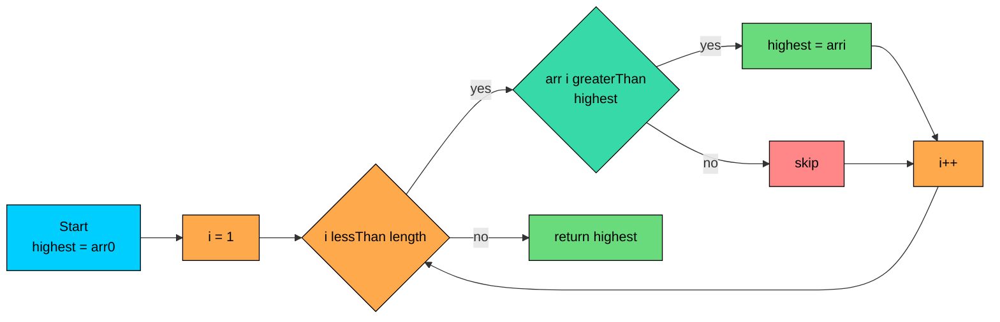
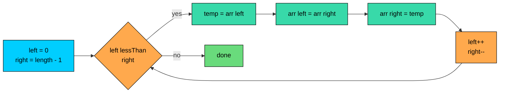

import React from 'react';
import CodeBlock from '../../../../components/ui/CodeBlock';
import Callout from '../../../../components/ui/Callout';

<div className="article-header">
  <div className="breadcrumb">
    <a href="/">Curated Notes</a>
    <span className="breadcrumb-separator">›</span>
    <span className="breadcrumb-current">Array Operations</span>
  </div>
  <h1>Array Operations</h1>
  <p style={{ color: 'var(--text-muted)', fontSize: '1.1rem', marginBottom: '16px', lineHeight: '1.6' }}>
    Master the essentials of Array Operations in this curated guide.
  </p>
  <div className="meta-info">
    <span className="meta-item">
      <svg width="14" height="14" viewBox="0 0 24 24" fill="none" stroke="currentColor" strokeWidth="2"><circle cx="12" cy="12" r="10"/><polyline points="12 6 12 12 16 14"/></svg>
      10 min read
    </span>
    <span className="difficulty-badge difficulty-badge--intermediate">Intermediate</span>
  </div>
</div>

<section className="content-section">

Once you have an array, the next question is what to do with it. Almost everything you'll ever do to an array, totalling a cart, finding the most expensive product, checking whether a customer ID is in a list, fits into a handful of standard patterns. This lesson walks through the patterns one at a time, using arrays you'd actually see in an online store. The previous lesson covered how to declare arrays and read `length`. Here, we put those arrays to work.

---

## Iterating with a Counted For Loop

The counted `for` loop is the workhorse of array work. The shape `for (int i = 0; i < arr.length; i++)` reads every element exactly once, in order, and gives you the index along the way. The index lets you compare adjacent items, print position numbers, or write back into the array at the right slot.


```java
public class PrintProductPrices {
    public static void main(String[] args) {
        double[] productPrices = {19.99, 49.50, 12.00, 8.75};
        for (int i = 0; i < productPrices.length; i++) {
            System.out.println("Product " + (i + 1) + ": $" + productPrices[i]);
        }
    }
}
```


The `(i + 1)` when printing the product number adjusts for the fact that indices start at `0`, while humans count from `1`. The counted form lets you do this because you have the index in your hand.

The condition uses `<`, not `<=`. An array of length `4` has indices `0`, `1`, `2`, `3`. If you wrote `i <= productPrices.length`, the loop would try to read `productPrices[4]` on the last pass and throw `ArrayIndexOutOfBoundsException`.

Reading `arr.length` is O(1). It's a fixed field on the array object, not a calculation, so calling it inside the loop condition is free. Don't bother hoisting it into a separate variable.

---

## Iterating with the Enhanced For Loop

When you only need the values and don't care about the index, the enhanced `for` loop is cleaner. It reads each element in order, binds it to a name, and runs the body. No counter, no `length` check, no chance of an off-by-one bug.


```java
public class PrintCartItems {
    public static void main(String[] args) {
        String[] cartItems = {"Notebook", "Pen", "Sticky Notes"};
        for (String item : cartItems) {
            System.out.println("In cart: " + item);
        }
    }
}
```


Read `for (String item : cartItems)` as "for each `String item` in `cartItems`". The loop variable `item` holds one element per iteration, starting at index `0` and ending at the last element. You never see the index.

Use the enhanced form when:

- You only need to read each element.
- You don't need to know which position you're at.
- You don't need to skip elements or stop early at a specific index.

Use the counted form when:

- You need the index to print, compare with neighbors, or write back.
- You want to walk the array backwards or in steps other than `1`.
- You're working with two arrays at once and using the same index for both.

The enhanced-for variable is a **copy** of the element for primitives, and a copy of the reference for objects. Either way, assigning to it does not change the array.

**What's wrong with this code?**


```java
public class DoubleStockBug {
    public static void main(String[] args) {
        int[] stockCounts = {3, 5, 2, 8};
        for (int count : stockCounts) {
            count = count * 2;
        }
        for (int i = 0; i < stockCounts.length; i++) {
            System.out.println(stockCounts[i]);
        }
    }
}
```


The author wanted to double every stock count. They didn't. The variable `count` is a fresh `int` each pass, holding a copy of the array element. Assigning to `count` updates that local copy and nothing else. The array is unchanged.

**Fix:**


```java
public class DoubleStockFixed {
    public static void main(String[] args) {
        int[] stockCounts = {3, 5, 2, 8};
        for (int i = 0; i < stockCounts.length; i++) {
            stockCounts[i] = stockCounts[i] * 2;
        }
        for (int count : stockCounts) {
            System.out.println(count);
        }
    }
}
```


To modify elements you need the index, which means the counted `for` is appropriate. The enhanced `for` is read-only by convention.

---

## Summing Elements

Adding up every element is the most common reason to loop over an array. A shopping cart subtotal, the total stock across warehouses, the sum of ratings for an average, all of them follow the same shape: start at zero, add each element, keep going.


```java
public class CartSubtotal {
    public static void main(String[] args) {
        double[] productPrices = {19.99, 49.50, 12.00, 8.75};
        double subtotal = 0.0;
        for (double price : productPrices) {
            subtotal = subtotal + price;
        }
        System.out.println("Cart subtotal: $" + subtotal);
    }
}
```


The accumulator variable `subtotal` is declared **outside** the loop, initialized to `0.0`, and updated inside. Both placements matter. Declaring it outside means it survives across iterations and is available after the loop ends. Initializing to `0.0` matches the identity for addition, so the first add gives back the first element.

You can write `subtotal = subtotal + price` or `subtotal += price`. Both compile to the same bytecode. Pick one and stay consistent within a method.

A common mistake is putting the accumulator declaration inside the loop body, which resets it every iteration.

**What's wrong with this code?**


```java
int[] orderTotals = {25, 40, 18};
for (int total : orderTotals) {
    int grandTotal = 0;
    grandTotal = grandTotal + total;
    System.out.println(grandTotal);
}
```


`grandTotal` is declared inside the loop, so each pass creates a new variable initialized to `0`. The loop prints `25`, `40`, `18` instead of the running total. Move the declaration above the loop and the running total works.

---

## Finding the Max and Min

Finding the largest or smallest element follows a different shape from summing. Instead of an accumulator that grows, you keep a **best-so-far** value. Each new element either beats it or doesn't.


```java
public class HighestPrice {
    public static void main(String[] args) {
        double[] productPrices = {19.99, 49.50, 12.00, 8.75, 33.25};
        double highest = productPrices[0];
        for (int i = 1; i < productPrices.length; i++) {
            if (productPrices[i] > highest) {
                highest = productPrices[i];
            }
        }
        System.out.println("Highest price: $" + highest);
    }
}
```


Two details. First, `highest` starts at `productPrices[0]`, not at `0`. If the array contained only negative numbers, initializing to `0` would give a wrong answer because `0` would beat every real value. Using the first element as the seed dodges that trap entirely. Second, the loop starts at `i = 1`, not `i = 0`, because we already used index `0` to seed `highest`. Starting at `0` would just re-check the same element against itself, which is harmless but wasted work.

The same pattern flipped finds the minimum. Use `<` instead of `>` and rename the variable.


```java
public class LowestStock {
    public static void main(String[] args) {
        int[] stockCounts = {12, 4, 30, 7, 1, 15};
        int lowest = stockCounts[0];
        for (int i = 1; i < stockCounts.length; i++) {
            if (stockCounts[i] < lowest) {
                lowest = stockCounts[i];
            }
        }
        System.out.println("Lowest stock count: " + lowest);
    }
}
```


What if the array is empty? Then `productPrices[0]` throws `ArrayIndexOutOfBoundsException` because there's no element at index `0`. In real code, check the length first or decide what "max of an empty list" means for your application. Some teams return a sentinel value, some throw an exception. Both are valid choices, just be deliberate about it.





The diagram shows the flow. Seed the answer from the first element, walk the rest, and replace the best-so-far whenever you see something better. That same shape, with a different comparison, gives you min, longest string, cheapest in-stock product, and dozens of other "find the best" operations.

---

## Counting Matches

Counting how many elements satisfy a condition is the same shape as summing, except you add `1` per match instead of adding the element itself.


```java
public class InStockCount {
    public static void main(String[] args) {
        int[] stockCounts = {0, 5, 0, 12, 3, 0, 8};
        int inStock = 0;
        for (int count : stockCounts) {
            if (count > 0) {
                inStock++;
            }
        }
        System.out.println("Products in stock: " + inStock);
    }
}
```


The condition is whatever question you're asking. "In stock" means `count > 0`. "Premium product" means `price > 50`. "Low stock" means `count < 5 && count > 0`. The body just bumps a counter when the condition holds.

You can also tally by category. Here we count products by price bucket.


```java
public class PriceBuckets {
    public static void main(String[] args) {
        double[] productPrices = {12.50, 49.99, 8.00, 75.25, 22.00, 5.50};
        int under10 = 0;
        int between10and50 = 0;
        int over50 = 0;
        for (double price : productPrices) {
            if (price < 10.00) {
                under10++;
            } else if (price <= 50.00) {
                between10and50++;
            } else {
                over50++;
            }
        }
        System.out.println("Under $10: " + under10);
        System.out.println("$10 to $50: " + between10and50);
        System.out.println("Over $50: " + over50);
    }
}
```


Three counters, one pass through the array, and an `if/else if/else` chain to route each element to the right bucket. The `else if` matters because the branches are mutually exclusive: a price of `9.99` should only increment `under10`, not also `between10and50`.

---

## Linear Search

A linear search asks a simple question: is this value somewhere in the array, and if so, where? "Did the customer buy product 47?" "Where is the cart item with name `Notebook`?" The algorithm walks the array element by element and stops as soon as it finds a match.

Finding the index of a value, returning `-1` if it's not there, is the canonical form.


```java
public class FindProductId {
    public static void main(String[] args) {
        int[] productIds = {1042, 2017, 5588, 3301, 7704};
        int target = 5588;
        int foundAt = -1;
        for (int i = 0; i < productIds.length; i++) {
            if (productIds[i] == target) {
                foundAt = i;
                break;
            }
        }
        if (foundAt == -1) {
            System.out.println("Product " + target + " not found.");
        } else {
            System.out.println("Product " + target + " found at index " + foundAt);
        }
    }
}
```


The variable `foundAt` starts at `-1`, the conventional "not found" sentinel. The loop walks the array, and the first time it sees a match, it records the index and `break`s out. `break` exits the loop immediately, skipping the rest of the elements. There's no point checking after we already have an answer.

If you only care **whether** the value exists, not where, you can use a `boolean` flag instead.


```java
public class HasNotebook {
    public static void main(String[] args) {
        String[] cartItems = {"Pen", "Notebook", "Sticky Notes"};
        boolean hasNotebook = false;
        for (String item : cartItems) {
            if (item.equals("Notebook")) {
                hasNotebook = true;
                break;
            }
        }
        System.out.println("Notebook in cart? " + hasNotebook);
    }
}
```


For strings, use `.equals()`, not `==`. The `==` operator on strings compares object identity (whether they're the exact same object in memory), which can be `true` or `false` for the same text depending on how the strings were created. `.equals()` compares the characters.

Linear search is O(n). To find an element in an array of `n` items, the worst case checks all `n` of them. If you do this often on the same data, sorting once and using binary search becomes worthwhile.

---

## Reversing an Array In Place

Reversing means putting the elements in the opposite order. "In place" means doing it inside the same array without allocating a new one. The technique is two indices walking toward each other from the ends, swapping elements as they go.


```java
public class ReverseRatings {
    public static void main(String[] args) {
        int[] customerRatings = {5, 4, 3, 2, 1};
        int left = 0;
        int right = customerRatings.length - 1;
        while (left < right) {
            int temp = customerRatings[left];
            customerRatings[left] = customerRatings[right];
            customerRatings[right] = temp;
            left++;
            right--;
        }
        for (int rating : customerRatings) {
            System.out.print(rating + " ");
        }
        System.out.println();
    }
}
```


Walk through what happens with `{5, 4, 3, 2, 1}`:


| Step | left | right | Before swap | After swap |
| ---- | ---- | ----- | ----------- | ---------- |
| 1 | 0 | 4 | `{5, 4, 3, 2, 1}` | `{1, 4, 3, 2, 5}` |
| 2 | 1 | 3 | `{1, 4, 3, 2, 5}` | `{1, 2, 3, 4, 5}` |
| 3 | 2 | 2 | loop exits because `left < right` is `false` |  |


When the array length is odd, the two pointers eventually land on the same index. The middle element doesn't need to move, so we stop. When the length is even, they cross past each other and the condition `left < right` becomes `false`.





The diagram shows the in-place reverse. Two indices walk inward, swap on each step, and stop when they meet. Total work is `length / 2` swaps, so the operation is O(n) in time and O(1) in extra space because we never allocate a new array.

You could write the same logic with a counted `for` loop and a single index.


```java
public class ReverseWithFor {
    public static void main(String[] args) {
        int[] customerRatings = {5, 4, 3, 2, 1};
        int n = customerRatings.length;
        for (int i = 0; i < n / 2; i++) {
            int temp = customerRatings[i];
            customerRatings[i] = customerRatings[n - 1 - i];
            customerRatings[n - 1 - i] = temp;
        }
        for (int rating : customerRatings) {
            System.out.print(rating + " ");
        }
        System.out.println();
    }
}
```


Same algorithm, same result, just one loop variable instead of two. Use whichever shape reads more clearly to you. Once you've seen both, the two-pointer form tends to win because the index arithmetic is right there in the variables.

---

## Swapping Elements

The swap inside the reverse used a three-step pattern with a `temp` variable. It's worth pulling out and looking at on its own, because beginners often try to swap with two assignments and lose data.

The pattern:


```java
int temp = arr[i];
arr[i] = arr[j];
arr[j] = temp;
```


You save the value at `i` into `temp`, copy the value at `j` over to `i`, then put the saved value into `j`. Three steps, one temporary.

**What's wrong with this code?**


```java
int[] productIds = {1042, 2017, 5588};
productIds[0] = productIds[2];
productIds[2] = productIds[0];
System.out.println(productIds[0] + " " + productIds[2]);
```


The author wanted to swap index `0` and index `2`. They didn't get a swap, they got a duplicate. After the first line, `productIds[0]` is `5588`, and the original `1042` is gone. The second line copies the new `5588` back into `productIds[2]`, so both slots end up as `5588`. The output is `5588 5588`.

**Fix:**


```java
public class SwapFixed {
    public static void main(String[] args) {
        int[] productIds = {1042, 2017, 5588};
        int temp = productIds[0];
        productIds[0] = productIds[2];
        productIds[2] = temp;
        System.out.println(productIds[0] + " " + productIds[2]);
    }
}
```


The `temp` variable holds the value that's about to be overwritten, so it's still available when we need to put it in the other slot. Always use a temp for swaps. There are clever ways to swap two `int` values with XOR or arithmetic, but they're unreadable and don't generalize to other types. Stick with the temp.

---

## Filling an Array With a Value

Sometimes you want every slot to start with the same value. New stock arrays initialized to zero, ratings arrays initialized to `-1` to mean "not yet rated", flag arrays initialized to `false`. A `for` loop does the job in one line.


```java
public class InitRatings {
    public static void main(String[] args) {
        int[] customerRatings = new int[5];
        for (int i = 0; i < customerRatings.length; i++) {
            customerRatings[i] = -1;
        }
        for (int rating : customerRatings) {
            System.out.print(rating + " ");
        }
        System.out.println();
    }
}
```


A heads-up: Java already initializes `new int[5]` to all zeros, `new double[5]` to all `0.0`, `new boolean[5]` to all `false`, and `new String[5]` to all `null`. You only need a fill loop when the default isn't what you want. The `-1` here is a sentinel meaning "no rating yet", which is different from a real rating of `0`.

The Arrays utility class also has a built-in `Arrays.fill` method that does this in one call.

---

## Building a Running Total

A running total, also called a prefix sum, is an array where each element holds the sum of all elements up to and including that position in the original array. It's the same shape as summing, but you write down the intermediate result at each step instead of throwing it away.


```java
public class DailyRevenue {
    public static void main(String[] args) {
        int[] orderTotals = {120, 85, 200, 50, 175};
        int[] runningTotal = new int[orderTotals.length];
        runningTotal[0] = orderTotals[0];
        for (int i = 1; i < orderTotals.length; i++) {
            runningTotal[i] = runningTotal[i - 1] + orderTotals[i];
        }
        for (int i = 0; i < runningTotal.length; i++) {
            System.out.println("After order " + (i + 1) + ": $" + runningTotal[i]);
        }
    }
}
```


The first slot of `runningTotal` is just the first order. From index `1` onward, each slot is "the previous running total plus the current order". The loop starts at `i = 1` because we already filled `runningTotal[0]` by hand.

Building the running total is O(n), one pass through the array. Once it's built, asking "what was the total after order 3" is O(1), just a single array read. If you only need the total once, plain summing is enough. If you need many intermediate sums, the running total is worth the upfront cost.

---

## Common Pitfalls

A short list of common mistakes.

**Off-by-one with `<=`.** Using `i <= arr.length` instead of `i < arr.length` reads one past the end and throws `ArrayIndexOutOfBoundsException`. Indices run from `0` to `length - 1`. The pattern `i < length` visits exactly that range.

**Trying to modify with an enhanced for.** Assigning to the loop variable in `for (int x : arr)` updates a local copy, not the array. Use a counted `for` and index assignment when you need to write back.

**Starting `i` at `1` by accident.** Skipping the first element gives a wrong answer that's hard to spot because nothing crashes. Default to `i = 0`. Start at `1` only when you have a deliberate reason, like seeding a max from `arr[0]`.

**Forgetting to seed max/min from the first element.** Initializing `highest = 0` only works when you know every value is positive. Seed from `arr[0]` instead, and check that the array isn't empty first.

**Swapping without a temp.** The two-line "swap" loses the original value. Always use `int temp = arr[i]; arr[i] = arr[j]; arr[j] = temp;`.

**Comparing strings with `==`.** Use `.equals()` for content comparison. `==` checks object identity, which gives unreliable results for strings that look the same.

**Resetting the accumulator inside the loop.** Declaring `int total = 0` inside the loop body resets it every iteration and the final result is just the last element, not the sum. Declare the accumulator above the loop.

</section>
