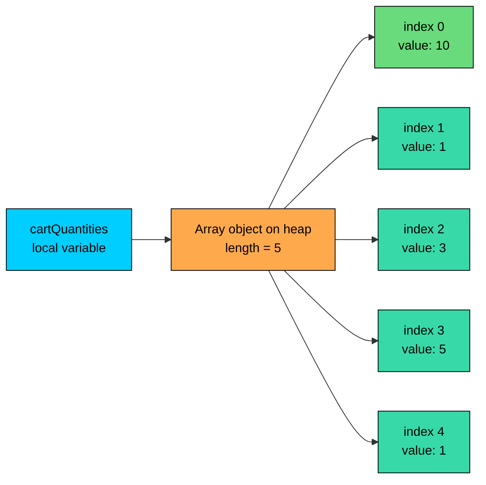
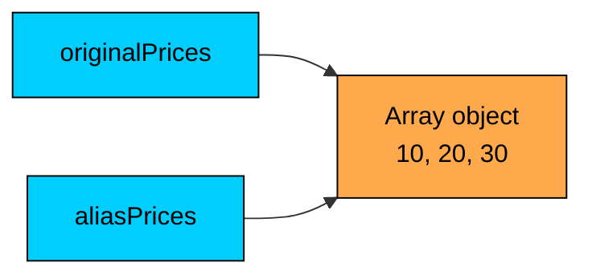
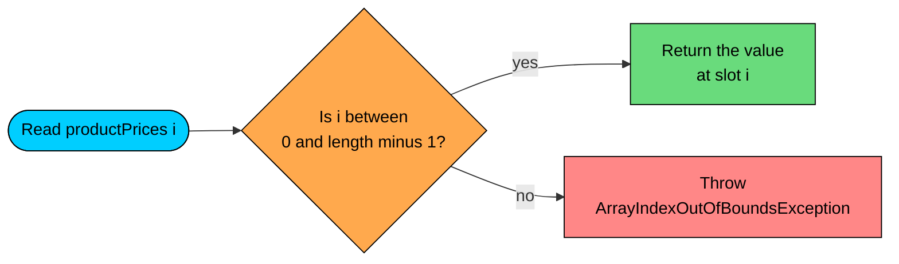

import React from 'react';
import CodeBlock from '../../../../components/ui/CodeBlock';
import Callout from '../../../../components/ui/Callout';

<div className="article-header">
  <div className="breadcrumb">
    <a href="/">Curated Notes</a>
    <span className="breadcrumb-separator">›</span>
    <span className="breadcrumb-current">Arrays Basics</span>
  </div>
  <h1>Arrays Basics</h1>
  <p style={{ color: 'var(--text-muted)', fontSize: '1.1rem', marginBottom: '16px', lineHeight: '1.6' }}>
    Master the essentials of Arrays Basics in this curated guide.
  </p>
  <div className="meta-info">
    <span className="meta-item">
      <svg width="14" height="14" viewBox="0 0 24 24" fill="none" stroke="currentColor" strokeWidth="2"><circle cx="12" cy="12" r="10"/><polyline points="12 6 12 12 16 14"/></svg>
      10 min read
    </span>
    <span className="difficulty-badge difficulty-badge--intermediate">Intermediate</span>
  </div>
</div>

<section className="content-section">

An array is Java's simplest way to hold many values of the same type under one name. Once you have an array, you can store a whole list of product prices, stock counts, or customer emails in a single variable and reach any one of them by position. This lesson covers what an array is, how to create one, how to read and write elements, and the small set of rules that make arrays both efficient and easy to misuse.

---

## Why Arrays Exist

Consider a shopping cart with five items where we want to track each item's price. Without arrays, the only tool we have is a separate variable for each value.


```java
public class CartWithoutArray {
    public static void main(String[] args) {
        double price1 = 29.99;
        double price2 = 49.50;
        double price3 = 19.00;
        double price4 = 99.99;
        double price5 = 15.25;

        double total = price1 + price2 + price3 + price4 + price5;
        System.out.println("Cart total: $" + total);
    }
}
```


This works, but it falls apart fast. What if the cart has 50 items? Or 500? You'd need a variable for every one, and any code that touches them has to spell each name out by hand. There's no way to write a loop that says "go through every price", because the names `price1`, `price2`, `price3` are unrelated to the computer. They just look related to humans.

An array fixes this. It groups values of the same type into a single object and gives each value an integer position called an **index**. With an array, the five prices live under one name, and we reach each one by asking for index `0`, `1`, `2`, and so on.


```java
public class CartWithArray {
    public static void main(String[] args) {
        double[] productPrices = {29.99, 49.50, 19.00, 99.99, 15.25};
        System.out.println("First price: $" + productPrices[0]);
        System.out.println("Last price: $" + productPrices[4]);
        System.out.println("Number of items: " + productPrices.length);
    }
}
```


The benefit isn't just shorter code. It's that the values now form a real collection the program can walk through, count, or pass around as one thing. The rest of this lesson breaks down how that works.

---

## Declaring an Array

Declaring an array variable tells Java the type of values it will hold. Two syntax forms exist.


```java
int[] stockCounts;   // preferred, modern Java style
int stockCounts[];   // legacy C-style syntax
```


Both compile and behave identically. The first form is the convention in modern Java because it reads as "an `int` array named `stockCounts`", which matches how you'd say it out loud. The second form is left over from Java's C heritage and turns up occasionally in older code or in method signatures, but new code should stick with `int[]`.

A declaration on its own does not create the array. It only creates a variable that **could** point to one. Until we assign an actual array to it, the variable holds `null`.


```java
public class DeclareOnly {
    public static void main(String[] args) {
        int[] stockCounts;
        // System.out.println(stockCounts.length); // Compile error: variable not initialized
        System.out.println("Variable declared but no array yet.");
    }
}
```


Trying to read `stockCounts.length` before assigning anything to it gives a compile-time error inside a method, because Java requires local variables to be definitely assigned before use. The fix is to assign an array, which the next section covers.

---

## Creating an Array with `new`

To create an array, use the `new` keyword followed by the type and a size in square brackets.


```java
public class CreateWithNew {
    public static void main(String[] args) {
        int[] stockCounts = new int[5];
        System.out.println("First stock count: " + stockCounts[0]);
        System.out.println("Array length: " + stockCounts.length);
    }
}
```


`new int[5]` allocates an array that can hold five `int` values and returns a reference to it. The variable `stockCounts` then points at that array. The size, `5`, fixes the capacity. Once set, the array's length is locked in for its lifetime. You cannot grow it later. If you need a list that resizes itself, Java has `ArrayList` for that, which we cover in Section 15.

You can split the declaration and the creation across two lines if it helps readability.


```java
public class SplitDeclaration {
    public static void main(String[] args) {
        double[] productRatings;
        productRatings = new double[3];
        productRatings[0] = 4.5;
        productRatings[1] = 3.0;
        productRatings[2] = 5.0;
        System.out.println("First rating: " + productRatings[0]);
    }
}
```


The size doesn't have to be a constant. Any `int` expression works, including a variable or a value read from a method.


```java
public class DynamicSize {
    public static void main(String[] args) {
        int cartItemCount = 7;
        String[] customerEmails = new String[cartItemCount];
        System.out.println("Created an array with room for " + customerEmails.length + " emails.");
    }
}
```


`new int[n]` allocates memory for `n` slots and zero-initializes every slot. The cost grows with `n`. A `new int[1_000_000_000]` will try to allocate four gigabytes and most likely throw `OutOfMemoryError`. Size your arrays to the data you actually have.

---

## Default Values

When you create an array with `new`, Java fills every slot with that type's default value before handing the array back to you. The default depends on the element type.


| Element type | Default value |
| ------------ | ------------- |
| `byte`, `short`, `int`, `long` | `0` |
| `float`, `double` | `0.0` |
| `char` | `'\u0000'` (the null character) |
| `boolean` | `false` |
| Any object type (`String`, custom classes) | `null` |


This matters because reading a slot you never wrote to is legal. It returns the default rather than failing.


```java
public class DefaultValues {
    public static void main(String[] args) {
        int[] stockCounts = new int[3];
        double[] productPrices = new double[3];
        boolean[] inStockFlags = new boolean[3];
        String[] customerEmails = new String[3];

        System.out.println("int default:     " + stockCounts[0]);
        System.out.println("double default:  " + productPrices[0]);
        System.out.println("boolean default: " + inStockFlags[0]);
        System.out.println("String default:  " + customerEmails[0]);
    }
}
```


The `String` default is `null`, not the empty string `""`. That distinction matters. A `null` reference points at nothing, so trying to call a method on it throws `NullPointerException`. An empty string is still a real `String` object that just happens to contain zero characters. We'll see what `null` elements look like in practice later in this lesson.

---

## Array Literals

When you already know the values an array should hold, the array-literal syntax skips the `new` ceremony entirely. List the values in braces and Java figures out the size and the type from the context.


```java
public class ArrayLiteral {
    public static void main(String[] args) {
        int[] productPrices = {29, 49, 19, 99, 15};
        System.out.println("Item at index 0: $" + productPrices[0]);
        System.out.println("Item at index 3: $" + productPrices[3]);
        System.out.println("Total items: " + productPrices.length);
    }
}
```


The literal `{29, 49, 19, 99, 15}` creates an `int[]` of length `5` and stores the listed values at indices `0` through `4`, in order. It's shorthand for the slightly longer `new int[]{29, 49, 19, 99, 15}` form, which you must use if you're assigning the array somewhere other than the original declaration.


```java
public class ArrayLiteralLater {
    public static void main(String[] args) {
        int[] productPrices;
        productPrices = new int[]{29, 49, 19, 99, 15};
        System.out.println("First price: $" + productPrices[0]);
    }
}
```


Without the `new int[]` prefix, `productPrices = {29, 49, ...};` would not compile, because the brace form is only allowed in the same statement as the declaration.

String arrays work the same way.


```java
public class CategoryNames {
    public static void main(String[] args) {
        String[] productCategories = {"Books", "Electronics", "Clothing", "Toys"};
        System.out.println("Second category: " + productCategories[1]);
        System.out.println("Number of categories: " + productCategories.length);
    }
}
```


---

## Indexing and the `length` Field

Every element in an array has an index, starting at `0`. An array of length `N` has valid indices `0` through `N - 1`. Read or write an element using square brackets with the index inside.


```java
public class IndexingExample {
    public static void main(String[] args) {
        int[] cartQuantities = {2, 1, 3, 5, 1};

        // Read
        int firstQuantity = cartQuantities[0];
        int thirdQuantity = cartQuantities[2];
        System.out.println("First item quantity: " + firstQuantity);
        System.out.println("Third item quantity: " + thirdQuantity);

        // Write
        cartQuantities[0] = 10;
        System.out.println("Updated first quantity: " + cartQuantities[0]);
    }
}
```


The expression `cartQuantities[0]` is read as "the element of `cartQuantities` at index `0`". On the right side of an `=`, it reads the value. On the left side, it writes a new value into that slot.

Here's how the array sits in memory after the write. The variable holds a reference to an object on the heap, and the object holds the actual values plus a length.





The variable on the left doesn't contain the five numbers. It contains a single reference (an arrow) that points at the array object. We'll come back to that detail in a moment.

To find out how many elements an array has, use the `length` field. Two important rules about `length`:

- It is a **field**, not a method. There are no parentheses. `cartQuantities.length` is correct. `cartQuantities.length()` is a compile error.
- It is **final**. You can read it but you cannot assign to it. The size is fixed when the array is created.


```java
public class LengthField {
    public static void main(String[] args) {
        int[] orderIds = {101, 102, 103, 104, 105, 106};
        System.out.println("Number of orders: " + orderIds.length);
        System.out.println("Last index: " + (orderIds.length - 1));
        System.out.println("Last order ID: " + orderIds[orderIds.length - 1]);
    }
}
```


The pattern `array[array.length - 1]` is the standard way to read the last element. It works for any non-empty array regardless of size.

`arr.length` is O(1). Java stores the length in a header inside the array object, so reading it is a single memory access and never depends on how big the array is.

For now, knowing how to index by hand and how to ask the array for its length is enough.

---

## Arrays Are Reference Types

An array variable does not hold the array's data. It holds a **reference** to the array object, which lives on the heap. We touched on reference types in Section 2's [Reference Types](/learn/java/reference-types) lesson, so this is a quick recap focused on what it means for arrays specifically.

Two consequences matter:

- Assigning one array variable to another does not copy the array. Both variables point at the same object.
- Passing an array to a method does not copy it either. The method receives the same reference and can change the original.

Here's the assignment case.


```java
public class ArrayAliasing {
    public static void main(String[] args) {
        int[] originalPrices = {10, 20, 30};
        int[] aliasPrices = originalPrices;

        aliasPrices[0] = 999;

        System.out.println("originalPrices[0] = " + originalPrices[0]);
        System.out.println("aliasPrices[0]    = " + aliasPrices[0]);
    }
}
```


Writing through `aliasPrices` is visible through `originalPrices`, because both names refer to the exact same array. This isn't a bug, it's the defining behavior of reference types. Section 16 covers how to make a true copy of an array when you need one.





Two variables, one array. That's why a write through either name changes what both names see.

**What's wrong with this code?**


```java
public class CopyBug {
    public static void main(String[] args) {
        int[] originalCart = {5, 10, 15};
        int[] backup = originalCart;
        originalCart[0] = 0;
        System.out.println("Backup first item: " + backup[0]);
    }
}
```


The author wanted `backup` to be an independent copy of `originalCart` so the line `originalCart[0] = 0` would not affect it. But `backup = originalCart` only copies the reference, not the data. After the write, `backup[0]` also reads `0`.

**Fix:**

Use a real copy. We cover the proper tools (`Arrays.copyOf`, `System.arraycopy`, `clone`) in the [Copying Arrays](/learn/java/copying-arrays) lesson later in this section. The point for now is that plain assignment is not a copy.

---

## Fixed Size and Bounds Checking

Once an array is created, its length cannot change. There's no `add`, no `remove`, no `resize`. You can only overwrite the values already in the slots that exist. If your data outgrows the array, you have to allocate a new, larger one and move the values over (or use `ArrayList`, which manages that growth for you behind the scenes).

When you index into an array, Java checks that the index is in range. A negative index or an index `>= length` throws `ArrayIndexOutOfBoundsException` at runtime. This is a safety feature: it means a typo can't silently read or corrupt memory belonging to something else.

**What's wrong with this code?**


```java
public class OutOfBounds {
    public static void main(String[] args) {
        int[] productPrices = {29, 49, 19};
        System.out.println(productPrices[3]);
    }
}
```


The array has length `3`, so valid indices are `0`, `1`, `2`. Index `3` is one past the end. The program throws:


```shell
Exception in thread "main" java.lang.ArrayIndexOutOfBoundsException:
    Index 3 out of bounds for length 3
```


**Fix:**

Use a valid index, or check the length first.


```java
public class BoundsSafe {
    public static void main(String[] args) {
        int[] productPrices = {29, 49, 19};
        int wantedIndex = 3;
        if (wantedIndex >= 0 && wantedIndex < productPrices.length) {
            System.out.println(productPrices[wantedIndex]);
        } else {
            System.out.println("Index " + wantedIndex + " is out of range.");
        }
    }
}
```


Negative indices have the same problem.


```java
public class NegativeIndex {
    public static void main(String[] args) {
        int[] productPrices = {29, 49, 19};
        System.out.println(productPrices[-1]); // throws ArrayIndexOutOfBoundsException
    }
}
```


Unlike some other languages, Java does not interpret `-1` as "the last element". Negative indices are just invalid.





This bounds check runs on every read and every write. It's why Java arrays are memory-safe even when the index comes from user input or another part of the program.

---

## Arrays of Objects

Arrays of object types (like `String[]` or `Customer[]`) work the same way as arrays of primitives, with one twist: each slot holds a reference, and the default value is `null`. Creating a `new String[5]` gives you five slots, all `null`. You have to put actual `String` objects in them before you can do anything useful.


```java
public class ProductNames {
    public static void main(String[] args) {
        String[] productNames = new String[3];
        System.out.println("Before assignment: " + productNames[0]);

        productNames[0] = "Wireless Mouse";
        productNames[1] = "Laptop Stand";
        productNames[2] = "USB Cable";

        System.out.println("After assignment:  " + productNames[0]);
        System.out.println("Second product:    " + productNames[1]);
    }
}
```


The risk with object arrays is forgetting that some slots may still be `null`. Calling a method on a `null` element throws `NullPointerException`.

**What's wrong with this code?**


```java
public class NullElementBug {
    public static void main(String[] args) {
        String[] productNames = new String[3];
        productNames[0] = "Wireless Mouse";
        // productNames[1] and productNames[2] are still null
        System.out.println(productNames[1].length()); // NullPointerException
    }
}
```


Only `productNames[0]` was assigned a real `String`. Slots `1` and `2` are still `null`. Calling `.length()` on a `null` reference throws `NullPointerException`.

**Fix:**

Check for `null` before calling a method on an element, or make sure every slot is assigned a real value before using it.


```java
public class NullElementFix {
    public static void main(String[] args) {
        String[] productNames = new String[3];
        productNames[0] = "Wireless Mouse";
        if (productNames[1] != null) {
            System.out.println(productNames[1].length());
        } else {
            System.out.println("Slot 1 is empty.");
        }
    }
}
```


The array literal form sidesteps this problem because every slot gets a real value at creation time.


```java
public class ProductNamesLiteral {
    public static void main(String[] args) {
        String[] productNames = {"Wireless Mouse", "Laptop Stand", "USB Cable"};
        System.out.println("Name length: " + productNames[0].length());
    }
}
```


When the values are known up front, prefer the literal. When building the array piece by piece, remember that empty slots are `null` until you fill them.

---

## Summary

- An array stores a fixed number of values of the same type under one name and reaches each value by an integer index that starts at `0`.
- Declare an array with `int[] productPrices;`. Create it with `new int[5]` or an array literal `{29, 49, 19}`. A declaration alone doesn't create anything.
- Default values are `0` for integers, `0.0` for floating-point, `false` for `boolean`, `'\u0000'` for `char`, and `null` for any object type.
- Use `arr.length` (a field, no parens) to read the size. The size is fixed for the life of the array. For a resizable list, use `ArrayList` (covered in Section 15).
- Valid indices run from `0` to `length - 1`. Any other index throws `ArrayIndexOutOfBoundsException` at runtime.
- Array variables hold a reference, not the data. Assigning one array variable to another makes two names for the same array, so a write through either name is visible through both.
- For arrays of object types like `String[]`, unset slots are `null`, and calling a method on a `null` element throws `NullPointerException`. Either fill every slot or check for `null` before using one.

The next lesson takes these basics and shows the loop patterns that turn arrays into a real tool: walking through every element, summing values, finding a maximum, reversing in place, and the rest of the standard array operations.

</section>
