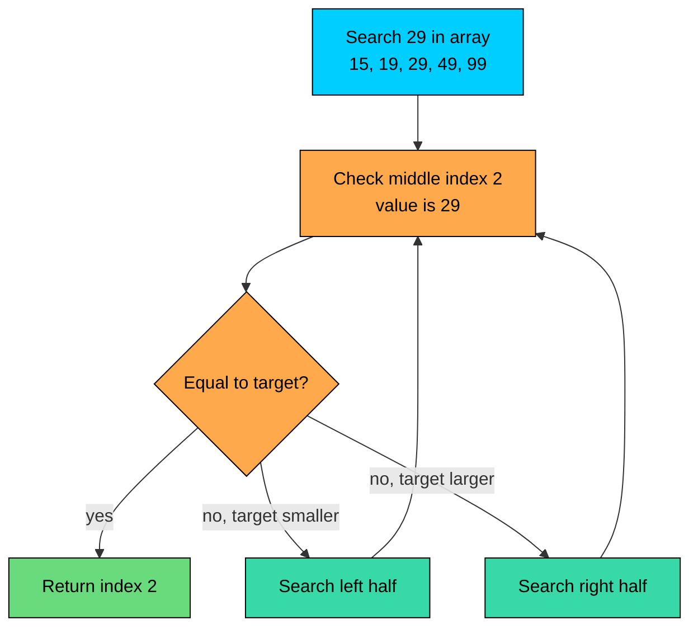
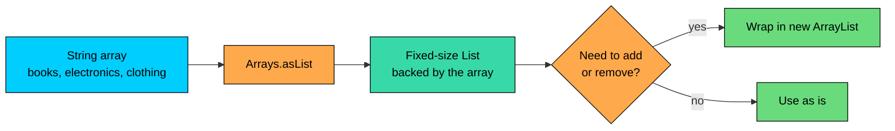
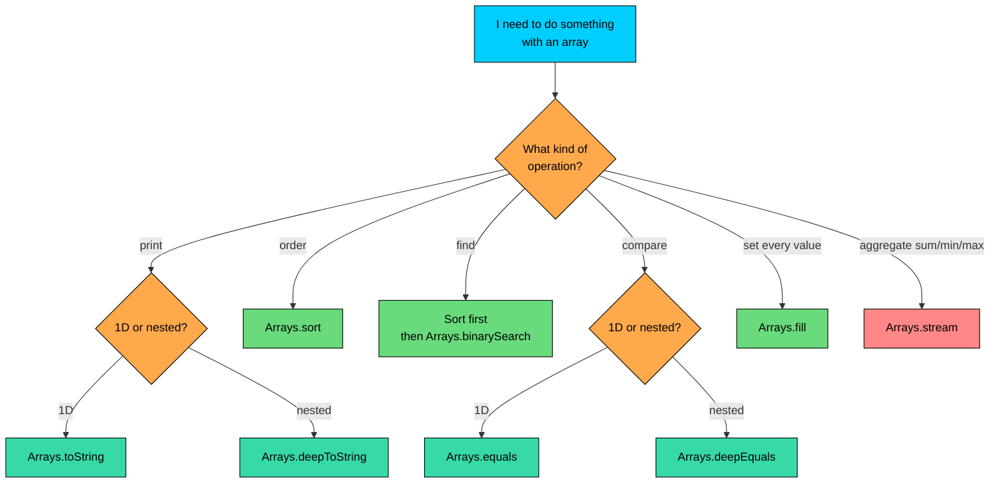

import React from 'react';
import CodeBlock from '../../../../components/ui/CodeBlock';
import Callout from '../../../../components/ui/Callout';

<div className="article-header">
  <div className="breadcrumb">
    <a href="/">Curated Notes</a>
    <span className="breadcrumb-separator">›</span>
    <span className="breadcrumb-current">Arrays Class</span>
  </div>
  <h1>Arrays Class</h1>
  <p style={{ color: 'var(--text-muted)', fontSize: '1.1rem', marginBottom: '16px', lineHeight: '1.6' }}>
    Master the essentials of Arrays Class in this curated guide.
  </p>
  <div className="meta-info">
    <span className="meta-item">
      <svg width="14" height="14" viewBox="0 0 24 24" fill="none" stroke="currentColor" strokeWidth="2"><circle cx="12" cy="12" r="10"/><polyline points="12 6 12 12 16 14"/></svg>
      10 min read
    </span>
    <span className="difficulty-badge difficulty-badge--intermediate">Intermediate</span>
  </div>
</div>

<section className="content-section">

Working with arrays by hand gets tedious fast. Printing them readably, sorting them, searching them, comparing them, filling them with a default value, all of it requires loops you'd have to write again and again. Java ships a small utility class, `java.util.Arrays`, that handles these chores for you. This lesson covers the static methods on that class that you'll use in real code.

Before we use anything from it, the class needs to be imported:


```java
import java.util.Arrays;
```


Put that line near the top of your file, just below the `package` declaration if there is one. Every example in this lesson assumes this import is in place.

---

## Printing Arrays Readably

Printing an array directly produces something unhelpful:


```java
import java.util.Arrays;

public class PrintRaw {
    public static void main(String[] args) {
        int[] productPrices = {29, 49, 19, 99, 15};
        System.out.println(productPrices);
    }
}
```


That's not a bug. `System.out.println` calls `toString` on whatever you hand it, and arrays inherit the default `toString` from `Object`, which returns the type signature plus a hex hash code. `[I` means "array of int", and `@7a81197d` is the identity hash. Useful for the JVM, useless for humans.

`Arrays.toString` produces something you can actually read:


```java
import java.util.Arrays;

public class PrintReadable {
    public static void main(String[] args) {
        int[] productPrices = {29, 49, 19, 99, 15};
        System.out.println(Arrays.toString(productPrices));
    }
}
```


It works the same way for any 1D array, including `String[]` and `double[]`.


```java
import java.util.Arrays;

public class PrintMixedArrays {
    public static void main(String[] args) {
        String[] customerEmails = {"ada@example.com", "ben@example.com", "cleo@example.com"};
        double[] productRatings = {4.5, 4.8, 3.9, 4.2};

        System.out.println(Arrays.toString(customerEmails));
        System.out.println(Arrays.toString(productRatings));
    }
}
```


The catch: `Arrays.toString` only goes one level deep. For a 2D array, you get the same hex-hash mess for each row.


```java
import java.util.Arrays;

public class PrintNestedWrong {
    public static void main(String[] args) {
        int[][] stockByWarehouse = {
            {12, 8, 5},
            {20, 15, 7}
        };
        System.out.println(Arrays.toString(stockByWarehouse));
    }
}
```


That's because each row is itself an `int[]`, and `Arrays.toString` calls the default `toString` on each row instead of recursing. `Arrays.deepToString` fixes this by walking nested arrays all the way down.


```java
import java.util.Arrays;

public class PrintNestedRight {
    public static void main(String[] args) {
        int[][] stockByWarehouse = {
            {12, 8, 5},
            {20, 15, 7}
        };
        System.out.println(Arrays.deepToString(stockByWarehouse));
    }
}
```


Rule of thumb: 1D, use `toString`. Nested, use `deepToString`. `deepToString` works on 1D arrays too, so if you're unsure, `deepToString` is the safer pick.

---

## Sorting

Sorting an array by hand is the kind of thing you only want to do once, as a learning exercise. After that, use `Arrays.sort`. It sorts in place, modifying the array you give it, and uses a well-tuned algorithm internally.


```java
import java.util.Arrays;

public class SortPrices {
    public static void main(String[] args) {
        int[] productPrices = {49, 19, 99, 29, 15};
        Arrays.sort(productPrices);
        System.out.println(Arrays.toString(productPrices));
    }
}
```


The result of `Arrays.sort` is not assigned to anything. It returns `void`. The original array itself is reordered.

`Arrays.sort` works on every primitive array type (`int[]`, `long[]`, `double[]`, `char[]`, etc.) and on `String[]`. For `String[]`, the natural ordering is lexicographic, which sorts by Unicode code point. Uppercase letters come before lowercase, so `"Zebra"` sorts before `"apple"`.


```java
import java.util.Arrays;

public class SortStrings {
    public static void main(String[] args) {
        String[] customerEmails = {"cleo@example.com", "ada@example.com", "ben@example.com"};
        Arrays.sort(customerEmails);
        System.out.println(Arrays.toString(customerEmails));
    }
}
```


There's also an overload that sorts a slice of the array, from one index up to (but not including) another:


```java
import java.util.Arrays;

public class SortSlice {
    public static void main(String[] args) {
        int[] productPrices = {49, 19, 99, 29, 15, 5};
        Arrays.sort(productPrices, 1, 4);
        System.out.println(Arrays.toString(productPrices));
    }
}
```


Only indices `1`, `2`, and `3` got sorted. The values at `0`, `4`, and `5` stayed where they were. The `from` index is inclusive and the `to` index is exclusive, matching the rest of the Java standard library.

`Arrays.sort` runs in O(n log n) for primitive arrays. That's faster than any hand-written nested-loop sort you'd write as a beginner. Don't reinvent it.

#### Parallel Sort

There's a sibling called `Arrays.parallelSort` that splits the work across multiple threads. The signature looks identical:


```java
import java.util.Arrays;

public class ParallelSortDemo {
    public static void main(String[] args) {
        int[] productIds = {1043, 207, 5891, 7720, 314, 9001};
        Arrays.parallelSort(productIds);
        System.out.println(Arrays.toString(productIds));
    }
}
```


The result is the same. The difference is what happens internally. For large arrays, the parallel version can be noticeably faster on a multi-core machine. For small arrays, the cost of dispatching work to threads outweighs the savings, and plain `Arrays.sort` wins. Default to `Arrays.sort` and only use `parallelSort` when you have a measurable reason, like an array with tens of thousands of elements or more.

---

## Binary Search

`Arrays.binarySearch` finds a value in a sorted array in O(log n) time. Each step looks at the middle of the current search range, compares to the target, and either returns the index or throws away half the range.





Here's the basic call:


```java
import java.util.Arrays;

public class BinarySearchFound {
    public static void main(String[] args) {
        int[] productPrices = {15, 19, 29, 49, 99};
        int index = Arrays.binarySearch(productPrices, 49);
        System.out.println("Index of 49: " + index);
    }
}
```


When the value isn't there, the return value is a negative number that encodes the insertion point. The exact formula is `-(insertionPoint + 1)`, where `insertionPoint` is the index the value would land at if you inserted it while keeping the array sorted.


```java
import java.util.Arrays;

public class BinarySearchMissing {
    public static void main(String[] args) {
        int[] productPrices = {15, 19, 29, 49, 99};
        int result = Arrays.binarySearch(productPrices, 30);
        System.out.println("Raw return value: " + result);

        int insertionPoint = -(result + 1);
        System.out.println("Insertion point: " + insertionPoint);
    }
}
```


`30` would slot in at index `3`, between `29` and `49`. The negative-and-offset-by-one encoding exists so that the method can distinguish "found at index 0" (returns `0`) from "not found, would insert at index 0" (returns `-1`).

Now the gotcha. Binary search **requires the array to be sorted**. If you call it on unsorted data, the result is undefined. It won't throw an exception, it'll just hand you a wrong answer.

**What's wrong with this code?**


```java
import java.util.Arrays;

public class BinarySearchUnsorted {
    public static void main(String[] args) {
        int[] productPrices = {49, 19, 99, 29, 15};
        int index = Arrays.binarySearch(productPrices, 29);
        System.out.println("Index of 29: " + index);
    }
}
```


The array isn't sorted. `binarySearch` will halve the range based on comparisons that assume sorted order, and the result is whatever the algorithm happens to land on. It might return `-1`, `2`, or some negative insertion point that doesn't correspond to anything real. The call returns a value, but the value can't be trusted.

**Fix:**


```java
import java.util.Arrays;

public class BinarySearchSortedFirst {
    public static void main(String[] args) {
        int[] productPrices = {49, 19, 99, 29, 15};
        Arrays.sort(productPrices);
        int index = Arrays.binarySearch(productPrices, 29);
        System.out.println("Sorted: " + Arrays.toString(productPrices));
        System.out.println("Index of 29: " + index);
    }
}
```


Sort first, then search. If you need to search the same array many times, sort once up front and reuse it. If you only need a single lookup and the array is small, a plain `for` loop is fine and avoids the sort cost.

`Arrays.sort` is O(n log n). `Arrays.binarySearch` is O(log n) but only correct on sorted input. A single linear search over an unsorted array is O(n). If you're going to search once, linear search wins. If you're going to search many times, sort once and binary-search after.

---

## Filling

`Arrays.fill` sets every element of an array to the same value. It's the one-line replacement for a loop that writes `arr[i] = value` for every `i`.


```java
import java.util.Arrays;

public class FillStock {
    public static void main(String[] args) {
        int[] stockCounts = new int[5];
        Arrays.fill(stockCounts, 10);
        System.out.println(Arrays.toString(stockCounts));
    }
}
```


Useful when you want a default starting value other than zero. `int[]` already defaults to `0`, but `Arrays.fill` is convenient for any value you want, and it works the same way for `String[]`, `double[]`, and the rest.

There's also a range-based overload, mirroring the one on `sort`:


```java
import java.util.Arrays;

public class FillRange {
    public static void main(String[] args) {
        int[] productRatings = new int[6];
        Arrays.fill(productRatings, 2, 5, 5);
        System.out.println(Arrays.toString(productRatings));
    }
}
```


Indices `2`, `3`, and `4` were set to `5`. As with `sort` and `binarySearch`, the `from` index is inclusive and the `to` index is exclusive.

---

## Comparing

`==` does not compare two arrays element by element. `==` on arrays checks whether the two variables point to the same object in memory, not whether they hold the same values.

**What's wrong with this code?**


```java
public class CompareWithEquals {
    public static void main(String[] args) {
        int[] first = {1, 2, 3};
        int[] second = {1, 2, 3};
        System.out.println(first == second);
    }
}
```


The values are identical, but `first` and `second` are two different array objects. `==` returns `false` even though the contents match.

**Fix:**


```java
import java.util.Arrays;

public class CompareWithArraysEquals {
    public static void main(String[] args) {
        int[] first = {1, 2, 3};
        int[] second = {1, 2, 3};
        System.out.println(Arrays.equals(first, second));
    }
}
```


`Arrays.equals` compares lengths first, then walks both arrays in lockstep, comparing each element with `==` (for primitives) or `.equals` (for object references). It returns `true` only if every position matches.

For nested arrays, the same one-level-deep problem from `toString` shows up. `Arrays.equals` on `int[][]` compares the inner arrays with `==`, which fails for separate inner arrays even when their contents match. Use `Arrays.deepEquals` instead:


```java
import java.util.Arrays;

public class DeepEqualsDemo {
    public static void main(String[] args) {
        int[][] warehouseA = {{12, 8}, {5, 3}};
        int[][] warehouseB = {{12, 8}, {5, 3}};

        System.out.println("equals: " + Arrays.equals(warehouseA, warehouseB));
        System.out.println("deepEquals: " + Arrays.deepEquals(warehouseA, warehouseB));
    }
}
```


`equals` walks one level and finds two different inner-array objects. `deepEquals` recurses and finds matching contents.

There are also `Arrays.hashCode` and `Arrays.deepHashCode` that go alongside these. If you ever override `equals` and `hashCode` on a class that has an array field, use them to make sure equal objects produce equal hash codes. They follow the same 1D-vs-nested split as their `equals` counterparts.

---

## Converting to a List

`Arrays.asList` turns a list of values into a fixed-size `List`. It's handy when you have a few values you want to use with code that expects a `List`.


```java
import java.util.Arrays;
import java.util.List;

public class AsListBasics {
    public static void main(String[] args) {
        List<String> categories = Arrays.asList("books", "electronics", "clothing");
        System.out.println(categories);
        System.out.println("Size: " + categories.size());
    }
}
```


Two catches. First, the `List` is **fixed-size**. You can read and replace elements, but you can't `add` or `remove`.

**What's wrong with this code?**


```java
import java.util.Arrays;
import java.util.List;

public class AsListAddBug {
    public static void main(String[] args) {
        List<String> categories = Arrays.asList("books", "electronics");
        categories.add("clothing");
        System.out.println(categories);
    }
}
```


The list returned by `Arrays.asList` is backed by an internal array, and arrays can't grow. Calling `add` throws `UnsupportedOperationException` at runtime.

**Fix:**

If you need a growable list, wrap it in a fresh `ArrayList`:


```java
import java.util.ArrayList;
import java.util.Arrays;
import java.util.List;

public class AsListAddFix {
    public static void main(String[] args) {
        List<String> categories = new ArrayList<>(Arrays.asList("books", "electronics"));
        categories.add("clothing");
        System.out.println(categories);
    }
}
```


The `ArrayList` constructor copies the elements into a real, resizable list. Adding works fine after that.

Second catch: `Arrays.asList` with an `int[]` does not give you a `List<Integer>` of the elements. It gives you a `List<int[]>` of size 1, where the single element is the whole array. That's because `int` is a primitive and doesn't fit the generic type system, but `int[]` is an object and does, so the compiler picks the only interpretation that works.

**What's wrong with this code?**


```java
import java.util.Arrays;
import java.util.List;

public class AsListIntBug {
    public static void main(String[] args) {
        int[] productIds = {101, 102, 103};
        List<int[]> wrapped = Arrays.asList(productIds);
        System.out.println("Size: " + wrapped.size());
    }
}
```


The list has one element, not three. That single element is the `int[]` itself.

**Fix:**

Use `Integer[]` (the boxed type) instead of `int[]`:


```java
import java.util.Arrays;
import java.util.List;

public class AsListIntegerFix {
    public static void main(String[] args) {
        Integer[] productIds = {101, 102, 103};
        List<Integer> wrapped = Arrays.asList(productIds);
        System.out.println("Size: " + wrapped.size());
        System.out.println(wrapped);
    }
}
```


With `Integer[]`, each element is an object, and the generic machinery lines up. The list has three elements.

`Arrays.asList` does not allocate a fresh array. The returned `List` is a thin wrapper over the array you passed in, so it's O(1) to create and O(1) per element access. Mutating the list (through `set`) also mutates the backing array, and vice versa.





---

## Streaming an Array

`Arrays.stream` turns an array into a `Stream`, which is a separate way of expressing "do something to every element". For now, the relevant piece is the shortcut for common aggregates like sum, average, min, and max.


```java
import java.util.Arrays;

public class StreamSum {
    public static void main(String[] args) {
        int[] productPrices = {29, 49, 19, 99, 15};
        int total = Arrays.stream(productPrices).sum();
        System.out.println("Cart total: $" + total);
    }
}
```


A manual `for` loop does the same calculation. Both work. The stream version is shorter; the loop is more explicit and easier to step through with a debugger. Use whichever you find clearer.

---

## Copying Arrays

You'll also see `Arrays.copyOf` and `Arrays.copyOfRange` floating around code. They return a new array containing some or all of the elements of the original, leaving the original untouched. We give them their own lesson next because the variations (shrinking, growing, slicing) have enough quirks to be worth their own walkthrough.

---

## Quick Reference Cheat Sheet

When you're sure which task you have but not which method, this table is the fastest path:


| Task | Method | Notes |
|------|--------|-------|
| Print a 1D array | `Arrays.toString(arr)` | Avoids the `[I@...` default. |
| Print a nested array | `Arrays.deepToString(arr)` | Works on 1D too. |
| Sort in place | `Arrays.sort(arr)` | O(n log n), natural ordering. |
| Sort a slice | `Arrays.sort(arr, from, to)` | `to` is exclusive. |
| Sort large arrays in parallel | `Arrays.parallelSort(arr)` | Faster for big arrays only. |
| Search a sorted array | `Arrays.binarySearch(arr, key)` | O(log n). Sort first. |
| Fill with one value | `Arrays.fill(arr, value)` | In place. |
| Fill a slice with one value | `Arrays.fill(arr, from, to, value)` | `to` is exclusive. |
| Compare two 1D arrays | `Arrays.equals(a, b)` | Element by element. |
| Compare two nested arrays | `Arrays.deepEquals(a, b)` | Recursive. |
| Hash a 1D array | `Arrays.hashCode(arr)` | Pairs with `equals`. |
| Hash a nested array | `Arrays.deepHashCode(arr)` | Pairs with `deepEquals`. |
| Wrap as a fixed-size `List` | `Arrays.asList(...)` | Use `Integer[]`, not `int[]`. |
| Sum/min/max/average | `Arrays.stream(arr).sum()`, etc. | Stream-based aggregation. |
| Copy or resize | `Arrays.copyOf`, `Arrays.copyOfRange` | Returns a new array. |





</section>
