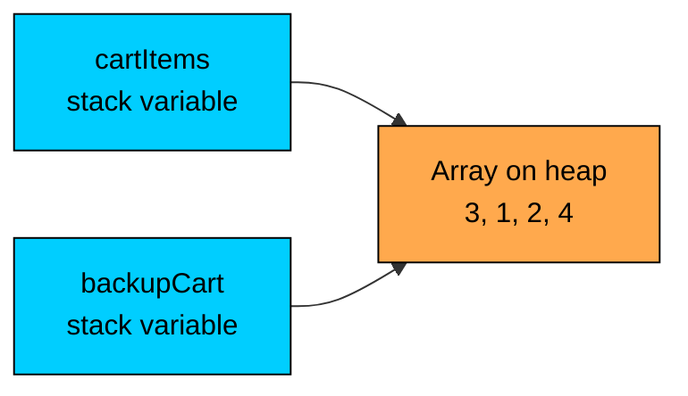
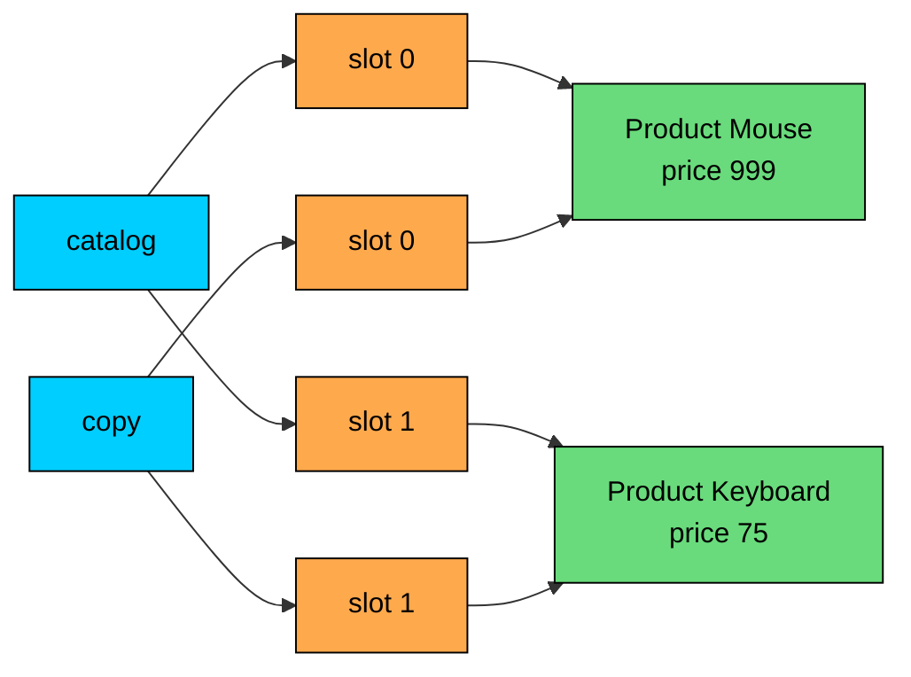
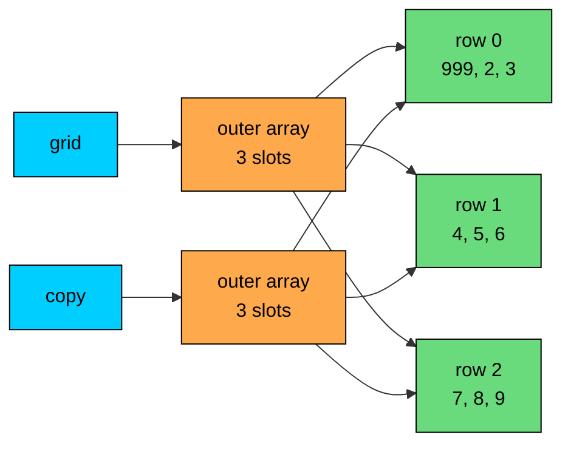
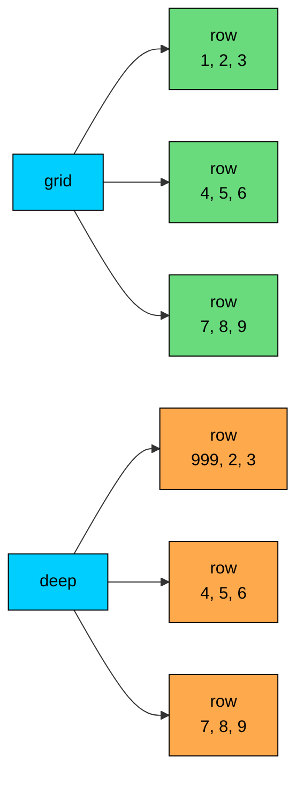

import React from 'react';
import CodeBlock from '../../../../components/ui/CodeBlock';
import Callout from '../../../../components/ui/Callout';

<div className="article-header">
  <div className="breadcrumb">
    <a href="/">Curated Notes</a>
    <span className="breadcrumb-separator">›</span>
    <span className="breadcrumb-current">Copying Arrays</span>
  </div>
  <h1>Copying Arrays</h1>
  <p style={{ color: 'var(--text-muted)', fontSize: '1.1rem', marginBottom: '16px', lineHeight: '1.6' }}>
    Master the essentials of Copying Arrays in this curated guide.
  </p>
  <div className="meta-info">
    <span className="meta-item">
      <svg width="14" height="14" viewBox="0 0 24 24" fill="none" stroke="currentColor" strokeWidth="2"><circle cx="12" cy="12" r="10"/><polyline points="12 6 12 12 16 14"/></svg>
      10 min read
    </span>
    <span className="difficulty-badge difficulty-badge--intermediate">Intermediate</span>
  </div>
</div>

<section className="content-section">

Arrays in Java are reference types, which means a variable holds a pointer to the array, not the array's contents. Writing `int[] b = a;` doesn't give you two arrays. It gives you two names for the same one. This lesson covers every practical way to duplicate an array's contents, when each technique applies, and the trap that appears when arrays contain other arrays or objects.

---

## Why Reference Aliasing Matters

The bug that motivates every copy method in the standard library: two variables, one array.

**What's wrong with this code?**


```java
import java.util.Arrays;

public class CartAlias {
    public static void main(String[] args) {
        int[] cartItems = {3, 1, 2, 4};
        int[] backupCart = cartItems;

        backupCart[0] = 999;

        System.out.println("backupCart: " + Arrays.toString(backupCart));
        System.out.println("cartItems:  " + Arrays.toString(cartItems));
    }
}
```


The variable named `backupCart` is not a backup at all. The assignment `int[] backupCart = cartItems;` copies the reference, not the data. Both names point at the same array on the heap, so writing through one is visible through the other.





Two arrows, one box. That is the shape of an array variable assignment. To get an independent copy, allocate a new array and copy the elements into it. The rest of this lesson covers the ways to do that.

Reference assignment is O(1). Real copying is O(n) because every element has to be written into the new array. The two operations look identical in source but have very different shapes.

---

## Copying with a Manual Loop

The most direct way to copy an array is to allocate a new one of the same length and walk every index. This is what the standard library does internally.


```java
import java.util.Arrays;

public class ManualCopy {
    public static void main(String[] args) {
        int[] productPrices = {19, 49, 29, 99, 15};
        int[] copy = new int[productPrices.length];

        for (int i = 0; i < productPrices.length; i++) {
            copy[i] = productPrices[i];
        }

        copy[0] = 0;
        System.out.println("original: " + Arrays.toString(productPrices));
        System.out.println("copy:     " + Arrays.toString(copy));
    }
}
```


`new int[productPrices.length]` allocates a brand new array, with its own slot in memory. The loop copies each element by value. Once the loop is done, writing to `copy[0]` is independent of `productPrices`, which is the whole point.

You should almost never write this loop in application code. The standard library has faster, shorter, and safer alternatives. Understanding what they do means understanding this loop first.

---

## Arrays.copyOf

`Arrays.copyOf(arr, newLength)` allocates a new array of the size you ask for and copies elements over. If the new length is the same as the old one, it's a plain copy. If it's smaller, the result is truncated. If it's larger, the extra slots get the type's default value.


```java
import java.util.Arrays;

public class CopyOfBasic {
    public static void main(String[] args) {
        int[] productPrices = {19, 49, 29, 99, 15};

        int[] same = Arrays.copyOf(productPrices, productPrices.length);
        int[] shorter = Arrays.copyOf(productPrices, 3);
        int[] longer = Arrays.copyOf(productPrices, 7);

        System.out.println("same:    " + Arrays.toString(same));
        System.out.println("shorter: " + Arrays.toString(shorter));
        System.out.println("longer:  " + Arrays.toString(longer));
    }
}
```


The padding rule depends on the element type. For `int`, the default is `0`. For `double`, it's `0.0`. For `boolean`, `false`. For reference types like `String` or any object array, it's `null`.


```java
import java.util.Arrays;

public class CopyOfPadding {
    public static void main(String[] args) {
        String[] customerEmails = {"a@shop.com", "b@shop.com"};
        String[] resized = Arrays.copyOf(customerEmails, 4);

        System.out.println(Arrays.toString(resized));
    }
}
```


This is also the standard way to grow an array. You can't change an array's length after creation, so growing means allocating a new one and copying over the elements. `Arrays.copyOf` does that in one line.

`Arrays.copyOf` allocates a new array and copies in O(n). Internally it calls `System.arraycopy`, which is a JVM intrinsic, so it is typically faster than a hand-written loop.

---

## Arrays.copyOfRange

To copy a slice of an array, use `Arrays.copyOfRange(arr, from, to)`. The range is half-open: `from` is included, `to` is not. This matches how almost every range-based API in Java behaves.


```java
import java.util.Arrays;

public class CopyOfRangeBasic {
    public static void main(String[] args) {
        int[] recentOrders = {101, 102, 103, 104, 105, 106};

        int[] firstThree = Arrays.copyOfRange(recentOrders, 0, 3);
        int[] middle = Arrays.copyOfRange(recentOrders, 2, 5);

        System.out.println("firstThree: " + Arrays.toString(firstThree));
        System.out.println("middle:     " + Arrays.toString(middle));
    }
}
```


`copyOfRange(recentOrders, 0, 3)` returns indices `0`, `1`, `2`, which is three elements. Reading the range as "from this index, up to but not including that index" is the simplest way to keep it straight.

Like `copyOf`, the `to` index is allowed to go past the end of the source array. The extra slots get filled with the default value.


```java
import java.util.Arrays;

public class CopyOfRangePadding {
    public static void main(String[] args) {
        int[] stockCounts = {12, 8, 4};

        int[] padded = Arrays.copyOfRange(stockCounts, 1, 5);

        System.out.println(Arrays.toString(padded));
    }
}
```


Starting at index `1` of `stockCounts` and going up to (but not including) `5` would normally read four elements. The source only has two elements from index `1` onward (`8` and `4`), so the rest of the result is padded with the default `int` value of `0`.

The one rule you can't break: `from` must be in `[0, arr.length]` and `from <= to`. If `from` is negative or larger than the array length, you get `ArrayIndexOutOfBoundsException`. If `from > to`, you get `IllegalArgumentException`.

---

## System.arraycopy

`System.arraycopy(src, srcPos, dest, destPos, length)` is the low-level primitive that every other copy method in Java is built on. It does not allocate. You give it a source array, a destination array (which you allocate yourself), and the positions and length to copy.


```java
import java.util.Arrays;

public class ArraycopyBasic {
    public static void main(String[] args) {
        int[] productPrices = {19, 49, 29, 99, 15};
        int[] copy = new int[productPrices.length];

        System.arraycopy(productPrices, 0, copy, 0, productPrices.length);

        copy[0] = 0;
        System.out.println("original: " + Arrays.toString(productPrices));
        System.out.println("copy:     " + Arrays.toString(copy));
    }
}
```


The five arguments read as: copy from `productPrices` starting at index `0` into `copy` starting at index `0`, total of `productPrices.length` elements.

You can also copy into the middle of an existing array, which is useful when you're assembling one array from pieces of others.


```java
import java.util.Arrays;

public class ArraycopyIntoMiddle {
    public static void main(String[] args) {
        int[] firstPage = {1, 2, 3};
        int[] secondPage = {4, 5, 6};
        int[] combined = new int[6];

        System.arraycopy(firstPage, 0, combined, 0, 3);
        System.arraycopy(secondPage, 0, combined, 3, 3);

        System.out.println(Arrays.toString(combined));
    }
}
```


A notable property of `System.arraycopy` is that the source and destination can be the **same** array. This sounds like it would corrupt the data if the ranges overlap, but Java handles it correctly. The method behaves as if it read every source element into a temporary buffer before writing any destination element.


```java
import java.util.Arrays;

public class ArraycopyOverlap {
    public static void main(String[] args) {
        int[] cartItems = {10, 20, 30, 40, 50};

        // Shift indices 0..2 to positions 2..4 inside the same array.
        System.arraycopy(cartItems, 0, cartItems, 2, 3);

        System.out.println(Arrays.toString(cartItems));
    }
}
```


The first two elements stay where they are. The values originally at indices `0`, `1`, `2` (which were `10`, `20`, `30`) get written to indices `2`, `3`, `4`. Even though the source and destination overlap at index `2`, the original value `30` was already read before index `2` got overwritten, so the result is correct. This makes `System.arraycopy` suitable for shifting elements inside an array, which comes up when you insert into or remove from the middle of a list.

`System.arraycopy` is a JVM intrinsic. On modern JVMs it lowers to a tight memory move and is typically faster than copying by hand, especially for large arrays.

---

## The Array .clone() Shortcut

Every array in Java has a built-in `clone()` method that returns a shallow copy of the same length and element type. It is the shortest syntax for a full copy when resizing is not needed.


```java
import java.util.Arrays;

public class ArrayClone {
    public static void main(String[] args) {
        int[] stockCounts = {12, 8, 4, 17, 3};
        int[] snapshot = stockCounts.clone();

        snapshot[0] = 0;
        System.out.println("original: " + Arrays.toString(stockCounts));
        System.out.println("snapshot: " + Arrays.toString(snapshot));
    }
}
```


Two things make `clone()` convenient. There is no length argument, and the returned array already has the correct element type, so no cast is needed. It is the smallest amount of code for a full-length copy.

The one thing `clone()` cannot do is resize. For a longer or shorter array, use `Arrays.copyOf` instead.

There is a broader story to `clone()` for general Java objects, involving the `Cloneable` interface, protected method overrides, and shallow vs deep semantics. For arrays specifically, `clone()` is safe, always works, and always returns a fresh array of the same length.

---

## Shallow vs Deep Copies

Every copy technique covered so far is **shallow**. That word means one thing: when you copy an array, you copy whatever the slots hold. For an `int[]`, the slots hold actual integer values, so a shallow copy is also effectively deep. For an array of objects or an array of arrays, the slots hold references. Copying the array gives you new slots holding the same references.

Consider a small `Product` class with a price field.


```java
import java.util.Arrays;

class Product {
    String name;
    int price;

    Product(String name, int price) {
        this.name = name;
        this.price = price;
    }

    public String toString() {
        return name + "($" + price + ")";
    }
}

public class ShallowObjectCopy {
    public static void main(String[] args) {
        Product[] catalog = {
            new Product("Mouse", 25),
            new Product("Keyboard", 75)
        };

        Product[] copy = catalog.clone();

        // Mutate the object through the copy.
        copy[0].price = 999;

        System.out.println("catalog: " + Arrays.toString(catalog));
        System.out.println("copy:    " + Arrays.toString(copy));
    }
}
```


Mutating `copy[0].price` changed `catalog[0].price` too. The `clone()` call copied the array's slots, which are references to `Product` objects. Both arrays end up with references to the same two `Product` instances. Modifying a field of one of those instances is visible through either array.





Two arrays, four slots, two `Product` objects. The arrays are independent (you could `copy[0] = null` without affecting `catalog`), but the objects they point at are shared.

For an independent set of products, you have to copy each `Product` too. This is a **deep copy**.


```java
import java.util.Arrays;

class Product {
    String name;
    int price;

    Product(String name, int price) {
        this.name = name;
        this.price = price;
    }

    Product copy() {
        return new Product(this.name, this.price);
    }

    public String toString() {
        return name + "($" + price + ")";
    }
}

public class DeepObjectCopy {
    public static void main(String[] args) {
        Product[] catalog = {
            new Product("Mouse", 25),
            new Product("Keyboard", 75)
        };

        Product[] deep = new Product[catalog.length];
        for (int i = 0; i < catalog.length; i++) {
            deep[i] = catalog[i].copy();
        }

        deep[0].price = 999;

        System.out.println("catalog: " + Arrays.toString(catalog));
        System.out.println("deep:    " + Arrays.toString(deep));
    }
}
```


Now `catalog` is untouched. Each slot in `deep` points at a fresh `Product` built from the original's data. Mutating the new objects has no effect on the originals.

The rule is simple. Shallow copy means you duplicated the **container**, not its contents. If the contents are values (primitives), that's enough. If the contents are references, you only duplicated the references.

---

## Deep-Copying a 2D Array

A 2D array in Java is an array of arrays. The outer array's slots hold references to inner arrays. This means `Arrays.copyOf` of a 2D array has the same shallow trap as the object example.

**What's wrong with this code?**


```java
import java.util.Arrays;

public class ShallowGridCopy {
    public static void main(String[] args) {
        int[][] grid = {
            {1, 2, 3},
            {4, 5, 6},
            {7, 8, 9}
        };

        int[][] copy = Arrays.copyOf(grid, grid.length);

        copy[0][0] = 999;

        System.out.println("grid[0][0]: " + grid[0][0]);
        System.out.println("copy[0][0]: " + copy[0][0]);
    }
}
```


`Arrays.copyOf(grid, grid.length)` copied the outer array. The outer slots hold references to the inner rows. Both `grid` and `copy` ended up with slots pointing at the same three inner arrays, so writing to `copy[0][0]` is the same as writing to `grid[0][0]`.





Two outer arrays, three shared rows. A real deep copy of a 2D array means duplicating both the outer array and each inner row.

**Fix:**


```java
import java.util.Arrays;

public class DeepGridCopy {
    public static void main(String[] args) {
        int[][] grid = {
            {1, 2, 3},
            {4, 5, 6},
            {7, 8, 9}
        };

        int[][] deep = new int[grid.length][];
        for (int i = 0; i < grid.length; i++) {
            deep[i] = grid[i].clone();
        }

        deep[0][0] = 999;

        System.out.println("grid[0][0]: " + grid[0][0]);
        System.out.println("deep[0][0]: " + deep[0][0]);
    }
}
```


Allocate the outer array with the correct length, then clone each row into it. Now `deep` has its own outer array and its own three inner rows. Writing to `deep[0][0]` doesn't touch `grid`.

The picture for the fixed version has two outer arrays and six inner rows, three per side, with no sharing.





A deep copy of an `m x n` 2D array is O(m * n). You allocate the outer array plus `m` new inner arrays and copy `m * n` elements. This is the cost of independence.

---

## Method Cheat Sheet

The full set of options side by side. Pick based on what you need: a full copy, a range, an in-place shift, or a deep copy of structured data.


| Method | What it does | When to use | Returns new array? | Supports range / resize? | Deep? |
|--------|--------------|-------------|--------------------|--------------------------|-------|
| Manual `for` loop | You allocate, you copy element by element | Learning purposes, custom transforms during copy | Yes (you allocate it) | Yes (write your own indices) | No (unless you copy elements deeply too) |
| `Arrays.copyOf(arr, n)` | Allocates a new array of length `n`, copies, pads with defaults if longer | Resizing, full copies when length might change | Yes | Resize only | No |
| `Arrays.copyOfRange(arr, from, to)` | Allocates a new array, copies the half-open range `[from, to)`, pads if `to` exceeds source | Slicing a subrange | Yes | Range, with padding | No |
| `System.arraycopy(src, srcPos, dest, destPos, len)` | Copies `len` elements from `src` into `dest`. No allocation | Copy into an existing array, shift in place | No (caller provides the destination) | Range on both ends | No |
| `arr.clone()` | Returns a new array of the same length and type | Quick full-length copies, no resize needed | Yes | No | No |
| Loop + per-row `clone()` (2D) | Outer array allocated by you, each row cloned in a loop | Deep-copying a 2D array | Yes | Custom | Yes (for 2D `int[][]`) |
| Loop + per-element copy (objects) | New array, plus a copy of each object | Deep-copying an array of mutable objects | Yes | Custom | Yes (if your per-element copy is deep) |


The one-line rule for picking: if the array contains primitives, every shallow copy is also a real copy, so `clone()` or `Arrays.copyOf` is fine. If the array contains references (objects or other arrays), and the elements will be mutated through one copy, a loop is needed that copies the elements themselves, not just the outer container.

</section>
