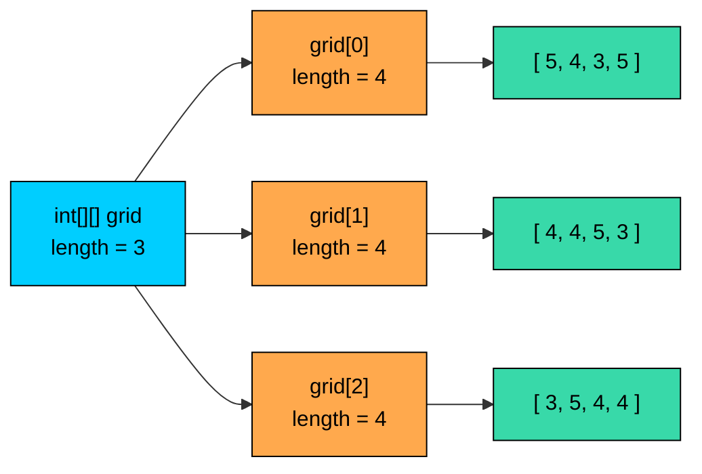
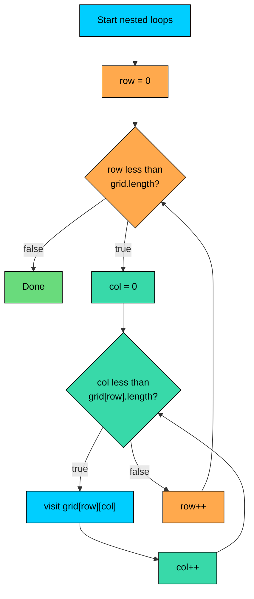

import React from 'react';
import CodeBlock from '../../../../components/ui/CodeBlock';
import Callout from '../../../../components/ui/Callout';

<div className="article-header">
  <div className="breadcrumb">
    <a href="/">Curated Notes</a>
    <span className="breadcrumb-separator">›</span>
    <span className="breadcrumb-current">Multidimensional Arrays</span>
  </div>
  <h1>Multidimensional Arrays</h1>
  <p style={{ color: 'var(--text-muted)', fontSize: '1.1rem', marginBottom: '16px', lineHeight: '1.6' }}>
    Master the essentials of Multidimensional Arrays in this curated guide.
  </p>
  <div className="meta-info">
    <span className="meta-item">
      <svg width="14" height="14" viewBox="0 0 24 24" fill="none" stroke="currentColor" strokeWidth="2"><circle cx="12" cy="12" r="10"/><polyline points="12 6 12 12 16 14"/></svg>
      10 min read
    </span>
    <span className="difficulty-badge difficulty-badge--intermediate">Intermediate</span>
  </div>
</div>

<section className="content-section">

A single list is fine when the data is one row of values. But plenty of real data has two dimensions: ratings given by each customer to each product, stock counts for every warehouse across every product, sales numbers for each week in each region. That's where 2D arrays come in. This lesson covers how to declare them, how to read and write cells, how Java actually stores them in memory, and a quick look at 3D arrays for completeness.

---

## Why a Second Dimension

A 1D array stores a flat list. Something like `int[] prices = {29, 49, 19}` is fine when there's only one price per item. But tracking ratings that 4 customers gave to 5 products needs 20 separate values, organized so a query like "what rating did customer 2 give product 3?" is fast.

A 1D array of length 20 with manual index math (`customer * 5 + product`) works, but it's error-prone, and the structure isn't visible from the code. A 2D array makes the layout explicit: rows for customers, columns for products.

The shape of the data:


| | Product 0 | Product 1 | Product 2 | Product 3 | Product 4 |
|---|---|---|---|---|---|
| **Customer 0** | 5 | 4 | 3 | 5 | 2 |
| **Customer 1** | 4 | 4 | 5 | 3 | 1 |
| **Customer 2** | 3 | 5 | 4 | 4 | 5 |
| **Customer 3** | 5 | 3 | 2 | 5 | 4 |


The same shape shows up often in an e-commerce app. Stock by warehouse and product. Weekly sales by month and region. Order counts by category and day. Whenever a lookup needs two coordinates, a 2D array fits.

---

## Declaring and Creating 2D Arrays

Java offers three ways to create a 2D array. Pick whichever matches what is known up front.

The first form declares the variable without creating the array yet. Assignment happens later.


```java
public class DeclareGrid {
    public static void main(String[] args) {
        int[][] grid;
        grid = new int[3][4];
        System.out.println("Rows: " + grid.length);
        System.out.println("Columns in row 0: " + grid[0].length);
    }
}
```


The type `int[][]` reads as "an array of int arrays". The brackets can go after the type (`int[][] grid`) or after the variable name (`int grid[][]`). The first form is more common and reads better.

The second form declares and allocates in one line. `new int[3][4]` carves out space for 3 rows and 4 columns, with every cell defaulted to `0`.


```java
public class StockMatrix {
    public static void main(String[] args) {
        int[][] stock = new int[3][4];
        stock[0][0] = 25;
        stock[1][2] = 17;
        System.out.println("Warehouse 0, Product 0: " + stock[0][0]);
        System.out.println("Warehouse 1, Product 2: " + stock[1][2]);
        System.out.println("Warehouse 2, Product 3: " + stock[2][3]);
    }
}
```


`stock[2][3]` prints `0` even though no code wrote to it. Java fills numeric arrays with `0` by default, `false` for `boolean[][]`, and `null` for object arrays.

The third form is the literal initializer. Use this when the values are known up front.


```java
public class RatingsLiteral {
    public static void main(String[] args) {
        int[][] ratings = {
            {5, 4, 3, 5, 2},
            {4, 4, 5, 3, 1},
            {3, 5, 4, 4, 5},
            {5, 3, 2, 5, 4}
        };
        System.out.println("Customer 2 rated Product 1: " + ratings[2][1]);
        System.out.println("Total customers: " + ratings.length);
        System.out.println("Products per customer: " + ratings[0].length);
    }
}
```


Each inner `{...}` is one row. The number of inner braces sets the row count, and the number of values inside each one sets the column count. Java infers both from the literal.

---

## Indexing with Two Indices

A 2D array uses two index expressions, in `[row][col]` order. The row index picks which inner array, and the column index picks the cell inside that inner array.


```java
public class WeeklySales {
    public static void main(String[] args) {
        double[][] weeklySales = {
            {1200.50, 950.00, 1430.75, 880.25},
            {1100.00, 1020.50, 1380.00, 990.00},
            {1350.75, 1180.25, 1500.50, 1050.00}
        };

        System.out.println("Week 0, Region 0: $" + weeklySales[0][0]);
        System.out.println("Week 2, Region 3: $" + weeklySales[2][3]);

        weeklySales[1][2] = 1400.00;
        System.out.println("Updated Week 1, Region 2: $" + weeklySales[1][2]);
    }
}
```


Reading and writing both use the same `[row][col]` form. Indices start at `0`, just like with 1D arrays. The first row is row `0`. The first column is column `0`.

Out-of-range indices throw `ArrayIndexOutOfBoundsException`, the same exception a 1D array throws. The check happens on each index separately. `weeklySales[5][0]` fails on the first bracket, since there's no row `5`. `weeklySales[0][9]` fails on the second bracket, since row `0` only has indices `0` through `3`.

Which dimension means rows and which means columns is a convention, not a language rule. Java just sees `[i][j]`. The convention "first index is row, second is column" works as long as it's applied consistently. Trouble starts when the order gets accidentally flipped.

**What's wrong with this code?**


```java
public class FlippedAccess {
    public static void main(String[] args) {
        int[][] stock = {
            {25, 17, 8},
            {12, 30, 5}
        };
        // We want stock for warehouse 1, product 2.
        System.out.println(stock[2][1]);
    }
}
```


This throws `ArrayIndexOutOfBoundsException`. The array has 2 rows (indices `0` and `1`) and 3 columns (indices `0`, `1`, `2`). The expression `stock[2][1]` asks for row `2`, which doesn't exist. The author intended warehouse 1 (row 1) and product 2 (column 2), but wrote the indices in the wrong order.

**Fix:**


```java
public class CorrectAccess {
    public static void main(String[] args) {
        int[][] stock = {
            {25, 17, 8},
            {12, 30, 5}
        };
        System.out.println("Warehouse 1, Product 2: " + stock[1][2]);
    }
}
```


A small habit that prevents this: name loop variables `row` and `col`, or `customer` and `product`, instead of `i` and `j`. The intent reads off the page and the indices get swapped less often.

---

## Lengths of Rows and Columns

A 2D array exposes its size through the `.length` property, just like a 1D array. But there are two lengths to think about: how many rows there are, and how many cells each row has.


```java
public class GridLengths {
    public static void main(String[] args) {
        int[][] orderCount = new int[6][4];
        System.out.println("Outer length (rows): " + orderCount.length);
        System.out.println("Inner length (cols in row 0): " + orderCount[0].length);
        System.out.println("Cols in row 3: " + orderCount[3].length);
    }
}
```


`orderCount.length` is the row count: 6. `orderCount[0].length` is the column count for row `0`: 4. For a rectangular array (every row the same width), `orderCount[3].length` is also 4, and so is every other inner length.

Why the distinction matters: Java doesn't actually have a single "column count" stored anywhere. Each row is its own array with its own length. For a rectangular array that's a distinction without a difference. But Java does allow rows of different lengths. This is why `inner.length` is per-row, not global.

**What's wrong with this code?**


```java
public class WrongInnerLength {
    public static void main(String[] args) {
        int[][] stock = {
            {25, 17, 8, 4},
            {12, 30, 5, 9}
        };
        for (int row = 0; row < stock.length; row++) {
            for (int col = 0; col < stock.length; col++) {
                System.out.print(stock[row][col] + " ");
            }
            System.out.println();
        }
    }
}
```


The inner loop uses `stock.length` instead of `stock[row].length`. `stock.length` is `2` (the row count), so the inner loop only walks the first two columns and misses columns `2` and `3` entirely. The output prints `25 17` and `12 30`, which is wrong.

**Fix:**


```java
public class CorrectInnerLength {
    public static void main(String[] args) {
        int[][] stock = {
            {25, 17, 8, 4},
            {12, 30, 5, 9}
        };
        for (int row = 0; row < stock.length; row++) {
            for (int col = 0; col < stock[row].length; col++) {
                System.out.print(stock[row][col] + " ");
            }
            System.out.println();
        }
    }
}
```


The rule: use `array.length` for the outer (row) loop, and `array[row].length` for the inner (column) loop. Don't reuse the outer length for both, even when the array happens to be square.

---

## Iterating with Nested Loops

Visiting every cell in a 2D array takes two nested `for` loops. The outer loop walks the rows, the inner loop walks the columns of the current row.


```java
public class PrintRatings {
    public static void main(String[] args) {
        int[][] ratings = {
            {5, 4, 3, 5, 2},
            {4, 4, 5, 3, 1},
            {3, 5, 4, 4, 5},
            {5, 3, 2, 5, 4}
        };

        for (int customer = 0; customer < ratings.length; customer++) {
            for (int product = 0; product < ratings[customer].length; product++) {
                System.out.print(ratings[customer][product] + " ");
            }
            System.out.println();
        }
    }
}
```


The outer loop picks a row. For each row, the inner loop walks all the columns and prints them on the same line. After the inner loop finishes, `System.out.println()` ends the line so the next row starts fresh.

Once the structure is clear, summing every cell or finding the maximum follows the same pattern. Here's the average rating per customer:


```java
public class AveragePerCustomer {
    public static void main(String[] args) {
        int[][] ratings = {
            {5, 4, 3, 5, 2},
            {4, 4, 5, 3, 1},
            {3, 5, 4, 4, 5},
            {5, 3, 2, 5, 4}
        };

        for (int customer = 0; customer < ratings.length; customer++) {
            int sum = 0;
            for (int product = 0; product < ratings[customer].length; product++) {
                sum = sum + ratings[customer][product];
            }
            double average = (double) sum / ratings[customer].length;
            System.out.println("Customer " + customer + " average: " + average);
        }
    }
}
```


The accumulator `sum` is reset to `0` at the start of each outer iteration. Declaring `sum` outside the outer loop computes a running total across all customers instead, which is a different (and easy to write by accident) calculation.

Walking the array column-by-column swaps the loop nesting. The outer loop walks the products, the inner loop walks the customers.


```java
public class AveragePerProduct {
    public static void main(String[] args) {
        int[][] ratings = {
            {5, 4, 3, 5, 2},
            {4, 4, 5, 3, 1},
            {3, 5, 4, 4, 5},
            {5, 3, 2, 5, 4}
        };

        int productCount = ratings[0].length;
        int customerCount = ratings.length;

        for (int product = 0; product < productCount; product++) {
            int sum = 0;
            for (int customer = 0; customer < customerCount; customer++) {
                sum = sum + ratings[customer][product];
            }
            double average = (double) sum / customerCount;
            System.out.println("Product " + product + " average: " + average);
        }
    }
}
```


The indices in `ratings[customer][product]` still follow the `[row][col]` convention. Only the order in which cells are visited changed.

Walking row-by-row (outer loop = rows) is friendlier to the CPU cache than walking column-by-column, because each row sits contiguously in memory. For small arrays this doesn't matter, but on big ones, column-first iteration can be several times slower for the same logical work. Prefer row-major access unless there's a specific reason not to.

---

## How 2D Arrays Are Laid Out in Memory

A 2D array in Java is not a single contiguous rectangle of memory. It's an array of references, each pointing to its own 1D array. The outer array holds three slots after `new int[3][4]`, and each slot holds a reference to a separate length-4 `int[]`.





The outer array is one allocation. Each row is a separate allocation. `new int[3][4]` actually creates **four** arrays: one outer array of length 3 holding three references, plus three inner arrays of length 4 holding the actual `int` values.

This has a few practical consequences. First, `grid[0]` is itself a perfectly valid `int[]`. It can be passed to any method that takes an `int[]`.


```java
public class RowIsArray {
    public static void main(String[] args) {
        int[][] ratings = {
            {5, 4, 3, 5, 2},
            {4, 4, 5, 3, 1}
        };

        int[] firstCustomer = ratings[0];
        System.out.println("First rating of first customer: " + firstCustomer[0]);
        System.out.println("Length of row 0: " + firstCustomer.length);

        firstCustomer[0] = 1;
        System.out.println("After change, ratings[0][0] = " + ratings[0][0]);
    }
}
```


`firstCustomer` and `ratings[0]` are two names for the same inner array. Modifying through one is visible through the other, because there's only one array on the heap.

Second, because rows are stored as separate arrays of references, Java is free to give different rows different lengths. For now, just know that the layout above is what makes it possible.

Third, `System.out.println(grid)` doesn't print the contents of the array. It prints something like `[[I@1540e19d`, which is the type signature and a hash code of the outer array. To print the cells, use a nested loop, or use `Arrays.deepToString`.


```java
public class PrintArrayDirect {
    public static void main(String[] args) {
        int[][] stock = {
            {25, 17},
            {12, 30}
        };
        System.out.println(stock);
        System.out.println(stock[0]);
    }
}
```


The exact hash codes will differ between runs. Neither line shows the actual data. Plain `println` on any array prints a reference-shaped string.

Allocating `new int[1000][1000]` creates `1001` separate arrays on the heap: one outer array of `1000` references plus `1000` inner arrays of `1000` ints each. That's more allocations than a naive picture of "one big rectangle" would suggest, and it's why very large 2D arrays sometimes get replaced with a flat 1D array indexed by `row * width + col` in performance-critical code.

---

## 3D Arrays in Brief

If two dimensions cover most cases, three dimensions show up occasionally. The syntax extends in the obvious way: add another pair of brackets.

An e-commerce use is stock counts indexed by warehouse, then product, then month. Three coordinates, three indices.


```java
public class WarehouseStock {
    public static void main(String[] args) {
        // [warehouse][product][month]
        int[][][] stock = new int[2][3][4];

        stock[0][1][2] = 150;
        stock[1][2][0] = 80;

        System.out.println("Warehouse 0, Product 1, Month 2: " + stock[0][1][2]);
        System.out.println("Warehouse 1, Product 2, Month 0: " + stock[1][2][0]);
        System.out.println("Warehouses: " + stock.length);
        System.out.println("Products per warehouse: " + stock[0].length);
        System.out.println("Months per product: " + stock[0][0].length);
    }
}
```


A 3D array is an array of 2D arrays. `stock` is a `int[][][]` of length `2`. Each element `stock[i]` is a `int[][]` of length `3`. Each `stock[i][j]` is an `int[]` of length `4`. Visiting every cell takes three nested loops.

Most code never goes past 2D. When you find yourself reaching for a third dimension, ask if the data really has three independent coordinates, or whether you'd be better off with a class that holds named fields. A `WarehouseInventory` object with a `Map<Product, MonthlyStock>` is often easier to read than `stock[w][p][m]`.

---

## Common Pitfalls

A few mistakes show up when first working with 2D arrays.

**Confusing `[row][col]` with `[col][row]`.** The two index positions look identical from the syntax. The convention is yours to define, but it must be consistent. Pick "first index = row" and stick with it everywhere, in declarations and in loops.

**Using outer `.length` for the inner loop.** As shown in the section on lengths, `array.length` is the row count. Use `array[row].length` for columns. Even when the array is rectangular, the wrong length here causes a hard-to-find bug if the array later becomes non-rectangular, or if the row and column counts happen to be equal by coincidence.

**Forgetting that rows are arrays.** `grid[0]` is a complete `int[]`, not just an index into something. You can store it in a variable, pass it to a method, change its contents, or replace it entirely with `grid[0] = new int[]{1, 2, 3}`. Forgetting that this is allowed leads to clunky code that hand-copies cells when assigning a whole row would do.

**Calling `println` on a 2D array.** `System.out.println(grid)` prints something like `[[I@1540e19d` and not the contents. To debug, use nested loops or `Arrays.deepToString`.

**Off-by-one bugs, twice over.** Every off-by-one mistake from 1D arrays applies here too, just doubled. Both loops need `i < length` and not `i <= length`. Both indices need to start at `0`. When something throws `ArrayIndexOutOfBoundsException`, check which index is out of range and which dimension it belongs to.

To picture how the row and column loops fit together:





The inner loop runs to completion for every single iteration of the outer loop. Total work is roughly `rows * cols`, so a 100x100 array has 10,000 cells to visit. For tiny shopping data this is nothing. For massive datasets, the difference between row-major and column-major iteration starts to show up in real time.

</section>
