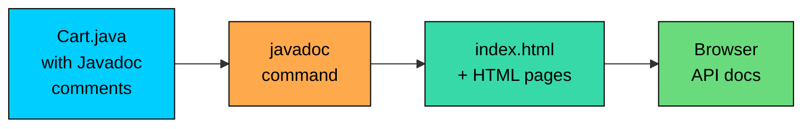

import React from 'react';
import CodeBlock from '../../../../components/ui/CodeBlock';
import Callout from '../../../../components/ui/Callout';

<div className="article-header">
  <div className="breadcrumb">
    <a href="/">Curated Notes</a>
    <span className="breadcrumb-separator">›</span>
    <span className="breadcrumb-current">Comments</span>
  </div>
  <h1>Comments</h1>
  <p style={{ color: 'var(--text-muted)', fontSize: '1.1rem', marginBottom: '16px', lineHeight: '1.6' }}>
    Master the essentials of Comments in this curated guide.
  </p>
  <div className="meta-info">
    <span className="meta-item">
      <svg width="14" height="14" viewBox="0 0 24 24" fill="none" stroke="currentColor" strokeWidth="2"><circle cx="12" cy="12" r="10"/><polyline points="12 6 12 12 16 14"/></svg>
      10 min read
    </span>
    <span className="difficulty-badge difficulty-badge--intermediate">Intermediate</span>
  </div>
</div>

<section className="content-section">

Comments are notes the compiler ignores but humans read. Java gives you three flavors: single-line, multi-line, and Javadoc. This lesson covers how each one is written, when to use them, and a few habits that keep comments useful instead of turning them into clutter.

---

## The Three Styles

Java supports three comment styles. Two are for notes to other developers, and the third doubles as machine-readable documentation.


```java
public class Cart {
    // Single-line: ends at the newline
    private double subtotal;

    /*
       Multi-line: starts with slash-star,
       ends with star-slash. Useful for longer notes.
     */
    private int itemCount;

    /**
     * Javadoc: starts with slash-star-star.
     * Tools like `javadoc` read these to generate HTML docs.
     */
    public double getSubtotal() {
        return subtotal;
    }
}
```


The compiler strips all three out before producing bytecode, so comments have zero runtime cost. The difference is in tooling: the `javadoc` tool only reads the third style.

A side-by-side summary:


| Style       | Syntax                                | Spans      | Used For                                            |
| ----------- | ------------------------------------- | ---------- | --------------------------------------------------- |
| Single-line | `// note`                             | One line   | Short inline notes, explaining a tricky expression  |
| Multi-line  | `/* note */`                          | Many lines | Block notes, file headers, longer explanations      |
| Javadoc     | `/** note */` before class/method/field | Many lines | API documentation extracted by the `javadoc` tool |


The rest of the lesson walks through each style in detail, then looks at when comments help versus when they get in the way.

---

## Single-Line Comments

A single-line comment starts with `//` and ends at the next newline. Anything between the `//` and the line break is ignored by the compiler.


```java
public class CartTotal {
    public static void main(String[] args) {
        // Price in USD
        double itemPrice = 29.99;
        int quantity = 3;

        double subtotal = itemPrice * quantity; // multiply price by count
        System.out.println("Subtotal: $" + subtotal);
    }
}
```


A few details:

- `//` can appear at the start of a line or after code. When it follows code, it's called a trailing comment.
- The comment stops at the newline. The next line is code again, even if it looks visually connected.
- You can stack many single-line comments to form a block, though `/* ... */` is usually cleaner for that.

---

## Multi-Line Comments

A multi-line comment starts with `/*` and continues until the matching `*/`. Everything in between, including newlines, is ignored.


```java
public class ProductInfo {
    public static void main(String[] args) {
        /*
           This program prints info about a single product.
           We'll expand it later to read from a catalog file.
         */
        String productName = "Wireless Headphones";
        double price = 79.99;

        System.out.println(productName + " - $" + price);
    }
}
```


Multi-line comments don't need a `*` on every line, but many developers add one out of habit because it aligns nicely:


```java
/*
 * File: Cart.java
 * Purpose: Holds items added by a customer.
 */
```


That's just convention. The compiler only cares about the opening `/*` and the closing `*/`.

#### Multi-Line Comments Don't Nest

You can't put a multi-line comment inside another multi-line comment. The compiler matches the first `*/` it sees against the opening `/*` and treats anything after that as code.

**What's wrong with this code?**


```java
public class NestedComment {
    public static void main(String[] args) {
        /*
           Outer comment opens here.
           /* Inner comment opens here. */
           Outer comment was supposed to close here. */
        System.out.println("done");
    }
}
```


The compiler reads it like this: the outer `/*` opens a comment, and the first `*/` (after "Inner comment opens here.") closes it. The text "Outer comment was supposed to close here." is then read as code, and `*/` at the end is a syntax error. You get something like:


```shell
NestedComment.java:5: error: illegal start of expression
           Outer comment was supposed to close here. */
                  ^
```


**Fix:** Don't nest. Use a single block, or comment out code line by line:


```java
public class NestedComment {
    public static void main(String[] args) {
        /*
           Outer comment with notes about everything.
           No inner block comments allowed.
         */
        System.out.println("done");
    }
}
```


If you want to temporarily disable a block of code that already contains comments, most IDEs let you press a shortcut (Ctrl+/ in IntelliJ) to add `//` to every line, which sidesteps the nesting problem.

---

## Javadoc Comments

A Javadoc comment starts with `/**` (two stars after the slash) and ends with `*/`. It lives immediately above a class, method, or field declaration and describes that element.

A `Cart` class with Javadoc on the class and on each method:


```java
/**
 * Represents a shopping cart that holds items added by a customer.
 * The cart tracks a subtotal and an item count, and can compute a
 * total that includes sales tax.
 *
 * @author Alex
 * @since 1.0
 */
public class Cart {

    /** Subtotal in USD, before tax. */
    private double subtotal;

    /** Number of items currently in the cart. */
    private int itemCount;

    /**
     * Adds an item to the cart and updates the subtotal.
     *
     * @param itemPrice price of the item in USD, must be non-negative
     * @param quantity  number of units to add, must be positive
     * @throws IllegalArgumentException if itemPrice is negative or quantity is not positive
     */
    public void addItem(double itemPrice, int quantity) {
        if (itemPrice < 0 || quantity <= 0) {
            throw new IllegalArgumentException("invalid price or quantity");
        }
        subtotal += itemPrice * quantity;
        itemCount += quantity;
    }

    /**
     * Returns the cart total including a flat sales tax.
     *
     * @param taxRate tax rate as a decimal, for example 0.08 for 8 percent
     * @return total in USD, rounded to two decimal places
     * @see #addItem(double, int)
     */
    public double getTotal(double taxRate) {
        // Round to cents to avoid showing fractions like $12.345
        // We round half-up because that matches what receipts usually show.
        double raw = subtotal * (1 + taxRate);
        return Math.round(raw * 100.0) / 100.0;
    }
}
```


The Javadoc on `getTotal` describes the contract (what the method does, what the parameters mean, what it returns) while the regular `//` comments inside the method describe an implementation detail (why we round the way we do). Both are useful, but they serve different readers.

#### Standard Javadoc Tags

Javadoc tags start with `@` and add structured information. The most common ones:


| Tag           | Used On                  | Meaning                                                |
| ------------- | ------------------------ | ------------------------------------------------------ |
| `@param`      | Methods, constructors    | Describes one parameter                                |
| `@return`     | Methods                  | Describes what the method returns                      |
| `@throws`     | Methods, constructors    | Describes an exception the method may throw            |
| `@author`     | Classes, interfaces      | Names the author                                       |
| `@since`      | Any element              | Version when the element was added                     |
| `@see`        | Any element              | Cross-reference to a related class or method           |
| `@deprecated` | Any element              | Marks the element as discouraged, with a reason        |


Order matters by convention: `@param` tags come first (one per parameter, in declaration order), then `@return`, then `@throws`, then everything else. The `javadoc` tool sorts and groups them in the generated HTML.

A `Customer` class that uses `@deprecated` to mark an old field:


```java
/**
 * A customer of the online store.
 *
 * @since 1.0
 */
public class Customer {
    /** Customer's full name. */
    private String name;

    /** Customer's email, used for order confirmations. */
    private String email;

    /**
     * Customer's mailing address as a single string.
     *
     * @deprecated As of 2.0, use {@link #shippingAddress} which is structured.
     *             This field will be removed in 3.0.
     */
    @Deprecated
    private String address;

    /** Structured shipping address introduced in 2.0. */
    private String shippingAddress;
}
```


The `@deprecated` Javadoc tag explains *why* the element is discouraged and points readers to the replacement. The `@Deprecated` annotation right above it (no `javadoc` involved) is what makes the compiler warn callers. They're a pair: the tag explains, the annotation enforces.

---

## The `javadoc` Command

Javadoc comments aren't just notes for readers of the source code. The JDK ships with a `javadoc` command-line tool that scans `.java` files, pulls out the `/** ... */` blocks, and generates a set of HTML pages that look like the official API docs you see on `docs.oracle.com`. Run it on a source file and the tool writes browsable documentation into an output folder, ready to share or host. Java doesn't bundle a documentation generator into the language itself the way some others do, but `javadoc` is the de-facto standard, and almost every library you'll use was documented with it.

The flow looks like this:





A minimal invocation looks like this:


```shell
javadoc -d docs Cart.java
```


That reads `Cart.java`, writes HTML into a folder named `docs`, and you open `docs/index.html` in a browser to see the result. Open the standard library docs at `docs.oracle.com/en/java/javase/` and you're looking at the exact same kind of output, generated from Javadoc comments in the JDK source.

---

## When Comments Help (and When They Hurt)

Good comments explain *why*. Bad comments restate *what*. The code already shows the *what*, so a comment that just repeats it adds noise without adding information.

Compare the two versions of the same method:


```java
public class CartTotal {

    // Noise comment: tells you nothing the code doesn't already say
    public static double getTotalNoise(double subtotal, double taxRate) {
        // multiply subtotal by 1 plus taxRate
        double raw = subtotal * (1 + taxRate);
        // round raw times 100 then divide by 100
        return Math.round(raw * 100.0) / 100.0;
    }

    // Good comment: explains the non-obvious decision
    public static double getTotalGood(double subtotal, double taxRate) {
        double raw = subtotal * (1 + taxRate);
        // Round to cents using half-up. Receipts show two decimals,
        // and Math.round() rounds half-up by default, which matches
        // what the finance team expects on invoices.
        return Math.round(raw * 100.0) / 100.0;
    }

    public static void main(String[] args) {
        System.out.println(getTotalGood(89.97, 0.08));
    }
}
```


The first version's comments restate the operators. Any reader can see `subtotal * (1 + taxRate)`, so writing "multiply subtotal by 1 plus taxRate" is filler. The second version's comment explains the *decision*: why we round, which rounding mode we picked, and why it matches a business expectation. That's information the code can't carry on its own.

Useful comments tend to cover:

- **Why a decision was made.** "We round half-up to match invoices."
- **Non-obvious edge cases.** "Quantity zero is allowed for placeholder items in promotions."
- **Intent or contract.** Javadoc telling callers what to pass and what they'll get back.
- **Workarounds.** "Old orders have null shipping addresses; we treat null as 'pickup in store'."
- **Pointers to context.** A link to a ticket or a section of a spec that explains a strange branch.

Comments that hurt more than they help:

- **Restating the code.** `// increment count` above `count++`. The code says it already.
- **Stale comments.** A comment that described the old logic and never got updated. Now it lies to readers.
- **Commented-out code.** `// double oldTotal = subtotal * 1.1;` left behind "in case we need it". You don't. Version control already remembers every line you've ever written, so delete the dead code and let `git log` keep the history.
- **Decorative banners.** `// ============ SECTION ============`. Use blank lines and good method names instead.

Comments don't cost anything at runtime, but they cost reader trust. A wrong comment is worse than no comment because readers waste time reconciling code with a description that drifted.

---

## Comment Hygiene

A few habits that keep comments from turning into clutter over time:

- **Keep comments close to the code they describe.** A comment 20 lines above its target is easy to miss when one of them changes.
- **Update comments when you change code.** Treat them as part of the change, not a side note. A stale comment is a bug.
- **Prefer a good name over an explanatory comment.** If you're tempted to write `// total including tax`, rename the variable to `totalWithTax` and drop the comment.
- **Don't apologize in comments.** "Sorry, this is messy" doesn't fix anything. Either clean it up or document the actual constraint that forced the mess.
- **Use Javadoc for anything other developers will call.** Public classes, public methods, public fields. Private helpers can use `//` if they need explanation at all.

A small before-and-after to show those habits at work:


```java
public class Inventory {

    // Before: comment tries to compensate for an unclear name
    public static int adj(int x, int y) {
        // x is current stock, y is units sold
        return x - y; // result is remaining stock
    }

    // After: clear names, no comments needed
    public static int remainingStock(int currentStock, int unitsSold) {
        return currentStock - unitsSold;
    }

    public static void main(String[] args) {
        System.out.println(remainingStock(20, 7));
    }
}
```


The cleaned-up version doesn't need comments because the names carry the information. Save comments for the things names can't express, like *why* a particular threshold or formula was chosen.

</section>
