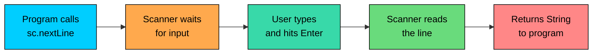
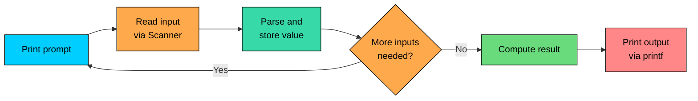

import React from 'react';
import CodeBlock from '../../../../components/ui/CodeBlock';
import Callout from '../../../../components/ui/Callout';

<div className="article-header">
  <div className="breadcrumb">
    <a href="/">Curated Notes</a>
    <span className="breadcrumb-separator">›</span>
    <span className="breadcrumb-current">Input & Output</span>
  </div>
  <h1>Input & Output</h1>
  <p style={{ color: 'var(--text-muted)', fontSize: '1.1rem', marginBottom: '16px', lineHeight: '1.6' }}>
    Master the essentials of Input & Output in this curated guide.
  </p>
  <div className="meta-info">
    <span className="meta-item">
      <svg width="14" height="14" viewBox="0 0 24 24" fill="none" stroke="currentColor" strokeWidth="2"><circle cx="12" cy="12" r="10"/><polyline points="12 6 12 12 16 14"/></svg>
      10 min read
    </span>
    <span className="difficulty-badge difficulty-badge--intermediate">Intermediate</span>
  </div>
</div>

<section className="content-section">

Every program needs a way to talk to the outside world. In Java, the standard library provides a small set of tools for printing messages to the screen and reading what the user types in. This lesson covers the everyday I/O used in almost every program: `System.out` for output, `Scanner` for input, and `System.err` for error messages.

---

## Printing Output with `System.out`

The `System.out` object represents the standard output stream, which is the terminal window in most setups. It exposes three commonly used methods: `println`, `print`, and `printf`.

`println` prints whatever it receives and then moves the cursor to the next line. `print` does the same thing without the newline. The difference in practice:


```java
public class ProductBanner {
    public static void main(String[] args) {
        System.out.println("Welcome to MyShop");
        System.out.print("Today's deal: ");
        System.out.print("Wireless Headphones");
        System.out.println(" - $79");
        System.out.println("Free shipping included");
    }
}
```


The two `print` calls join their output onto the same line, then the next `println` finishes that line and starts a new one. Use `print` to build up a line in pieces and `println` to finish it.

Any type works with these methods, not just strings. Java converts numbers and booleans to their text form automatically:


```java
public class CartSummary {
    public static void main(String[] args) {
        int itemCount = 3;
        double cartTotal = 149.97;
        boolean freeShipping = true;

        System.out.println("Items in cart: " + itemCount);
        System.out.println("Cart total: $" + cartTotal);
        System.out.println("Free shipping: " + freeShipping);
    }
}
```


The `+` between a `String` and another type concatenates them, converting the non-string side to text first.

---

## Formatted Output with `printf`

String concatenation is fine for simple messages, but once columns need to line up or decimal places need control, it falls apart fast. `System.out.printf` solves that. Pass a format string with placeholders, followed by the values to fill them in.


```java
public class PriceTag {
    public static void main(String[] args) {
        String product = "Wireless Headphones";
        int quantity = 2;
        double price = 79.50;

        System.out.printf("Product: %s%n", product);
        System.out.printf("Quantity: %d%n", quantity);
        System.out.printf("Unit price: $%.2f%n", price);
        System.out.printf("Subtotal: $%.2f%n", quantity * price);
    }
}
```


Each `%` in the format string is a placeholder that gets replaced by the next argument. The letter after `%` says what kind of value goes there.

#### Format Specifier Reference


| Specifier | Meaning | Example | Result |
| --------- | ------- | ------- | ------ |
| `%d` | Integer | `printf("%d", 42)` | `42` |
| `%f` | Floating-point | `printf("%f", 3.14)` | `3.140000` |
| `%.2f` | Float, 2 decimal places | `printf("%.2f", 3.14159)` | `3.14` |
| `%s` | String | `printf("%s", "cart")` | `cart` |
| `%b` | Boolean | `printf("%b", true)` | `true` |
| `%n` | Platform newline | `printf("a%nb")` | `a` newline `b` |
| `%%` | Literal `%` | `printf("%d%%", 50)` | `50%` |


`%n` is worth a closer look. It prints the right line separator for the operating system (`\n` on Linux and macOS, `\r\n` on Windows). Use it for portable output instead of hardcoding `\n` into format strings.

Field width can also align columns. `%10s` reserves 10 characters of space and right-aligns the string in it. `%-10s` does the same but left-aligns. A clean cart receipt:


```java
public class CartReceipt {
    public static void main(String[] args) {
        System.out.printf("%-20s %5s %10s%n", "Item", "Qty", "Price");
        System.out.printf("%-20s %5d %10.2f%n", "Wireless Headphones", 1, 79.00);
        System.out.printf("%-20s %5d %10.2f%n", "Phone Case", 2, 12.50);
        System.out.printf("%-20s %5d %10.2f%n", "USB Cable", 3, 4.99);
    }
}
```


The columns line up because every row uses the same widths. This kind of formatting is painful with plain string concatenation but trivial with `printf`.

---

## Building Strings with `String.format`

Sometimes a formatted string is needed but printing should happen later: storing it, returning it from a method, or logging it. `String.format` takes the same format string and arguments as `printf` but returns the result as a `String` instead of writing it to the terminal.


```java
public class InvoiceLine {
    public static void main(String[] args) {
        String product = "Smart Watch";
        double price = 129.99;

        String line = String.format("%s costs $%.2f", product, price);
        System.out.println(line);
        System.out.println("Saved invoice line: " + line);
    }
}
```


Think of `String.format` as `printf` that hands you the result instead of printing it.

---

## Writing to `System.err`

Java has a second standard stream for output: `System.err`. It works exactly like `System.out`, with the same `println`, `print`, and `printf` methods, but it's meant for error messages and diagnostics. The operating system treats it as a separate channel, so normal output and error output can be redirected to different places.


```java
public class StockCheck {
    public static void main(String[] args) {
        int stock = 0;
        String product = "Wireless Headphones";

        if (stock > 0) {
            System.out.println(product + " is in stock");
        } else {
            System.err.println("WARNING: " + product + " is out of stock");
        }
    }
}
```


In a terminal, both streams usually print to the same window, so the message looks identical. The difference shows up when output is redirected to a file or piped to another program. `System.out` is for what the program produces; `System.err` is for what went wrong.

---

## Reading Input with `Scanner`

To read what the user types, the standard tool is `Scanner` from `java.util`. Wrap it around `System.in`, the standard input stream, and call methods to pull values out.


```java
import java.util.Scanner;

public class GreetCustomer {
    public static void main(String[] args) {
        Scanner sc = new Scanner(System.in);

        System.out.print("Enter your name: ");
        String name = sc.nextLine();

        System.out.println("Welcome back, " + name + "!");

        sc.close();
    }
}
```


**Sample Input:**


```shell
Alex
```


Three things happen here. First, `import java.util.Scanner` brings the class into scope. Second, `new Scanner(System.in)` creates a scanner that reads from the keyboard. Third, `sc.nextLine()` waits for the user to type a line and press Enter, then returns what they typed (without the newline).

`Scanner` has a method for each common type:


| Method | Reads | Example input |
| ------ | ----- | ------------- |
| `nextLine()` | Whole line (string) | `Alex Smith` |
| `next()` | Next word (no spaces) | `Alex` |
| `nextInt()` | Integer | `42` |
| `nextDouble()` | Floating-point number | `19.99` |
| `nextBoolean()` | `true` or `false` | `true` |


The diagram below shows what happens when the program calls `sc.nextLine()`:





The program blocks (pauses) until the user presses Enter. While it's waiting, nothing else runs. This is why printing a prompt before reading matters: the user has no way to know the program is waiting otherwise.

---

## A Small Interactive Program

A typical use of `Scanner`. The program asks for a product name, a quantity, and a unit price, then prints a formatted invoice.


```java
import java.util.Scanner;

public class Invoice {
    public static void main(String[] args) {
        Scanner sc = new Scanner(System.in);

        System.out.print("Product name: ");
        String product = sc.nextLine();

        System.out.print("Quantity: ");
        int quantity = sc.nextInt();

        System.out.print("Unit price: ");
        double price = sc.nextDouble();

        double total = quantity * price;

        System.out.println();
        System.out.printf("%-20s %5s %10s%n", "Item", "Qty", "Total");
        System.out.printf("%-20s %5d %10.2f%n", product, quantity, total);

        sc.close();
    }
}
```


**Sample Input:**


```shell
Wireless Headphones
2
79.50
```


The flow of an interactive program:





Each prompt corresponds to one read. The order of prompts has to match the order the program reads in, which sounds obvious but becomes tricky when `nextInt` and `nextLine` are mixed. That's the next topic.

---

## The `nextInt` / `nextLine` Pitfall

`nextInt`, `nextDouble`, and `next` all read a single token. They stop at the next whitespace (space, tab, or newline), and they leave that whitespace in the input buffer. `nextLine`, on the other hand, reads everything up to and including the next newline.

A call to `nextInt` followed by `nextLine` makes the `nextLine` consume the leftover newline from the integer and return an empty string. The program looks like it skipped the prompt.

**What's wrong with this code?**


```java
import java.util.Scanner;

public class OrderLookup {
    public static void main(String[] args) {
        Scanner sc = new Scanner(System.in);

        System.out.print("Order ID: ");
        int orderId = sc.nextInt();

        System.out.print("Customer email: ");
        String email = sc.nextLine();

        System.out.println("Order " + orderId + " for " + email);
    }
}
```


**Sample Input:**


```shell
1042
alex@example.com
```


The program never gives the user a chance to type the email. `nextInt` read `1042` and left the newline in the buffer. `nextLine` then consumed that newline and returned an empty string.

**Fix:** Call `sc.nextLine()` after the integer read to consume the leftover newline before the real `nextLine` call:


```java
import java.util.Scanner;

public class OrderLookup {
    public static void main(String[] args) {
        Scanner sc = new Scanner(System.in);

        System.out.print("Order ID: ");
        int orderId = sc.nextInt();
        sc.nextLine();

        System.out.print("Customer email: ");
        String email = sc.nextLine();

        System.out.println("Order " + orderId + " for " + email);

        sc.close();
    }
}
```


**Sample Input:**


```shell
1042
alex@example.com
```


The extra `sc.nextLine()` after `nextInt()` throws away the trailing newline. Now the real `nextLine` waits for fresh input.

---

## Validating Input Before Reading

If the user types the wrong type, `Scanner` throws `InputMismatchException`. For example, calling `nextInt()` when the user typed `abc` throws at runtime.

Check ahead of time with the `hasNextXxx` methods. They return `true` if the next token can be read as that type, without consuming it.


```java
import java.util.Scanner;

public class StockUpdate {
    public static void main(String[] args) {
        Scanner sc = new Scanner(System.in);

        System.out.print("New stock count: ");
        if (sc.hasNextInt()) {
            int stock = sc.nextInt();
            System.out.println("Stock updated to " + stock);
        } else {
            System.err.println("Error: stock must be a whole number");
        }

        sc.close();
    }
}
```


**Sample Input:**


```shell
abc
```


`hasNextInt` returns `false` because `abc` isn't an integer, so the program prints an error message instead of crashing. `hasNextLine`, `hasNextDouble`, and `hasNext` work the same way.

---

## Closing the Scanner

Calling `sc.close()` releases the resources the scanner holds. One point worth noting: closing a `Scanner` that wraps `System.in` also closes `System.in` itself. For a small standalone program that reads input once and exits, this is fine. For a larger program that might want to read from the keyboard again later, closing the scanner shuts that door permanently.

A safe default for short programs: close the scanner at the end of `main`. For longer-running code, keep one `Scanner` for the lifetime of the program and only close it when stdin is no longer needed.

---

## Command-Line Arguments

One more way to get input into a Java program: command-line arguments. `String[] args` in `main` holds anything the user typed after the class name when running the program. This is useful when the input is known up front and the program doesn't need to prompt for it.


```java
public class Greeting {
    public static void main(String[] args) {
        if (args.length > 0) {
            System.out.println("Hello, " + args[0] + "!");
        } else {
            System.out.println("Hello, stranger!");
        }
    }
}
```


Running `java Greeting Alex` prints `Hello, Alex!`. Running `java Greeting` with no arguments prints `Hello, stranger!`. Command-line arguments suit utilities; interactive programs usually use `Scanner`.

---

## A Faster Alternative for Big Inputs

`Scanner` is convenient, but it's not the fastest tool. Each call parses the input and handles type conversion, which adds overhead. For programs that read thousands of lines (competitive programming, log processing, large files), the standard speedup is `BufferedReader` wrapped around `InputStreamReader`.


```java
import java.io.BufferedReader;
import java.io.InputStreamReader;

public class FastInput {
    public static void main(String[] args) throws Exception {
        BufferedReader reader = new BufferedReader(new InputStreamReader(System.in));
        String line = reader.readLine();
        System.out.println("You typed: " + line);
    }
}
```


`Scanner` can be 5 to 10 times slower than `BufferedReader` when reading large amounts of input, because it does more parsing work per call. For everyday programs the difference doesn't matter; for tight read loops over big inputs, switch to `BufferedReader`.

For everything in the next few lessons, `Scanner` is the appropriate choice.

</section>
