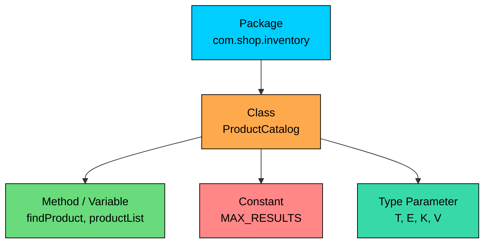

import React from 'react';
import CodeBlock from '../../../../components/ui/CodeBlock';
import Callout from '../../../../components/ui/Callout';

<div className="article-header">
  <div className="breadcrumb">
    <a href="/">Curated Notes</a>
    <span className="breadcrumb-separator">›</span>
    <span className="breadcrumb-current">Naming Conventions</span>
  </div>
  <h1>Naming Conventions</h1>
  <p style={{ color: 'var(--text-muted)', fontSize: '1.1rem', marginBottom: '16px', lineHeight: '1.6' }}>
    Master the essentials of Naming Conventions in this curated guide.
  </p>
  <div className="meta-info">
    <span className="meta-item">
      <svg width="14" height="14" viewBox="0 0 24 24" fill="none" stroke="currentColor" strokeWidth="2"><circle cx="12" cy="12" r="10"/><polyline points="12 6 12 12 16 14"/></svg>
      10 min read
    </span>
    <span className="difficulty-badge difficulty-badge--intermediate">Intermediate</span>
  </div>
</div>

<section className="content-section">

Every name you pick in a Java program tells the next reader something about what it is. The compiler is happy with almost any name that follows a few mechanical rules, but the Java community has settled on a set of conventions that everyone follows: PascalCase for classes, camelCase for methods and variables, UPPER_SNAKE_CASE for constants, and lowercase dotted names for packages. This lesson covers what's enforced by the compiler, what's enforced only by convention, and why those conventions are worth following from your very first program.

---

## What the Compiler Enforces

Before we get to convention, there are a few hard rules. An identifier in Java is any name you pick: a class, a method, a variable, a parameter, a field. The compiler enforces three rules on every identifier:

- It must start with a letter, an underscore `_`, or a dollar sign `$`.
- After the first character, it may contain letters, digits, underscores, and dollar signs.
- It cannot be a Java reserved word like `int`, `class`, or `return`.

Identifiers are also case-sensitive. `customerName` and `CustomerName` are two different identifiers, and Java will treat them as completely unrelated names.

A small program that shows what the compiler accepts:


```java
public class IdentifierRules {
    public static void main(String[] args) {
        int itemCount = 3;
        int _backupCount = 5;
        int $promoCount = 1;
        int cart2 = itemCount + _backupCount + $promoCount;
        System.out.println("Total items: " + cart2);
    }
}
```


All four variable names compile because each starts with a legal first character. The compiler doesn't care that `_backupCount` and `$promoCount` look unusual.

Trying to start a name with a digit or use a reserved word fails immediately:


```java
public class BadNames {
    public static void main(String[] args) {
        int 2ndItem = 5;     // starts with a digit, compile error
        int class = 10;      // 'class' is a reserved word, compile error
    }
}
```


The compiler reports `illegal start of expression` or `not a statement` for the first line and `<identifier> expected` for the second. Both errors mean "that's not a legal name."

For reference, some of the reserved words you cannot use as identifiers:


| Category    | Words                                                                       |
| ----------- | --------------------------------------------------------------------------- |
| Primitives  | `boolean`, `byte`, `short`, `int`, `long`, `float`, `double`, `char`        |
| Control     | `if`, `else`, `for`, `while`, `do`, `switch`, `case`, `break`, `continue`, `return` |
| OOP         | `class`, `interface`, `extends`, `implements`, `new`, `this`, `super`, `package`, `import` |
| Modifiers   | `public`, `private`, `protected`, `static`, `final`, `abstract`             |
| Exceptions  | `try`, `catch`, `finally`, `throw`, `throws`                                |
| Literals    | `true`, `false`, `null` (not technically keywords but still reserved)       |


You don't need to memorize the full list. Your IDE highlights reserved words in a different color, and the compiler will catch any slip-up before you can run the program.

---

## Classes and Interfaces: PascalCase

Class and interface names use PascalCase: every word starts with a capital letter, including the first one, and there are no separators between words.


```java
public class ShoppingCart {
    public static void main(String[] args) {
        ShoppingCart cart = new ShoppingCart();
        System.out.println("Created a new cart");
    }
}
```


Other examples that follow the convention: `Customer`, `Order`, `OrderStatus`, `ProductCatalog`, `PaymentMethod`. Each word is capitalized and there are no underscores.

Interfaces follow the same rule. You'd write `Comparable`, `Iterable`, or `PaymentProcessor`, never `comparable` or `payment_processor`.

The reason PascalCase wins for types is readability. When you see `ShoppingCart cart = new ShoppingCart();`, the capital letters tell you at a glance which token is a type and which is a variable. If both were lowercase, the line would look like a soup of words and you'd have to think harder to parse it.

A common mistake is naming classes like methods:


```java
// Compiles fine, but violates convention
public class shoppingCart {
    public static void main(String[] args) {
        System.out.println("This compiles, but no Java codebase looks like this");
    }
}
```


The compiler doesn't complain. Every Java reviewer will. Stick with `ShoppingCart`.

---

## Methods and Variables: camelCase

Methods and variables use camelCase: the first word is lowercase, every following word starts with a capital letter.


```java
public class CartExample {
    public static void main(String[] args) {
        int itemCount = 5;
        double unitPrice = 19.99;
        double cartTotal = calculateTotal(itemCount, unitPrice);
        System.out.println("Cart total: $" + cartTotal);
    }

    public static double calculateTotal(int quantity, double pricePerItem) {
        return quantity * pricePerItem;
    }
}
```


`itemCount`, `unitPrice`, `cartTotal`, and `calculateTotal` all follow the same shape. Compare that with how the same code looks if you fight the convention:


```java
// Same code, broken naming
int item_count = 5;
double UnitPrice = 19.99;
double CART_TOTAL = calculateTotal(item_count, UnitPrice);
```


The compiler still accepts it. A reader scanning the file has to slow down and think "is `CART_TOTAL` a constant? Is `UnitPrice` a class?" Following the convention removes that friction.

Parameter names follow the same rule as local variables: camelCase, descriptive. `pricePerItem` is better than `p`, and `quantity` is better than `qty` unless your team has a strong reason for the abbreviation.

---

## Constants: UPPER_SNAKE_CASE

Constants, declared as `static final`, use uppercase letters with underscores between words.


```java
public class PricingRules {
    public static final double TAX_RATE = 0.08;
    public static final int MAX_CART_ITEMS = 50;
    public static final String DEFAULT_CURRENCY = "USD";

    public static void main(String[] args) {
        double subtotal = 100.00;
        double tax = subtotal * TAX_RATE;
        System.out.println("Tax on $" + subtotal + ": $" + tax);
        System.out.println("Cart limit: " + MAX_CART_ITEMS + " items");
    }
}
```


`TAX_RATE`, `MAX_CART_ITEMS`, and `DEFAULT_CURRENCY` are constants because they're declared `static final`: one value per class, never changes after assignment. The screaming uppercase tells the reader "this number didn't come from user input, you can rely on it not changing."

A non-constant should never use UPPER_SNAKE_CASE. Writing `int CART_TOTAL = 0;` inside `main` confuses everyone who reads it: they'll assume the value is fixed when it's a local variable.

---

## Packages: lowercase.with.dots

Packages use all lowercase, with dots separating each segment. The convention is to start with a reverse domain name to avoid collisions.


| Good                       | Bad                       | Reason                              |
| -------------------------- | ------------------------- | ----------------------------------- |
| `com.shop.inventory`       | `Com.Shop.Inventory`      | No uppercase in package names       |
| `com.shop.orders`          | `com.shop.Orders`         | No PascalCase in package names      |
| `io.algomaster.cart`       | `io.algoMaster.cart`      | No camelCase in package names       |
| `com.shop.user`            | `com.shop.user_service`   | Avoid underscores in package names  |


The full layout typically looks like this:





Each level of the diagram uses a different case style, and that's intentional: when you read a fully qualified name like `com.shop.inventory.ProductCatalog.MAX_RESULTS`, the case tells you what each segment is. The dots separate packages, the capital letter marks the class, and the all-caps tail marks a constant.

For now, the takeaway is the casing rule: lowercase, dots, no camelCase, no underscores.

---

## Method Naming Idioms

Method names usually start with a verb because methods do things. A few idioms show up in almost every Java codebase:

- **Getters and setters.** A property named `email` is read by `getEmail()` and written by `setEmail(String email)`. For boolean properties, the getter usually starts with `is`, `has`, or `can`: `isShipped()`, `hasDiscount()`, `canCancel()`. Frameworks like Spring and Jackson rely on this pattern, so following it is more than cosmetic.
- **Boolean variables and method names.** Any boolean should read like a yes-or-no question. `isPaid`, `hasShipped`, `canCancel`, `shouldRefund`. Drop the name into a sentence like "if `isPaid` then..." and check that it sounds natural.
- **Action methods.** Methods that perform actions start with verbs: `addItem`, `removeItem`, `checkout`, `placeOrder`, `applyDiscount`. Avoid noun-only names like `order` or `cart` for methods. If you can rewrite the name as "do X to Y," it usually reads better.

A small `Order` class that puts these idioms together:


```java
public class Order {
    private String orderId;
    private boolean paid;
    private boolean shipped;

    public Order(String orderId) {
        this.orderId = orderId;
        this.paid = false;
        this.shipped = false;
    }

    public String getOrderId() {
        return orderId;
    }

    public boolean isPaid() {
        return paid;
    }

    public boolean isShipped() {
        return shipped;
    }

    public void markPaid() {
        this.paid = true;
    }

    public void shipOrder() {
        if (!paid) {
            System.out.println("Cannot ship unpaid order: " + orderId);
            return;
        }
        this.shipped = true;
    }

    public static void main(String[] args) {
        Order order = new Order("ORD-1001");
        order.markPaid();
        order.shipOrder();
        System.out.println("Order " + order.getOrderId() + " shipped: " + order.isShipped());
    }
}
```


`isPaid()` reads naturally inside the `if` check: `if (!paid)`. That's the test for whether your boolean name is good. If swapping it into a conditional sounds awkward, rename it.

---

## Acronyms in Names

Treat acronyms as words in camelCase or PascalCase. Capitalize only the first letter, even when the acronym is two or three letters long.


| Good          | Bad           |
| ------------- | ------------- |
| `HttpClient`  | `HTTPClient`  |
| `XmlParser`   | `XMLParser`   |
| `JsonReader`  | `JSONReader`  |
| `userId`      | `userID`      |
| `customerUrl` | `customerURL` |


The reason is consistency. When you have a class name like `HTTPSURLConnection`, the eye can't tell where one word ends and the next begins. `HttpsUrlConnection` reads cleanly. The standard library mostly follows this rule (`HttpURLConnection` is the famous holdout that everyone points to as an example of why this matters).

For variables, the same rule applies. `id`, `url`, and `xml` all become regular lowercase when they appear at the start of a name (`id`, `url`, `xmlBody`) and capitalize only the first letter in the middle of a name (`customerId`, `productUrl`, `responseXml`).

---

## Things to Avoid

A few patterns show up in early code that Java reviewers flag.

**Single-letter names for anything other than loop indices or generics.** Inside a loop, `i`, `j`, and `k` are fine for indices. Type parameters like `T`, `E`, `K`, and `V` are fine in generics. Anywhere else, a single letter hides what the variable is for. `double p = 19.99` is shorter than `double price = 19.99`, but the savings cost you every time you read the code.

**Hungarian notation.** Writing `strName`, `iCount`, or `bIsPaid` adds the type to the name. Java already shows you the type in the declaration, so prefixing it again is noise. Use `name`, `count`, `isPaid` instead.

**All-caps for non-constants.** UPPER_SNAKE_CASE is reserved for `static final` constants. Using it for local variables or parameters confuses every reader, because they'll trust the value not to change.

**Names that shadow built-in types or classes.** Writing `String String = "hello"` compiles, but it shadows the type name inside that scope and makes the rest of the code hard to read. The same applies to `Integer`, `List`, `Map`. Pick a different name.

**`$` prefix.** The compiler accepts `$promoCount` as a name, but the dollar sign is reserved by convention for tool-generated code (inner class names like `Outer$Inner` use it). Don't put `$` in your own identifiers.

**Vague names.** `data`, `info`, `manager`, `tmp`, `helper`, `value`. These names tell the reader nothing about what's stored or what the method does. A variable called `data` could be anything. A class called `CartManager` could do anything. Prefer concrete names: `cartItems`, `customerProfile`, `pendingOrders`.

---

## Tests: A Note on Common Practice

Test code follows its own conventions, and knowing the casing rules upfront helps test code read the same way as production code.

- **Test classes** are usually named after the class they test, with a `Test` suffix: `ShoppingCartTest`, `OrderTest`, `CustomerRepositoryTest`.
- **Test methods** often use a longer, descriptive form: `methodName_condition_expected`. For example, `applyDiscount_withExpiredCoupon_returnsOriginalPrice` or `checkout_emptyCart_throwsException`.

The underscores in test method names are a deliberate exception to the camelCase rule, because the names get long and the underscores make them easier to scan in a failure report. This is convention, not a compiler requirement.

---

## Bad Name vs Good Name

A side-by-side summary of common naming mistakes and the conventional fix.


| Category   | Bad                            | Good                       | Why                                       |
| ---------- | ------------------------------ | -------------------------- | ----------------------------------------- |
| Class      | `shoppingcart`                 | `ShoppingCart`             | Classes use PascalCase                    |
| Class      | `shopping_cart`                | `ShoppingCart`             | No underscores in class names             |
| Interface  | `payment_processor`            | `PaymentProcessor`         | Interfaces use PascalCase                 |
| Method     | `CalculateTotal`               | `calculateTotal`           | Methods use camelCase                     |
| Method     | `total`                        | `calculateTotal`           | Methods start with a verb                 |
| Variable   | `ItemCount`                    | `itemCount`                | Variables use camelCase                   |
| Variable   | `i_count`                      | `itemCount`                | No underscores or Hungarian prefix        |
| Variable   | `p`                            | `productPrice`             | Avoid single-letter names                 |
| Boolean    | `paid_flag`                    | `isPaid`                   | Booleans read as yes/no questions         |
| Boolean    | `shipped`                      | `isShipped` or `hasShipped`| Prefix makes intent obvious               |
| Constant   | `maxItems`                     | `MAX_ITEMS`                | Constants use UPPER_SNAKE_CASE            |
| Constant   | `TaxRate`                      | `TAX_RATE`                 | All caps, with underscores                |
| Package    | `Com.Shop.Inventory`           | `com.shop.inventory`       | Packages are all lowercase                |
| Package    | `com.shop.product_catalog`     | `com.shop.productcatalog`  | No underscores in package names           |
| Acronym    | `HTTPClient`                   | `HttpClient`               | Treat acronyms as words                   |
| Acronym    | `userID`                       | `userId`                   | Only capitalize the first letter          |
| Vague      | `data`, `info`, `tmp`          | `cartItems`, `customerInfo`, `tempTotal` | Names should describe content |


---

## A Cleaned-Up Example

A small `Customer` example that pulls every convention together. The casing tells you what each name is without needing comments.


```java
package com.shop.customers;

public class Customer {
    public static final int MAX_NAME_LENGTH = 100;
    public static final String DEFAULT_COUNTRY = "USA";

    private String customerId;
    private String fullName;
    private String email;
    private boolean emailVerified;

    public Customer(String customerId, String fullName, String email) {
        this.customerId = customerId;
        this.fullName = fullName;
        this.email = email;
        this.emailVerified = false;
    }

    public String getCustomerId() {
        return customerId;
    }

    public String getFullName() {
        return fullName;
    }

    public boolean isEmailVerified() {
        return emailVerified;
    }

    public void verifyEmail() {
        this.emailVerified = true;
    }

    public static void main(String[] args) {
        Customer customer = new Customer("CUST-42", "Alex Lee", "alex@example.com");
        customer.verifyEmail();
        System.out.println("Customer: " + customer.getFullName());
        System.out.println("Verified: " + customer.isEmailVerified());
        System.out.println("Country default: " + DEFAULT_COUNTRY);
    }
}
```


The package is lowercase. The class is PascalCase. The two constants are UPPER_SNAKE_CASE. The fields and methods use camelCase. The boolean is `emailVerified` and reads naturally inside `isEmailVerified()`. The getter and setter idioms match what frameworks expect. Every name is doing two jobs: describing the value and signaling its category by case.

</section>
