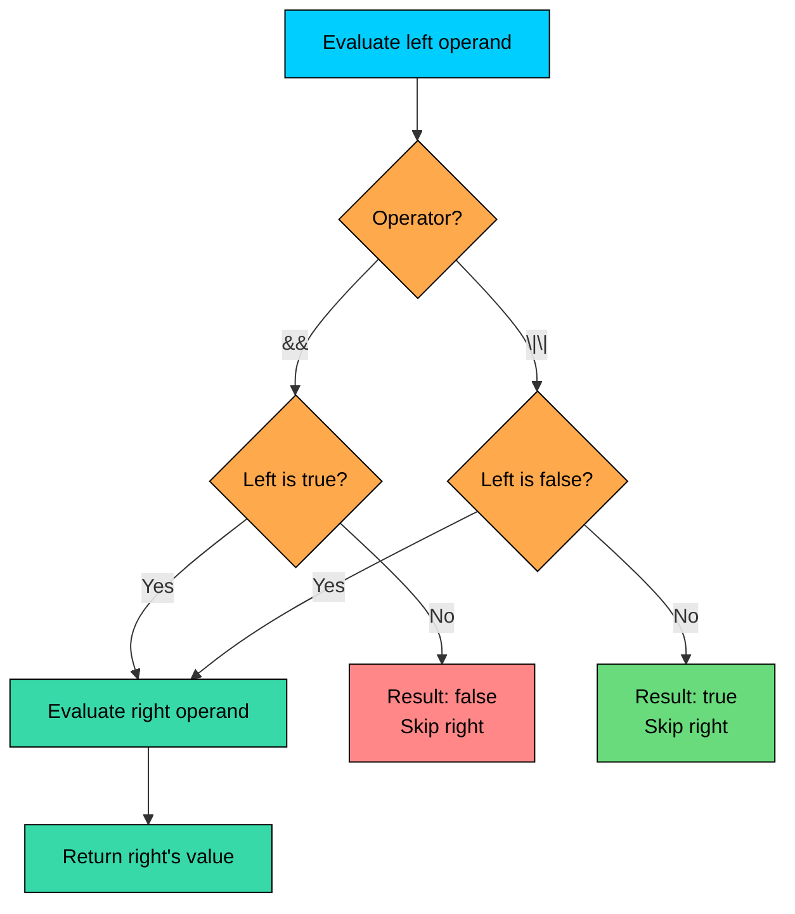

import React from 'react';
import CodeBlock from '../../../../components/ui/CodeBlock';
import Callout from '../../../../components/ui/Callout';

<div className="article-header">
  <div className="breadcrumb">
    <a href="/">Curated Notes</a>
    <span className="breadcrumb-separator">›</span>
    <span className="breadcrumb-current">Operators</span>
  </div>
  <h1>Operators</h1>
  <p style={{ color: 'var(--text-muted)', fontSize: '1.1rem', marginBottom: '16px', lineHeight: '1.6' }}>
    Master the essentials of Operators in this curated guide.
  </p>
  <div className="meta-info">
    <span className="meta-item">
      <svg width="14" height="14" viewBox="0 0 24 24" fill="none" stroke="currentColor" strokeWidth="2"><circle cx="12" cy="12" r="10"/><polyline points="12 6 12 12 16 14"/></svg>
      10 min read
    </span>
    <span className="difficulty-badge difficulty-badge--intermediate">Intermediate</span>
  </div>
</div>

<section className="content-section">

Operators are the small symbols that do the actual work in a Java expression. They add prices, compare quantities, combine boolean conditions, and decide which branch of a decision wins. This lesson walks through every operator family Java offers, along with common gotchas.

---

## Arithmetic Operators

The five arithmetic operators (`+`, `-`, `*`, `/`, `%`) work on numeric primitives like `int`, `long`, `double`, and `float`. They behave the way ordinary math does, with two important wrinkles.


| Operator | Name        | Example  | Result |
| -------- | ----------- | -------- | ------ |
| `+`      | Addition    | `5 + 3`  | `8`    |
| `-`      | Subtraction | `5 - 3`  | `2`    |
| `*`      | Multiply    | `5 * 3`  | `15`   |
| `/`      | Division    | `7 / 2`  | `3`    |
| `%`      | Modulo      | `7 % 3`  | `1`    |


A typical e-commerce calculation:


```java
public class CartTotal {
    public static void main(String[] args) {
        double unitPrice = 19.99;
        int quantity = 3;
        double subtotal = unitPrice * quantity;
        double tax = subtotal * 0.08;
        double total = subtotal + tax;
        System.out.println("Subtotal: $" + subtotal);
        System.out.println("Tax: $" + tax);
        System.out.println("Total: $" + total);
    }
}
```


#### Integer Division

When both operands are integers, `/` performs integer division and throws away the remainder. The result is not rounded, it's truncated toward zero. `7 / 2` is `3`, not `3.5`, and not `4`.


```java
public class IntegerDivision {
    public static void main(String[] args) {
        int totalItems = 7;
        int boxes = 2;
        int itemsPerBox = totalItems / boxes;
        System.out.println("Items per box: " + itemsPerBox);
    }
}
```


This matters most when you actually want a decimal answer. Splitting a $25 bill across 4 people:


```java
public class SplitBill {
    public static void main(String[] args) {
        int total = 25;
        int people = 4;
        int wrong = total / people;
        double right = (double) total / people;
        System.out.println("Wrong: " + wrong);
        System.out.println("Right: " + right);
    }
}
```


The fix is to make at least one operand a floating-point number. Either cast one side with `(double)`, write the literal as `25.0`, or store the value in a `double` from the start.

#### Modulo with Negatives

The `%` operator returns the remainder after division. For positive numbers it's the expected value, but the sign rule with negatives is worth noting: in Java, the sign of the result follows the **dividend** (the left operand), not the divisor.


| Expression | Result |
| ---------- | ------ |
| `7 % 3`    | `1`    |
| `-7 % 3`   | `-1`   |
| `7 % -3`   | `1`    |
| `-7 % -3`  | `-1`   |


```java
public class ModuloSigns {
    public static void main(String[] args) {
        System.out.println(7 % 3);
        System.out.println(-7 % 3);
        System.out.println(7 % -3);
        System.out.println(-7 % -3);
    }
}
```


`%` is common in "every Nth" logic: free shipping every 5th order, alternating colors in a list, checking if a number is even with `n % 2 == 0`.

#### String Concatenation with `+`

The `+` operator is special. If either operand is a `String`, `+` becomes string concatenation instead of arithmetic. Java converts the other side to a string and glues them together.


```java
public class CartLabel {
    public static void main(String[] args) {
        String customerName = "Alex";
        int itemCount = 3;
        String label = customerName + "'s cart has " + itemCount + " items";
        System.out.println(label);
    }
}
```


This is convenient, but it can produce surprises when arithmetic and concatenation mix. Evaluation is left to right, so the position of the first `String` matters:


```java
public class ConcatTrap {
    public static void main(String[] args) {
        System.out.println("Total: " + 2 + 3);
        System.out.println("Total: " + (2 + 3));
        System.out.println(2 + 3 + " items");
    }
}
```


The first line concatenates `"Total: "` with `2` to get `"Total: 2"`, then concatenates `3` to get `"Total: 23"`. Parentheses force the addition to happen first. In the third line, both operands are `int` at the start, so addition runs before the string ever shows up.

Concatenating strings in a loop with `+` allocates a new `String` on every iteration, because `String` is immutable. For long lists or large strings, use `StringBuilder` instead.

---

## Unary Operators

Unary operators take a single operand. The two that matter most are `++` (increment) and `--` (decrement), each with a pre- and post-form.


| Operator | Name           | Example  | Effect                                  |
| -------- | -------------- | -------- | --------------------------------------- |
| `+x`     | Unary plus     | `+price` | Returns `price` unchanged               |
| `-x`     | Unary minus    | `-price` | Returns the negation                    |
| `++x`    | Pre-increment  | `++x`    | Adds 1, then returns the new value      |
| `x++`    | Post-increment | `x++`    | Returns the current value, then adds 1  |
| `--x`    | Pre-decrement  | `--x`    | Subtracts 1, then returns the new value |
| `x--`    | Post-decrement | `x--`    | Returns the current value, then subtracts 1 |


The key difference between pre and post is **when** the change is visible to the surrounding expression. The variable always ends up changed; the only question is whether the expression sees the old value or the new one.


```java
public class IncrementWalkthrough {
    public static void main(String[] args) {
        int x = 5;
        System.out.println(x++ + " " + ++x);
    }
}
```


Walking through this step by step:

1. `x` starts at `5`.
2. `x++` evaluates to `5` (the current value), then `x` becomes `6`.
3. `++x` first increments `x` to `7`, then evaluates to `7`.
4. The final printed line is `5 7`. After the statement, `x` is `7`.

Pre vs post matters only when the increment is part of a bigger expression. As a standalone statement, `x++;` and `++x;` do the same thing.

---

## Relational Operators

Relational operators compare two values and produce a `boolean` (`true` or `false`).


| Operator | Meaning                | Example       | Result  |
| -------- | ---------------------- | ------------- | ------- |
| `==`     | Equal to               | `5 == 5`      | `true`  |
| `!=`     | Not equal to           | `5 != 3`      | `true`  |
| `<`      | Less than              | `5 < 10`      | `true`  |
| `>`      | Greater than           | `5 > 10`      | `false` |
| `<=`     | Less than or equal     | `5 <= 5`      | `true`  |
| `>=`     | Greater than or equal  | `5 >= 6`      | `false` |


For primitives, all six operators compare values. For reference types (objects), `==` and `!=` compare references, not contents. Two `String` objects with the same characters can still compare as unequal with `==` because they live at different addresses.


```java
public class CompareValues {
    public static void main(String[] args) {
        int cartSize = 3;
        int freeShippingThreshold = 5;
        boolean qualifies = cartSize >= freeShippingThreshold;
        System.out.println("Free shipping: " + qualifies);

        String coupon1 = new String("SAVE10");
        String coupon2 = new String("SAVE10");
        System.out.println(coupon1 == coupon2);
        System.out.println(coupon1.equals(coupon2));
    }
}
```


Use `==` for primitives. Use `.equals()` for objects when you care about content equality.

---

## Logical Operators

Logical operators combine `boolean` values. There are three: `&&` (AND), `||` (OR), and `!` (NOT).


| Operator | Name | Example          | Result                             |
| -------- | ---- | ---------------- | ---------------------------------- |
| `&&`     | AND  | `a && b`         | `true` if both are `true`          |
| `\|\|`   | OR   | `a \|\| b`       | `true` if at least one is `true`   |
| `!`      | NOT  | `!a`             | Flips `true` to `false` and back   |


```java
public class CheckoutEligibility {
    public static void main(String[] args) {
        int cartItems = 2;
        boolean hasCoupon = true;
        boolean canCheckout = cartItems > 0 && hasCoupon;
        System.out.println("Can check out: " + canCheckout);
    }
}
```


#### Short-Circuit Evaluation

Both `&&` and `||` are **short-circuit** operators. They evaluate the left side first, and skip the right side if the answer is already determined.

- For `&&`, if the left side is `false`, the whole expression is `false`, so the right side is never evaluated.
- For `||`, if the left side is `true`, the whole expression is `true`, so the right side is never evaluated.





This is more than a performance optimization. It enables guarding against errors. A common pattern is checking for `null` before calling a method on an object:


```java
public class SafeAccess {
    public static void main(String[] args) {
        String customer = null;
        boolean isVip = customer != null && customer.equals("VIP");
        System.out.println("Is VIP: " + isVip);
    }
}
```


If `customer` is `null`, the left side `customer != null` is `false`, so `&&` short-circuits and never calls `customer.equals(...)`. Without short-circuiting, that call would throw `NullPointerException`.

---

## Bitwise and Non-Short-Circuit Operators

Bitwise operators work on the individual bits of an integer. They aren't used every day, but they show up in flag handling, low-level math, and a few performance tricks.


| Operator | Name                  | Example     | Result          |
| -------- | --------------------- | ----------- | --------------- |
| `&`      | Bitwise AND           | `0b1100 & 0b1010` | `0b1000` (`8`) |
| `\|`     | Bitwise OR            | `0b1100 \| 0b1010` | `0b1110` (`14`) |
| `^`      | Bitwise XOR           | `0b1100 ^ 0b1010` | `0b0110` (`6`)  |
| `~`      | Bitwise NOT (flip)    | `~5`        | `-6`            |
| `<<`     | Left shift            | `5 << 2`    | `20`            |
| `>>`     | Signed right shift    | `-20 >> 2`  | `-5`            |
| `>>>`    | Unsigned right shift  | `-20 >>> 2` | A large positive number |


```java
public class BitwiseDemo {
    public static void main(String[] args) {
        int a = 12;   // 0000 1100
        int b = 10;   // 0000 1010
        System.out.println("a & b = " + (a & b));
        System.out.println("a | b = " + (a | b));
        System.out.println("a ^ b = " + (a ^ b));
        System.out.println("~a = " + (~a));
        System.out.println("a << 2 = " + (a << 2));
        System.out.println("a >> 1 = " + (a >> 1));
    }
}
```


The shift operators are worth a closer look. `a << 2` shifts the bits of `a` left by 2 positions, which is equivalent to multiplying by 4. `a >> 1` shifts right by 1, which is dividing by 2 and rounding down. `>>>` is the same as `>>` for positive numbers, but it fills the new high bits with zeros instead of copying the sign bit, so the result is always non-negative.

#### `&` and `|` on Booleans

An important detail: `&` and `|` also work on `boolean` values, but they **do not short-circuit**. They always evaluate both sides.


```java
public class NonShortCircuit {
    public static void main(String[] args) {
        String customer = null;
        try {
            boolean isVip = customer != null & customer.equals("VIP");
            System.out.println("Is VIP: " + isVip);
        } catch (NullPointerException e) {
            System.out.println("Crashed: NullPointerException");
        }
    }
}
```


The single `&` evaluates both sides regardless of the left result, so `customer.equals("VIP")` runs on a `null` reference. Use `&&` and `||` for boolean logic unless both sides specifically need to evaluate (for example, because the right side has a side effect that must run).

---

## Assignment Operators

The basic assignment is `=`. The compound forms combine an arithmetic or bitwise operation with assignment, so `total += tax` is shorthand for `total = total + tax`.


| Operator | Equivalent       | Example    |
| -------- | ---------------- | ---------- |
| `=`      | Plain assignment | `x = 5`    |
| `+=`     | `x = x + y`      | `x += 3`   |
| `-=`     | `x = x - y`      | `x -= 3`   |
| `*=`     | `x = x * y`      | `x *= 2`   |
| `/=`     | `x = x / y`      | `x /= 2`   |
| `%=`     | `x = x % y`      | `x %= 5`   |
| `&=`     | `x = x & y`      | `x &= 0b1` |
| `\|=`    | `x = x \| y`     | `x \|= 0b1` |
| `^=`     | `x = x ^ y`      | `x ^= 0b1` |
| `<<=`    | `x = x << y`     | `x <<= 2`  |
| `>>=`    | `x = x >> y`     | `x >>= 2`  |


```java
public class RunningTotal {
    public static void main(String[] args) {
        double total = 0;
        total += 19.99;
        total += 9.99;
        total += 4.50;
        total *= 1.08;
        System.out.println("Final total: $" + total);
    }
}
```


Compound assignments include an implicit cast back to the variable's type. That means `byte b = 10; b += 200;` compiles even though `b = b + 200;` would not (because `b + 200` is an `int`, and assigning an `int` to a `byte` needs an explicit cast). The compound form inserts the cast automatically, and the value wraps around just like any narrowing cast. Be aware of this when working with `byte` and `short`.


```java
public class CompoundCast {
    public static void main(String[] args) {
        byte count = 10;
        count += 200;
        System.out.println("count: " + count);
    }
}
```


---

## Ternary Operator

The ternary operator `condition ? a : b` picks between two values based on a boolean. If `condition` is `true`, the expression evaluates to `a`; otherwise to `b`. It is the only operator in Java that takes three operands.


```java
public class DiscountRate {
    public static void main(String[] args) {
        boolean isPremium = true;
        int discount = isPremium ? 20 : 5;
        System.out.println("Discount: " + discount + "%");
    }
}
```


Ternary is useful when assigning one of two values to a variable in a single line. It keeps simple decisions compact. Avoid nesting ternaries inside other ternaries; readability degrades quickly:


```java
String tier = isPremium ? "Gold" : isLoyal ? "Silver" : "Bronze";
```


That works, but it slows readers down. A plain `if`-`else if`-`else` chain is easier to follow. Save ternary for the cases where both branches are short and obvious.

---

## The `instanceof` Operator

`instanceof` checks whether an object is an instance of a particular type. It returns `true` or `false`.


```java
public class InstanceofDemo {
    public static void main(String[] args) {
        Object item = "Wireless Headphones";
        System.out.println(item instanceof String);
        System.out.println(item instanceof Integer);
    }
}
```


`instanceof` is commonly used when a reference of one type might point to an actual object of a more specific subtype. It comes up in inheritance, polymorphism, and pattern matching.

---

## Operator Precedence and Associativity

When an expression mixes several operators, Java evaluates them in a specific order. **Precedence** decides which operator binds tighter; **associativity** decides what happens when two operators of the same precedence sit next to each other.

The table below lists the families from highest to lowest precedence. Operators in the same row have the same precedence.


| Rank | Operators                       | Description                  | Associativity |
| ---- | ------------------------------- | ---------------------------- | ------------- |
| 1    | `++ -- + - ! ~ (type)`          | Unary, cast                  | Right to left |
| 2    | `* / %`                         | Multiplicative               | Left to right |
| 3    | `+ -`                           | Additive (and concatenation) | Left to right |
| 4    | `<< >> >>>`                     | Shift                        | Left to right |
| 5    | `< > <= >= instanceof`          | Relational                   | Left to right |
| 6    | `== !=`                         | Equality                     | Left to right |
| 7    | `&`                             | Bitwise AND                  | Left to right |
| 8    | `^`                             | Bitwise XOR                  | Left to right |
| 9    | `\|`                            | Bitwise OR                   | Left to right |
| 10   | `&&`                            | Logical AND                  | Left to right |
| 11   | `\|\|`                          | Logical OR                   | Left to right |
| 12   | `? :`                           | Ternary                      | Right to left |
| 13   | `= += -= *= /= %= &= \|= ^= <<= >>= >>>=` | Assignment         | Right to left |


A worked example using several of these:


```java
public class PrecedenceDemo {
    public static void main(String[] args) {
        int subtotal = 100;
        int tax = 8;
        int shipping = 5;
        boolean isPremium = true;
        int total = subtotal + tax + (isPremium ? 0 : shipping);
        System.out.println("Total: " + total);
    }
}
```


Java reads `subtotal + tax + (isPremium ? 0 : shipping)` as follows:

1. Parentheses force the ternary to evaluate first. `isPremium` is `true`, so the ternary gives `0`.
2. With the parentheses replaced, the expression becomes `subtotal + tax + 0`.
3. `+` is left associative, so it evaluates as `(subtotal + tax) + 0`, which is `108`.

Without the parentheses, the ternary's low precedence would have caused a problem: `subtotal + tax + isPremium ? 0 : shipping` would parse as `((subtotal + tax) + isPremium) ? 0 : shipping`, which doesn't compile because an `int` cannot be added to a `boolean`.

#### Use Parentheses for Clarity

Memorizing the precedence rules isn't typically required. The easier approach: add parentheses whenever the order of operations isn't obvious at a glance. They make intent explicit and save the reader from looking up the table.


```java
boolean qualifies = (cart.size() > 0) && (hasCoupon || isPremium);
```


That version reads cleanly even without remembering whether `&&` binds tighter than `||`. The compiler accepts both, but readability matters.

</section>
