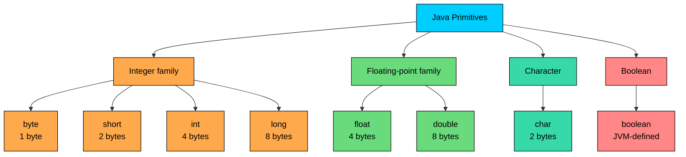

import React from 'react';
import CodeBlock from '../../../../components/ui/CodeBlock';
import Callout from '../../../../components/ui/Callout';

<div className="article-header">
  <div className="breadcrumb">
    <a href="/">Curated Notes</a>
    <span className="breadcrumb-separator">›</span>
    <span className="breadcrumb-current">Primitive Types</span>
  </div>
  <h1>Primitive Types</h1>
  <p style={{ color: 'var(--text-muted)', fontSize: '1.1rem', marginBottom: '16px', lineHeight: '1.6' }}>
    Master the essentials of Primitive Types in this curated guide.
  </p>
  <div className="meta-info">
    <span className="meta-item">
      <svg width="14" height="14" viewBox="0 0 24 24" fill="none" stroke="currentColor" strokeWidth="2"><circle cx="12" cy="12" r="10"/><polyline points="12 6 12 12 16 14"/></svg>
      10 min read
    </span>
    <span className="difficulty-badge difficulty-badge--intermediate">Intermediate</span>
  </div>
</div>

<section className="content-section">

Java has two kinds of values: primitives and references. The 8 primitive types are the raw, fixed-size building blocks the JVM works with directly. This lesson walks through each one, what it stores, how it behaves at the edges, and where it shows up in the kind of e-commerce code we'll keep writing through this course.

---

## Why Java Has Primitives

Most things in Java are objects. A `String`, a `List`, a `Product` class you write yourself, all live on the heap and you reach them through a reference. That model is flexible, but it carries a cost: every object needs a header, an allocation, and an extra indirection to read its data.

For numbers and single characters, that overhead is significant. If a shopping cart holds a million item prices and each price is a full object, you pay for a million object headers just to store a million numbers. Primitives skip all of that. An `int` is 4 bytes of raw storage, sitting directly in the variable or on the stack. There's no header, no allocation, no indirection. The JVM just reads the bytes.

That's the bargain. Primitives lose the flexibility of objects, no methods, no `null`, no inheritance, and in exchange you get values that are small, fast, and predictable.

The 8 primitives split into four families:





The integer family holds whole numbers. The floating-point family holds numbers with decimal places. `char` holds a single 16-bit character. `boolean` holds `true` or `false`. Everything else in Java, every `String`, every `ArrayList`, every class you write, is a reference type.

Here's the full picture at a glance:


| Type      | Size                 | Default   | Range                                                       | Example Use                       |
| --------- | -------------------- | --------- | ----------------------------------------------------------- | --------------------------------- |
| `byte`    | 1 byte (8 bits)      | `0`       | -128 to 127                                                 | Compact flags, small counts       |
| `short`   | 2 bytes (16 bits)    | `0`       | -32,768 to 32,767                                           | Tight memory budgets, rare        |
| `int`     | 4 bytes (32 bits)    | `0`       | -2,147,483,648 to 2,147,483,647                             | Stock counts, quantities, IDs     |
| `long`    | 8 bytes (64 bits)    | `0L`      | About -9.2 x 10^18 to 9.2 x 10^18                           | Order totals in cents, timestamps |
| `float`   | 4 bytes (32 bits)    | `0.0f`    | About +/- 3.4 x 10^38, ~7 decimal digits                    | Product ratings, where precision is loose |
| `double`  | 8 bytes (64 bits)    | `0.0`     | About +/- 1.8 x 10^308, ~15-16 decimal digits               | Prices, percentages, most math    |
| `char`    | 2 bytes (16 bits)    | `''`| 0 to 65,535 (unsigned)                                      | Product code letter, single character |
| `boolean` | JVM-defined          | `false`   | `true` or `false`                                           | `isInStock`, `isPremium`, flags   |


The rest of the lesson unpacks the rows.

---

## The Integer Family

Four primitives store whole numbers, and the only thing that changes between them is how many bytes they take and how wide a range they cover.


```java
public class IntegerSizes {
    public static void main(String[] args) {
        byte tinyCount = 100;
        short smallCount = 20_000;
        int stockCount = 1_500_000;
        long totalCents = 9_500_000_000L;

        System.out.println("tiny: " + tinyCount);
        System.out.println("small: " + smallCount);
        System.out.println("stock: " + stockCount);
        System.out.println("totalCents: " + totalCents);
    }
}
```


A few details about that snippet. The underscores in `1_500_000` are pure formatting, the compiler ignores them. They make long literals readable, and you can put them anywhere between digits. The `L` suffix on `9_500_000_000L` is required because that number is larger than `Integer.MAX_VALUE`. Without the `L`, the literal is treated as an `int` and the compiler rejects it.

In practice, `int` is the default almost every time you need a whole number. A stock count of 1,500,000 fits comfortably. Cart sizes and customer IDs typically fit as well. `int` is Java's default integer type, and most APIs return `int`.

`long` shows up when `int` isn't wide enough. Two common cases:

- **Money in cents.** A grand total like `$95,000,000.00` fits in `int` if you store dollars, but storing money in cents avoids floating-point error. `9,500,000,000` cents needs `long`.
- **Timestamps.** Milliseconds since 1970 (`System.currentTimeMillis()`) returns `long`.

`byte` and `short` are rare in everyday Java. They're typically used when a smaller type is thought to save memory, though this rarely saves anything in practice.

#### Integer Literals: Decimal, Hex, Binary

You can write integer literals in three bases:


```java
public class IntegerLiterals {
    public static void main(String[] args) {
        int decimal = 255;
        int hex = 0xFF;
        int binary = 0b1111_1111;

        System.out.println(decimal);
        System.out.println(hex);
        System.out.println(binary);
    }
}
```


All three literals describe the same number, just in different bases. Decimal is the common choice. Hex (`0x` prefix) is convenient for bit patterns and color codes. Binary (`0b` prefix, added in Java 7) is convenient when you want the bit layout to be obvious.

The underscore rule covers all three bases. `0b1111_1111` is the same as `0b11111111`, the underscores just group the bits visually.

#### The `L` Suffix and Why Lowercase `l` Is Trouble

Integer literals default to `int`. To get a `long` literal, you append `L`:


```java
public class LongLiteral {
    public static void main(String[] args) {
        long orderId = 100_000_000_000L;
        System.out.println("Order ID: " + orderId);
    }
}
```


Without the `L`, the compiler reports something like `integer number too large` because `100_000_000_000` doesn't fit in 32 bits.

You're allowed to use lowercase `l` instead of `L`, but don't. In most fonts, lowercase `l` is hard to distinguish from the digit `1`. Always use uppercase `L`.

---

## The Floating-Point Family

Two primitives store numbers with fractional parts: `float` (4 bytes) and `double` (8 bytes). Both follow the IEEE 754 standard for binary floating-point, which is the same format almost every modern language uses.

`double` has roughly 15 to 16 significant decimal digits of precision and a huge range. `float` has about 7 decimal digits. In modern code, `double` is the default, and you only drop to `float` when you have a specific reason (graphics, machine learning weights, very large arrays).


```java
public class Prices {
    public static void main(String[] args) {
        double headphonesPrice = 79.99;
        double speakerPrice = 49.50;
        double cartTotal = headphonesPrice + speakerPrice;

        System.out.println("Cart total: $" + cartTotal);
    }
}
```


That works fine for display. The trap shows up when you do arithmetic that you'd expect to produce a clean number.

#### Why `0.1 + 0.2` Isn't `0.3`

IEEE 754 stores numbers in binary, not decimal. Some decimal numbers, like `0.1`, cannot be represented exactly in binary, just like `1/3` cannot be represented exactly in decimal. The closest binary approximation is stored, and the tiny error becomes visible when you add several of them together.


```java
public class FloatingPointTrap {
    public static void main(String[] args) {
        double a = 0.1;
        double b = 0.2;
        System.out.println(a + b);
        System.out.println(a + b == 0.3);
    }
}
```


The sum is `0.30000000000000004`, not `0.3`, and the equality check fails. This isn't a Java bug. The same code in Python, JavaScript, or C++ produces the same result.

For an e-commerce cart, the practical fix is to either round before display, or store money in the smallest unit (cents) using `long` so the arithmetic is exact. Never use `==` to compare floating-point numbers, and don't assume decimal math will be exact.

Floating-point arithmetic isn't slow, but the rounding error is real. For money, treating prices as `long` cents avoids the problem entirely.

#### `float` Literals and the `f` Suffix

A floating-point literal in Java defaults to `double`. So this fails to compile:


```java
float rating = 4.5;
```


The compiler reports:


```shell
error: incompatible types: possible lossy conversion from double to float
```


The fix is to mark the literal as a `float` with an `f` suffix:


```java
public class ProductRating {
    public static void main(String[] args) {
        float rating = 4.5f;
        System.out.println("Rating: " + rating);
    }
}
```


You can also write `4.5d` or `4.5D` to be explicit that a literal is a `double`, but the `d` suffix is optional because that's the default. The `f` suffix on `float` literals is not optional, leave it off and the code won't compile.

---

## The `char` Type

A `char` is a single 16-bit unsigned value. It holds a Unicode code unit, which covers the entire Basic Multilingual Plane (most characters you'll ever see) in one `char`. You write `char` literals with single quotes:


```java
public class ProductCode {
    public static void main(String[] args) {
        char categoryLetter = 'E';
        char ratingLetter = 'A';

        System.out.println("Category: " + categoryLetter);
        System.out.println("Top rating: " + ratingLetter);
    }
}
```


Single quotes for `char`, double quotes for `String`. `'A'` is a single character. `"A"` is a one-character string. Mixing them up is a common beginner error.

Because `char` is technically a 16-bit unsigned integer internally, you can do arithmetic on it:


```java
public class CharMath {
    public static void main(String[] args) {
        char letter = 'A';
        char next = (char) (letter + 1);
        System.out.println(next);
    }
}
```


The cast to `char` is required because adding an `int` (`1`) to a `char` produces an `int`.

#### Escape Sequences

Some characters can't be written directly inside the single quotes, either because they have special meaning (like the single quote itself) or because they're not printable. Escape sequences cover those cases:


| Escape   | Meaning                |
| -------- | ---------------------- |
| `\n`     | Newline                |
| `\t`     | Tab                    |
| `\r`     | Carriage return        |
| `\\`     | Backslash              |
| `\'`     | Single quote           |
| `\"`     | Double quote           |
| `é` | Unicode escape (`é`)   |


```java
public class EscapeDemo {
    public static void main(String[] args) {
        char tab = '\t';
        char newline = '\n';
        char eAcute = 'é';

        System.out.println("Cafe" + eAcute);
        System.out.println("col1" + tab + "col2");
        System.out.println("line1" + newline + "line2");
    }
}
```


The `é` form is a Unicode escape, which lets you write any character by its 4-digit hex code. It's useful for characters your keyboard doesn't have, or when you want the source to stay pure ASCII.

---

## The `boolean` Type

A `boolean` holds one of two values: `true` or `false`. That's it. There's no implicit conversion from numbers, no "truthy" or "falsy" values like in some other languages. `0` is not `false`, and an empty string is not `false`. The only values you can assign to a `boolean` are the literals `true` and `false`, or expressions that produce a `boolean`.


```java
public class StockCheck {
    public static void main(String[] args) {
        int stockCount = 5;
        boolean isInStock = stockCount > 0;
        boolean isFreeShipping = false;

        System.out.println("In stock: " + isInStock);
        System.out.println("Free shipping: " + isFreeShipping);
    }
}
```


The size of a `boolean` is intentionally not specified by the Java Language Specification. The JVM is free to use however many bits it likes. In practice, a standalone `boolean` variable usually occupies 4 bytes (so it's word-aligned), and a `boolean[]` typically uses 1 byte per element. It's a common interview question.

---

## Default Values vs Local Variables

Every primitive has a default value. Fields of a class (whether `static` or instance) get their default automatically when the class loads or when an object is constructed. You can see this with a small class that doesn't explicitly initialize anything:


```java
public class ProductDefaults {
    static int stockCount;
    static double price;
    static boolean isInStock;
    static char gradeLetter;

    public static void main(String[] args) {
        System.out.println("stockCount: " + stockCount);
        System.out.println("price: " + price);
        System.out.println("isInStock: " + isInStock);
        System.out.println("gradeLetter: [" + gradeLetter + "]");
    }
}
```


The defaults match the table at the top of the lesson. Numbers default to zero, booleans to `false`, and `char` to `''`, which is the null character (it prints as a space-like invisible character above).

Local variables are different. Variables declared inside a method are not given a default. You must assign a value before reading them, or the compiler stops you:


```java
public class LocalDefault {
    public static void main(String[] args) {
        int stockCount;
        System.out.println(stockCount);
    }
}
```


The compiler reports:


```shell
error: variable stockCount might not have been initialized
        System.out.println(stockCount);
                           ^
```


This catches a whole category of bugs at compile time: reading uninitialized memory. The fix is to assign before reading:


```java
public class LocalDefault {
    public static void main(String[] args) {
        int stockCount = 0;
        System.out.println(stockCount);
    }
}
```


---

## Overflow and Wraparound

Integer types in Java have a fixed range. When an operation produces a value outside that range, Java doesn't throw an error. It silently wraps around. `Integer.MAX_VALUE` is `2_147_483_647`. Add one to it, and you don't get `2_147_483_648`. You get `-2_147_483_648`, which is `Integer.MIN_VALUE`:


```java
public class OverflowDemo {
    public static void main(String[] args) {
        int maxInt = Integer.MAX_VALUE;
        System.out.println("Max int: " + maxInt);

        int wrapped = maxInt + 1;
        System.out.println("Max + 1: " + wrapped);

        byte maxByte = 127;
        byte wrappedByte = (byte) (maxByte + 1);
        System.out.println("Max byte + 1: " + wrappedByte);
    }
}
```


This happens because integers use two's complement encoding, and adding one to the largest positive value flips the sign bit. The CPU does the addition the same way it always does, the math just wraps around the edge of the type's range.

In e-commerce code, this matters when you multiply. Say a power user buys 100,000 items at $30,000 each (an enterprise order). If you compute the total in cents using `int`, the multiplication overflows long before you reach the real total. Use `long` for any computation where the intermediate values might exceed `Integer.MAX_VALUE`:


```java
public class OrderTotal {
    public static void main(String[] args) {
        int quantity = 100_000;
        int unitPriceCents = 30_000_00;

        int badTotal = quantity * unitPriceCents;
        long goodTotal = (long) quantity * unitPriceCents;

        System.out.println("Bad total (int): " + badTotal);
        System.out.println("Good total (long): " + goodTotal);
    }
}
```


The cast `(long) quantity` promotes the multiplication to `long`, so the result fits. Without it, the multiplication happens in `int` and overflows before anything is stored anywhere.

---

## A Cost to Be Aware Of: `byte` and `short` Rarely Save Memory

It's tempting to use `byte` or `short` for fields you know will hold small values. A stock count between 0 and 100, a product rating between 1 and 5. Surely a 1-byte type uses less memory than a 4-byte type, so why not?

In practice, this almost never helps:

- **Object fields are typically padded.** The JVM aligns object fields on word boundaries (usually 4 or 8 bytes), so a single `byte` field in an object often occupies the same space as an `int` field after padding.
- **Arithmetic operates on `int`.** When you add two `byte` values, the JVM promotes them to `int`, does the math in `int`, and you have to cast back to `byte`. The supposed savings cost you cast clutter on every operation.
- **The boxed forms are full objects.** As soon as a value gets stored in a `List<Byte>` or any generic collection, it becomes a `Byte` object on the heap. The object header alone (12 to 16 bytes depending on JVM settings) dwarfs any per-element savings.

The exception is large arrays. A `byte[1_000_000]` is 1 MB, while an `int[1_000_000]` is 4 MB. If you're storing a million raw values, the size difference matters. For fields on objects and individual variables, just use `int`.

`double` is the default for arithmetic on floating-point values. Mixing `float` and `double` in expressions promotes everything to `double`, so the savings of using `float` only show up when every value involved is a `float` (typically in large arrays, not scattered variables).

---

## Putting It Together

A small program that uses all 8 primitives in a realistic shape, with each variable type-matched to what it actually represents in a product catalog:


```java
public class ProductSummary {
    public static void main(String[] args) {
        byte categoryId = 7;
        short warehouseId = 1042;
        int stockCount = 245_000;
        long totalOrdersAllTime = 12_500_000_000L;

        double price = 79.99;
        float averageRating = 4.6f;

        char gradeLetter = 'A';
        boolean isInStock = stockCount > 0;

        System.out.println("Category: " + categoryId);
        System.out.println("Warehouse: " + warehouseId);
        System.out.println("Stock: " + stockCount);
        System.out.println("Lifetime orders: " + totalOrdersAllTime);
        System.out.println("Price: $" + price);
        System.out.println("Rating: " + averageRating);
        System.out.println("Grade: " + gradeLetter);
        System.out.println("In stock: " + isInStock);
    }
}
```


In real code, `int` and `double` cover most cases. The other six exist for specific situations: large arrays, raw byte streams, lifetime counters that exceed 2 billion, single Unicode characters, and binary flags.

</section>
