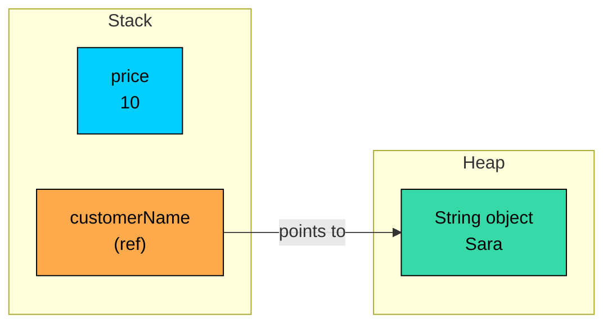

import React from 'react';
import CodeBlock from '../../../../components/ui/CodeBlock';
import Callout from '../../../../components/ui/Callout';

<div className="article-header">
  <div className="breadcrumb">
    <a href="/">Curated Notes</a>
    <span className="breadcrumb-separator">›</span>
    <span className="breadcrumb-current">Reference Types</span>
  </div>
  <h1>Reference Types</h1>
  <p style={{ color: 'var(--text-muted)', fontSize: '1.1rem', marginBottom: '16px', lineHeight: '1.6' }}>
    Master the essentials of Reference Types in this curated guide.
  </p>
  <div className="meta-info">
    <span className="meta-item">
      <svg width="14" height="14" viewBox="0 0 24 24" fill="none" stroke="currentColor" strokeWidth="2"><circle cx="12" cy="12" r="10"/><polyline points="12 6 12 12 16 14"/></svg>
      10 min read
    </span>
    <span className="difficulty-badge difficulty-badge--intermediate">Intermediate</span>
  </div>
</div>

<section className="content-section">

Primitives store values directly, but most things in Java are objects, and objects live somewhere else. This lesson covers what a reference type is, how reference variables connect to objects in memory, what `null` actually means, and why `==` doesn't compare contents when used with objects. We'll keep the running shop example small so the memory picture stays clear.

---

## What Counts as a Reference Type

Java has exactly 8 primitive types: `int`, `long`, `short`, `byte`, `float`, `double`, `char`, and `boolean`. Everything else is a reference type. That includes `String`, every array (`String[]`, `int[]`, anything with `[]`), and every class you define yourself.

The key difference shows up in what the variable actually holds:

- A primitive variable holds the value itself. `int price = 10;` and the slot for `price` literally contains `10`.
- A reference variable holds the address of an object that lives somewhere else in memory. `String name = "Sara";` and the slot for `name` contains a reference (you can think of it as a pointer) to a `String` object stored on the heap.

A tiny program that uses both:


```java
public class CustomerInfo {
    public static void main(String[] args) {
        int loyaltyPoints = 250;
        String customerEmail = "sara@example.com";

        System.out.println("Points: " + loyaltyPoints);
        System.out.println("Email: " + customerEmail);
    }
}
```


From the outside, both variables look similar. You assigned a value, you printed it. The difference is invisible until you pass variables around, compare them, or one of them is empty.

---

## Stack vs Heap: Where Variables Live

Java splits memory into two regions that matter for this lesson: the **stack** and the **heap**. The stack holds local variables for the method that's currently running. The heap holds objects.

When you write `int price = 10;` inside `main`, Java carves out a slot on the stack for `price` and writes `10` into it. The value sits inside the slot, end of story.

When you write `String customerName = "Sara";`, two things happen:

1. A `String` object holding the characters `S`, `a`, `r`, `a` is created on the heap.
2. A slot for `customerName` is carved out on the stack, and the address of that heap object is written into the slot.

The variable doesn't contain `"Sara"`. It contains a reference that points to where `"Sara"` lives.





The `price` slot is self-contained. The `customerName` slot is a pointer.

You don't manage this layout by hand. The JVM decides where things go and the garbage collector cleans up heap objects no one references anymore. What matters is knowing which kind of variable you're holding when you look at a line of code.


```java
public class StackVsHeap {
    public static void main(String[] args) {
        int orderCount = 3;
        String shippingAddress = "221B Baker Street";

        System.out.println("orderCount lives on the stack: " + orderCount);
        System.out.println("shippingAddress points to a heap object: " + shippingAddress);
    }
}
```


---

## Creating Objects with `new`

Most reference values are created with the `new` keyword. When you write `new SomeType(...)`, three things happen:

1. The JVM allocates space for a new object on the heap.
2. The constructor runs to initialize the object's fields.
3. The expression evaluates to a reference pointing at the new object.

A small example using an array, which is a reference type with a slightly different `new` syntax:


```java
public class NewExample {
    public static void main(String[] args) {
        String[] cartItems = new String[3];
        cartItems[0] = "Wireless Headphones";
        cartItems[1] = "Phone Charger";
        cartItems[2] = "Laptop Stand";

        System.out.println("First item: " + cartItems[0]);
        System.out.println("Cart size: " + cartItems.length);
    }
}
```


`new String[3]` allocates a fresh array object on the heap big enough to hold 3 references. The variable `cartItems` then points to that array.

`String` is a special case because Java lets you skip `new` for string literals. Writing `String customerEmail = "sara@example.com";` produces a `String` object too, but the literal goes through a separate mechanism called the String Pool. For now, treat string literals as if they create an object on the heap.

Every `new` allocates fresh memory. In a tight loop, building objects you don't actually need creates pressure on the garbage collector. Reuse objects or use primitives when you can.

---

## `null`: The Absence of a Reference

A reference variable doesn't have to point at anything. `null` is the value that means "this reference points to no object." You assign it explicitly, or you read it from a field that hasn't been initialized.


```java
public class NullExample {
    public static void main(String[] args) {
        String customerName = null;
        System.out.println("Name: " + customerName);
    }
}
```


Printing a `null` reference shows the text `null`. No crash. The trouble starts when you try to use the reference for anything other than passing it around or comparing it.

**What's wrong with this code?**


```java
public class NullCrash {
    public static void main(String[] args) {
        String customerName = null;
        System.out.println(customerName.length());
    }
}
```


The variable holds no reference, so the JVM can't follow it to call `.length()`. You get a `NullPointerException` (often shortened to NPE):


```shell
Exception in thread "main" java.lang.NullPointerException:
    Cannot invoke "String.length()" because "customerName" is null
        at NullCrash.main(NullCrash.java:4)
```


**Fix:** Check for `null` before using the reference, or assign a real value:


```java
public class NullSafe {
    public static void main(String[] args) {
        String customerName = null;
        if (customerName != null) {
            System.out.println(customerName.length());
        } else {
            System.out.println("Customer name not set");
        }
    }
}
```


A second place `null` appears without explicit assignment: reference-type fields default to `null` when a class is created, the same way primitive fields default to `0` or `false`. The defaults are summarized below.


| Field type | Default value |
| ---------- | ------------- |
| `int`, `long`, `short`, `byte` | `0` |
| `double`, `float` | `0.0` |
| `boolean` | `false` |
| `char` | `''` |
| Any reference type (`String`, arrays, classes) | `null` |


Local variables (the ones inside a method) don't get defaults. The compiler forces you to assign a value before reading them, which catches a lot of accidental nulls early.

---

## Assigning One Reference to Another

Assigning one reference variable to another does not copy the object. Both variables end up pointing to the same object on the heap.


```java
public class SharedCart {
    public static void main(String[] args) {
        String[] cartA = new String[3];
        cartA[0] = "Wireless Headphones";
        cartA[1] = "Phone Charger";
        cartA[2] = "Laptop Stand";

        String[] cartB = cartA;
        cartB[0] = "Smart Watch";

        System.out.println("cartA[0]: " + cartA[0]);
        System.out.println("cartB[0]: " + cartB[0]);
    }
}
```


We only changed `cartB[0]`, but `cartA[0]` changed too. That's because `cartB = cartA` copied the reference, not the array. After that line, both variables point at the same array object on the heap. Writing through one of them is visible through the other.

Compare with primitives, where assignment really does copy the value:


```java
public class PrimitiveCopy {
    public static void main(String[] args) {
        int priceA = 100;
        int priceB = priceA;
        priceB = 200;

        System.out.println("priceA: " + priceA);
        System.out.println("priceB: " + priceB);
    }
}
```


`priceA` keeps its original value because primitive assignment hands `priceB` its own slot containing a fresh `100`. Changing one slot doesn't touch the other.

The reference-sharing behavior matters a lot once methods enter the picture: if you pass a reference into a method and the method mutates the object, the caller sees the change.

---

## `==` vs `.equals()` for References

Comparison is the other place where the reference model leaks into your code. The `==` operator compares whatever sits inside the variable. For primitives that means values. For references it means addresses.


```java
public class EqualityCheck {
    public static void main(String[] args) {
        String emailA = new String("sara@example.com");
        String emailB = new String("sara@example.com");

        System.out.println("emailA == emailB: " + (emailA == emailB));
        System.out.println("emailA.equals(emailB): " + emailA.equals(emailB));
    }
}
```


Two separate `new String(...)` calls produce two separate objects on the heap. The contents are the same, but the addresses are different, so `==` returns `false`. The `equals` method on `String` compares character by character, so it returns `true`.

A rule of thumb:

- `==` answers "do these two variables point at the same object?"
- `.equals()` answers "do these two objects have the same contents?" (when the class defines a meaningful `equals` method, which `String` does).

There's one catch with string literals when using `==` on strings:


```java
public class LiteralEquality {
    public static void main(String[] args) {
        String a = "sara@example.com";
        String b = "sara@example.com";
        System.out.println(a == b);
    }
}
```


This prints `true` because string literals share storage through the String Pool. Two literals with the same characters end up referencing the same pooled object, so `==` happens to work. That's a quirk of how the pool optimizes memory, not a general rule about strings. If even one side uses `new String("...")`, you're back to `false`. Use `.equals()` when you care about contents.

The takeaway here is just the mental model: `==` for "same object", `.equals()` for "same contents."

`.equals()` on `String` scans both strings, so it's O(n) in the length. `==` is a single pointer comparison. For very hot code paths comparing pooled or interned strings, `==` can be faster, but it's almost always wrong for general use.

---

## Primitives vs References Side by Side

The whole lesson reduces to a few practical differences.


| Aspect | Primitive | Reference |
| ------ | --------- | --------- |
| What the variable holds | The actual value | An address (a reference to an object on the heap) |
| Where the data lives | Stack slot for the variable | Object lives on the heap; the variable on the stack holds the reference |
| Default field value | `0`, `0.0`, `false`, `''` | `null` |
| Can be `null` | No | Yes |
| `==` behavior | Compares values | Compares references (same object?) |
| Assignment (`a = b`) | Copies the value | Copies the reference; both point to the same object |


```java
public class PrimitiveVsReferenceDemo {
    public static void main(String[] args) {
        int copiesA = 5;
        int copiesB = copiesA;
        copiesB = 10;
        System.out.println("copiesA stays: " + copiesA);

        String[] cartA = { "Headphones", "Charger" };
        String[] cartB = cartA;
        cartB[0] = "Speaker";
        System.out.println("cartA[0] changed too: " + cartA[0]);
    }
}
```


One assignment copied a value, the other copied a reference. Same syntax, very different effect.

</section>
