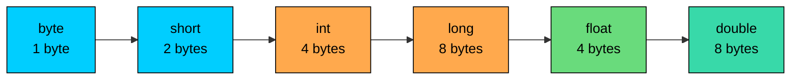

import React from 'react';
import CodeBlock from '../../../../components/ui/CodeBlock';
import Callout from '../../../../components/ui/Callout';

<div className="article-header">
  <div className="breadcrumb">
    <a href="/">Curated Notes</a>
    <span className="breadcrumb-separator">›</span>
    <span className="breadcrumb-current">Type Casting</span>
  </div>
  <h1>Type Casting</h1>
  <p style={{ color: 'var(--text-muted)', fontSize: '1.1rem', marginBottom: '16px', lineHeight: '1.6' }}>
    Master the essentials of Type Casting in this curated guide.
  </p>
  <div className="meta-info">
    <span className="meta-item">
      <svg width="14" height="14" viewBox="0 0 24 24" fill="none" stroke="currentColor" strokeWidth="2"><circle cx="12" cy="12" r="10"/><polyline points="12 6 12 12 16 14"/></svg>
      10 min read
    </span>
    <span className="difficulty-badge difficulty-badge--intermediate">Intermediate</span>
  </div>
</div>

<section className="content-section">

Java is strict about types. A value with one type doesn't automatically become another type unless the conversion is safe, and when it isn't safe, an explicit cast is required. This lesson covers how the two kinds of conversion work between primitive types, why Java forces explicit casts for lossy conversions, and the small handful of arithmetic rules to watch for. The lesson closes with a brief look at casting between reference types so the term `(String) something` isn't a mystery on first sight.

---

## Two Kinds of Conversion

There are exactly two ways one primitive type turns into another in Java:

- **Widening conversion:** a smaller type fits into a bigger type. Java handles this automatically with no syntax. No information is lost.
- **Narrowing conversion:** a bigger type has to be squeezed into a smaller type. Java refuses to do this silently because data can be lost. An explicit cast is the way to tell the compiler "yes, I know, do it anyway."

The compiler enforces this split because dropping precision or wrapping a number around without warning is a common bug. Widening is always safe, so it happens automatically. Narrowing is sometimes safe and sometimes a disaster, so the compiler hands the responsibility back to the developer.

The same idea in table form:


| Kind | Direction | Cast needed? | Data loss possible? | Example |
|------|-----------|--------------|---------------------|---------|
| Widening | small to big | No | No | `int orderCount = 5; long total = orderCount;` |
| Narrowing | big to small | Yes | Yes | `double subtotal = 89.95; int rounded = (int) subtotal;` |


The next few sections unpack both directions.

---

## Widening: The Free Conversion

A widening conversion takes a value of a smaller type and stores it in a variable of a bigger type. Every value that fits in the smaller type also fits in the bigger one, so nothing has to be dropped. Java performs the conversion automatically.


```java
public class WideningOrderCount {
    public static void main(String[] args) {
        int orderCount = 250;
        long totalOrders = orderCount;   // int widens to long, no cast needed
        double averageRating = orderCount; // int widens to double, no cast needed

        System.out.println("Order count: " + orderCount);
        System.out.println("Total orders (long): " + totalOrders);
        System.out.println("Average rating slot (double): " + averageRating);
    }
}
```


The last line: `250` printed as `250.0`. The value didn't change, but the type did. A `double` always has a decimal part, so Java tacks on `.0` when it widens an integer.

The full chain of widening conversions for numeric types runs from `byte` all the way up to `double`. Anything earlier in the chain widens automatically to anything later.





A `byte` widens to a `short`, an `int`, a `long`, a `float`, or a `double`. A `long` widens to a `float` or a `double`. The chain is one-way: nothing later in the chain widens to something earlier.

One thing that looks odd at first: `long` widens to `float`, even though a `long` is 8 bytes and a `float` is only 4 bytes. The conversion is still classified as widening because `float` can represent numbers far larger than any `long`. What it can't always do is represent them exactly. A very large `long` might land on the nearest `float` value, losing a little precision in the last digits. The compiler still treats this as widening and allows it without a cast.

---

## Narrowing: When You Need a Cast

Narrowing is the other direction: a bigger type squeezed into a smaller one. The bigger type can hold values the smaller one cannot, so the conversion can lose data. Java refuses to do this automatically; a cast is required.

The syntax is simple: put the target type in parentheses in front of the value to convert.


```java
public class NarrowingSubtotal {
    public static void main(String[] args) {
        double subtotal = 89.95;
        int wholeDollars = (int) subtotal;   // double to int, decimal chopped off

        long bigCount = 5_000_000_000L;
        int truncatedCount = (int) bigCount; // long to int, value too big

        System.out.println("Subtotal: " + subtotal);
        System.out.println("Whole dollars: " + wholeDollars);
        System.out.println("Big count: " + bigCount);
        System.out.println("Truncated count: " + truncatedCount);
    }
}
```


Two different kinds of damage happened here, and both are worth understanding.

The first line, `(int) 89.95`, turned `89.95` into `89`. Casting a `double` to an `int` throws away the fractional part. It doesn't round. `89.95` becomes `89`, `89.99` becomes `89`, and `(int) 3.99` is `3`. For rounding, use `Math.round` explicitly.

The second cast, from a `long` value of 5 billion down to an `int`, gave back `705032704`, which has no obvious relationship to the original. An `int` only has 32 bits, and 5 billion needs more. When the value doesn't fit, Java keeps the low 32 bits and discards the rest. The result is whatever bit pattern those low 32 bits represent, interpreted as a signed `int`. The compiler doesn't warn, because the cast already declared this is the intended behavior.

A smaller example makes the wraparound easier to see:


```java
public class ByteWraparound {
    public static void main(String[] args) {
        int orderCount = 300;
        byte smallCount = (byte) orderCount;

        System.out.println("Original count: " + orderCount);
        System.out.println("As byte: " + smallCount);
    }
}
```


A `byte` holds values from -128 to 127. 300 is well outside that range. The cast keeps the low 8 bits of `300`, which work out to `44`. There's no error, no warning, just a wrong number. This is why Java forces the explicit cast: the compiler wants the developer to confirm this is the intended behavior.

Narrowing casts have no runtime overhead, but they have a real correctness cost. If the source value doesn't fit in the target type, the result is a wrong number. Check ranges before casting, or use `Math.toIntExact` for `long` to `int` conversions that should throw on overflow.

---

## Cast Syntax in One Place

A cast is one piece of syntax: `(targetType) value`. The parentheses go around the type, not the value. The cast applies to the single expression that follows it. Here's the same shape in a few contexts:


```java
public class CastSyntax {
    public static void main(String[] args) {
        double price = 12.5;
        int quantity = 3;

        int wholePrice = (int) price;             // cast a variable
        int total = (int) (price * quantity);     // cast the result of an expression
        long widePrice = (long) price;            // narrowing from double to long

        System.out.println("Whole price: " + wholePrice);
        System.out.println("Total: " + total);
        System.out.println("Wide price: " + widePrice);
    }
}
```


Look at the second line carefully: `(int) (price * quantity)`. The cast applies only to the result of `price * quantity`, because the parentheses make the multiplication happen first. Without those inner parentheses, `(int) price * quantity` would cast `price` to `int` first (turning `12.5` into `12`), then multiply by `3`, giving `36` instead of `37`. The placement of parentheses matters.

---

## `char` and `int` Convert Both Ways

`char` is an integer type in Java. It holds a 16-bit unsigned number that represents a character code. Because it's a number internally, it widens to `int` automatically, and an `int` can be cast back to a `char`.


```java
public class CharIntConversion {
    public static void main(String[] args) {
        char letter = 'A';
        int code = letter;          // char widens to int, no cast
        int next = letter + 1;      // 'A' + 1 is arithmetic on ints

        char nextLetter = (char) next; // narrowing back to char requires a cast

        System.out.println("Letter: " + letter);
        System.out.println("Code: " + code);
        System.out.println("Next code: " + next);
        System.out.println("Next letter: " + nextLetter);
    }
}
```


`'A'` has the character code `65`. The line `int code = letter;` widens the `char` to an `int`, so `code` is `65`. The expression `'A' + 1` is `65 + 1`, which is `66`, also an `int`. Getting back to a `char` requires a cast: `(char) 66` is `'B'`. This is the standard way to walk through an alphabet of category codes or shift letters by a fixed amount.

---

## Mixed-Type Arithmetic Promotes Operands

When types mix in an arithmetic expression, Java picks a single type to do the math in. The rules are predictable:

- If either operand is a `double`, both are promoted to `double`.
- Otherwise, if either operand is a `float`, both are promoted to `float`.
- Otherwise, if either operand is a `long`, both are promoted to `long`.
- Otherwise, both operands are promoted to `int`.

If two `byte` values or two `short` values are added, the result is an `int`, not a `byte` or a `short`. Java promotes anything smaller than `int` up to `int` before doing arithmetic.


```java
public class MixedArithmetic {
    public static void main(String[] args) {
        int quantity = 4;
        double price = 19.99;
        double cartTotal = price * quantity;   // int promoted to double

        long bigOrders = 10_000_000_000L;
        int recentOrders = 50;
        long combined = bigOrders + recentOrders; // int promoted to long

        byte itemA = 10;
        byte itemB = 20;
        // byte sum = itemA + itemB; // does not compile, result is int
        int itemSum = itemA + itemB;

        System.out.println("Cart total: " + cartTotal);
        System.out.println("Combined orders: " + combined);
        System.out.println("Item sum: " + itemSum);
    }
}
```


The commented-out line is the case to note. `itemA` and `itemB` are both `byte`. Their sum is mathematically `30`, which fits in a `byte`. But Java promoted both to `int` before adding, so the result has type `int`, and the assignment to a `byte` is a narrowing conversion that requires a cast:


```java
byte itemA = 10;
byte itemB = 20;
byte itemSum = (byte) (itemA + itemB); // works with an explicit cast
```


This rule exists because the JVM does all its integer arithmetic at `int` width or wider. Promoting smaller types to `int` keeps the bytecode simple. The trade-off is that arithmetic on `byte` and `short` keeps producing `int` results, and casts are needed to push them back down.

---

## The Compound Assignment Shortcut

The compound assignment operators (`+=`, `-=`, `*=`, `/=`, `%=`) have a small but useful quirk: they perform an implicit narrowing cast back to the variable's type. The version below compiles even though the equivalent long-form does not.


```java
public class CompoundAssignment {
    public static void main(String[] args) {
        byte itemsInCart = 10;
        itemsInCart += 5;          // compiles, implicit cast back to byte
        // itemsInCart = itemsInCart + 5; // does not compile

        System.out.println("Items in cart: " + itemsInCart);
    }
}
```


The line `itemsInCart += 5;` is effectively `itemsInCart = (byte) (itemsInCart + 5);`. The compiler inserts the cast automatically. The expanded form `itemsInCart = itemsInCart + 5;` does not get that free cast, so it fails to compile with the same "incompatible types" error as any other narrowing without a cast.

This shortcut is handy, but it has the same data-loss risk as any other narrowing. `byte total = 120; total += 50;` wraps to `-86`, because `170` doesn't fit in a `byte`. The implicit cast doesn't change the math; it just skips writing the cast.

---

## Reference Casting at a Glance

Everything above is about primitive types. Reference types (objects) can also be cast, but the rules are different and the topic deserves its own treatment.

The short version: a reference of a parent type that actually points to an object of a more specific child type can be cast down to the child type to use the child's features. The most common case is `Object` holding a `String`:


```java
public class ReferenceCastPreview {
    public static void main(String[] args) {
        Object stored = "wireless-headphones";
        String productId = (String) stored;   // reference cast

        System.out.println("Length: " + productId.length());
    }
}
```


The cast doesn't change the object; it changes how the compiler sees the reference. If the object pointed to isn't really a `String`, the cast throws `ClassCastException` at runtime. There's no truncation here, just a clean failure when the assumption is wrong.

For now, the syntax `(String) someObject` exists, it looks like a primitive cast, and it does something different internally.

</section>
