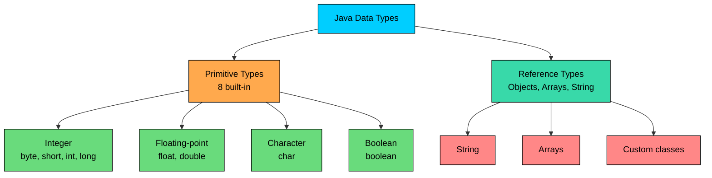

import React from 'react';
import CodeBlock from '../../../../components/ui/CodeBlock';
import Callout from '../../../../components/ui/Callout';

<div className="article-header">
  <div className="breadcrumb">
    <a href="/">Curated Notes</a>
    <span className="breadcrumb-separator">›</span>
    <span className="breadcrumb-current">Variables & Data Types</span>
  </div>
  <h1>Variables & Data Types</h1>
  <p style={{ color: 'var(--text-muted)', fontSize: '1.1rem', marginBottom: '16px', lineHeight: '1.6' }}>
    Master the essentials of Variables & Data Types in this curated guide.
  </p>
  <div className="meta-info">
    <span className="meta-item">
      <svg width="14" height="14" viewBox="0 0 24 24" fill="none" stroke="currentColor" strokeWidth="2"><circle cx="12" cy="12" r="10"/><polyline points="12 6 12 12 16 14"/></svg>
      10 min read
    </span>
    <span className="difficulty-badge difficulty-badge--intermediate">Intermediate</span>
  </div>
</div>

<section className="content-section">

Every program needs a way to remember things: the price of a product, the number of items in a cart, whether an order has shipped. In Java, those pieces of remembered data live in variables, and every variable has a type that decides what kind of value it can hold. This lesson covers the basics of declaring variables, assigning values to them, and the broad shape of Java's type system.

---

## What a Variable Is

A variable is a named slot in memory that holds a value. You give the slot a name, you tell Java what type of value goes in it, and from then on you can read from it or write to it by name.

Here's the smallest useful example:


```java
public class ProductPrice {
    public static void main(String[] args) {
        int stockCount = 12;
        System.out.println("Items in stock: " + stockCount);
    }
}
```


`stockCount` is the variable. It has type `int` (an integer), and it currently holds the value `12`. When we use the name `stockCount` later in the program, Java looks up whatever value is in that slot and uses it.

A variable has three things tied together:

- A **name** you choose, like `stockCount` or `cartTotal`.
- A **type** that fixes the shape of values it can hold, like `int` or `String`.
- A **value** stored in it right now, which can change over time as the program runs.

Once you've declared a variable's type, that type is locked in. You can change the value, but you can't change the type.

---

## Declaring and Initializing Variables

The basic syntax for a variable declaration is:


```shell
type name;
type name = value;
```


The first form declares a variable without giving it a value yet. The second form declares it and assigns it a value in the same line, which is called initialization.


```java
public class ProductInfo {
    public static void main(String[] args) {
        int stockCount;         // declared, no value yet
        stockCount = 50;        // assigned a value

        double price = 29.99;   // declared and initialized in one step
        String productName = "Wireless Headphones";

        System.out.println(productName + " - $" + price + " (" + stockCount + " in stock)");
    }
}
```


The line `int stockCount;` just reserves the slot. The next line `stockCount = 50;` puts a value into it. The line `double price = 29.99;` does both at once.

You can declare multiple variables of the same type on one line, separated by commas:


```java
public class MultiDeclare {
    public static void main(String[] args) {
        int stockCount = 50, reorderLevel = 10, soldToday = 7;
        System.out.println("Stock: " + stockCount + ", Reorder at: " + reorderLevel + ", Sold today: " + soldToday);
    }
}
```


That's a shortcut, not a different feature. It's the same as writing three separate lines. Most code uses one variable per line because it reads better and makes diffs cleaner when only one of them changes.

---

## Assignment vs Initialization, and Default Values

One distinction matters here.

- **Initialization** is the first time a variable gets a value, usually at declaration: `int stockCount = 50;`.
- **Assignment** is any time you put a value into a variable, whether it's the first time or the tenth: `stockCount = 42;`.

So initialization is one specific kind of assignment. The reason to keep them separate in your head is that Java treats uninitialized local variables strictly.

A **local variable** is a variable declared inside a method (like inside `main`). Java will not let you read a local variable before it has been assigned a value. The compiler refuses to compile code that does this.

**What's wrong with this code?**


```java
public class UnassignedRead {
    public static void main(String[] args) {
        int cartTotal;
        System.out.println("Total: " + cartTotal);
    }
}
```


The compiler rejects it with an error like:


```shell
UnassignedRead.java:4: error: variable cartTotal might not have been initialized
        System.out.println("Total: " + cartTotal);
                                       ^
```


**Fix:** Give the variable a value before you read it.


```java
public class UnassignedRead {
    public static void main(String[] args) {
        int cartTotal = 0;
        System.out.println("Total: " + cartTotal);
    }
}
```


This rule applies only to local variables. Fields declared inside a class (but outside any method) get **default values** automatically: numeric types start at `0`, `boolean` starts at `false`, and reference types start at `null`. For now, the takeaway is: inside a method, always assign a value before you read.

---

## Java Is Statically Typed

Java is a **statically typed** language. That means the type of every variable is decided at the moment you declare it, and the compiler checks every read and write against that type. You cannot change a variable's type after declaration, and you cannot store a value of one type in a variable of another type without an explicit conversion.

**What's wrong with this code?**


```java
public class WrongType {
    public static void main(String[] args) {
        int stockCount = 50;
        stockCount = "fifty";
        System.out.println(stockCount);
    }
}
```


The compiler reports:


```shell
WrongType.java:4: error: incompatible types: String cannot be converted to int
        stockCount = "fifty";
                     ^
```


**Fix:** Either keep the variable an `int` and assign a number, or declare it as a `String` from the start:


```java
public class CorrectType {
    public static void main(String[] args) {
        String stockLabel = "fifty";
        int stockCount = 50;
        System.out.println(stockLabel + " = " + stockCount);
    }
}
```


The compiler catches type mistakes before your program ever runs. That trade-off (more rules up front, fewer surprises later) is part of why Java code tends to fail loudly at compile time rather than silently at run time.

---

## Java's Data Types at a Glance

Java's types come in two big buckets: **primitive types** and **reference types**.





The diagram shows the overall shape. Primitives hold a raw value directly, like a number or a single character. Reference types are objects, and variables of those types hold a reference to where the object lives in memory.

#### The 8 Primitive Types

Java has exactly 8 primitive types.


| Type      | Holds                                | Example literal      |
| --------- | ------------------------------------ | -------------------- |
| `byte`    | Whole numbers, very small range      | `byte tier = 1;`     |
| `short`   | Whole numbers, small range           | `short year = 2025;` |
| `int`     | Whole numbers, common default        | `int stock = 500;`   |
| `long`    | Whole numbers, very large range      | `long views = 9_000_000_000L;` |
| `float`   | Decimals, less precision             | `float rating = 4.5f;` |
| `double`  | Decimals, common default             | `double price = 29.99;` |
| `char`    | A single character                   | `char grade = 'A';`  |
| `boolean` | `true` or `false`                    | `boolean inStock = true;` |


For now, just know there are 8 of them and what each one is for.

#### Reference Types

Anything that isn't a primitive is a reference type. The most common ones you'll meet early are:

- **`String`** for text: `String customerName = "Alex";`
- **Arrays** for fixed-size sequences: `int[] dailySales = new int[7];`
- **Custom classes** you write yourself, or that come from libraries.


```java
public class CustomerSummary {
    public static void main(String[] args) {
        String customerName = "Alex";
        int orderCount = 5;
        double totalSpent = 249.95;
        boolean isPrimeMember = true;

        System.out.println(customerName + " has " + orderCount + " orders, totaling $" + totalSpent);
        System.out.println("Prime member: " + isPrimeMember);
    }
}
```


`customerName` is a reference to a `String` object. The other three are primitive values stored directly in the variable. From the outside, that distinction is invisible here, but it matters once you start passing variables to methods and comparing them.

---

## A Quick Note on `var`

Since Java 10, you can let the compiler figure out the type of a local variable for you, using the keyword `var`:


```java
public class VarExample {
    public static void main(String[] args) {
        var stockCount = 50;          // compiler infers int
        var price = 29.99;            // compiler infers double
        var productName = "Headphones"; // compiler infers String

        System.out.println(productName + " - $" + price + " (" + stockCount + " in stock)");
    }
}
```


`var` doesn't make Java dynamically typed. The compiler picks a type at the point of declaration and locks it in, just as if you'd written it out. `var stockCount = 50;` is identical to `int stockCount = 50;` in every way that matters.

`var` is convenient when the type on the right side is long or obvious.

---

## Scope: Where a Variable Is Visible

A variable is only visible inside the **block** it was declared in. A block is anything between a pair of curly braces `{ }`. Once you leave the block, the variable is gone.


```java
public class ScopeExample {
    public static void main(String[] args) {
        int cartItems = 3;

        if (cartItems > 0) {
            int discount = 10;
            System.out.println("Discount applied: " + discount + "%");
        }

        // discount is not visible here
        System.out.println("Items in cart: " + cartItems);
    }
}
```


`cartItems` is declared inside `main`, so it's visible everywhere in `main`. `discount` is declared inside the `if` block, so it's only visible inside that block. Trying to use `discount` after the closing brace of the `if` produces a compile error: the compiler doesn't know what `discount` is anymore.

This is a deliberately light look at scope. Methods, classes, and nested scopes all have their own rules.

---

## Constants with `final`

Sometimes you want a variable that gets assigned once and then never changes: a tax rate, a maximum cart size, a fixed shipping fee. Java lets you mark such a variable with the keyword `final`. Once a `final` variable has been assigned, any attempt to change it is a compile error.


```java
public class TaxCalculator {
    public static void main(String[] args) {
        final double TAX_RATE = 0.08;
        double cartTotal = 50.00;

        double tax = cartTotal * TAX_RATE;
        double grandTotal = cartTotal + tax;

        System.out.println("Cart total: $" + cartTotal);
        System.out.println("Tax: $" + tax);
        System.out.println("Grand total: $" + grandTotal);
    }
}
```


If you later wrote `TAX_RATE = 0.10;`, the compiler would reject it with `cannot assign a value to final variable TAX_RATE`. By convention, constants like this are named in `UPPER_SNAKE_CASE` so they stand out from regular variables.

`final` does more than just make a local variable constant. It applies to fields, method parameters, classes, and methods, each with its own implications. For now, treat `final` as the way you mark a value that shouldn't change.

</section>
