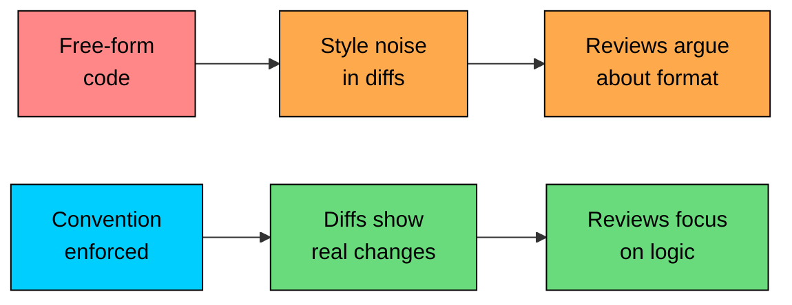
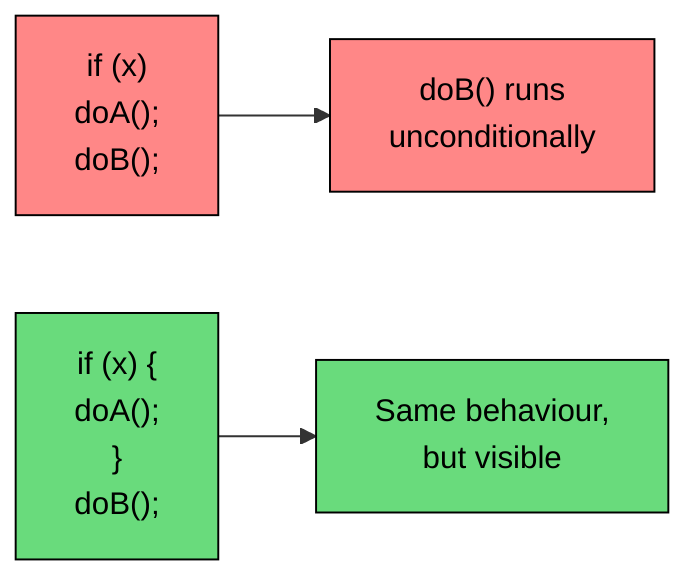
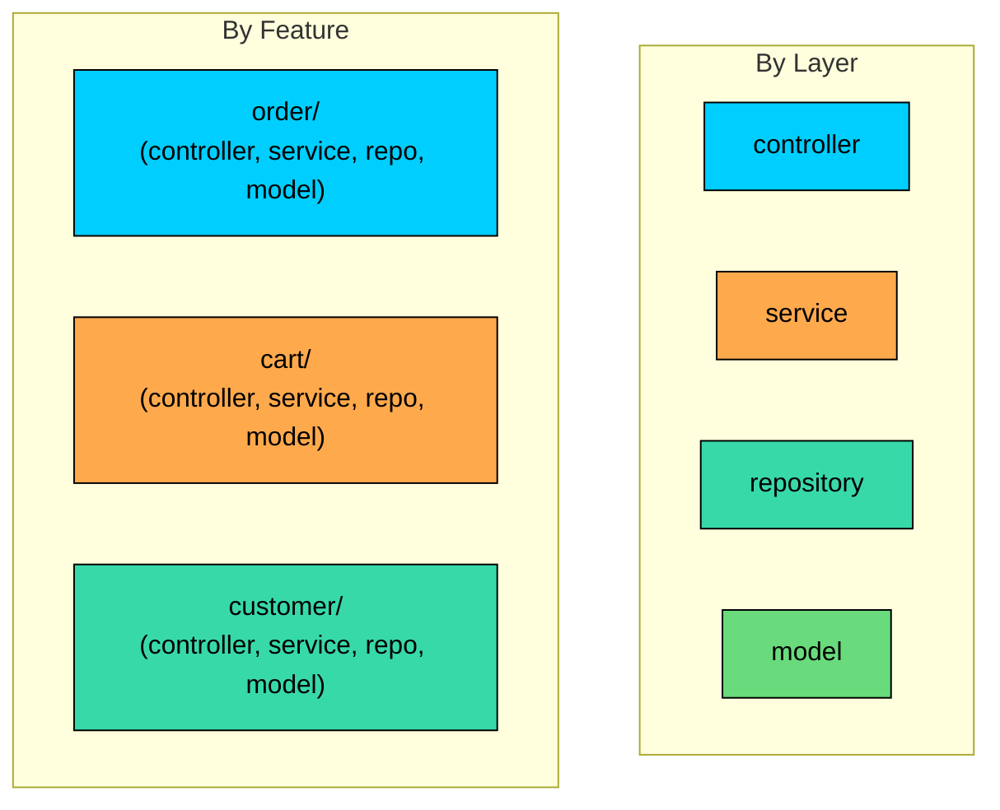
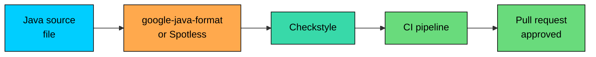

import React from 'react';
import CodeBlock from '../../../../components/ui/CodeBlock';
import Callout from '../../../../components/ui/Callout';

<div className="article-header">
  <div className="breadcrumb">
    <a href="/">Curated Notes</a>
    <span className="breadcrumb-separator">›</span>
    <span className="breadcrumb-current">Coding Standards</span>
  </div>
  <h1>Coding Standards</h1>
  <p style={{ color: 'var(--text-muted)', fontSize: '1.1rem', marginBottom: '16px', lineHeight: '1.6' }}>
    Master the essentials of Coding Standards in this curated guide.
  </p>
  <div className="meta-info">
    <span className="meta-item">
      <svg width="14" height="14" viewBox="0 0 24 24" fill="none" stroke="currentColor" strokeWidth="2"><circle cx="12" cy="12" r="10"/><polyline points="12 6 12 12 16 14"/></svg>
      10 min read
    </span>
    <span className="difficulty-badge difficulty-badge--intermediate">Intermediate</span>
  </div>
</div>

<section className="content-section">

Coding standards are the boring agreements that make a Java codebase readable to anyone who joins it. They decide how class names are spelled, where braces go, which imports are allowed, and how files are arranged on disk. This lesson covers the conventions the Java community has settled on over twenty-five years: the Oracle Code Conventions, the Google Java Style Guide, and the small rules the compiler itself enforces. None of these are about cleverness or design. They lower the cost for the next person to read the code.

---

## Why Conventions Matter

A codebase that follows one consistent style reads like a single voice. A codebase where every author picks their own bracing, naming, and ordering reads like a noisy room. The compiler doesn't care. The reader does, and the reader is what these rules optimize for.

Two specific payoffs come up over and over. First, diffs stay small. If two developers format a file differently, every line they touch shows up as a churned line in the history, hiding the real change. Second, code review focuses on logic instead of style. Nobody wants to spend ten minutes arguing whether `Order` should sit above `Customer` in the imports when an automated formatter could have answered it.





The diagram shows the two paths. The top path is what happens without a shared style. The bottom path is what a project gets once the conventions are agreed and automated. The work this lesson covers is what makes the bottom path possible.

Two style guides matter for Java. Oracle's original "Code Conventions for the Java Programming Language" was published in 1997 and remains the reference for the standard library itself. Google's Java Style Guide is newer, more opinionated, and has become the default for most modern projects. The two agree on almost everything. Where they differ, this lesson points it out, and the team can pick what fits.

---

## Naming: The Five Cases You'll Use

Java uses five distinct naming cases, and the case signals what kind of thing the reader is looking at before they read a single character. Getting it wrong makes the eye trip; getting it right makes the code read like English.


| Element | Convention | Example |
| --- | --- | --- |
| Class, interface, enum, record | `UpperCamelCase` | `OrderRepository`, `Cart`, `CustomerStatus` |
| Method | `lowerCamelCase` | `addItem`, `calculateTotal`, `findById` |
| Variable, field, parameter | `lowerCamelCase` | `cartTotal`, `customerName`, `unitPrice` |
| Constant (`static final`) | `UPPER_SNAKE_CASE` | `MAX_CART_SIZE`, `DEFAULT_TAX_RATE` |
| Package | `lowercase.with.dots` | `com.algomaster.shop.cart` |


Take each one in turn, because there are rules inside the cases that matter.

#### Classes and Interfaces

Class names are nouns: `Order`, `Customer`, `Cart`, `Wishlist`. Interface names are usually nouns too (`Repository`, `Comparable`) or adjectives ending in `-able` when they describe a capability (`Iterable`, `Runnable`, `Closeable`). Don't prefix interfaces with `I` (`ICart`); that's a C# convention, and Java code doesn't use it.

Acronyms get treated as single words. The Oracle convention writes `HttpClient` and `XmlParser`, not `HTTPClient` or `XMLParser`. The Google guide is stricter on this: any acronym longer than two letters becomes camelCase, so `parseHtml` instead of `parseHTML`, and `Url` instead of `URL` in a class name like `UrlBuilder`. Pick one rule and apply it everywhere.


```java
public class OrderRepository {
    public Order findById(String orderId) {
        return new Order(orderId);
    }

    public static void main(String[] args) {
        OrderRepository repo = new OrderRepository();
        System.out.println("Loaded: " + repo.findById("ORD-1001"));
    }
}

class Order {
    private final String id;

    public Order(String id) {
        this.id = id;
    }

    @Override
    public String toString() {
        return "Order[" + id + "]";
    }
}
```


The class names are nouns. Each word starts with a capital. The acronym `Id` in `findById` is treated as a single word with only its first letter capitalized, which matches both major style guides.

#### Methods

Method names start with a verb that describes what the method does: `addItem`, `calculateTotal`, `findById`, `isInStock`, `save`. Boolean-returning methods usually start with `is`, `has`, `can`, or `should`: `isExpired`, `hasDiscount`, `canShipTo`. Getter methods follow the JavaBeans convention: `getCustomerName`, `getCartTotal`, `getProducts`. Setters mirror them: `setCustomerName`, `setCartTotal`.

There is one boolean naming exception. Methods that return a `boolean` and read naturally as a question can drop the `get` prefix entirely. `isEmpty()` is better than `getIsEmpty()`. The JDK itself uses both `getName()` and `isActive()`, depending on which sounds more natural in English.


```java
public class Cart {
    private final java.util.List<String> items = new java.util.ArrayList<>();

    public void addItem(String productName) {
        items.add(productName);
    }

    public int getItemCount() {
        return items.size();
    }

    public boolean isEmpty() {
        return items.isEmpty();
    }

    public static void main(String[] args) {
        Cart cart = new Cart();
        System.out.println("Empty? " + cart.isEmpty());
        cart.addItem("Headphones");
        cart.addItem("Cable");
        System.out.println("Items: " + cart.getItemCount() + ", empty? " + cart.isEmpty());
    }
}
```


The three methods illustrate the three patterns: a verb-first action (`addItem`), a `get`-prefixed accessor (`getItemCount`), and a boolean question (`isEmpty`).

#### Variables and Fields

Local variables, fields, and parameters all use `lowerCamelCase`. Names should describe what the value represents, not its type: `customerName` is better than `nameString`, `cartTotal` is better than `totalDouble`. The Hungarian-style prefixes from older C++ code (`strName`, `iCount`) are not used in Java.

One short-name habit is allowed and even encouraged: loop indices and very-short-lived local variables can use single letters. `i`, `j`, `k` for loop indices. `e` for an exception in a catch block. `t` for a `Throwable`. `x`, `y` for coordinates. Beyond those handful of cases, spell out what the variable means.


```java
public class CheckoutPreview {
    public static void main(String[] args) {
        double[] prices = {19.99, 29.99, 9.99};
        int quantity = 1;
        double cartTotal = 0.0;

        for (int i = 0; i < prices.length; i++) {
            cartTotal += prices[i] * quantity;
        }

        System.out.println("Cart total: $" + cartTotal);
    }
}
```


`prices`, `quantity`, and `cartTotal` are descriptive. `i` is a one-line index used and forgotten inside a tight loop, which is the case where a single letter is fine.

#### Constants

A "constant" in Java means a `static final` field whose value is set once and never changes. Constants use `UPPER_SNAKE_CASE`: `MAX_CART_SIZE`, `DEFAULT_TAX_RATE`, `FREE_SHIPPING_THRESHOLD`. The all-caps form makes them stand out in code: `TAX_RATE` instead of `taxRate` signals a class-level constant, not a local variable that might change.

Note one nuance. A `final` local variable is not a constant in this sense and uses normal `lowerCamelCase`. The all-caps rule applies only to `static final` fields, where "static" means the value belongs to the class and "final" means it can't be reassigned.


```java
public class TaxCalculator {
    private static final double DEFAULT_TAX_RATE = 0.08;
    private static final double FREE_SHIPPING_THRESHOLD = 50.00;

    public static double calculateTax(double subtotal) {
        return subtotal * DEFAULT_TAX_RATE;
    }

    public static boolean qualifiesForFreeShipping(double subtotal) {
        return subtotal >= FREE_SHIPPING_THRESHOLD;
    }

    public static void main(String[] args) {
        double subtotal = 75.00;
        double tax = calculateTax(subtotal);
        System.out.println("Subtotal: $" + subtotal);
        System.out.println("Tax: $" + tax);
        System.out.println("Free shipping? " + qualifiesForFreeShipping(subtotal));
    }
}
```


`DEFAULT_TAX_RATE` and `FREE_SHIPPING_THRESHOLD` are clearly class-level values. A reader spots them immediately, separate from the local `subtotal` and `tax`.

#### Packages

Packages use all-lowercase reverse-domain names: `com.algomaster.shop.cart`, `org.springframework.boot.actuator`. The lowercase rule has no exceptions: no camelCase, no underscores, no digits as the first character of any segment. The reverse-domain part anchors the package to an organization, which prevents collisions when two libraries pick the same short name like `util` or `core`.

When the project doesn't have a domain, conventional placeholders are `com.example.{project}` for prototypes or `io.github.{username}.{project}` for open-source code hosted on GitHub. The exact prefix matters less than the discipline of using the same one across the codebase.

Three more rules apply once the prefix is decided. Each package segment should be a single word: `cart`, not `shopping_cart` or `shoppingCart`. Avoid Java reserved words as segments (no `package com.example.new`). And don't use plurals inconsistently: pick `com.algomaster.shop.order` or `com.algomaster.shop.orders` and use the same form everywhere in the project.

---

## File and Class Structure

Java has one rule that is enforced by the compiler, not by style guides: **a `.java` file can contain at most one `public` top-level class, and its name must match the file name.** A file named `Order.java` can contain `public class Order` and nothing else `public` at the top level. The compiler will refuse to compile a file where this is wrong.


```shell
src/
  main/
    java/
      com/
        algomaster/
          shop/
            cart/
              Cart.java          // public class Cart
              CartItem.java      // public class CartItem
            order/
              Order.java         // public class Order
              OrderStatus.java   // public enum OrderStatus
```


The directory path mirrors the package name. A class declared in package `com.algomaster.shop.cart` lives at `com/algomaster/shop/cart/` under the source root. The build tool (Maven, Gradle) walks the directory tree to find sources, and it expects the structure to match. Putting a class in the wrong directory produces a compiler error.

Non-public classes (package-private, the default) can be declared alongside the public one in the same file, but most teams avoid this. The convention is one public top-level class per file, and helper types either live in their own files or as nested classes inside the public one. The reason is searchability: grepping for `class Foo` should find the file `Foo.java`, not a random helper buried inside `Bar.java`.


```java
// File: Cart.java
package com.algomaster.shop.cart;

import java.util.ArrayList;
import java.util.List;

public class Cart {
    private final List<CartItem> items = new ArrayList<>();

    public void addItem(CartItem item) {
        items.add(item);
    }

    public double getTotal() {
        double total = 0;
        for (CartItem item : items) {
            total += item.getLineTotal();
        }
        return total;
    }

    public static void main(String[] args) {
        Cart cart = new Cart();
        cart.addItem(new CartItem("Headphones", 49.99, 2));
        cart.addItem(new CartItem("Cable", 9.99, 1));
        System.out.printf("Cart total: $%.2f%n", cart.getTotal());
    }
}

// File: CartItem.java (separate file, in real code)
class CartItem {
    private final String productName;
    private final double unitPrice;
    private final int quantity;

    public CartItem(String productName, double unitPrice, int quantity) {
        this.productName = productName;
        this.unitPrice = unitPrice;
        this.quantity = quantity;
    }

    public double getLineTotal() {
        return unitPrice * quantity;
    }
}
```


In a real project, `CartItem` would live in its own file `CartItem.java`. The example merges them here only so the code runs in a single block; production code splits them.

The one-class-per-file rule is enforced by the compiler, not by performance. The same rule applies whether your project has ten files or ten thousand.

---

## Source File Organization

Every `.java` file follows the same internal structure, in this order:

1. License or copyright header (optional, but if present, at the top)
2. `package` declaration
3. Import statements
4. Exactly one top-level class, interface, enum, or record

The order is strict because the compiler reads the file top-down. The `package` line must come first because it defines the namespace. Imports must come before the class because they tell the compiler which short names to resolve. The class itself is what the file is named for.


```java
/*
 * Copyright 2026 AlgoMaster. All rights reserved.
 */
package com.algomaster.shop.order;

import java.time.LocalDateTime;
import java.util.ArrayList;
import java.util.List;

import com.algomaster.shop.cart.Cart;
import com.algomaster.shop.customer.Customer;

public class Order {
    private final String orderId;
    private final Customer customer;
    private final List<String> productNames;
    private final LocalDateTime placedAt;

    public Order(String orderId, Customer customer) {
        this.orderId = orderId;
        this.customer = customer;
        this.productNames = new ArrayList<>();
        this.placedAt = LocalDateTime.now();
    }

    public void addProduct(String name) {
        productNames.add(name);
    }

    public String summary() {
        return "Order " + orderId + " for " + customer.getName()
            + " with " + productNames.size() + " items, placed at " + placedAt;
    }
}
```


The file structure is the same in every Java file. Once the order is familiar, the eye goes straight to the content.

Inside the class, members are ordered for readability:


| Order | Member type | Why |
| --- | --- | --- |
| 1 | Constants (`static final`) | Visible at the top, often referenced by everything below |
| 2 | Static fields | Class-level state |
| 3 | Instance fields | Per-object state, the "shape" of the class |
| 4 | Constructors | How the object is built |
| 5 | Public methods | The API the rest of the code uses |
| 6 | Protected and package-private methods | Internal collaboration points |
| 7 | Private methods | Helpers, ordered roughly by who calls them |
| 8 | Nested types (inner classes, enums) | Supporting types tied to this class |


This ordering puts the most-used parts at the top. A reader scanning the file sees the public API first, then the implementation. The pattern is convention, not compiler-enforced, but every major Java codebase follows some version of it.

---

## Imports: What to Allow, What to Forbid

The `import` statement tells the compiler which fully qualified names to use under their short names. Two rules apply across the community.

**First, no wildcard imports.** A wildcard import looks like `import java.util.*;` and pulls in every public class from `java.util`. The trouble is twofold. New classes added to a package in future JDK releases can suddenly shadow existing classes. And the imports stop telling the reader what the file actually depends on. Almost every modern style guide bans wildcards. The Google style guide forbids them outright; the Oracle guide allows them but recommends against them.


```java
// Bad: wildcard import
import java.util.*;

// Good: explicit imports
import java.util.ArrayList;
import java.util.HashMap;
import java.util.List;
import java.util.Map;
```


The good version takes a few more lines but tells the reader exactly which types the file uses. Modern IDEs add and remove imports automatically as code is typed, so the verbosity has zero cost in editing time.

**Second, imports are grouped and ordered.** The Google Java Style Guide specifies the canonical ordering:

1. Static imports, in a single group, sorted alphabetically.
2. Non-static imports, in a single group, sorted alphabetically.

A blank line separates the two groups. Inside each group, imports are sorted in ASCII order (which, for typical package names, is the same as alphabetical). The Oracle guide is looser, but most teams adopt the Google ordering because automated tools enforce it cleanly.


```java
package com.algomaster.shop.cart;

import static java.lang.Math.max;
import static java.lang.Math.min;

import java.util.ArrayList;
import java.util.List;

import com.algomaster.shop.product.Product;

public class CartCalculator {
    private final List<Product> products = new ArrayList<>();

    public double clampQuantity(int requested, int available) {
        return max(0, min(requested, available));
    }

    public static void main(String[] args) {
        CartCalculator calc = new CartCalculator();
        System.out.println("Clamp 5 to [0, 3]: " + calc.clampQuantity(5, 3));
    }
}
```


Static imports go at the top, then a blank line, then regular imports sorted alphabetically. The file declares exactly what it uses, nothing more.

A third minor rule: don't import classes from the same package, and don't import from `java.lang`. Both are imported implicitly. Writing `import com.algomaster.shop.cart.Cart;` from inside `com.algomaster.shop.cart.CartItem` is redundant noise.

---

## Indentation, Braces, and Line Length

The visual layout of code is governed by three numbers and one bracing rule.

**Indentation: four spaces per level.** Both Oracle and Google specify four spaces, no tabs. The tab-versus-spaces debate is settled for Java code: use spaces. Most IDEs are configured this way out of the box, and any decent formatter enforces it automatically. Mixing tabs and spaces in the same file is a recipe for diffs that look terrible in tools that interpret tab width differently.

**Line length: 100 columns (Google) or 80 columns (Oracle).** The Google limit of 100 is the modern default, partly because screens are wider than they were in 1997. Lines longer than the limit get wrapped to the next line, indented one extra level (eight spaces in instead of four) to signal the continuation.

**Brace style: K&R, also called "Egyptian brackets".** The opening brace goes at the end of the line that starts the block, not on its own line. The closing brace gets its own line, aligned with the start of the block.


```java
// Good: K&R braces
public class OrderProcessor {
    public void process(Order order) {
        if (order.isReady()) {
            ship(order);
        } else {
            queue(order);
        }
    }

    private void ship(Order order) {
        // ...
    }

    private void queue(Order order) {
        // ...
    }
}
```


```java
// Bad: Allman-style braces (used in C# and some C++ code, not Java)
public class OrderProcessor
{
    public void process(Order order)
    {
        if (order.isReady())
        {
            ship(order);
        }
    }
}
```


The Allman style is not wrong by any objective measure, but it's not Java's convention. A Java codebase that uses Allman bracing reads as foreign to anyone coming from the rest of the ecosystem. Pick K&R and use it everywhere.

**Always use braces, even for single-statement blocks.** Both major style guides require this, and the reason is a famous class of bug:


```java
// Bad: no braces
if (cart.isEmpty())
    return;
    cart.charge();
```


The indentation suggests `cart.charge()` is inside the `if`. The code says otherwise: only `return;` is conditional. `cart.charge()` runs unconditionally, even when the cart is empty. The braced version makes the intent unambiguous:


```java
// Good
if (cart.isEmpty()) {
    return;
}
cart.charge();
```


The braces cost one character. They prevent a common bug class in C-family languages, the same one that produced Apple's "goto fail" bug in 2014. The rule applies to `if`, `else`, `for`, `while`, and `do-while`: always braces, no exceptions.





The diagram shows the same logic written two ways. The behaviour is identical; the readability is not. The braced form makes the structure visible.

**Horizontal spacing inside expressions:** one space around binary operators (`a + b`, not `a+b`), one space after a comma (`add(a, b)`, not `add(a,b)`), no space inside parentheses (`add(a, b)`, not `add( a, b )`). One space between a keyword and the parenthesis after it (`if (x)`, not `if(x)`). These small rules add up to code that reads at the speed of normal English.

---

## Method and Class Ordering

The order in which methods appear inside a class affects how quickly a reader can find what they need. The general principle is **public before private, callers before callees, top-down logically**. A method that orchestrates other methods should appear above the helpers it calls.


```java
public class CheckoutService {
    // 1. Constants
    private static final double DEFAULT_SHIPPING = 5.00;

    // 2. Fields
    private final CartRepository cartRepository;
    private final PaymentGateway paymentGateway;

    // 3. Constructors
    public CheckoutService(CartRepository cartRepository, PaymentGateway paymentGateway) {
        this.cartRepository = cartRepository;
        this.paymentGateway = paymentGateway;
    }

    // 4. Public methods (the API)
    public Order checkout(String customerId) {
        Cart cart = loadCart(customerId);
        double total = calculateTotal(cart);
        charge(customerId, total);
        return buildOrder(customerId, cart, total);
    }

    public double previewTotal(String customerId) {
        Cart cart = loadCart(customerId);
        return calculateTotal(cart);
    }

    // 5. Private helpers, ordered roughly by who calls them
    private Cart loadCart(String customerId) {
        return cartRepository.findByCustomerId(customerId);
    }

    private double calculateTotal(Cart cart) {
        return cart.getSubtotal() + DEFAULT_SHIPPING;
    }

    private void charge(String customerId, double amount) {
        paymentGateway.charge(customerId, amount);
    }

    private Order buildOrder(String customerId, Cart cart, double total) {
        return new Order(customerId, cart, total);
    }
}

class Cart {
    double getSubtotal() { return 100.00; }
}
class CartRepository {
    Cart findByCustomerId(String id) { return new Cart(); }
}
class PaymentGateway {
    void charge(String id, double amount) { }
}
class Order {
    Order(String id, Cart cart, double total) { }
}
```


The public methods `checkout` and `previewTotal` are at the top of the method block. The private helpers they call sit below, in roughly the order they're invoked by `checkout`. A reader scanning the class sees the API first, then drills down. The "stepdown rule" from Clean Code is the same idea phrased more formally: each method calls methods one level of abstraction below it, and the ones below appear below in the file.

A common alternative is the "alphabetical" ordering, where every method (public and private mixed) is sorted by name. This makes lookup easy in an unfamiliar file, but it scrambles the logical reading order. Most teams pick top-down logical ordering for the readability win.

---

## Package Layout: By Feature or By Layer

Once a project has more than a handful of classes, the package organization needs a plan. Two patterns dominate.

**By layer:** packages group classes by their architectural role. All controllers in one package, all services in another, all repositories in a third, all models in a fourth.


```shell
com.algomaster.shop/
  controller/
    OrderController
    CartController
    CustomerController
  service/
    OrderService
    CartService
    CustomerService
  repository/
    OrderRepository
    CartRepository
    CustomerRepository
  model/
    Order
    Cart
    Customer
```


**By feature:** packages group classes by the business capability they implement. Everything related to orders in one package, everything related to carts in another.


```shell
com.algomaster.shop/
  order/
    OrderController
    OrderService
    OrderRepository
    Order
  cart/
    CartController
    CartService
    CartRepository
    Cart
  customer/
    CustomerController
    CustomerService
    CustomerRepository
    Customer
```


Both work. The community has moved toward "by feature" for new projects, for one practical reason: working on a feature touches almost everything in one place. The "by layer" approach scatters a single change across three or four packages, which is fine when changes follow architectural seams but painful when they don't.





The diagram shows the two layouts side by side. On the left, each box is a layer that spans every feature. On the right, each box is a feature that contains every layer. Modifying "the cart" touches one package on the right and four packages on the left.

A practical refinement: even inside a feature package, a `model` or `internal` sub-package can mark which classes are public to other features and which are private implementation details. Java's package-private access modifier helps here, since classes without the `public` keyword are visible only within their own package.

---

## Javadoc Basics

Javadoc is the standard documentation format for Java code. The `javadoc` tool reads specially-formatted comments and produces HTML documentation, the same kind you see at `docs.oracle.com/javase/`. The convention is to write Javadoc for every public class, interface, and method, and for protected members in classes designed for extension.

A Javadoc comment starts with `/**` (two asterisks, distinct from the regular `/*` for block comments), ends with `*/`, and sits immediately above the element it documents.


```java
/**
 * A shopping cart that holds items selected by a customer.
 *
 * <p>The cart is mutable: items can be added and removed until the
 * cart is checked out, at which point it becomes part of an {@link Order}.
 *
 * @author Ashish Pratap Singh
 * @since 1.0
 */
public class Cart {

    /**
     * Adds a product to the cart with the given quantity.
     *
     * @param productId the product's unique id, must not be null
     * @param quantity the quantity to add, must be positive
     * @return the new total number of items in the cart
     * @throws IllegalArgumentException if {@code quantity} is not positive
     * @throws NullPointerException if {@code productId} is null
     */
    public int addItem(String productId, int quantity) {
        java.util.Objects.requireNonNull(productId, "productId");
        if (quantity <= 0) {
            throw new IllegalArgumentException("quantity must be positive: " + quantity);
        }
        // implementation
        return quantity;
    }

    public static void main(String[] args) {
        Cart cart = new Cart();
        System.out.println("Added: " + cart.addItem("HDPH-001", 2) + " item(s)");
    }
}

class Order { }
```


The Javadoc for `addItem` covers four things: a one-line summary, one paragraph of detail, the parameters with their requirements, the return value, and the exceptions the method can throw. A caller who reads only this block knows everything they need to call the method correctly.

The first sentence of any Javadoc is special. It's used as the summary in generated indexes, so it should read as a complete description on its own. "Adds a product to the cart" works. "This method, when called, adds a product" wastes words. End the first sentence with a period; the tool uses the period to find the boundary.

Common Javadoc tags:


| Tag | Used on | Purpose |
| --- | --- | --- |
| `@param` | Methods, generics | Describes a parameter or type parameter |
| `@return` | Methods (non-void) | Describes the return value |
| `@throws` | Methods | Describes a thrown exception and when it fires |
| `@deprecated` | Anything | Marks the element as deprecated, with replacement guidance |
| `@since` | Anything | Records the version when the element was added |
| `@see` | Anything | Cross-reference to related elements |
| `{@link}` | Inline | Inline cross-reference, rendered as a hyperlink |
| `{@code}` | Inline | Formats text as code, escaping HTML |


Two more notes on style. The first word after `@param` is the parameter name, then the description, with no separator. `@param productId the product's id` is right; `@param productId: the product's id` is wrong. The descriptions don't have to be full sentences (they're sentence fragments), and they conventionally don't start with capital letters, although newer style guides increasingly do capitalize them.

For private methods, Javadoc is optional. Most teams skip it because the audience (other people on the same team) can read the code directly. Save the Javadoc effort for the public API, where the audience might only see the documentation.

---

## Formatting Tools

The style rules above all sound like work, and they would be, except that the tooling automates almost all of it. Three tools dominate.

**`google-java-format`** is a small command-line tool (and IDE plugin) that reformats Java code to match the Google Java Style Guide. It has only one option: format on, or format off. There are no knobs, which is the point. Run it as a pre-commit hook and the team never debates indentation again.

**Checkstyle** is a more configurable linter. It checks Java code against a configurable set of rules (naming, line length, import order, missing Javadoc) and reports violations. Checkstyle ships with two prebuilt configurations: `sun_checks.xml` (matching the Oracle conventions) and `google_checks.xml` (matching the Google guide). Most teams start with one of these and tweak as needed.

**Spotless** is a Gradle and Maven plugin that wraps formatters and linters into the build. Configure it once, and the build either auto-formats files (`./gradlew spotlessApply`) or fails when files don't match (`./gradlew spotlessCheck`). Spotless is the typical way teams enforce formatting in CI: every pull request runs `spotlessCheck`, and a misformatted file fails the build before review.





The pipeline is: write code, run the formatter, run the linter, push to CI, get the green check. The human steps are the writing and the reviewing. Everything else is automated. The setup is an afternoon. The savings over the life of a project are measured in weeks.

Formatters and linters have no runtime cost. They operate on source files, before compilation. The compiled bytecode is identical whether the source was hand-formatted or auto-formatted.

A practical tip when joining an existing codebase: don't reformat everything in the first commit. A single "format the whole repo" commit produces a diff with thousands of changed lines, all of them noise, and breaks `git blame` for everyone. Either reformat the repo as a separate commit (with a clear message explaining what it does), or use `git blame --ignore-revs-file` to tell Git to skip the reformatting commit when showing history.

---

## A Common Mistake: Misnamed Constants

**What's wrong with this code?**


```java
public class CartLimits {
    public static final int maxCartSize = 50;
    public static final double freeShippingThreshold = 50.0;

    public static boolean isCartTooLarge(int itemCount) {
        return itemCount > maxCartSize;
    }
}
```


The two fields are `public static final`, which makes them constants in the Java sense: their values are set once and never change. But they're named in `lowerCamelCase` like local variables. A reader scanning code that calls `CartLimits.maxCartSize` can't distinguish a constant from a mutable static field without opening the file.

**Fix:**


```java
public class CartLimits {
    public static final int MAX_CART_SIZE = 50;
    public static final double FREE_SHIPPING_THRESHOLD = 50.0;

    public static boolean isCartTooLarge(int itemCount) {
        return itemCount > MAX_CART_SIZE;
    }

    public static void main(String[] args) {
        System.out.println("Limit: " + MAX_CART_SIZE);
        System.out.println("Cart of 60 too large? " + isCartTooLarge(60));
    }
}
```


The `UPPER_SNAKE_CASE` rename makes the values stand out as class-level constants in every line that references them. `MAX_CART_SIZE` signals a fixed value defined somewhere with `static final`.

---

## A Quick Reference

A condensed summary for quick reference.


| Element | Rule |
| --- | --- |
| Class, interface, enum, record | `UpperCamelCase`, noun |
| Method | `lowerCamelCase`, verb-first |
| Variable, field, parameter | `lowerCamelCase`, descriptive |
| Constant (`static final`) | `UPPER_SNAKE_CASE` |
| Package | `lowercase.with.dots`, reverse-domain |
| File name | Matches the single public class |
| Public classes per file | Exactly one at the top level |
| Indentation | 4 spaces, no tabs |
| Line length | 100 columns (Google) or 80 (Oracle) |
| Braces | K&R style, always present |
| Wildcard imports | Forbidden |
| Import order | Static block, blank line, non-static block, each sorted |
| Javadoc | Required for public API, optional for private |
| Member order | Constants, fields, constructors, public methods, private helpers |


The table fits on a screen. Most of it is enforced automatically by `google-java-format`, Checkstyle, or Spotless. The point of the rules isn't to recite them; it's to set up the tools that enforce them, then focus on the logic.

</section>
