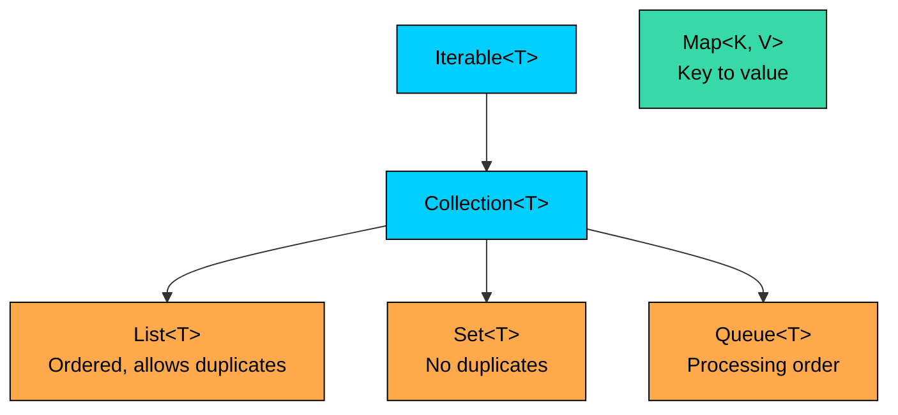

import React from 'react';
import CodeBlock from '../../../../components/ui/CodeBlock';
import Callout from '../../../../components/ui/Callout';

<div className="article-header">
  <div className="breadcrumb">
    <a href="/">Curated Notes</a>
    <span className="breadcrumb-separator">›</span>
    <span className="breadcrumb-current">Collections Overview</span>
  </div>
  <h1>Collections Overview</h1>
  <p style={{ color: 'var(--text-muted)', fontSize: '1.1rem', marginBottom: '16px', lineHeight: '1.6' }}>
    Master the essentials of Collections Overview in this curated guide.
  </p>
  <div className="meta-info">
    <span className="meta-item">
      <svg width="14" height="14" viewBox="0 0 24 24" fill="none" stroke="currentColor" strokeWidth="2"><circle cx="12" cy="12" r="10"/><polyline points="12 6 12 12 16 14"/></svg>
      10 min read
    </span>
    <span className="difficulty-badge difficulty-badge--intermediate">Intermediate</span>
  </div>
</div>

<section className="content-section">

The Java Collections Framework is the standard library Java ships for storing and working with groups of objects. It replaces the manual array juggling you'd otherwise write for things like a shopping cart, a list of orders, a set of unique customer emails, or a lookup from product ID to product. This lesson covers what the framework is, why it exists, the high-level shape of its hierarchy, the four families you'll pick from in practice, and a quick complexity reference you can come back to whenever you need to choose a class.

---

## Why a Framework Exists in the First Place

Before the Collections Framework arrived in Java 1.2, working with groups of objects meant either using plain arrays or rolling your own data structure for each new problem. Arrays solve a narrow case, and they solve it stiffly. Once you've written one, you know exactly how its size, indexing, and iteration work, and you know which jobs they make awkward.

Take a shopping cart as a concrete example. You want to add items as the customer browses, remove an item if they change their mind, count how many items are in the cart, and walk through the cart at checkout. An array forces you to commit to a fixed size up front, which doesn't match the way carts grow. If you start with `new String[10]` and the customer adds an eleventh item, you have to allocate a bigger array and copy the contents over yourself.


```java
public class ArrayCart {
    public static void main(String[] args) {
        String[] cart = new String[3];
        cart[0] = "Notebook";
        cart[1] = "Pen";
        cart[2] = "Eraser";

        // Customer wants to add a fourth item. The array is full.
        String[] bigger = new String[cart.length * 2];
        for (int i = 0; i < cart.length; i++) {
            bigger[i] = cart[i];
        }
        bigger[3] = "Highlighter";
        cart = bigger;

        System.out.println("Cart has " + cart.length + " slots.");
        System.out.println("Fourth item: " + cart[3]);
    }
}
```


Every operation that arrays don't support directly, like grow, remove from the middle, check whether something is already in the cart, sort, or iterate without an index, you'd have to code yourself. Worse, you'd code it slightly differently for each project, and the next reader would have to learn your conventions before they could work with it.

The Collections Framework solves both problems. It gives you a set of ready-made classes that handle the common shapes (a list, a set of unique items, a queue, a key-value map) along with a set of standard interfaces (`List`, `Set`, `Queue`, `Map`) that those classes implement. You learn the interface once, and any class that implements it behaves the same way for the operations the interface defines.


```java
import java.util.ArrayList;
import java.util.List;

public class ListCart {
    public static void main(String[] args) {
        List<String> cart = new ArrayList<>();
        cart.add("Notebook");
        cart.add("Pen");
        cart.add("Eraser");
        cart.add("Highlighter");

        System.out.println("Cart has " + cart.size() + " items.");
        System.out.println("Fourth item: " + cart.get(3));
    }
}
```


No manual resizing. No copy loop. The cart grows as items are added, and the code reads like the cart's behavior in plain English. That's the value the framework delivers across every collection shape, not just lists.

---

## The Shape of the Hierarchy

The framework is organized around a small number of interfaces that define what a collection can do, and a larger number of classes that implement those interfaces in different ways. Two root interfaces sit at the top: `Iterable` (anything you can walk through with a for-each loop) and `Map` (anything that stores key-value pairs).

`Collection` extends `Iterable` and is the parent of three sub-interfaces:

- `List` for ordered sequences with positional access, like a shopping cart that remembers insertion order.
- `Set` for collections that don't allow duplicates, like the set of unique customer emails who've signed up.
- `Queue` for collections you process in some order, often first-in first-out, like incoming orders waiting to be fulfilled.

`Map` sits on its own branch. A map stores keys mapped to values, like a product catalog where product IDs map to product objects. `Map` does not extend `Collection`, because a key-value pair isn't a single element the way a list item is. You'll still use it constantly.





The diagram shows the four families you'll choose from when picking a collection: `List`, `Set`, `Queue`, and `Map`. `Map` is drawn separately because it's not under `Collection`. Each family has multiple implementing classes that trade speed for memory, ordering for raw throughput, or thread-safety for simplicity.

Each family answers a different question:


| Family  | Question it answers                                     | Example use                             |
| ------- | ------------------------------------------------------- | --------------------------------------- |
| `List`  | What items did the customer add, and in what order?     | Cart contents, order line items         |
| `Set`   | Have I already seen this item?                          | Unique customer emails, applied coupons |
| `Queue` | Which item should I process next?                       | Orders waiting to ship                  |
| `Map`   | Given a key, what's the value associated with it?       | Product ID to product, email to user    |


A small program that uses one class from each family makes the contrast concrete.


```java
import java.util.ArrayList;
import java.util.HashMap;
import java.util.HashSet;
import java.util.LinkedList;
import java.util.List;
import java.util.Map;
import java.util.Queue;
import java.util.Set;

public class FourFamilies {
    public static void main(String[] args) {
        List<String> cart = new ArrayList<>();
        cart.add("Notebook");
        cart.add("Pen");
        cart.add("Notebook");

        Set<String> appliedCoupons = new HashSet<>();
        appliedCoupons.add("WELCOME10");
        appliedCoupons.add("WELCOME10");
        appliedCoupons.add("FREESHIP");

        Queue<String> incomingOrders = new LinkedList<>();
        incomingOrders.add("Order-1001");
        incomingOrders.add("Order-1002");

        Map<String, Double> productPrices = new HashMap<>();
        productPrices.put("Notebook", 4.99);
        productPrices.put("Pen", 1.49);

        System.out.println("Cart items: " + cart);
        System.out.println("Unique coupons: " + appliedCoupons);
        System.out.println("Next order to ship: " + incomingOrders.peek());
        System.out.println("Price of Notebook: $" + productPrices.get("Notebook"));
    }
}
```


Read the output one line at a time. The list kept both copies of `"Notebook"` because lists allow duplicates and preserve insertion order. The set kept only one `"WELCOME10"` because adding the same value twice to a set is a no-op. The queue's `peek()` returned `"Order-1001"` because that's the order at the front of the line. The map returned `4.99` when asked for the value associated with the key `"Notebook"`. Four families, four behaviors, one consistent style of code.

---

## Interfaces and Implementations: A Two-Layer View

Pulling the framework apart into two layers helps make sense of why there are so many class names to remember. The first layer is the interfaces, which define behavior. The second layer is the implementations, which define how that behavior is stored internally.

The interface tells you what a `List` does: `add`, `get`, `size`, `remove`, `contains`, iterate, and so on. Every class that implements `List` supports all of those operations. The implementation tells you how. `ArrayList` stores items in an array, so positional access is fast and adding to the end is fast on average. `LinkedList` stores items in a doubly linked chain, so adding to either end is fast but positional access has to walk the chain.

This split is what lets you write code against the interface and pick the implementation separately.


```java
import java.util.ArrayList;
import java.util.List;

public class WriteToInterface {
    public static void main(String[] args) {
        List<String> cart = new ArrayList<>();
        cart.add("Notebook");
        cart.add("Pen");

        printCart(cart);
    }

    public static void printCart(List<String> items) {
        System.out.println("Cart has " + items.size() + " items.");
        for (String item : items) {
            System.out.println(" - " + item);
        }
    }
}
```


`printCart` takes `List<String>`, not `ArrayList<String>`. The method works with any class that implements `List`, so a caller could pass a `LinkedList`, a `Vector`, or any other `List` and the method would still work. The general guideline is to type variables and parameters by the most specific interface that fits, not by a concrete class. That keeps the door open to swap implementations later without rewriting callers.

Here's a quick map from interface to common implementation classes. Each class gets its own lesson later in the section, so this table is only for orientation.


| Interface | Common implementations                                          | When you'd typically pick it                                  |
| --------- | --------------------------------------------------------------- | ------------------------------------------------------------- |
| `List`    | `ArrayList`, `LinkedList`, `Vector`, `Stack`                    | Cart contents, ordered history, anything indexed by position  |
| `Set`     | `HashSet`, `LinkedHashSet`, `TreeSet`                           | Unique emails, applied coupons, distinct product categories   |
| `Queue`   | `LinkedList`, `PriorityQueue`, `ArrayDeque`                     | Incoming orders, task queues, priority-based processing       |
| `Map`     | `HashMap`, `LinkedHashMap`, `TreeMap`, `Hashtable`              | Product ID to product, email to user, config keys to values   |


The same shape applies across the table. Pick the interface from the family that matches the problem, then pick the implementation based on the trade-offs you care about (lookup speed, ordering guarantees, thread-safety, memory).

---

## Quick Big-O Reference

The reason the framework offers more than one implementation per interface is that each one is good at different operations. Pick a class by looking at what your code does most often and matching it to an implementation whose strong operations line up.

This table is the at-a-glance version. Treat it as a quick reference, not a substitute for the deep dive that comes in each class's own lesson. The "amortized" note on some entries means the operation is fast on average even though an individual call may occasionally be slower (typically because the underlying array resizes itself).


| Operation          | `ArrayList`       | `LinkedList` | `HashSet` | `TreeSet`  | `HashMap`         | `TreeMap`  |
| ------------------ | ----------------- | ------------ | --------- | ---------- | ----------------- | ---------- |
| Add (at end)       | O(1) amortized    | O(1)         | O(1) avg  | O(log n)   | O(1) avg          | O(log n)   |
| Add (at front)     | O(n)              | O(1)         | n/a       | n/a        | n/a               | n/a        |
| Get by index       | O(1)              | O(n)         | n/a       | n/a        | n/a               | n/a        |
| Get by key/value   | n/a               | n/a          | O(1) avg  | O(log n)   | O(1) avg          | O(log n)   |
| Contains           | O(n)              | O(n)         | O(1) avg  | O(log n)   | O(1) avg          | O(log n)   |
| Remove by value    | O(n)              | O(n)         | O(1) avg  | O(log n)   | O(1) avg          | O(log n)   |
| Iteration order    | insertion         | insertion    | none      | sorted     | none              | sorted     |


A few observations worth pinning down from this table.

`ArrayList.get(i)` is the only constant-time positional access in this group. `LinkedList.get(i)` walks the chain from the closer end, so it's O(n). If your code reads items by index in a loop, `ArrayList` is almost always the better choice.

`LinkedList.get(i)` is O(n) because each call walks the chain. A loop that calls `get(i)` for every `i` from `0` to `n - 1` ends up O(n^2). Prefer `ArrayList` when you index by position, or iterate with a for-each loop on the `LinkedList` directly to stay O(n) overall.

`HashSet` and `HashMap` give you O(1) average lookups, which is what makes "does this collection already contain X?" cheap. The "average" qualifier matters: hash collisions can drag a single operation up to O(n) in pathological cases, but ordinary workloads stay close to the average.

`TreeSet` and `TreeMap` are O(log n) on every operation but give you sorted iteration in exchange. If you need keys or elements walked in sorted order, the log factor is the price you pay. If you don't need that, the hash-based class is usually faster.

Adding to the front of an `ArrayList` is O(n), because every existing element has to shift right by one. Adding to the end is O(1) on average. The asymmetry is what nudges people toward `LinkedList` or `ArrayDeque` for queue-like workloads where insertions happen on both ends.

`ArrayList.add(0, item)` shifts every existing element right by one slot, which is O(n). Use `LinkedList` or `ArrayDeque` if you frequently insert at the front, or rebuild the list once at the end if order can be applied in bulk.

---

## When to Use Which Family

The four families map to four shapes a problem can take. Reading the problem statement carefully usually points you straight at the right family before you even think about which class to instantiate.

Pick `List` when order matters and duplicates are fine. A shopping cart: the customer added a notebook, then a pen, then another notebook, and the cart should remember all three in that order. Order history, the list of items on a single order, and the sequence of product views on a session page all map to `List`.

Pick `Set` when duplicates would be a bug. The collection of unique customer emails for a newsletter signup must reject the same email twice, because sending a customer two copies of the same email is a mistake. Applied promotion codes per order, distinct product categories shown on a homepage, and tags on a product all map to `Set`.

Pick `Queue` when you process items in some order, usually the order they arrived. Incoming orders waiting to be picked and packed is a typical case. Tasks waiting to run, items waiting to be emailed, and any "next one up" workload maps to `Queue`. A specialized form, `PriorityQueue`, lets you process by priority instead of insertion order. That fits "always pull the highest-priority order next", for instance.

Pick `Map` when you have a natural key for each value. Product ID to product, email to customer, order ID to order. What makes a map valuable is constant-time lookup by the key. If you'd find yourself writing a loop like "walk the list and find the entry where ID equals X", a map removes that loop and turns it into a single `get` call.

A small worked example. A product catalog where the program needs to look up the price of a product by its name. A list would force a loop. A map turns it into one line.


```java
import java.util.HashMap;
import java.util.Map;

public class CatalogLookup {
    public static void main(String[] args) {
        Map<String, Double> catalog = new HashMap<>();
        catalog.put("Notebook", 4.99);
        catalog.put("Pen", 1.49);
        catalog.put("Eraser", 0.79);

        String chosen = "Pen";
        Double price = catalog.get(chosen);

        if (price != null) {
            System.out.println(chosen + " costs $" + price);
        } else {
            System.out.println(chosen + " is not in the catalog.");
        }
    }
}
```


`catalog.get("Pen")` runs in roughly constant time, regardless of whether the catalog holds three products or three million. If `catalog` had been a `List<Product>`, the code would have had to walk the list comparing names until it found a match, which is O(n) for a hit and always O(n) for a miss.

When you're stuck between two families for the same problem, ask which property is non-negotiable. If the answer is "no duplicates", you want `Set`. If the answer is "by position", you want `List`. If the answer is "look up by key", you want `Map`. If the answer is "next in line", you want `Queue`. Usually only one of those is non-negotiable, and that's your family.

---

## Putting It Together

A short program that touches all four families in one flow, modeling part of an e-commerce checkout. The cart is a list. The applied coupons are a set. The pending orders are a queue. The product catalog is a map. Each collection does the job its family is designed for.


```java
import java.util.ArrayList;
import java.util.HashMap;
import java.util.HashSet;
import java.util.LinkedList;
import java.util.List;
import java.util.Map;
import java.util.Queue;
import java.util.Set;

public class CheckoutFlow {
    public static void main(String[] args) {
        Map<String, Double> catalog = new HashMap<>();
        catalog.put("Notebook", 4.99);
        catalog.put("Pen", 1.49);
        catalog.put("Eraser", 0.79);

        List<String> cart = new ArrayList<>();
        cart.add("Notebook");
        cart.add("Pen");
        cart.add("Notebook");

        Set<String> coupons = new HashSet<>();
        coupons.add("WELCOME10");
        coupons.add("WELCOME10");

        Queue<String> ordersToShip = new LinkedList<>();
        ordersToShip.add("Order-1001");
        ordersToShip.add("Order-1002");

        double subtotal = 0.0;
        for (String item : cart) {
            subtotal += catalog.get(item);
        }

        System.out.println("Cart: " + cart);
        System.out.println("Subtotal: $" + subtotal);
        System.out.println("Coupons applied: " + coupons);
        System.out.println("Next order to ship: " + ordersToShip.peek());
    }
}
```


Walk through the flow. The catalog is a `Map` because the program looks up prices by product name. The cart is a `List` because duplicates are legitimate and order matters. Coupons are a `Set` because applying the same coupon twice should still count once. The shipping queue is a `Queue` because orders are pulled from the front in arrival order. Each collection's behavior reflects its family without the program having to spell out any of that logic by hand.

The subtotal loop is also worth noting. It iterates the cart with a for-each, which works because `List` extends `Iterable`. For each item, it calls `catalog.get(item)` to fetch the price, which works because `Map` exposes `get(key)`. The two collections cooperate naturally, even though one is under `Collection` and the other isn't.

</section>
