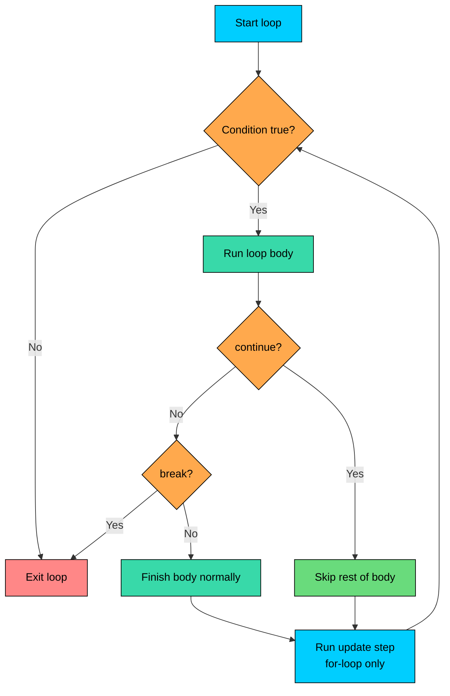

import React from 'react';
import CodeBlock from '../../../../components/ui/CodeBlock';
import Callout from '../../../../components/ui/Callout';

<div className="article-header">
  <div className="breadcrumb">
    <a href="/">Curated Notes</a>
    <span className="breadcrumb-separator">›</span>
    <span className="breadcrumb-current">Break & Continue</span>
  </div>
  <h1>Break & Continue</h1>
  <p style={{ color: 'var(--text-muted)', fontSize: '1.1rem', marginBottom: '16px', lineHeight: '1.6' }}>
    Master the essentials of Break & Continue in this curated guide.
  </p>
  <div className="meta-info">
    <span className="meta-item">
      <svg width="14" height="14" viewBox="0 0 24 24" fill="none" stroke="currentColor" strokeWidth="2"><circle cx="12" cy="12" r="10"/><polyline points="12 6 12 12 16 14"/></svg>
      10 min read
    </span>
    <span className="difficulty-badge difficulty-badge--intermediate">Intermediate</span>
  </div>
</div>

<section className="content-section">

Loops are great when you want to process every element, but real code often needs to stop early or skip an iteration. That's what `break` and `continue` are for. This lesson covers the unlabeled forms of both keywords, how they behave inside `for`, `while`, and `do-while`, and the common bugs that come with them.

---

## What `break` Does

`break` immediately exits the nearest enclosing loop. The loop's condition check is not run again, the update step (if any) is skipped, and execution jumps to the first statement after the loop.

The most common use is "find the first match and stop." Once you've found what you were looking for, scanning the rest of the array is wasted work.


```java
public class FindFirstInStock {
    public static void main(String[] args) {
        String[] products = {"Headphones", "Keyboard", "Mouse", "Monitor"};
        int[] stock = {0, 0, 12, 5};

        int firstAvailableIndex = -1;
        for (int i = 0; i < products.length; i++) {
            if (stock[i] > 0) {
                firstAvailableIndex = i;
                break;
            }
        }

        if (firstAvailableIndex >= 0) {
            System.out.println("First in-stock product: " + products[firstAvailableIndex]);
        } else {
            System.out.println("Everything is out of stock");
        }
    }
}
```


The loop walks through products in order. When it hits index `2` (`Mouse`, stock `12`), the condition is true, it records the index, and `break` ends the loop right there. Indexes `3` is never visited.

`break` also exits a `switch` statement. That's the same keyword doing the same job: leave the nearest enclosing `switch` or loop. If you write `break` inside a `switch` that's inside a `for`, it exits the `switch`, not the `for`.

---

## What `continue` Does

`continue` skips the rest of the current iteration and jumps to the next condition check. In a `for` loop, the update step runs before that check, so `i++` (or whatever you put there) still happens.

The standard use is "skip the items you don't care about" without writing a deeply nested `if`.


```java
public class SkipOutOfStock {
    public static void main(String[] args) {
        String[] products = {"Headphones", "Keyboard", "Mouse", "Monitor"};
        int[] stock = {3, 0, 12, 0};

        int processedCount = 0;
        for (int i = 0; i < products.length; i++) {
            if (stock[i] == 0) {
                continue;
            }
            System.out.println(products[i] + " is available (" + stock[i] + " in stock)");
            processedCount++;
        }
        System.out.println("Processed " + processedCount + " in-stock products");
    }
}
```


When `stock[i]` is `0`, `continue` jumps straight to the update step (`i++`) and then re-checks the condition. The print line and the counter increment are skipped for those iterations.

You could write the same logic with `if (stock[i] > 0) { ... }`, and for one condition it reads about the same. `continue` is more useful when you have several "skip this one" checks at the top of a loop body. Each one becomes a flat guard instead of nesting deeper.

---

## A Visual View of Control Flow

Both keywords change where execution goes next. The diagram below shows how they redirect a loop's normal flow.





The key takeaway: `continue` loops back to the condition check (after running the update step in a `for`), while `break` leaves the loop entirely. Neither one re-runs the body of the current iteration.

---

## `break` and `continue` in `while`

In a `while` loop, `continue` jumps to the condition check at the top. There's no update step that runs automatically.

Here's a clean example: read inputs until you hit a sentinel value, validating each one. `break` lets us exit the loop cleanly on the stop signal.


```java
public class ValidateInputs {
    public static void main(String[] args) {
        String[] inputs = {"29.99", "abc", "15.50", "stop", "9.99"};
        int index = 0;
        double total = 0;

        while (index < inputs.length) {
            String raw = inputs[index];
            index++;

            if (raw.equals("stop")) {
                break;
            }

            try {
                double price = Double.parseDouble(raw);
                total += price;
            } catch (NumberFormatException e) {
                System.out.println("Skipping invalid input: " + raw);
                continue;
            }

            System.out.println("Added " + raw);
        }

        System.out.println("Final total: $" + total);
    }
}
```


Two details. `break` ends the loop as soon as we see `"stop"`. The `"9.99"` that comes after is never processed. The `continue` here is technically optional because there's nothing after it in the loop body, but it makes the intent clear: "we're done with this iteration."

---

## The `continue` Infinite Loop Trap

`continue` in a `while` loop is dangerous when the counter or state change happens **after** the condition you're skipping on. If you `continue` past the update, the loop spins on the same value forever.

**What's wrong with this code?**


```java
public class BrokenSkip {
    public static void main(String[] args) {
        int[] stock = {3, 0, 12, 0, 5};
        int index = 0;
        int totalAvailable = 0;

        while (index < stock.length) {
            if (stock[index] == 0) {
                continue;
            }
            totalAvailable += stock[index];
            index++;
        }

        System.out.println("Total available: " + totalAvailable);
    }
}
```


This program never prints anything. It hangs. When `index` is `1`, `stock[1]` is `0`, so `continue` jumps back to the `while` condition. But `index` was never incremented, so `stock[1]` is still `0`, so `continue` runs again, and again, and again.

**Fix:**


```java
public class FixedSkip {
    public static void main(String[] args) {
        int[] stock = {3, 0, 12, 0, 5};
        int index = 0;
        int totalAvailable = 0;

        while (index < stock.length) {
            int current = stock[index];
            index++;
            if (current == 0) {
                continue;
            }
            totalAvailable += current;
        }

        System.out.println("Total available: " + totalAvailable);
    }
}
```


The fix: increment `index` **before** the `continue` can fire. Now every iteration moves forward, no matter which path runs. A `for` loop avoids this trap entirely because its update step runs even on `continue`. Prefer `for` when walking through an index.

---

## `break` and `continue` in `do-while`

A `do-while` runs the body at least once, then checks the condition at the bottom. `break` and `continue` behave the same way they do in `while`: `break` leaves the loop entirely, `continue` jumps to the condition check at the bottom.

This order-status scanner walks through orders until it finds the first one with status `"pending"`, then stops.


```java
public class FindFirstPending {
    public static void main(String[] args) {
        String[] orderStatuses = {"shipped", "delivered", "pending", "shipped"};
        int index = 0;
        int firstPendingIndex = -1;

        do {
            if (orderStatuses[index].equals("pending")) {
                firstPendingIndex = index;
                break;
            }
            index++;
        } while (index < orderStatuses.length);

        if (firstPendingIndex >= 0) {
            System.out.println("First pending order at index: " + firstPendingIndex);
        } else {
            System.out.println("No pending orders found");
        }
    }
}
```


The body runs, checks the status, and either increments `index` or breaks. The same trap applies as in `while`: a `continue` before incrementing `index` hangs the loop. The condition runs at the bottom, but the update is still your responsibility.

---

## Common Use Cases

A few patterns come up often enough that it's worth naming them.


| Pattern | What `break`/`continue` does | Example |
|---------|------------------------------|---------|
| Early exit on found item | `break` after recording the match | Find first in-stock product |
| Skip invalid items | `continue` past records that fail a check | Skip out-of-stock products in a price calculation |
| Validation short-circuit | `break` on first bad input | Stop reading prices on a parse error |
| Bounded retry | `break` after a successful attempt | Retry a flaky check up to N times |


Here's the validation short-circuit pattern in full. The moment we hit an invalid input, we bail out instead of silently ignoring it.


```java
public class ShortCircuitValidation {
    public static void main(String[] args) {
        String[] rawPrices = {"19.99", "29.50", "free", "9.99"};
        double total = 0;
        boolean allValid = true;

        for (int i = 0; i < rawPrices.length; i++) {
            try {
                total += Double.parseDouble(rawPrices[i]);
            } catch (NumberFormatException e) {
                System.out.println("Invalid price at position " + i + ": " + rawPrices[i]);
                allValid = false;
                break;
            }
        }

        if (allValid) {
            System.out.println("All prices valid. Total: $" + total);
        } else {
            System.out.println("Validation failed. Partial total: $" + total);
        }
    }
}
```


The `break` here is doing real work: it stops the loop the moment we know the answer isn't going to be useful. Without it, the loop would keep running and either keep totaling valid prices or throw on the next bad one.

---

## When to Step Back from `break` and `continue`

`break` and `continue` are tools, not goals. A loop body that has two or three `continue` guards plus a `break` in the middle plus a nested `if` is hard to follow. The reader has to mentally trace every branch to know what reaches the end.

Nested loops with `break` and `continue` scattered through them are usually a sign to pull the logic into a method. A method with a clear name and a single `return` is almost always easier to read than a deeply nested loop with control jumps. The rule of thumb: if a loop body is longer than the screen, or has more than two `break`/`continue` statements, consider extracting part of it.

---

## A Teaser: Breaking Out of Nested Loops

Plain `break` only exits the nearest enclosing loop. That gets awkward when you have a nested loop and you want to break out of both at once. Java has a feature called **labels** that lets you tell `break` or `continue` exactly which loop to target.

</section>
