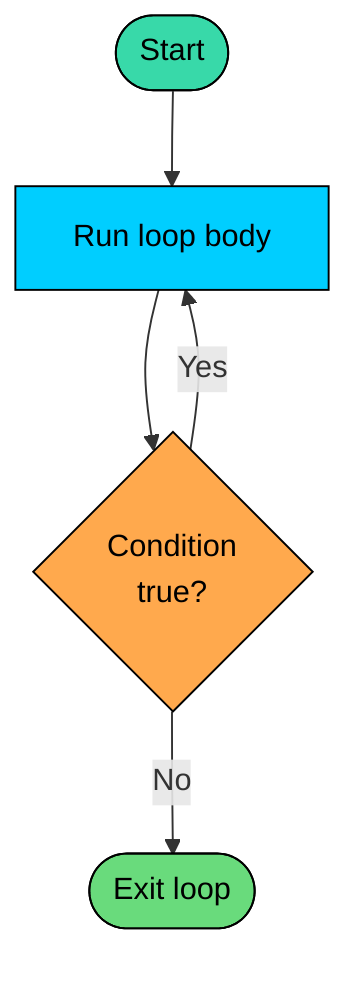

import React from 'react';
import CodeBlock from '../../../../components/ui/CodeBlock';
import Callout from '../../../../components/ui/Callout';

<div className="article-header">
  <div className="breadcrumb">
    <a href="/">Curated Notes</a>
    <span className="breadcrumb-separator">›</span>
    <span className="breadcrumb-current">Do-While Loop</span>
  </div>
  <h1>Do-While Loop</h1>
  <p style={{ color: 'var(--text-muted)', fontSize: '1.1rem', marginBottom: '16px', lineHeight: '1.6' }}>
    Master the essentials of Do-While Loop in this curated guide.
  </p>
  <div className="meta-info">
    <span className="meta-item">
      <svg width="14" height="14" viewBox="0 0 24 24" fill="none" stroke="currentColor" strokeWidth="2"><circle cx="12" cy="12" r="10"/><polyline points="12 6 12 12 16 14"/></svg>
      10 min read
    </span>
    <span className="difficulty-badge difficulty-badge--intermediate">Intermediate</span>
  </div>
</div>

<section className="content-section">

A `do-while` loop runs its body first, then checks the condition. That tiny reordering matters a lot in practice. When a block of code must always execute at least once before deciding whether to repeat, `do-while` is the right loop.

---

## The Basic Shape

A `do-while` loop has three parts: the `do` keyword, a body block in braces, and a `while (condition);` at the bottom. That trailing semicolon is part of the syntax, not optional.


```java
public class FirstDoWhile {
    public static void main(String[] args) {
        int itemNumber = 1;
        do {
            System.out.println("Showing product " + itemNumber);
            itemNumber++;
        } while (itemNumber <= 3);
    }
}
```


The flow goes: enter the body, run it, evaluate the condition, loop back to the body if it's true, exit if it's false. The condition lives at the bottom, so the body has already executed once before the loop even thinks about whether to continue.

---

## How Execution Flows

The control flow is short to describe but useful to picture. A `do-while` body always runs, then the condition decides whether to run it again.





There is no arrow that lets the program skip the body. Even if the condition would have been false from the start, the body still runs once. That's the reason `do-while` exists.

---

## Contrast With While

A regular `while` loop checks the condition first. If it's already false, the body never runs at all. A `do-while` runs the body, then checks. Same code, different starting condition, different output.

Here's the same logic written both ways. The starting balance is already below the threshold:


```java
public class WhileVsDoWhile {
    public static void main(String[] args) {
        int cartItemsWhile = 0;
        while (cartItemsWhile > 0) {
            System.out.println("while: cart has " + cartItemsWhile + " items");
            cartItemsWhile--;
        }
        System.out.println("while loop done");

        int cartItemsDoWhile = 0;
        do {
            System.out.println("do-while: cart has " + cartItemsDoWhile + " items");
            cartItemsDoWhile--;
        } while (cartItemsDoWhile > 0);
        System.out.println("do-while loop done");
    }
}
```


The `while` loop printed nothing from its body because the condition was already false on entry. The `do-while` printed once, then checked the condition, found it false, and stopped. That single guaranteed pass is the defining feature.

---

## The Mandatory Trailing Semicolon

The semicolon after `while (...)` is required. Without it, the compiler refuses to build. This is the most common mistake learners make with `do-while`.

**What's wrong with this code?**


```java
public class MissingSemicolon {
    public static void main(String[] args) {
        int productId = 1;
        do {
            System.out.println("Product " + productId);
            productId++;
        } while (productId <= 3)
    }
}
```


This won't compile. The compiler produces an error like:


```shell
error: ';' expected
        } while (productId <= 3)
                                ^
```


The fix is one character. Put the semicolon back at the end of the `while (...)` line:

**Fix:**


```java
public class WithSemicolon {
    public static void main(String[] args) {
        int productId = 1;
        do {
            System.out.println("Product " + productId);
            productId++;
        } while (productId <= 3);
    }
}
```


Why does Java demand it? The `do-while` statement is a single statement and Java statements terminate with a semicolon. The `while` part of a normal `while` loop doesn't need one because it's followed directly by the body block, but here the body comes first and the condition closes the whole statement.

---

## Input Validation

The best use case for `do-while` is reading input and checking if it's valid. Reading has to happen first, otherwise there's nothing to check. That fits `do-while` perfectly: act first, then validate.

To keep the output predictable, this example simulates input with a small array instead of reading from the keyboard. The logic is the same. Each attempt is an entry from `attemptedIds`. The loop keeps going until it sees a valid product ID.


```java
public class ProductIdValidation {
    public static void main(String[] args) {
        int[] attemptedIds = {-5, 0, 17, 23};
        int attemptIndex = 0;
        int productId;

        do {
            productId = attemptedIds[attemptIndex];
            System.out.println("Attempt " + (attemptIndex + 1) + ": entered " + productId);
            attemptIndex++;
        } while (productId <= 0);

        System.out.println("Accepted product ID: " + productId);
    }
}
```


The body runs, reads an attempt, then the condition decides whether the value was good. Bad input loops back. Good input falls out the bottom. Writing this with a regular `while` is awkward because it would require either priming the variable with a dummy value or copying the read step both before and inside the loop.

Here's the same idea with `Scanner` when actual keyboard input is needed. The expected output below assumes the user typed `-2`, then `0`, then `42`:


```java
import java.util.Scanner;

public class ScannerProductId {
    public static void main(String[] args) {
        Scanner input = new Scanner(System.in);
        int productId;
        do {
            System.out.print("Enter a product ID: ");
            productId = input.nextInt();
        } while (productId <= 0);
        System.out.println("Accepted product ID: " + productId);
    }
}
```


---

## Retry Until Success

The same pattern fits retries. Try something, check the result, try again if it failed. The action happens at least once, so `do-while` is the right shape. This example simulates checkout attempts where the first two fail and the third succeeds.


```java
public class CheckoutRetry {
    public static void main(String[] args) {
        boolean[] attemptResults = {false, false, true};
        int attempt = 0;
        boolean paymentConfirmed;

        do {
            paymentConfirmed = attemptResults[attempt];
            System.out.println("Attempt " + (attempt + 1)
                + ": payment confirmed = " + paymentConfirmed);
            attempt++;
        } while (!paymentConfirmed && attempt < attemptResults.length);

        if (paymentConfirmed) {
            System.out.println("Checkout complete after " + attempt + " attempts.");
        } else {
            System.out.println("Checkout failed after " + attempt + " attempts.");
        }
    }
}
```


The condition has two parts joined with `&&`: keep going if payment isn't confirmed AND attempts remain. The second part prevents the loop from running forever when every attempt fails.

---

## Menu Loops

Menu loops are another natural fit. Show the menu, take a choice, act on it, then loop unless the choice was "exit". Like input validation, the menu has to appear once before the decision to show it again can be made.


```java
public class OrderStatusMenu {
    public static void main(String[] args) {
        String[] choices = {"track", "cancel", "track", "exit"};
        int step = 0;
        String choice;

        do {
            System.out.println("--- Order Status Menu ---");
            System.out.println("1) track");
            System.out.println("2) cancel");
            System.out.println("3) exit");
            choice = choices[step];
            System.out.println("You chose: " + choice);

            if (choice.equals("track")) {
                System.out.println("Order #1042 is out for delivery.");
            } else if (choice.equals("cancel")) {
                System.out.println("Order #1042 cancelled.");
            }

            step++;
        } while (!choice.equals("exit"));

        System.out.println("Goodbye.");
    }
}
```


The menu always appears once, the user always picks once, and the loop only exits when the chosen action is `exit`. A regular `while` would require printing the menu before the loop and again at the bottom of the body, which duplicates code.

---

## The "Already Valid" Trap

The same property that makes `do-while` good for validation can backfire. If the input is already correct, the body still runs once. That's only a problem when the body does something that shouldn't repeat unconditionally, like printing a prompt or charging a card.

**What's wrong with this code?**


```java
public class AlreadyValidTrap {
    public static void main(String[] args) {
        int quantity = 2;
        do {
            System.out.println("Please enter a positive quantity.");
            // pretend we read user input here
            quantity = 5;
        } while (quantity <= 0);
        System.out.println("Final quantity: " + quantity);
    }
}
```


The original `quantity` was already `2`, which is positive. The user should never have seen the "Please enter" prompt. The body ran once because that's what `do-while` does. The fix is to check first when the value might already be valid:

**Fix:**


```java
public class CheckFirst {
    public static void main(String[] args) {
        int quantity = 2;
        while (quantity <= 0) {
            System.out.println("Please enter a positive quantity.");
            quantity = 5;
        }
        System.out.println("Final quantity: " + quantity);
    }
}
```


Rule of thumb: use `do-while` when the body has to run at least once to produce the value being checked. Use `while` when the value already exists and the action should only happen if a condition is true.

</section>
