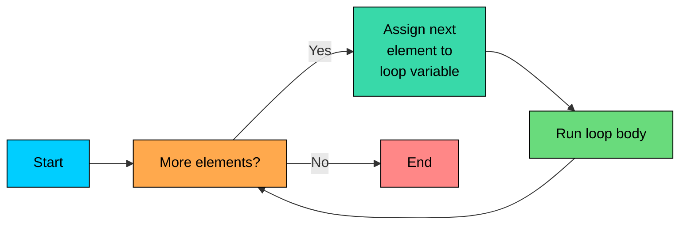

import React from 'react';
import CodeBlock from '../../../../components/ui/CodeBlock';
import Callout from '../../../../components/ui/Callout';

<div className="article-header">
  <div className="breadcrumb">
    <a href="/">Curated Notes</a>
    <span className="breadcrumb-separator">›</span>
    <span className="breadcrumb-current">Enhanced For Loop</span>
  </div>
  <h1>Enhanced For Loop</h1>
  <p style={{ color: 'var(--text-muted)', fontSize: '1.1rem', marginBottom: '16px', lineHeight: '1.6' }}>
    Master the essentials of Enhanced For Loop in this curated guide.
  </p>
  <div className="meta-info">
    <span className="meta-item">
      <svg width="14" height="14" viewBox="0 0 24 24" fill="none" stroke="currentColor" strokeWidth="2"><circle cx="12" cy="12" r="10"/><polyline points="12 6 12 12 16 14"/></svg>
      10 min read
    </span>
    <span className="difficulty-badge difficulty-badge--intermediate">Intermediate</span>
  </div>
</div>

<section className="content-section">

The classic `for` loop is flexible, but most of the time you just want to walk through every element of an array or list, one at a time. Java 5 added the **enhanced for loop**, also called the **for-each loop**, for exactly that case. It strips away the index bookkeeping and lets you focus on what you're doing with each element.

---

## The Syntax

The enhanced for loop reads like English: "for each item in this collection, do the following."


```java
for (Type item : iterable) {
    // use item
}
```


You declare a variable that holds the current element, follow it with a colon, and then name the thing you're iterating over. On each pass, `item` is set to the next element. The loop ends when there are no more elements.

Here's the contrast with a classic `for` loop. Both print every product in a cart:


```java
public class CartPrinter {
    public static void main(String[] args) {
        String[] cartItems = {"Wireless Headphones", "USB Cable", "Phone Case"};

        // Classic for loop
        for (int i = 0; i < cartItems.length; i++) {
            System.out.println(cartItems[i]);
        }

        System.out.println("---");

        // Enhanced for loop
        for (String cartItem : cartItems) {
            System.out.println(cartItem);
        }
    }
}
```


The enhanced version is shorter and harder to get wrong. There is no `i = 0` to remember, no `i < cartItems.length` to type, no `cartItems[i]` to look up. The loop variable `cartItem` is the element itself, not an index pointing to it.

The enhanced for loop was introduced in Java 5 (2004). Every modern Java codebase uses it.

---

## How It Walks Through an Array

The flow is simple: pick the next element, assign it to the loop variable, run the body, repeat.





There's no counter exposed to your code. The loop knows how many elements remain because the array or collection knows its own size, but you never see that number unless you ask.

A more realistic example: summing the prices in a cart.


```java
public class CartTotal {
    public static void main(String[] args) {
        double[] prices = {19.99, 4.50, 29.95, 9.99};
        double total = 0;
        for (double price : prices) {
            total += price;
        }
        System.out.println("Cart total: $" + total);
    }
}
```


The loop reads naturally: "for each price in prices, add it to the total."

---

## Works on Anything Iterable

The enhanced for loop isn't just for arrays. It works on anything that implements the `Iterable` interface, which includes `List`, `Set`, and most of the standard collection types you'll encounter later.

You can think of it like this: if a type can hand out its elements one at a time, the enhanced for loop can walk it.


```java
import java.util.List;

public class OrderStatusPrinter {
    public static void main(String[] args) {
        List<String> orderStatuses = List.of("placed", "shipped", "delivered");
        for (String status : orderStatuses) {
            System.out.println("Order status: " + status);
        }
    }
}
```


The body of the loop looks identical to the array version. The same syntax handles arrays, lists, and sets without you having to think about it.

---

## When the Classic `for` Loop Wins

The enhanced version is cleaner, but it gives up some power in exchange. There are four situations where you'll want to go back to the classic `for` loop.

#### 1. You Need the Current Index

The enhanced for loop hides the index from you. If you need to know whether you're on the first item, the last item, or position `i`, you don't have access to that number directly.

Say you want to print a numbered list of cart items:


```java
public class NumberedCart {
    public static void main(String[] args) {
        String[] cartItems = {"Wireless Headphones", "USB Cable", "Phone Case"};
        for (int i = 0; i < cartItems.length; i++) {
            System.out.println((i + 1) + ". " + cartItems[i]);
        }
    }
}
```


You can fake the index with a separate counter variable inside an enhanced for loop, but at that point the classic version is just clearer.

#### 2. You Want to Iterate in Reverse

The enhanced for loop always goes from first to last. There's no "iterate backwards" mode. If you need to walk an array from the end to the beginning, you need a classic `for` loop with a decrementing counter.


```java
public class ReversedItems {
    public static void main(String[] args) {
        String[] cartItems = {"Wireless Headphones", "USB Cable", "Phone Case"};
        for (int i = cartItems.length - 1; i >= 0; i--) {
            System.out.println(cartItems[i]);
        }
    }
}
```


#### 3. You Want to Walk Two Arrays Together

The enhanced for loop iterates one thing at a time. If you have product names in one array and prices in a parallel array, and you want to print them side by side, the enhanced version can't do that on its own. You need an index to look into both.


```java
public class ProductPriceList {
    public static void main(String[] args) {
        String[] productNames = {"Wireless Headphones", "USB Cable", "Phone Case"};
        double[] productPrices = {49.99, 4.50, 14.95};
        for (int i = 0; i < productNames.length; i++) {
            System.out.println(productNames[i] + ": $" + productPrices[i]);
        }
    }
}
```


#### 4. You Want to Modify the Collection Structurally

You can't safely add or remove elements from a list while you're iterating it with an enhanced for loop. If you try, you'll get a `ConcurrentModificationException` at runtime.

---

## Reassigning the Loop Variable Does Nothing

Here's a trap that catches beginners. The loop variable is a **copy** of the element, not a reference back into the array. Reassigning it doesn't change the array.

**What's wrong with this code?**


```java
public class BrokenDiscount {
    public static void main(String[] args) {
        double[] prices = {19.99, 4.50, 29.95};
        for (double price : prices) {
            price = price * 0.9; // 10% discount, right?
        }
        for (double price : prices) {
            System.out.println(price);
        }
    }
}
```


The discount didn't apply. The variable `price` is a local copy of each array element. When you reassign `price`, you change the copy, not the array slot it came from. Java passes values, not slots, into the loop variable.

**Fix:** Use a classic `for` loop with an index so you can write back into the array.


```java
public class FixedDiscount {
    public static void main(String[] args) {
        double[] prices = {19.99, 4.50, 29.95};
        for (int i = 0; i < prices.length; i++) {
            prices[i] = prices[i] * 0.9;
        }
        for (double price : prices) {
            System.out.println(price);
        }
    }
}
```


`prices[i] = ...` writes back into the array. Now the change sticks.

The same rule applies to primitives in any context: assigning to a copy never affects the original. With objects the story is more nuanced (you can still call methods that mutate the object the reference points to), but reassigning the loop variable itself never updates the array slot.

---

## Putting It Together

Here's a slightly bigger example that combines a few ideas. Given a list of product ratings, compute the average rating and count how many are 5-star reviews.


```java
public class RatingsReport {
    public static void main(String[] args) {
        int[] ratings = {5, 4, 5, 3, 5, 2, 4, 5};
        int sum = 0;
        int fiveStarCount = 0;
        for (int rating : ratings) {
            sum += rating;
            if (rating == 5) {
                fiveStarCount++;
            }
        }
        double average = (double) sum / ratings.length;
        System.out.println("Average rating: " + average);
        System.out.println("Five-star reviews: " + fiveStarCount);
    }
}
```


The enhanced for loop handles the traversal. The accumulator variables (`sum`, `fiveStarCount`) live outside the loop, get updated inside, and we read their final values afterward. No index needed, because we don't care about position.

</section>
