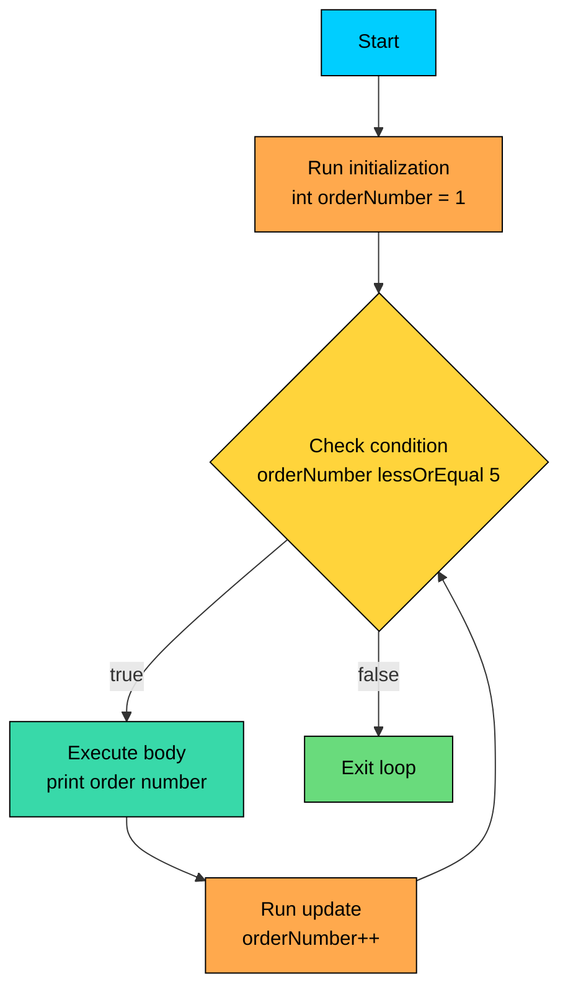

import React from 'react';
import CodeBlock from '../../../../components/ui/CodeBlock';
import Callout from '../../../../components/ui/Callout';

<div className="article-header">
  <div className="breadcrumb">
    <a href="/">Curated Notes</a>
    <span className="breadcrumb-separator">›</span>
    <span className="breadcrumb-current">For Loop</span>
  </div>
  <h1>For Loop</h1>
  <p style={{ color: 'var(--text-muted)', fontSize: '1.1rem', marginBottom: '16px', lineHeight: '1.6' }}>
    Master the essentials of For Loop in this curated guide.
  </p>
  <div className="meta-info">
    <span className="meta-item">
      <svg width="14" height="14" viewBox="0 0 24 24" fill="none" stroke="currentColor" strokeWidth="2"><circle cx="12" cy="12" r="10"/><polyline points="12 6 12 12 16 14"/></svg>
      10 min read
    </span>
    <span className="difficulty-badge difficulty-badge--intermediate">Intermediate</span>
  </div>
</div>

<section className="content-section">

The `for` loop is Java's workhorse for any task with a known iteration count. Counting through cart items, scanning a list of product ratings, generating order numbers, the `for` loop handles all of it with one compact piece of syntax. This lesson covers the classic counted form, how each part is evaluated, and the small mistakes that come up most often.

---

## Anatomy of a For Loop

A `for` loop has three parts inside the parentheses, separated by semicolons, followed by a body in braces.


```java
public class FirstForLoop {
    public static void main(String[] args) {
        for (int orderNumber = 1; orderNumber <= 5; orderNumber++) {
            System.out.println("Processing order #" + orderNumber);
        }
    }
}
```


The three parts are:


| Part | Name | Purpose |
| ---- | ---- | ------- |
| `int orderNumber = 1` | Initialization | Runs once, before anything else. Usually declares a counter. |
| `orderNumber <= 5` | Condition | Checked before each iteration. If `true`, the body runs. If `false`, the loop ends. |
| `orderNumber++` | Update | Runs after the body, before the next condition check. Usually advances the counter. |


The order of evaluation matters. On the first pass, Java runs the initialization, checks the condition, runs the body, runs the update, then checks the condition again. From the second pass onward, it's just condition, body, update, repeat.





An important detail: the condition is checked **before** the body, not after. If the condition is `false` on the very first check, the body never runs at all. This means a `for` loop is safe to use when the count might be zero.


```java
public class EmptyCart {
    public static void main(String[] args) {
        int cartSize = 0;
        for (int i = 0; i < cartSize; i++) {
            System.out.println("This never prints");
        }
        System.out.println("Loop finished, cart was empty.");
    }
}
```


---

## Iterating Over an Array

Counting from `0` to `length - 1` is a common loop shape in Java because it lines up with how arrays are indexed. A small `int[]` shows the pattern.


```java
public class CartPrices {
    public static void main(String[] args) {
        int[] prices = {29, 49, 19, 99, 15};
        int total = 0;
        for (int i = 0; i < prices.length; i++) {
            System.out.println("Item " + i + ": $" + prices[i]);
            total = total + prices[i];
        }
        System.out.println("Cart total: $" + total);
    }
}
```


Java arrays are zero-indexed, so the first item lives at index `0` and the last lives at index `length - 1`. The condition uses `<`, not `<=`. If you wrote `i <= prices.length`, the loop would try to read `prices[5]`, which doesn't exist, and Java would throw `ArrayIndexOutOfBoundsException`.

The name `i` is fine here. It's the universally recognized convention for a loop index, and using it for that role keeps your code readable. Use a descriptive name when the counter represents something meaningful in the domain, like `orderNumber` or `attemptCount`.

---

## Counting Down and Custom Steps

The update part doesn't have to be `i++`. It can be any expression that moves the counter, including decrement, addition, multiplication, or anything else.

Counting down is just as easy as counting up. Flip the starting value, flip the condition, and use `--` instead of `++`.


```java
public class CountdownLaunch {
    public static void main(String[] args) {
        for (int seconds = 5; seconds >= 1; seconds--) {
            System.out.println("Launching in " + seconds + "...");
        }
        System.out.println("Order placed!");
    }
}
```


You can also step by more than one. A loop that prints every other rating value from 1 to 10:


```java
public class OddRatings {
    public static void main(String[] args) {
        for (int rating = 1; rating <= 10; rating = rating + 2) {
            System.out.println("Rating bucket: " + rating);
        }
    }
}
```


The update `rating = rating + 2` could also be written as `rating += 2`. Both do the same thing.

The update runs once per iteration. If you put something expensive in there (a method call, a string concatenation), that cost multiplies by the number of iterations. Prefer to keep the update to a simple arithmetic step.

---

## Multiple Init and Update Expressions

Both the initialization and the update sections accept a comma-separated list. You can declare more than one counter and advance more than one at a time. The condition stays a single boolean expression.

The classic use case is walking from both ends of a structure toward the middle.


```java
public class TwoPointers {
    public static void main(String[] args) {
        int[] ratings = {1, 2, 3, 4, 5, 6, 7, 8};
        for (int left = 0, right = ratings.length - 1; left < right; left++, right--) {
            System.out.println("Pair: " + ratings[left] + " and " + ratings[right]);
        }
    }
}
```


`left` starts at `0` and `right` starts at the last valid index. Each pass moves them toward each other. When they meet or cross, the condition becomes `false` and the loop ends.

A few rules to remember about multi-variable `for` loops:

- All variables declared in the init part must be the same type. You can't write `int i = 0, double price = 0.0`.
- The condition is one boolean expression. To combine conditions, use `&&` or `||`.
- The update is a list of statements separated by commas, not a list of values. `i++, j--` is fine. `i + 1, j - 1` is not, because those aren't statements.

Multi-variable loops are powerful but easy to overuse. If the loop starts to need three or four counters, it's usually a sign the logic belongs inside the body instead.

---

## Loop Variable Scope

A variable declared in the init part of a `for` loop is **local to that loop**. It does not exist after the loop ends. The compiler enforces this.


```java
public class ScopedCounter {
    public static void main(String[] args) {
        for (int itemIndex = 0; itemIndex < 3; itemIndex++) {
            System.out.println("Index: " + itemIndex);
        }
        // System.out.println(itemIndex); // Compile error: itemIndex not in scope
        System.out.println("Done");
    }
}
```


If you uncomment the line that prints `itemIndex` after the loop, the file won't compile. The compiler reports `cannot find symbol: variable itemIndex` because the name only exists inside the loop's block.

This is usually what you want. It keeps loop counters from leaking into surrounding code and accidentally being reused. If you do need the final value of the counter after the loop ends, declare the variable outside the loop instead.


```java
public class CounterAfterLoop {
    public static void main(String[] args) {
        int lastIndex = 0;
        for (lastIndex = 0; lastIndex < 3; lastIndex++) {
            System.out.println("Visited index " + lastIndex);
        }
        System.out.println("Loop ended at index " + lastIndex);
    }
}
```


`lastIndex` ends up at `3`, not `2`. The update happens after the last iteration that runs the body, and the loop only exits once the condition is `false`. The variable holds the first value that failed the condition.

---

## Off-by-One Bugs

A common bug in any counted loop is being off by one: starting at the wrong index, stopping one step too early, or stopping one step too late. The two usual suspects are the choice between `<` and `<=`, and whether to start at `0` or `1`.

**What's wrong with this code?**


```java
public class OffByOneBug {
    public static void main(String[] args) {
        int[] prices = {10, 20, 30, 40};
        for (int i = 0; i <= prices.length; i++) {
            System.out.println(prices[i]);
        }
    }
}
```


The condition uses `<=` instead of `<`. `prices.length` is `4`, but the valid indices are `0`, `1`, `2`, `3`. When `i` reaches `4`, the code tries to read `prices[4]`, which doesn't exist, and Java throws `ArrayIndexOutOfBoundsException`.

**Fix:**


```java
public class OffByOneFix {
    public static void main(String[] args) {
        int[] prices = {10, 20, 30, 40};
        for (int i = 0; i < prices.length; i++) {
            System.out.println(prices[i]);
        }
    }
}
```


The rule of thumb: when iterating over a structure with `N` elements, use `i = 0; i < N; i++`. The `<` is intentional because indices run from `0` to `N - 1`, and there are exactly `N` of them.

The other off-by-one is starting at the wrong index.

**What's wrong with this code?**


```java
public class StartIndexBug {
    public static void main(String[] args) {
        int[] stock = {5, 8, 12, 3};
        int total = 0;
        for (int i = 1; i < stock.length; i++) {
            total = total + stock[i];
        }
        System.out.println("Total stock: " + total);
    }
}
```


This loop starts at `i = 1`, skipping the first element. The total only includes `8 + 12 + 3 = 23`, missing the initial `5`. The arithmetic looks right but the answer is wrong, which makes this kind of bug hard to spot.

**Fix:**


```java
public class StartIndexFix {
    public static void main(String[] args) {
        int[] stock = {5, 8, 12, 3};
        int total = 0;
        for (int i = 0; i < stock.length; i++) {
            total = total + stock[i];
        }
        System.out.println("Total stock: " + total);
    }
}
```


There are valid reasons to start at `1` (for example, comparing each item to its previous neighbor), but they should be deliberate, not accidental. When in doubt, start at `0`.

---

## The Infinite For Loop

All three parts of a `for` loop are optional. Leave them out and you get the infinite loop, written as `for (;;)`. The semicolons are required because the parser uses them to separate the three sections, even when they're empty.


```java
public class InfiniteLoop {
    public static void main(String[] args) {
        int count = 0;
        for (;;) {
            count++;
            if (count == 3) {
                System.out.println("Reached 3, exiting.");
                break;
            }
            System.out.println("Iteration " + count);
        }
    }
}
```


With no condition to check, the loop will run forever unless something inside the body exits it. The usual escape hatches are `break` (jumps out of the loop), `return` (exits the entire method), or throwing an exception. Without one of those, you've created an infinite loop, which will hang your program until you kill it manually.

`for (;;)` is uncommon in everyday Java. The more common way to write an intentional infinite loop is `while (true)`. The `for (;;)` form still shows up in older code and some system-level libraries.

</section>
