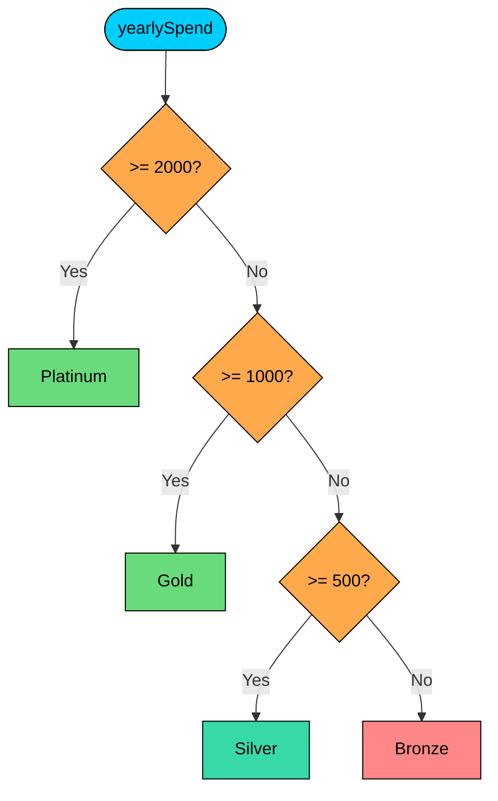

import React from 'react';
import CodeBlock from '../../../../components/ui/CodeBlock';
import Callout from '../../../../components/ui/Callout';

<div className="article-header">
  <div className="breadcrumb">
    <a href="/">Curated Notes</a>
    <span className="breadcrumb-separator">›</span>
    <span className="breadcrumb-current">If-Else Statements</span>
  </div>
  <h1>If-Else Statements</h1>
  <p style={{ color: 'var(--text-muted)', fontSize: '1.1rem', marginBottom: '16px', lineHeight: '1.6' }}>
    Master the essentials of If-Else Statements in this curated guide.
  </p>
  <div className="meta-info">
    <span className="meta-item">
      <svg width="14" height="14" viewBox="0 0 24 24" fill="none" stroke="currentColor" strokeWidth="2"><circle cx="12" cy="12" r="10"/><polyline points="12 6 12 12 16 14"/></svg>
      10 min read
    </span>
    <span className="difficulty-badge difficulty-badge--intermediate">Intermediate</span>
  </div>
</div>

<section className="content-section">

Programs constantly have to make decisions: charge tax or not, apply a discount or skip it, show a "free shipping" banner or hide it. The `if` statement is the most basic tool Java gives you for branching on a condition. This lesson covers `if`, `if/else`, `else if` chains, and the nested form, along with common bugs to watch for.

---

## The Basic `if` Statement

An `if` statement runs a block of code only when a boolean condition is `true`. If the condition is `false`, the block is skipped and execution continues with whatever comes next.


```java
public class FreeShippingBanner {
    public static void main(String[] args) {
        double cartTotal = 75.00;
        if (cartTotal >= 50) {
            System.out.println("You qualify for free shipping!");
        }
        System.out.println("Cart total: $" + cartTotal);
    }
}
```


The condition has to be a `boolean` expression. Anything that produces `true` or `false` works: a relational comparison like `cartTotal >= 50`, a boolean variable, a method call that returns `boolean`, or a combination of these. Unlike some other languages, Java will not accept a number or a `String` where a boolean is expected. Writing `if (cartTotal)` is a compile error.

The curly braces around the block are optional when the body is a single statement, but you should always use them anyway. A missing brace is the source of one of the oldest bugs in C-family languages:


```java
double cartTotal = 30.0;
if (cartTotal >= 50)
    System.out.println("Free shipping!");
    System.out.println("Thanks for shopping");
```


That second `println` is always executed, no matter what `cartTotal` is, because only the next single statement belongs to the `if`. The indentation lies. Add braces and the bug goes away.

---

## `if/else`

To do one thing when a condition is true and a different thing when it's false, use `else`. The `else` block runs only when the `if` condition is `false`, never both.


```java
public class CheckoutMessage {
    public static void main(String[] args) {
        int cartItems = 0;
        if (cartItems > 0) {
            System.out.println("Proceed to checkout");
        } else {
            System.out.println("Your cart is empty");
        }
    }
}
```


`if/else` is used constantly: applying or skipping a discount, showing one of two banners, returning one of two values from a method. It's the simplest form of a two-way decision.

A larger example combines a few conditions using `&&` and `||`. The combined expression still produces a single boolean, which is all `if` cares about.


```java
public class CouponEligibility {
    public static void main(String[] args) {
        double cartTotal = 120.0;
        boolean isPremiumCustomer = false;
        if (cartTotal >= 100 || isPremiumCustomer) {
            System.out.println("Coupon applied: 10% off");
        } else {
            System.out.println("Add more to qualify for a coupon");
        }
    }
}
```


---

## `else if` Chains

When you have more than two outcomes, chain `else if` clauses together. Java evaluates the conditions top to bottom, runs the first block whose condition is `true`, and skips the rest. The optional final `else` is the fallback for the case where none of the conditions matched.


```java
public class CustomerTier {
    public static void main(String[] args) {
        double yearlySpend = 850.0;
        String tier;
        if (yearlySpend >= 2000) {
            tier = "Platinum";
        } else if (yearlySpend >= 1000) {
            tier = "Gold";
        } else if (yearlySpend >= 500) {
            tier = "Silver";
        } else {
            tier = "Bronze";
        }
        System.out.println("Tier: " + tier);
    }
}
```


The order of conditions matters. Java stops checking as soon as one matches. With `yearlySpend = 850`, the first two conditions are `false`, the third is `true`, so `tier` becomes `"Silver"` and the chain ends. The fourth branch isn't even evaluated.

That short-circuit behavior is also why the chain works correctly with overlapping ranges. The first check is `>= 2000`, the next is `>= 1000`. A value of `1500` would satisfy both, but only the first matching branch runs. If you reversed the order and put `>= 500` at the top, every spend over $500 would be classified as Silver and the higher tiers would never trigger.

The flow of that decision visualized:





Each diamond is a check. The first one that answers "yes" determines the tier; the rest are never reached.

---

## Nested `if`

You can put an `if` inside another `if`. The inner statement only runs when the outer condition is `true`, which lets you express conditions that depend on each other.


```java
public class DiscountCalculator {
    public static void main(String[] args) {
        double cartTotal = 150.0;
        boolean hasCoupon = true;
        double discount = 0;

        if (cartTotal >= 100) {
            if (hasCoupon) {
                discount = cartTotal * 0.20;
            } else {
                discount = cartTotal * 0.10;
            }
        }
        System.out.println("Discount: $" + discount);
    }
}
```


The inner `if/else` only runs when `cartTotal >= 100`. If the outer condition is `false`, `discount` stays at `0` and neither inner branch executes.

Nesting works, but it gets ugly fast. Two levels are usually fine. Three levels are a code smell. The example above can be rewritten without nesting by combining conditions with `&&`:


```java
public class DiscountCalculatorFlat {
    public static void main(String[] args) {
        double cartTotal = 150.0;
        boolean hasCoupon = true;
        double discount = 0;

        if (cartTotal >= 100 && hasCoupon) {
            discount = cartTotal * 0.20;
        } else if (cartTotal >= 100) {
            discount = cartTotal * 0.10;
        }
        System.out.println("Discount: $" + discount);
    }
}
```


Same result, easier to read. The rule of thumb: if the inner condition logically belongs with the outer one, combine them with `&&` or build an `else if` chain. Save real nesting for cases where the inner check is in a different category from the outer one (for example, "if the customer is logged in, check their cart state").

---

## The Dangling Else

When you write nested `if/else` without braces, an `else` always binds to the nearest unmatched `if`, no matter how you indent it. This is the **dangling else** problem.

**What's wrong with this code?**


```java
int cartItems = 2;
boolean hasCoupon = false;
if (cartItems > 0)
    if (hasCoupon)
        System.out.println("Coupon applied");
else
    System.out.println("Cart is empty");
```


The indentation suggests the `else` belongs to the outer `if`, which would mean nothing prints (`cartItems > 0` is `true`, `hasCoupon` is `false`, no message about an empty cart). What actually happens: the `else` binds to the inner `if (hasCoupon)`, so the code prints `Cart is empty` even though the cart has 2 items.

**Fix:**


```java
public class DanglingElseFixed {
    public static void main(String[] args) {
        int cartItems = 2;
        boolean hasCoupon = false;
        if (cartItems > 0) {
            if (hasCoupon) {
                System.out.println("Coupon applied");
            }
        } else {
            System.out.println("Cart is empty");
        }
    }
}
```


The output is empty because `cartItems > 0` is `true` (so the outer `else` is skipped) and `hasCoupon` is `false` (so the inner block is skipped). Braces make the binding explicit and remove the ambiguity entirely. This is the single best reason to always use braces, even when the language lets you skip them.

---

## Common Bugs

Several bugs show up in `if` statements repeatedly. They're easy to fix once recognized.

#### `=` Instead of `==`

`=` is assignment. `==` is the equality check. Most languages accept `if (x = 5)` and assign `5` to `x` before checking if the result is truthy. Java prevents this when the variable is numeric: `if (orderCount = 5)` does not compile, because the assignment evaluates to an `int` and `if` requires a `boolean`.

The protection breaks down when the variable itself is `boolean`.

**What's wrong with this code?**


```java
boolean isPremiumCustomer = false;
if (isPremiumCustomer = true) {
    System.out.println("Premium discount applied");
}
System.out.println("isPremiumCustomer = " + isPremiumCustomer);
```


This compiles. `isPremiumCustomer = true` assigns `true` to the variable, the expression evaluates to `true`, the block always runs, and now `isPremiumCustomer` is mutated as a side effect. Three things go wrong at once.

**Fix:**


```java
public class EqualityCheckFix {
    public static void main(String[] args) {
        boolean isPremiumCustomer = false;
        if (isPremiumCustomer == true) {
            System.out.println("Premium discount applied");
        }
        System.out.println("isPremiumCustomer = " + isPremiumCustomer);
    }
}
```


Even cleaner: drop the redundant comparison and write `if (isPremiumCustomer)`. A boolean variable already is the condition.

#### Comparing Strings with `==`

`==` on strings compares references, not contents. Two strings that look identical can sit at different addresses in memory, in which case `==` returns `false`. Use `.equals()` for content comparison.

**What's wrong with this code?**


```java
String orderStatus = new String("SHIPPED");
if (orderStatus == "SHIPPED") {
    System.out.println("Your order is on the way");
} else {
    System.out.println("Status: " + orderStatus);
}
```


Because `new String("SHIPPED")` forces a fresh object, `orderStatus` and the string literal `"SHIPPED"` are different references. The `==` check is `false`, so the `else` branch runs.

**Fix:**


```java
public class StringEqualityFix {
    public static void main(String[] args) {
        String orderStatus = new String("SHIPPED");
        if (orderStatus.equals("SHIPPED")) {
            System.out.println("Your order is on the way");
        } else {
            System.out.println("Status: " + orderStatus);
        }
    }
}
```


The rule: compare strings with `.equals()`.

---

## When to Use `if/else` vs `switch`

An `else if` chain handles any condition you can write as a boolean. A `switch` statement is more restricted: it picks among the values of a single expression, comparing them for equality.

Use `if/else` when:

- The conditions test ranges (`yearlySpend >= 1000`).
- The conditions involve different variables (`cartTotal > 100 && hasCoupon`).
- The conditions are arbitrary boolean expressions.

Use `switch` when:

- You're comparing one variable against several fixed values.
- The values are constants like `int`, `String`, or enum constants.

For example, the tier code earlier (`>= 2000`, `>= 1000`, `>= 500`) is range-based, so `if/else` fits. But classifying an order status (`"PLACED"`, `"SHIPPED"`, `"DELIVERED"`, `"CANCELLED"`) is equality against fixed values, which is what `switch` was built for.

</section>
