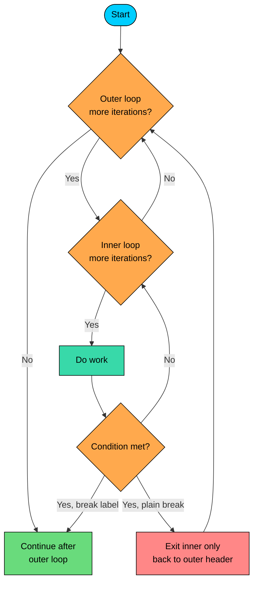

import React from 'react';
import CodeBlock from '../../../../components/ui/CodeBlock';
import Callout from '../../../../components/ui/Callout';

<div className="article-header">
  <div className="breadcrumb">
    <a href="/">Curated Notes</a>
    <span className="breadcrumb-separator">›</span>
    <span className="breadcrumb-current">Labeled Statements</span>
  </div>
  <h1>Labeled Statements</h1>
  <p style={{ color: 'var(--text-muted)', fontSize: '1.1rem', marginBottom: '16px', lineHeight: '1.6' }}>
    Master the essentials of Labeled Statements in this curated guide.
  </p>
  <div className="meta-info">
    <span className="meta-item">
      <svg width="14" height="14" viewBox="0 0 24 24" fill="none" stroke="currentColor" strokeWidth="2"><circle cx="12" cy="12" r="10"/><polyline points="12 6 12 12 16 14"/></svg>
      10 min read
    </span>
    <span className="difficulty-badge difficulty-badge--intermediate">Intermediate</span>
  </div>
</div>

<section className="content-section">

A plain `break` or `continue` isn't always enough. Searching through a grid of warehouses or scanning a list of carts often requires bailing out of more than just the innermost loop. Java's labeled statements provide that capability: attach a name to a loop, then `break` or `continue` to that name instead of the nearest one. This lesson covers when to use them, how the syntax works, and when an extracted method is the better choice.

---

## What a Label Is

A label is an identifier followed by a colon, placed right before a loop. The label doesn't do anything on its own. It only matters when a `break` or `continue` names it.


```java
public class LabelSyntax {
    public static void main(String[] args) {
        warehouseSearch:
        for (int aisle = 0; aisle < 3; aisle++) {
            for (int shelf = 0; shelf < 3; shelf++) {
                if (aisle == 1 && shelf == 2) {
                    break warehouseSearch;
                }
                System.out.println("Checked aisle " + aisle + ", shelf " + shelf);
            }
        }
        System.out.println("Done");
    }
}
```


The label `warehouseSearch:` sits on the outer `for`. When `break warehouseSearch;` fires, control jumps out of both loops in one step. Without the label, a plain `break` would only exit the inner loop and the outer one would keep going.

Naming rules for labels follow the same rules as variable names: letters, digits, underscores, no leading digit, no keywords. Pick names that describe what the loop is doing. `outer:` works but reads poorly. `warehouseSearch:` or `cartScan:` tells the reader what's going on.

Java has no `goto` keyword. Labels are not a back door to one. They only work with `break` and `continue`, and only to jump out of or skip an enclosing loop. Arbitrary forward or backward jumps to a label are not allowed.

---

## Why Plain `break` Falls Short

To see why labels exist, look at what a plain `break` does in a nested loop. A plain `break` always exits the **nearest** enclosing loop. That's fine in a single loop. In nested loops, it's often the wrong behavior.

**What's wrong with this code?**


```java
public class InnerBreakOnly {
    public static void main(String[] args) {
        String[][] inventory = {
            {"Headphones", "Charger", "Mouse"},
            {"Keyboard", "Webcam", "Phone Case"},
            {"Laptop Stand", "USB Hub", "Notebook"}
        };
        String target = "Webcam";
        boolean found = false;

        for (int aisle = 0; aisle < inventory.length; aisle++) {
            for (int shelf = 0; shelf < inventory[aisle].length; shelf++) {
                if (inventory[aisle][shelf].equals(target)) {
                    System.out.println("Found " + target + " at aisle " + aisle + ", shelf " + shelf);
                    found = true;
                    break;
                }
            }
            System.out.println("Finished checking aisle " + aisle);
        }
        System.out.println("Found = " + found);
    }
}
```


The `break` does its job: it leaves the inner loop the instant the product matches. But the outer loop continues, moves on to the next aisle, and keeps printing. Scanning aisle 2 after the answer was already found is wasted work.

The usual fix without labels is a flag plus an extra check:


```java
for (int aisle = 0; aisle < inventory.length && !found; aisle++) {
    for (int shelf = 0; shelf < inventory[aisle].length; shelf++) {
        if (inventory[aisle][shelf].equals(target)) {
            found = true;
            break;
        }
    }
}
```


That works, but it carries state (`found`) just to coordinate two loops. A labeled break removes the flag.

**Fix with a labeled break:**


```java
public class LabeledBreakFix {
    public static void main(String[] args) {
        String[][] inventory = {
            {"Headphones", "Charger", "Mouse"},
            {"Keyboard", "Webcam", "Phone Case"},
            {"Laptop Stand", "USB Hub", "Notebook"}
        };
        String target = "Webcam";

        warehouseSearch:
        for (int aisle = 0; aisle < inventory.length; aisle++) {
            for (int shelf = 0; shelf < inventory[aisle].length; shelf++) {
                if (inventory[aisle][shelf].equals(target)) {
                    System.out.println("Found " + target + " at aisle " + aisle + ", shelf " + shelf);
                    break warehouseSearch;
                }
            }
            System.out.println("Finished checking aisle " + aisle);
        }
        System.out.println("Done");
    }
}
```


One `break warehouseSearch;` exits both loops together. No flag, no extra condition in the outer header, no wasted iterations.

---

## How Labeled `break` Flows

Compare the control flow side by side. A plain `break` exits one level. A labeled `break` exits straight to the statement after the labeled loop, regardless of nesting depth.





The two red and green endpoints make the difference clear. A plain `break` returns to the outer loop's header to check the next iteration. A labeled `break` goes all the way out, skipping the rest of the outer loop entirely.

This also extends to three or more levels. With three nested loops and the outermost labeled, `break theOutermost;` from the deepest body exits all three at once.


```java
public class TripleNested {
    public static void main(String[] args) {
        String[][][] warehouses = {
            { {"Mouse", "Charger"}, {"Keyboard"} },
            { {"Webcam", "Headphones"}, {"Phone Case", "USB Hub"} }
        };
        String target = "USB Hub";

        warehouseScan:
        for (int w = 0; w < warehouses.length; w++) {
            for (int aisle = 0; aisle < warehouses[w].length; aisle++) {
                for (int shelf = 0; shelf < warehouses[w][aisle].length; shelf++) {
                    if (warehouses[w][aisle][shelf].equals(target)) {
                        System.out.println("Found at warehouse " + w + ", aisle " + aisle + ", shelf " + shelf);
                        break warehouseScan;
                    }
                }
            }
        }
        System.out.println("Search complete");
    }
}
```


---

## Labeled `continue`

`continue` has the same problem in nested loops, just less common. A plain `continue` jumps to the next iteration of the **nearest** loop, which is the inner one. A labeled `continue` jumps to the next iteration of the **labeled** loop.

This is useful for skipping the rest of an outer iteration based on something discovered in the inner loop. Consider checking a list of shopping carts and skipping any cart that contains an out-of-stock item.


```java
public class LabeledContinue {
    public static void main(String[] args) {
        String[][] carts = {
            {"Headphones", "Charger"},
            {"Webcam", "OUT_OF_STOCK", "Mouse"},
            {"Keyboard", "USB Hub"}
        };

        outerCart:
        for (int c = 0; c < carts.length; c++) {
            for (int i = 0; i < carts[c].length; i++) {
                if (carts[c][i].equals("OUT_OF_STOCK")) {
                    System.out.println("Cart " + c + " has unavailable item, skipping");
                    continue outerCart;
                }
            }
            System.out.println("Cart " + c + " is ready to ship");
        }
    }
}
```


When `continue outerCart;` fires for cart 1, control jumps straight to the top of the outer loop and moves on to cart 2. The "ready to ship" line below the inner loop never runs for cart 1, because labeled `continue` skips the rest of that outer iteration.

A plain `continue` there would skip to the next item in the same cart, the opposite of the desired behavior.

---

## A Real Search Example

Putting it together, a complete search over a 2D inventory that reports the position of the first match and stops cleanly:


```java
public class InventoryLookup {
    public static void main(String[] args) {
        String[][] inventory = {
            {"Headphones", "Charger", "Mouse"},
            {"Keyboard", "Webcam", "Phone Case"},
            {"Laptop Stand", "USB Hub", "Notebook"}
        };
        String target = "Phone Case";

        int foundAisle = -1;
        int foundShelf = -1;

        warehouseSearch:
        for (int aisle = 0; aisle < inventory.length; aisle++) {
            for (int shelf = 0; shelf < inventory[aisle].length; shelf++) {
                if (inventory[aisle][shelf].equals(target)) {
                    foundAisle = aisle;
                    foundShelf = shelf;
                    break warehouseSearch;
                }
            }
        }

        if (foundAisle == -1) {
            System.out.println(target + " not in stock");
        } else {
            System.out.println(target + " is at aisle " + foundAisle + ", shelf " + foundShelf);
        }
    }
}
```


The labeled `break` saves the position variables before exiting. That's a typical pattern: exiting a search usually requires remembering **where** the match was found. The variables live in the enclosing scope so they're still readable after the loops finish.

Labeled `break` and `continue` have no runtime overhead. They compile to the same kind of jump as plain `break` and `continue`. The cost is purely in readability, not performance.

---

## Labels Are Rare in Idiomatic Java

Labels are uncommon in everyday Java code. They have legitimate uses (the search example above is one), but most code that uses a label has a clearer alternative: pull the loops into their own method and use `return`.


```java
public class ExtractedSearch {
    public static void main(String[] args) {
        String[][] inventory = {
            {"Headphones", "Charger", "Mouse"},
            {"Keyboard", "Webcam", "Phone Case"},
            {"Laptop Stand", "USB Hub", "Notebook"}
        };
        int[] position = findProduct(inventory, "Phone Case");
        if (position == null) {
            System.out.println("Not in stock");
        } else {
            System.out.println("Found at aisle " + position[0] + ", shelf " + position[1]);
        }
    }

    static int[] findProduct(String[][] inventory, String target) {
        for (int aisle = 0; aisle < inventory.length; aisle++) {
            for (int shelf = 0; shelf < inventory[aisle].length; shelf++) {
                if (inventory[aisle][shelf].equals(target)) {
                    return new int[]{aisle, shelf};
                }
            }
        }
        return null;
    }
}
```


`return` exits any number of nested loops at once. It also gives the search a name (`findProduct`) and makes the result obvious from the type signature. This version usually reads better in code review.

When does a label fit? When the loops do real work that touches surrounding state, splitting them into a method would force passing and returning a long list of values, and the logic is clearly tied to where it lives. That's a narrow case, but it does come up.

A reasonable guideline:

- **Prefer extracting a method** when the loop body is self-contained and the search has a clear "answer" to return.
- **Consider a label** when the loops mutate multiple outer variables, splitting them out would require returning a tuple-like object to immediately unpack, and the logic is short enough that the label reads cleanly in place.

---

## Label Placement and Scope

A label has to sit immediately before a statement, and the statement it labels is the only one it applies to. In practice, that statement is almost always a loop (`for`, `while`, or `do-while`). A `{ }` block or a `switch` can technically be labeled, but those uses are rare and usually a sign that something else needs refactoring.

The label is only visible inside the statement it labels. Break or continue to a label from outside its scope is not allowed. Reusing the same label name for two different loops in the same nesting is also rejected by the compiler.


```java
public class LabelScope {
    public static void main(String[] args) {
        cartScan:
        for (int c = 0; c < 3; c++) {
            for (int i = 0; i < 3; i++) {
                if (i == 2) {
                    continue cartScan;
                }
                System.out.println("Cart " + c + ", item " + i);
            }
        }
    }
}
```


`continue cartScan;` ends the current outer iteration as soon as `i` reaches `2`, so item `2` is never printed for any cart.

</section>
