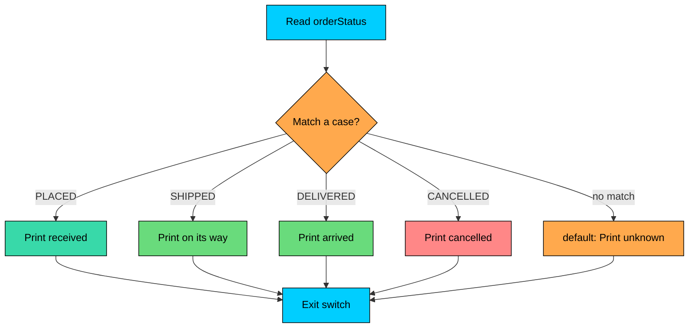

import React from 'react';
import CodeBlock from '../../../../components/ui/CodeBlock';
import Callout from '../../../../components/ui/Callout';

<div className="article-header">
  <div className="breadcrumb">
    <a href="/">Curated Notes</a>
    <span className="breadcrumb-separator">›</span>
    <span className="breadcrumb-current">Switch Statement</span>
  </div>
  <h1>Switch Statement</h1>
  <p style={{ color: 'var(--text-muted)', fontSize: '1.1rem', marginBottom: '16px', lineHeight: '1.6' }}>
    Master the essentials of Switch Statement in this curated guide.
  </p>
  <div className="meta-info">
    <span className="meta-item">
      <svg width="14" height="14" viewBox="0 0 24 24" fill="none" stroke="currentColor" strokeWidth="2"><circle cx="12" cy="12" r="10"/><polyline points="12 6 12 12 16 14"/></svg>
      10 min read
    </span>
    <span className="difficulty-badge difficulty-badge--intermediate">Intermediate</span>
  </div>
</div>

<section className="content-section">

When you find yourself writing an `if`-`else if` chain that compares the same variable against many constant values, a `switch` statement is usually cleaner. Java reads the value once and jumps straight to the matching branch. This lesson covers the classic `switch` statement form, the types it accepts, and the fall-through behavior that surprises almost everyone the first time they hit it.

---

## When to Use `switch`

A `switch` statement compares one expression against a list of constant `case` labels. If a label matches, control jumps to that label and runs the code beneath it. If nothing matches, control falls into the `default` block (if you wrote one).

Consider an order tracker that needs to print a different message for each order status. With `if`-`else if`, you end up repeating the variable name in every condition:


```java
public class OrderStatusIfElse {
    public static void main(String[] args) {
        String orderStatus = "SHIPPED";

        if (orderStatus.equals("PLACED")) {
            System.out.println("We received your order.");
        } else if (orderStatus.equals("SHIPPED")) {
            System.out.println("Your order is on its way.");
        } else if (orderStatus.equals("DELIVERED")) {
            System.out.println("Your order has arrived.");
        } else if (orderStatus.equals("CANCELLED")) {
            System.out.println("Your order was cancelled.");
        } else {
            System.out.println("Unknown status.");
        }
    }
}
```


The same logic with `switch` reads as a table of cases instead of a chain of comparisons:


```java
public class OrderStatusSwitch {
    public static void main(String[] args) {
        String orderStatus = "SHIPPED";

        switch (orderStatus) {
            case "PLACED":
                System.out.println("We received your order.");
                break;
            case "SHIPPED":
                System.out.println("Your order is on its way.");
                break;
            case "DELIVERED":
                System.out.println("Your order has arrived.");
                break;
            case "CANCELLED":
                System.out.println("Your order was cancelled.");
                break;
            default:
                System.out.println("Unknown status.");
        }
    }
}
```


Same result, but the structure tells the reader what you're doing: dispatching on one value. A good rule of thumb: use `switch` when comparing one variable against a fixed set of constant values, and use `if`-`else if` when conditions involve ranges, multiple variables, or non-constant expressions.

How that dispatch flows:





The diamond at the top is the dispatch step. The switch reads `orderStatus` once, picks the matching branch, runs the code under it, then exits. If no `case` matches, control lands in `default`.

---

## What Types Can You Switch On?

`switch` doesn't accept arbitrary expressions. The value in the parentheses must be one of these:


| Type      | Notes                                                |
| --------- | ---------------------------------------------------- |
| `byte`    | Including its wrapper `Byte`                         |
| `short`   | Including its wrapper `Short`                        |
| `int`     | Including its wrapper `Integer`                      |
| `char`    | Including its wrapper `Character`                    |
| `String`  | Supported since Java 7                               |
| `enum`    | Any enum type                                        |


What's missing from this list matters: you can't switch on `long`, `float`, `double`, `boolean`, or arbitrary objects. Each `case` label must be a compile-time constant of the same type as the switch expression.

A small example using `int` for a customer tier code:


```java
public class CustomerTierByCode {
    public static void main(String[] args) {
        int tierCode = 2;

        switch (tierCode) {
            case 1:
                System.out.println("Bronze tier: 5% discount");
                break;
            case 2:
                System.out.println("Silver tier: 10% discount");
                break;
            case 3:
                System.out.println("Gold tier: 20% discount");
                break;
            default:
                System.out.println("No tier assigned.");
        }
    }
}
```


And one with `char` for a product category code:


```java
public class CategoryByChar {
    public static void main(String[] args) {
        char categoryCode = 'E';

        switch (categoryCode) {
            case 'B':
                System.out.println("Books");
                break;
            case 'E':
                System.out.println("Electronics");
                break;
            case 'C':
                System.out.println("Clothing");
                break;
            default:
                System.out.println("Other");
        }
    }
}
```


---

## Switching on `String`

Switching on `String` was added in Java 7, and it's one of the most common uses today. The comparison uses `.equals()` internally, so case matters: `"shipped"` doesn't match `"SHIPPED"`.


```java
public class ShippingMethodPrice {
    public static void main(String[] args) {
        String shippingMethod = "EXPRESS";

        switch (shippingMethod) {
            case "STANDARD":
                System.out.println("Shipping cost: $5.00");
                break;
            case "EXPRESS":
                System.out.println("Shipping cost: $12.00");
                break;
            case "OVERNIGHT":
                System.out.println("Shipping cost: $25.00");
                break;
            default:
                System.out.println("Unknown shipping method.");
        }
    }
}
```


One thing to watch: if the string is `null`, `switch` throws `NullPointerException` before any case is checked. Guard with a null check if the value can be missing.


```java
public class NullShippingMethod {
    public static void main(String[] args) {
        String shippingMethod = null;

        if (shippingMethod == null) {
            System.out.println("Please pick a shipping method.");
        } else {
            switch (shippingMethod) {
                case "STANDARD":
                    System.out.println("Standard shipping selected.");
                    break;
                default:
                    System.out.println("Other method selected.");
            }
        }
    }
}
```


Switching on `String` isn't free. The compiler turns it into a `hashCode()` lookup followed by an `equals()` check. It's still fast, but if a `String` switch sits in a hot loop and the set of cases is tiny, an `if`-`else if` with `==` on an `enum` or `int` constant is faster.

---

## Switching on an `enum`

Enums and `switch` are made for each other. The case labels are the enum constants themselves, with no class prefix, and the compiler can warn you if you forget one.


```java
public class CustomerTierByEnum {
    enum Tier { BRONZE, SILVER, GOLD, PLATINUM }

    public static void main(String[] args) {
        Tier tier = Tier.GOLD;

        switch (tier) {
            case BRONZE:
                System.out.println("5% discount");
                break;
            case SILVER:
                System.out.println("10% discount");
                break;
            case GOLD:
                System.out.println("20% discount");
                break;
            case PLATINUM:
                System.out.println("30% discount");
                break;
        }
    }
}
```


There's no `default` here. With enums, you can sometimes leave it out if every constant is covered, but adding a `default` is still a safer habit. If someone adds a new constant later (`DIAMOND`, for example), the old switch does nothing for it. A `default` that prints or logs makes that case visible instead of swallowing it.

---

## `case`, `default`, and `break`

A `case` label marks an entry point into the switch. The `default` label is the entry point used when nothing else matches. `break` is the exit door: it ends the switch and jumps to the statement after the closing brace.

Two rules:

- `default` doesn't have to be last, but putting it last is the convention because that's where readers expect it.
- You can have at most one `default` per switch.

The basic shape with all three:


```java
public class OrderActionByStatus {
    public static void main(String[] args) {
        String orderStatus = "DELIVERED";

        switch (orderStatus) {
            case "PLACED":
                System.out.println("Send confirmation email.");
                break;
            case "SHIPPED":
                System.out.println("Send tracking link.");
                break;
            case "DELIVERED":
                System.out.println("Request a review.");
                break;
            default:
                System.out.println("No action.");
        }

        System.out.println("Done.");
    }
}
```


`break` makes the difference between "run this case and stop" and "run this case and keep going". Drop the `break` and you get fall-through, which is the next thing we need to talk about.

---

## Fall-Through: The Bug Magnet

Without a `break`, control flows from one matched case into the case below it, and the one below that, until it hits a `break` or the end of the switch. This is **fall-through**. Java inherited it from C and it's the source of the most common `switch` bug.

**What's wrong with this code?**


```java
public class BrokenTierDiscount {
    public static void main(String[] args) {
        String customerTier = "SILVER";
        int discount = 0;

        switch (customerTier) {
            case "BRONZE":
                discount = 5;
            case "SILVER":
                discount = 10;
            case "GOLD":
                discount = 20;
            default:
                System.out.println("Discount: " + discount + "%");
        }
    }
}
```


The author meant the discount for `SILVER` to be 10%, but they got 20%. The reason: control jumps to `case "SILVER":` and sets `discount = 10`. There's no `break`, so it falls through to `case "GOLD":` and overwrites `discount` with `20`. Then it falls into `default` and prints `20%`.

**Fix:**


```java
public class FixedTierDiscount {
    public static void main(String[] args) {
        String customerTier = "SILVER";
        int discount = 0;

        switch (customerTier) {
            case "BRONZE":
                discount = 5;
                break;
            case "SILVER":
                discount = 10;
                break;
            case "GOLD":
                discount = 20;
                break;
            default:
                discount = 0;
        }

        System.out.println("Discount: " + discount + "%");
    }
}
```


Each case now has its own `break`. The `default` doesn't need one because nothing comes after it inside the switch.

When you read someone else's switch, scan the right margin first. Every case body should end in a `break` (or `return`, or `throw`). If one doesn't, either it's a deliberate fall-through, in which case a comment should say so, or it's a bug waiting to happen.

---

## Intentional Fall-Through: Grouping Cases

Fall-through isn't only a bug. When two or more cases share the same body, you can group them by stacking the labels with no code between them. Control enters at the first matching label and runs straight down to the shared body.


```java
public class ShippingCostByMethod {
    public static void main(String[] args) {
        String shippingMethod = "TWO_DAY";
        double cost;

        switch (shippingMethod) {
            case "STANDARD":
            case "ECONOMY":
                cost = 5.00;
                break;
            case "EXPRESS":
            case "TWO_DAY":
                cost = 12.00;
                break;
            case "OVERNIGHT":
                cost = 25.00;
                break;
            default:
                cost = 0;
        }

        System.out.println("Shipping cost: $" + cost);
    }
}
```


`STANDARD` and `ECONOMY` share the `$5.00` body. `EXPRESS` and `TWO_DAY` share the `$12.00` body. This is the clean, idiomatic form. Two stacked labels right next to each other read as "either of these", and nobody mistakes them for a bug.

You can also fall through with real code in between, but that's where readers start losing the thread. If you absolutely need to do that, add a comment so the next person knows it's deliberate:


```java
case "STANDARD":
    addBaseShipping();
    // fall through
case "ECONOMY":
    addInsurance();
    break;
```


Most teams avoid this pattern entirely. Stacked labels for shared bodies are fine. Code-with-fall-through is rarely worth the confusion.

---

## Variable Scope Inside a Switch

One subtle point: variables declared inside a `switch` block share a single scope that spans every case. You can't declare the same variable name in two different cases without using extra braces, because the second declaration would clash with the first.

**What's wrong with this code?**


```java
public class ScopeClash {
    public static void main(String[] args) {
        int tierCode = 2;

        switch (tierCode) {
            case 1:
                String label = "Bronze";
                System.out.println(label);
                break;
            case 2:
                String label = "Silver";
                System.out.println(label);
                break;
        }
    }
}
```


This won't compile. The error is something like `variable label is already defined in the scope`. Both `String label` declarations live in the same switch block, even though they're in different cases.

**Fix:** wrap each case body in its own block with `{}` to create a new scope:


```java
public class ScopeFixed {
    public static void main(String[] args) {
        int tierCode = 2;

        switch (tierCode) {
            case 1: {
                String label = "Bronze";
                System.out.println(label);
                break;
            }
            case 2: {
                String label = "Silver";
                System.out.println(label);
                break;
            }
        }
    }
}
```


The braces give each case its own scope, so `label` no longer clashes. You only need this trick when you declare variables inside cases. If your cases just call methods or assign to variables declared outside the switch, the braces are noise.

---

## A Note on the Newer Arrow Form

Java has a newer `switch` syntax with arrows (`case X -> ...`) that doesn't fall through and can return a value. Everything in this lesson is the classic statement form, which still works in every Java version and shows up in most existing codebases. Learn this form first, then the arrow form will feel like a cleaner version of the same idea.

</section>
