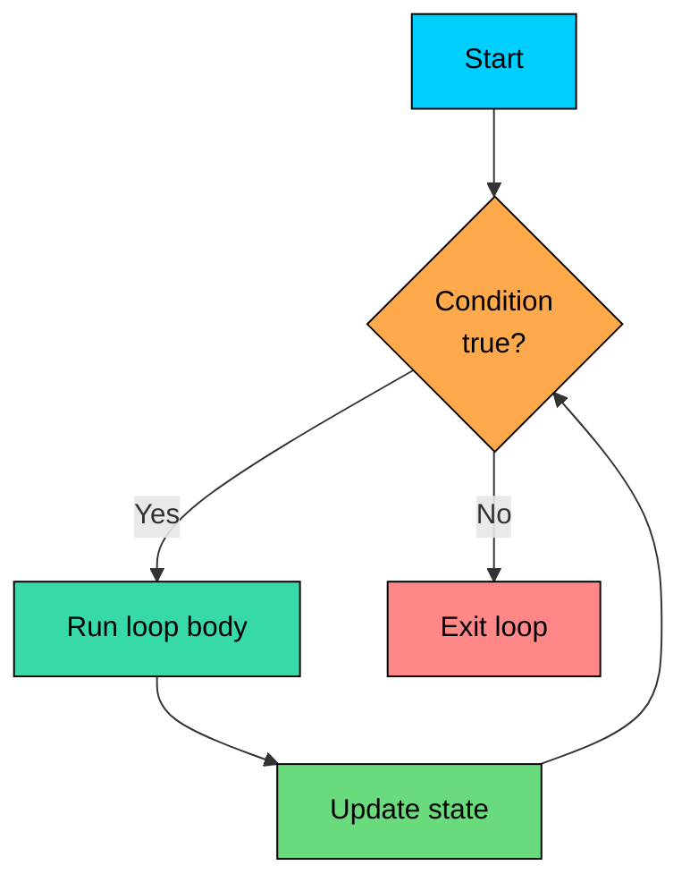

import React from 'react';
import CodeBlock from '../../../../components/ui/CodeBlock';
import Callout from '../../../../components/ui/Callout';

<div className="article-header">
  <div className="breadcrumb">
    <a href="/">Curated Notes</a>
    <span className="breadcrumb-separator">›</span>
    <span className="breadcrumb-current">While Loop</span>
  </div>
  <h1>While Loop</h1>
  <p style={{ color: 'var(--text-muted)', fontSize: '1.1rem', marginBottom: '16px', lineHeight: '1.6' }}>
    Master the essentials of While Loop in this curated guide.
  </p>
  <div className="meta-info">
    <span className="meta-item">
      <svg width="14" height="14" viewBox="0 0 24 24" fill="none" stroke="currentColor" strokeWidth="2"><circle cx="12" cy="12" r="10"/><polyline points="12 6 12 12 16 14"/></svg>
      10 min read
    </span>
    <span className="difficulty-badge difficulty-badge--intermediate">Intermediate</span>
  </div>
</div>

<section className="content-section">

A `while` loop runs a block of code over and over as long as a condition stays true. It fits cases where the number of iterations isn't known up front, like draining a queue of pending orders or asking the customer for input until they type something valid. This lesson covers the syntax, when `while` is a better fit than `for`, and common bugs.

---

## Syntax and Semantics

The shape of a `while` loop is simple:


```shell
while (condition) {
    // body runs while condition is true
}
```


Java evaluates the condition first. If it's `true`, the body runs once, and then the condition is checked again. If the condition is `false` the very first time, the body runs **zero times** and execution moves on. This is why `while` is called a pre-test loop: the test happens before the body, every time.

Here's a tiny example that prints the remaining stock as items get sold:


```java
public class StockCountdown {
    public static void main(String[] args) {
        int remainingStock = 5;
        while (remainingStock > 0) {
            System.out.println("Stock left: " + remainingStock);
            remainingStock--;
        }
        System.out.println("Out of stock");
    }
}
```


The condition `remainingStock > 0` is checked, the body runs and decrements `remainingStock`, and the cycle repeats. When `remainingStock` hits `0`, the condition is `false` and Java falls through to the line after the loop.

This diagram traces the control flow:





The arrow from "Update state" back to the condition is the key part. If the body never changes anything the condition looks at, the loop runs forever.

---

## When to Choose `while` Over `for`

The `for` loop works best when the iteration count is known in advance, like "run 10 times" or "walk through every index of an array." The `while` loop is the better choice when the number of iterations depends on something that can change at runtime.

Three common cases:

1. **Unknown iteration count.** Items are processed from a queue and the queue's size changes as work proceeds.
2. **Sentinel-driven loop.** Input is read until a specific terminator value appears.
3. **Waiting for a condition to change.** State is checked and an action runs when it flips.

Here's an example of case 1. The shop has a list of pending orders and the loop keeps processing them until none are left. The exact count isn't known until the loop runs:


```java
public class OrderProcessor {
    public static void main(String[] args) {
        int pendingOrders = 7;
        int processed = 0;
        while (pendingOrders > 0) {
            processed++;
            pendingOrders--;
            System.out.println("Processed order #" + processed);
        }
        System.out.println("All orders done. Total: " + processed);
    }
}
```


A `for` loop would also work, but the `while` reads more naturally: keep going while there's work to do. A `for` loop frames the problem as "from index 0 to n", which doesn't match the shape of this task.

A running total over a varying number of cart items is another fit. The cart can have any number of products, and the loop stops when the cart is empty:


```java
public class RunningTotal {
    public static void main(String[] args) {
        double[] cartPrices = {19.99, 5.49, 12.00, 8.75};
        double total = 0.0;
        int index = 0;
        while (index < cartPrices.length) {
            total += cartPrices[index];
            index++;
        }
        System.out.println("Cart total: $" + total);
    }
}
```


For a fixed array, a `for` loop is arguably cleaner here. The pattern is most useful when the source has no known length: a stream of inputs, a queue being popped, a customer who keeps adding items.

---

## Sentinel-Controlled Loops

A sentinel value is a special marker that tells the loop to stop. The classic use is reading input until the user types a terminator. The loop doesn't know how many lines the user will enter; it keeps reading until it sees the signal.

This program asks the customer for product prices and keeps a running total. Entering `0` ends the input:


```java
import java.util.Scanner;

public class CartBuilder {
    public static void main(String[] args) {
        Scanner scanner = new Scanner(System.in);
        double total = 0.0;
        System.out.println("Enter product prices (0 to finish):");
        double price = scanner.nextDouble();
        while (price != 0) {
            total += price;
            price = scanner.nextDouble();
        }
        System.out.println("Cart total: $" + total);
    }
}
```


**Sample interaction:**


```shell
Enter product prices (0 to finish):
19.99
5.49
12.00
0
Cart total: $37.48
```


First, the loop reads one value **before** the loop starts, so the condition has something to check. This is called priming the loop. Second, the last statement inside the body reads the next value, which becomes the new condition input. Without that second read, the loop would test the same value forever.

Another sentinel pattern shows up when a program prompts the user repeatedly until a valid input arrives:


```java
import java.util.Scanner;

public class QuantityPrompt {
    public static void main(String[] args) {
        Scanner scanner = new Scanner(System.in);
        int quantity = -1;
        while (quantity < 1) {
            System.out.print("Enter quantity (1 or more): ");
            quantity = scanner.nextInt();
        }
        System.out.println("Adding " + quantity + " items to cart");
    }
}
```


**Sample interaction:**


```shell
Enter quantity (1 or more): -3
Enter quantity (1 or more): 0
Enter quantity (1 or more): 2
Adding 2 items to cart
```


The initial value `-1` is deliberately invalid so the loop enters at least once. Each pass re-prompts. As soon as the user types something valid, the condition fails and the loop exits.

---

## Restocking Until a Threshold

The "wait for a condition to change" pattern often looks like topping something up until it crosses a line. Consider a warehouse that restocks a product until it has at least 20 units on hand. Each restock adds a fixed amount:


```java
public class RestockLoop {
    public static void main(String[] args) {
        int currentStock = 3;
        int restockSize = 8;
        int minThreshold = 20;
        int restockEvents = 0;
        while (currentStock < minThreshold) {
            currentStock += restockSize;
            restockEvents++;
            System.out.println("Restock #" + restockEvents + ": stock now " + currentStock);
        }
        System.out.println("Done. Stock at " + currentStock + " after " + restockEvents + " restocks");
    }
}
```


The number of restocks isn't known in advance. It depends on the starting stock and the restock size. The loop figures it out by checking the condition each pass.

---

## Infinite Loops and When They're Legitimate

An infinite loop is one whose condition never becomes `false`. The simplest form is `while (true)`, where the condition is a literal `true`:


```shell
while (true) {
    // runs forever, unless something inside stops it
}
```


That sounds like a bug, and most of the time it is. But there are real cases where an infinite loop is the right shape:

- A long-running process that handles work as it arrives, like a server waiting for incoming orders.
- A retry pattern where you keep trying an action until it succeeds.
- A menu-driven program that keeps showing options until the user picks "quit."

In every legitimate use, something inside the body breaks out of the loop. The exit happens with a `break` statement, a `return` from the surrounding method, or an exception. The shape, kept abstract:


```java
public class OrderQueueWorker {
    public static void main(String[] args) {
        int orderCount = 0;
        while (true) {
            orderCount++;
            System.out.println("Handling order " + orderCount);
            if (orderCount >= 3) {
                System.out.println("Shutting down");
                break;
            }
        }
    }
}
```


The `break` statement here jumps out of the nearest enclosing loop. For now, the takeaway is that `while (true)` is fine when the body has a clear exit path. Without one, the result is an unintentional infinite loop, and that's a different story.

---

## Common Bugs

The two most common `while` loop mistakes both come from sloppy bookkeeping around the condition variable. Both are easy to spot with practice.

#### Forgetting to Update the Condition Variable

**What's wrong with this code?**


```java
public class StockBug {
    public static void main(String[] args) {
        int remainingStock = 3;
        while (remainingStock > 0) {
            System.out.println("Selling unit. Stock: " + remainingStock);
        }
        System.out.println("Sold out");
    }
}
```


The condition checks `remainingStock`, but the body never changes it. `remainingStock` stays at `3` forever, the condition stays `true` forever, and the program prints `Selling unit. Stock: 3` until the process is killed.

**Fix:**


```java
public class StockFixed {
    public static void main(String[] args) {
        int remainingStock = 3;
        while (remainingStock > 0) {
            System.out.println("Selling unit. Stock: " + remainingStock);
            remainingStock--;
        }
        System.out.println("Sold out");
    }
}
```


The fix is one line: `remainingStock--;` inside the body. Now each iteration reduces the value, the condition eventually fails, and the loop exits cleanly.

Run through this checklist for every `while` loop:

- Does the condition refer to a variable?
- Does the body change that variable?
- Will that change eventually flip the condition to `false`?

A "no" to any of these signals an infinite loop.

#### Wrong Initialization

The other common bug is starting the loop with a value that either skips the body entirely or starts it in a broken state.

**What's wrong with this code?**


```java
public class PromptBug {
    public static void main(String[] args) {
        int quantity = 1;
        while (quantity < 1) {
            System.out.println("Please enter a valid quantity");
            quantity = 2;
        }
        System.out.println("Final quantity: " + quantity);
    }
}
```


The author wanted the prompt to run at least once, but `quantity` starts at `1`, so the condition `quantity < 1` is already `false`. The loop body never runs.

**Fix:**


```java
public class PromptFixed {
    public static void main(String[] args) {
        int quantity = 0;
        while (quantity < 1) {
            System.out.println("Please enter a valid quantity");
            quantity = 2;
        }
        System.out.println("Final quantity: " + quantity);
    }
}
```


Initialize to a value that the condition rejects, not one it accepts. The general rule: a `while` loop's starting state and its exit state should be on **opposite sides** of the condition. For the body to run at least once, start outside the condition. For zero iterations to be a valid outcome (like draining an already-empty queue), the loop has to tolerate that.

</section>
