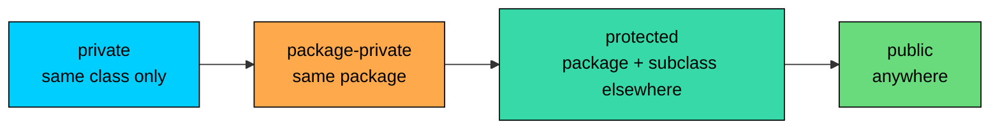
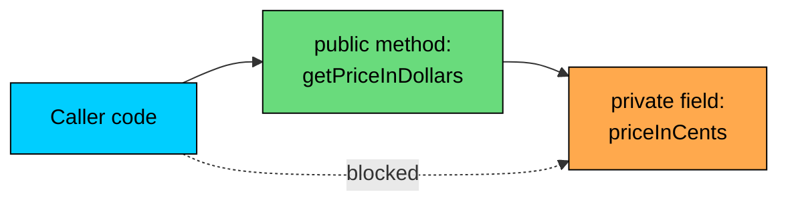
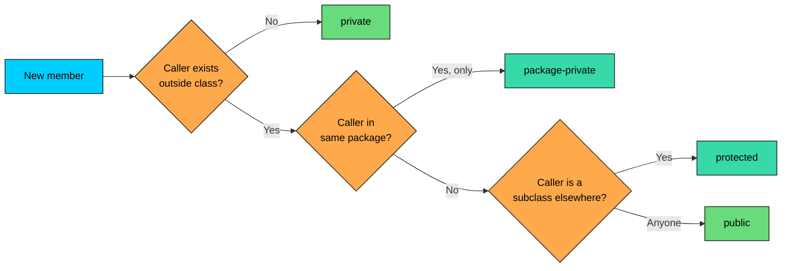

import React from 'react';
import CodeBlock from '../../../../components/ui/CodeBlock';
import Callout from '../../../../components/ui/Callout';

<div className="article-header">
  <div className="breadcrumb">
    <a href="/">Curated Notes</a>
    <span className="breadcrumb-separator">›</span>
    <span className="breadcrumb-current">Access Modifiers</span>
  </div>
  <h1>Access Modifiers</h1>
  <p style={{ color: 'var(--text-muted)', fontSize: '1.1rem', marginBottom: '16px', lineHeight: '1.6' }}>
    Master the essentials of Access Modifiers in this curated guide.
  </p>
  <div className="meta-info">
    <span className="meta-item">
      <svg width="14" height="14" viewBox="0 0 24 24" fill="none" stroke="currentColor" strokeWidth="2"><circle cx="12" cy="12" r="10"/><polyline points="12 6 12 12 16 14"/></svg>
      10 min read
    </span>
    <span className="difficulty-badge difficulty-badge--intermediate">Intermediate</span>
  </div>
</div>

<section className="content-section">

A class usually has parts you want other code to use and parts you'd rather keep to yourself. The price of a `Product` should be safe from random callers overwriting it, but other code still needs to read it through some controlled path. Access modifiers are the keywords Java gives you to draw that line. This lesson covers the four access levels (`public`, `protected`, package-private, `private`), the rules each one enforces, and how to pick the right one for fields, methods, and nested types.

---

## The Four Access Levels

Java has four levels of member access, ordered from most open to most closed:


| Modifier         | Keyword       | Idea                                             |
| ---------------- | ------------- | ------------------------------------------------ |
| Public           | `public`      | Anyone, anywhere                                 |
| Protected        | `protected`   | Same package, plus subclasses in other packages  |
| Package-private  | (no keyword)  | Same package only                                |
| Private          | `private`     | Same class only                                  |


The level applies to whatever it sits in front of: a field, a method, a constructor, or a nested type. Three of them are spelled out as keywords. The fourth, package-private, is the absence of any modifier. Leaving the keyword off doesn't mean "default to public", it means "package-private".

Here's the same class with one field at each access level so you can see the syntax side by side.


```java
public class Product {
    public String name;          // anyone can read or write
    protected double price;      // same package or subclass elsewhere
    int stockCount;              // package-private (no keyword)
    private String internalId;   // only this class

    public static void main(String[] args) {
        Product item = new Product();
        item.name = "Wireless Mouse";
        item.price = 29.99;
        item.stockCount = 50;
        item.internalId = "SKU-9012";
        System.out.println(item.name + " has " + item.stockCount + " in stock.");
    }
}
```


Inside the same class, all four fields are reachable, so the program runs as expected. The differences only show up when code outside the class tries to touch these fields.

---

## The Visibility Matrix

The whole story can be captured in one table. Read it as: "If the member is declared with modifier X, can code in location Y access it?"


| Modifier        | Same class | Same package | Subclass (different package) | Anywhere |
| --------------- | :--------: | :----------: | :--------------------------: | :------: |
| `public`        |    yes     |     yes      |             yes              |   yes    |
| `protected`     |    yes     |     yes      |             yes              |    no    |
| (no modifier)   |    yes     |     yes      |              no              |    no    |
| `private`       |    yes     |      no      |              no              |    no    |


One way to picture this is as four nested rings of trust. Code inside the innermost ring can see everything; each ring outward loses one more level.





Each level is a superset of the one to its left. Whatever `private` allows, package-private also allows. Whatever package-private allows, `protected` also allows. And `public` allows everything the others allow plus the outside world.

---

## `public`: Open to Everyone

A `public` member can be accessed from any code in any package. No restrictions, no inheritance checks, no questions asked.


```java
// in package shop.catalog
public class Product {
    public String name;

    public Product(String name) {
        this.name = name;
    }

    public String describe() {
        return "Product: " + name;
    }
}
```


```java
// in package shop.cart
import shop.catalog.Product;

public class CartDemo {
    public static void main(String[] args) {
        Product item = new Product("USB Cable");
        System.out.println(item.name);       // works: name is public
        System.out.println(item.describe()); // works: describe is public
    }
}
```


Use `public` for things that form your class's contract with the outside world: factory methods, the methods callers are meant to use, constants other code is supposed to read. The cost of `public` is that you're committing to that contract. Once outside code is calling `item.name` directly, you can't rename the field or change its type without breaking every caller.

This is why Java code uses `public` sparingly on fields. Methods, yes, often. Fields, almost never. Methods give you a chance to change the implementation behind them. Fields don't.

---

## `protected`: Package Plus Subclasses

`protected` widens visibility past the package boundary but only for subclasses. Code in the same package can use a `protected` member directly. Code in a different package can use it only if it's inside a class that inherits from the declaring class.


```java
// in package shop.catalog
public class Product {
    protected double price;

    public Product(double price) {
        this.price = price;
    }
}
```


```java
// in package shop.cart
import shop.catalog.Product;

public class DiscountedProduct extends Product {
    public DiscountedProduct(double price) {
        super(price);
    }

    public double halfPrice() {
        return price / 2; // works: subclass can see protected price
    }
}

public class CartOutside {
    public static void main(String[] args) {
        Product item = new Product(29.99);
        // System.out.println(item.price); // compile error: not a subclass
    }
}
```


The subclass `DiscountedProduct` reaches `price` because it inherits from `Product`. `CartOutside`, which is in the same package as `DiscountedProduct` but doesn't extend `Product`, cannot.

Use `protected` when you're designing for inheritance and want to expose some internal state to subclasses without making it public. It's narrower than it sounds, though.


&gt; **INFO**
&gt;
&gt; **Common confusion:** `protected` does not mean "only subclasses". It means "same package plus subclasses elsewhere". A class in the same package can access a `protected` member even without inheriting.


---

## Package-Private: The Default

If you leave the modifier off, the member is **package-private**. Only code in the same package can use it. Subclasses in a different package cannot, even if everything else about them looks similar.


```java
// in package shop.catalog
class Inventory {
    int stockCount;                // package-private field
    String warehouseCode;          // package-private field

    int totalUnits() {             // package-private method
        return stockCount;
    }
}

public class CatalogService {
    public static void main(String[] args) {
        Inventory inv = new Inventory();
        inv.stockCount = 100;           // works: same package
        inv.warehouseCode = "WH-EAST";  // works: same package
        System.out.println(inv.totalUnits());
    }
}
```


Try the same field access from a different package and you get a compile error:


```java
// in package shop.cart
import shop.catalog.Inventory; // also fails: Inventory itself isn't public

public class StockReader {
    public static void main(String[] args) {
        Inventory inv = new Inventory();
        // inv.stockCount = 100; // compile error: stockCount is not visible
    }
}
```


Package-private is the natural fit for classes and members that are implementation details shared across a few files in the same package but not meant for outside callers. A common pattern: one or two `public` classes per package form the entry point, and several package-private helper classes back them up.

Package-private is sometimes called "default access" in older books. Java's official terminology is "package-private".

---

## `private`: Same Class Only

`private` is the strictest level. A `private` member is visible only inside the class that declares it. Not to subclasses, not to other classes in the same package, not to anyone else.


```java
public class Customer {
    private String email;
    private int loyaltyPoints;

    public Customer(String email, int loyaltyPoints) {
        this.email = email;
        this.loyaltyPoints = loyaltyPoints;
    }

    public String describe() {
        return "Customer with " + loyaltyPoints + " points";
    }

    public static void main(String[] args) {
        Customer c = new Customer("alice@example.com", 250);
        System.out.println(c.describe());
        System.out.println(c.email); // works: same class
    }
}
```


Inside `Customer`, the `main` method can touch both fields freely because it's part of the same class. The moment another class tries the same thing, the compiler stops it.

**What's wrong with this code?**


```java
public class CustomerReport {
    public static void main(String[] args) {
        Customer c = new Customer("alice@example.com", 250);
        System.out.println(c.email); // error
    }
}
```


The compiler reports:


```shell
error: email has private access in Customer
        System.out.println(c.email);
                            ^
```


**Fix:** Add a public method on `Customer` that exposes the email, or use the existing `describe` method.


```java
public class Customer {
    private String email;

    public Customer(String email) {
        this.email = email;
    }

    public String getEmail() {
        return email;
    }
}

public class CustomerReport {
    public static void main(String[] args) {
        Customer c = new Customer("alice@example.com");
        System.out.println(c.getEmail()); // works through the public method
    }
}
```


The field stays `private`, but a controlled door to it now exists. Callers go through `getEmail` instead of touching the field directly. If you later change the field's name, format, or type, you only update `getEmail`. Every caller stays the same.


&gt; **INFO**
&gt;
&gt; **Why default to `private`?** When a field is `private`, you can change its name, change its type, replace it with a computed value, or split it across two fields, without breaking a single line of code outside the class. When a field is public, every one of those changes is a public API break. The smaller you keep the surface area, the cheaper your future changes get.


---

## Access Modifiers on Top-Level Classes

The four access modifiers don't all apply to top-level classes (classes declared directly in a file, not nested inside another class). Only two are allowed there:

- `public` means the class is visible from any package.
- No modifier means the class is package-private: visible only inside its own package.

`private` and `protected` are **not** valid on top-level classes. If you write them, the compiler rejects the file.

**What's wrong with this code?**


```java
private class HiddenProduct {  // not allowed
    String name;
}
```


The compiler reports:


```shell
error: modifier private not allowed here
private class HiddenProduct {
        ^
```


**Fix:** Drop the `private` keyword (making the class package-private) or change it to `public` if outside code needs to see it.


```java
class HiddenProduct {          // package-private, OK
    String name;
}

public class CatalogEntry {    // public, OK
    String name;
}
```


The reasoning is straightforward: `private` on a top-level class would mean "visible only inside its own class", which doesn't make sense because the class is the unit of visibility. `protected` on a top-level class would mean "visible to subclasses in other packages", but there's no enclosing class to define what counts as a subclass. Both keywords only have meaning on members and on nested types, which we'll touch on in a moment.

A single Java file can hold one `public` top-level class, plus any number of package-private top-level classes. The `public` class, if there is one, has to match the file name. Most files declare exactly one class, and that's `public`.


```java
// File: Product.java in package shop.catalog
public class Product {
    String name;
}

class InventoryAudit {  // package-private helper, fine in the same file
    int auditCount;
}
```


`Product` is the public face of the file. `InventoryAudit` is a helper that only code in `shop.catalog` can reach.

---

## Access Modifiers on Methods

Methods follow the same four-level rule as fields, and the choice for each method is a design decision. A useful starting position:

- Methods that form the operations callers are supposed to use: `public`.
- Methods that only other classes in the same package should use: package-private.
- Methods that subclasses (possibly in other packages) need to override or call: `protected`.
- Helper methods that nobody outside the class should ever call: `private`.

Here's a class that uses three of the four on its methods.


```java
public class OrderService {
    public void placeOrder(String productName, int quantity) {
        if (!isInStock(productName, quantity)) {
            System.out.println("Out of stock");
            return;
        }
        recordOrder(productName, quantity);
        notifyWarehouse(productName, quantity);
    }

    private boolean isInStock(String productName, int quantity) {
        // pretend we checked a real store
        return quantity <= 10;
    }

    void recordOrder(String productName, int quantity) {
        // package-private: visible to other classes in the same package
        System.out.println("Recorded order: " + quantity + " x " + productName);
    }

    protected void notifyWarehouse(String productName, int quantity) {
        // protected: subclasses can override or call this
        System.out.println("Notify warehouse: " + quantity + " x " + productName);
    }

    public static void main(String[] args) {
        OrderService svc = new OrderService();
        svc.placeOrder("Wireless Mouse", 3);
    }
}
```


`placeOrder` is the public entry point. Callers use it. They don't need to know `isInStock` exists, and they have no business calling it directly, so it's `private`. `recordOrder` is the kind of helper that another class in the same package might want to call for testing or reporting, so it's package-private. `notifyWarehouse` is an extension point: a subclass might override it to send a real message instead of printing, so it's `protected`.

This is the everyday shape of access in a Java class. Start with everything as restrictive as possible. Open it up only when you have an actual caller who needs it.

---

## Access Modifiers on Nested Types

Nested types (classes, interfaces, enums declared inside another class) can use all four modifiers, because unlike top-level types, they sit inside a class that defines what each level means. Here's a quick taste:


```java
public class Order {
    public enum Status {           // public nested enum
        PLACED, SHIPPED, DELIVERED, CANCELLED
    }

    private static class LineItem { // private nested class
        String productName;
        int quantity;
    }

    public Status status;
    private LineItem firstItem;
}
```


`Status` is `public` because callers outside `Order` need to refer to `Order.Status.PLACED`. `LineItem` is `private` because it's an internal helper that callers should never touch directly. They access whatever needs accessing through methods on `Order`.

The point for now: don't be surprised when you see `private class` inside another class, even though `private class HiddenProduct` at the top level was an error. The rules change for nested types because they have an enclosing class.

---

## Why Restrict Access at All?

The four levels aren't there to make life harder. They exist so the class can change without dragging every caller along with it.

Think about a `Product` with a `public double price` field. As long as `price` is public, every place in the codebase can write `item.price = 49.99` or read `item.price` directly. The day you decide prices should be stored in cents instead of dollars (to avoid floating-point rounding errors), or that prices should be currency-aware, every one of those reads and writes breaks. You're rewriting parts of the codebase you didn't know existed.

Now suppose `price` had been `private double priceInCents` from the start, with a `public double getPriceInDollars()` method. Callers use the method. The internal storage is yours. You can switch from a `double` to a `BigDecimal`, you can add currency conversion, you can fetch the price from a database, all without touching a single caller. The method's signature is the contract; the field is none of their business.





The flow on the solid arrows is what's allowed. The dotted arrow is what `private` blocks. Callers can only get to the field through the public method, which is the only path you have to maintain.

There's also a correctness angle. If a `Product`'s `price` must never be negative, a `public` field gives any caller the power to write `item.price = -10` and silently break invariants the class was supposed to guarantee. A `private` field with a setter that checks the value keeps the rule in one place.

The principle has a name, encapsulation, and it shows up across virtually every Java codebase you'll work in. For now, the practical rule is enough: **default to `private` for fields**, and expose behavior through methods.

---

## A Realistic Example

To pull the pieces together, here's a `ShoppingCart` class that uses three of the four access levels deliberately.


```java
public class ShoppingCart {
    private double subtotal;              // internal state, hidden
    private int itemCount;                // internal state, hidden
    protected String currencyCode;        // subclasses may want to read this

    public ShoppingCart(String currencyCode) {
        this.currencyCode = currencyCode;
        this.subtotal = 0.0;
        this.itemCount = 0;
    }

    public void addItem(double price, int quantity) {
        if (price < 0 || quantity < 1) {
            return; // ignore invalid input
        }
        subtotal += price * quantity;
        itemCount += quantity;
    }

    public double getSubtotal() {
        return subtotal;
    }

    public int getItemCount() {
        return itemCount;
    }

    void debugDump() {
        // package-private: useful for testing, not for outside callers
        System.out.println("DEBUG: subtotal=" + subtotal + ", items=" + itemCount);
    }

    private double computeTaxRate() {
        // helper used only by other methods in this class
        return 0.08;
    }

    public double getTotalWithTax() {
        return subtotal + subtotal * computeTaxRate();
    }

    public static void main(String[] args) {
        ShoppingCart cart = new ShoppingCart("USD");
        cart.addItem(29.99, 2);
        cart.addItem(9.99, 1);
        System.out.println("Items: " + cart.getItemCount());
        System.out.println("Subtotal: $" + cart.getSubtotal());
        System.out.println("Total with tax: $" + cart.getTotalWithTax());
    }
}
```


A few things about the choices:

- `subtotal` and `itemCount` are `private`. Callers should never reach in and overwrite them. The class is responsible for keeping them in sync, and it does that through `addItem`.
- `currencyCode` is `protected`. If a future `InternationalCart` subclass needs to vary tax behavior by currency, it can read the field directly. If `currencyCode` had been `private`, the subclass would need to call a method instead.
- `addItem`, `getSubtotal`, `getItemCount`, and `getTotalWithTax` are `public`. They're the contract.
- `debugDump` is package-private. A test class in the same package can call it; callers from outside cannot.
- `computeTaxRate` is `private`. It's an implementation detail that has no business existing in the public API. If we replaced it tomorrow with a database lookup, the public methods would look exactly the same to callers.

The class makes a deliberate statement about what it owns and what it lets outside code see. That's what access modifiers are for.

---

## Practical Guidance

A few rules of thumb that hold up in almost every Java codebase:

- **Default to `private` for fields.** Open them up only when you need to. Even within the same class, prefer accessing your own fields by name rather than building habits that depend on access being looser than it has to be.
- **Default to `private` for helper methods too.** A method that only one other method in the class calls has no business being `public`. The smaller your public surface, the easier the class is to refactor.
- **Default to `public` for the methods that represent your class's contract.** Constructors that callers are supposed to use, the operations you want to advertise, the constants that other code reads.
- **Use package-private when a small group of cooperating classes share something the rest of the world shouldn't see.** This is common for test helpers, internal utility classes, and the implementation details of a feature.
- **Use `protected` only when designing for inheritance.** It says "subclasses may need this", which is a stronger promise than `public` because changing a `protected` member can break subclasses you don't even know exist.

The smallest access level that lets your code work is almost always the right one. If a question comes up later about whether to open something up, you can always loosen it then. Tightening access on a member with hundreds of callers is much harder than starting tight and loosening as needed.





Walking the flow from `New member` outward, you pick the most restrictive level that still covers your callers. Most fields end at `private`. Most helper methods end at `private` or package-private. Most contract methods end at `public`. `protected` is rarer and usually a deliberate choice.

</section>
