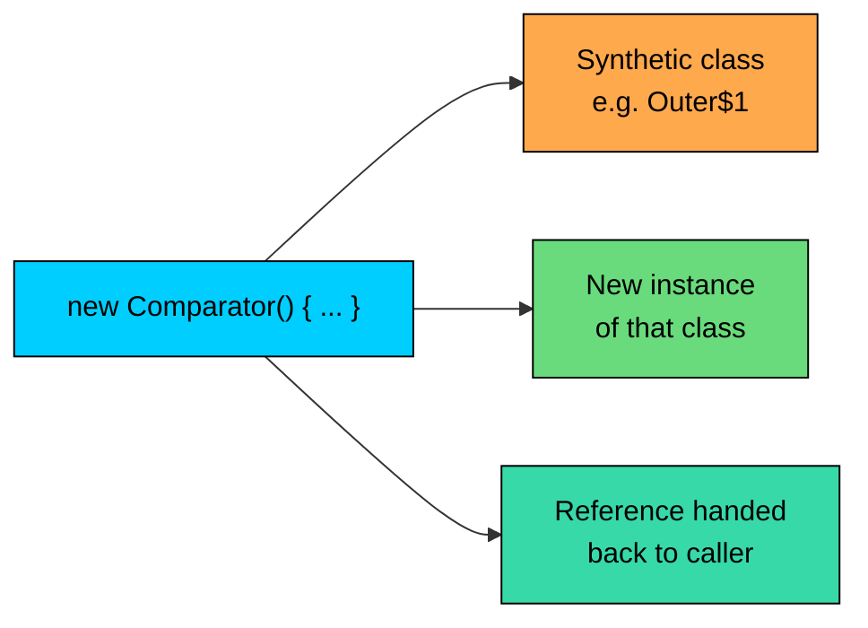
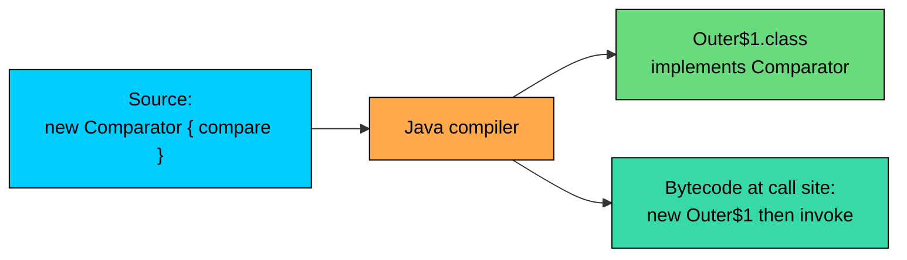

import React from 'react';
import CodeBlock from '../../../../components/ui/CodeBlock';
import Callout from '../../../../components/ui/Callout';

<div className="article-header">
  <div className="breadcrumb">
    <a href="/">Curated Notes</a>
    <span className="breadcrumb-separator">›</span>
    <span className="breadcrumb-current">Anonymous Classes</span>
  </div>
  <h1>Anonymous Classes</h1>
  <p style={{ color: 'var(--text-muted)', fontSize: '1.1rem', marginBottom: '16px', lineHeight: '1.6' }}>
    Master the essentials of Anonymous Classes in this curated guide.
  </p>
  <div className="meta-info">
    <span className="meta-item">
      <svg width="14" height="14" viewBox="0 0 24 24" fill="none" stroke="currentColor" strokeWidth="2"><circle cx="12" cy="12" r="10"/><polyline points="12 6 12 12 16 14"/></svg>
      10 min read
    </span>
    <span className="difficulty-badge difficulty-badge--intermediate">Intermediate</span>
  </div>
</div>

<section className="content-section">

Some classes exist for exactly one purpose, in exactly one place, and never get used again. Writing a full named class for a one-off use is a lot of ceremony for very little payoff. Anonymous classes are Java's answer to that: they let you declare a class, instantiate it, and use the instance in one expression. This lesson walks through the syntax, what the compiler actually produces, the rules around captured variables, and the limits that anonymous classes hit when you try to push them too far.

---

## The Problem Anonymous Classes Solve

Consider a list of products you want to sort by price for a single screen in your app. The standard way to sort by a custom rule is to pass a `Comparator` to `Collections.sort`. A `Comparator` is an interface with a `compare` method that returns a negative, zero, or positive number depending on which item should come first.

Without anonymous classes, you have to declare a separate class for the comparator.


```java
import java.util.ArrayList;
import java.util.Collections;
import java.util.List;

public class SortByPriceNamed {
    static class Product {
        String name;
        double price;
        Product(String name, double price) {
            this.name = name;
            this.price = price;
        }
    }

    static class ProductPriceComparator implements java.util.Comparator<Product> {
        @Override
        public int compare(Product a, Product b) {
            return Double.compare(a.price, b.price);
        }
    }

    public static void main(String[] args) {
        List<Product> cart = new ArrayList<>();
        cart.add(new Product("Headphones", 49.99));
        cart.add(new Product("USB Cable", 9.99));
        cart.add(new Product("Wireless Mouse", 29.99));

        Collections.sort(cart, new ProductPriceComparator());

        for (Product p : cart) {
            System.out.println(p.name + " $" + p.price);
        }
    }
}
```


This works, but `ProductPriceComparator` is a whole top-level idea (a class with a name and a file location) for one line of logic that's only used once. If you needed a different sort order on the next screen (by name, by rating, by stock), you'd be writing a new named class every time. That's a lot of files for what is, at heart, three lines of comparison code.

An anonymous class lets you skip the naming step. You declare the class right where you need an instance of it.


```java
import java.util.ArrayList;
import java.util.Collections;
import java.util.Comparator;
import java.util.List;

public class SortByPriceAnonymous {
    static class Product {
        String name;
        double price;
        Product(String name, double price) {
            this.name = name;
            this.price = price;
        }
    }

    public static void main(String[] args) {
        List<Product> cart = new ArrayList<>();
        cart.add(new Product("Headphones", 49.99));
        cart.add(new Product("USB Cable", 9.99));
        cart.add(new Product("Wireless Mouse", 29.99));

        Collections.sort(cart, new Comparator<Product>() {
            @Override
            public int compare(Product a, Product b) {
                return Double.compare(a.price, b.price);
            }
        });

        for (Product p : cart) {
            System.out.println(p.name + " $" + p.price);
        }
    }
}
```


Same output, no separate `ProductPriceComparator` class. The block starting with `new Comparator<Product>() { ... }` is the anonymous class: it defines a class that implements `Comparator<Product>`, builds one instance of that class, and hands that instance to `Collections.sort`. The class itself has no name you can refer to.

---

## The Syntax

There are two shapes for an anonymous class, depending on whether you're implementing an interface or extending a class.


```shell
// Form 1: implement an interface
new SomeInterface() {
    // method overrides
}

// Form 2: extend a class
new SomeClass(constructorArgs) {
    // method overrides or new methods
}
```


In both cases, the `new` keyword does three things at once: it declares the anonymous class, instantiates it, and gives you back the reference. The braces after the parentheses hold the class body, exactly like a named class body, with field declarations, methods, and initializer blocks.

A small breakdown of what a single anonymous-class expression contains.





The diagram says it visually: one expression, three results. When you write `new Comparator<Product>() { ... }`, the compiler invents a class for you, builds one instance of it, and gives you back the reference. You can ignore the class part and use the reference directly, which is what makes the syntax compact.

A smaller example that doesn't depend on collections. If you have a `Runnable` you want to use once:


```java
public class GreetingRunner {
    public static void main(String[] args) {
        Runnable greeting = new Runnable() {
            @Override
            public void run() {
                System.out.println("Welcome to AlgoMart!");
            }
        };
        greeting.run();
    }
}
```


`Runnable` is a built-in interface with one method: `run`. The anonymous class implements it, prints a line, and gets stored in `greeting`. Calling `greeting.run()` invokes the body of the anonymous class.

---

## What the Compiler Actually Generates

An anonymous class isn't magic. The compiler turns it into a real class with a synthetic name. If your file is `Outer.java`, the first anonymous class declared inside `Outer` becomes a class file named `Outer$1.class`, the second becomes `Outer$2.class`, and so on. The number reflects declaration order in the source file, not call order at runtime.

Take the sort example. After compilation, you'd see something like:


```shell
SortByPriceAnonymous.class
SortByPriceAnonymous$1.class       // the anonymous Comparator<Product>
SortByPriceAnonymous$Product.class
```


The `$1` file holds the class the compiler generated from `new Comparator<Product>() { ... }`. It implements `Comparator<Product>`, has the `compare` method you wrote, and ends up being a perfectly normal class as far as the JVM is concerned. The only odd thing is the name, which you can't write in source code.





Why does this matter? Two practical reasons. First, when you see `MyApp$1` in a stack trace, that's an anonymous class showing up by its compiler-generated name. Second, knowing the compiler builds a real class explains why anonymous classes can have fields and constructors-via-initializers, and why they participate in the type system like any other class.

---

## Implementing an Interface

Implementing an interface is the most common use of anonymous classes. The shape is `new SomeInterface() { /* override methods */ }`. Because interfaces don't have constructors, the parentheses after the type name are always empty.

Here's a cart example with a custom filter. To find expensive items (price above some threshold) for a "review your big purchases" screen: You could write a `Predicate<Product>` interface and pass an anonymous implementation.


```java
import java.util.ArrayList;
import java.util.List;
import java.util.function.Predicate;

public class ExpensiveItems {
    static class Product {
        String name;
        double price;
        Product(String name, double price) {
            this.name = name;
            this.price = price;
        }
    }

    public static void main(String[] args) {
        List<Product> cart = new ArrayList<>();
        cart.add(new Product("USB Cable", 9.99));
        cart.add(new Product("Headphones", 49.99));
        cart.add(new Product("Wireless Mouse", 29.99));
        cart.add(new Product("4K Monitor", 299.00));

        Predicate<Product> expensive = new Predicate<Product>() {
            @Override
            public boolean test(Product product) {
                return product.price > 50.0;
            }
        };

        for (Product p : cart) {
            if (expensive.test(p)) {
                System.out.println("Big purchase: " + p.name + " $" + p.price);
            }
        }
    }
}
```


`Predicate<Product>` is a built-in interface with a single method `test` that takes a value and returns a `boolean`. The anonymous class implements `test` and gets stored in the local variable `expensive`. From the loop's point of view, `expensive` is just a `Predicate<Product>`. It doesn't care whether the implementation came from an anonymous class, a named class, or somewhere else.

You can implement interfaces with more than one method too, but you have to override every method that doesn't have a default implementation. For interfaces with a single abstract method (functional interfaces), the anonymous class form is the historical way to provide an implementation. Lambdas are the next-generation, shorter alternative for that single case, but anonymous classes are still needed when you have to override more than one method or want to add fields.

---

## Subclassing a Class

The second form extends an existing class instead of implementing an interface. The parentheses can take arguments, which get forwarded to a constructor of the parent class.

Consider a `Logger` class that prints messages with a prefix, and on one screen you want a one-off version that adds a timestamp to every line. You can subclass `Logger` inline.


```java
public class StoreLogger {
    static class Logger {
        String prefix;

        Logger(String prefix) {
            this.prefix = prefix;
        }

        void log(String message) {
            System.out.println(prefix + ": " + message);
        }
    }

    public static void main(String[] args) {
        Logger normal = new Logger("CART");
        normal.log("Item added");

        Logger timestamped = new Logger("CART") {
            @Override
            void log(String message) {
                long now = System.currentTimeMillis();
                System.out.println("[" + now + "] " + prefix + ": " + message);
            }
        };
        timestamped.log("Item added");
    }
}
```


**Output (timestamp value will differ):**


```shell
CART: Item added
[1715600000000] CART: Item added
```


The expression `new Logger("CART") { ... }` does three things: it invokes the `Logger(String)` constructor with the argument `"CART"`, declares a new class that extends `Logger`, and creates one instance of that subclass. Inside the override of `log`, the field `prefix` is the one inherited from `Logger`, which got set by the parent's constructor.

This is the form you use when you need to override a method on a concrete or abstract class for just one place. The parent class can be abstract, in which case you must override every abstract method, or it can be concrete, in which case you only override what you want to change.

---

## Capturing Local Variables

An anonymous class declared inside a method can use the enclosing method's local variables, but only if those variables are `final` or effectively final. "Effectively final" means the compiler can see that you never assigned to the variable after its initial assignment. You don't have to write the `final` keyword; you just have to not reassign the variable.

This rule exists because, internally, the anonymous class captures a copy of the variable's value at the moment the instance is created. If the local variable could change after capture, the copy inside the anonymous class would silently drift away from the original. Java avoids that confusion by forbidding the case entirely.

A working example: a one-off button-style listener that prints which customer placed an order.


```java
public class OrderListener {
    interface OrderEventListener {
        void onOrderPlaced(int orderId);
    }

    public static void main(String[] args) {
        String customerName = "Alice";

        OrderEventListener listener = new OrderEventListener() {
            @Override
            public void onOrderPlaced(int orderId) {
                System.out.println(customerName + " placed order " + orderId);
            }
        };

        listener.onOrderPlaced(1042);
    }
}
```


`customerName` is a local variable of `main`. The anonymous class uses it inside `onOrderPlaced`. Because `customerName` is never reassigned, it's effectively final, and the capture works.

Now look at what breaks the rule.

**What's wrong with this code?**


```java
public class BrokenCapture {
    interface OrderEventListener {
        void onOrderPlaced(int orderId);
    }

    public static void main(String[] args) {
        String customerName = "Alice";
        customerName = "Bob"; // reassignment breaks "effectively final"

        OrderEventListener listener = new OrderEventListener() {
            @Override
            public void onOrderPlaced(int orderId) {
                System.out.println(customerName + " placed order " + orderId);
                // Compile error: local variable customerName defined in an
                // enclosing scope must be final or effectively final
            }
        };

        listener.onOrderPlaced(1042);
    }
}
```


**Fix:** stop reassigning the variable, or move the value into a new variable that you don't reassign.


```java
public class FixedCapture {
    interface OrderEventListener {
        void onOrderPlaced(int orderId);
    }

    public static void main(String[] args) {
        String chosenName = "Bob"; // never reassigned

        OrderEventListener listener = new OrderEventListener() {
            @Override
            public void onOrderPlaced(int orderId) {
                System.out.println(chosenName + " placed order " + orderId);
            }
        };

        listener.onOrderPlaced(1042);
    }
}
```


The rule applies to every local variable the anonymous class touches, including parameters of the enclosing method (parameters are local variables that just happen to have a starting value).

A common follow-up question: what if you really do need a value the anonymous class can update? The standard pattern is to wrap the value in a one-element array or in an object with a mutable field. That's a workaround, not a fix to the language rule, but it covers the cases where you actually need shared mutable state.

---

## Access to Enclosing-Class Members

When an anonymous class is declared inside an instance method, it has access to the enclosing instance's fields and methods, similar to inner classes. The anonymous class holds a hidden reference to the outer instance, and it can read or call any member of that instance, including `private` ones. This section just shows the form that comes up most often with anonymous classes.

Here's an example. A `CartManager` instance method registers a small "after add" hook that logs the cart owner's name. The hook is an anonymous class, and inside `onItemAdded` it reads the enclosing `CartManager`'s `customerName` field.


```java
public class CartManager {
    interface CartHook {
        void onItemAdded(String item);
    }

    private String customerName;

    public CartManager(String customerName) {
        this.customerName = customerName;
    }

    public CartHook buildAddLogger() {
        return new CartHook() {
            @Override
            public void onItemAdded(String item) {
                System.out.println(customerName + " added " + item);
            }
        };
    }

    public static void main(String[] args) {
        CartManager manager = new CartManager("Alice");
        CartHook hook = manager.buildAddLogger();
        hook.onItemAdded("Wireless Mouse");
        hook.onItemAdded("USB Cable");
    }
}
```


`buildAddLogger` is an instance method on `CartManager`. The anonymous class inside it can read `customerName`, the enclosing instance's field, with no extra ceremony. That field isn't a local variable, so the "effectively final" rule doesn't apply: fields belong to the object and can change freely.

One point about `this` inside the anonymous class. Writing `this` from inside the anonymous class refers to the anonymous-class instance, not the enclosing `CartManager`. To refer to the enclosing instance, write `CartManager.this`.

**What's wrong with this code?**


```java
public class WrongThis {
    String label = "outer";

    void run() {
        Runnable task = new Runnable() {
            String label = "inner";

            @Override
            public void run() {
                // Intent: print the outer label. Actually prints the inner one.
                System.out.println(this.label);
            }
        };
        task.run();
    }

    public static void main(String[] args) {
        new WrongThis().run();
    }
}
```


**Output (which is the bug):**


```shell
inner
```


**Fix:** use the qualified form `WrongThis.this.label` to reach the enclosing instance's field.


```java
public class FixedThis {
    String label = "outer";

    void run() {
        Runnable task = new Runnable() {
            String label = "inner";

            @Override
            public void run() {
                System.out.println(FixedThis.this.label);
            }
        };
        task.run();
    }

    public static void main(String[] args) {
        new FixedThis().run();
    }
}
```


`this` inside an anonymous class always means the anonymous instance. The enclosing object lives behind `EnclosingClassName.this`. The trap is real: when both classes have a field with the same name, the inner one wins under `this`, and the bug only shows up at runtime as a wrong value, not a compile error.

---

## Limits of Anonymous Classes

Anonymous classes can do a lot, but the language draws several lines around them.

#### No Named Constructor

An anonymous class can't declare a constructor with its own parameter list. There's no name to put before the parentheses. The expression `new ParentClass(args) { ... }` does pass `args` to the parent's constructor, but the anonymous subclass itself can't add a different constructor with its own arguments.

If you need to set up fields specific to the anonymous class, the workaround is an **instance initializer block**: a `{ ... }` block inside the class body (not a method) that runs after the parent constructor.


```java
import java.util.HashMap;
import java.util.Map;

public class CartInitializer {
    public static void main(String[] args) {
        Map<String, Double> sampleCart = new HashMap<String, Double>() {
            {
                put("Wireless Mouse", 29.99);
                put("USB Cable", 9.99);
            }
        };

        for (Map.Entry<String, Double> entry : sampleCart.entrySet()) {
            System.out.println(entry.getKey() + " -> $" + entry.getValue());
        }
    }
}
```


**Output (order may vary):**


```shell
USB Cable -> $9.99
Wireless Mouse -> $29.99
```


The braces inside the anonymous class body, before any method, form an instance initializer. They run as part of construction. This pattern was a popular shortcut for initializing collections inline before Java 9's `Map.of` and `List.of` factory methods made it unnecessary. The pattern still works, but it does carry a small cost.

Every "double-brace" initializer like this produces an anonymous subclass of `HashMap`. The subclass holds a hidden reference to the enclosing instance, which can keep objects alive longer than expected and increase memory pressure if you create thousands of these. For modern Java, prefer `Map.of(...)` or build the map in a static helper method.

#### No Static Members (Except Constants)

An anonymous class can't declare static methods, and it can't declare static fields unless they're compile-time constants (`static final` with a literal value or a constant expression). The rule comes from the fact that the anonymous class doesn't have a usable name, so there's nothing to put before `.staticMember` to refer to such a member from the outside.


```java
public class NoStaticHere {
    interface Greeting {
        void greet();
    }

    public static void main(String[] args) {
        Greeting hello = new Greeting() {
            static final String DEFAULT = "Hello"; // OK: compile-time constant

            // static int counter = 0;   // Compile error
            // static void helper() {}   // Compile error

            @Override
            public void greet() {
                System.out.println(DEFAULT + ", customer!");
            }
        };
        hello.greet();
    }
}
```


The `static final String DEFAULT` is fine because it's a constant. A non-final static field or a regular static method would not compile. The error is essentially "anonymous classes cannot have static declarations".

#### One Type, Not Two

An anonymous class can extend exactly one class **or** implement exactly one interface. It can't do both, and it can't implement two interfaces at once. If you need that flexibility, declare a named class.


```shell
// Legal:
new Comparator<Product>() { ... }        // implements one interface
new Logger("CART") { ... }               // extends one class

// Not legal as anonymous classes:
// new Comparator<Product>(), Runnable { ... }   // two interfaces: no syntax for this
// new Logger("CART") implements Runnable { ... } // class + interface: no syntax for this
```


This is rarely a real-world blocker, because the situations where you'd want an inline class implementing two interfaces are uncommon. When you do hit it, the answer is to extract a named class.

#### A Quick Summary of the Limits


| Limit | What it means |
| --- | --- |
| No named constructor | Use an instance initializer block to set up state. |
| No static methods, no non-constant static fields | The class has no callable name from outside. |
| Only one supertype | Pick one class or one interface. No combinations. |
| Can't be reused | The class has no name; each `new ... { ... }` expression is a different class. |
| Cannot capture mutable locals | Captured locals must be final or effectively final. |


---

## Anonymous Classes vs Lambdas

When the anonymous class implements a functional interface (one abstract method), Java 8 and later let you replace it with a lambda. The lambda form is shorter and avoids the synthetic class file in most cases. The sort example from earlier looks like this with a lambda:


```java
Collections.sort(cart, (a, b) -> Double.compare(a.price, b.price));
```


That's one line instead of five.

That said, anonymous classes are still useful in three situations:

- **You're implementing an abstract class**, not an interface. Lambdas only work for functional interfaces.
- **You need to override more than one method**, or override a method on top of providing a new one. Lambdas can only define one method.
- **You need fields or instance state inside the implementation.** Lambdas don't have their own fields; they only capture from the enclosing scope.

If none of those apply and the interface has a single abstract method, prefer a lambda. If any of them apply, use an anonymous class.

A side-by-side comparison for the comparator case.


| Aspect | Anonymous class | Lambda |
| --- | --- | --- |
| Syntax length | Several lines | One line |
| Generates a class file | Yes (`Outer$1.class`) | No, uses `invokedynamic` |
| `this` inside | The anonymous instance | The enclosing instance |
| Can have fields | Yes | No |
| Works with interfaces | Any number of methods | Single abstract method only |
| Works with abstract classes | Yes | No |


The table is a quick decision tool: when the right column doesn't fit your case, the left column still does.

---

## A Worked Example

To pull the pieces together, here's a program that uses anonymous classes in two different ways: once to provide a custom sort order, and once to register a one-off event listener.


```java
import java.util.ArrayList;
import java.util.Collections;
import java.util.Comparator;
import java.util.List;

public class CheckoutDemo {
    interface OrderEventListener {
        void onOrderPlaced(int orderId, double total);
    }

    static class Product {
        String name;
        double price;
        int rating;
        Product(String name, double price, int rating) {
            this.name = name;
            this.price = price;
            this.rating = rating;
        }
    }

    public static void main(String[] args) {
        List<Product> cart = new ArrayList<>();
        cart.add(new Product("Headphones", 49.99, 4));
        cart.add(new Product("USB Cable", 9.99, 5));
        cart.add(new Product("Wireless Mouse", 29.99, 5));

        // 1. Sort by rating descending using an anonymous Comparator.
        Collections.sort(cart, new Comparator<Product>() {
            @Override
            public int compare(Product a, Product b) {
                return Integer.compare(b.rating, a.rating);
            }
        });

        System.out.println("Sorted by rating:");
        for (Product p : cart) {
            System.out.println("  " + p.name + " (" + p.rating + " stars)");
        }

        // 2. Register an order listener that captures a local variable.
        String storeName = "AlgoMart";

        OrderEventListener listener = new OrderEventListener() {
            @Override
            public void onOrderPlaced(int orderId, double total) {
                System.out.println(storeName + " confirms order " + orderId + " for $" + total);
            }
        };

        double cartTotal = 0;
        for (Product p : cart) {
            cartTotal += p.price;
        }
        listener.onOrderPlaced(1042, cartTotal);
    }
}
```


Two anonymous classes, two roles. The first one implements `Comparator<Product>` for a one-time sort. The second implements `OrderEventListener` and captures the local `storeName`, which is effectively final because it's never reassigned. Neither anonymous class deserves a separate file with its own name, and pulling them inline keeps the logic right next to the call site that needs it.

</section>
