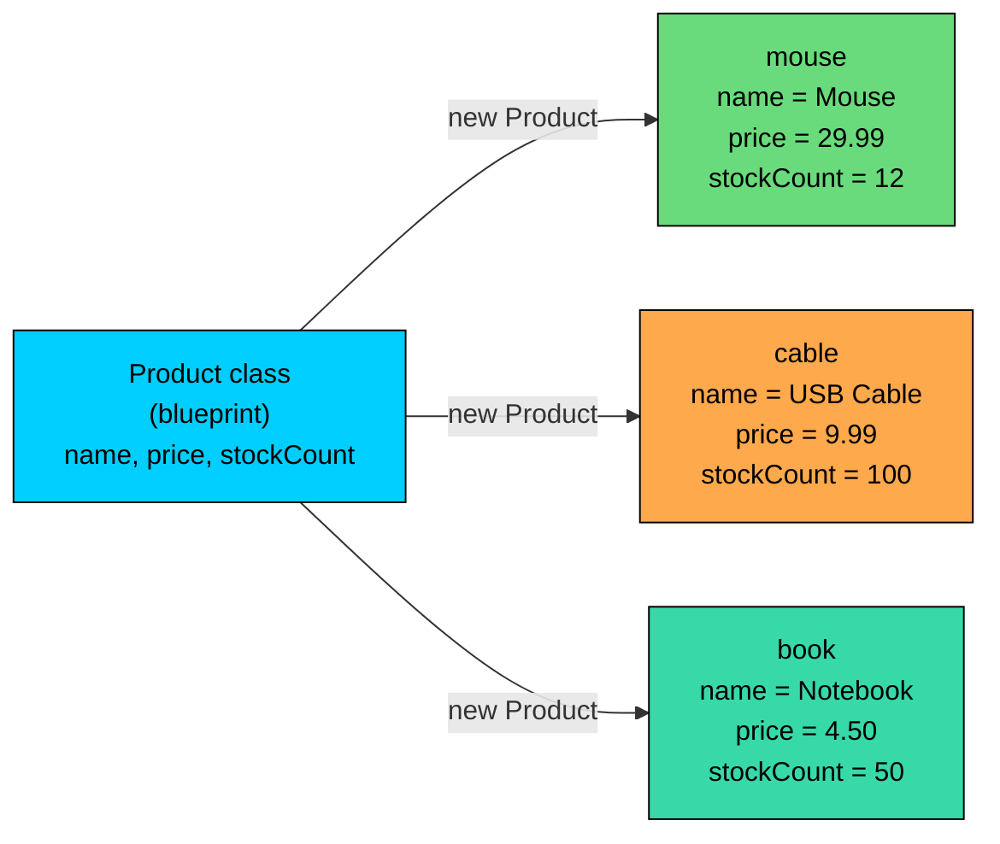
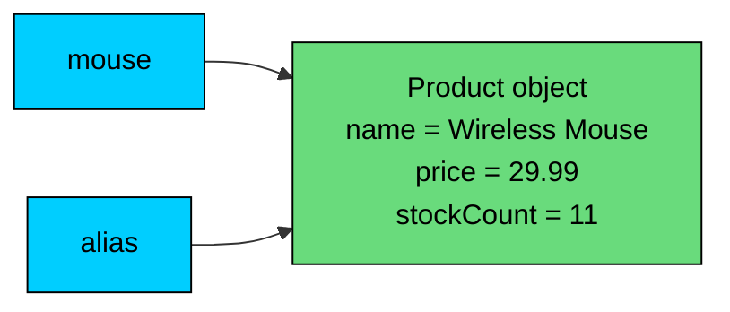
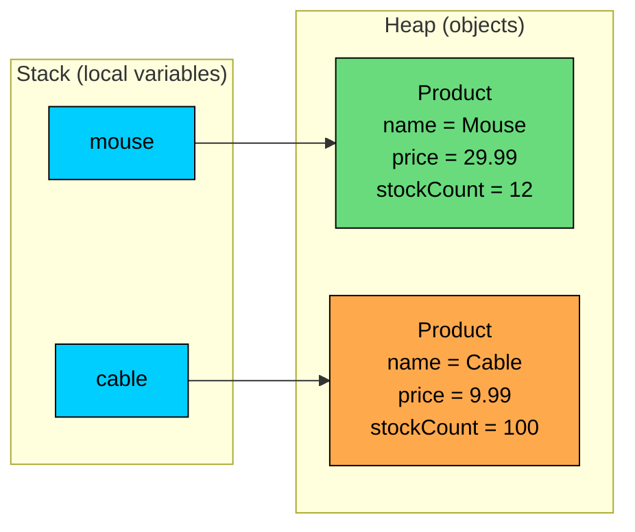

import React from 'react';
import CodeBlock from '../../../../components/ui/CodeBlock';
import Callout from '../../../../components/ui/Callout';

<div className="article-header">
  <div className="breadcrumb">
    <a href="/">Curated Notes</a>
    <span className="breadcrumb-separator">›</span>
    <span className="breadcrumb-current">Classes & Objects</span>
  </div>
  <h1>Classes & Objects</h1>
  <p style={{ color: 'var(--text-muted)', fontSize: '1.1rem', marginBottom: '16px', lineHeight: '1.6' }}>
    Master the essentials of Classes & Objects in this curated guide.
  </p>
  <div className="meta-info">
    <span className="meta-item">
      <svg width="14" height="14" viewBox="0 0 24 24" fill="none" stroke="currentColor" strokeWidth="2"><circle cx="12" cy="12" r="10"/><polyline points="12 6 12 12 16 14"/></svg>
      10 min read
    </span>
    <span className="difficulty-badge difficulty-badge--intermediate">Intermediate</span>
  </div>
</div>

<section className="content-section">

Up to this point, every program in the course has worked with primitives, arrays, and `static` methods. That's fine for small calculations, but real software models things: products, customers, orders, reviews. Java describes what one of those things looks like, and then builds as many of them as needed from that description. The description is a **class**. Each thing built from it is an **object**. This lesson covers what classes and objects are, how to define one, how to create instances, how their fields and methods are accessed, and what happens in memory when two variables point at the same object.

---

## A Class Is a Blueprint

A class is a template that says: "Anything of this kind has these fields and supports these actions." It's a description, not a thing. Writing a `Product` class doesn't bring any products into existence. It only tells Java what a product looks like and what a product can do.

The class is like a form for an online store's product page. The form has empty boxes for name, price, and stock count. The form itself doesn't sell anything. To list an actual product, copy the form and fill in the boxes. Each filled-in copy is a separate product.

Here's the smallest useful class in this lesson:


```java
public class Product {
    public String name;
    public double price;
    public int stockCount;
}
```


That's the whole declaration. Three pieces:

- `public class Product` introduces a class named `Product`.
- The three lines inside the braces are **fields**, also called **instance variables**. They are the boxes on the form. Every product built from this class will have its own copy of `name`, `price`, and `stockCount`.
- There are no methods yet. That's fine. A class can have only fields, only methods, or both.

By itself, this class doesn't run anything. To use it, another class with a `main` method creates products.

---

## An Object Is an Instance

An **object** is a concrete thing built from a class. The class is the recipe; the object is the cake. An object comes into existence with the `new` keyword followed by the class name and parentheses.


```java
public class CreateOneProduct {
    public static void main(String[] args) {
        Product mouse = new Product();
        mouse.name = "Wireless Mouse";
        mouse.price = 29.99;
        mouse.stockCount = 12;

        System.out.println("Name: " + mouse.name);
        System.out.println("Price: $" + mouse.price);
        System.out.println("Stock: " + mouse.stockCount);
    }
}
```


Two things happen in the line `Product mouse = new Product();`. The right side, `new Product()`, asks Java to build a brand new `Product` object. The left side, `Product mouse`, declares a variable of type `Product` that holds a reference to that new object. `mouse.name`, `mouse.price`, and `mouse.stockCount` read and write the object's fields.

The dot (`.`) reaches into an object. `mouse.name` means: "the `name` field of the object that `mouse` points to."

For a second product, run `new Product()` again. The two objects don't share anything:


```java
public class TwoProducts {
    public static void main(String[] args) {
        Product mouse = new Product();
        mouse.name = "Wireless Mouse";
        mouse.price = 29.99;
        mouse.stockCount = 12;

        Product cable = new Product();
        cable.name = "USB Cable";
        cable.price = 9.99;
        cable.stockCount = 100;

        System.out.println(mouse.name + " - $" + mouse.price);
        System.out.println(cable.name + " - $" + cable.price);
    }
}
```


Each `new Product()` produces an independent object. Setting `cable.name` does nothing to `mouse.name`. They are separate copies of the form, each with their own boxes.


&gt; **INFO**
&gt;
&gt; The class file (`Product.java`) and the file with `main` can be the same file or different files. As long as they compile together, `new Product()` works. For brevity, several examples in this lesson keep both classes in one file by making `Product` non-`public`. Both styles are fine for learning.


---

## Class vs Object: Keep the Distinction Clear

A class is a **type**. An object is a **runtime entity** of that type. The word "Product" in `Product mouse = new Product();` shows up twice for different reasons:

- The first `Product` (before `mouse`) is the type of the variable. It tells Java that `mouse` will refer to a `Product`-shaped object.
- The second `Product()` (after `new`) tells Java which class to build a new object from.

The class lives in the source code and the compiled `.class` file. It's loaded once when the program runs. Objects come and go as the program executes. Thousands of `Product` objects can be created from the one `Product` class, just as a clothing factory can stitch thousands of identical shirts from one pattern.





One class, three independent objects. Each object has its own copy of the fields, holding its own values. Adding a fourth product would create another box on the right without changing anything in the blueprint or the existing boxes.

A handy way to read code: `new ClassName()` brings a brand new object into existence and the expression evaluates to a reference to it. Anywhere else a class name appears (like `Product mouse`), it's being used as a type.

---

## Fields: What an Object Holds

The fields of a class are the values each object stores. They're declared inside the class body, outside any method, with the same syntax as a local variable: a type followed by a name.


```java
public class Customer {
    public String name;
    public String email;
    public int loyaltyPoints;
    public boolean isActive;
}
```


Each `Customer` object will carry its own `name`, `email`, `loyaltyPoints`, and `isActive`. The values are stored on the object itself, which is why they're called **instance variables**, one set per instance.

Reading or writing a field uses the object reference, a dot, and the field name:


```java
public class CustomerDemo {
    public static void main(String[] args) {
        Customer alice = new Customer();
        alice.name = "Alice";
        alice.email = "alice@example.com";
        alice.loyaltyPoints = 150;
        alice.isActive = true;

        System.out.println(alice.name + " has " + alice.loyaltyPoints + " points.");
        System.out.println("Active? " + alice.isActive);
    }
}
```


Fields are marked `public` for now so they can be read and written directly from outside the class. That's the simplest setup for learning, but it's also the most permissive. The Access Modifiers lesson covers `private`, `protected`, and package-private fields, and the Getters & Setters lesson covers the standard pattern of guarding field access with methods. For this chapter, `public` keeps the focus on what classes and objects actually are.

#### Default Field Values

Creating an object with `new` doesn't leave fields uninitialized. Every field gets a well-defined default based on its type, before any user code runs.


| Field type | Default value |
| --- | --- |
| `byte`, `short`, `int`, `long` | `0` |
| `float`, `double` | `0.0` |
| `char` | `'\u0000'` (the null character) |
| `boolean` | `false` |
| Any reference type (`String`, `Product`, arrays, etc.) | `null` |


This applies only to fields, not to local variables inside methods. Local variables have no default and must be assigned before they're read.


```java
public class DefaultFields {
    public static void main(String[] args) {
        Product blank = new Product();
        System.out.println("name: " + blank.name);
        System.out.println("price: " + blank.price);
        System.out.println("stock: " + blank.stockCount);
    }
}
```


No fields were assigned on `blank`, but reading them is legal and returns the defaults. `name` is `null` because `String` is a reference type. `price` is `0.0` because `double` defaults to `0.0`. `stockCount` is `0` because `int` defaults to `0`.

The defaults are convenient, but they're rarely the values a product or customer should have. A real `Product` with `name = null` and `price = 0.0` isn't a meaningful product. The next lesson covers constructors, which require the caller to provide sensible values when creating an object so blank instances don't end up floating around.

---

## Methods: What an Object Can Do

Fields describe what an object knows. Methods describe what an object can do. A method declared inside a class without `static` is an **instance method**, and it operates on whichever object it's called on.


```java
public class Product {
    public String name;
    public double price;
    public int stockCount;

    public void printSummary() {
        System.out.println(name + " - $" + price + " (" + stockCount + " in stock)");
    }

    public double totalValue() {
        return price * stockCount;
    }
}
```


Two new things here. `printSummary` is a method that prints a one-line description. `totalValue` returns the dollar value sitting in stock for that product. Both methods refer to `name`, `price`, and `stockCount` without an object name in front. Inside an instance method, those names refer to the fields of whichever object the method was called on.


```java
public class ProductMethodsDemo {
    public static void main(String[] args) {
        Product mouse = new Product();
        mouse.name = "Wireless Mouse";
        mouse.price = 29.99;
        mouse.stockCount = 12;

        Product cable = new Product();
        cable.name = "USB Cable";
        cable.price = 9.99;
        cable.stockCount = 100;

        mouse.printSummary();
        cable.printSummary();

        System.out.println("Mouse inventory value: $" + mouse.totalValue());
        System.out.println("Cable inventory value: $" + cable.totalValue());
    }
}
```


`mouse.printSummary()` and `cable.printSummary()` call the same method declaration, but they print different lines because they operate on different objects. When the body of `printSummary` mentions `name`, it picks up the `name` field of the object on which the method was called. Java carries the "current object" along internally. The `this` keyword (covered in a later lesson) is the explicit name for that current object, but it's optional for accessing fields and methods.

Instance methods are called the same way as field access: an object reference, a dot, then the method name and its arguments. `mouse.printSummary()` means "call `printSummary` on the `mouse` object."

---

## Multiple Objects, Independent Fields

Every object created from a class gets its own copy of the fields. Two objects can have the same class but completely different field values, and changing one doesn't affect the other.


```java
public class IndependentFields {
    public static void main(String[] args) {
        Product first = new Product();
        first.name = "Headphones";
        first.price = 49.99;
        first.stockCount = 5;

        Product second = new Product();
        second.name = "Keyboard";
        second.price = 79.99;
        second.stockCount = 8;

        first.stockCount = first.stockCount - 1;

        System.out.println("First: " + first.name + " stock=" + first.stockCount);
        System.out.println("Second: " + second.name + " stock=" + second.stockCount);
    }
}
```


Subtracting one from `first.stockCount` only changes the `Headphones` object. `second.stockCount` stays at `8` because it lives in a different object. This is what "each instance has its own state" means.

A small loop shows how many independent objects fall out of one class:


```java
public class ThreeProducts {
    public static void main(String[] args) {
        Product[] catalog = new Product[3];

        catalog[0] = new Product();
        catalog[0].name = "Mouse";
        catalog[0].price = 29.99;
        catalog[0].stockCount = 12;

        catalog[1] = new Product();
        catalog[1].name = "Cable";
        catalog[1].price = 9.99;
        catalog[1].stockCount = 100;

        catalog[2] = new Product();
        catalog[2].name = "Notebook";
        catalog[2].price = 4.50;
        catalog[2].stockCount = 50;

        for (int i = 0; i < catalog.length; i++) {
            System.out.println(catalog[i].name + " x" + catalog[i].stockCount);
        }
    }
}
```


The array holds three references to three different `Product` objects. The class wrote the rules once. The `new` calls produced three distinct things that follow those rules.

---

## References: Two Variables Can Point at One Object

In `Product mouse = new Product();`, the variable `mouse` doesn't hold the object itself. It holds a **reference** to the object. The object lives somewhere in memory, and the reference is the address used to find it. Assigning one object variable to another copies the reference, not the object.


```java
public class ReferenceCopy {
    public static void main(String[] args) {
        Product mouse = new Product();
        mouse.name = "Wireless Mouse";
        mouse.price = 29.99;
        mouse.stockCount = 12;

        Product alias = mouse; // copies the reference, not the object
        alias.stockCount = alias.stockCount - 1;

        System.out.println("mouse.stockCount = " + mouse.stockCount);
        System.out.println("alias.stockCount = " + alias.stockCount);
    }
}
```


After `Product alias = mouse;`, both variables point to the **same** object. Writing through `alias` is visible through `mouse`, because there's only one object behind the two names. Compare that to primitives: `int a = 5; int b = a; b = 6;` leaves `a` at `5`, because primitives copy values. References copy the pointer.

The same situation as a picture.





Two arrows, one object. Anything done through one arrow is visible through the other. Writing `cartCopy = cart;` does not create an independent copy. The result is a second name for the same cart.

For an independent copy, create a new object and copy the fields over manually (or use a copy-construction pattern, which the Inheritance section covers more thoroughly).


```java
public class IndependentCopy {
    public static void main(String[] args) {
        Product mouse = new Product();
        mouse.name = "Wireless Mouse";
        mouse.price = 29.99;
        mouse.stockCount = 12;

        Product copy = new Product();
        copy.name = mouse.name;
        copy.price = mouse.price;
        copy.stockCount = mouse.stockCount;

        copy.stockCount = 99;

        System.out.println("mouse.stockCount = " + mouse.stockCount);
        System.out.println("copy.stockCount = " + copy.stockCount);
    }
}
```


Now `mouse` and `copy` are independent because `copy` was built from a separate `new Product()`. The field assignments in the middle do the manual copying.

#### What's Wrong With This Code?


```java
public class CopyMistake {
    public static void main(String[] args) {
        Product original = new Product();
        original.name = "Notebook";
        original.stockCount = 50;

        Product backup = original;
        original.stockCount = 0;

        System.out.println("Backup stock: " + backup.stockCount);
    }
}
```


The author expected `backup` to keep `stockCount = 50` as a safety copy of the original. Running it prints `Backup stock: 0` because `backup = original` only copies the reference. Setting `original.stockCount = 0` modifies the one object both variables refer to.

**Fix:** Allocate a new `Product` and copy the fields explicitly.


```java
public class CopyFixed {
    public static void main(String[] args) {
        Product original = new Product();
        original.name = "Notebook";
        original.stockCount = 50;

        Product backup = new Product();
        backup.name = original.name;
        backup.stockCount = original.stockCount;

        original.stockCount = 0;

        System.out.println("Backup stock: " + backup.stockCount);
    }
}
```


Now `backup` is a separate object, so changes to `original` don't touch it. The fix prints `Backup stock: 50`.

---

## The `null` Reference

A reference variable has to either point at an object or hold the special value `null`. `null` means "no object". It's the default for any uninitialized reference field, and it's a legal value to assign explicitly.


```java
public class NullExamples {
    public static void main(String[] args) {
        Product current = null;       // legal: no product yet
        System.out.println(current);  // prints null

        current = new Product();
        current.name = "Mouse";
        System.out.println(current.name); // prints Mouse

        current = null;               // we let go of the reference
        System.out.println(current);  // prints null again
    }
}
```


`null` represents an empty slot. The variable exists, but it isn't currently pointing at a product. It's useful for "no value picked yet" or "lookup returned no match."

#### What Happens When You Call a Method on `null`

Using the dot operator on a `null` reference makes the Java runtime throw a **`NullPointerException`**, abbreviated `NPE`. The dot operator needs a real object on its left side. There's nothing to reach into when the slot is empty.


```java
public class NullCallFails {
    public static void main(String[] args) {
        Product missing = null;
        System.out.println(missing.name); // throws NullPointerException
    }
}
```


The exact wording of the message depends on the Java version. Java 14 and later include the variable name (`"missing" is null`) which is a big help when debugging. The program stops with an error. Reading a field from no-object is not allowed.

A common scenario is a "find" method that might not find anything. If `findProduct("ABC")` returns `null` when no product matches, the caller needs to check before using the result.


```java
public class GuardedAccess {
    public static void main(String[] args) {
        Product result = findProduct("XYZ");

        if (result != null) {
            System.out.println("Found: " + result.name);
        } else {
            System.out.println("No product found.");
        }
    }

    public static Product findProduct(String id) {
        // Pretend lookup failed. Returning null is one way to say "not found".
        return null;
    }
}
```


The `if (result != null)` guard is what stops the `NullPointerException`. Ask "could this be null?" before using the dot operator on any reference not just created with `new`.

---

## Memory: Stack and Heap, in Brief

A deep memory model isn't required to use classes, but a quick picture helps the rest of the OOP section make sense. Java keeps local variables (the ones declared inside methods) in a region called the **stack**. Objects created with `new` live in a region called the **heap**. A reference variable on the stack holds the address of an object on the heap.





When `main` finishes, its stack frame disappears and the variables `mouse` and `cable` go away. The objects on the heap stick around until nothing references them anymore, at which point Java's garbage collector reclaims the memory. The [Memory Model](/learn/java/memory-model-basics) section covers this in detail. The takeaway is that **the variable and the object are two different things**, which is what makes assignment copy the reference rather than the object.

This also explains why `null` is a normal value for a reference variable. A reference is essentially an arrow, and `null` is the special "arrow pointing at nothing" value.

---

## A Slightly Larger Example: Cart Items

Combine fields, methods, and multiple objects into something closer to real code. Consider a class that represents one line item in a shopping cart. Each line knows its product name, the price per unit, and the quantity, and it can produce its own subtotal.


```java
public class CartItem {
    public String productName;
    public double pricePerUnit;
    public int quantity;

    public double subtotal() {
        return pricePerUnit * quantity;
    }

    public void printLine() {
        System.out.println(productName + " x" + quantity + " @ $" + pricePerUnit + " = $" + subtotal());
    }
}
```


`subtotal` returns a `double`. `printLine` prints a formatted line and calls `subtotal()` to get the value. Inside `printLine`, calling `subtotal()` works without an object prefix because the method is already operating on a specific cart item.

A small driver builds three items and prints them:


```java
public class CartDriver {
    public static void main(String[] args) {
        CartItem mouse = new CartItem();
        mouse.productName = "Wireless Mouse";
        mouse.pricePerUnit = 29.99;
        mouse.quantity = 1;

        CartItem cable = new CartItem();
        cable.productName = "USB Cable";
        cable.pricePerUnit = 9.99;
        cable.quantity = 3;

        CartItem book = new CartItem();
        book.productName = "Notebook";
        book.pricePerUnit = 4.50;
        book.quantity = 2;

        mouse.printLine();
        cable.printLine();
        book.printLine();

        double cartTotal = mouse.subtotal() + cable.subtotal() + book.subtotal();
        System.out.println("Cart total: $" + cartTotal);
    }
}
```


Each `CartItem` object has its own `productName`, `pricePerUnit`, and `quantity`, and each one knows how to compute its own subtotal. The driver adds them up to get the cart total. The class wrote the recipe once; the driver instantiated three objects from it and used them.

This shape, one class describing a thing and one driver class wiring them together, is the structure used throughout the rest of the OOP section. Constructors remove the awkward "create, then assign field, then assign field" sequence and make sure new objects start out with real values.

---

## Looking Ahead

Several pieces are deliberately out of scope so this lesson stays focused on what classes and objects are:

- **Constructors** are the standard way to initialize an object's fields when calling `new`.
- **`this`** is the explicit reference to the current object. It only matters in specific situations, covered shortly.
- **Access modifiers** (`public`, `private`, `protected`, package-private) control who can read and write fields and call methods. The Access Modifiers lesson covers the rules.
- **Getters and setters** wrap field access in methods, which is the conventional Java style. Direct `public` fields are used here for clarity.
- **`static`** declares methods and fields that belong to the class rather than to any object. Every method in this lesson is an instance method.

Each of these is covered later. Together with what's in this lesson, they form the toolkit for writing well-shaped Java classes.

---

## Summary

- A class is a blueprint that defines fields (state) and methods (behavior) for a kind of thing. An object is a concrete instance of a class, built at runtime with `new ClassName()`.
- The dot operator (`.`) reads or writes a field, or calls an instance method, on a specific object: `mouse.name`, `mouse.printSummary()`.
- Each object created from a class has its own independent copy of the instance fields. Changing one object's fields never changes another's.
- A class is a type that lives in source and bytecode. An object is a runtime entity that lives on the heap. One class can produce many objects.
- Object variables hold **references**, not the object itself. Assigning one object variable to another copies the reference, so both names point to the same object. To get an independent copy, allocate a new object and copy the fields by hand.
- Newly created objects start with default field values: `0` for numeric primitives, `false` for `boolean`, the null character for `char`, and `null` for any reference type. Local variables inside methods have no defaults.
- `null` means "no object". Calling a method or reading a field on a `null` reference throws a `NullPointerException` at runtime, so guard with `if (ref != null)` whenever a reference might be empty.
- Each object reference variable lives on the stack, and the object it points to lives on the heap. That separation is what makes references work the way they do.

Constructors are the standard way to initialize an object's fields when calling `new` so half-filled instances don't show up.

The next lesson covers constructors, the standard way to initialize an object's fields when calling `new` so half-filled instances don't show up.

</section>
