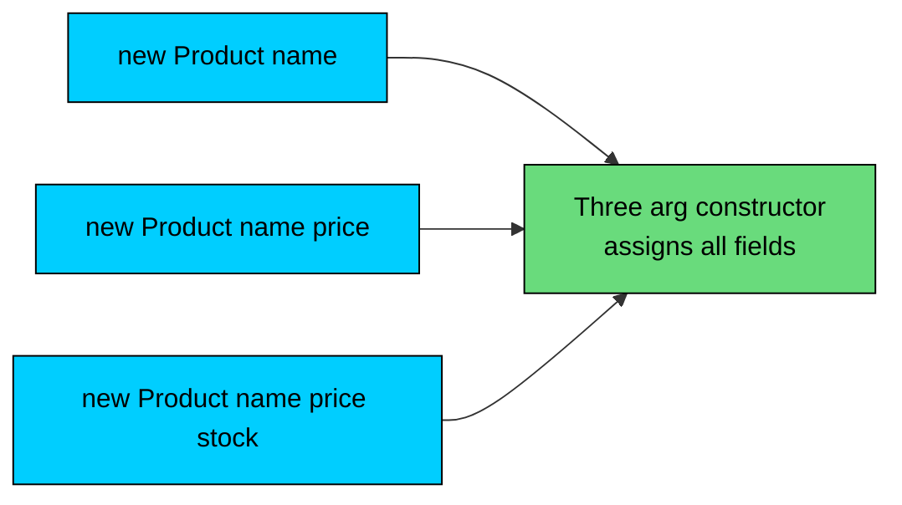
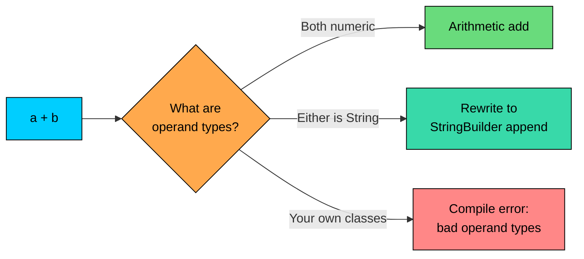
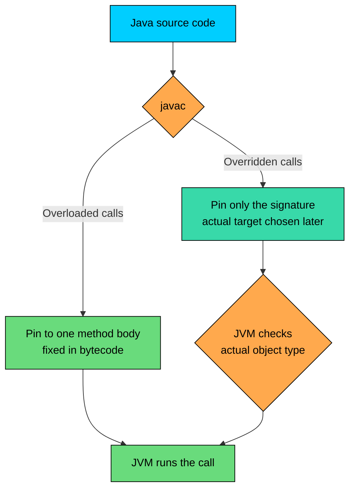

import React from 'react';
import CodeBlock from '../../../../components/ui/CodeBlock';
import Callout from '../../../../components/ui/Callout';

<div className="article-header">
  <div className="breadcrumb">
    <a href="/">Curated Notes</a>
    <span className="breadcrumb-separator">›</span>
    <span className="breadcrumb-current">Compile-Time Polymorphism</span>
  </div>
  <h1>Compile-Time Polymorphism</h1>
  <p style={{ color: 'var(--text-muted)', fontSize: '1.1rem', marginBottom: '16px', lineHeight: '1.6' }}>
    Master the essentials of Compile-Time Polymorphism in this curated guide.
  </p>
  <div className="meta-info">
    <span className="meta-item">
      <svg width="14" height="14" viewBox="0 0 24 24" fill="none" stroke="currentColor" strokeWidth="2"><circle cx="12" cy="12" r="10"/><polyline points="12 6 12 12 16 14"/></svg>
      10 min read
    </span>
    <span className="difficulty-badge difficulty-badge--intermediate">Intermediate</span>
  </div>
</div>

<section className="content-section">

Java has two flavors of polymorphism: one decided when the code is compiled, one decided when the code runs. This lesson is about the first flavor. The compiler looks at the call, picks exactly which method body should answer it, and bakes that decision into the bytecode. No runtime lookup, no method table walk, nothing left to figure out later. We'll define the terms, look at the mechanisms that produce this behavior (method overloading, constructor overloading, generic methods), and call out what Java explicitly does not let you do (define your own operator overloads).

---

## What "Compile-Time" Actually Means

Compile-time polymorphism is the form of polymorphism where the compiler decides which method body a given call site refers to. The same name can stand for many different methods, but by the time `javac` is done with your source file, every call has been pinned to one specific target. The decision uses information that the compiler has access to: the static (declared) types of the arguments, the name of the method, and the surrounding context.

Three different names refer to the same idea:


| Term | Where you'll see it |
| --- | --- |
| Compile-time polymorphism | Textbooks, interviews, this course |
| Static binding | Compiler design literature, JVM specifications |
| Early binding | Older OOP texts, contrast with "late binding" |


They all mean the same thing. The binding (which method a call points to) is fixed early, at compile time, statically. Once the `.class` file is written, that decision can't change.

Contrast that with runtime polymorphism, where the compiler only narrows the call down to a method signature on a class. The exact method body that runs gets picked by the JVM at the moment the call happens, using the actual type of the object on the heap. Two completely different machines making the choice, at two completely different times.

For example, when you write `Math.max(3, 5)`, the compiler already knows you mean `Math.max(int, int)` specifically, not `Math.max(double, double)`. It writes that exact target into the bytecode. The JVM doesn't decide anything when the line runs. It just calls what it was told to call.

---

## The Main Mechanism: Method Overloading

The primary way you get compile-time polymorphism in Java is method overloading. Two or more methods in the same class share a name but have different parameter lists, and the compiler picks one based on the arguments at the call site.

A short refresher:


```java
public class OverloadRefresher {
    public static double cartTotal(double price) {
        return price;
    }

    public static double cartTotal(double price, int quantity) {
        return price * quantity;
    }

    public static double cartTotal(double price, int quantity, double discountPercent) {
        return price * quantity * (1 - discountPercent / 100);
    }

    public static void main(String[] args) {
        System.out.println(cartTotal(49.99));
        System.out.println(cartTotal(49.99, 3));
        System.out.println(cartTotal(49.99, 3, 10.0));
    }
}
```


Three methods, one name, three different argument shapes. The compiler doesn't pause at runtime to choose. It looks at each call, matches the static types of the arguments against the available signatures, and writes the chosen target straight into the bytecode.

The Methods section (06-methods/04-method-overloading.md) covers overload resolution in full: the 3-phase resolution algorithm (exact/widening first, then autoboxing, then varargs), the "most specific match" tie-breaker, and the cases that produce ambiguous calls. We won't re-teach any of that here. The one-sentence summary of why overloading counts as polymorphism: one method name behaves as if it were many, and the binding from name to body is fixed before the program runs.

---

## How the Compiler Picks the Right Overload

The Methods section walks through the full algorithm. For this lesson, the only piece worth re-stating is the "most specific" rule, because its behavior with mixed primitive and reference types is non-obvious.

When two overloads could both accept a call, the compiler picks the one whose parameter types are tighter. For primitives, tighter means smaller in the widening chain (`byte` is tighter than `short` is tighter than `int`, and so on). For reference types, tighter means more derived. A small e-commerce example:


```java
public class MostSpecific {
    public static void recordSale(Object item) {
        System.out.println("Recorded sale for generic item");
    }

    public static void recordSale(Product item) {
        System.out.println("Recorded sale for product: " + item.name);
    }

    public static void recordSale(Book item) {
        System.out.println("Recorded sale for book: " + item.name + " by " + item.author);
    }

    public static void main(String[] args) {
        Book b = new Book("Effective Java", "Joshua Bloch");
        recordSale(b);
    }
}

class Product {
    String name;
    Product(String name) { this.name = name; }
}

class Book extends Product {
    String author;
    Book(String name, String author) {
        super(name);
        this.author = author;
    }
}
```


A `Book` is a `Product` is an `Object`. All three overloads can accept the argument. The compiler picks `recordSale(Book)` because `Book` is the most specific parameter type. Same call, same argument value, but the binding is decided long before the program runs.

The choice is driven entirely by the static type of the expression `b`. Change the declaration to `Product b = new Book(...)`, and the call resolves to `recordSale(Product)` instead, because the compiler now only knows the variable is a `Product`. The object on the heap is still a `Book`, but compile-time polymorphism doesn't care about that. The Methods chapter walks through this in detail; we won't redo the algorithm here.

---

## Constructor Overloading

Constructors follow the same overloading rules as methods. A class can have several constructors with different parameter lists, and the compiler picks which one fires based on the arguments at the `new` site. Inside a constructor, `this(...)` calls another constructor in the same class, which is the standard way to keep all the field-initialization logic in one place.


```java
public class ProductDemo {
    public static void main(String[] args) {
        System.out.println(new Product("Wireless Mouse"));
        System.out.println(new Product("USB Cable", 9.99));
        System.out.println(new Product("Headphones", 49.99, 25));
    }
}

class Product {
    private String name;
    private double price;
    private int stockCount;

    public Product(String name) {
        this(name, 0.0, 0);
    }

    public Product(String name, double price) {
        this(name, price, 0);
    }

    public Product(String name, double price, int stockCount) {
        this.name = name;
        this.price = price;
        this.stockCount = stockCount;
    }

    @Override
    public String toString() {
        return "Product{name='" + name + "', price=" + price + ", stockCount=" + stockCount + "}";
    }
}
```


Three calls to `new Product(...)`, three different constructors selected at compile time. The constructors form a chain. The one-arg constructor delegates straight to the three-arg one through `this(name, 0.0, 0)`. The two-arg one also forwards to the three-arg one. Only the three-arg constructor touches the fields. If you later add a new field (like `category`), you change exactly one constructor body.





The diagram shows the funnel pattern. All call sites end up running the same field-assignment code. The compiler picked the entry point based on how many arguments you passed, but the work happens in one body.

This pattern is so common that there's a name for it: telescoping constructors. It works for two, three, even four parameters. Past that, the builder pattern is usually preferred, because adding a fifth optional field means writing every combination of constructors all over again. For now, two or three constructors with `this(...)` delegation is the standard approach.

---

## Why It's Called "Compile-Time"

The "compile-time" part isn't marketing. You can see the binding sitting in the bytecode after `javac` runs. If you compile the overloaded `cartTotal` example and run `javap -c CartOverloads`, you'll see each call in `main` translated to a specific `invokestatic` instruction with the exact target signature, like `cartTotal(D)D` for the one-argument call and `cartTotal(DI)D` for the two-argument one. The bytecode names the method, its parameter types, and its return type, all spelled out. There's nothing left to decide at runtime. The JVM just calls what the bytecode tells it to call.

That fixed-target behavior is exactly what makes overloading fast. No virtual table lookup, no class hierarchy walk, just a direct call to a known address. For static methods and overloaded calls, the JVM treats the dispatch as a simple jump. The contrast is `invokevirtual`, which does walk the method table.

The downside of fixing the target at compile time is that the binding can't react to runtime information. If you have a `Product` variable holding a `Book` object and call a static method like `Product.category()`, you get the `Product` static method, not the `Book` one. Compile-time polymorphism is fast, predictable, and entirely static. That's both its strength and its limit.

---

## Operator Overloading: What Java Does Not Let You Do

Some languages, C++ and Python being the headline examples, let you define what `+`, `*`, `==`, and friends mean for your own types. Java does not. There is no `operator+` method you can write on `Product` to make `productA + productB` compile. The language designers left it out deliberately, on the argument that user-defined operators make code harder to read for anyone who didn't write the class.

Java does include exactly one built-in operator overload, baked into the language: `+` on `String`. Try to apply `+` to your own type and you get a compile error. Try it on `String` and the compiler quietly rewrites your code to use a `StringBuilder`.


```java
public class OperatorOverloading {
    public static void main(String[] args) {
        // String concatenation: the only built-in operator "overload"
        String customer = "Alice";
        String greeting = "Hello, " + customer + "!";
        System.out.println(greeting);

        // String + non-String: also rewritten to StringBuilder calls
        int orderCount = 3;
        String summary = customer + " has " + orderCount + " orders";
        System.out.println(summary);
    }
}
```


What the compiler actually emits for the second `String` expression is conceptually:


```java
String summary = new StringBuilder()
    .append(customer)
    .append(" has ")
    .append(orderCount)
    .append(" orders")
    .toString();
```


The `+` operator never reaches the JVM as a single instruction for `String`. It gets rewritten into `StringBuilder.append` calls. So the operator is overloaded in the sense that `+` on `int` means addition and `+` on `String` means concatenation, but the rewriting happens during compilation, not at runtime, and Java doesn't expose the mechanism to user code.

Try this and the compiler shuts you down:


```java
public class CannotOverload {
    public static void main(String[] args) {
        Product a = new Product("Mouse", 29.99);
        Product b = new Product("Cable", 9.99);
        Product combined = a + b; // does NOT compile
    }
}

class Product {
    String name;
    double price;
    Product(String name, double price) {
        this.name = name;
        this.price = price;
    }
}
```


The compiler reports:


```shell
error: bad operand types for binary operator '+'
        Product combined = a + b;
                             ^
  first type:  Product
  second type: Product
```


There's no path forward. You can't define a method named `operator+` and have Java pick it up. You can't annotate `Product` to mean "concat with `+`". If you want to combine two products, you write `Product combined = Product.combine(a, b)` or `a.mergeWith(b)`. Plain method calls only.

Inside a single expression, `s1 + s2 + s3` compiles into one `StringBuilder` chain, so it's about as fast as writing the builder by hand. Inside a loop, every iteration's `+=` allocates a new `StringBuilder`, which adds up. Use an explicit `StringBuilder` (or `String.join`) for any concatenation inside a loop.





The diagram captures the rule. `+` works for numerics and for `String`. Anything else is a compile error, and there's no language feature to extend the set.

---

## Generic Methods as Compile-Time Polymorphism

A third place compile-time polymorphism shows up is generic methods. A generic method is a method that takes a type parameter, like `<T>`, which gets filled in by the compiler based on the call site. The result is one method body that works with many different types, with the compiler stamping out the correct types for each call.

Here's a tiny generic method that wraps any single value in a single-element list.


```java
import java.util.ArrayList;
import java.util.List;

public class WrapInList {
    public static <T> List<T> wrap(T item) {
        List<T> result = new ArrayList<>();
        result.add(item);
        return result;
    }

    public static void main(String[] args) {
        List<String> productNames = wrap("Wireless Mouse");
        List<Integer> stockCounts = wrap(42);
        List<Double> prices = wrap(29.99);

        System.out.println(productNames);
        System.out.println(stockCounts);
        System.out.println(prices);
    }
}
```


One method, `wrap`. Three call sites, three different return types: `List<String>`, `List<Integer>`, `List<Double>`. The compiler picked the `T` for each call based on the argument's type and verified the result was assigned to a compatible variable. No runtime decision, no reflection, no separate method per type. The type parameter is part of the call's signature, resolved at compile time.

This is polymorphism in the "one name, many forms" sense, but the form-picking happens during compilation. The compiler doesn't generate a separate copy of `wrap` for each type at the bytecode level (that's what C++ templates do). Java uses type erasure, which keeps one bytecode method and removes the type parameter, but the type checking and the choice of return type at each call site still happen at compile time. For this lesson, the takeaway is that generic methods are a compile-time polymorphism mechanism, alongside overloading and constructor overloading.

A slightly more useful example: a generic `swap` that exchanges the first two elements of any list.


```java
import java.util.ArrayList;
import java.util.List;

public class GenericSwap {
    public static <T> void swapFirstTwo(List<T> items) {
        if (items.size() < 2) {
            return;
        }
        T first = items.get(0);
        items.set(0, items.get(1));
        items.set(1, first);
    }

    public static void main(String[] args) {
        List<String> cart = new ArrayList<>();
        cart.add("Mouse");
        cart.add("Cable");
        cart.add("Headphones");

        List<Integer> prices = new ArrayList<>();
        prices.add(29);
        prices.add(9);
        prices.add(49);

        swapFirstTwo(cart);
        swapFirstTwo(prices);

        System.out.println(cart);
        System.out.println(prices);
    }
}
```


Same `swapFirstTwo` method, two different element types. The compiler matches `T` to `String` for the first call and to `Integer` for the second, type-checks each one separately, and emits the call.

---

## Compile-Time vs Runtime Polymorphism

A short version of the contrast between the two forms.


| Aspect | Compile-time polymorphism | Runtime polymorphism |
| --- | --- | --- |
| Decided by | Compiler | JVM at runtime |
| Decided when | During `javac` | When the call executes |
| Uses what to decide | Static types of arguments | Actual type of the object |
| Main mechanism | Method/constructor overloading | Method overriding |
| Also called | Static binding, early binding | Dynamic dispatch, late binding |
| Speed | Slightly faster (direct call) | Slightly slower (vtable hop) |
| Flexibility | Fixed once compiled | Can vary per object |


The two mechanisms aren't competing. Real Java code uses both, often in the same method. You'll overload constructors to give callers flexible ways to build an object, then override `toString` so each subclass describes itself differently. Compile-time polymorphism picks which constructor fires when you write `new`. Runtime polymorphism picks which `toString` runs when the system prints the object. Same program, two binding strategies, working together.





The diagram shows the split. Both paths start with the same compiler. Overloaded calls leave the compiler with the target fully known. Overridden calls leave with only the method signature pinned, and the JVM finishes the job when the line actually runs.

---

## Pros and Cons

Compile-time polymorphism is a useful tool, but it isn't a free win in every situation. The trade-offs:


| Pros | Cons |
| --- | --- |
| Faster: direct method call, no runtime lookup | Less flexible: can't react to runtime type |
| Errors caught at compile time, not in production | Doesn't help you treat a `Book` like a generic `Product` polymorphically |
| Easier for the compiler to inline and optimize | Mixing primitive and reference overloads can pick the wrong overload silently |
| Clear at the call site which method runs | Operator overloading is off the table, so syntax is sometimes verbose |
| Generic methods enable type-safe reusable code | Closely-related numeric overloads (`int` vs `double`) can be fragile |


The performance angle is real but small. A direct `invokestatic` call is a few cycles faster than `invokevirtual`, but the JIT compiler erases most of that gap by inlining hot virtual calls. The real reason to prefer compile-time polymorphism isn't speed, it's clarity. When you overload `cartTotal`, every caller can see exactly which version they're calling. When you override `toString`, callers see only the parent's signature and trust the runtime to find the right implementation. Both styles have their place.

Generic methods don't add runtime overhead because of erasure. The bytecode has one method, just like a non-generic version would. The compile-time machinery has no runtime cost.

---

## When to Use Each Form

Use compile-time polymorphism (overloading) when the same operation has multiple input shapes and the choice is fixed by what the caller has on hand. `addItem(String name)`, `addItem(String name, int quantity)`, and `addItem(String name, int quantity, double price)` are all "add to cart", just with different amounts of data. Callers know which one they want at compile time.

Use constructor overloading when you want to offer convenient defaults without forcing every caller to fill in fields they don't care about. `new Order(customerName)`, `new Order(customerName, items)`, and `new Order(customerName, items, discountCode)` all create the same kind of object with progressively more information.

Use generic methods when the operation works the same way for many element types and you want the type-checking to catch mistakes at compile time. `wrap`, `swap`, `firstNonNull`, and most utility helpers fit.

Use runtime polymorphism instead when the choice of behavior depends on which subclass the object is, and the caller doesn't (or shouldn't) know the exact subclass. `Product.describe()` overridden by `Book`, `DigitalDownload`, and `GiftCard` is a typical example. The caller has a `Product` reference and shouldn't have to write a chain of `instanceof` checks. The runtime picks the right `describe`.

In practice you'll often combine both. A class might overload its constructors (compile-time) and override its `toString` (runtime). A static factory method might use generics to enforce type safety (compile-time) and return an instance of a subclass whose behavior is decided at runtime. The two forms work together rather than competing.

</section>
