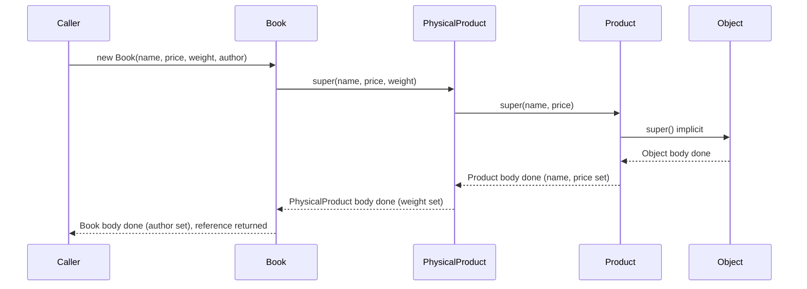
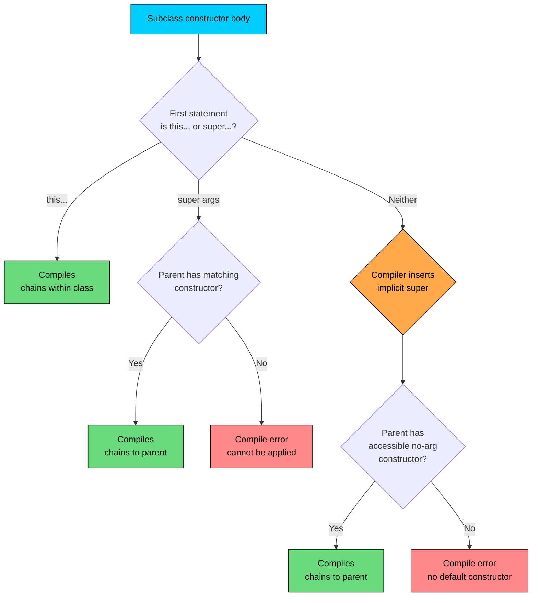

import React from 'react';
import CodeBlock from '../../../../components/ui/CodeBlock';
import Callout from '../../../../components/ui/Callout';

<div className="article-header">
  <div className="breadcrumb">
    <a href="/">Curated Notes</a>
    <span className="breadcrumb-separator">›</span>
    <span className="breadcrumb-current">Constructor Chaining</span>
  </div>
  <h1>Constructor Chaining</h1>
  <p style={{ color: 'var(--text-muted)', fontSize: '1.1rem', marginBottom: '16px', lineHeight: '1.6' }}>
    Master the essentials of Constructor Chaining in this curated guide.
  </p>
  <div className="meta-info">
    <span className="meta-item">
      <svg width="14" height="14" viewBox="0 0 24 24" fill="none" stroke="currentColor" strokeWidth="2"><circle cx="12" cy="12" r="10"/><polyline points="12 6 12 12 16 14"/></svg>
      10 min read
    </span>
    <span className="difficulty-badge difficulty-badge--intermediate">Intermediate</span>
  </div>
</div>

<section className="content-section">

Constructors are not inherited the way fields and methods are. Every subclass writes its own constructors. But every constructor in a subclass eventually runs one in its parent, which runs one in its parent, all the way up to `java.lang.Object`. That guaranteed walk up the hierarchy is called constructor chaining, and this lesson covers how it works, the two keywords that drive it (`this(...)` and `super(...)`), and the rules and pitfalls that come with it.

---

## Why Chaining Exists

A subclass object physically contains every field declared by its parent. A `Book` that extends `PhysicalProduct` which extends `Product` has the `name` and `price` fields from `Product`, the `weight` field from `PhysicalProduct`, and the `author` field from `Book`, all packed into one object. Those parent fields have to be initialized before any subclass code uses them.

Constructor chaining is Java's mechanism for guaranteeing that. Before a child constructor's body runs, the parent constructor must have already finished. By the time you write `this.author = author` in the `Book` constructor, you can rely on `name`, `price`, and `weight` already holding their proper values.

A small hierarchy makes the point concrete:


```java
public class Product {
    String name;
    double price;

    public Product(String name, double price) {
        this.name = name;
        this.price = price;
    }
}

public class PhysicalProduct extends Product {
    double weightKg;

    public PhysicalProduct(String name, double price, double weightKg) {
        super(name, price);
        this.weightKg = weightKg;
    }
}

public class Book extends PhysicalProduct {
    String author;

    public Book(String name, double price, double weightKg, String author) {
        super(name, price, weightKg);
        this.author = author;
    }

    public static void main(String[] args) {
        Book b = new Book("Effective Java", 39.99, 0.7, "Joshua Bloch");
        System.out.println(b.name + " by " + b.author);
        System.out.println("Price: $" + b.price + ", weight: " + b.weightKg + " kg");
    }
}
```


The `Book` constructor sets `author`, but the other three fields come from somewhere. They come from the parent constructors running first. Without that, `Book` would have to reach up into the parent and set those fields itself, which is messy and breaks encapsulation. Chaining keeps each class responsible for its own initialization.

The rule that drives this: **parent state must be fully initialized before any child code touches it.** Every other piece of constructor-chaining behavior is a consequence of enforcing that one invariant.

---

## The Full Chain to `Object`

Every class in Java extends some other class, either explicitly with `extends` or implicitly. A class declared as `public class Product { ... }` extends `java.lang.Object`. That makes `Object` the silent root of every hierarchy. When you construct a `Book`, the chain runs all the way up.

The sequence of constructor calls when `new Book("Effective Java", 39.99, 0.7, "Joshua Bloch")` runs:





Read the diagram top to bottom: each constructor's first action is to invoke its parent's constructor. Once Java reaches `Object`, the chain unwinds. `Object`'s constructor finishes first, then `Product`'s body runs, then `PhysicalProduct`'s, then `Book`'s. The caller receives the reference only after every body in the chain has completed.

Two consequences fall out of this picture:

- The deepest class's constructor body runs **last**, not first.
- If anything throws an exception partway up the chain, the object is never returned. The caller sees the exception, not a half-built object.

This is the chain. Everything else in the lesson is about how Java decides exactly which parent constructor to call at each step.

---

## `this(...)`: Calling Another Constructor in the Same Class

`this(...)` calls another constructor in the **same class**. It's a way to remove duplication when several constructors set up the same fields with different defaults. A short example, since it pairs naturally with `super(...)`:


```java
public class Product {
    String name;
    double price;
    int stock;
    String category;

    public Product(String name, double price, int stock, String category) {
        this.name = name;
        this.price = price;
        this.stock = stock;
        this.category = category;
    }

    public Product(String name, double price) {
        this(name, price, 0, "Uncategorized");
    }

    public Product(String name) {
        this(name, 0.0);
    }

    public static void main(String[] args) {
        Product full = new Product("Wireless Mouse", 29.99, 50, "Electronics");
        Product mid = new Product("USB Cable", 9.99);
        Product bare = new Product("Unnamed");

        System.out.println(full.name + " / $" + full.price + " / " + full.stock + " / " + full.category);
        System.out.println(mid.name + " / $" + mid.price + " / " + mid.stock + " / " + mid.category);
        System.out.println(bare.name + " / $" + bare.price + " / " + bare.stock + " / " + bare.category);
    }
}
```


The two short constructors delegate to the four-argument one through `this(...)`. The full constructor is the only place that touches the fields directly. If you add a new field, you change the long constructor and every short constructor automatically picks up the new behavior.

A constructor calling `this(...)` runs **before** its own body. So in the two-argument constructor, the call `this(name, price, 0, "Uncategorized")` runs the four-argument constructor first, and only after that returns does any other code in the two-argument body run (there's none here, but there could be).

`this(...)` chains within one class. `super(...)` chains across the parent boundary. A single constructor can use one or the other, never both.

---

## `super(...)`: Calling a Parent Constructor

`super(...)` is the keyword that walks the chain upward. From any subclass constructor, `super(args)` calls a matching constructor in the immediate parent class. The parent then chains to its own parent, and so on up to `Object`.

The mechanics:

- `super(...)` must appear in the **first line** of a subclass constructor body.
- The argument list of `super(...)` is matched against the parent's constructors using the same overload resolution rules as a regular method call (exact, widening, autoboxing, varargs).
- If no parent constructor matches the arguments, the code fails to compile.

The e-commerce hierarchy again, this time annotated with print statements so you can watch the chain run:


```java
public class Product {
    String name;
    double price;

    public Product(String name, double price) {
        this.name = name;
        this.price = price;
        System.out.println("Product constructor done: " + name);
    }
}

public class PhysicalProduct extends Product {
    double weightKg;

    public PhysicalProduct(String name, double price, double weightKg) {
        super(name, price);
        this.weightKg = weightKg;
        System.out.println("PhysicalProduct constructor done: " + weightKg + " kg");
    }
}

public class Book extends PhysicalProduct {
    String author;

    public Book(String name, double price, double weightKg, String author) {
        super(name, price, weightKg);
        this.author = author;
        System.out.println("Book constructor done: " + author);
    }

    public static void main(String[] args) {
        new Book("Effective Java", 39.99, 0.7, "Joshua Bloch");
    }
}
```


The order is significant. The `Book` constructor was the one we called, but its print statement runs last. The first thing the `Book` constructor body does is `super(...)`, which makes Java jump up to `PhysicalProduct`. That in turn jumps up to `Product`. `Product`'s body runs (and prints) first because it's the deepest constructor reached before the chain starts unwinding. Then control returns down through `PhysicalProduct` and finally to `Book`.

`super(...)` is not the same as `super.someMethod()`. Here we only use the constructor form.

---

## The First-Statement Rule

If you write `this(...)` or `super(...)`, it must be the **first statement** in the constructor body. Not the first non-comment line. The first actual statement. Anything before it is a compile error.


```java
public class PhysicalProduct extends Product {
    double weightKg;

    public PhysicalProduct(String name, double price, double weightKg) {
        if (weightKg < 0) {
            throw new IllegalArgumentException("weight must be non-negative");
        }
        super(name, price); // ERROR
        this.weightKg = weightKg;
    }
}
```


The compiler refuses this with:


```shell
error: call to super must be first statement in constructor
        super(name, price);
        ^
```


The rule has a purpose. Java needs to guarantee that the parent's state is fully built before any subclass code runs, including validation. If you could sneak code in before `super(...)`, that code might call methods on the partially-built object, and the parent's fields wouldn't yet hold their proper values.

Two more rules go with the first-statement requirement:


| Rule | What it means |
| --- | --- |
| Exactly one of `this(...)` or `super(...)` per constructor | You can use one or the other, never both. |
| Either is optional | If you write neither, the compiler inserts an implicit `super()`. |
| Must be the first statement | No code, no validation, no logging before it. |


If you legitimately need to validate inputs before passing them to `super(...)`, you have a few options. You can validate in the call itself by using a static helper:


```java
public class PhysicalProduct extends Product {
    double weightKg;

    public PhysicalProduct(String name, double price, double weightKg) {
        super(name, price);
        if (weightKg < 0) {
            throw new IllegalArgumentException("weight must be non-negative");
        }
        this.weightKg = weightKg;
    }

    private static double requireNonNegative(double value) {
        if (value < 0) {
            throw new IllegalArgumentException("must be non-negative");
        }
        return value;
    }
}
```


Validate after the `super(...)` call (as above), or wrap the argument in a static helper that throws before returning. Both are common patterns. Java 25 made the "Flexible Constructor Bodies" feature standard, allowing statements before `super(...)` in narrow cases, but for the long-stable language and any current production target, treat the first-statement rule as absolute.

A `super(...)` or `this(...)` call is no more expensive than a regular method call. The first-statement rule is a language rule, not a performance one.

A reasonable question to ask: can `super(...)` appear inside an `if` or a `try` block? No. "First statement" means literally the first statement at the top level of the constructor body. Putting it inside a conditional or a try block fails to compile with the same error message.

---

## The Implicit `super()` Call and When It Fails

If you don't write `this(...)` or `super(...)` as your first statement, the compiler inserts a hidden `super()` (no arguments) for you. This is why this class compiles even though it never mentions `super`:


```java
public class Product {
    String name;
    double price;

    public Product() {
        this.name = "Unknown";
        this.price = 0.0;
    }
}

public class PhysicalProduct extends Product {
    double weightKg;

    public PhysicalProduct(double weightKg) {
        // No super(...) call here.
        // Compiler inserts super(); on this line.
        this.weightKg = weightKg;
    }
}
```


The compiler sees that `PhysicalProduct(double)` doesn't call `super(...)` or `this(...)` explicitly, so it adds `super();`. That call resolves to `Product()`, the no-arg constructor, which exists and is accessible. The chain works.

Now break it by removing the no-arg `Product` constructor:


```java
public class Product {
    String name;
    double price;

    public Product(String name, double price) {
        this.name = name;
        this.price = price;
    }
}

public class PhysicalProduct extends Product {
    double weightKg;

    public PhysicalProduct(double weightKg) {
        this.weightKg = weightKg;
    }
}
```


The `PhysicalProduct(double)` constructor still gets an implicit `super()` inserted, but `Product` no longer has a no-arg constructor. The compile error:


```shell
error: constructor Product in class Product cannot be applied to given types;
    public PhysicalProduct(double weightKg) {
                                            ^
  required: String,double
  found:    no arguments
  reason: actual and formal argument lists differ in length
```


The error reads as if it's complaining about `PhysicalProduct`, but the real culprit is the implicit `super()` inside it. Java tried to call `Product()` and couldn't find one.

There are two clean fixes.

**Fix 1: Add a no-arg constructor to the parent.**


```java
public class Product {
    String name;
    double price;

    public Product() {
        this("Unknown", 0.0);
    }

    public Product(String name, double price) {
        this.name = name;
        this.price = price;
    }
}
```


Now `super()` resolves successfully and `PhysicalProduct(double)` compiles.

**Fix 2: Call `super(...)` explicitly with arguments that match an existing parent constructor.**


```java
public class PhysicalProduct extends Product {
    double weightKg;

    public PhysicalProduct(double weightKg) {
        super("Unknown", 0.0);
        this.weightKg = weightKg;
    }
}
```


This call matches `Product(String, double)`. The implicit `super()` is no longer inserted because we wrote an explicit `super(...)` ourselves.

Which fix to pick? It depends on whether a no-arg `Product` is a meaningful concept in your code. If "an unnamed, free product" is a thing you'd ever want, add the no-arg constructor and let subclasses use it. If not, force every subclass to supply real values by only providing parameterized constructors, and accept that subclasses must call `super(...)` explicitly.

A decision flowchart for "will this constructor compile?":





The decision tree captures the whole rule set. The implicit `super()` is invisible in your source, but it's still a constructor call, and it fails the same way any other call would if no matching constructor exists.

---

## Construction Order: Parent Fields, Parent Body, Child Fields, Child Body

When `new` runs on a subclass, the work happens in a strict order. Each level of the hierarchy goes through a small four-phase sequence, but the levels themselves interleave because of how chaining works.

The precise order for `new Book(...)` against the `Product` -&gt; `PhysicalProduct` -&gt; `Book` chain:


| Step | What happens |
| --- | --- |
| 1 | JVM allocates one block of memory big enough for all fields from `Object`, `Product`, `PhysicalProduct`, and `Book`. |
| 2 | All fields are set to their default values (`0`, `false`, `null`). This applies to every field at every level at once. |
| 3 | `Book(...)` is invoked; its first action is `super(...)`, which jumps up. |
| 4 | `PhysicalProduct(...)` is invoked; its first action is `super(...)`, which jumps up. |
| 5 | `Product(...)` is invoked; its first action is an implicit `super()` to `Object`. |
| 6 | `Object`'s constructor body runs (empty for our purposes). |
| 7 | Control returns to `Product(...)`. **`Product`'s field initializers run**, then `Product`'s body runs. |
| 8 | Control returns to `PhysicalProduct(...)`. **`PhysicalProduct`'s field initializers run**, then its body runs. |
| 9 | Control returns to `Book(...)`. **`Book`'s field initializers run**, then its body runs. |
| 10 | The reference to the now-fully-built object is returned to the caller. |


"Field initializers" are inline initializations like `private int stock = 0;` or `private List<String> tags = new ArrayList<>();`. They count as part of the class's construction work, and they run before the class's constructor body but after that class's `super(...)` call returns. Initializer blocks (the `{ ... }` blocks inside a class body) run at the same point and in source order alongside the field initializers.

A small program to watch this run:


```java
public class Product {
    String name;
    int productCounter = recordInit("Product field initializer");

    public Product(String name) {
        System.out.println("Product body starts");
        this.name = name;
        System.out.println("Product body ends");
    }

    static int recordInit(String label) {
        System.out.println(label);
        return 0;
    }
}

public class PhysicalProduct extends Product {
    double weightKg;
    int physicalCounter = recordInit("PhysicalProduct field initializer");

    public PhysicalProduct(String name, double weightKg) {
        super(name);
        System.out.println("PhysicalProduct body starts");
        this.weightKg = weightKg;
        System.out.println("PhysicalProduct body ends");
    }
}

public class Book extends PhysicalProduct {
    String author;
    int bookCounter = recordInit("Book field initializer");

    public Book(String name, double weightKg, String author) {
        super(name, weightKg);
        System.out.println("Book body starts");
        this.author = author;
        System.out.println("Book body ends");
    }

    public static void main(String[] args) {
        new Book("Effective Java", 0.7, "Joshua Bloch");
    }
}
```


Read top to bottom. `Product`'s field initializers run, then its body. `PhysicalProduct`'s field initializers, then its body. `Book`'s field initializers, then its body. The deepest class runs last, and within each class, the field initializers run before the constructor body.

This order matters because it tells you what you can rely on at any given moment. Inside `PhysicalProduct`'s constructor body, you can be sure `name` is already set (the parent ran first). Inside `Book`'s body, you can be sure both `name` and `weightKg` are set. The reverse is not true: inside `Product`'s body, neither `weightKg` nor `author` has been assigned yet. They still hold their primitive/reference defaults.

---

## The Overridable-Method-from-Constructor Pitfall

One subtle bug comes directly from the construction order. If a parent constructor calls a method that's overridden in the child, the **child's** version runs, but the child's fields haven't been initialized yet. The override sees an object that's only half-built.

This bug compiles cleanly, runs without an exception, and produces output that looks reasonable, but the fields are all defaults.


```java
public class Product {
    String name;

    public Product(String name) {
        this.name = name;
        printLabel(); // calls overridable method during construction
    }

    public void printLabel() {
        System.out.println("Product: " + name);
    }
}

public class Book extends Product {
    String author;
    int yearPublished;

    public Book(String name, String author, int yearPublished) {
        super(name);
        this.author = author;
        this.yearPublished = yearPublished;
    }

    @Override
    public void printLabel() {
        System.out.println("Book: " + name + " by " + author + " (" + yearPublished + ")");
    }

    public static void main(String[] args) {
        new Book("Effective Java", "Joshua Bloch", 2018);
    }
}
```


That output is wrong, and the wrongness is silent. The call to `new Book(...)` worked. No exception was thrown. But the `printLabel` invocation inside `Product`'s constructor ran the **`Book` override**, because dynamic method dispatch uses the runtime type of the object, which is `Book`. At that moment, `Product`'s body has assigned `name`, but `super(...)` hasn't returned yet, so `Book`'s field initializers and body haven't run. `author` is still `null`. `yearPublished` is still `0`. The override sees them in that not-yet-initialized state.

If the override depended on those fields being non-null (say, it called `author.length()` on them), the constructor would throw a `NullPointerException`, and the trace would point at `printLabel` from inside `Product`'s constructor, which is a confusing place to land.

The fix is to **not call overridable methods from constructors**. Two safe alternatives:


| Approach | When to use it |
| --- | --- |
| Mark the method `private`, `static`, or `final` | When the parent really does need a helper at construction time, but it shouldn't be overridable. |
| Move the call out of the constructor | When the work isn't strictly needed at construction time, do it from a separate `init` step or from a factory method. |


The same example with the safe pattern. `printLabel` is now `final`, so it can't be overridden. Subclasses can still add their own labeling methods, but the parent's call site is stable.


```java
public class Product {
    String name;

    public Product(String name) {
        this.name = name;
        printLabel();
    }

    public final void printLabel() {
        System.out.println("Product: " + name);
    }
}

public class Book extends Product {
    String author;
    int yearPublished;

    public Book(String name, String author, int yearPublished) {
        super(name);
        this.author = author;
        this.yearPublished = yearPublished;
        printDetailedLabel();
    }

    public void printDetailedLabel() {
        System.out.println("Book: " + name + " by " + author + " (" + yearPublished + ")");
    }

    public static void main(String[] args) {
        new Book("Effective Java", "Joshua Bloch", 2018);
    }
}
```


The parent's call always runs the parent's `printLabel`, and the child does its own labeling after `super(...)` has returned and its own fields are set.

This pitfall appears in the JDK itself. The reason classes like `LinkedHashMap` and `Calendar` were quirky to subclass for a long time is that early designs called overridable methods from their constructors. Effective Java by Joshua Bloch dedicates a full item to this rule. Don't call overridable methods from constructors.

A short note on records: records have a synthesized canonical constructor that follows all the chaining rules above and implicitly chains to `Object` through the record machinery. You can write a compact form (`public Book { ... }` with no parameter list) that runs validation before the implicit field assignments, but it's still subject to the first-statement rule for any explicit `this(...)`. Records remove most of the surface area where this pitfall could bite you, but the underlying chain is the same.

</section>
