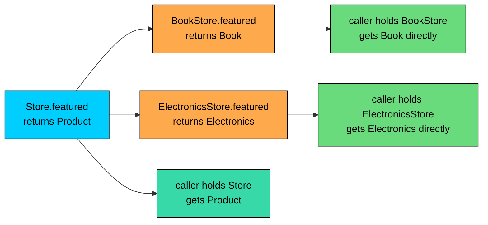
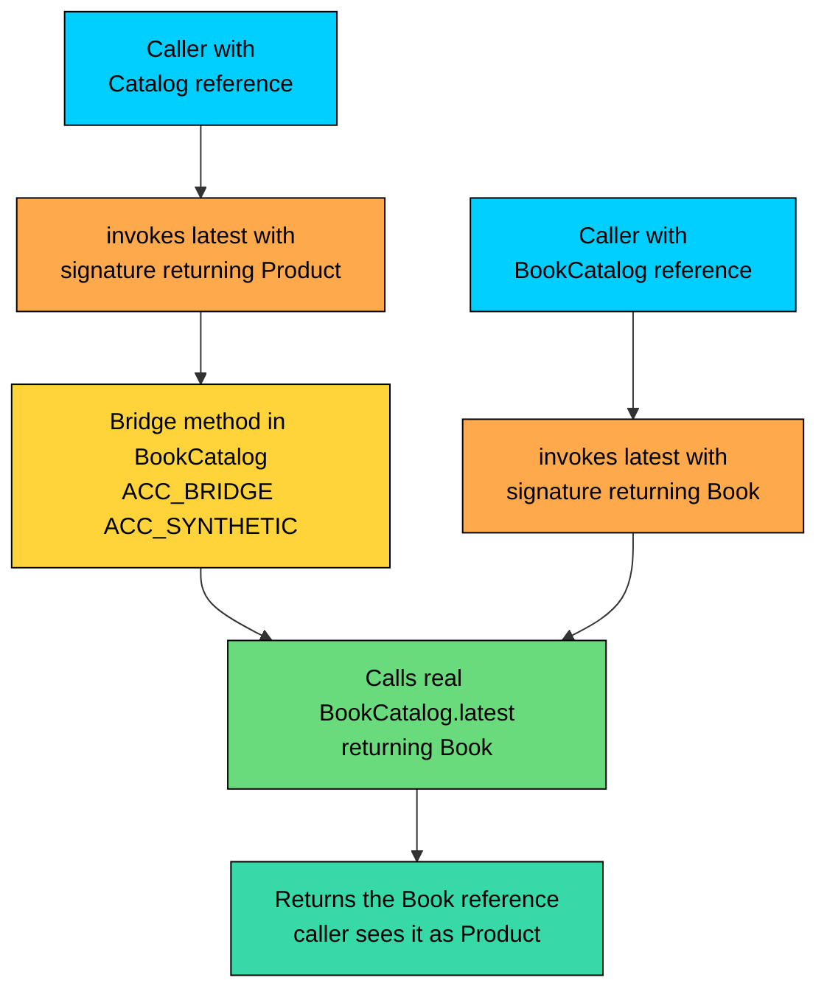

import React from 'react';
import CodeBlock from '../../../../components/ui/CodeBlock';
import Callout from '../../../../components/ui/Callout';

<div className="article-header">
  <div className="breadcrumb">
    <a href="/">Curated Notes</a>
    <span className="breadcrumb-separator">›</span>
    <span className="breadcrumb-current">Covariant Return Types</span>
  </div>
  <h1>Covariant Return Types</h1>
  <p style={{ color: 'var(--text-muted)', fontSize: '1.1rem', marginBottom: '16px', lineHeight: '1.6' }}>
    Master the essentials of Covariant Return Types in this curated guide.
  </p>
  <div className="meta-info">
    <span className="meta-item">
      <svg width="14" height="14" viewBox="0 0 24 24" fill="none" stroke="currentColor" strokeWidth="2"><circle cx="12" cy="12" r="10"/><polyline points="12 6 12 12 16 14"/></svg>
      10 min read
    </span>
    <span className="difficulty-badge difficulty-badge--intermediate">Intermediate</span>
  </div>
</div>

<section className="content-section">

This lesson zooms in on one specific freedom that overriding gives you: the override can return a more specific type than the parent declared. That tiny relaxation in the type rules is what lets `clone()` return your exact class, what lets a `BookStore.cheapest()` give you a `Book` without casting, and what builders, factories, and fluent APIs lean on every day.

---

## What Covariant Return Types Are

A covariant return type matches its name. When a subclass overrides a method, the override is allowed to declare a return type that is a **subtype** of the parent's return type. The override doesn't have to widen its perspective to match the parent. It can narrow it.

A concrete example: a generic `Store` has a `cheapest()` method that returns a `Product`. A `BookStore` only ever sells `Book` instances, which are themselves `Product`s. With covariant returns, `BookStore.cheapest()` can declare its return type as `Book`, even though the parent says `Product`.


```java
public class CovariantBasics {
    public static void main(String[] args) {
        Store anyStore = new Store();
        BookStore bookStore = new BookStore();

        Product p = anyStore.cheapest();
        Book b = bookStore.cheapest(); // no cast needed

        System.out.println(p.describe());
        System.out.println(b.describe() + " by " + b.author);
    }
}

class Product {
    String name;
    double price;

    Product(String name, double price) {
        this.name = name;
        this.price = price;
    }

    public String describe() {
        return name + " at $" + price;
    }
}

class Book extends Product {
    String author;

    Book(String name, double price, String author) {
        super(name, price);
        this.author = author;
    }
}

class Store {
    public Product cheapest() {
        return new Product("USB Cable", 9.99);
    }
}

class BookStore extends Store {
    @Override
    public Book cheapest() {
        return new Book("Effective Java", 45.00, "Joshua Bloch");
    }
}
```


Two details matter here. First, `BookStore.cheapest()` returns `Book`, which is narrower than the parent's `Product`. The compiler accepts the override because every `Book` is also a `Product`, so any caller still holding a `Store` reference gets a `Product`-shaped result, as the parent's contract promised. Second, the line `Book b = bookStore.cheapest();` reads cleanly: no cast, no `ClassCastException` risk, no commentary about why this is safe. The narrowing is encoded in the type system itself.

Covariant return types arrived in Java 5. Before that, every override had to declare exactly the parent's return type. For a narrower type at the call site, code wrote `(Book) bookStore.cheapest()` and hoped for the best. After Java 5, that cast moved out of the caller's code and into the override's signature, which is a better place for it.

This lesson takes the idea apart: the rules, what the JVM does internally, where the pattern shows up in code, and the cases where covariance does not apply.

---

## The Exact Rules

Covariant return types are governed by four rules.

#### Rule 1: The Override's Return Type Must Be a Subtype

This is the headline rule. If the parent declares the return type `T`, the override may declare `T` or any subtype of `T`. It may not declare a supertype, an unrelated type, or a sibling type. This is safe because a caller holding a parent reference is promised a `T`, and a `Book` *is* a `T` when `Book extends Product`. The reverse is not true, which is why widening the return type breaks the parent's contract.


```java
class Catalog {
    public Product latest() { return new Product("Mouse", 25.0); }
}

class BookCatalog extends Catalog {
    @Override
    public Book latest() { // Book is a subtype of Product, OK
        return new Book("Clean Code", 35.0, "Robert C. Martin");
    }
}

class WideningFails extends Catalog {
    @Override
    public Object latest() { // Object is a SUPERTYPE of Product, fails
        return "not even a product";
    }
}

class Product {
    String name;
    double price;
    Product(String name, double price) { this.name = name; this.price = price; }
}

class Book extends Product {
    String author;
    Book(String name, double price, String author) {
        super(name, price);
        this.author = author;
    }
}
```


The third class fails to compile. The compiler reports:


```shell
error: latest() in WideningFails cannot override latest() in Catalog
  return type Object is not compatible with Product
```


The same rule applies to interfaces in the return position. If the parent declares `List<String>`, the override can declare `ArrayList<String>` (a subtype) or `List<String>` (the same), but not `Collection<String>` (a supertype).

#### Rule 2: Primitives Do Not Covary

Covariance is a reference-type story. Primitives have no inheritance, so there are no subtypes to narrow to. `int` is not a subtype of `long`, even though it widens to `long` in arithmetic. Java's type system treats primitive widening and reference subtyping as two completely different mechanisms, and covariant returns lives entirely in the second one.

What happens if you try? The compiler rejects it the same way it rejects any other return-type mismatch.


```java
class StockCounter {
    public int count() { return 10; }
}

class SmallStockCounter extends StockCounter {
    @Override
    public short count() { return 5; } // does NOT compile
}
```


The error reads:


```shell
error: count() in SmallStockCounter cannot override count() in StockCounter
  return type short is not compatible with int
```


`short` "fits inside" `int` in a value sense, but that is not what covariance means in Java. Covariance is about reference subtyping, period. If a method returns a primitive, an override must return the exact same primitive type. No exceptions.

A wrinkle: if the parent returns a wrapper type like `Integer` instead of `int`, the same rule applies because `Integer` is `final`. There is no subtype of `Integer` to narrow to.

#### Rule 3: Reference Types Only, and the Subtype Must Exist

Some reference types have no useful subtypes. The most common is `String`, which is declared `final` and cannot be extended. So a parent method that returns `String` has nothing the override could narrow to. The override has to return `String` exactly.


```java
class ProductDescriber {
    public String describe() { return "generic"; }
}

class BookDescriber extends ProductDescriber {
    @Override
    public String describe() { return "book"; } // same type, OK

    // public NarrowerString describe() { ... } // impossible, String is final
}
```


This is not a covariance rule so much as a consequence. `String` covaries fine in principle; there are just no narrower types to covary to. The same applies to `Integer`, `Boolean`, all the boxing wrappers, and any final class in application code.

Covariance is useful when the return type has a subclass hierarchy under it: application classes, interfaces with multiple implementations, common JDK types like `Number`, `Collection`, `List`, `Map`. Anywhere subclassing is part of the design, covariance is available.

#### Rule 4: Everything Else Stays the Same

Apart from the return type, the override still has to follow every other overriding rule: same method name, same parameter list, access that is the same or wider, and checked exceptions that are the same, narrower, or removed. Covariant returns do not bend those rules. They only relax the return type.

In particular, the override's parameter types do **not** covary. If a parent method takes `Product`, the override takes `Product`. Narrowing the parameter to `Book` produces a new overloaded method, not an override. The "What Is Not Covariant" section covers this.

---

## The E-Commerce Example, Built Up

The `BookStore.cheapest()` example was deliberately bare. Application code often has more layers, and the payoff for covariant returns grows with each layer. A larger example: a `Store` parent with two specialized subclasses, each returning its precise product type.


```java
public class StoreHierarchy {
    public static void main(String[] args) {
        BookStore books = new BookStore();
        ElectronicsStore electronics = new ElectronicsStore();

        // Each subclass returns its precise type, no casts at the call site.
        Book featuredBook = books.featured();
        Electronics featuredGadget = electronics.featured();

        System.out.println("Book on sale: " + featuredBook.describe()
            + " by " + featuredBook.author);
        System.out.println("Gadget on sale: " + featuredGadget.describe()
            + " (warranty: " + featuredGadget.warrantyMonths + " months)");

        // Through a Store reference, the parent's Product contract still holds.
        Store generic = books;
        Product anything = generic.featured();
        System.out.println("Generic view: " + anything.describe());
    }
}

class Product {
    String name;
    double price;

    Product(String name, double price) {
        this.name = name;
        this.price = price;
    }

    public String describe() {
        return name + " at $" + price;
    }
}

class Book extends Product {
    String author;

    Book(String name, double price, String author) {
        super(name, price);
        this.author = author;
    }
}

class Electronics extends Product {
    int warrantyMonths;

    Electronics(String name, double price, int warrantyMonths) {
        super(name, price);
        this.warrantyMonths = warrantyMonths;
    }
}

class Store {
    public Product featured() {
        return new Product("USB Cable", 9.99);
    }
}

class BookStore extends Store {
    @Override
    public Book featured() {
        return new Book("Effective Java", 45.00, "Joshua Bloch");
    }
}

class ElectronicsStore extends Store {
    @Override
    public Electronics featured() {
        return new Electronics("Wireless Mouse", 29.99, 24);
    }
}
```


Three call sites, three different shapes. `books.featured()` gives a `Book` directly, so the next line can reach `featuredBook.author` with no cast. Same for `electronics.featured()` and `warrantyMonths`. The last block deliberately holds a `BookStore` through a `Store` variable to show the parent's contract still works: through `generic`, the result is a `Product`, as the parent promised.

Consider this code without covariant returns. Every subclass would have to return `Product`, and every call site that wants the precise type would write `(Book)` or `(Electronics)`. Each cast is a place the type system cannot help. If `BookStore.featured()` later returns a `DVD` (also a `Product`), the calls compile, the casts fail at runtime, and a `ClassCastException` shows up in production. Covariant returns move that problem into the compile step.





The diagram captures the whole story. The parent declares the loosest contract. Each child narrows to the type its callers actually want. Generic callers (through `Store`) still see the loose contract. Specific callers see the narrow one. Everyone is honest.

---

## How the JVM Implements Covariant Returns

The JVM, by design, identifies methods by their full signature, which **includes the return type**. This is different from the language-level rules. At the language level, two methods with the same name and parameter list are "the same method" regardless of return type. At the bytecode level, they are not. The JVM treats them as different methods.

So how can a child class override a parent method while declaring a different return type? Doesn't that produce two distinct methods at the bytecode level, neither of which actually overrides the other?

The answer is a mechanism called a **bridge method**. The compiler generates an extra synthetic method in the child class. The bridge method has the parent's signature (return type included). Its body does nothing more than call the child's "real" method and return the result. From the JVM's perspective, the bridge method is what overrides the parent. The child's narrower method is a separate method that happens to share the name.

A minimal pair of classes to step through:


```java
class Catalog {
    public Product latest() {
        return new Product("Mouse", 25.0);
    }
}

class BookCatalog extends Catalog {
    @Override
    public Book latest() {
        return new Book("Effective Java", 45.0, "Joshua Bloch");
    }
}

class Product {
    String name;
    double price;
    Product(String name, double price) { this.name = name; this.price = price; }
}

class Book extends Product {
    String author;
    Book(String name, double price, String author) {
        super(name, price);
        this.author = author;
    }
}
```


After compilation, run `javap -c BookCatalog.class` and you'll see something like this (formatted lightly for readability):


```shell
public class BookCatalog extends Catalog {
  public Book latest();
    Code:
       0: new           #2   // class Book
       3: dup
       4: ldc           #3   // String Effective Java
       6: ldc2_w        #4   // double 45.0d
       9: ldc           #6   // String Joshua Bloch
      11: invokespecial #7   // Method Book."<init>":(Ljava/lang/String;DLjava/lang/String;)V
      14: areturn

  public Product latest();
    descriptor: ()LProduct;
    flags: ACC_PUBLIC, ACC_BRIDGE, ACC_SYNTHETIC
    Code:
       0: aload_0
       1: invokevirtual #8   // Method latest:()LBook;
       4: areturn
}
```


There are two methods named `latest` in the compiled class file. The first is the source-level method: returns `Book`, body builds and returns a new `Book`. The second is the bridge method: returns `Product`, marked `ACC_BRIDGE` and `ACC_SYNTHETIC`, and its body is a single `invokevirtual` of the `Book`-returning version followed by `areturn`. The bridge method's signature (`()LProduct;`) matches the parent's exactly. That is how the JVM sees the override.

When a caller invokes `latest()` through a `Catalog` reference, the JVM dispatches to the bridge method, which forwards to the real method. When a caller invokes `latest()` through a `BookCatalog` reference, the JVM dispatches directly to the `Book`-returning version. Both paths end up running the same body. The bridge exists to satisfy the JVM's strict "same signature including return type" rule for overriding.

The diagram below shows the two paths.





The bridge method is dispatched the same way any other virtual call is dispatched: through the method table. The same dynamic dispatch model applies. The compiler adds a forwarding method to satisfy the JVM's signature rule.

A bridge method is one extra method invocation on the parent-typed path: parent caller -&gt; bridge -&gt; real method. The JIT compiler routinely inlines it away, so in practice the runtime cost is zero.

A few practical notes about bridge methods. They are marked `ACC_BRIDGE` and `ACC_SYNTHETIC`, which means they do not appear in normal reflection if `Class.getDeclaredMethods()` is used without checking `Method.isSynthetic()`. They do appear in stack traces under their bridge signature (so a stack frame might show `BookCatalog.latest()Product` rather than the source-level version). Serialization libraries that walk methods sometimes have to filter out bridges. None of this matters for everyday code, but it matters in reflective or framework-level work.

---

## Where Covariant Returns Show Up

Covariant return types are not a curiosity. They underlie several common patterns.

#### `Object.clone()`

This is the canonical case, and the reason covariance was added in Java 5. Before then, every `clone()` override had to return `Object`, and every caller had to cast:


```java
// Pre-Java 5 style. The cast is forced on every caller.
Order original = new Order(...);
Order copy = (Order) original.clone();
```


After Java 5, an override can return its own type, and the cast disappears:


```java
class Order implements Cloneable {
    int orderId;

    @Override
    public Order clone() { // covariant return: Order instead of Object
        try {
            return (Order) super.clone();
        } catch (CloneNotSupportedException e) {
            throw new AssertionError(e);
        }
    }
}

// Caller is clean:
Order original = new Order();
Order copy = original.clone();
```


The cast still exists, but it is hidden inside the override where it is localized and trusted, not scattered across every caller. The `clone()` method has its own broader story, including why `Cloneable` itself is widely considered broken and what to use instead. The covariant return is the one piece of the design that is universally praised.

#### Builder Pattern

A builder accumulates configuration via chained method calls and produces a final object. With inheritance, a subclass builder's chaining methods often need to return the subclass type so the chain keeps the precise type instead of falling back to the parent.


```java
public class BuilderDemo {
    public static void main(String[] args) {
        Book book = new BookBuilder()
            .name("Effective Java")
            .price(45.00)
            .author("Joshua Bloch")
            .build();

        System.out.println(book.describe() + " by " + book.author);
    }
}

class Product {
    String name;
    double price;
    public String describe() { return name + " at $" + price; }
}

class Book extends Product {
    String author;
}

class ProductBuilder {
    protected Product product = new Product();

    public ProductBuilder name(String name) {
        product.name = name;
        return this;
    }

    public ProductBuilder price(double price) {
        product.price = price;
        return this;
    }

    public Product build() {
        return product;
    }
}

class BookBuilder extends ProductBuilder {
    public BookBuilder() {
        this.product = new Book();
    }

    @Override
    public BookBuilder name(String name) { // covariant return on chaining method
        super.name(name);
        return this;
    }

    @Override
    public BookBuilder price(double price) {
        super.price(price);
        return this;
    }

    public BookBuilder author(String author) {
        ((Book) product).author = author;
        return this;
    }

    @Override
    public Book build() { // covariant return on the final product
        return (Book) product;
    }
}
```


Without the covariant returns on `name()` and `price()`, the chain `new BookBuilder().name("...").price(45).author("...")` would fall back to `ProductBuilder` after the first call, and `.author(...)` would no longer be reachable through the chain. Covariant returns let the precise builder type carry forward. The same trick on `build()` lets the caller receive a `Book` directly. There are more sophisticated approaches to subclass builders using generics (the "curiously recurring template pattern"). For most cases, plain covariant returns are enough.

#### Factory Methods

A factory method is a `static` or instance method that produces an instance of some class. With a hierarchy of factories, covariant return types let each factory expose its precise product type.


```java
public class FactoryDemo {
    public static void main(String[] args) {
        ProductFactory anyFactory = new ProductFactory();
        BookFactory bookFactory = new BookFactory();

        Product p = anyFactory.create("USB Cable", 9.99);
        Book b = bookFactory.create("Effective Java", 45.00); // no cast

        System.out.println(p.describe());
        System.out.println(b.describe() + " by " + b.author);
    }
}

class Product {
    String name;
    double price;

    Product(String name, double price) {
        this.name = name;
        this.price = price;
    }

    public String describe() {
        return name + " at $" + price;
    }
}

class Book extends Product {
    String author;

    Book(String name, double price, String author) {
        super(name, price);
        this.author = author;
    }
}

class ProductFactory {
    public Product create(String name, double price) {
        return new Product(name, price);
    }
}

class BookFactory extends ProductFactory {
    @Override
    public Book create(String name, double price) {
        return new Book(name, price, "Unknown Author");
    }
}
```


`BookFactory.create()` returns a `Book` directly. Callers who hold a `BookFactory` reference get the narrow type. Callers holding a `ProductFactory` reference (perhaps through a registry of factories) still get a `Product`. Both views are honest.

#### Fluent APIs

Fluent APIs combine method chaining with builders or domain-specific configurations. They use covariant returns the same way builders do: each subclass overrides chaining methods to return the subclass type, so the chain does not degrade as it climbs the hierarchy. The StringBuilder API, the JDK's collection streams, and "with-er" style APIs all use this pattern.

---

## What Is Not Covariant

Covariance is a rule about override return types. The same flexibility does not apply elsewhere.

#### Parameter Types Do Not Covary

This is the most common mistake. If a parent method takes a `Product`, narrowing the override's parameter to `Book` looks like tightening the contract. It is not. It declares a new method with a different parameter list, which Java treats as an overload.


```java
class Store {
    public void stock(Product item) {
        System.out.println("Stocking " + item.name);
    }
}

class BookStore extends Store {
    // This is NOT an override. It's a new overloaded method.
    public void stock(Book book) {
        System.out.println("Stocking book by " + book.author);
    }
}

class Product { String name = "thing"; }
class Book extends Product { String author = "anon"; }

public class ParameterNotCovariant {
    public static void main(String[] args) {
        Store s = new BookStore();
        s.stock(new Book());        // calls Store.stock(Product)
        s.stock(new Product());     // calls Store.stock(Product)
        ((BookStore) s).stock(new Book()); // now calls BookStore.stock(Book)
    }
}
```


The first two calls go through a `Store` reference, so the compiler resolves them to `Store.stock(Product)`. There is no override to swap in at runtime, because there is no override at all. Only the third call, after casting the reference to `BookStore`, picks up the overloaded `stock(Book)`. Adding `@Override` to `BookStore.stock(Book)` would have made the compiler reject it: "method does not override or implement a method from a supertype."

Parameter types must match the parent's exactly for the override to be an override. This is one of the things `@Override` was designed to catch.

For parameter polymorphism, the parent's parameter type already handles it. `Store.stock(Product item)` already accepts any `Product`, including `Book`. The override does not need to "tighten" the parameter type; the parent already handles all subtypes.

#### Throws Clauses: A Different Kind of Variance

Override `throws` clauses can be narrower, fewer, or absent compared to the parent. That looks like covariance, but it is a separate rule. One line summary: an override can never broaden the declared checked exceptions. It can narrow them.

#### Fields Are Not Polymorphic at All

Fields do not get overridden. If a child class declares a field with the same name as a parent field, the child's field **shadows** the parent's, and which one is seen depends on the variable's declared type, not the object's runtime type. So the idea of "covariant field types" does not arise. Field type rules do not run through the polymorphism machinery.

#### Generic Variance Is Not Covariant Returns

`List<Book>` is not a subtype of `List<Product>` in Java, even though `Book` is a subtype of `Product`. This is generic invariance, handled with wildcards (`? extends T`, `? super T`). For covariant returns, the outer type can narrow, but the generic argument has to stay identical. A common confusion is to assume "Book extends Product, so List&lt;Book&gt; overrides List&lt;Product&gt;." It does not. It is an entirely different overriding question, with a different answer, governed by different rules.

---

## Gotchas and Bridge Method Visibility

For most application code, bridge methods are invisible. A covariant override is written, the compiler generates the bridge, and callers see only what they expect to see. Three corners can still surprise you.

**Reflection.** Calling `Class.getDeclaredMethods()` on a class with covariant overrides returns an array that includes the bridge method as well as the source-level one. The bridge is marked synthetic, so a defensive loop usually looks like:


```java
import java.lang.reflect.Method;

public class BridgeReflection {
    public static void main(String[] args) {
        for (Method m : BookCatalog.class.getDeclaredMethods()) {
            if (!m.isSynthetic()) {
                System.out.println(m);
            }
        }
    }
}

class Catalog {
    public Object latest() { return null; }
}

class BookCatalog extends Catalog {
    @Override
    public String latest() { return "Effective Java"; }
}
```


Without the `isSynthetic` check, the bridge would also appear: `public java.lang.Object BookCatalog.latest()`. Frameworks that walk methods (JSON serializers, dependency injection containers, ORMs) almost always filter on `isSynthetic()` to avoid double-counting.

**Stack traces.** Bridge frames rarely appear in a stack trace, because the bridge is a single `invokevirtual` and unwinds back into the real method's frame. Sometimes, an exception thrown in code reached *through* the bridge will show the bridge in the trace. The line and method name look slightly odd. Knowing the bridge exists explains the unfamiliar `latest()Object` frame.

**Serialization.** A few serialization libraries walk methods by signature and need to handle bridges carefully. Most modern libraries already do. This still trips authors writing a custom annotation processor or a code generator that introspects compiled classes. If a generator finds two methods with the same name but different return types and is not filtering synthetics, it produces duplicate output. The fix is the same `isSynthetic()` check used in reflection.

This is background knowledge that matters when a stack trace surprises you.

</section>
