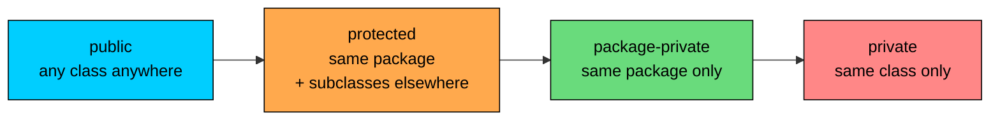
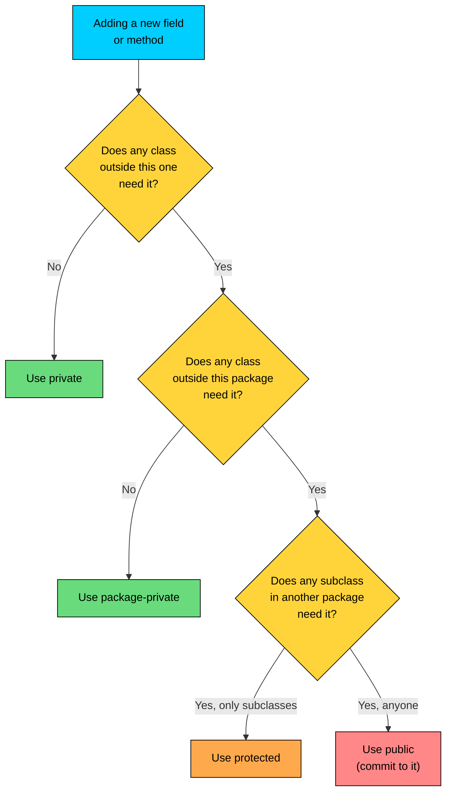

import React from 'react';
import CodeBlock from '../../../../components/ui/CodeBlock';
import Callout from '../../../../components/ui/Callout';

<div className="article-header">
  <div className="breadcrumb">
    <a href="/">Curated Notes</a>
    <span className="breadcrumb-separator">›</span>
    <span className="breadcrumb-current">Data Hiding</span>
  </div>
  <h1>Data Hiding</h1>
  <p style={{ color: 'var(--text-muted)', fontSize: '1.1rem', marginBottom: '16px', lineHeight: '1.6' }}>
    Master the essentials of Data Hiding in this curated guide.
  </p>
  <div className="meta-info">
    <span className="meta-item">
      <svg width="14" height="14" viewBox="0 0 24 24" fill="none" stroke="currentColor" strokeWidth="2"><circle cx="12" cy="12" r="10"/><polyline points="12 6 12 12 16 14"/></svg>
      10 min read
    </span>
    <span className="difficulty-badge difficulty-badge--intermediate">Intermediate</span>
  </div>
</div>

<section className="content-section">

As covered in *Encapsulation Basics*, the point of wrapping a class's fields behind methods is to keep callers from depending on the internal layout and to keep bad data from sneaking in. That whole story rests on one mechanism: the ability to say "this part of the class is mine, that part is yours." Java spells out those rules with four access modifiers, and these choices decide what is hidden and what is exposed. This lesson covers the four modifiers in depth, the gotchas around the package-private default and `protected`, and the two patterns that finish the job: defensive copies and validating setters.

---

## The Four Access Modifiers

Java has four access levels for fields, methods, constructors, and (for top-level types) classes. Three of them are keywords. The fourth, the most common default, has no keyword at all.


| Modifier | Keyword | Visible to |
| --- | --- | --- |
| `public` | `public` | Everyone |
| `protected` | `protected` | Same package, plus subclasses in any package |
| package-private | _(none)_ | Same package only |
| `private` | `private` | Same class only |


That single table is the whole access-control story for the language. Everything else is consequences and corner cases. Read it from top to bottom and the levels get strictly tighter: each row can see everything the row below it can see, plus a bit more.

The same idea drawn out:





The arrow direction is "shrinks down to." A `public` member is the most visible. A `private` member is the least. The boundary crossed in each step is a real one: classes versus subclasses, package versus other packages, the world versus the package.

The modifier goes right after the access slot in the declaration, before any other modifier like `static` or `final`:


```java
public class Product {
    public String name;
    protected double cost;
    int stockCount;        // package-private (no keyword)
    private String sku;
}
```


Four fields, four levels. The compiler reads each declaration and records the visibility. Anything trying to touch a field from outside the allowed zone gets a compile error.

Access control is enforced entirely at compile time for normal source. There is no runtime check and no overhead for picking a tighter modifier. Picking the right level is free.

A working example that shows the rules in action, in one file. A cross-package split follows:


```java
public class AccessDemo {
    public String openField = "anyone can read this";
    protected String subclassField = "subclasses or same package";
    String packageField = "same package only";
    private String secretField = "only this class";

    public void printAll() {
        System.out.println(openField);
        System.out.println(subclassField);
        System.out.println(packageField);
        System.out.println(secretField);
    }

    public static void main(String[] args) {
        AccessDemo demo = new AccessDemo();
        demo.printAll();
    }
}
```


Inside the class, every field is reachable. The `printAll` method touches all four without issue because it lives in `AccessDemo` itself. The interesting question is what happens when a different class tries the same reads, and that depends on where that other class lives.

---

## `public`: The Wide-Open Door

`public` makes a member visible to every class in the program, in every package, related or not. Once a member is marked `public`, callers anywhere can read it, write it, or call it. That is the contract.


```java
public class Customer {
    public String name;
    public String email;

    public Customer(String name, String email) {
        this.name = name;
        this.email = email;
    }

    public String formatLine() {
        return name + " <" + email + ">";
    }
}

public class Checkout {
    public static void main(String[] args) {
        Customer alice = new Customer("Alice", "alice@example.com");
        System.out.println(alice.formatLine());

        alice.email = "alice@new.com";
        System.out.println(alice.formatLine());
    }
}
```


Reading and writing both compile from a completely unrelated class. The `email` field is `public`, so `Checkout` can reassign it without going through any method. The constructor is `public`, so `Checkout` can call `new Customer(...)`. The `formatLine` method is `public`, so `Checkout` can call it.

This is the appeal and the danger of `public`. The appeal: callers can use the class. The danger: every public member is a forever commitment. Once a field or method is part of the public API, removing it or changing its type breaks callers that the author cannot see. Public fields are worse than public methods because they advertise the internal storage layout, not just the behavior. Switching from a `String email` to two fields `String local` and `String domain` breaks every caller that wrote `alice.email = ...`.

The class itself can also be `public`. A `public` top-level class lives in a file named after the class (`Customer.java` for `public class Customer`) and is visible everywhere. A non-public top-level class is package-private and only usable within its package.

A special rule about constructors. A `public` constructor lets any class call `new` on this one. If every constructor on a class is non-public, code outside that visibility scope cannot create instances at all, even though the class type might be visible. This is one of the building blocks for singleton classes and factory methods.


```java
public class GiftCard {
    public double balance;

    public GiftCard(double balance) {
        this.balance = balance;
    }
}
```


`public class` plus `public` constructor plus `public` field. Three different `public` keywords, three different scopes. The class is visible everywhere. The constructor is callable everywhere. The field is readable and writable everywhere. Each one is a separate decision.

---

## `private`: The Locked Room

`private` is the strictest level. A `private` member is visible only inside the class that declares it. Not its subclasses. Not its package. Just the class itself.


```java
public class Customer {
    private String name;
    private String email;

    public Customer(String name, String email) {
        this.name = name;
        this.email = email;
    }

    public String getName() {
        return name;
    }

    public String getEmail() {
        return email;
    }

    public void setEmail(String email) {
        this.email = email;
    }
}

public class Checkout {
    public static void main(String[] args) {
        Customer alice = new Customer("Alice", "alice@example.com");

        System.out.println(alice.getName() + " <" + alice.getEmail() + ">");

        alice.setEmail("alice@new.com");
        System.out.println(alice.getName() + " <" + alice.getEmail() + ">");
    }
}
```


`Checkout` cannot touch `name` or `email` directly anymore. The compiler rejects `alice.email = "...";` outright:


```java
alice.email = "alice@new.com";  // won't compile
```


```shell
Checkout.java: error: email has private access in Customer
        alice.email = "alice@new.com";
             ^
```


The fix is the setter. Callers go through `setEmail`, which lives inside `Customer` and is therefore allowed to touch `email`. That sounds like ceremony for the same outcome, but it is not. The class now controls what assignment to `email` actually does.

`private` is where the **minimal API surface** rule applies. The default choice for any new field should be `private`. If no caller from outside needs to read it, nobody does. Widening from `private` to something else later is a non-breaking change: every existing call site keeps working, because everyone with access already had access. Tightening from `public` to `private` is a breaking change: every caller that touched the field stops compiling. Start tight, widen on demand.

A `private` constructor is also a useful tool. It prevents code outside the class from calling `new`:


```java
public class Inventory {
    public int totalItems;

    private Inventory(int totalItems) {
        this.totalItems = totalItems;
    }

    public static Inventory empty() {
        return new Inventory(0);
    }

    public static Inventory withStock(int initial) {
        if (initial < 0) {
            throw new IllegalArgumentException("Stock can't be negative: " + initial);
        }
        return new Inventory(initial);
    }
}

public class InventoryDemo {
    public static void main(String[] args) {
        Inventory store = Inventory.withStock(50);
        System.out.println("Stock: " + store.totalItems);
    }
}
```


Callers cannot write `new Inventory(50)` from outside the class. They have to go through `withStock`, which validates the argument first. The constructor is still there, doing the actual initialization, but it is gatekept behind code that runs the checks.

A `private` field accessed through a getter is just as fast as a public field at runtime. The JVM inlines simple getters, so the indirection vanishes in practice. Picking `private` costs nothing.

---

## Package-Private: The Modifier With No Keyword

Java does not give this level a keyword. A field with no access modifier is package-private:


```java
public class Cart {
    int itemCount;              // package-private (default)
    double total;               // package-private (default)
}
```


`itemCount` and `total` are visible to any class in the same package as `Cart`. They are invisible to classes in any other package. There is no `package` keyword in front of them. The absence of `public`, `protected`, or `private` is what makes them package-private.

"No modifier" looks identical to "I forgot to write one." A field written without an access level is not `public`; it is package-private, which is one of the tightest levels. Code in another package that tries to touch the field gets a compile error that looks like a "missing import" issue.

A concrete example. Two packages, two classes:


```java
// File: com/example/orders/Cart.java
package com.example.orders;

public class Cart {
    public String customerName;
    int itemCount;              // package-private
    private double total;
}
```


```java
// File: com/example/orders/CartPrinter.java
package com.example.orders;

public class CartPrinter {
    public static void print(Cart cart) {
        System.out.println(cart.customerName + " has " + cart.itemCount + " items");
    }
}
```


```java
// File: com/example/web/CartHandler.java
package com.example.web;

import com.example.orders.Cart;

public class CartHandler {
    public static void handle(Cart cart) {
        System.out.println(cart.customerName);
        System.out.println(cart.itemCount);  // won't compile
    }
}
```


`CartPrinter` lives in `com.example.orders`, same package as `Cart`. It can read `itemCount` without issue. `CartHandler` lives in `com.example.web`, a different package. The line that touches `itemCount` from `CartHandler` fails:


```shell
CartHandler.java: error: itemCount is not public in Cart; cannot be accessed from outside package
        System.out.println(cart.itemCount);
                              ^
```


Note the error message: "is not public in Cart". The compiler does not say "is package-private" because there is no keyword to name. It just says the field is not accessible from outside the package.

When does package-private fit? Two situations come up:

- **Helper classes within a package.** A package can have several classes that cooperate. The top-level entry point is `public`. The internals are package-private, so the package can use them but outside callers cannot see them at all. This is how a lot of the standard library is organized.
- **Test-only access.** A common practice is to put unit tests in the same package as the class under test, so the tests can read fields and call methods that are not `public`. The fields stay hidden from the rest of the application but are reachable from tests.

If neither situation applies, picking package-private over `private` is rarely worth it. Code in a single package treats `private` and package-private the same in small examples. The day code is split across packages, the difference shows up.

One related rule about classes themselves. A top-level class with no access modifier is also package-private. Only one class per file can be `public`, and that class has to match the filename. Everything else in the file is package-private by default:


```java
// File: Cart.java
public class Cart {            // public, file name matches
    // ...
}

class CartItem {               // package-private
    // ...
}
```


`CartItem` is reachable from code in the same package but invisible elsewhere. Putting helper classes in the same file as the main public class is one way to express "this is an implementation detail nobody outside should use." The compiler enforces it.

---

## `protected`: Subclass Access Across Packages

`protected` is the trickiest of the four because it does two things at once. A `protected` member is visible to:

1. Every class in the same package (just like package-private).
2. Subclasses of the declaring class, even if those subclasses live in a different package.

The first part is the boring half. Code that lives in one package treats `protected` and package-private the same. The interesting half is the second part:


```java
// File: com/example/payments/PaymentMethod.java
package com.example.payments;

public abstract class PaymentMethod {
    protected String holderName;

    public PaymentMethod(String holderName) {
        this.holderName = holderName;
    }
}
```


```java
// File: com/example/wallet/GiftCard.java
package com.example.wallet;

import com.example.payments.PaymentMethod;

public class GiftCard extends PaymentMethod {
    public double balance;

    public GiftCard(String holderName, double balance) {
        super(holderName);
        this.balance = balance;
    }

    public void printOwner() {
        System.out.println("Gift card held by: " + holderName);   // OK
    }
}
```


`GiftCard` is in `com.example.wallet`. `PaymentMethod` is in `com.example.payments`. Different packages. `holderName` is `protected`. The line inside `printOwner` reads `holderName` directly and compiles, because `GiftCard` is a subclass of `PaymentMethod`. Protected access opened the door across the package boundary, but only for subclasses.

The same reach does not extend to unrelated classes in the wallet package:


```java
// File: com/example/wallet/Checker.java
package com.example.wallet;

import com.example.payments.PaymentMethod;

public class Checker {
    public static void main(String[] args) {
        GiftCard card = new GiftCard("Alice", 50);
        System.out.println(card.holderName);   // won't compile
    }
}
```


```shell
Checker.java: error: holderName has protected access in PaymentMethod
        System.out.println(card.holderName);
                              ^
```


`Checker` is in the same package as `GiftCard`, but `Checker` is not a subclass of `PaymentMethod`. It cannot reach across the package boundary to a `protected` member declared in `com.example.payments`. Being a subclass is the key that unlocks `protected`, not being a neighbor in the package.

One more subtlety. A subclass can access `protected` members through its own kind of reference, but not through an arbitrary reference to the parent type:


```java
public class GiftCard extends PaymentMethod {
    // ...

    public static void reach(PaymentMethod other, GiftCard another) {
        System.out.println(another.holderName);   // OK: through GiftCard reference
        System.out.println(other.holderName);     // won't compile across packages
    }
}
```


From inside `GiftCard`, reading `holderName` through a `GiftCard` reference is allowed. Reading the same field through a `PaymentMethod` reference, when the two classes are in different packages, is not. The reasoning: `protected` is for subclasses to extend the parent's behavior, not for one subclass to access another subclass's state through the parent type.

`protected` vs package-private comes up often, and the difference is exactly this cross-package subclass case:


| Scenario | Package-private | `protected` |
| --- | --- | --- |
| Same package, unrelated class | Visible | Visible |
| Same package, subclass | Visible | Visible |
| Different package, unrelated class | Hidden | Hidden |
| Different package, subclass | Hidden | Visible |


The two modifiers are identical inside a single package. They diverge the moment a package boundary is crossed with a subclass. Pick `protected` when designing a class to be extended across package boundaries (the abstract base class pattern fits here). Pick package-private when extension is meant to stay inside the package.

A note on modules. Java 9 added a module system that adds another layer on top of packages, where a module decides which packages to export. Even a `public` class in an unexported package is invisible outside the module. For everything in this lesson, assume all packages are visible across module boundaries.

---

## Public Fields Break Encapsulation

With the four modifiers on the table, the obvious question is "why not just make everything `public` and skip all this?" The short answer: public fields give the class no place to put rules. The longer answer has two pieces: invariants and API evolution.

Start with invariants. An invariant is something a class promises is always true about its state. A `Cart` might promise "the total equals the sum of item prices times quantities." An `Order` might promise "the status is one of `PLACED`, `SHIPPED`, `DELIVERED`, or `CANCELLED`, and it only moves forward." A `Product` might promise "the price is never negative."

If a field is `public`, the class cannot enforce any of those rules. Callers assign to the field directly, and the class has no way to inspect what they wrote.


```java
public class Order {
    public double total;
    public String status;
}

public class BrokenOrder {
    public static void main(String[] args) {
        Order order = new Order();
        order.total = -50.00;                  // negative total, allowed
        order.status = "UNICORN_DELIVERY";     // bogus status, allowed
        System.out.println(order.status + ": $" + order.total);
    }
}
```


The compiler does not object. The runtime does not object. The class never had a chance to say "that is not a real status." The invariants exist only in the design documents.

Wrap the fields and the class gets a chance to enforce them:


```java
public class Order {
    private double total;
    private String status;

    public void setTotal(double total) {
        if (total < 0) {
            throw new IllegalArgumentException("Total can't be negative: " + total);
        }
        this.total = total;
    }

    public void setStatus(String status) {
        if (!status.equals("PLACED") && !status.equals("SHIPPED")
                && !status.equals("DELIVERED") && !status.equals("CANCELLED")) {
            throw new IllegalArgumentException("Unknown status: " + status);
        }
        this.status = status;
    }

    public double getTotal() { return total; }
    public String getStatus() { return status; }
}
```


The same bad assignments now throw. The class catches them before the bad state ever lands in the object. The invariants stop being aspirational and start being enforced.

The second problem with public fields is API evolution. A public field commits the class to that exact storage layout for the lifetime of the API. Consider this:


```java
public class Customer {
    public String fullName;
}
```


Callers across the codebase write `customer.fullName = "Alice Smith"` and read `customer.fullName`. A later change to split the name into `firstName` and `lastName` is impossible with a public field. Every existing caller would break. With a `private` field and a getter/setter pair, there is room:


```java
public class Customer {
    private String firstName;
    private String lastName;

    public String getFullName() {
        return firstName + " " + lastName;
    }

    public void setFullName(String fullName) {
        int space = fullName.indexOf(' ');
        this.firstName = fullName.substring(0, space);
        this.lastName = fullName.substring(space + 1);
    }
}
```


The internal storage changed. The external API did not. Existing callers keep working. New callers can use richer methods when added. This kind of refactor is invisible from the outside, which is the whole point of hiding the field.

Public fields are not always wrong. Constants (`public static final`) are routinely public, because they do not represent mutable state. Records expose their components publicly through accessor methods that happen to look like fields. But for ordinary mutable state on a class, `public` fields trade away every chance to enforce rules or evolve the implementation. The cost shows up later, in code that is hard to change.

---

## Validating Setters

Hiding a field behind a setter only matters if the setter does something useful. The "useful" part is almost always validation: check the new value before assigning it. If the value would violate an invariant, refuse it by throwing an exception.

The standard exception for "you passed me a bad argument" is `IllegalArgumentException`. It is an unchecked exception, so it does not have to be declared in the method signature.


```java
public class Product {
    private String name;
    private double price;
    private int stockCount;

    public Product(String name, double price, int stockCount) {
        setName(name);
        setPrice(price);
        setStockCount(stockCount);
    }

    public void setName(String name) {
        if (name == null || name.isBlank()) {
            throw new IllegalArgumentException("Name can't be blank");
        }
        this.name = name;
    }

    public void setPrice(double price) {
        if (price < 0) {
            throw new IllegalArgumentException("Price can't be negative: " + price);
        }
        this.price = price;
    }

    public void setStockCount(int stockCount) {
        if (stockCount < 0) {
            throw new IllegalArgumentException("Stock can't be negative: " + stockCount);
        }
        this.stockCount = stockCount;
    }

    public String getName() { return name; }
    public double getPrice() { return price; }
    public int getStockCount() { return stockCount; }
}

public class ProductDemo {
    public static void main(String[] args) {
        Product book = new Product("Effective Java", 45.99, 7);
        System.out.println(book.getName() + ": $" + book.getPrice() + " (" + book.getStockCount() + " in stock)");

        try {
            book.setPrice(-10);
        } catch (IllegalArgumentException e) {
            System.out.println("Rejected: " + e.getMessage());
        }

        System.out.println("Price after rejected change: $" + book.getPrice());
    }
}
```


Three details. First, the constructor delegates to the setters. That way the validation rules live in one place. Changing "price cannot be negative" to "price cannot be more than $1,000,000" means changing one method, not two. Second, when a setter throws, the field does not change. The throw happens before the assignment, so the object is left in its previous valid state. Third, the exception message includes the offending value (`-10.0`), which makes debugging easier than a generic "bad argument."

The pattern shows up in constructors too, and it should. A constructor that takes parameters is the first place a new object can be corrupted, so the same checks belong there:


```java
public Product(String name, double price, int stockCount) {
    setName(name);
    setPrice(price);
    setStockCount(stockCount);
}
```


Calling the setters from inside the constructor guarantees that an object can never exist in an invalid state. The instant `new Product(...)` returns, every invariant holds. There is no "uninitialized for a moment" window where another piece of code could read a half-built object with garbage fields.

Calling setters from a constructor has a caveat for inheritance. A subclass's overridden setter can run before the subclass's own fields are initialized, which leads to bugs. The standard workaround in libraries that care about this: declare the setters `final` so they cannot be overridden, or call private validation helpers from both the constructor and the setters. For introductory code, calling setters from the constructor is fine; for classes designed for inheritance, prefer private helpers.

What kind of validation makes sense? A few patterns recur:

- **Range checks** for numeric fields: prices are non-negative, quantities are non-negative, percentages are between 0 and 100.
- **Null checks** for fields that do not allow null: names, emails, identifiers. Use `Objects.requireNonNull` from `java.util` for this:


```java
public void setName(String name) {
    this.name = Objects.requireNonNull(name, "name must not be null");
}
```


- **Format checks** for string fields with structure: emails contain `@`, postal codes match a pattern.
- **Enum membership** for fields that take a small set of values: order status is one of a fixed list (which is also a hint that an `enum` might be a better fit than a `String`).

The rule of thumb: "if a value would put the object into a state that no other method should have to handle, reject it now." Catching the bad value at the setter keeps every downstream method simpler.

---

## Defensive Copies for Mutable Fields

Validation is half the story. The other half is what happens when a field holds a reference to a mutable object: a `Date`, an `ArrayList`, an array, anything that has state of its own that callers can change.

Consider an `Order` that holds a list of items. The setter takes a `List<String>` and stores it.


```java
import java.util.ArrayList;
import java.util.List;

public class Order {
    private List<String> items;

    public Order(List<String> items) {
        this.items = items;
    }

    public List<String> getItems() {
        return items;
    }
}

public class BrokenDemo {
    public static void main(String[] args) {
        List<String> input = new ArrayList<>();
        input.add("Effective Java");
        input.add("Cotton T-Shirt");

        Order order = new Order(input);
        System.out.println("Order items: " + order.getItems());

        input.add("MALICIOUS_ITEM");
        System.out.println("Order items: " + order.getItems());
    }
}
```


The output is:


```shell
Order items: [Effective Java, Cotton T-Shirt]
Order items: [Effective Java, Cotton T-Shirt, MALICIOUS_ITEM]
```


The `Order` "owns" the items list. Nothing in `Order` itself touched the list after the constructor ran. But the caller still holds a reference to the same list, and mutations through that reference are visible through `getItems()`. The encapsulation is a fiction. Marking the field `private` did not help, because the field is a reference, and the actual object lives on the heap where both `Order` and the caller can see it.

The same trap exists on the other side. `getItems()` hands back the live internal list. A caller can call `order.getItems().add("...")` and mutate the order's items without ever calling a setter.


```java
order.getItems().add("YET ANOTHER ITEM");
System.out.println(order.getItems());
```


The fix is a **defensive copy**: copy the list on the way in and on the way out. The order keeps its own internal copy that callers can't reach.


```java
import java.util.ArrayList;
import java.util.List;

public class Order {
    private List<String> items;

    public Order(List<String> items) {
        this.items = new ArrayList<>(items);   // copy in
    }

    public List<String> getItems() {
        return new ArrayList<>(items);         // copy out
    }
}

public class FixedDemo {
    public static void main(String[] args) {
        List<String> input = new ArrayList<>();
        input.add("Effective Java");
        input.add("Cotton T-Shirt");

        Order order = new Order(input);
        System.out.println("Order items: " + order.getItems());

        input.add("MALICIOUS_ITEM");
        System.out.println("After caller mutation: " + order.getItems());

        order.getItems().add("STILL_BLOCKED");
        System.out.println("After getter mutation: " + order.getItems());
    }
}
```


Both attacks bounce off. The caller can mutate the input list, because `Order` no longer points at it. The caller can mutate the result of `getItems()`, because that is a fresh list too. The actual internal list stays untouchable.

Arrays have the same problem and the same solution. Taking an `int[]` in a setter, storing it directly, and handing the same array back from a getter lets the caller rewrite individual cells at any time. The fix is `Arrays.copyOf` or `clone()` on the array:


```java
import java.util.Arrays;

public class Cart {
    private int[] quantities;

    public Cart(int[] quantities) {
        this.quantities = Arrays.copyOf(quantities, quantities.length);
    }

    public int[] getQuantities() {
        return Arrays.copyOf(quantities, quantities.length);
    }
}
```


Same pattern, different copying method. The principle is the same: never store a reference handed in by an outsider, never hand back a reference to internal state.

The classic mutable-class trap in pre-Java-8 code is `java.util.Date`. A `Date` is mutable, so storing one a caller passed in opens the same hole. The fix: copy on the way in and out, using `new Date(other.getTime())`. Modern Java code avoids `Date` in favor of the `java.time` types (`LocalDate`, `Instant`, and others), which are immutable and do not need defensive copies. A field of an immutable type is safe to hand around directly, because nobody can mutate it. Defensive copies are the workaround for mutable field types; immutable types are the deeper fix.

A defensive copy of a list or array is O(n) every time the field is accepted or returned. For small collections, the cost is negligible. For large ones, repeated copies add up, which is one reason library types like `List.copyOf` (which returns a shallow unmodifiable view) and immutable classes are popular alternatives. The defensive copy approach is correct and clear; the unmodifiable view approach is correct and cheaper. Both are better than handing out the raw reference.

---

## Minimal API Surface: Default to Private, Widen on Demand

Pulling everything together, the practical rule for picking access modifiers: start as narrow as possible and widen one step at a time only when there is a real reason. The reasoning:

1. Every public member is a permanent commitment. Removing or renaming it breaks every caller.
2. Every public member is something the class can no longer change internally without affecting external behavior.
3. It is not possible to know in advance which members future callers will misuse. The safer answer is to expose nothing they do not need.

The decision tree looks like this:





The diagram walks the same logic in flowchart form. Each "no" lands at the tightest level that still works. Each "yes" widens by exactly one step.

Two consequences:

- **Widening is non-breaking.** Going from `private` to package-private, or package-private to `public`, never breaks existing callers. Everyone with access before still has access. Picking the tightest level first costs nothing when more access is needed later.
- **Tightening is breaking.** Going the other direction, from `public` to anything tighter, removes access from callers that may have relied on it. Picking a loose level "to be safe" locks the class in.

The minimal API surface rule pairs with everything else in this lesson. Validating setters work because the field is `private` and the setter is the only door in. Defensive copies work because the internal collection is `private` and the caller can never reach the real reference. Public fields would undo both. The four modifiers are not four arbitrary categories; they are a sliding scale from "fully encapsulated" to "completely exposed," and most of the value lives near the tight end.

The same rule extends to classes themselves. A class only used inside its package can be package-private. A class only used by one other class can be a nested private class. A class only used as an implementation helper inside a method can be a local class. The design principle is the same: keep the visible surface small.

---

## A Larger Worked Example

A `Customer` class that pulls together everything in this lesson: tight access modifiers, validation in setters and constructor, and a defensive copy for a mutable address-history field.


```java
import java.util.ArrayList;
import java.util.List;
import java.util.Objects;

public class Customer {
    private String name;
    private String email;
    private List<String> previousAddresses;

    public Customer(String name, String email, List<String> previousAddresses) {
        setName(name);
        setEmail(email);
        this.previousAddresses = new ArrayList<>(previousAddresses);
    }

    public String getName() { return name; }
    public String getEmail() { return email; }

    public List<String> getPreviousAddresses() {
        return new ArrayList<>(previousAddresses);
    }

    public void setName(String name) {
        Objects.requireNonNull(name, "name must not be null");
        if (name.isBlank()) {
            throw new IllegalArgumentException("name must not be blank");
        }
        this.name = name;
    }

    public void setEmail(String email) {
        Objects.requireNonNull(email, "email must not be null");
        if (!email.contains("@")) {
            throw new IllegalArgumentException("email must contain '@': " + email);
        }
        this.email = email;
    }

    public void addPreviousAddress(String address) {
        Objects.requireNonNull(address, "address must not be null");
        previousAddresses.add(address);
    }
}

public class CustomerDemo {
    public static void main(String[] args) {
        List<String> oldAddresses = new ArrayList<>();
        oldAddresses.add("123 First St");

        Customer alice = new Customer("Alice", "alice@example.com", oldAddresses);
        alice.addPreviousAddress("456 Second Ave");

        oldAddresses.add("999 Hacker Ln");
        alice.getPreviousAddresses().add("888 Also Hacker St");

        System.out.println("Name: " + alice.getName());
        System.out.println("Email: " + alice.getEmail());
        System.out.println("Previous addresses: " + alice.getPreviousAddresses());

        try {
            alice.setEmail("not-an-email");
        } catch (IllegalArgumentException e) {
            System.out.println("Rejected bad email: " + e.getMessage());
        }

        System.out.println("Email after rejected change: " + alice.getEmail());
    }
}
```


Walk through what the design does:

1. Every field is `private`. Nothing outside `Customer` can read or write them directly. The minimal surface principle in action.
2. The constructor calls `setName` and `setEmail` rather than assigning directly. Validation lives in one place per field. Both `name` and `email` are checked for null and for content before any field is touched. If validation fails, the constructor throws and no `Customer` object survives.
3. `previousAddresses` is initialized with a defensive copy of the caller's list. The caller's later `oldAddresses.add("999 Hacker Ln")` does not affect the customer.
4. `getPreviousAddresses` returns a defensive copy. The caller's later `alice.getPreviousAddresses().add("888 Also Hacker St")` adds to a throwaway list, not to the customer's actual addresses.
5. `addPreviousAddress` is the only legitimate way to extend the address list. It validates and then mutates the internal list directly, which is safe because the method is part of the class.
6. The setter for `email` rejects values that do not contain `@`. The catch in `main` shows what callers see, and the next read of `getEmail` shows that the field was not modified.

Every piece of the design exists for a reason. Stripping out any one of them re-opens a hole: drop `private` and the validation can be bypassed; drop the defensive copy and outsiders can mutate the list; drop the validation and bad data slips into a "successfully constructed" object.

---

## Common Mistakes Around Data Hiding

A short list of mistakes that come up often:

#### Adding Getters and Setters for Every Field by Default

A getter and setter pair for every private field has the same effective surface as making the field public. The encapsulation buys nothing if there is no validation in the setter and no transformation in the getter. The principle: start with no accessors and add them as callers need them, not "expose everything through methods" out of habit.

#### Skipping Validation in the Constructor

It is easy to write careful setters and then bypass them in the constructor:


```java
public Product(String name, double price) {
    this.name = name;       // no validation
    this.price = price;     // no validation
}
```


A `new Product(null, -10)` slips through and creates an object that no setter would have allowed. Have the constructor call the setters, or have both the constructor and the setters call a private `validate` method.

#### Shallow Defensive Copy When Items Are Mutable

`new ArrayList<>(otherList)` copies the list but not the items in it. If the items themselves are mutable, the caller still holds references to the same item objects and can mutate them through those references. Strings are immutable, so `List<String>` is safe with a shallow copy. A `List<Date>` is not. For mutable items, copy each item too, or design the items themselves to be immutable.

#### Using `protected` as a Loose `public`

`protected` is sometimes treated as "a bit more open than package-private, a bit less than public." That is not quite the right model. `protected` specifically widens the door to subclasses, which is a design commitment: every member exposed this way is part of the contract that subclasses can rely on. Tightening a `protected` member later breaks external subclasses. Use `protected` when extension is the intended use, not as a generic "in-between" level.

#### Returning the Internal Map or Set

The list example generalizes to every mutable collection. Returning the internal `Map` or `Set` directly from a getter has the same problem as returning the internal `List`. Either return a defensive copy or return an unmodifiable view (`Collections.unmodifiableMap(internalMap)` or `Map.copyOf(internalMap)`). The view does not pay the copy cost but throws if the caller tries to mutate.

</section>
