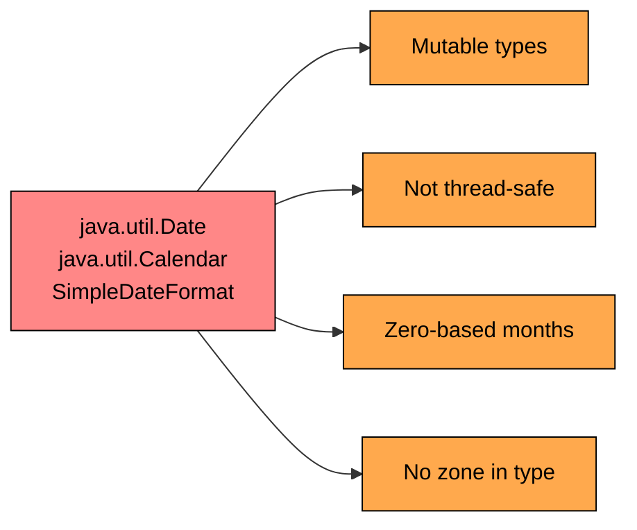
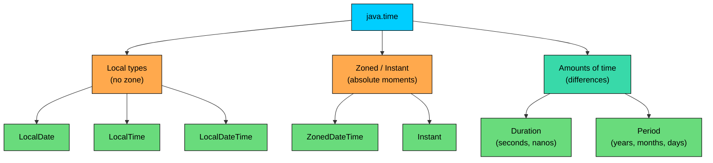
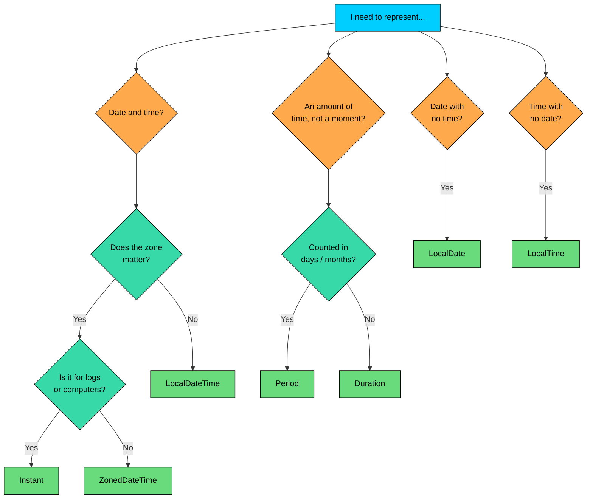
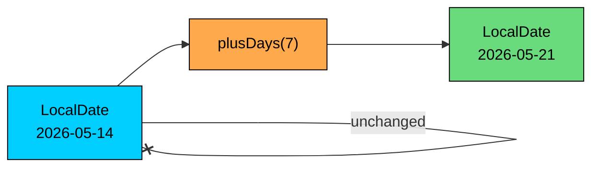

import React from 'react';
import CodeBlock from '../../../../components/ui/CodeBlock';
import Callout from '../../../../components/ui/Callout';

<div className="article-header">
  <div className="breadcrumb">
    <a href="/">Curated Notes</a>
    <span className="breadcrumb-separator">›</span>
    <span className="breadcrumb-current">Date and Time Overview</span>
  </div>
  <h1>Date and Time Overview</h1>
  <p style={{ color: 'var(--text-muted)', fontSize: '1.1rem', marginBottom: '16px', lineHeight: '1.6' }}>
    Master the essentials of Date and Time Overview in this curated guide.
  </p>
  <div className="meta-info">
    <span className="meta-item">
      <svg width="14" height="14" viewBox="0 0 24 24" fill="none" stroke="currentColor" strokeWidth="2"><circle cx="12" cy="12" r="10"/><polyline points="12 6 12 12 16 14"/></svg>
      10 min read
    </span>
    <span className="difficulty-badge difficulty-badge--intermediate">Intermediate</span>
  </div>
</div>

<section className="content-section">

Almost every program that touches an e-commerce flow also touches time. An order has a placed-at timestamp. A flash sale starts at noon on Saturday and ends at midnight. A subscription renews on the 15th of every month. A coupon expires in 7 days. This lesson covers what Java offers for working with dates and times, why the modern `java.time` package replaced the older `Date` and `Calendar` classes, and the seven core types you'll use day to day. The rest of this section unpacks each type in its own lesson; this one is the map.

---

## Why `java.time` Exists

Before Java 8, working with dates in Java meant using `java.util.Date`, `java.util.Calendar`, and `java.text.SimpleDateFormat`. Those classes are still in the JDK for backward compatibility, but they have problems serious enough that a brand-new API was added in Java 8 to replace them.

Here is what writing "the date a customer placed an order" used to involve.


```java
import java.util.Calendar;
import java.util.Date;

public class OldOrderDate {
    public static void main(String[] args) {
        Calendar calendar = Calendar.getInstance();
        calendar.set(2026, 4, 14); // What month is 4?
        Date orderPlacedAt = calendar.getTime();
        System.out.println("Order placed: " + orderPlacedAt);
    }
}
```


The output is technically correct, but the month is passed as `4` for May. `Calendar.set` uses zero-based months, so January is `0`, February is `1`, and May is `4`. December is `11`. Writing `12` doesn't produce an error; it returns January of the next year. Many shipped bugs trace back to confusing the zero-based numbering.

There are three other problems hiding in that small snippet.

First, `Date` is **mutable**. Handing a `Date` to a method allows that method to change the underlying time, and the caller has no way to know. In an e-commerce app, the "order placed" timestamp should not be editable after it's stored.

Second, `SimpleDateFormat` is **not thread-safe**. Two threads formatting dates with the same `SimpleDateFormat` instance produce scrambled output or, worse, wrong dates with no warning. Many production bugs come from a static `SimpleDateFormat` shared across an audit-log writer.

Third, `Date` has **no time-zone awareness** built into its type. A `Date` is just a count of milliseconds since 1970, but the class displays it in the JVM's default zone, so the same `Date` prints differently on a server in Mumbai than on a server in New York. There's no compile-time signal that the value carries a zone or not.





The diagram lists the four headline problems with the old API. Each one has been the source of real shipped bugs: prices applied to the wrong day, audit logs that compare timestamps incorrectly, scheduled jobs that fire an hour off after daylight saving time changes. Java 8 introduced a new package, `java.time`, designed from scratch to fix all four.

The new API is based on **JSR-310**, a Java standard authored by Stephen Colebourne, who also wrote the popular third-party **Joda-Time** library. Joda-Time had been the recommended date library for years before Java 8, and JSR-310 took its lessons and folded them into the JDK. Imports from `org.joda.time` in older code carry the same design pedigree.

Here's the same "order placed" example rewritten in the new API.


```java
import java.time.LocalDate;

public class NewOrderDate {
    public static void main(String[] args) {
        LocalDate orderPlacedAt = LocalDate.of(2026, 5, 14);
        System.out.println("Order placed: " + orderPlacedAt);
    }
}
```


The month is `5`, which is May, the same way a human reads it. The output is in ISO-8601 format, which is unambiguous. The `LocalDate` is immutable, so no method can change it under you. And the class has a clear name that says what it is: a local date, with no time and no zone.

---

## The Seven Core Types

The `java.time` package is organized around seven types that cover almost every date or time problem. Each one answers a different question.


| Type            | Answers the question                                  | E-commerce example                          |
| --------------- | ----------------------------------------------------- | ------------------------------------------- |
| `LocalDate`     | What calendar date is it?                             | Order placed-on date, coupon expiry date    |
| `LocalTime`     | What time of day is it, no date attached?             | Store opening hours, daily flash-sale start |
| `LocalDateTime` | What date and time, with no zone attached?            | Scheduled email send time in local terms    |
| `ZonedDateTime` | What date, time, and zone, accounting for DST?        | Customer-facing delivery window per region  |
| `Instant`       | Which absolute moment on the universal timeline?      | Audit-log timestamps, order placed-at       |
| `Duration`      | How much time elapsed (hours, minutes, seconds, ns)?  | How long checkout took                      |
| `Period`        | How much time elapsed in calendar units (Y/M/D)?      | Subscription length, customer tenure        |


An eighth class, `DateTimeFormatter`, isn't a date or time itself, but it's the bridge between these types and the strings used in logs, APIs, and the UI. Every `java.time` type pairs with `DateTimeFormatter` for parsing and printing.

The seven types fall into three rough groups:





The local types (`LocalDate`, `LocalTime`, `LocalDateTime`) describe a date or time the way a person would write it on a poster: "Sale starts Saturday at 12:00." There's no zone attached, so two people in different cities reading the same `LocalTime` would each interpret it in their own zone.

The zoned and instant types describe a specific moment on the universal timeline. `Instant` is the raw moment, counted in seconds and nanoseconds since 1970-01-01 UTC. `ZonedDateTime` is the same moment, but tagged with a zone so it can be displayed correctly in a particular city.

The amount types (`Duration`, `Period`) describe how much time passed between two points, not when those points were. `Duration` measures in seconds and nanoseconds (good for "the checkout took 2.4 seconds"). `Period` measures in years, months, and days (good for "this customer has been subscribed for 1 year and 3 months").

A small program that creates one of each shows the contrast.


```java
import java.time.Duration;
import java.time.Instant;
import java.time.LocalDate;
import java.time.LocalDateTime;
import java.time.LocalTime;
import java.time.Period;
import java.time.ZoneId;
import java.time.ZonedDateTime;

public class SevenTypes {
    public static void main(String[] args) {
        LocalDate orderDate = LocalDate.of(2026, 5, 14);
        LocalTime saleStart = LocalTime.of(12, 0);
        LocalDateTime emailSendAt = LocalDateTime.of(2026, 5, 14, 9, 30);
        ZonedDateTime deliveryWindow = ZonedDateTime.of(emailSendAt, ZoneId.of("Asia/Kolkata"));
        Instant placedAt = Instant.now();
        Duration checkoutTook = Duration.ofMillis(2400);
        Period subscriptionLength = Period.of(1, 3, 0);

        System.out.println("Order date:         " + orderDate);
        System.out.println("Sale starts at:     " + saleStart);
        System.out.println("Email send at:      " + emailSendAt);
        System.out.println("Delivery window:    " + deliveryWindow);
        System.out.println("Placed at (UTC):    " + placedAt);
        System.out.println("Checkout took:      " + checkoutTook);
        System.out.println("Subscription size:  " + subscriptionLength);
    }
}
```


The output reads one line at a time. The first three are local types, each printed in the way humans typically write them. The `ZonedDateTime` adds the offset (`+05:30`) and the zone name (`Asia/Kolkata`). The `Instant` shows up in UTC with a trailing `Z`. The `Duration` prints in ISO-8601 form starting with `PT` (period of time), and the `Period` prints starting with `P` (period in calendar units).

---

## Picking the Right Type: A Decision Tree

For a date-shaped problem, the question is usually not "which class is best", but "which question am I trying to answer?" A short decision tree resolves the right type 90% of the time.





A few common e-commerce cases walked through the tree:

The "placed-on date" for an order, when only the calendar date matters, lands on `LocalDate`. The store's opening hours, which apply every day but don't tie to one particular date, land on `LocalTime`. An email scheduled for "9:30 AM tomorrow", where the meaning is local-clock time and zones are out of scope, lands on `LocalDateTime`. A delivery promise of "by 6 PM tomorrow in the customer's zone" lands on `ZonedDateTime`. The "placed-at" timestamp written into an audit log lands on `Instant`, because logs from servers in different regions need to be comparable on one universal timeline.

Subscription length ("1 year, 3 months") lands on `Period`, because the unit is calendar months and the size in days depends on which months you cross. The "checkout latency was 2.4 seconds" lands on `Duration`, because the unit is fixed-length seconds.

The 10% the tree doesn't cover is mostly historical or astronomical work, which uses specialty types like `Year`, `YearMonth`, `MonthDay`, or `OffsetDateTime`. They follow the same patterns as the seven core types; the rest read as variations on the core.

---

## ISO-8601: The Default Text Format

Look back at the output of the seven-types program. Every line uses a slightly different format, but all of them follow the same standard: **ISO-8601**. This is the international standard for representing dates and times as text, and `java.time` uses it as the default for `toString` and `parse` on every type.

The format is built up from a few simple pieces.


| Piece                      | Format               | Example                            |
| -------------------------- | -------------------- | ---------------------------------- |
| Date                       | `YYYY-MM-DD`         | `2026-05-14`                       |
| Time                       | `HH:MM:SS[.nnn]`     | `09:30:00.123`                     |
| Date plus time             | Date `T` time        | `2026-05-14T09:30`                 |
| Date, time, offset         | ... `+HH:MM` or `Z`  | `2026-05-14T09:30+05:30`           |
| Date, time, offset, zone   | ... `[ZoneId]`       | `2026-05-14T09:30+05:30[Asia/Kolkata]` |
| Duration (clock time)      | `PT{...}`            | `PT2H30M`, `PT2.4S`                |
| Period (calendar units)    | `P{...}`             | `P1Y3M`, `P7D`                     |


A few useful properties fall out of this format. Sorting ISO-8601 date strings alphabetically gives chronological order, because the format puts the largest unit first. `"2026-01-31"` sorts before `"2026-02-01"` exactly the way the dates do. Logs and filenames using ISO-8601 are convenient to scan and grep.


```java
import java.time.LocalDate;
import java.time.LocalDateTime;
import java.time.Instant;

public class IsoOutputs {
    public static void main(String[] args) {
        LocalDate flashSaleDay = LocalDate.of(2026, 5, 14);
        LocalDateTime saleStart = LocalDateTime.of(2026, 5, 14, 12, 0);
        Instant auditedAt = Instant.parse("2026-05-14T06:30:00Z");

        System.out.println("Flash sale day: " + flashSaleDay);
        System.out.println("Sale start:     " + saleStart);
        System.out.println("Audited at:     " + auditedAt);
    }
}
```


The `Z` at the end of the `Instant` is ISO-8601's notation for "UTC", short for Zulu time. The `T` in the middle of a date-time is also part of the standard: it separates the date portion from the time portion.

The `parse` method on every `java.time` type accepts ISO-8601 input by default. A string from an API or a database that looks like an ISO date can be parsed without any extra formatter.


```java
import java.time.LocalDate;

public class IsoParse {
    public static void main(String[] args) {
        String input = "2026-05-14";
        LocalDate orderDate = LocalDate.parse(input);
        System.out.println("Parsed: " + orderDate);
        System.out.println("Day of week: " + orderDate.getDayOfWeek());
    }
}
```


Non-ISO formats (like `14/05/2026` or `May 14, 2026`) need an explicit `DateTimeFormatter`.

---

## Immutability: Every Operation Returns a New Object

Every type in `java.time` is **immutable**. Once a `LocalDate` exists, no method on it can change it. Instead, methods like `plusDays`, `minusMonths`, and `withYear` return a *new* `LocalDate` with the change applied. The original object stays exactly as it was.

This is a deliberate fix for the old `Date` and `Calendar` mess. Mutable date objects led to a class of bugs where one part of a program would change a timestamp and another part, holding a reference to the same object, would unexpectedly see the change.


```java
import java.time.LocalDate;

public class Immutability {
    public static void main(String[] args) {
        LocalDate orderDate = LocalDate.of(2026, 5, 14);

        // Looks like it modifies orderDate, but it doesn't.
        orderDate.plusDays(7);

        System.out.println("After 'plusDays(7)': " + orderDate);

        // The actual way: capture the returned value.
        LocalDate deliveryDate = orderDate.plusDays(7);
        System.out.println("Order date:    " + orderDate);
        System.out.println("Delivery date: " + deliveryDate);
    }
}
```


The first `plusDays(7)` call computes a new `LocalDate`, but the return value isn't captured, so it's discarded. The original `orderDate` is unchanged. The second call captures the result into `deliveryDate`, and now we have two distinct objects: the original order date and the computed delivery date.

Every arithmetic call (`plusDays`, `minusMonths`, `withYear`) allocates a fresh object. For a tight loop that builds up a date by stepping one day at a time, that allocation is real, though cheap. It is still much faster than the locking and copying that `Calendar`-based code used to do, and the JIT optimises common patterns away. The immutability matters for correctness.

The same rule applies to all seven types. `Duration.plus(Duration.ofMinutes(5))` returns a new `Duration`. `Instant.minusSeconds(30)` returns a new `Instant`. There is no setter anywhere in `java.time`.





The diagram makes the rule visual: the input `LocalDate` flows into `plusDays(7)`, a new `LocalDate` flows out, and the original is left untouched. The same shape applies to every method in `java.time`.

---

## The Shared Static Factories: `now`, `of`, `parse`

Every type in `java.time` exposes the same three families of static factory methods for creating instances. The pattern is identical across types.

The `now()` factory returns the current value according to the system clock.


```java
import java.time.Instant;
import java.time.LocalDate;
import java.time.LocalDateTime;
import java.time.LocalTime;

public class NowFactories {
    public static void main(String[] args) {
        System.out.println("Today:       " + LocalDate.now());
        System.out.println("Now (local): " + LocalTime.now());
        System.out.println("Now (LDT):   " + LocalDateTime.now());
        System.out.println("Now (UTC):   " + Instant.now());
    }
}
```


The `LocalTime` and `LocalDateTime` use the JVM's default zone to derive a local clock value. The `Instant.now()` is in UTC by definition.

The `of(...)` factories construct a value from its components.


```java
import java.time.Duration;
import java.time.LocalDate;
import java.time.LocalTime;
import java.time.Period;

public class OfFactories {
    public static void main(String[] args) {
        LocalDate launchDay = LocalDate.of(2026, 5, 14);
        LocalTime saleStart = LocalTime.of(12, 0);
        Period trial = Period.ofDays(14);
        Duration sessionTimeout = Duration.ofMinutes(30);

        System.out.println("Launch day:      " + launchDay);
        System.out.println("Sale starts:     " + saleStart);
        System.out.println("Trial length:    " + trial);
        System.out.println("Session timeout: " + sessionTimeout);
    }
}
```


Months in `LocalDate.of(2026, 5, 14)` are **one-based**. May is `5`, not `4`. This is one of the corrections `java.time` made to the old `Calendar` API.

The `parse(...)` factories build a value from an ISO-8601 string.


```java
import java.time.LocalDate;
import java.time.LocalDateTime;
import java.time.Instant;

public class ParseFactories {
    public static void main(String[] args) {
        LocalDate orderDate = LocalDate.parse("2026-05-14");
        LocalDateTime emailAt = LocalDateTime.parse("2026-05-14T09:30:00");
        Instant placedAt = Instant.parse("2026-05-14T06:30:00Z");

        System.out.println("Order date:  " + orderDate);
        System.out.println("Email at:    " + emailAt);
        System.out.println("Placed at:   " + placedAt);
    }
}
```


The same three-method pattern, `now`, `of`, `parse`, shows up on every type in the package. The pattern carries over from `LocalDate` to `Duration`, `ZonedDateTime`, and the rest.

</section>
