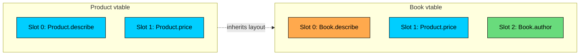
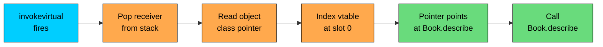

import React from 'react';
import CodeBlock from '../../../../components/ui/CodeBlock';
import Callout from '../../../../components/ui/Callout';

<div className="article-header">
  <div className="breadcrumb">
    <a href="/">Curated Notes</a>
    <span className="breadcrumb-separator">›</span>
    <span className="breadcrumb-current">Dynamic Method Dispatch</span>
  </div>
  <h1>Dynamic Method Dispatch</h1>
  <p style={{ color: 'var(--text-muted)', fontSize: '1.1rem', marginBottom: '16px', lineHeight: '1.6' }}>
    Master the essentials of Dynamic Method Dispatch in this curated guide.
  </p>
  <div className="meta-info">
    <span className="meta-item">
      <svg width="14" height="14" viewBox="0 0 24 24" fill="none" stroke="currentColor" strokeWidth="2"><circle cx="12" cy="12" r="10"/><polyline points="12 6 12 12 16 14"/></svg>
      10 min read
    </span>
    <span className="difficulty-badge difficulty-badge--intermediate">Intermediate</span>
  </div>
</div>

<section className="content-section">

A line worth repeating: "Java looks at the actual object." A `Product` reference holding a `Book` runs `Book.describe()` because the runtime, not the compiler, picks the method. That's runtime polymorphism. But it leaves an obvious question. How does the JVM actually do that? What sits between the bytecode that says "call `describe`" and the machine instructions that end up running `Book.describe`? This lesson covers the machinery: method tables, the four `invoke*` bytecodes, and the bookkeeping that turns a single source-level call into the right concrete method every time.

The discussion stays at the conceptual level. No knowledge of garbage collection or the JIT's tiered compilation is needed to understand dispatch. We'll use `javap -c` to see actual bytecode, walk through one dispatch step by step, and finish with a single performance paragraph that explains why none of this usually shows up in profilers.

---

## Method Tables Inside Every Class

Every loaded class in the JVM has a method table. It's often called a vtable, short for "virtual method table," borrowing the term from C++ where the same idea lives. Conceptually, a vtable is just an array of pointers to methods. Each instance method the class defines gets a slot in the table. When an instance method runs on an object, the JVM finds the object's class, looks up the right slot in that class's vtable, and jumps to whatever method the slot points to.

The HotSpot JVM does not literally call this structure a "vtable" in its source code (it uses a slightly different layout involving `Klass` metadata and method pointers), but the model is accurate enough to reason about dispatch and it matches what almost every JVM implementation does internally. The term "vtable" here is the conceptual contract rather than a specific data-structure name.

Subclasses do not start from scratch. They inherit the parent's vtable layout. Slot 0 of `Product`'s table holds `Product.describe`. Slot 0 of `Book`'s table holds the same conceptual slot, but the pointer is updated to point at `Book.describe` because `Book` overrode it. New methods the child adds go in new slots after the inherited ones. The slot for a given method has the same index in every class along the chain, so the JVM can look up "the describe slot" without knowing the actual subclass.





`Book`'s table starts with the same two slots `Product` has, in the same positions. Slot 0 still means "describe" regardless of the class. Because `Book` overrode `describe`, slot 0 in `Book`'s vtable points at `Book.describe` instead of the inherited version. Slot 1 was not overridden, so it still points at `Product.price`. Slot 2 is brand new for `Book`.

This layout is what makes dispatch cheap. The JVM doesn't search through the class's methods looking for a name match every time. It already knows that `describe` lives at slot 0. The only runtime work is finding the class, indexing into its table, and following the pointer.

The compiler's job during this whole arrangement is to figure out which slot to use. For `product.describe()`, the compiler looks at the declared type of `product`, which is `Product`, finds that `describe` lives at slot 0 in `Product`'s vtable, and emits bytecode that says "call slot 0." At runtime, whichever object `product` actually points to gets its class looked up, slot 0 of that class's vtable is read, and the resulting method runs. If the object is a `Book`, the slot points at `Book.describe`. If it's a plain `Product`, the slot points at `Product.describe`. The compiler picked the slot index. The runtime picked the actual method.

That split is why the "Java looks at the actual object" line works. The compiler doesn't know the actual object. It only knows the declared type. It doesn't need to know more than that, because the slot index is the same in every class along the chain. Whatever object actually shows up at runtime, its vtable has that index pointing at the right method. The compiler resolves the slot once, at link time, and from that point on the lookup is a constant-time array index regardless of how deep the hierarchy goes.

---

## The Four `invoke*` Bytecodes

The bytecode that comes out of `javac` doesn't have a single "call a method" instruction. There are four, each tuned for a different shape of call. The differences explain what dispatch actually does versus what looks like dispatch but isn't.


| Bytecode | Used For | Dispatch |
| --- | --- | --- |
| `invokestatic` | Static methods | None. The class is known at compile time. |
| `invokespecial` | Constructors, private methods, `super.x()` calls | None. The exact method is bound at compile time. |
| `invokevirtual` | Instance methods on classes | Runtime, through the receiver's vtable. |
| `invokeinterface` | Instance methods on interfaces | Runtime, through an interface table (itable). |


`invokestatic` is the simplest. There's no receiver. The method belongs to the class, not to any instance, so the JVM doesn't need to look anything up about an object. It just calls the method directly.

`invokespecial` is for the small set of calls where the exact target is fixed at compile time even though there's a receiver. Constructors are one example: a constructor can't be overridden, so a `new Book(...)` call knows it wants `Book`'s constructor specifically. Private methods are another: they aren't inherited, so the call always means "the version defined in this exact class." A `super.describe()` call is the third: writing `super` explicitly opts out of polymorphism and asks for the parent's version, regardless of the actual object.

`invokevirtual` is the workhorse. Most ordinary instance method calls compile to this. It says "the receiver is on the stack; find its class; look up slot N of the vtable; call whatever the slot points at." This is where runtime polymorphism actually happens.

`invokeinterface` does the same job as `invokevirtual`, but for methods declared on interfaces. Interfaces complicate vtables because a class can implement many interfaces, and two unrelated interfaces might both declare a method named `describe` at different slot positions. Instead of a single vtable, each class also has an interface table per interface it implements, and `invokeinterface` looks up the right slot in the right itable. The end result is the same: at runtime, the JVM picks the method based on the actual object. The point for now is that `invokeinterface` exists and dispatches dynamically the way `invokevirtual` does.

One way to think about the four bytecodes is by what they need to know at the time the call happens. `invokestatic` needs nothing about the receiver, just the target class. `invokespecial` needs a receiver to pass as `this`, but the exact method to call is already resolved at link time. `invokevirtual` needs both a receiver and an index into the receiver's vtable; the actual method comes from the table. `invokeinterface` needs all of that plus an interface identifier so it can pick the right itable. The order of those four bytecodes from cheapest to most work is roughly: `invokestatic`, `invokespecial`, `invokevirtual`, `invokeinterface`. In practice the JIT closes most of that gap, but at the raw bytecode level the cost ordering is real.

The distinction that matters most for the runtime polymorphism worldview is between the bytecodes that dispatch and the bytecodes that don't. `invokevirtual` and `invokeinterface` dispatch. `invokestatic` and `invokespecial` don't. Compile-time binding maps to the second group; runtime binding maps to the first.

---

## Seeing It With `javap -c`

The fastest way to make this concrete is to compile a small class and disassemble it. `javap -c` ships with every JDK and prints the bytecode of any compiled class. Here's the example.


```java
public class DispatchDemo {
    public static void main(String[] args) {
        Product p = new Book("Effective Java", 45.00, "Joshua Bloch");
        p.describe();
        Product.category();
        DispatchDemo demo = new DispatchDemo();
        demo.internal();
    }

    private void internal() {
        System.out.println("internal helper");
    }
}

class Product {
    String name;
    double price;

    Product(String name, double price) {
        this.name = name;
        this.price = price;
    }

    public void describe() {
        System.out.println(name + " at $" + price);
    }

    public static void category() {
        System.out.println("Products");
    }
}

class Book extends Product {
    String author;

    Book(String name, double price, String author) {
        super(name, price);
        this.author = author;
    }

    @Override
    public void describe() {
        System.out.println(name + " by " + author + " at $" + price);
    }
}
```


Save it as `DispatchDemo.java`, compile with `javac DispatchDemo.java`, then run `javap -c DispatchDemo`. The relevant bytes for `main` look like this. Comments on the right point at the interesting lines.


```shell
public static void main(java.lang.String[]);
  Code:
     0: new           #7                  // class Book
     3: dup
     4: ldc           #9                  // String Effective Java
     6: ldc2_w        #11                 // double 45.0d
     9: ldc           #13                 // String Joshua Bloch
    11: invokespecial #15                 // Method Book."<init>" - constructor
    14: astore_1
    15: aload_1
    16: invokevirtual #18                 // Method Product.describe - dispatched at runtime
    19: invokestatic  #21                 // Method Product.category - no dispatch
    22: new           #24                 // class DispatchDemo
    25: dup
    26: invokespecial #25                 // Method DispatchDemo."<init>"
    29: astore_2
    30: aload_2
    31: invokespecial #27                 // Method DispatchDemo.internal - private
    34: return
```


Look at the four `invoke*` lines.

The `invokespecial #15` at offset 11 is the `Book` constructor. Constructors always compile to `invokespecial` because there's nothing to dispatch: the type after `new` is the exact type to construct.

The `invokevirtual #18` at offset 16 is `p.describe()`. The interesting detail is the method reference: it points at `Product.describe`, not `Book.describe`, because the compiler only knew the declared type of `p`. At runtime, the JVM uses this reference to find the slot index in `Product`'s vtable layout, then looks up that slot in the actual object's class, which is `Book`. The result is that `Book.describe` runs. The bytecode never names `Book.describe` directly. The dispatch happens because `invokevirtual` uses the receiver's vtable, not the declared type's.

The `invokestatic #21` at offset 19 is `Product.category()`. No receiver, no vtable lookup, no dispatch. The method address is baked in at link time.

The `invokespecial #27` at offset 31 is the call to the private method `internal()`. Because `internal` is private, it cannot be overridden, so there is no point dispatching. The compiler uses `invokespecial` and binds straight to `DispatchDemo.internal`.

Four `invoke*` instructions, three different rules, all in one small `main`. The vtable lookup only happens on the one call that benefits from it.

A `javap -c` run takes milliseconds and is one good way to confirm what the compiler did. Use it any time the dispatch behavior of a call is unclear.

---

## Tracing One Dispatch Step by Step

Take the line `p.describe()` from the previous example, where `p` is declared `Product` but holds a `Book`. The JVM does roughly this when the `invokevirtual` instruction runs.

1. **Read the receiver from the stack.** The `aload_1` right before the `invokevirtual` pushed `p` onto the operand stack. The JVM pops it and now has a reference to the object on the heap.
2. **Follow the object's class pointer.** Every object header on the heap contains a pointer to its class metadata. The JVM dereferences that pointer to land on the `Book` class's runtime data, which includes `Book`'s vtable.
3. **Look up the slot.** The `invokevirtual` instruction carries a method reference (`Product.describe`). The JVM has already resolved this reference into a slot index, conceptually slot 0 in our running example, the first time the call was executed. That slot index is the same for every class in the hierarchy, which is why the lookup only needs the index, not the name.
4. **Read the pointer in that slot.** Slot 0 of `Book`'s vtable points at `Book.describe`.
5. **Jump to that method.** The JVM transfers control to `Book.describe`. It runs and prints `Effective Java by Joshua Bloch at $45.0`.

The whole sequence is one pointer dereference (to find the class), one indexed read (the slot), and one indirect call (the jump). That's it. There's no name lookup, no string comparison, no walking the class hierarchy. The hierarchy walk happened once, during class loading, when the JVM filled in the vtable.

One more detail. The first time a particular `invokevirtual` instruction runs, the JVM has to translate the method reference in the constant pool ("Product.describe") into an actual slot index. That translation is called resolution, and it can involve verifying access permissions, walking the class hierarchy to confirm the method exists, and updating internal caches. The cost is one-time. Once the slot index is cached for that call site, every subsequent invocation uses the cached value directly. The first call through any given bytecode instruction is slightly more expensive than every call after it, but that overhead is invisible in normal programs because resolution happens at most once per call site.





The diagram is a flowchart, but in real time these steps happen back to back in a few nanoseconds on modern hardware. The JIT often inlines the whole thing when it can prove the receiver's type, which we'll touch on at the end.

---

## Why Java Methods Are Virtual by Default

A quiet design decision is baked into all of this: every non-`static`, non-`private`, non-`final` instance method in Java is dispatched dynamically. There's no keyword to opt in. The bytecode is `invokevirtual` regardless of polymorphic intent.

C++ takes the opposite stance. In C++, methods are statically dispatched unless marked `virtual`. The C++ designers wanted dispatch to be a deliberate, paid-for feature. The cost is that if a base class author forgets the `virtual` keyword on a method, subclasses can still write an "override," but it won't actually run when called through a base pointer. The behavior depends on the static type of the pointer instead of the actual object, and the bug is silent.

Java's defaults chose safety and predictability. When inheritance is in use, the most common expectation is that overrides do override, in every direction, through any reference. Making dispatch the default removes the `virtual`-keyword error class. The cost is that every regular method call goes through `invokevirtual` whether or not the call site is actually polymorphic. That sounds expensive, but as the performance section at the end shows, the JIT removes most of that cost.

A secondary benefit to the always-virtual default is that library authors don't have to predict in advance which methods callers will want to override. In C++, omitting `virtual` from a method permanently closes the door: a subclass written years later can't add polymorphic behavior without breaking the type contract callers rely on. In Java, the door is always open by default, and authors who want to lock it can use `final`. This shifts the choice from "guess what future subclassers will need" to "lock down what definitely shouldn't change," which matches how real codebases evolve.

The Java language uses the opposite keywords to opt out of dispatch:

- `static` says "this isn't an instance method at all."
- `private` says "no subclass can see this, so dispatch is meaningless."
- `final` says "no subclass can override this, so dispatch is unnecessary."

Each of these turns `invokevirtual` into a different, non-dispatching bytecode (or lets the JIT inline straight through it). Default behavior is dispatched. Everything else is an explicit narrowing.

---

## Method Resolution in a Hierarchy

For an instance method call, the JVM resolves it by walking from the actual class up toward `Object` and picking the first match. This is the single-inheritance version of "method resolution order," and in Java it's straightforward because there's only one parent chain.

Here's a three-level hierarchy that shows the walk in action.


```java
public class ResolutionDemo {
    public static void main(String[] args) {
        Product generic = new Product();
        Product book = new Book();
        Product textbook = new Textbook();

        generic.describe();
        book.describe();
        textbook.describe();
    }
}

class Product {
    public void describe() { System.out.println("Product"); }
}

class Book extends Product {
    @Override
    public void describe() { System.out.println("Book"); }
}

class Textbook extends Book {
    // No override here.
}
```


`textbook` is a `Textbook` and `Textbook` doesn't define `describe` itself. The JVM doesn't shrug and call `Product.describe`. It walks up: `Textbook`'s vtable has slot 0 inherited from `Book`, and `Book` overrode it, so the slot points at `Book.describe`. That's the first match found while walking up, so that's what runs.

The walk is actually finished at class-loading time. `Textbook`'s vtable was built by copying `Book`'s vtable and updating any slots `Textbook` overrode. Since `Textbook` overrode nothing, slot 0 stayed at `Book.describe`. No walking happens at call time. The slot already has the right answer.

This pre-baking is also why Java's single-inheritance model is straightforward compared to languages that allow multiple inheritance of implementation. In a language like Python, where a class can inherit from several classes at once, the runtime has to compute a method resolution order (MRO) that linearizes the inheritance graph, and ambiguities have to be resolved with rules like C3 linearization. Java's interfaces allow multiple inheritance of method declarations, but only default methods bring an implementation, and the language has explicit rules for resolving conflicts there. For plain class hierarchies, the parent chain is a single line, so the resolution is just "walk up until you find a match," and even that walk happens once during class loading.

For the parent's version explicitly, write `super.describe()` from inside a child class, which compiles to `invokespecial` against the named parent's method. There's no way to call a "grandparent's" version directly. `super.super.describe()` is not legal Java. The mechanism for skipping levels would defeat the encapsulation each level was trying to provide.

---

## What Disables Dispatch

Three modifiers turn off dynamic dispatch for the methods they decorate. Each does it differently and for a different reason.

#### `final` Methods

A `final` method cannot be overridden. The compiler still emits `invokevirtual` for calls to it, because as far as the bytecode is concerned, it's an ordinary instance method. The JIT compiler knows the method is `final`, which means it can prove that the call site has exactly one possible target. With that knowledge, the JIT often replaces the virtual call with a direct call, or even inlines the method body straight into the caller.


```java
class Product {
    public final String sku() { return "SKU-001"; }
}
```


A call to `product.sku()` compiles to `invokevirtual`, but at runtime the JIT can devirtualize it because no subclass can ever override `sku`. The end result on hot code paths is a direct call with no vtable lookup, which is why marking helper methods `final` can be a small but real performance win in tight loops.

#### `private` Methods

A `private` method isn't inherited. There's nothing for a subclass to override even if it wanted to. The compiler emits `invokespecial`, which binds the call at link time, and there's no runtime lookup at all. This was the `internal()` call in our `javap` output.


```java
class Product {
    private double internalMarkup() { return 0.10; }
}
```


A call to `internalMarkup()` from inside `Product` is `invokespecial Product.internalMarkup`. The receiver matters only to provide `this`. There's no vtable in the picture.

#### `static` Methods

A `static` method belongs to the class, not to any instance. There's no receiver, so dispatch has nothing to dispatch on. The compiler emits `invokestatic`, which is the simplest of the four bytecodes: the class is named in the constant pool and the JVM jumps directly.


```java
class Product {
    public static String category() { return "Products"; }
}
```


If a subclass defines a `static` method with the same signature, it does not override anything. It **hides** the parent's static method, and which version runs depends on the declared (compile-time) type of the variable, not the actual object. Hiding is a compile-time choice, dispatched by `invokestatic` against whatever class the call was typed against. It is not polymorphism.

`final`, `private`, and `static` calls bypass the vtable entirely (or let the JIT bypass it). For a method that cannot be overridden, marking it accordingly is a clarity win first and a small performance win second.

---

## Performance: The One Paragraph You Need

The JIT (Just-In-Time compiler) is what makes virtual dispatch effectively free in normal Java code. When a call site warms up, the JIT records what types of objects actually show up there. If the site is **monomorphic** (only one type ever appears), the JIT replaces the vtable lookup with a direct call to that type's method, often inlining the method body straight into the caller. If the site is **polymorphic** (two or three types appear), the JIT generates a tiny inline cache that checks the type against a short list of recent answers and falls back to a direct call for each. Only **megamorphic** sites (many different types over time) end up paying for a full vtable lookup, and even those land in the single-digit nanosecond range. The simple cost model "virtual calls are slow" is wrong on any modern JVM. Most virtual calls in real code are inlined; the rest are nearly free.


| Call site shape | Types seen | What the JIT does | Effective cost |
| --- | --- | --- | --- |
| Monomorphic | 1 | Inline the method body, guard against type change | Comparable to a direct call |
| Polymorphic | 2-3 | Inline cache with type checks for each | Slightly more than a direct call |
| Megamorphic | Many | Fall back to full vtable lookup | A few nanoseconds |


Do not optimize away polymorphism for performance. Profile first. The JIT is better at devirtualizing than handwritten "tricks."

---

## Where This Connects

Compile-time binding is what happens for overloaded calls, `static` methods, and any method bound by `invokestatic` or `invokespecial`. Runtime polymorphism is the behavior. This lesson is the bridge between them: the runtime machinery, the bytecode, and the vtables that make runtime polymorphism happen.

</section>
