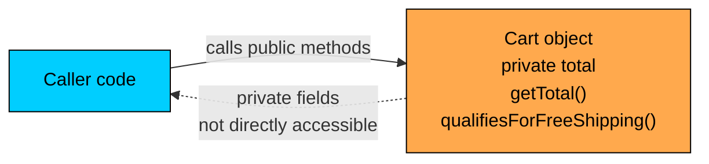
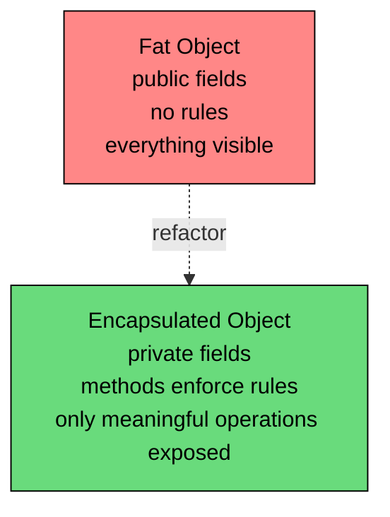

import React from 'react';
import CodeBlock from '../../../../components/ui/CodeBlock';
import Callout from '../../../../components/ui/Callout';

<div className="article-header">
  <div className="breadcrumb">
    <a href="/">Curated Notes</a>
    <span className="breadcrumb-separator">›</span>
    <span className="breadcrumb-current">Encapsulation Basics</span>
  </div>
  <h1>Encapsulation Basics</h1>
  <p style={{ color: 'var(--text-muted)', fontSize: '1.1rem', marginBottom: '16px', lineHeight: '1.6' }}>
    Master the essentials of Encapsulation Basics in this curated guide.
  </p>
  <div className="meta-info">
    <span className="meta-item">
      <svg width="14" height="14" viewBox="0 0 24 24" fill="none" stroke="currentColor" strokeWidth="2"><circle cx="12" cy="12" r="10"/><polyline points="12 6 12 12 16 14"/></svg>
      10 min read
    </span>
    <span className="difficulty-badge difficulty-badge--intermediate">Intermediate</span>
  </div>
</div>

<section className="content-section">

Encapsulation is one of the four pillars of object-oriented programming, alongside inheritance, polymorphism, and abstraction. The idea is simple to state and surprisingly hard to do well: a class should bundle its data with the operations that work on that data, and outside code should interact with it through a small, controlled set of methods instead of poking at its internals directly. This lesson covers what encapsulation is, why it exists, the basic getter and setter pattern, and how to tell the difference between encapsulation that's pulling its weight and encapsulation that's just noise.

---

## What Encapsulation Actually Means

Consider a `Product` class whose fields other parts of the program touch directly. Code that wants the price writes `product.price`. Code that wants to set the stock count writes `product.stockCount = 5`. The fields are `public`, so anyone with a reference can read or write them.

That style is convenient for a small example. It stops being convenient the moment the class needs to enforce a rule. Suppose stock count must never go negative. With public fields, every place in the codebase that writes to `stockCount` has to remember that rule. The class itself can't enforce anything; it has no idea when its own fields are being modified.

Encapsulation is the design choice to flip this around. The class controls its own data. Outside code can ask the class to do things, but the class decides what's allowed and how it's done. The internal fields become an implementation detail, and the public methods become the only door in or out.

A short, deliberately verbose definition is useful here:


&gt; **INFO**
&gt;
&gt; **Encapsulation** is bundling the state of an object (its fields) together with the behavior that operates on that state (its methods), and exposing only what callers need while hiding what they don't.


Two words in that definition do most of the work. **Bundling** means the data and the operations live in the same class, not scattered across the program. **Hiding** means the class chooses what callers can see and change, instead of letting them reach in and grab whatever they want.

Here's the contrast in code. First, a `Product` class with no encapsulation:


```java
public class Product {
    public String name;
    public double price;
    public int stockCount;
}

public class StoreDemo {
    public static void main(String[] args) {
        Product novel = new Product();
        novel.name = "Effective Java";
        novel.price = 45.99;
        novel.stockCount = 7;

        novel.stockCount = -50;
        System.out.println(novel.name + " in stock: " + novel.stockCount);
    }
}
```


The output is nonsense. A book with negative stock count doesn't make sense, but nothing stopped the assignment. The class had no opportunity to say "wait, that's not a legal value." Public fields make every caller a co-author of the class's correctness, and any single bug anywhere can corrupt the state.

Now the encapsulated version:


```java
public class Product {
    private String name;
    private double price;
    private int stockCount;

    public Product(String name, double price, int stockCount) {
        this.name = name;
        this.price = price;
        this.stockCount = stockCount;
    }

    public String getName() {
        return name;
    }

    public double getPrice() {
        return price;
    }

    public int getStockCount() {
        return stockCount;
    }

    public void setStockCount(int stockCount) {
        this.stockCount = stockCount;
    }
}

public class StoreDemo {
    public static void main(String[] args) {
        Product novel = new Product("Effective Java", 45.99, 7);
        System.out.println(novel.getName() + " in stock: " + novel.getStockCount());

        novel.setStockCount(3);
        System.out.println(novel.getName() + " in stock: " + novel.getStockCount());
    }
}
```


The fields are now `private`. Outside code can't read or write them directly. It has to go through `getName`, `getPrice`, `getStockCount`, and `setStockCount`. The class hasn't gained any rule enforcement yet, but it has gained the **option** to enforce rules. Every read and every write now flows through a method that the class controls. The class is no longer at the mercy of its callers.

That option, the ability to change the rules later without changing every caller, is the central benefit of encapsulation.

---

## Bundling State With Behavior

The "bundle" part of encapsulation gets less attention than the "hide" part, but it's just as important. A class isn't just a bag of fields; it's a unit that owns both data and the operations on that data.

Consider what happens when bundling is missing. With a cart that needs a free-shipping check (carts over $50 get free shipping), and no encapsulation, the data sits in one place and the logic sits somewhere else:


```java
public class Cart {
    public double total;
}

public class ShippingHelper {
    public static boolean qualifiesForFreeShipping(Cart cart) {
        return cart.total >= 50;
    }
}

public class CartDemo {
    public static void main(String[] args) {
        Cart cart = new Cart();
        cart.total = 65.00;
        System.out.println("Free shipping: " + ShippingHelper.qualifiesForFreeShipping(cart));
    }
}
```


The code works, but the rule "$50 is the free-shipping threshold" lives outside the `Cart` class. If three more places in the codebase need the same check, they either call `ShippingHelper` (fine) or copy the logic (not fine). And if you ever want to add a second rule, like "free shipping requires at least one physical item," you have to find every caller and update each one.

The encapsulated version pulls the behavior into the class that owns the data:


```java
public class Cart {
    private double total;

    public Cart(double total) {
        this.total = total;
    }

    public double getTotal() {
        return total;
    }

    public boolean qualifiesForFreeShipping() {
        return total >= 50;
    }
}

public class CartDemo {
    public static void main(String[] args) {
        Cart cart = new Cart(65.00);
        System.out.println("Free shipping: " + cart.qualifiesForFreeShipping());
    }
}
```


Now the rule lives on `Cart`. Anyone with a `Cart` reference can ask the cart itself whether it qualifies. The threshold of $50 is mentioned exactly once, inside the class. If it changes to $75 tomorrow, you change one line.

This is what "bundle state with behavior" looks like in practice. The class that owns the data is the right place for the methods that interpret or mutate that data. Pulling those methods out into separate helper classes is a smell, not a pattern. It usually means the original class is anemic: a record of data without the behavior that should travel with it.

A useful test: when you find yourself writing a helper method that takes one object and a few simple values and does a calculation, ask whether that method belongs on the object itself. Most of the time, it does. The helper class is a sign that the data class is missing methods it should have had from the start.





The diagram captures the shape of an encapsulated class. The caller sends messages to the object through its public methods. The private fields are inside the object, invisible to the outside. The class owns its data and the operations on it.

---

## Why Encapsulation Matters

The case for encapsulation rests on three concrete benefits. None of them are theoretical. They show up the first time you have to change a real codebase.

#### Maintainability

When a class's fields are public, the class's storage is part of its public API. Any code anywhere can write `product.price`. If you ever want to change how price is stored, say to track it as cents (an `int`) instead of dollars (a `double`) to avoid floating-point rounding, every line in the codebase that mentions `product.price` has to change. The compiler will find them eventually, but you've turned what should have been a one-class change into a project-wide refactor.

With encapsulation, the storage is private. The public methods are the API:


```java
public class Product {
    private String name;
    private long priceCents;

    public Product(String name, double priceDollars) {
        this.name = name;
        this.priceCents = Math.round(priceDollars * 100);
    }

    public String getName() {
        return name;
    }

    public double getPrice() {
        return priceCents / 100.0;
    }
}

public class PriceDemo {
    public static void main(String[] args) {
        Product novel = new Product("Effective Java", 45.99);
        System.out.println(novel.getName() + " costs $" + novel.getPrice());
    }
}
```


The class stores the price as an integer number of cents internally, but `getPrice` still returns a `double` in dollars. Callers never see the change. The class has freedom to evolve its internals because it controls its boundary.

This is the single biggest reason encapsulation exists in real codebases. Software changes constantly. Classes that hide their internals can evolve. Classes that expose their internals freeze the day they ship.

#### Invariants

An **invariant** is a rule about a class's state that should always be true. Stock count is never negative. A cart's total is the sum of its item prices. A customer's email always contains an `@`. The class is the only piece of code that can guarantee these rules, because the class is the only piece of code that can intercept every change.

With public fields, the class can't enforce anything. The rule "stock count is never negative" becomes a request to every caller: "please don't set stock count below zero." Some callers will get it right. One will get it wrong. The class can't tell which.

With private fields and public setters, the class gets the chance to check:


```java
public class Product {
    private String name;
    private int stockCount;

    public Product(String name, int stockCount) {
        this.name = name;
        this.stockCount = stockCount;
    }

    public String getName() {
        return name;
    }

    public int getStockCount() {
        return stockCount;
    }

    public void setStockCount(int stockCount) {
        if (stockCount < 0) {
            System.out.println("Refusing to set negative stock count for " + name);
            return;
        }
        this.stockCount = stockCount;
    }
}

public class InvariantDemo {
    public static void main(String[] args) {
        Product novel = new Product("Effective Java", 7);
        novel.setStockCount(3);
        System.out.println(novel.getName() + " in stock: " + novel.getStockCount());

        novel.setStockCount(-50);
        System.out.println(novel.getName() + " in stock: " + novel.getStockCount());
    }
}
```


The bad call is caught at the door. The stock count stays at 3 because the setter refused the negative value. This is a deliberately minimal example. Real codebases use exceptions instead of `println` messages. The point here is structural: putting the writes behind a method gives the class the ability to enforce its rules.

#### API Boundary

The third benefit is more about communication than enforcement. Public methods on a class form its **API**: the surface that the rest of the program is allowed to use. Anything not on that surface is an implementation detail, free to change.

When fields are public, everything is on the surface. There's no API and no implementation detail; there's just "the class." Readers of the class can't tell which fields are part of the contract and which are temporary scaffolding. Authors of the class can't tell which changes are safe and which will break callers.

When fields are private and only a handful of public methods are exposed, the class declares its boundary explicitly. The methods are the contract. The fields are scaffolding. Readers know which is which. Authors can refactor freely as long as the methods keep their behavior.

The benefits stack:


| Benefit | Without encapsulation | With encapsulation |
| --- | --- | --- |
| Changing storage | Touches every caller | One-line change in the class |
| Enforcing rules | Hopes every caller obeys | Class intercepts every change |
| Communicating intent | Everything looks equally public | Public methods are the contract |
| Tracking down bugs | Field could be modified anywhere | Field is only written inside the class |


The fourth row is worth pausing on. If `stockCount` is private and only one setter writes to it, then any bug that leaves it in a weird state must be the setter's fault. With a public field, the bug could be anywhere. Encapsulation narrows the search space.

---

## The Basic Getter and Setter Pattern

The mechanical recipe for encapsulating a single field has three parts:

1. Declare the field `private`.
2. Add a `public` method named `getFieldName()` that returns the field's value. This is the **getter**.
3. Add a `public` method named `setFieldName(...)` that takes a new value and assigns it to the field. This is the **setter**.

For a `boolean` field, the getter is conventionally named `isFieldName()` instead of `getFieldName()`. Most Java tools and libraries (including frameworks like Jackson and Spring) recognize this convention and rely on it.

A class with the pattern applied to every field:


```java
public class Customer {
    private String name;
    private String email;
    private boolean subscribedToNewsletter;

    public Customer(String name, String email, boolean subscribedToNewsletter) {
        this.name = name;
        this.email = email;
        this.subscribedToNewsletter = subscribedToNewsletter;
    }

    public String getName() {
        return name;
    }

    public void setName(String name) {
        this.name = name;
    }

    public String getEmail() {
        return email;
    }

    public void setEmail(String email) {
        this.email = email;
    }

    public boolean isSubscribedToNewsletter() {
        return subscribedToNewsletter;
    }

    public void setSubscribedToNewsletter(boolean subscribedToNewsletter) {
        this.subscribedToNewsletter = subscribedToNewsletter;
    }
}

public class CustomerDemo {
    public static void main(String[] args) {
        Customer alice = new Customer("Alice", "alice@example.com", true);
        System.out.println(alice.getName() + " (" + alice.getEmail() + ")");
        System.out.println("Subscribed: " + alice.isSubscribedToNewsletter());

        alice.setSubscribedToNewsletter(false);
        System.out.println("Subscribed: " + alice.isSubscribedToNewsletter());
    }
}
```


The pattern is mechanical enough that every Java IDE generates it automatically from the field declarations. That's both a feature and a warning. The pattern is so easy to apply that learners often apply it everywhere, including places where it adds nothing but noise.

A few naming details that matter:

- The method name follows the **JavaBeans convention**: `get` or `is` followed by the field name with its first letter capitalized. `name` becomes `getName`, `subscribedToNewsletter` becomes `isSubscribedToNewsletter`. Frameworks that introspect Java classes (serialization libraries, ORMs, template engines) rely on this convention; deviating from it can break those tools.
- The setter is `set` followed by the field name with its first letter capitalized. `setName`, `setEmail`, `setSubscribedToNewsletter`.
- The parameter name in the setter usually matches the field name. The body uses `this.fieldName = fieldName` to disambiguate. `this` tells the compiler that the left side refers to the field and the right side refers to the parameter.

Getters and setters are regular method calls. The JVM inlines them after the method has been called a few times, so the runtime cost is the same as a direct field access. The "performance penalty" of encapsulation is a myth in modern Java.

---

## The "Fat Object" Anti-Pattern

The shorthand "fat object" refers to a class with too many `public` fields and nothing protecting them. The class is technically an object, but it offers no encapsulation; it is a data record dressed up in a class declaration. Some books call this an **anemic data class** or a **DTO with no boundary**. The exact label does not matter. The shape is the problem.

An example:


```java
public class Order {
    public String orderId;
    public String customerName;
    public String customerEmail;
    public String shippingAddress;
    public double subtotal;
    public double tax;
    public double shipping;
    public double total;
    public String status;
}

public class OrderProcessor {
    public static void main(String[] args) {
        Order order = new Order();
        order.orderId = "ORD-1001";
        order.customerName = "Alice";
        order.customerEmail = "alice@example.com";
        order.shippingAddress = "123 Main St";
        order.subtotal = 100.00;
        order.tax = 8.00;
        order.shipping = 5.00;
        order.total = order.subtotal + order.tax + order.shipping;
        order.status = "placed";

        order.status = "shipped";
        order.total = -50.00;
        order.customerEmail = "not-an-email";

        System.out.println("Order " + order.orderId + " for " + order.customerName);
        System.out.println("Status: " + order.status + ", Total: $" + order.total);
    }
}
```


Several things are wrong with this design, and they're all symptoms of the same root cause: the class doesn't own its data.

- The total is set by the caller. The class makes no attempt to keep `total` in sync with `subtotal`, `tax`, and `shipping`. The caller could (and did) overwrite `total` with `-50.00`, and the class has no opinion about it.
- The status is a free-form `String`. Nothing prevents `order.status = "banana"`. The set of valid statuses is implicit and unenforced.
- The email is a `String` with no shape requirement. Setting it to `"not-an-email"` works fine.
- The relationships between fields are invisible. A reader has to guess what depends on what.

The encapsulated version pulls these decisions into the class:


```java
public class Order {
    private String orderId;
    private String customerName;
    private String customerEmail;
    private String shippingAddress;
    private double subtotal;
    private double tax;
    private double shipping;
    private String status;

    public Order(String orderId, String customerName, String customerEmail,
                 String shippingAddress, double subtotal, double tax, double shipping) {
        this.orderId = orderId;
        this.customerName = customerName;
        this.customerEmail = customerEmail;
        this.shippingAddress = shippingAddress;
        this.subtotal = subtotal;
        this.tax = tax;
        this.shipping = shipping;
        this.status = "placed";
    }

    public String getOrderId() {
        return orderId;
    }

    public String getCustomerName() {
        return customerName;
    }

    public String getCustomerEmail() {
        return customerEmail;
    }

    public String getShippingAddress() {
        return shippingAddress;
    }

    public double getSubtotal() {
        return subtotal;
    }

    public double getTax() {
        return tax;
    }

    public double getShipping() {
        return shipping;
    }

    public double getTotal() {
        return subtotal + tax + shipping;
    }

    public String getStatus() {
        return status;
    }

    public void markShipped() {
        this.status = "shipped";
    }
}

public class OrderDemo {
    public static void main(String[] args) {
        Order order = new Order("ORD-1001", "Alice", "alice@example.com",
                                "123 Main St", 100.00, 8.00, 5.00);

        System.out.println("Order " + order.getOrderId() + " for " + order.getCustomerName());
        System.out.println("Status: " + order.getStatus() + ", Total: $" + order.getTotal());

        order.markShipped();
        System.out.println("Status: " + order.getStatus() + ", Total: $" + order.getTotal());
    }
}
```


A few things changed structurally, and all of them follow from "the class owns its data":

- **Total is computed, not stored.** `getTotal()` adds the three components. There's no field to get out of sync, no opportunity for a caller to overwrite it with a wrong value, and no risk of two fields disagreeing.
- **Status changes through a verb method.** `markShipped()` is a domain operation, not a generic setter. The class controls which status transitions are even expressible. If "placed → shipped → delivered" is the only allowed sequence, that sequence can be enforced inside `markShipped()` and other transition methods. The structural move is to expose meaningful operations instead of raw field writes.
- **No setters for fields that shouldn't change after creation.** The order ID, customer info, and amounts are set in the constructor and never changed. There's no `setOrderId(...)` because changing the ID of an existing order doesn't make sense in the domain.

The fat object exposes everything because that's the path of least resistance. The encapsulated object exposes only what callers actually need, and it does so through methods that match real operations on the data.





The refactor from fat object to encapsulated object is one of the most common improvements you'll make in a Java codebase. It rarely changes external behavior. It usually changes the surface area of bugs by an order of magnitude.

---

## When Getters and Setters Are Just Noise

The mechanical getter-and-setter pattern is useful, but applied without thought it produces a different kind of fat object: one where every field has a `getX` and `setX`, the methods do nothing but pass the value through, and the result is a class that's twice as long as the public-fields version while offering exactly the same level of protection.

Here's an example of the pattern gone wrong:


```java
public class Product {
    private String name;
    private double price;
    private int stockCount;

    public String getName() { return name; }
    public void setName(String name) { this.name = name; }

    public double getPrice() { return price; }
    public void setPrice(double price) { this.price = price; }

    public int getStockCount() { return stockCount; }
    public void setStockCount(int stockCount) { this.stockCount = stockCount; }
}
```


If every getter just returns the field and every setter just assigns it, the class has private fields, but it has no boundary. A caller can read anything, write anything, and put the object in any state. The only thing the class is doing that public fields wouldn't do is forcing callers to type more.

This pattern is sometimes mocked as **cargo-cult encapsulation**. The mechanics of encapsulation are present, but the meaning is missing. The class isn't enforcing any rule, computing any derived value, or hiding any decision. It's just paying the syntactic tax of methods without getting the semantic benefit.

That said, sometimes the pattern is still worth keeping, even when the methods are pass-through today. Two reasons to defend it:

- **Future flexibility.** Even a trivial `getPrice()` gives the class a place to add logic later (logging, lazy computation, unit conversion, validation) without changing the call sites. With public fields, you'd have to refactor every caller. With pass-through accessors, you change one method.
- **Framework requirements.** Many Java frameworks require the JavaBeans pattern. Serialization libraries (Jackson, Gson), ORMs (Hibernate, JPA), template engines (Thymeleaf, JSP), and dependency injection containers (Spring) all introspect classes via getters and setters. A pure data class that needs to be serialized often needs the pattern even if the methods are trivial.

The honest answer is that the cost-benefit shifts depending on the situation. A short rule of thumb:


| Situation | Pass-through accessors are |
| --- | --- |
| The class will be serialized by a framework that requires JavaBeans | Worth it |
| The class will likely gain validation or derived logic over time | Worth it |
| The class is a small internal helper that nothing else touches | Probably noise |
| The class is a pure data carrier and you control all the callers | Consider `record` |


The last row points at a feature Java added precisely because pure data classes with trivial accessors were so common. A `record` declares fields, generates accessors, equals, hashCode, and toString automatically, and signals "this is a transparent carrier of data" without 50 lines of boilerplate. When that fits, use it. When the class needs real behavior, write the methods yourself and skip the accessors that add nothing.

---

## Encapsulation vs Abstraction

Abstraction can feel close enough to encapsulation that the distinction blurs. They are related, but they're not the same thing. Both involve choosing what to expose, but they answer different questions.

**Abstraction** asks: *what shape does this thing have?* It's about defining a type, a set of operations that any concrete implementation must support. An abstract `Discount` class doesn't care whether a discount is percentage-based or fixed-amount; it defines the common shape so the rest of the program can work with "discounts" generically. Abstraction is about modeling at the right level: ignoring details that don't matter for the operation at hand.

**Encapsulation** asks: *who is allowed to see and change this state?* It's about controlling the boundary between a class's internals and its callers. A `Cart` class with private fields and a small set of public methods isn't necessarily abstract. It's just well-encapsulated: callers go through the front door, and the kitchen stays hidden.

The two often appear together. An abstract `Discount` class can encapsulate its internal `code` and `description` fields with private modifiers and public accessors. A concrete `Cart` class can encapsulate without any abstract parent. The pillars are independent in principle, even if good design tends to use them together.

A short version: **abstraction is what a thing looks like from the outside; encapsulation is who's allowed to touch its insides.**

---

## A Worked Example Using Encapsulation Cleanly

Pulling the threads together, here's a `Cart` class that uses encapsulation deliberately. State is private. Behavior is bundled. Derived values are computed. The public surface exposes only what callers need.


```java
import java.util.ArrayList;
import java.util.List;

public class Cart {
    private String customerName;
    private List<Double> itemPrices;

    public Cart(String customerName) {
        this.customerName = customerName;
        this.itemPrices = new ArrayList<>();
    }

    public String getCustomerName() {
        return customerName;
    }

    public int getItemCount() {
        return itemPrices.size();
    }

    public double getSubtotal() {
        double sum = 0;
        for (int i = 0; i < itemPrices.size(); i++) {
            sum = sum + itemPrices.get(i);
        }
        return sum;
    }

    public double getTotalWithTax(double taxRate) {
        return getSubtotal() * (1 + taxRate);
    }

    public boolean qualifiesForFreeShipping() {
        return getSubtotal() >= 50.0;
    }

    public void addItem(double price) {
        itemPrices.add(price);
    }
}

public class CartDemo {
    public static void main(String[] args) {
        Cart cart = new Cart("Alice");
        cart.addItem(19.99);
        cart.addItem(29.99);
        cart.addItem(15.00);

        System.out.println("Cart for: " + cart.getCustomerName());
        System.out.println("Items: " + cart.getItemCount());
        System.out.println("Subtotal: $" + cart.getSubtotal());
        System.out.println("Total with 8% tax: $" + cart.getTotalWithTax(0.08));
        System.out.println("Free shipping: " + cart.qualifiesForFreeShipping());
    }
}
```


Walk through the design choices:

1. The list of item prices is private. Callers can't reach in and modify it, and the class is the only place that adds to it.
2. There's no setter for `customerName`. Whether a cart can change owners after creation is a domain question. This design says no, so the field is set in the constructor and never changed.
3. The subtotal is computed, not stored. There's no `subtotal` field that could disagree with the items. `getSubtotal()` walks the list every call. For a small cart, this is fine; for a large one, you might cache and invalidate, but that's an implementation choice the class can make later without changing its API.
4. Higher-level operations like `getTotalWithTax` and `qualifiesForFreeShipping` use `getSubtotal` internally. They're methods on the class because the data they need lives on the class.
5. `addItem` is a verb, not a setter. It describes a domain operation. Internally it appends to the list, but the caller doesn't need to know that.

If you compare this to the fat-object `Order` from earlier, the difference isn't really about "private vs public." It's about whether the class owns its data and the operations that interpret it. The encapsulated `Cart` is a real object with real responsibilities. A fat `Cart` with seven public fields would be a struct with a class declaration.

</section>
