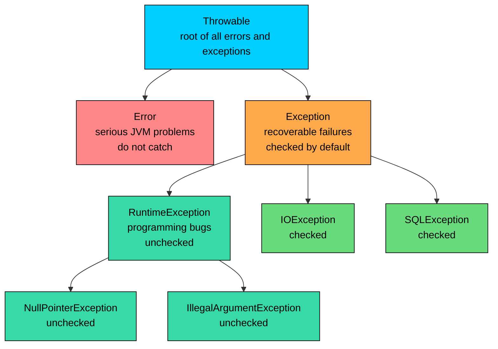
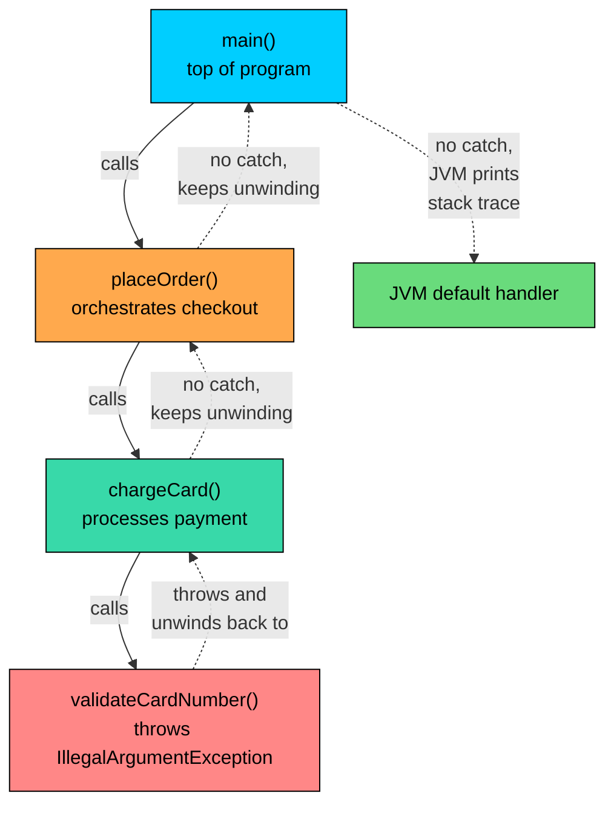

import React from 'react';
import CodeBlock from '../../../../components/ui/CodeBlock';
import Callout from '../../../../components/ui/Callout';

<div className="article-header">
  <div className="breadcrumb">
    <a href="/">Curated Notes</a>
    <span className="breadcrumb-separator">›</span>
    <span className="breadcrumb-current">Exception Basics</span>
  </div>
  <h1>Exception Basics</h1>
  <p style={{ color: 'var(--text-muted)', fontSize: '1.1rem', marginBottom: '16px', lineHeight: '1.6' }}>
    Master the essentials of Exception Basics in this curated guide.
  </p>
  <div className="meta-info">
    <span className="meta-item">
      <svg width="14" height="14" viewBox="0 0 24 24" fill="none" stroke="currentColor" strokeWidth="2"><circle cx="12" cy="12" r="10"/><polyline points="12 6 12 12 16 14"/></svg>
      10 min read
    </span>
    <span className="difficulty-badge difficulty-badge--intermediate">Intermediate</span>
  </div>
</div>

<section className="content-section">

An exception is Java's way of signalling that something went wrong during a program's execution. A customer tries to check out with an empty cart, a payment fails because the card was declined, a product lookup runs against an id that doesn't exist in the database. Each of these is a situation that the surrounding code can't handle locally and needs to communicate up the call stack. This lesson covers what an exception is, the problem it solves, the shape of the exception hierarchy in Java, what the JVM does when nobody catches one, and how to read a stack trace.

---

## The Problem Exceptions Solve

Before Java, the standard way to signal a failure from a function was a return code. The function returned a special value, usually `-1` or `0` or `null`, and the caller checked that value to decide whether to continue or recover. Java inherited this style from C, and code in this shape is still legal today.

Consider a method that looks up the price of a product in a small in-memory catalog. If the product id exists, the method returns the price. If it doesn't, the method returns a sentinel value to signal the miss.


```java
public class PriceLookupReturnCode {
    public static double getPrice(String productId) {
        if (productId.equals("P-1001")) {
            return 29.99;
        }
        if (productId.equals("P-1002")) {
            return 49.99;
        }
        return -1.0;
    }

    public static void main(String[] args) {
        double price = getPrice("P-9999");
        System.out.println("Price: " + price);
    }
}
```


The method does its job, in a sense. The caller can check `if (price == -1.0)` and recover. But the design has problems that get worse as the program grows.

First, the special value is not part of the type system. The method's return type is `double`, and `-1.0` is a perfectly valid `double`. A caller that misses the check sees `-1.0` as a price and shows the customer a refund-shaped total. The compiler has no way to flag the missing check, because nothing in the method signature says "this `double` might mean failure."

Second, every layer that calls `getPrice` has to know about the sentinel and propagate the failure manually. If `getPrice` is called inside `calculateCartTotal`, and `calculateCartTotal` is called inside `placeOrder`, each layer needs its own `if (result == -1.0) return -1.0;` line. The real logic gets buried under the failure plumbing.

Third, different kinds of failure collide on a single sentinel. A missing product, a database that's temporarily unreachable, and a price stored in the wrong format all need to be signalled to the caller, but `double` only has so many values to spare. Functions end up returning `-1.0` for one kind of failure, `-2.0` for another, and `Double.NaN` for a third, and the caller has to track the table.

An exception solves all three problems with a single mechanism. The function throws an exception instead of returning a value. The throw is a separate channel from the return value, so the success path stays clean. The exception carries a type, a message, and a stack trace, so different failures look different at the type level. And the exception travels up the call stack automatically until something catches it, so intermediate layers don't have to forward the failure by hand.

---

## What an Exception Is

In Java, an exception is an object. When something goes wrong, the code creates an instance of a class that describes the failure and hands it to the runtime with the `throw` keyword. The runtime then walks back up the call stack looking for code that has volunteered to handle this kind of failure, using a `try` and `catch` block.

Every exception object is an instance of `java.lang.Throwable` or one of its subclasses. `Throwable` is the root of the exception hierarchy. Two direct subclasses split the world in half.

The first subclass is `java.lang.Error`. These represent serious problems that an application typically cannot recover from: the JVM ran out of memory (`OutOfMemoryError`), the stack ran out of room because of unbounded recursion (`StackOverflowError`), or a required class is missing at runtime (`NoClassDefFoundError`). Application code should not try to catch `Error` instances. The convention is that when an `Error` shows up, something has gone wrong with the JVM or the environment, not with the application's own logic.

The second subclass is `java.lang.Exception`. These represent failures that an application can reasonably handle: a file doesn't exist, a network connection timed out, a string couldn't be parsed as a number, a list was accessed at an index that doesn't exist. This is the branch that day-to-day application code spends most of its time in.

Inside `Exception` sits a further split. The subclass `java.lang.RuntimeException` covers exceptions that the compiler does not force you to handle: dereferencing a `null` reference (`NullPointerException`), passing an illegal argument (`IllegalArgumentException`), going out of bounds on an array (`ArrayIndexOutOfBoundsException`). These are called **unchecked exceptions**. Everything else that descends from `Exception` (but not from `RuntimeException`) is a **checked exception**, and the compiler does force you to handle it: `IOException`, `SQLException`, `ParseException`, and friends.

The structure as a diagram.





The diagram captures the four levels that matter. `Throwable` is the root: anything that can be thrown in Java is one of these. `Error` is the branch for JVM-level problems that application code should not touch. `Exception` is the branch for application-level failures, and inside it `RuntimeException` is the unchecked sub-branch. Every concrete exception class sits somewhere on this tree, often several levels below what's shown here.

#### A Closer Look at `Throwable`

The reason every exception traces back to `Throwable` is that the JVM's throw mechanism only knows how to handle `Throwable` instances. The keyword `throw` requires an expression whose type is `Throwable` or one of its subclasses. The same constraint applies to `catch`: a `catch` parameter must be `Throwable` or a subclass. Anything else fails to compile.

`Throwable` itself defines the fields and methods that every exception inherits. The message you pass to the constructor (`new IllegalArgumentException("Quantity must be at least 1")`) is stored on `Throwable` and retrieved later through `getMessage()`. The stack trace is captured automatically inside the `Throwable` constructor and is accessible through `getStackTrace()` or rendered as text by `printStackTrace()`. The optional cause that wires one exception to another is also stored on `Throwable` and read back through `getCause()`. None of these methods are unique to `Exception` or `RuntimeException`; they all live one level up, which is why the same patterns work across the entire hierarchy.

A short program that exercises these methods on a caught exception makes the structure concrete.


```java
public class ThrowableFields {
    public static void main(String[] args) {
        try {
            Integer.parseInt("not-a-number");
        } catch (NumberFormatException e) {
            System.out.println("Message: " + e.getMessage());
            System.out.println("Class:   " + e.getClass().getName());
            System.out.println("Cause:   " + e.getCause());
            System.out.println("Frames:  " + e.getStackTrace().length);
        }
    }
}
```


The message comes from inside the JDK's `Integer.parseInt` implementation. The class name is the fully qualified type of the exception. The cause is `null` because this exception wasn't chained to a previous one. The stack-trace array has two frames because the throw happened just two methods deep, inside `Integer.parseInt`, called from `main`.

A few example exception classes from the standard library, with one-line descriptions:


| Exception class | Branch | Typical cause |
| --- | --- | --- |
| `NullPointerException` | RuntimeException | A method or field was accessed on a `null` reference. |
| `ArrayIndexOutOfBoundsException` | RuntimeException | An array was accessed at an index that doesn't exist. |
| `NumberFormatException` | RuntimeException | A string couldn't be parsed as a number, for example `Integer.parseInt("abc")`. |
| `IllegalArgumentException` | RuntimeException | A method was called with an argument that violates its contract. |
| `IOException` | Exception (checked) | A file couldn't be read, a network connection failed, a stream was closed early. |
| `OutOfMemoryError` | Error | The JVM ran out of heap memory and can't allocate any more objects. |
| `StackOverflowError` | Error | The call stack grew past its limit, usually because of unbounded recursion. |


Every entry in that table is a real class shipped with the JDK. Custom exception classes can be created by extending `Exception` or `RuntimeException` and adding whatever fields and constructors fit the domain.

---

## Throwing an Exception

The keyword that creates and signals an exception is `throw`. The syntax is `throw new SomeException("message")`. A small example to anchor the rest of this lesson.

A method that adds an item to a cart can refuse to accept a negative quantity by throwing an `IllegalArgumentException`.


```java
public class CartDemo {
    public static void addToCart(String productId, int quantity) {
        if (quantity <= 0) {
            throw new IllegalArgumentException("Quantity must be at least 1, got " + quantity);
        }
        System.out.println("Added " + quantity + " of " + productId + " to the cart.");
    }

    public static void main(String[] args) {
        addToCart("P-1001", 2);
        addToCart("P-1002", -1);
        System.out.println("This line never runs.");
    }
}
```


Three things happened. The first call to `addToCart` succeeded, so its `println` ran. The second call hit the `throw` line. Once an exception is thrown, the rest of the method is skipped: the `println` that confirms the addition never runs, and control returns to the caller. The caller is `main`, which also doesn't catch the exception, so control returns from `main` too. At that point there is no further code to run, and the JVM prints the exception details and exits.

The line `System.out.println("This line never runs.")` is reachable in the sense that the compiler accepted it, but it never executes at runtime, because control left `main` before reaching it. This is the central difference between a return value and a thrown exception: a return value continues forward, an exception jumps backward.

---

## How a Throw Unwinds the Call Stack

When an exception is thrown, the JVM stops executing the current method and starts walking back up the chain of method calls that led to the throw. At each level, the runtime checks for a `try` and `catch` block that can handle this exception type. If one exists, control resumes inside the `catch`. If none exists at that level, the runtime keeps walking up. This walk is called **stack unwinding**.

Consider a chain of three calls. `main` calls `placeOrder`, which calls `chargeCard`, which calls `validateCardNumber`. The validation throws.





The solid arrows show the calls going down. The dashed arrows show the unwinding going back up after the throw. The exception travels from `validateCardNumber` back to `chargeCard`, then to `placeOrder`, then to `main`, and finally to the JVM's default handler, because none of the methods on the way up caught it.

That same chain as runnable code:


```java
public class CheckoutFlow {
    public static void main(String[] args) {
        System.out.println("Starting checkout.");
        placeOrder("ORD-1001", "1234abcd");
        System.out.println("Checkout finished.");
    }

    public static void placeOrder(String orderId, String cardNumber) {
        System.out.println("Placing order " + orderId);
        chargeCard(cardNumber);
        System.out.println("Order placed.");
    }

    public static void chargeCard(String cardNumber) {
        System.out.println("Charging card.");
        validateCardNumber(cardNumber);
        System.out.println("Charge complete.");
    }

    public static void validateCardNumber(String cardNumber) {
        for (int i = 0; i < cardNumber.length(); i++) {
            char c = cardNumber.charAt(i);
            if (c < '0' || c > '9') {
                throw new IllegalArgumentException(
                    "Card number must be digits only, got '" + cardNumber + "'"
                );
            }
        }
    }
}
```


The println statements at the start of each method ran, because control reached them before the throw. The println statements after each nested call never ran: "Charge complete.", "Order placed.", and "Checkout finished." are all absent from the output. This is the unwinding in action. Once the throw happens inside `validateCardNumber`, every method between it and the JVM is abandoned mid-execution. Any work that was scheduled to happen after the nested call (committing the order, sending a confirmation email, deducting stock) simply does not occur.

This is the behaviour that the `finally` block exists to soften. The takeaway is simpler: a thrown exception abandons the current method and every method above it until something catches it. Code after the throw, in any of those methods, does not run.

The same rule applies regardless of how deep the call chain is. If `placeOrder` had called `chargeCard`, which had called `validateCardNumber`, which had called `parseDigits`, which had called `Character.digit`, a throw from anywhere in that chain unwinds all the way back to `main` unless something catches it on the way up. The deeper the throw, the longer the stack trace, but the mechanism is identical at every level.

One consequence to be explicit about: local variables in the abandoned methods do not survive the unwinding. The order object that `placeOrder` had assembled, the connection that `chargeCard` had opened, the partial card-number buffer that `validateCardNumber` had built up, all become garbage as soon as their methods are abandoned. If any of them required cleanup, that cleanup did not happen. This is the reason `finally` exists, and the reason `try`-with-resources was added later for the special case of closing resources.

Constructing an exception captures the current stack as part of the exception object. That capture has a real cost. Throwing exceptions in a tight loop as a form of normal control flow is much slower than checking a condition with `if`. Use exceptions for exceptional situations.

---

## What the JVM Does When Nobody Catches the Exception

When an exception reaches the top of the call stack with nobody catching it, the JVM falls back to a default handler. The handler does three things, in this order:

1. It calls `printStackTrace` on the exception, writing the output to standard error (`System.err`). The text includes the exception class, the message, and the chain of method calls that led to the throw.
2. It terminates the thread that the exception originated in. For the `main` thread, that means the program ends.
3. It sets the process exit code to `1`. A successful run exits with `0`; a run that ended because of an uncaught exception in the main thread exits with `1`. Build tools and CI systems use this code to tell success from failure.

Step three is visible on the command line.


```java
public class ExitCodeDemo {
    public static void main(String[] args) {
        throw new IllegalStateException("Something went wrong.");
    }
}
```


After running this and inspecting the shell's last-exit variable (`$?` on Linux and macOS, `%ERRORLEVEL%` on Windows), the value is `1`, not `0`. The program looked like it finished normally from the JVM's point of view in the sense that the process ended cleanly, but the non-zero exit code carries the signal that something went wrong.

For multi-threaded programs, only the thread that threw the uncaught exception dies. Other threads continue running. The default handler still prints the stack trace to standard error, but the main thread isn't necessarily affected. For a single-threaded program, "the thread dies" and "the program ends" are the same event.

One more subtlety. The JVM is free to run shutdown hooks before the process actually exits, even after an uncaught exception. Shutdown hooks are registered through `Runtime.getRuntime().addShutdownHook(...)`, which is rare in beginner-level code and gets its own treatment in advanced lessons. The short version is that the process does not vanish the instant the exception is printed; the JVM goes through its normal shutdown sequence first, then exits with code `1`.

The difference between `System.out` (standard output) and `System.err` (standard error) is visible in this behaviour. Regular `println` calls go to `System.out`; the JVM's uncaught-exception handler writes the stack trace to `System.err`. The two streams are separate. In a terminal they often look the same, but a build tool or log shipper can capture them independently, which is why the convention is to write errors to `System.err` and routine output to `System.out`. When one stream is redirected to a file, the other still appears on the screen.


```java
public class StreamsDemo {
    public static void main(String[] args) {
        System.out.println("This goes to stdout.");
        System.err.println("This goes to stderr.");
    }
}
```


Both lines appear in the terminal because by default both streams are attached to it. Pipe the program through `1>/dev/null` (suppressing stdout) and only the stderr line survives. The default exception handler always uses stderr, which is why stack traces show up even when stdout is being captured for tests or scripts.

---

## Reading a Stack Trace

The text the JVM prints when an exception goes uncaught is called a **stack trace**. Reading it quickly is a useful skill. A typical trace from a single-method throw:


```shell
Exception in thread "main" java.lang.NullPointerException: Cannot invoke "String.length()" because "couponCode" is null
	at CartDemo.applyDiscount(CartDemo.java:12)
	at CartDemo.main(CartDemo.java:4)
```


The trace has two parts. The header identifies the thread the exception was thrown in, the fully qualified class name of the exception, and the message the exception carried. In this example, the thread is `main`, the exception type is `java.lang.NullPointerException`, and the message explains that a method was called on a `null` reference named `couponCode`. The message changes from exception to exception; the rest of the structure does not.

Below the header is a list of **stack frames**, one per indented line, each starting with `at`. Each frame names a method and the file plus line number where that method was paused when the exception was thrown or when it called into the next method. The order is top-to-bottom from most recent to least recent: the first frame is where the exception was actually thrown, and the last frame is the entry point (usually `main`).

For the trace above, the reading is:

- The exception was thrown inside `CartDemo.applyDiscount` at line 12 of `CartDemo.java`.
- That method was called from `CartDemo.main` at line 4 of `CartDemo.java`.

The most useful frame is almost always the top one, because that's where the actual problem occurred. When debugging, start there. Read the file and line referenced in the top frame, look at what the message says, and the bug is usually visible immediately.

A slightly larger example that produces a multi-frame trace. The code mirrors the structure of the `CheckoutFlow` example from earlier, but the throw comes from inside the JDK rather than from explicit `throw` lines in your code.


```java
public class TraceDemo {
    public static void main(String[] args) {
        String coupon = null;
        applyCoupon(coupon);
    }

    public static void applyCoupon(String coupon) {
        int discountPercent = parsePercent(coupon);
        System.out.println("Discount: " + discountPercent + "%");
    }

    public static int parsePercent(String coupon) {
        return Integer.parseInt(coupon);
    }
}
```


Reading top to bottom: the throw originated inside `Integer.parseInt` in the JDK's `Integer.java` source file. The `java.base/` prefix on that first frame indicates the frame is from the standard library's `java.base` module, not from application code. The next frame, `TraceDemo.parsePercent`, is application code, and it's the one that called `parseInt`. Above the `parsePercent` call sat `applyCoupon`, and above that, `main`.

For debugging, the first **non-JDK** frame is usually the most actionable. The JDK frame identifies which library method failed, but the JDK's source can't be changed. The first frame from application code is where the call can be fixed. In this example, that's `parsePercent` at line 12, and the fix is to validate the coupon before calling `parseInt`, or to catch the exception locally.

#### `Caused by`: Chained Exceptions

Real programs often wrap one exception inside another. A method might catch a low-level `SQLException` and re-throw it as a higher-level `OrderProcessingException` so the caller doesn't need to know about the database. When the re-thrown exception is later printed, the original exception travels along with it as the **cause**, and the stack trace contains both.

A re-thrown trace:


```shell
Exception in thread "main" com.example.OrderProcessingException: Could not place order ORD-1001
	at com.example.OrderService.placeOrder(OrderService.java:42)
	at com.example.CheckoutController.checkout(CheckoutController.java:18)
	at com.example.App.main(App.java:7)
Caused by: java.sql.SQLException: Connection refused
	at com.example.OrderRepository.save(OrderRepository.java:65)
	at com.example.OrderService.placeOrder(OrderService.java:38)
	... 2 more
```


Two stack traces are stacked in one block. The first one is the outer exception, `OrderProcessingException`, which is what the program actually threw to the JVM. The second one, introduced by the line `Caused by:`, is the original exception that the outer one wrapped. The `... 2 more` line at the end means the next two frames of the cause's stack are identical to the outer trace's frames at the same depth, so the JVM skipped them to save space.

When debugging a chained trace, the cause is usually where the real failure originated, and the outer exception is just the layer that re-threw it with more context. Read from the bottom up to find the root cause: in this example, the `SQLException: Connection refused` is the underlying problem (the database isn't reachable), and the `OrderProcessingException` is how the application chose to surface it.

The goal here is to recognise the `Caused by:` and `... N more` parts of a trace when they appear.

---

## A Common Mistake: Swallowing the Stack Trace

The most common exception-handling antipattern is catching an exception and then ignoring it entirely. The code that does this often looks short and harmless, which is part of why it spreads.

**What's wrong with this code?**


```java
public class QuietParser {
    public static void main(String[] args) {
        String userInput = "twenty";
        try {
            int discount = Integer.parseInt(userInput);
            System.out.println("Discount: " + discount);
        } catch (NumberFormatException e) {
            // ignore
        }
        System.out.println("Done.");
    }
}
```


The program prints `Done.` and ends with exit code `0`. From the outside, nothing went wrong. From the inside, the `NumberFormatException` happened, got caught, and was thrown away. There is no log, no message, no stack trace, and no way for anyone debugging later to know that the parse failed.

If `userInput` came from an actual user, the user sees no error and no discount, and the operator looking at the logs sees nothing either. The bug is invisible.

**Fix:** at minimum, print the exception so the failure is visible. In real applications, log it through a real logging framework, and decide explicitly whether to recover or to re-throw.


```java
public class LoudParser {
    public static void main(String[] args) {
        String userInput = "twenty";
        try {
            int discount = Integer.parseInt(userInput);
            System.out.println("Discount: " + discount);
        } catch (NumberFormatException e) {
            System.err.println("Could not parse discount '" + userInput + "': " + e.getMessage());
        }
        System.out.println("Done.");
    }
}
```


The program still completes, which is the right behaviour for invalid user input, but the failure is now logged with enough context to investigate. The principle to carry forward is: a caught exception should never disappear silently.

---

## Putting the Pieces Together

A short, runnable example that demonstrates throw, propagation, and an uncaught exception terminating the program, with two layers of method calls between the throw and `main`.


```java
public class CartCheckout {
    public static void main(String[] args) {
        System.out.println("Cart contents: 1 item at $29.99");
        checkout(0);
        System.out.println("This line never runs.");
    }

    public static void checkout(int itemCount) {
        System.out.println("Starting checkout.");
        verifyCart(itemCount);
        System.out.println("Checkout completed.");
    }

    public static void verifyCart(int itemCount) {
        if (itemCount <= 0) {
            throw new IllegalStateException(
                "Cannot check out with " + itemCount + " items in the cart."
            );
        }
        System.out.println("Cart verified with " + itemCount + " items.");
    }
}
```


Trace the flow against the output. `main` prints the cart contents, then calls `checkout(0)`. `checkout` prints "Starting checkout." and calls `verifyCart(0)`. `verifyCart` sees that `itemCount` is `0`, builds an `IllegalStateException` with a precise message, and throws it. The throw abandons `verifyCart` immediately, which means the `println` after the `if` block never runs. Control returns to `checkout`, but `checkout` has no `try` and `catch`, so it's abandoned too: the "Checkout completed." line never runs. Same story in `main`: "This line never runs." matches its label.

The stack trace lists the three frames from most recent to least recent. The top frame is the line that actually threw the exception. Each subsequent frame is the caller that's now being unwound.

</section>
