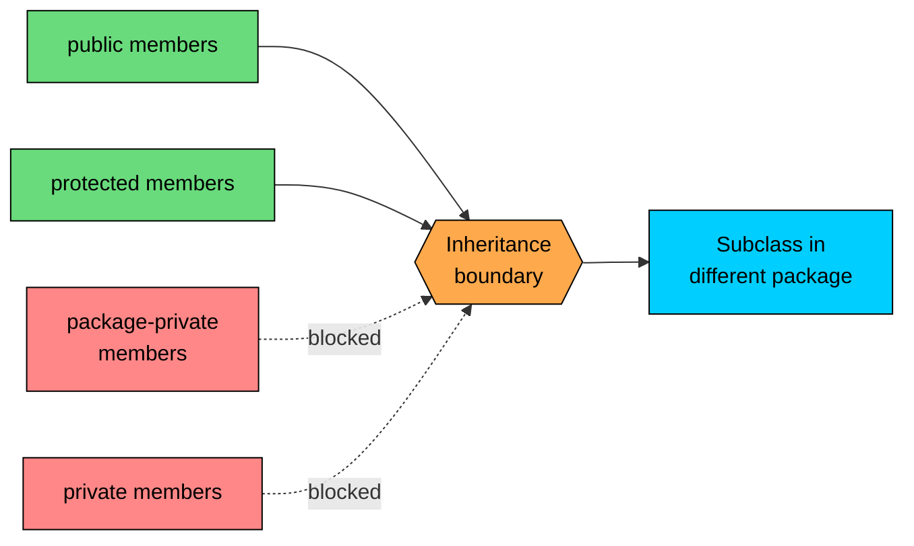
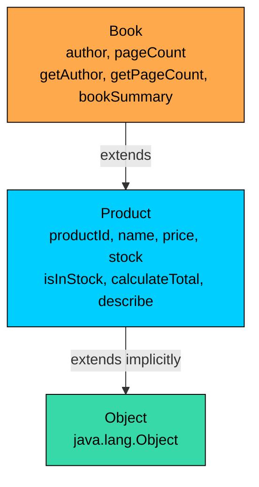

import React from 'react';
import CodeBlock from '../../../../components/ui/CodeBlock';
import Callout from '../../../../components/ui/Callout';

<div className="article-header">
  <div className="breadcrumb">
    <a href="/">Curated Notes</a>
    <span className="breadcrumb-separator">›</span>
    <span className="breadcrumb-current">extends Keyword</span>
  </div>
  <h1>extends Keyword</h1>
  <p style={{ color: 'var(--text-muted)', fontSize: '1.1rem', marginBottom: '16px', lineHeight: '1.6' }}>
    Master the essentials of extends Keyword in this curated guide.
  </p>
  <div className="meta-info">
    <span className="meta-item">
      <svg width="14" height="14" viewBox="0 0 24 24" fill="none" stroke="currentColor" strokeWidth="2"><circle cx="12" cy="12" r="10"/><polyline points="12 6 12 12 16 14"/></svg>
      10 min read
    </span>
    <span className="difficulty-badge difficulty-badge--intermediate">Intermediate</span>
  </div>
</div>

<section className="content-section">

The previous lesson motivated inheritance: when two classes share a lot of state and behavior, a parent-child relationship lets the child reuse the parent's code instead of duplicating it. This lesson covers the actual syntax Java gives you to declare that relationship, the `extends` keyword, and the exact rules for what crosses the parent-child boundary. It also covers how `final` can block inheritance entirely, and walks through a complete `Product` and `Book` example so the inheritance rules show up in real code instead of in the abstract.

---

## The `extends` Syntax

To declare that one class inherits from another, write `extends` followed by the parent class name in the child's declaration:


```java
class Book extends Product {
    // Book inherits Product's accessible members
    // Book can add its own fields and methods
}
```


The class on the right of `extends` is the **superclass** (also called the parent or base class). The class on the left is the **subclass** (also called the child or derived class). Java uses the terms "superclass" and "subclass" most consistently, so we'll stick with those.

A few mechanics:

- A class can extend **at most one** other class. Java does not allow multiple inheritance of classes. Without an `extends` clause, the class implicitly extends `java.lang.Object`. Multiple inheritance of behavior comes via interfaces.
- The `extends` clause goes after the class name and before the opening brace.
- The superclass must be visible to the subclass. If the superclass is in another package, an `import` is usually needed.
- The superclass must not be `final`.

A minimal example. `Product` is a simple superclass, and `Book` extends it without adding anything yet:


```java
public class Product {
    protected String name;
    protected double price;

    public Product(String name, double price) {
        this.name = name;
        this.price = price;
    }

    public String describe() {
        return name + " ($" + price + ")";
    }
}

class Book extends Product {
    public Book(String name, double price) {
        super(name, price);
    }

    public static void main(String[] args) {
        Book javaBook = new Book("Effective Java", 39.99);
        System.out.println(javaBook.describe());
    }
}
```


`Book` doesn't define `describe` or hold its own `name` and `price` fields, yet `javaBook.describe()` works. This is inheritance. `Book` inherited `name`, `price`, and `describe` from `Product`. The `super(name, price)` call hands the constructor arguments off to `Product`'s constructor so those inherited fields get set. For now, treat that line as "this is how the parent's constructor receives the arguments".

Only the file declaring a `public` class can have `public class Foo` in it. To keep these examples runnable in a single file, the subclass is package-private (no modifier). In real projects, both classes would normally be `public` and live in their own files.

---

## What a Subclass Inherits

With `class Book extends Product`, every accessible field and method from `Product` becomes part of `Book`'s definition too. "Accessible" depends on two things: the access modifier of the member, and whether the subclass is in the same package as the superclass.

The full matrix:


| Access modifier | Same package as superclass | Different package |
| --- | --- | --- |
| `public` | Inherited | Inherited |
| `protected` | Inherited | Inherited |
| package-private (no modifier) | Inherited | NOT inherited |
| `private` | NOT inherited | NOT inherited |


Two things to take from this table:

1. `public` and `protected` always cross the inheritance boundary. They reach the subclass no matter where the subclass lives.
2. Package-private members only cross the boundary if the subclass is in the same package as the superclass. Cross a package boundary and they vanish.

`private` is the strict one. A `private` field or method is never inherited, even by a subclass in the same package. That's the point of `private`: it stays inside the class that declared it.

Static members follow the same access rules, but they belong to the class, not to instances. A subclass can call an inherited `public static` method through its own name (`Book.staticMethod()`) or through the parent's name (`Product.staticMethod()`); both reach the same method.

A `Product` with one member at each access level:


```java
public class Product {
    public String name;
    protected double price;
    String category;        // package-private
    private String secret;  // not inherited

    public Product(String name, double price, String category, String secret) {
        this.name = name;
        this.price = price;
        this.category = category;
        this.secret = secret;
    }

    public String publicDescribe() {
        return name + " ($" + price + ")";
    }

    protected String protectedTag() {
        return "[" + category + "]";
    }

    String packageTag() {
        return category.toUpperCase();
    }

    private String privateAudit() {
        return "audit:" + secret;
    }
}
```


A `Book` in the same package gets `name`, `price`, `category`, `publicDescribe`, `protectedTag`, and `packageTag`. It does not get `secret` or `privateAudit`. The `private` members are still inside every `Book` object at runtime (`Product`'s constructor sets `secret`), but `Book`'s code can't see or touch them.

If `Book` lived in a different package, the package-private members (`category`, `packageTag`) would also disappear. Only `public` and `protected` would survive the package crossing.

A quick visual of what crosses the boundary by access modifier, for a subclass in a different package:





For a subclass in the **same** package, only `private` members are blocked. The other three all cross.

One thing the term "inherits" doesn't quite capture: an inherited member is still defined in the superclass. The subclass doesn't get its own copy of the method's bytecode. When `javaBook.publicDescribe()` is called, Java looks up `publicDescribe` starting from `Book`, finds nothing, walks up to `Product`, finds it there, and runs the parent's version. Inheritance is about which methods are callable on the subclass, not about copying source code.

---

## What a Subclass Does NOT Inherit

Two categories of things never make it across the parent-child boundary, no matter what.

**1. `private` members.** A `private` field or method belongs entirely to the class that declared it. Even if the subclass is in the same file or the same package, `private` stays put. The subclass doesn't inherit it, can't read it, and can't call it.

If `Product` has `private String internalSku`, then `Book` cannot write `this.internalSku` anywhere in its own methods. The compiler will report `internalSku has private access in Product`. To give a subclass access, change the modifier to `protected` (or `public` if appropriate), or add a `protected` getter on `Product`.

**2. Constructors.** Constructors are not members in the inheritance sense; they describe how to build instances of the specific class they live in. A `Product(String, double)` constructor builds a `Product` object. It does not become a `Book` constructor automatically when `Book` extends `Product`. `Book` must declare its own constructors.


```java
public class Product {
    protected String name;
    protected double price;

    public Product(String name, double price) {
        this.name = name;
        this.price = price;
    }
}

class Book extends Product {
    // Book does NOT automatically get a Book(String, double) constructor.
    // It must declare its own:
    public Book(String name, double price) {
        super(name, price);
    }
}
```


The `super(name, price)` line is how `Book`'s constructor hands the arguments off to `Product`'s constructor so the inherited fields get initialized. A subclass writes its own constructors and uses `super(...)` to delegate to the parent.

**3. Static initializers.** A class can have a `static { ... }` block that runs once when the class is loaded. These blocks are not inherited. Each class has its own static initializers, and the parent's runs when the parent is loaded, not when the subclass is loaded extra. Same logic for instance initializer blocks.

A snippet showing what doesn't survive:


```java
public class Product {
    private String secret = "hidden";

    public Product() {
    }

    private void audit() {
        System.out.println("auditing");
    }
}

class Book extends Product {
    public Book() {
        super();
        // this.secret = "x";  // compile error: secret has private access in Product
        // audit();             // compile error: audit() has private access in Product
    }
}
```


The two commented lines would each cause a compile error like:


```shell
error: secret has private access in Product
        this.secret = "x";
            ^
```


The fix is either to change the modifier on the parent or to expose the value through a `protected` accessor. If `Product` has a `protected String getSecret()` method, `Book` can call `getSecret()` freely.

---

## The `protected` Modifier and Inheritance

Of the four access levels, `protected` is the one most tied to inheritance. It exists almost entirely for the parent-child case: "I want subclasses to see this, but not arbitrary outside code."

The full rule for `protected` is:

- A `protected` member is visible to any code in the same package as the declaring class.
- A `protected` member is also visible to subclasses, even when those subclasses live in a different package, but only when accessed through a reference of the subclass type.

That second clause is the cross-package extension. It's the reason `protected` is different from package-private. Package-private stops at the package boundary. `protected` crosses the package boundary, but only along inheritance edges.

A typical use:


```java
public class Product {
    protected String name;
    protected double price;

    public Product(String name, double price) {
        this.name = name;
        this.price = price;
    }

    protected double calculateTax() {
        return price * 0.07;
    }
}

class Book extends Product {
    private int pageCount;

    public Book(String name, double price, int pageCount) {
        super(name, price);
        this.pageCount = pageCount;
    }

    public String summary() {
        // Direct access to inherited protected fields:
        return name + " ($" + price + "), " + pageCount + " pages, tax $" + calculateTax();
    }

    public static void main(String[] args) {
        Book javaBook = new Book("Effective Java", 39.99, 416);
        System.out.println(javaBook.summary());
    }
}
```


Inside `Book.summary`, `name`, `price`, and `calculateTax()` are reached without any prefix. The compiler resolves them by walking up from `Book` to `Product`, where they're declared. Because they're `protected`, the subclass has full access, even if `Book` were in another package.

The trade-off with `protected` is honest: anything marked `protected` becomes part of the contract offered to subclasses. A future developer extending the class may rely on those fields and methods existing with the same signature. Changing `protected double price` to `protected BigDecimal price` later breaks every subclass that touched `price` directly. Many production codebases prefer `private` fields plus `protected` accessor methods for exactly this reason: the field's representation can change without breaking subclasses, as long as the accessor's signature holds.

When in doubt, prefer the most restrictive access level that does the job. Use `private` for state that's purely internal. Use `protected` when subclasses actually need to reach in. Use `public` only for the outward-facing API.

---

## Blocking Inheritance with `final`

The `final` keyword can stop inheritance in two ways: on a whole class, or on individual methods. Here we focus on what it does for `extends`.

#### `final` Class: Cannot Be Extended

A class declared `final` cannot appear on the right of `extends`. Any attempt to subclass it fails at compile time.


```java
public final class GiftCard {
    private final String code;
    private final double amount;

    public GiftCard(String code, double amount) {
        this.code = code;
        this.amount = amount;
    }

    public String getCode() {
        return code;
    }

    public double getAmount() {
        return amount;
    }

    public static void main(String[] args) {
        GiftCard card = new GiftCard("GC-1001", 50.0);
        System.out.println(card.getCode() + " worth $" + card.getAmount());
    }
}
```


Trying to extend it fails:


```java
class SpecialGiftCard extends GiftCard {  // compile error
    public SpecialGiftCard(String code, double amount) {
        super(code, amount);
    }
}
```


The compiler reports:


```shell
error: cannot inherit from final GiftCard
class SpecialGiftCard extends GiftCard {
                              ^
```


The fix is to drop the `final` modifier from `GiftCard`, or to model `SpecialGiftCard` differently (for example, by having it contain a `GiftCard` field instead of extending it). The technique of holding an instance of another class as a field is called **composition**.

`final` on classes shows up in the standard library frequently. `String` is `final`. So are all the numeric wrapper classes (`Integer`, `Long`, `Double`, etc.), the modern date-time classes (`LocalDate`, `LocalTime`, `LocalDateTime`, `Instant`), and `UUID`. Each of these is meant to be immutable, and immutability is fragile if subclasses can override behavior. If `MyString extends String` were legal, a malicious subclass could change what `equals` returns between two calls, or have a `length()` that returns different values on different invocations. `String` being `final` removes that entire class of bugs by construction.

#### `final` Method: Cannot Be Overridden

A method declared `final` can still be inherited. The difference is that subclasses cannot replace it with a new implementation. For this lesson:

- A subclass that extends a class with a `final` method can still call that method.
- A subclass that tries to declare a method with the same name and parameter list as a `final` parent method fails to compile.


```java
public class Product {
    public final String getDescription() {
        return "Product: standard";
    }
}

class Book extends Product {
    // Inheriting getDescription() is fine.
    // Trying to redeclare it would fail:
    // public String getDescription() { return "Product: book"; }  // compile error
}
```


If the commented-out line were uncommented, the compiler would say `getDescription() in Book cannot override getDescription() in Product; overridden method is final`.

`final class` blocks inheritance entirely, and `final` on a method blocks one specific kind of change (replacement) while still letting the method be inherited and called.

---

## A Complete Example: `Product` and `Book`

A runnable file with `Product` as the superclass and `Book` as the subclass demonstrates inherited fields, inherited methods, and new members added by the subclass.


```java
public class Product {
    protected String productId;
    protected String name;
    protected double price;
    protected int stock;

    public Product(String productId, String name, double price, int stock) {
        this.productId = productId;
        this.name = name;
        this.price = price;
        this.stock = stock;
    }

    public boolean isInStock() {
        return stock > 0;
    }

    public double calculateTotal(int quantity) {
        return price * quantity;
    }

    public String describe() {
        return productId + " " + name + " ($" + price + ")";
    }
}

class Book extends Product {
    private String author;
    private int pageCount;

    public Book(String productId, String name, double price, int stock,
                String author, int pageCount) {
        super(productId, name, price, stock);
        this.author = author;
        this.pageCount = pageCount;
    }

    public String getAuthor() {
        return author;
    }

    public int getPageCount() {
        return pageCount;
    }

    public String bookSummary() {
        return name + " by " + author + ", " + pageCount + " pages, $" + price;
    }

    public static void main(String[] args) {
        Book javaBook = new Book(
                "B-1001",
                "Effective Java",
                39.99,
                12,
                "Joshua Bloch",
                416
        );

        // Methods inherited from Product:
        System.out.println(javaBook.describe());
        System.out.println("In stock? " + javaBook.isInStock());
        System.out.println("Total for 3: $" + javaBook.calculateTotal(3));

        // Methods added by Book:
        System.out.println("Author: " + javaBook.getAuthor());
        System.out.println("Pages: " + javaBook.getPageCount());
        System.out.println(javaBook.bookSummary());
    }
}
```


Three observations.

First, `Book` defines no `productId`, `name`, `price`, or `stock` fields of its own. It inherits all four from `Product`. They're `protected`, so `Book.bookSummary()` can read `name` and `price` directly without going through accessor methods.

Second, `Book` inherits three methods: `isInStock`, `calculateTotal`, and `describe`. The `main` method calls all three on a `Book` instance, and they work exactly as if they had been declared on `Book`. They weren't, of course; the runtime walks up to `Product` and runs the methods defined there.

Third, `Book` adds two private fields (`author`, `pageCount`), two new public getters, and one new method (`bookSummary`). The new members are completely additive. Nothing in `Product` had to change to support them.

The class hierarchy as a diagram:





Every class that doesn't write `extends` explicitly extends `Object`. So a `Book` is a `Product`, and a `Product` is an `Object`. `Object` brings methods like `equals`, `hashCode`, `toString`, and friends to every class.

Note the `super(productId, name, price, stock)` inside `Book`'s constructor. This is how the four parent fields get initialized when a `Book` is built. Without that line, the compiler would either insert an implicit `super()` (which would fail because `Product` has no no-arg constructor) or report an error. When the parent has fields, the subclass's constructor needs to pass values to a parent constructor that knows how to set them.

---

## Adding New Fields and Methods in the Subclass

A subclass starts with everything the parent makes accessible, then adds. Anything declared inside the subclass is purely the subclass's own. The parent has no idea those members exist; only the subclass and its descendants can see them.

Two more subclasses of `Product` show how the same parent supports very different children.

#### `Electronics`: Adding Fields and a Method


```java
public class Product {
    protected String productId;
    protected String name;
    protected double price;

    public Product(String productId, String name, double price) {
        this.productId = productId;
        this.name = name;
        this.price = price;
    }

    public double calculateTotal(int quantity) {
        return price * quantity;
    }
}

class Electronics extends Product {
    private int warrantyMonths;
    private double powerWatts;

    public Electronics(String productId, String name, double price,
                       int warrantyMonths, double powerWatts) {
        super(productId, name, price);
        this.warrantyMonths = warrantyMonths;
        this.powerWatts = powerWatts;
    }

    public int getWarrantyMonths() {
        return warrantyMonths;
    }

    public double estimatedYearlyEnergyCost(double pricePerKwh, double hoursPerDay) {
        double dailyKwh = (powerWatts / 1000.0) * hoursPerDay;
        return dailyKwh * 365 * pricePerKwh;
    }

    public static void main(String[] args) {
        Electronics monitor = new Electronics("E-1001", "27-inch Monitor", 249.99, 24, 35.0);

        // Inherited:
        System.out.println("Total for 2: $" + monitor.calculateTotal(2));

        // New on Electronics:
        System.out.println("Warranty: " + monitor.getWarrantyMonths() + " months");
        System.out.println("Yearly energy cost: $" + monitor.estimatedYearlyEnergyCost(0.15, 8));
    }
}
```


`Electronics` reuses everything `Product` offers and tacks on two fields, one getter, and one calculation method. The energy-cost method uses both an `Electronics`-only field (`powerWatts`) and would have access to inherited fields too if it needed them. No code change to `Product` was required.

#### `DigitalProduct`: Different Fields, Same Parent


```java
class DigitalProduct extends Product {
    private double fileSizeMb;
    private String downloadUrl;

    public DigitalProduct(String productId, String name, double price,
                          double fileSizeMb, String downloadUrl) {
        super(productId, name, price);
        this.fileSizeMb = fileSizeMb;
        this.downloadUrl = downloadUrl;
    }

    public double getFileSizeMb() {
        return fileSizeMb;
    }

    public String getDownloadUrl() {
        return downloadUrl;
    }

    public static void main(String[] args) {
        DigitalProduct ebook = new DigitalProduct(
                "D-1001",
                "Java Guide eBook",
                14.99,
                3.5,
                "https://shop.example.com/downloads/java-guide.pdf"
        );

        System.out.println("Total for 1: $" + ebook.calculateTotal(1));
        System.out.println("Size: " + ebook.getFileSizeMb() + " MB");
        System.out.println("Download: " + ebook.getDownloadUrl());
    }
}
```


`Electronics` and `DigitalProduct` share `Product` as a parent but have nothing in common with each other. Each just adds the fields and methods that make sense for what it represents. There's no requirement that subclasses look like one another. The contract is between each child and the parent, not between the children themselves.

A subclass can also access the parent's `protected` and `public` members from inside its new methods. For example, `Electronics` can compute its yearly energy cost as a fraction of the product's price using `this.price`:


```java
public double energyCostAsFractionOfPrice(double pricePerKwh, double hoursPerDay) {
    return estimatedYearlyEnergyCost(pricePerKwh, hoursPerDay) / price;
}
```


`price` here is the `protected` field inherited from `Product`. No prefix needed; the compiler walks up the chain to find it.

What a subclass cannot do:

- Reach into the parent's `private` members.
- Reach into another subclass's members. `Electronics` cannot see `DigitalProduct.fileSizeMb`, even though both extend `Product`. Sibling subclasses are unrelated to each other.
- Override `final` methods.
- Add a method with the same signature as a parent method without following the override rules. For now, give new methods different names from anything in the parent.

When the parent's version of something the child has its own field or method for is needed, the `super` keyword is the tool. For this lesson, stay clear of name collisions between parent and child members.

---

## Inheritance Is Always a Promise

One last point before the wrap-up. Writing `class Book extends Product` is not just code reuse, it's a statement about what `Book` is. The promise is: every `Book` is a `Product`. Any place that accepts a `Product` should be willing to accept a `Book`. This is sometimes called the Liskov Substitution Principle. The practical version: if extending a class only grabs a couple of methods, and the child isn't really an IS-A version of the parent, composition is the better fit. Hold a reference to the parent class as a field and delegate to it.

This guidance applies even in this small example. Making `Customer extends Product` because both have a `name` field misleads the compiler and every reader. A customer isn't a product. Composition (a `Customer` has a `name`, declared on its own) is the honest design.

When using `extends`, ask: is the child a more-specific kind of the parent?

</section>
