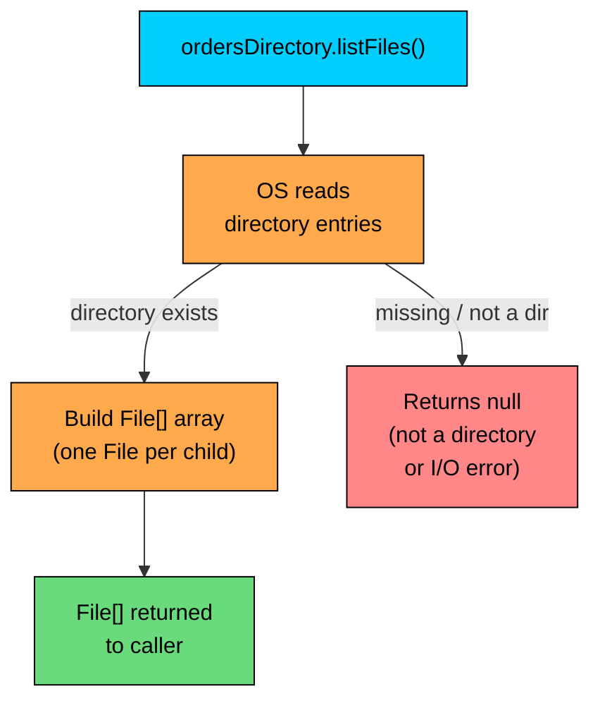
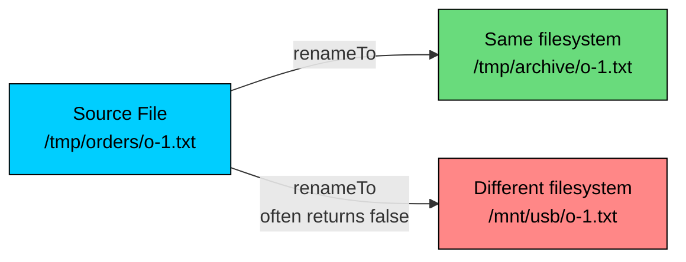

import React from 'react';
import CodeBlock from '../../../../components/ui/CodeBlock';
import Callout from '../../../../components/ui/Callout';

<div className="article-header">
  <div className="breadcrumb">
    <a href="/">Curated Notes</a>
    <span className="breadcrumb-separator">›</span>
    <span className="breadcrumb-current">File Class</span>
  </div>
  <h1>File Class</h1>
  <p style={{ color: 'var(--text-muted)', fontSize: '1.1rem', marginBottom: '16px', lineHeight: '1.6' }}>
    Master the essentials of File Class in this curated guide.
  </p>
  <div className="meta-info">
    <span className="meta-item">
      <svg width="14" height="14" viewBox="0 0 24 24" fill="none" stroke="currentColor" strokeWidth="2"><circle cx="12" cy="12" r="10"/><polyline points="12 6 12 12 16 14"/></svg>
      10 min read
    </span>
    <span className="difficulty-badge difficulty-badge--intermediate">Intermediate</span>
  </div>
</div>

<section className="content-section">

The `java.io.File` class represents a pathname on disk, not the data inside that path. It's used to ask questions about a file or directory (does it exist, how big is it, when was it last changed), to create or delete entries, and to list the contents of a folder. This lesson covers what a `File` object actually models, how to build one, the metadata methods it exposes, directory operations, the `renameTo` quirks, platform path separators, and where the newer `java.nio.file.Path` API fits in.

---

## A `File` Is a Pathname, Not a File

A common mistake with `java.io.File` is treating it like a handle to file contents. It isn't. A `File` object is an in-memory string wrapped in a class, plus a few helper methods that interpret that string as a filesystem path. Creating a `File` doesn't open anything, doesn't read anything, and doesn't even check that the path exists.


```java
import java.io.File;

public class WhatIsAFile {
    public static void main(String[] args) {
        File ordersLog = new File("orders.log");

        System.out.println("Path: " + ordersLog.getPath());
        System.out.println("Exists on disk? " + ordersLog.exists());
    }
}
```


The constructor accepted the string `"orders.log"` without complaint. No file was opened, no disk was touched. Only a method like `exists()` causes `File` to actually ask the operating system anything.

The diagram below shows how a `File` object relates to the real file on disk. The `File` is just a label that may or may not point at a real thing.


```mermaid
flowchart LR
    Code["Java code<br/>new File(...)"]:::cyan
    Obj["File object<br/>pathname string"]:::orange
    Real["Real file on disk<br/>(may or may not exist)"]:::green
    Missing["Nothing<br/>(path is bogus)"]:::red

    Code --> Obj
    Obj -->|exists()| Real
    Obj -->|exists()| Missing

    classDef cyan fill:#00ceff,stroke:#000,color:#000
    classDef orange fill:#ffa94d,stroke:#000,color:#000
    classDef green fill:#69db7c,stroke:#000,color:#000
    classDef red fill:#ff8787,stroke:#000,color:#000
```


The orange box (the `File` object) lives in memory the moment `new File(...)` is called. The green box (a real file) is only there if something else, the application or another process, has created it. The red box represents a perfectly valid `File` object that points to nothing.

A second consequence of this design: a single real file can be referenced by many `File` objects, and a single `File` object can outlive the file it once pointed at. The object and the file are independent.

---

## Constructing `File` Objects

`File` has four constructors, and three of them come up regularly. The simplest takes a single pathname string.


```java
import java.io.File;

public class FileConstructors {
    public static void main(String[] args) {
        File relative = new File("orders.log");
        File absolute = new File("/tmp/orders.log");

        System.out.println("Relative path: " + relative.getPath());
        System.out.println("Absolute path: " + absolute.getPath());
    }
}
```


A relative path is resolved against the **current working directory** by any method that actually touches the disk. The working directory is wherever the JVM was launched from, which is usually the project root in an IDE or the shell's `pwd` on the command line. An absolute path starts from the filesystem root (`/` on macOS and Linux, a drive letter on Windows) and ignores the working directory.

The two-argument constructors build a path from a parent and a child piece, which is cleaner than concatenating strings by hand.


```java
import java.io.File;

public class ParentChildFile {
    public static void main(String[] args) {
        File ordersDirectory = new File("/tmp/store");

        // Parent as a File, child as a String
        File ordersLog = new File(ordersDirectory, "orders.log");

        // Parent as a String, child as a String
        File inventoryCsv = new File("/tmp/store", "inventory.csv");

        System.out.println(ordersLog.getPath());
        System.out.println(inventoryCsv.getPath());
    }
}
```


The `File(File parent, String child)` and `File(String parent, String child)` constructors insert the platform's path separator automatically. This matters because hardcoding `"/"` or `"\\"` makes code wrong on the other platform. The separator topic gets its own section below.

There's also a `File(URI)` constructor for converting a `file://` URI back into a `File`. It's useful when a URI comes from some other API, though it shows up far less often than the string and parent-child forms.

Constructors do not normalize the path. `new File("./store/../store/orders.log")` keeps that exact string. The path becomes `/tmp/store/orders.log` only after `getCanonicalPath()`.

---

## File Metadata Queries

Once a `File` object exists, the next question is "what can be found out about this path?" The metadata methods are the answer. Each one is a single call to the operating system, so they only return real values when the path points at something that exists.


```java
import java.io.File;

public class InventoryMetadata {
    public static void main(String[] args) {
        File inventoryCsv = new File("inventory.csv");

        System.out.println("Exists? " + inventoryCsv.exists());
        System.out.println("Is file? " + inventoryCsv.isFile());
        System.out.println("Is directory? " + inventoryCsv.isDirectory());
        System.out.println("Size in bytes: " + inventoryCsv.length());
        System.out.println("Last modified (epoch ms): " + inventoryCsv.lastModified());
        System.out.println("Can read? " + inventoryCsv.canRead());
        System.out.println("Can write? " + inventoryCsv.canWrite());
        System.out.println("Can execute? " + inventoryCsv.canExecute());
    }
}
```


If `inventory.csv` doesn't exist, the output looks like this:

Every method returns a "nothing here" value when the path is missing. `length()` returns `0`, `lastModified()` returns `0`, and the boolean methods return `false`. There's no exception. This is convenient but also a trap: checking only `length()` can't distinguish an empty file from a missing one. Call `exists()` first.

The same code after a file has been created so the methods return useful values:


```java
import java.io.File;
import java.io.IOException;

public class InventoryMetadataExisting {
    public static void main(String[] args) throws IOException {
        File inventoryCsv = new File("inventory.csv");
        inventoryCsv.createNewFile();

        System.out.println("Exists? " + inventoryCsv.exists());
        System.out.println("Is file? " + inventoryCsv.isFile());
        System.out.println("Is directory? " + inventoryCsv.isDirectory());
        System.out.println("Size in bytes: " + inventoryCsv.length());
        System.out.println("Last modified (epoch ms): " + inventoryCsv.lastModified());
        System.out.println("Can read? " + inventoryCsv.canRead());
        System.out.println("Can write? " + inventoryCsv.canWrite());
        System.out.println("Can execute? " + inventoryCsv.canExecute());

        inventoryCsv.delete();
    }
}
```


The size is `0` because the file was just created and is empty. `lastModified()` returns the file's modification time as milliseconds since the Unix epoch (January 1, 1970, UTC), which can be fed into `java.util.Date` or `java.time.Instant.ofEpochMilli(...)` to get a human-readable timestamp. The three permission methods reflect what the current process is allowed to do, not the raw permission bits on disk; an admin and a regular user can get different answers for the same file.

Each metadata call is a separate system call. When several pieces of information about the same file are needed in a tight loop, the costs add up. The modern NIO API exposes `Files.readAttributes(path, BasicFileAttributes.class)` which fetches all of it in one call.

#### Name and Path Methods

The other half of the metadata API is the path-parsing methods. They don't touch the disk at all, they just slice up the string passed to the constructor.


```java
import java.io.File;
import java.io.IOException;

public class PathMethods {
    public static void main(String[] args) throws IOException {
        File ordersLog = new File("/tmp/store/logs/orders.log");

        System.out.println("getName:           " + ordersLog.getName());
        System.out.println("getPath:           " + ordersLog.getPath());
        System.out.println("getAbsolutePath:   " + ordersLog.getAbsolutePath());
        System.out.println("getCanonicalPath:  " + ordersLog.getCanonicalPath());
        System.out.println("getParent:         " + ordersLog.getParent());
    }
}
```


The table below summarizes what each method actually does.


| Method                | Returns                                       | Touches disk? |
| --------------------- | --------------------------------------------- | ------------- |
| `getName()`           | The last path segment (file or folder name)   | No            |
| `getPath()`           | The original string passed in                 | No            |
| `getAbsolutePath()`   | An absolute path; resolves relative against the working directory | No |
| `getCanonicalPath()`  | An absolute, normalized path with symlinks resolved | Yes (can throw `IOException`) |
| `getParent()`         | The parent path as a `String`, or `null` if none | No         |


The difference between `getAbsolutePath()` and `getCanonicalPath()` is easy to confuse. `getAbsolutePath()` makes the path absolute by prepending the working directory, but it doesn't resolve `..`, `.`, or symlinks. `getCanonicalPath()` does all of that. On macOS, `/tmp` is itself a symlink to `/private/tmp`, which is why the canonical form has a `/private` prefix.


```java
import java.io.File;
import java.io.IOException;

public class AbsoluteVsCanonical {
    public static void main(String[] args) throws IOException {
        File messyPath = new File("./store/../store/orders.log");

        System.out.println("Absolute:  " + messyPath.getAbsolutePath());
        System.out.println("Canonical: " + messyPath.getCanonicalPath());
    }
}
```


`getAbsolutePath()` keeps the `./` and `../` segments verbatim while `getCanonicalPath()` collapses them. Use canonical paths when comparing two `File` references to see if they point at the same thing, because two different strings can describe the same actual location.

---

## Creating and Deleting Files

`File` can create an empty file and delete an existing entry. Both are simple, but both have edge cases.


```java
import java.io.File;
import java.io.IOException;

public class CreateDeleteFile {
    public static void main(String[] args) throws IOException {
        File wishlistTxt = new File("wishlist.txt");

        boolean created = wishlistTxt.createNewFile();
        System.out.println("Created? " + created);
        System.out.println("Exists now? " + wishlistTxt.exists());

        boolean createdAgain = wishlistTxt.createNewFile();
        System.out.println("Created again? " + createdAgain);

        boolean deleted = wishlistTxt.delete();
        System.out.println("Deleted? " + deleted);
        System.out.println("Exists after delete? " + wishlistTxt.exists());
    }
}
```


`createNewFile()` returns `true` if it created the file and `false` if a file with that name already exists. It never overwrites. It throws `IOException` if the parent directory doesn't exist or the process lacks permission, so the call must be declared or caught. It also creates an empty file (zero bytes); it doesn't write any content.

`delete()` returns `true` if the entry was removed and `false` otherwise. It does not throw on failure, which is one of the API's rougher edges. When `delete()` returns `false`, it's usually unclear whether the file didn't exist, permission was lacking, or another process had it open. The modern `Files.delete(path)` in NIO does throw with a specific exception type, which is one reason new code prefers it.

`delete()` on a directory only works if the directory is empty. There's no built-in "delete this folder and everything inside" on `File`; the directory has to be walked manually, which is a few lines of recursion.

`deleteOnExit()` registers the file for deletion when the JVM exits normally. It's handy for temporary files in tests, but it's a one-way request: there's no way to unregister it, and it doesn't run if the JVM is killed.


```java
import java.io.File;
import java.io.IOException;

public class TempFileCleanup {
    public static void main(String[] args) throws IOException {
        File temp = new File("temp-cart.csv");
        temp.createNewFile();
        temp.deleteOnExit();

        System.out.println("Temp file exists: " + temp.exists());
        // When this main method returns and the JVM shuts down,
        // temp-cart.csv is deleted.
    }
}
```


After the program ends, the file is gone. The OS may briefly see it during the run, which is why this fits ephemeral scratch files but isn't appropriate for security-sensitive cleanup.

---

## Directory Operations

`File` doesn't distinguish between a file and a directory at the type level. Both are represented as `File`, and `isDirectory()` tells them apart. The directory-specific operations are creating folders and listing their contents.


```java
import java.io.File;

public class DirectoryBasics {
    public static void main(String[] args) {
        File ordersDirectory = new File("daily-sales");

        boolean made = ordersDirectory.mkdir();
        System.out.println("Made daily-sales? " + made);
        System.out.println("Is directory? " + ordersDirectory.isDirectory());

        ordersDirectory.delete();
    }
}
```


`mkdir()` makes a single directory. If the parent doesn't exist, it fails and returns `false`. `mkdirs()` (note the trailing `s`) creates the full chain of missing parents, which is the typical need.


```java
import java.io.File;

public class MakeNestedDirectories {
    public static void main(String[] args) {
        File deeplyNested = new File("customers/cust-42/orders/2026-05");

        boolean madeAll = deeplyNested.mkdirs();
        System.out.println("Made full path? " + madeAll);
        System.out.println("Exists now? " + deeplyNested.exists());
    }
}
```


A subtle gotcha: `mkdir()` and `mkdirs()` both return `false` if the directory already exists. That's not a real error in most cases. The defensive pattern is `if (!dir.exists() && !dir.mkdirs()) { throw ... }`, which only complains when creation was actually needed and actually failed.

#### Listing Directory Contents

`list()` returns a `String[]` of names (just the last segment of each entry, no path). `listFiles()` returns a `File[]` of full child paths, which is usually more useful because methods can be called on each `File`.


```java
import java.io.File;
import java.io.IOException;

public class ListDirectoryContents {
    public static void main(String[] args) throws IOException {
        File ordersDirectory = new File("daily-sales");
        ordersDirectory.mkdirs();
        new File(ordersDirectory, "2026-05-10.log").createNewFile();
        new File(ordersDirectory, "2026-05-11.log").createNewFile();
        new File(ordersDirectory, "summary.txt").createNewFile();

        System.out.println("--- list() ---");
        String[] names = ordersDirectory.list();
        for (String name : names) {
            System.out.println(name);
        }

        System.out.println("--- listFiles() ---");
        File[] children = ordersDirectory.listFiles();
        for (File child : children) {
            System.out.println(child.getPath() + " (" + child.length() + " bytes)");
        }
    }
}
```


The order of the returned array is **not** specified. Don't write code that depends on alphabetical or modification-time ordering. For a sorted list, sort the array with `Arrays.sort(...)`.

Both methods return `null`, not an empty array, when the path isn't a directory or when an I/O error occurs. That `null` is a frequent source of `NullPointerException`s. Always null-check before iterating.

`listFiles()` reads the entire directory into memory before returning. For a directory with a few hundred entries it's fine. For one with hundreds of thousands of order logs, it can be slow and memory-hungry. NIO's `Files.newDirectoryStream(path)` iterates lazily and is a better choice at that scale.

The diagram below traces what happens when `listFiles()` is called on a directory with three entries.





The orange middle steps are what cost real time and memory: the OS scans the directory, and Java wraps each entry in a `File` object. The red node on the right is the silent failure mode that requires defensive code.

#### Filtering the Listing

`listFiles` has two filtering overloads: one takes a `FileFilter` (which receives a full `File` and decides keep or drop), and the other takes a `FilenameFilter` (which receives the parent directory and the child's name as a string). Both are functional interfaces, so a lambda works.


```java
import java.io.File;
import java.io.IOException;

public class FilterLogs {
    public static void main(String[] args) throws IOException {
        File ordersDirectory = new File("daily-sales");
        ordersDirectory.mkdirs();
        new File(ordersDirectory, "2026-05-10.log").createNewFile();
        new File(ordersDirectory, "2026-05-11.log").createNewFile();
        new File(ordersDirectory, "summary.txt").createNewFile();

        File[] logsByName = ordersDirectory.listFiles(
                (dir, name) -> name.endsWith(".log"));
        System.out.println("FilenameFilter (.log only):");
        for (File f : logsByName) {
            System.out.println("  " + f.getName());
        }

        File[] biggerThanZero = ordersDirectory.listFiles(
                f -> f.length() > 0);
        System.out.println("FileFilter (size > 0): " + biggerThanZero.length);
    }
}
```


Use `FilenameFilter` when the decision is purely about the file's name. Use `FileFilter` when a property of the file itself (size, last-modified, is-directory) is needed. The `FileFilter` form is slightly more expensive because it calls metadata methods on each child, but it's also more powerful.

---

## Renaming and Moving

`renameTo(File dest)` changes the name or location of an entry. It returns a boolean, like `delete()`, and shares the same "no detail when it fails" problem.


```java
import java.io.File;
import java.io.IOException;

public class RenameOrder {
    public static void main(String[] args) throws IOException {
        File pending = new File("order-1234.txt");
        pending.createNewFile();

        File completed = new File("order-1234-shipped.txt");
        boolean renamed = pending.renameTo(completed);

        System.out.println("Renamed? " + renamed);
        System.out.println("Old name exists? " + pending.exists());
        System.out.println("New name exists? " + completed.exists());

        completed.delete();
    }
}
```


When `renameTo` works, the old path is gone and the new path now refers to the same data. The `File` object `pending` doesn't update its internal pathname, it still says `order-1234.txt`, but that pathname now points at nothing.

Trouble starts when the source and destination are on different filesystems (different drives, different mount points). On many platforms `renameTo` is implemented as the OS `rename` call, which only works inside one filesystem. Cross-filesystem moves often return `false` without any error message.





The green path on the left works reliably. The red path on the right fails in production when `/mnt/usb` (or any network mount) is involved.

Other reasons `renameTo` returns `false`: the destination already exists (some platforms refuse to overwrite), the source is locked by another process (common on Windows), or the parent of the destination doesn't exist.

For a reliable rename or move, `java.nio.file.Files.move(source, target, options...)` is the modern replacement. It throws specific exceptions on failure and supports flags like `REPLACE_EXISTING` and `ATOMIC_MOVE`.

---

## Platform Path Separators

Path separators differ across operating systems. macOS and Linux use `/`. Windows uses `\` (which is also Java's string escape character, so it appears as `\\` in source code). Hardcoding either one breaks the code on the other platform.

`File` exposes two constants that pick the right value at runtime.


| Constant            | Type     | Meaning                                          | Typical Value      |
| ------------------- | -------- | ------------------------------------------------ | ------------------ |
| `File.separator`    | `String` | Separator between directory levels in a path     | `/` or `\`         |
| `File.separatorChar`| `char`   | Same as above, as a `char`                       | `'/'` or `'\\'`    |
| `File.pathSeparator`| `String` | Separator between paths in a list (like `PATH`)  | `:` or `;`         |
| `File.pathSeparatorChar`| `char`| Same as above, as a `char`                       | `':'` or `';'`     |


```java
import java.io.File;

public class PathSeparators {
    public static void main(String[] args) {
        System.out.println("File.separator:     '" + File.separator + "'");
        System.out.println("File.pathSeparator: '" + File.pathSeparator + "'");

        String built = "customers" + File.separator + "cust-42" + File.separator + "orders.log";
        System.out.println("Built path: " + built);
    }
}
```


The pair is easy to confuse. `File.separator` divides parts of one path. `File.pathSeparator` divides multiple paths in a list, like the `PATH` environment variable that lists where the shell looks for commands.

Hand-concatenating with `File.separator` is rarely necessary. The two-argument `File` constructor inserts the separator automatically, and on every modern operating system, including Windows, Java accepts forward slashes in path strings. Use `File.separator` mainly when parsing or formatting paths for display, or when interfacing with an external tool that demands native separators.

---

## When to Use `File` vs the Modern `Path`

`java.io.File` has been around since Java 1.0. Java 7 added `java.nio.file.Path`, `Paths`, and `Files` as a more capable replacement. The newer API has better error reporting (specific exceptions instead of silent `false` returns), supports symbolic links explicitly, can stream directory contents lazily, and provides atomic operations. New code should generally prefer it.

The short summary of when each fits:


| Situation                                                  | Recommended API     |
| ---------------------------------------------------------- | ------------------- |
| Brand-new code, no legacy constraint                       | `java.nio.file.Path` |
| Working with an older library that expects `File`          | `java.io.File`       |
| Need precise error info when an op fails                   | `java.nio.file.Files` |
| Iterating a directory that may have huge numbers of entries| `Files.newDirectoryStream` |
| Watching a directory for changes                           | `WatchService` (NIO) |
| Quick scripts where the API surface doesn't matter         | Either is fine       |


The two APIs interoperate: `file.toPath()` converts a `File` to a `Path`, and `path.toFile()` goes the other way. Most JDK APIs accept both, so mixing them is fine.

The reason this lesson exists at all is that `File` is still everywhere: third-party libraries, configuration APIs, legacy code, and many JDK methods (like `Scanner(File)`, `FileInputStream(File)`, and `PrintWriter(File)`) still accept it. Knowing how it works keeps code productive when `File` shows up.

</section>
