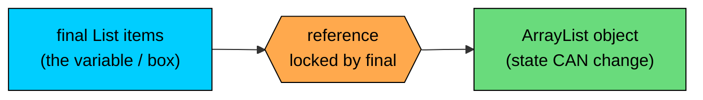
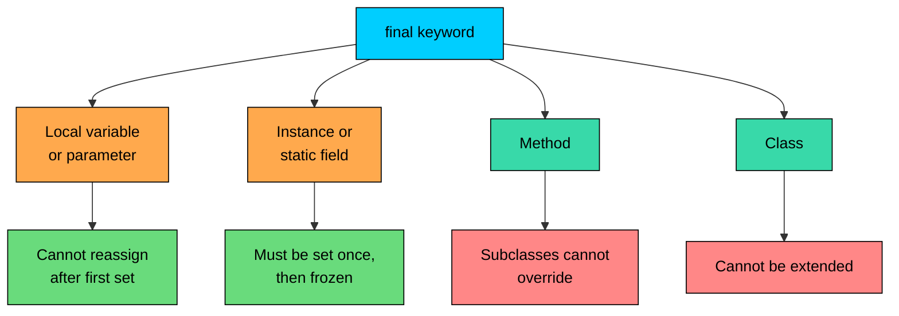

import React from 'react';
import CodeBlock from '../../../../components/ui/CodeBlock';
import Callout from '../../../../components/ui/Callout';

<div className="article-header">
  <div className="breadcrumb">
    <a href="/">Curated Notes</a>
    <span className="breadcrumb-separator">›</span>
    <span className="breadcrumb-current">final Keyword</span>
  </div>
  <h1>final Keyword</h1>
  <p style={{ color: 'var(--text-muted)', fontSize: '1.1rem', marginBottom: '16px', lineHeight: '1.6' }}>
    Master the essentials of final Keyword in this curated guide.
  </p>
  <div className="meta-info">
    <span className="meta-item">
      <svg width="14" height="14" viewBox="0 0 24 24" fill="none" stroke="currentColor" strokeWidth="2"><circle cx="12" cy="12" r="10"/><polyline points="12 6 12 12 16 14"/></svg>
      10 min read
    </span>
    <span className="difficulty-badge difficulty-badge--intermediate">Intermediate</span>
  </div>
</div>

<section className="content-section">

The `final` keyword in Java is a small word with a big job: it tells the compiler that something cannot change after it's been set. The "something" can be a local variable, a method parameter, an instance field, a method, or even an entire class, and the rules shift a little for each one. This lesson walks through every flavor of `final` in Java, the exact rule it enforces, and the patterns where each one fits.

---

## The One-Line Rule

`final` means **"can only be assigned once"** or **"cannot be changed"**, with the exact meaning depending on what it precedes.


| Applied to | What gets locked |
| --- | --- |
| Local variable | Cannot be reassigned after its first value is set |
| Method parameter | Cannot be reassigned inside the method body |
| Instance field | Must be assigned exactly once, then cannot be reassigned |
| Static field | Must be assigned exactly once, then cannot be reassigned |
| Reference variable | The reference cannot point to a different object (the object itself can still mutate) |
| Method | Cannot be overridden in a subclass |
| Class | Cannot be extended by any subclass |


Every other rule about `final` in this lesson is a specialization of one of these rows. Keep this table in mind as we go. The interesting questions are usually "what counts as 'assigned'?" and "what does 'cannot change' actually protect?", not "what does the word `final` mean?"

---

## `final` Local Variables

A local variable declared `final` can be assigned exactly once. The assignment can happen at the declaration or later in the same scope, but reassignment is a compile error.


```java
public class FinalLocal {
    public static void main(String[] args) {
        final double taxRate = 0.07;
        double price = 100.0;
        double total = price + price * taxRate;
        System.out.println("Total: $" + total);
    }
}
```


Here `taxRate` is set at the declaration and never touched again. The `final` makes that promise explicit. A reader can scan the method and trust that `taxRate` stays `0.07` from declaration to return.

Assignment at the declaration isn't required. A `final` local can be left without an initial value, as long as the compiler can prove every path assigns it exactly once before it's read.


```java
public class FinalLocalDeferred {
    public static void main(String[] args) {
        final double shippingFee;
        int itemCount = 4;

        if (itemCount >= 3) {
            shippingFee = 0.0;
        } else {
            shippingFee = 5.99;
        }

        System.out.println("Shipping: $" + shippingFee);
    }
}
```


Both branches of the `if` assign `shippingFee`, so by the time the `println` runs, the compiler is sure it's been set exactly once. That's enough.

A second assignment is what the compiler refuses to accept.

**What's wrong with this code?**


```java
public class FinalReassignBad {
    public static void main(String[] args) {
        final int cartItemCount = 3;
        cartItemCount = 5; // compile error
        System.out.println(cartItemCount);
    }
}
```


The compiler reports:


```shell
error: cannot assign a value to final variable cartItemCount
        cartItemCount = 5;
        ^
```


**Fix:** Drop the `final` if the value needs to change, or pick a different variable for the new value.


```java
public class FinalReassignFixed {
    public static void main(String[] args) {
        final int initialItemCount = 3;
        int currentItemCount = initialItemCount;
        currentItemCount = 5;
        System.out.println("Started with " + initialItemCount + ", now " + currentItemCount);
    }
}
```


The original constant stays `final`. A separate, non-`final` variable tracks the changing value. Usually one of these two is the right intent.

---

## `final` Method Parameters

A method parameter is a local variable that happens to receive its initial value from the caller. Marking it `final` prevents the method body from reassigning that variable.


```java
public class FinalParam {
    public static double applyTax(final double subtotal, final double taxRate) {
        // subtotal = 0; // would be a compile error
        return subtotal + subtotal * taxRate;
    }

    public static void main(String[] args) {
        System.out.println("Total: $" + applyTax(50.0, 0.07));
    }
}
```


The `final` here protects against a specific bug: code inside the method "reusing" a parameter to hold a different value, then reading it later as if it still held the caller's input. With `final`, that reuse fails at compile time, so the parameter always means what the parameter name says.

`final` on a parameter is purely about the method body. It doesn't change anything for the caller. A caller passing `subtotal = 50.0` doesn't see any difference.

In practice, Java programmers don't sprinkle `final` on every parameter. Most teams reserve it for cases where it actively helps readability or where another language feature requires it (like accessing the parameter from an anonymous class or lambda). The compiler is happy either way.

---

## `final` Instance Fields

A `final` instance field must be assigned exactly once. "Once" means exactly once on any path from object creation to use. The assignment can happen in three places:

1. At the field declaration.
2. Inside an instance initializer block.
3. Inside every constructor of the class.

The compiler checks all three locations together. The rule it enforces is: by the time a constructor finishes, every `final` instance field must have been assigned exactly once.


```java
public class Product {
    private final String productId;
    private final String name;
    private final double price;

    public Product(String productId, String name, double price) {
        this.productId = productId;
        this.name = name;
        this.price = price;
    }

    public String getProductId() { return productId; }
    public String getName() { return name; }
    public double getPrice() { return price; }

    public static void main(String[] args) {
        Product mouse = new Product("P-1001", "Wireless Mouse", 29.99);
        System.out.println(mouse.getName() + " ($" + mouse.getPrice() + ")");
    }
}
```


All three fields are assigned in the constructor. After the constructor returns, none of them can ever be reassigned. A `Product` built with `("P-1001", "Wireless Mouse", 29.99)` holds those exact values for its entire life.

The fields that don't get an initial value at their declaration line are called **blank finals**. `productId`, `name`, and `price` above are all blank finals, because their declaration line gives only the type, not a value. Blank finals are useful when the value depends on the constructor arguments, which is most of the time for real data.

A field that has an initial value at the declaration is also valid, just less flexible.


```java
public class OrderConstants {
    private final int maxItemsPerOrder = 50;
    private final String currency = "USD";

    public int getMaxItemsPerOrder() { return maxItemsPerOrder; }
    public String getCurrency() { return currency; }

    public static void main(String[] args) {
        OrderConstants config = new OrderConstants();
        System.out.println("Max items: " + config.getMaxItemsPerOrder());
        System.out.println("Currency: " + config.getCurrency());
    }
}
```


These fields could also have been declared `static final` (covered below). The point: the assignment at the declaration counts as the one allowed assignment, and the constructor must not assign them again.

**What's wrong with this code?**


```java
public class BadProduct {
    private final String name;
    private final double price;

    public BadProduct(String name) {
        this.name = name;
        // price never assigned
    }
}
```


The compiler reports:


```shell
error: variable price might not have been initialized
    public BadProduct(String name) {
    ^
```


**Fix:** Every constructor must assign every blank final field. Either give `price` a value at the declaration, or assign it in this constructor.


```java
public class FixedProduct {
    private final String name;
    private final double price;

    public FixedProduct(String name) {
        this.name = name;
        this.price = 0.0;
    }

    public FixedProduct(String name, double price) {
        this.name = name;
        this.price = price;
    }
}
```


With multiple constructors, the rule applies to each one independently. Each path that builds an object must assign every blank final exactly once.

---

## `final` on a Reference Variable

This is the part of `final` most easily misunderstood. When a `final` variable holds a reference to an object, the lock applies to the **reference** (the arrow), not to the **object** (the thing the arrow points to). The reference can't be made to point somewhere else. The object itself is still free to change its internal state, if its class allows mutation.





The `final` modifier locks the arrow from `items` to the `ArrayList`. The contents of the `ArrayList` are a completely separate question.


```java
import java.util.ArrayList;
import java.util.List;

public class FinalReference {
    public static void main(String[] args) {
        final List<String> cart = new ArrayList<>();

        cart.add("Wireless Mouse");
        cart.add("USB Cable");
        cart.add("Headphones");

        System.out.println("Cart size: " + cart.size());
        System.out.println("Cart: " + cart);

        // cart = new ArrayList<>(); // would be a compile error
    }
}
```


`cart` is `final`, but calling `cart.add(...)` works fine. The `add` calls mutate the `ArrayList` that `cart` points to. They don't change which list `cart` points to. The only thing `final` forbids is `cart = somethingElse`.

That distinction matters because `final` is sometimes expected to "freeze" the object. It doesn't. To make the object's state unchangeable too, use either an unmodifiable wrapper (like `List.copyOf(...)`) or an immutable class. The rule to carry forward:


&gt; **INFO**
&gt;
&gt; **`final` on a reference locks the variable, not the object.**


**What's wrong with this code?**


```java
import java.util.ArrayList;
import java.util.List;

public class FrozenCart {
    public static void main(String[] args) {
        final List<String> cart = new ArrayList<>();
        cart.add("Wireless Mouse");

        cart = new ArrayList<>(); // expecting this to be allowed
        cart.add("USB Cable");
    }
}
```


The error is on the second-to-last line:


```shell
error: cannot assign a value to final variable cart
        cart = new ArrayList<>();
        ^
```


**Fix:** For a fresh empty list, clear the existing one instead of reassigning. The reference stays the same, but the contents become empty.


```java
import java.util.ArrayList;
import java.util.List;

public class FrozenCartFixed {
    public static void main(String[] args) {
        final List<String> cart = new ArrayList<>();
        cart.add("Wireless Mouse");

        cart.clear();
        cart.add("USB Cable");

        System.out.println("Cart: " + cart);
    }
}
```


If a different list is actually needed (perhaps because the old one is shared with something else), then `final` was the wrong choice and should be removed.

---

## `final` Methods

A `final` method cannot be overridden by any subclass. The keyword sits on the method declaration, like this:


```java
public class PaymentProcessor {
    public final double calculateTotal(double subtotal, double taxRate) {
        return subtotal + subtotal * taxRate;
    }
}
```


A subclass can still inherit and call `calculateTotal`, but it can't replace it with its own version. Trying to override it produces a compile error.

The intent of `final` on a method is to say: "this behavior is part of the class's contract, and subclasses shouldn't change it." A common case is methods that perform security or correctness checks. If a subclass could override `validateOrder` to skip a step, the protection would be optional. `final` removes that option.


```java
public class OrderValidator {
    public final boolean isValidOrder(int itemCount, double total) {
        return itemCount > 0 && total > 0;
    }

    public static void main(String[] args) {
        OrderValidator validator = new OrderValidator();
        System.out.println("Valid: " + validator.isValidOrder(3, 89.97));
        System.out.println("Empty cart valid: " + validator.isValidOrder(0, 0.0));
    }
}
```


Without a subclass, the `final` doesn't do anything visible. The protection only matters once someone tries to extend `OrderValidator`.

---

## `final` Classes

A `final` class cannot be extended. No subclass can inherit from it. The keyword sits between the access modifier and `class`.


```java
public final class ProductId {
    private final String value;

    public ProductId(String value) {
        this.value = value;
    }

    public String getValue() {
        return value;
    }

    public static void main(String[] args) {
        ProductId id = new ProductId("P-1001");
        System.out.println("ID: " + id.getValue());
    }
}
```


Writing `class CustomProductId extends ProductId { ... }` fails to compile with `cannot inherit from final ProductId`.

`final` on a class is a stronger statement than `final` on individual methods. Marking each method `final` only prevents overriding. Marking the class `final` also prevents anyone from adding new fields or methods through subclassing, and it signals to readers: "this class is the complete picture; don't try to extend it."

A few core JDK classes are `final` for exactly this reason:


| Class | Why it's `final` |
| --- | --- |
| `String` | Immutability and string-pool sharing depend on subclasses not being able to alter behavior |
| `Integer`, `Long`, `Double`, etc. | Same reasoning, plus they back primitive autoboxing |
| `LocalDate`, `LocalTime`, `LocalDateTime` | Modern date/time API relies on immutability |
| `UUID` | Identity values that must not be subclassed |


The reason `class MyString extends String` is not legal is this: `String` is `final`.

---

## `static final` Constants

A common use of `final` in production Java is to define constants. A constant is a value that's the same for every object of the class and never changes for the life of the program. The idiomatic spelling is `public static final`.


```java
public class TaxConfig {
    public static final double TAX_RATE = 0.07;
    public static final double FREE_SHIPPING_THRESHOLD = 50.0;
    public static final int MAX_ITEMS_PER_ORDER = 50;

    public static void main(String[] args) {
        double subtotal = 80.0;
        double tax = subtotal * TAX_RATE;
        boolean freeShipping = subtotal >= FREE_SHIPPING_THRESHOLD;

        System.out.println("Subtotal: $" + subtotal);
        System.out.println("Tax: $" + tax);
        System.out.println("Free shipping: " + freeShipping);
    }
}
```


Three things are happening on those declarations:

- `public` makes the constant accessible from any class.
- `static` makes it belong to the class itself, so callers write `TaxConfig.TAX_RATE`, not `new TaxConfig().TAX_RATE`.
- `final` makes the value unchangeable.

The naming convention for constants is `UPPER_SNAKE_CASE`. Words are uppercase, separated by underscores. This convention is universal across the Java ecosystem, and it makes constants visually distinct from regular variables. `MAX_ITEMS_PER_ORDER` in code is recognizable as a constant without further inspection.

#### Constants Defined in One Place, Used Everywhere

Constants earn their place when the same value would otherwise be repeated across many files. Imagine that `0.07` for tax rate is hardcoded in ten different methods. When the tax rate changes (and it will), every `0.07` has to be hunted through the codebase with a risk of missing one. With `TaxConfig.TAX_RATE`, one line changes.


```java
public class CheckoutService {
    public static double calculateTax(double subtotal) {
        return subtotal * TaxConfig.TAX_RATE;
    }

    public static double calculateTotalWithTax(double subtotal) {
        return subtotal + calculateTax(subtotal);
    }

    public static void main(String[] args) {
        double subtotal = 100.0;
        System.out.println("Tax: $" + calculateTax(subtotal));
        System.out.println("Total: $" + calculateTotalWithTax(subtotal));
    }
}
```


`CheckoutService` doesn't store its own copy of the tax rate. It reads `TaxConfig.TAX_RATE` directly. If tax rules change, only `TaxConfig` needs an update.

#### Compile-Time Constants

A `static final` field whose value is a primitive or `String` literal and is set at declaration is called a **compile-time constant**. The Java compiler inlines compile-time constants at the call site. That means after compilation, the bytecode of `CheckoutService` no longer references `TaxConfig.TAX_RATE` symbolically; it has `0.07` literally baked in.


```java
public class Constants {
    public static final double TAX_RATE = 0.07;          // compile-time constant
    public static final int MAX_ITEMS = 50;              // compile-time constant
    public static final String CURRENCY = "USD";         // compile-time constant
    public static final double DYNAMIC = Math.random();  // NOT a compile-time constant
}
```


`TAX_RATE`, `MAX_ITEMS`, and `CURRENCY` are compile-time constants because their values are literal expressions known at compile time. `DYNAMIC` is `static final` (assigned exactly once at class load), but its value comes from a method call, so it's only known at runtime. Compile-time constants enable a couple of small things, like being used in `case` labels of a `switch` statement. Runtime-final values cannot be used there.

Inlining is a performance win at call sites (no field lookup), but it has a sharp edge. If `TaxConfig` is in a separate library and only `CheckoutService` is recompiled after changing `TAX_RATE` from `0.07` to `0.08`, the old value is still inlined in any caller that wasn't recompiled. The fix is to recompile everything that depends on the constant. For values that change often, use a method like `getTaxRate()` instead.

---

## Where Different Forms of `final` Sit

A single diagram that places each form of `final` next to what it locks:





The shape of the rule is the same across the table: `final` removes one specific kind of change. What changes is what kind of thing is being changed.

---

## A Word About "Effectively Final"

Java often treats a variable as if it were `final` even without the keyword, as long as it's never reassigned after its first value. Such a variable is called **effectively final**. The compiler computes this property automatically.


```java
public class EffectivelyFinal {
    public static void main(String[] args) {
        int loyaltyPoints = 150;
        String customerName = "Alice";

        // Both are never reassigned below, so both are effectively final.

        System.out.println(customerName + " has " + loyaltyPoints + " points.");
    }
}
```


"Effectively final" isn't written anywhere; the property only matters when another part of the language requires `final` or effectively final variables. Two features that ask for it:

- **Anonymous classes** can only refer to local variables from the enclosing method if those variables are `final` or effectively final.
- **Lambda expressions** have the same restriction.

The term comes up in an error message that eventually appears: "local variables referenced from a lambda expression must be final or effectively final". The cure is usually to stop reassigning the variable, or to copy its value into a fresh `final` one right before the lambda.

---

## Putting `final` to Work: A Small E-Commerce Class

A slightly larger example uses several of the `final` forms together. It models a `LineItem` on an order: the product ID, name, unit price, and quantity, all set when the line is created and untouched after.


```java
public class LineItem {
    public static final double TAX_RATE = 0.07;

    private final String productId;
    private final String name;
    private final double unitPrice;
    private final int quantity;

    public LineItem(String productId, String name, double unitPrice, int quantity) {
        this.productId = productId;
        this.name = name;
        this.unitPrice = unitPrice;
        this.quantity = quantity;
    }

    public double getSubtotal() {
        return unitPrice * quantity;
    }

    public double getTax() {
        return getSubtotal() * TAX_RATE;
    }

    public double getTotal() {
        return getSubtotal() + getTax();
    }

    @Override
    public String toString() {
        return name + " x" + quantity + " @ $" + unitPrice
                + " (subtotal $" + getSubtotal() + ", total $" + getTotal() + ")";
    }

    public static void main(String[] args) {
        LineItem mouse = new LineItem("P-1001", "Wireless Mouse", 29.99, 2);
        LineItem cable = new LineItem("P-1002", "USB Cable", 9.99, 1);

        System.out.println(mouse);
        System.out.println(cable);
    }
}
```


Three forms of `final` are at work:

- `TAX_RATE` is a `public static final` constant, shared by every `LineItem` and visible to outside code as `LineItem.TAX_RATE`.
- `productId`, `name`, `unitPrice`, and `quantity` are blank final instance fields, assigned exactly once in the constructor and frozen after.
- The class itself isn't `final` here, to allow subclassing later. To lock the design down completely, add `final class LineItem`.

This pattern (`final` fields set in the constructor, no setters) is a starting point for **immutable** classes. Immutable design has more rules (defensive copying for mutable fields, no methods that mutate state, sometimes a `final` class). For now, the takeaway is that `final` fields are one ingredient, not the whole recipe.

---

## Common Mistakes With `final`

A few patterns are easy to get wrong. Each one comes from misunderstanding exactly which thing `final` is locking.

#### Mistake 1: Expecting `final` to Deep-Freeze a List


```java
import java.util.ArrayList;
import java.util.List;

public class FrozenCartMyth {
    public static void main(String[] args) {
        final List<String> cart = new ArrayList<>();
        cart.add("Wireless Mouse");
        cart.add("USB Cable");
        cart.clear();
        System.out.println("Items left: " + cart.size());
    }
}
```


`cart` is `final`, yet `cart.clear()` empties the list without complaint. `final` doesn't make the list immutable. For an immutable list, use `List.copyOf(otherList)` or `List.of(...)`, both of which return a list that throws `UnsupportedOperationException` on any mutation attempt.

#### Mistake 2: Forgetting to Assign a Blank Final


```java
public class MissingAssign {
    private final String productId;

    public MissingAssign() {
        // productId never assigned
    }
}
```


The error is: `variable productId might not have been initialized`. **Fix:** assign `productId` in the constructor, in an initializer block, or at the declaration.

#### Mistake 3: Assigning a Final Field Twice


```java
public class DoubleAssign {
    private final String name;

    public DoubleAssign() {
        this.name = "Alice";
        this.name = "Bob"; // compile error
    }
}
```


`this.name` is already set when the second assignment runs, and a `final` field can only be assigned once. **Fix:** decide which value is correct and assign it once. For two valid options depending on context, use two constructors that each assign once.

#### Mistake 4: Reassigning a `final` Parameter


```java
public static double normalize(final double price) {
    if (price < 0) {
        price = 0; // compile error
    }
    return price;
}
```


The parameter is `final`, so reassignment inside the body is forbidden. **Fix:** introduce a new local variable for the normalized value.


```java
public static double normalize(final double price) {
    double adjusted = price;
    if (adjusted < 0) {
        adjusted = 0;
    }
    return adjusted;
}
```


The original parameter stays a faithful copy of what the caller passed in, and `adjusted` carries the post-normalization value. The two roles are split cleanly.

#### Mistake 5: Treating `static final` Numeric Literals As Free To Recompile

A `public static final int MAX = 50;` in one library, used by a separate library, gets inlined. Changing `MAX` to `100` and recompiling only the constant's library leaves the other library still seeing `50` until it's rebuilt. **Fix:** rebuild every dependent library, or, for values that change often, expose the value through a method like `getMax()` instead of a constant.

---

## Reading `final` in Real Code

A few rules of thumb that hold up well in practice:

- `final` on a local variable or parameter is documentation: "this variable doesn't change for the rest of this method."
- `final` on a field is a contract: "this object's value for this field is set at construction and never moves."
- `final` on a reference field (a `List`, `Map`, custom object) locks only the reference. The object can still mutate unless its class disallows it.
- `final` on a method or class is a hard limit: "no subclass gets to change this." That has consequences for testing (mocking a `final` method through a basic subclass is impossible) and for extension (callers must use composition, not inheritance).
- `UPPER_SNAKE_CASE` names are almost always `static final` constants. The casing alone signals the intent.

`final` is a small word that makes constraints visible. The compiler enforces them, and readers benefit from the labels.

</section>
