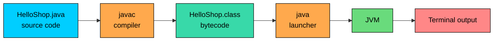

import React from 'react';
import CodeBlock from '../../../../components/ui/CodeBlock';
import Callout from '../../../../components/ui/Callout';

<div className="article-header">
  <div className="breadcrumb">
    <a href="/">Curated Notes</a>
    <span className="breadcrumb-separator">›</span>
    <span className="breadcrumb-current">First Java Program</span>
  </div>
  <h1>First Java Program</h1>
  <p style={{ color: 'var(--text-muted)', fontSize: '1.1rem', marginBottom: '16px', lineHeight: '1.6' }}>
    Master the essentials of First Java Program in this curated guide.
  </p>
  <div className="meta-info">
    <span className="meta-item">
      <svg width="14" height="14" viewBox="0 0 24 24" fill="none" stroke="currentColor" strokeWidth="2"><circle cx="12" cy="12" r="10"/><polyline points="12 6 12 12 16 14"/></svg>
      10 min read
    </span>
    <span className="difficulty-badge difficulty-badge--intermediate">Intermediate</span>
  </div>
</div>

<section className="content-section">

The fastest way to feel comfortable with Java is to write a tiny program, compile it, and run it end-to-end. This lesson walks through that exact loop using a small e-commerce program we'll keep returning to throughout the course. You'll learn what each line means, how to name the file, and what to do when the compiler complains.

---

## Writing the Source

Open a plain text editor or your IDE and create a file named `HelloShop.java`. Type the program below exactly as shown, including the capitalization:


```java
public class HelloShop {
    public static void main(String[] args) {
        System.out.println("Welcome to MyShop");
        System.out.println("Today's featured product: Wireless Headphones");
    }
}
```


That's the whole program. It defines a class called `HelloShop`, declares a `main` method inside it, and prints two lines. We'll grow `HelloShop` into a small storefront over the next several sections by adding products, prices, a cart, and orders. For now it just prints.

A few things before we break it down:

- Java is case-sensitive. `System` and `system` are different names, and only the first one is the class you want.
- Every statement ends with a semicolon.
- The braces `{` and `}` come in pairs. The outer pair belongs to the class, the inner pair belongs to the method.

---

## Anatomy of the Program

Let's read the program line by line. None of these pieces are decorative, so it helps to know what each one buys you.

#### `public class HelloShop`

This line declares a class named `HelloShop`. In Java, every piece of code lives inside a class, even the entry point of the program. The keyword `class` introduces a new type, and `HelloShop` is the name we picked.

The `public` keyword in front of `class` means this class is visible from anywhere. You can have at most one `public` class per source file, and the file name must match that class.

#### The Brace Structure

The two pairs of curly braces define two nested scopes:

- The outer braces `{ ... }` after `class HelloShop` enclose the body of the class. Everything that belongs to the class lives between them.
- The inner braces `{ ... }` after `main(...)` enclose the body of the method. The statements that run when the program starts live between them.

Indenting the inner block by four spaces (or one tab) is convention. Java treats whitespace flexibly, but consistent indentation matters for readability.

#### `public static void main(String[] args)`

Each keyword in this signature has a specific job. Here's how the parts of the line fit together:


Reading left to right:

- **`public`** is an access modifier. It says the method is visible from outside the class. The JVM needs to call `main` from outside, so it has to be public.
- **`static`** means the method belongs to the class itself, not to an individual object. The JVM calls `main` before any objects exist, so it cannot rely on having an instance to call the method on.
- **`void`** is the return type. `void` means the method returns nothing. When the program is done, control just leaves `main`, no value flows back.
- **`main`** is the method name. The JVM looks for a method with exactly this name when it starts your program. Rename it to `Main` or `start` and the JVM won't find an entry point.
- **`String[] args`** is the parameter list. It's an array of `String` values that holds the command-line arguments you pass when you run the program. If you run `java HelloShop coupon10 freeship`, then `args[0]` is `"coupon10"` and `args[1]` is `"freeship"`. This lesson doesn't use `args`, but the JVM still requires the parameter to be there.

Together, `public static void main(String[] args)` is the exact signature the JVM looks for as the entry point of a standalone Java application. Change any of those five pieces and the program won't start.

#### `System.out.println("Welcome to MyShop")`

This is the line that actually does something visible. Reading it from left to right:

- `System` is a class from the standard library.
- `out` is a field on `System` that represents the standard output stream, which is your terminal in most setups.
- `println` is a method on `out` that prints whatever you pass to it and then moves to a new line.

The string `"Welcome to MyShop"` is the argument we hand to `println`. The double quotes mark it as a `String` literal. The semicolon at the end finishes the statement.

The second `println` works exactly the same way, just with a different message. Two statements, two lines of output.

---

## Saving the File

The file must be named `HelloShop.java`. The rule is: when a class is declared `public`, the file name must match the class name exactly, plus the `.java` extension. Both capitalization and spelling matter.


| Class declaration         | Required file name |
| ------------------------- | ------------------ |
| `public class HelloShop`  | `HelloShop.java`   |
| `public class CartTotal`  | `CartTotal.java`   |
| `public class OrderList`  | `OrderList.java`   |


If you save the file as `helloshop.java` or `Helloshop.java`, the compiler refuses to compile it and reports an error along these lines:


```shell
HelloShop.java:1: error: class HelloShop is public, should be declared in a file named HelloShop.java
public class HelloShop {
       ^
```


The fix is to rename the file so the name matches the public class.

---

## Compiling with `javac`

Java source files are not directly runnable. You first compile them into bytecode that the JVM can execute. The tool that does this is `javac`, the Java compiler that ships with the JDK.

Open a terminal, change into the directory that contains `HelloShop.java`, and run:


```shell
javac HelloShop.java
```


If everything is correct, `javac` produces no output and creates a new file named `HelloShop.class` in the same directory. That `.class` file holds the bytecode. You can verify it's there:


```shell
ls
```


The full pipeline from source to output looks like this:





`javac` and the JVM are doing real work internally: parsing the source, checking types, generating bytecode, then loading and verifying that bytecode at run time. For now, treat `javac` as a black box that turns `.java` into `.class`.

---

## Running with `java`

Once you have `HelloShop.class`, you run the program with the `java` launcher. From the same directory:


```shell
java HelloShop
```


Two small rules apply here:

- You pass the **class name**, not a file name. So it's `java HelloShop`, not `java HelloShop.class` and not `java HelloShop.java`. The launcher already knows it's looking for bytecode.
- You have to be in the directory that contains `HelloShop.class` (or otherwise tell `java` where to look). If you run `java HelloShop` from your home directory but the class file lives in `~/projects/myshop`, the launcher won't find it.

If you pass command-line arguments, they show up in the `args` array inside `main`. For example:


```shell
java HelloShop coupon10 freeship
```


In that invocation, `args[0]` is `"coupon10"` and `args[1]` is `"freeship"`. The program above ignores `args`, so the output is the same either way.

A quick note on newer Java versions: since Java 11, you can also run a single-file program directly with `java HelloShop.java`, and the JDK compiles and runs it in one step. That's handy for tiny scripts, but the `javac` then `java` flow is the standard one for larger projects.

---

## Running It in an IDE

The terminal flow shows what's really happening, but day-to-day work is mostly done in an IDE. IntelliJ IDEA Community Edition is a good free option, and it handles the compile-and-run cycle for you.

Inside IntelliJ:

1. Create a new project, pick **Java** as the language, and select the JDK you installed earlier.
2. In the project's `src` folder, create a new Java class named `HelloShop`. IntelliJ creates a `HelloShop.java` file with a skeleton in it.
3. Replace the skeleton with the program from the top of this lesson.
4. Look at the gutter to the left of the `main` method. A small green triangle appears next to the line `public static void main(String[] args)`. Click it and choose **Run 'HelloShop.main()'**.
5. IntelliJ compiles the file, runs the class, and shows the output in the **Run** tool window at the bottom of the screen.

The output matches the terminal flow. Internally, IntelliJ called `javac` and then `java`. The IDE also re-runs the build whenever the file changes, so there's no need to invoke `javac` manually each time.

VS Code and Eclipse work similarly: open the project, find the `main` method, click the run action next to it. The mechanics are the same, only the buttons move.

---

## Common Errors and Fixes

Most beginner errors come from typos or layout mistakes, not from misunderstanding Java. Here are the common ones and how to read the compiler's message.

#### Mismatched file name

**What's wrong with this code?**

The source is correct, but the file is saved as `helloshop.java`:


```java
public class HelloShop {
    public static void main(String[] args) {
        System.out.println("Welcome to MyShop");
    }
}
```


When you run `javac helloshop.java`, the compiler reports an error like:


```shell
helloshop.java:1: error: class HelloShop is public, should be declared in a file named HelloShop.java
public class HelloShop {
       ^
1 error
```


**Fix:** Rename the file to `HelloShop.java` so it matches the public class name, then recompile.

#### Misspelled `System`

**What's wrong with this code?**


```java
public class HelloShop {
    public static void main(String[] args) {
        Sytem.out.println("Welcome to MyShop");
    }
}
```


`Sytem` is missing an `s`. The compiler doesn't know what `Sytem` is, so it reports:


```shell
HelloShop.java:3: error: cannot find symbol
        Sytem.out.println("Welcome to MyShop");
        ^
  symbol:   variable Sytem
  location: class HelloShop
1 error
```


**Fix:** Correct the spelling:


```java
public class HelloShop {
    public static void main(String[] args) {
        System.out.println("Welcome to MyShop");
    }
}
```


"`cannot find symbol`" is one of the most common error messages in Java. It almost always means a typo in a class name, method name, or variable name. Read the line, find the symbol the compiler is pointing at, and check the spelling and capitalization.

#### Missing semicolon

**What's wrong with this code?**


```java
public class HelloShop {
    public static void main(String[] args) {
        System.out.println("Welcome to MyShop")
    }
}
```


There's no semicolon after the `println` call. The compiler reports an error like:


```shell
HelloShop.java:3: error: ';' expected
        System.out.println("Welcome to MyShop")
                                               ^
1 error
```


**Fix:** Add the missing semicolon at the end of the statement:


```java
System.out.println("Welcome to MyShop");
```


Java uses semicolons to mark the end of statements. Forgetting one is a common slip when starting out.

#### Typo in the `main` signature

If the JVM can't find a method matching `public static void main(String[] args)`, it can't start your program. For example, writing `Main` with a capital `M`:


```java
public class HelloShop {
    public static void Main(String[] args) {
        System.out.println("Welcome to MyShop");
    }
}
```


This compiles fine, because `Main` is a perfectly legal method name. But when you run `java HelloShop`, the JVM reports something like:


```shell
Error: Main method not found in class HelloShop, please define the main method as:
   public static void main(String[] args)
```


**Fix:** Rename `Main` back to `main`, lowercase. Other variations cause the same problem: missing `static`, the wrong return type, or the wrong parameter list.

#### Wrong arguments to `java`

If you run the program incorrectly, you don't get a compiler error, you get a launcher error. Two common slips:

Running it with the `.class` extension:


```shell
java HelloShop.class
```


This produces an error like:


```shell
Error: Could not find or load main class HelloShop.class
```


The launcher took `HelloShop.class` as a class name and looked for a class literally called `HelloShop.class`, which doesn't exist.

Running it from the wrong directory:


```shell
cd ~
java HelloShop
```


If `HelloShop.class` lives in `~/projects/myshop` but you're in `~`, the launcher can't find it. You get a similar error:


```shell
Error: Could not find or load main class HelloShop
```


**Fix:** Pass the class name without an extension, and run the command from the directory that holds the `.class` file:


```shell
cd ~/projects/myshop
java HelloShop
```


</section>
