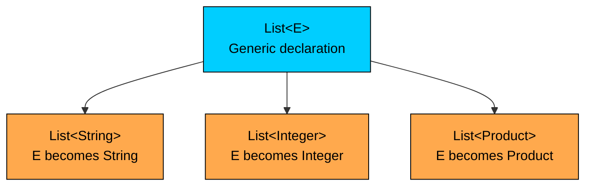
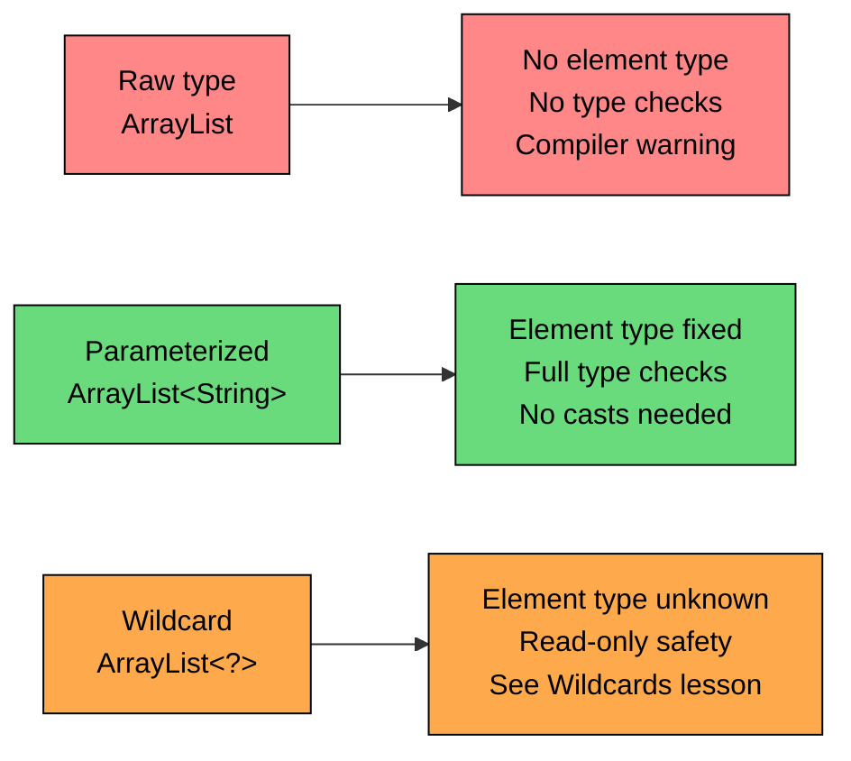

import React from 'react';
import CodeBlock from '../../../../components/ui/CodeBlock';
import Callout from '../../../../components/ui/Callout';

<div className="article-header">
  <div className="breadcrumb">
    <a href="/">Curated Notes</a>
    <span className="breadcrumb-separator">›</span>
    <span className="breadcrumb-current">Generics Basics</span>
  </div>
  <h1>Generics Basics</h1>
  <p style={{ color: 'var(--text-muted)', fontSize: '1.1rem', marginBottom: '16px', lineHeight: '1.6' }}>
    Master the essentials of Generics Basics in this curated guide.
  </p>
  <div className="meta-info">
    <span className="meta-item">
      <svg width="14" height="14" viewBox="0 0 24 24" fill="none" stroke="currentColor" strokeWidth="2"><circle cx="12" cy="12" r="10"/><polyline points="12 6 12 12 16 14"/></svg>
      10 min read
    </span>
    <span className="difficulty-badge difficulty-badge--intermediate">Intermediate</span>
  </div>
</div>

<section className="content-section">

Generics let the compiler know what type of values a class or collection is supposed to hold. They turn a `List` that could hold anything into a `List<Product>` that holds only products, with mistakes caught at compile time instead of crashing at runtime. This lesson covers the problem generics solve, how parameterized types work, the diamond operator, naming conventions for type parameters, and how to use the generic types Java already ships, like `List`, `Map`, and `Optional`. Defining custom generic classes, methods, and interfaces comes in the next few lessons.

---

## Life Before Generics

Generics arrived in Java 5. Before that, the collections in `java.util` stored everything as `Object`, because `Object` is the root of every reference type and one collection class had to be able to hold any kind of value. That sounds flexible until it comes time to use it.


```java
import java.util.ArrayList;

public class RawCart {
    public static void main(String[] args) {
        ArrayList cart = new ArrayList();
        cart.add("Notebook");
        cart.add("Pen");
        cart.add(42);

        String firstItem = (String) cart.get(0);
        System.out.println("First item: " + firstItem);

        String thirdItem = (String) cart.get(2);
        System.out.println("Third item: " + thirdItem);
    }
}
```


The first cast works because index 0 really is a `String`. The third one throws a `ClassCastException` at runtime, because an `Integer` was added to a list that was supposed to hold product names. The compiler had no way to detect this. As far as it knew, the cart held `Object` values and `Object` covers both `String` and `Integer`. The bug only surfaces when the program runs.

This is the world generics fix. The collection should know it holds product names, the compiler should refuse to add an integer to a list of names, and the code that reads items out shouldn't have to cast at all.


```java
import java.util.ArrayList;
import java.util.List;

public class TypedCart {
    public static void main(String[] args) {
        List<String> cart = new ArrayList<>();
        cart.add("Notebook");
        cart.add("Pen");
        // cart.add(42); // does not compile

        String firstItem = cart.get(0);
        System.out.println("First item: " + firstItem);
    }
}
```


The angle brackets `<String>` on `List<String>` are the generic part. They tell the compiler that this list holds `String` values. The compiler then refuses any `add` call whose argument isn't a `String`, and it lets `get` return a `String` directly with no cast needed. The bug from the previous example becomes a compile error.

Generics are a compile-time feature. The JVM doesn't see the type parameter at runtime (a topic called type erasure). There's no extra method dispatch, no boxing of references, and no runtime overhead from the type check, only the autoboxing cost when primitives are stored in a `List<Integer>` or similar.

---

## What "Parameterized Type" Actually Means

A type parameter is a placeholder for a type that gets filled in at the point of use. `List<E>` is the declaration: `E` is a placeholder for the element type. `List<String>` is one instantiation of that declaration: it fills `E` with `String`, so every method that mentioned `E` now mentions `String`.

`List<String>` and `List<Integer>` are two distinct types from the compiler's point of view, even though they share the same underlying class. Methods like `add(E e)` become `add(String s)` for one and `add(Integer i)` for the other. The same source code produces different type-checked APIs depending on the type argument inside the angle brackets.


```java
import java.util.ArrayList;
import java.util.List;

public class TwoLists {
    public static void main(String[] args) {
        List<String> productNames = new ArrayList<>();
        productNames.add("Notebook");
        productNames.add("Pen");

        List<Integer> stockCounts = new ArrayList<>();
        stockCounts.add(12);
        stockCounts.add(7);

        System.out.println("Names: " + productNames);
        System.out.println("Stock: " + stockCounts);
    }
}
```


`productNames` accepts `String` values and rejects anything else. `stockCounts` accepts `Integer` values and rejects anything else. Passing either one to a method that expects `List<String>` works only for `productNames`, because `List<Integer>` is a different parameterized type, not a subtype.

Each box at the bottom is a separate parameterized type the compiler treats independently, all built from one declaration.





The declaration on top is what library authors write. The three boxes below are what application code uses. A method that needs to walk a list of product names asks for `List<String>`, not for the bare `List` declaration. This is how generics provide compile-time type safety: the parameter type travels with the variable, and the compiler checks every operation against it.

A second example uses a `Map` to show that a generic type can have more than one parameter.


```java
import java.util.HashMap;
import java.util.Map;

public class StockLookup {
    public static void main(String[] args) {
        Map<String, Integer> stock = new HashMap<>();
        stock.put("Notebook", 12);
        stock.put("Pen", 7);
        stock.put("Eraser", 25);

        Integer notebookStock = stock.get("Notebook");
        System.out.println("Notebook in stock: " + notebookStock);
    }
}
```


`Map<K, V>` declares two type parameters, `K` for the key type and `V` for the value type. Filling them in with `Map<String, Integer>` produces an API where `put` takes a `String` key and an `Integer` value, and `get(String)` returns an `Integer`. The same `Map<K, V>` declaration also allows `Map<String, Product>` for a product catalog, or `Map<Integer, String>` for an order ID to status mapping. The shape stays the same; the types change.

---

## The Diamond Operator and Type Inference

The earliest generic code:


```java
List<String> cart = new ArrayList<String>();
```


The type parameter was written twice, once on the variable declaration and once on the constructor. Java 7 introduced the diamond operator `<>`, which lets the compiler infer the type from the variable's declared type.


```java
import java.util.ArrayList;
import java.util.HashMap;
import java.util.List;
import java.util.Map;

public class DiamondOperator {
    public static void main(String[] args) {
        List<String> cart = new ArrayList<>();
        cart.add("Notebook");

        Map<String, Integer> stock = new HashMap<>();
        stock.put("Notebook", 12);

        System.out.println(cart);
        System.out.println(stock);
    }
}
```


`new ArrayList<>()` is read by the compiler as `new ArrayList<String>()`, because the left-hand side already says `List<String>`. The same trick works for `HashMap<>`, `LinkedList<>`, and any other generic class. The empty `<>` matters: dropping it entirely, as in `new ArrayList()`, asks for a raw type, which is a separate (and worse) thing.

Type inference also works for some return types. When a method returns `List<String>`, the result can be stored in a `List<String>` variable without restating the type:


```java
import java.util.ArrayList;
import java.util.List;

public class InferredReturn {
    public static void main(String[] args) {
        List<String> cart = makeCart();
        System.out.println("Cart: " + cart);
    }

    public static List<String> makeCart() {
        List<String> items = new ArrayList<>();
        items.add("Notebook");
        items.add("Pen");
        return items;
    }
}
```


The diamond is small, but it removes a lot of repetition. The rule of thumb: when the compiler can figure out the type parameter from context, use `<>`. Spell out the parameter only when context doesn't supply it, such as when passing the constructor result straight into a method whose parameter is not generic enough to pin it down.

---

## Type Parameter Naming Conventions

Library authors use single-letter names for type parameters by convention. The letter hints at what kind of thing the parameter represents, which makes generic signatures easier to read at a glance. There's no compiler enforcement here; a parameter named `Foo` compiles fine, but readers would have to stop and figure out what it meant.


| Letter | Stands for     | Where it shows up                                     |
| ------ | -------------- | ----------------------------------------------------- |
| `T`    | Type           | General-purpose parameter, like `Optional<T>`         |
| `E`    | Element        | Element type in a collection, like `List<E>`, `Set<E>`|
| `K`    | Key            | Map key, like `Map<K, V>`                             |
| `V`    | Value          | Map value, like `Map<K, V>`                           |
| `N`    | Number         | Numeric type parameter                                |
| `R`    | Return         | Return type, often in functional interfaces           |


All six appear in the standard library. `Optional<T>` uses `T` because an `Optional` holds a single value of any type. `List<E>` uses `E` because a list is fundamentally a collection of elements. `Map<K, V>` uses both `K` and `V` because keys and values play different roles. `Function<T, R>` (from `java.util.function`) uses `T` for the input and `R` for the result.

When defining custom generic types, follow the same convention. A class that holds one value of any type takes `<T>`. A class that holds elements takes `<E>`. A class that maps keys to values takes `<K, V>`. Descriptive names like `ProductType` are tempting but break the convention readers expect.

---

## Using the Standard Library's Generic Types

Most generic code uses existing generic classes rather than defining new ones. The collections in `java.util` are all generic, as are `Optional`, `CompletableFuture`, `Class`, and the functional interfaces in `java.util.function`. The pattern is the same in every case: pick the type parameter that fits the data and let the compiler enforce it.

A shopping cart is a `List<String>` or, more realistically, a `List<Product>` once you have a `Product` class:


```java
import java.util.ArrayList;
import java.util.List;

public class ProductCart {
    public static void main(String[] args) {
        List<Product> cart = new ArrayList<>();
        cart.add(new Product("Notebook", 4.99));
        cart.add(new Product("Pen", 1.49));

        double total = 0.0;
        for (Product p : cart) {
            total += p.price();
        }
        System.out.println("Total: $" + total);
    }

    record Product(String name, double price) {}
}
```


The for-each loop declares `Product p` without a cast, because the list's element type is `Product`. A call like `cart.add("not a product")` would be caught by the compiler. The local variable `p` is statically typed to `Product`, so `p.price()` resolves at compile time.

A product catalog mapping product IDs to products is a `Map<String, Product>`:


```java
import java.util.HashMap;
import java.util.Map;

public class ProductCatalog {
    public static void main(String[] args) {
        Map<String, Product> catalog = new HashMap<>();
        catalog.put("SKU-100", new Product("Notebook", 4.99));
        catalog.put("SKU-101", new Product("Pen", 1.49));

        Product found = catalog.get("SKU-100");
        System.out.println(found.name() + " at $" + found.price());
    }

    record Product(String name, double price) {}
}
```


`catalog.get("SKU-100")` returns a `Product` directly. No cast. The return type is determined by the type parameter on the map.

`Optional<T>` is another common generic type. It represents a value that may or may not be present. The parameter says what kind of value it would hold if it were there:


```java
import java.util.HashMap;
import java.util.Map;
import java.util.Optional;

public class OptionalLookup {
    public static void main(String[] args) {
        Map<String, Product> catalog = new HashMap<>();
        catalog.put("SKU-100", new Product("Notebook", 4.99));

        Optional<Product> maybe = Optional.ofNullable(catalog.get("SKU-999"));
        if (maybe.isPresent()) {
            System.out.println("Found: " + maybe.get().name());
        } else {
            System.out.println("Not in catalog");
        }
    }

    record Product(String name, double price) {}
}
```


`Optional<Product>` is a different parameterized type from `Optional<String>` or `Optional<Integer>`. The type parameter flows through the API, so `maybe.get()` returns a `Product`, not an `Object`. Anywhere `null` would be returned to signal absence, `Optional<SomethingSpecific>` is the cleaner choice, and the type parameter tells callers exactly what they're getting if the value is present.

A list of integer stock counts is a `List<Integer>`. This one comes with a small cost.


```java
import java.util.ArrayList;
import java.util.List;

public class StockCounts {
    public static void main(String[] args) {
        List<Integer> counts = new ArrayList<>();
        counts.add(12);
        counts.add(7);
        counts.add(25);

        int total = 0;
        for (Integer count : counts) {
            total += count;
        }
        System.out.println("Total stock: " + total);
    }
}
```


The numbers `12`, `7`, and `25` are primitive `int` values. `List<Integer>` stores reference types, not primitives, so each `add(12)` autoboxes the `int` into an `Integer` object. The for-each loop autounboxes back to `int` for the addition. Both conversions are silent and convenient, but they allocate objects on the heap, which adds up when a list holds millions of numbers.

`List<Integer>` boxes every primitive `int` into an `Integer` object on add and unboxes on read. For large numeric workloads, `int[]` (a primitive array) or `IntStream` avoids the boxing overhead. For ordinary stock counts and similar small collections, the cost is negligible.

---

## Raw Types: What They Are, Why to Avoid Them

A raw type is a generic class used without its type parameter. `ArrayList` is the raw type; `ArrayList<String>` is the parameterized type. Raw types still compile, because Java needed to stay backwards-compatible with all the pre-Java-5 code that used the framework without generics. The compiler tolerates them, but it warns, and it gives up most of the type checks it would otherwise do.


```java
import java.util.ArrayList;

public class RawWarning {
    public static void main(String[] args) {
        ArrayList cart = new ArrayList();
        cart.add("Notebook");
        cart.add(42);

        for (Object o : cart) {
            System.out.println(o);
        }
    }
}
```


This compiles, but `javac` produces an "unchecked or unsafe operations" warning. The compiler is signaling that it can't verify that the `add` calls are safe, because the list has no declared element type. Whatever goes in comes out as `Object`, and casting is the caller's responsibility.

The damage shows up when raw and parameterized types meet:


```java
import java.util.ArrayList;
import java.util.List;

public class RawPoisoning {
    public static void main(String[] args) {
        List<String> productNames = new ArrayList<>();
        productNames.add("Notebook");

        List rawView = productNames;
        rawView.add(42);

        for (String name : productNames) {
            System.out.println(name.length());
        }
    }
}
```


Assigning `productNames` to a raw `List` variable turns off the element-type check on `rawView`. Now `rawView.add(42)` puts an `Integer` into the same list `productNames` points at. The for-each loop assumes elements are `String`, and crashes on the second one. The compiler did warn that the assignment used a raw type, but it didn't refuse it.

The rule is simple: never use a raw type in new code. Replace any `ArrayList` without `<...>`. When the element type is unknown at the call site (rare, mostly when working with very old libraries), use `ArrayList<?>` (the wildcard form) instead. The raw type exists for compatibility with code from 2004, not as a shortcut.





The three forms look similar but behave differently. Use the green one. Wildcards (orange) get their own lesson. The red one is a legacy carve-out, not a tool.

---

## Putting It Together: A Small Checkout Flow

A short program that uses three generic types from the standard library and shows the kinds of mistakes the compiler now catches.


```java
import java.util.ArrayList;
import java.util.HashMap;
import java.util.List;
import java.util.Map;
import java.util.Optional;

public class Checkout {
    public static void main(String[] args) {
        Map<String, Double> catalog = new HashMap<>();
        catalog.put("Notebook", 4.99);
        catalog.put("Pen", 1.49);
        catalog.put("Eraser", 0.79);

        List<String> cart = new ArrayList<>();
        cart.add("Notebook");
        cart.add("Pen");
        cart.add("Eraser");

        double total = 0.0;
        for (String item : cart) {
            Optional<Double> price = Optional.ofNullable(catalog.get(item));
            if (price.isPresent()) {
                total += price.get();
            } else {
                System.out.println("Skipping unknown item: " + item);
            }
        }

        System.out.println("Total: $" + total);
    }
}
```


`Map<String, Double>` says the catalog maps product names to prices. `List<String>` says the cart holds product names. `Optional<Double>` says the lookup may or may not find a price. Each type parameter flows through the rest of the code. The for-each loop's `String item` and the `price.get()` returning `Double` are both compiler-verified.

If a future change adds `cart.add(42)`, the build breaks at that line. If someone writes `catalog.put(99, "Notebook")` (swapping key and value), the build breaks. The bugs from the raw-type version at the top of this lesson are impossible here, because the parameterized types refuse them.

</section>
