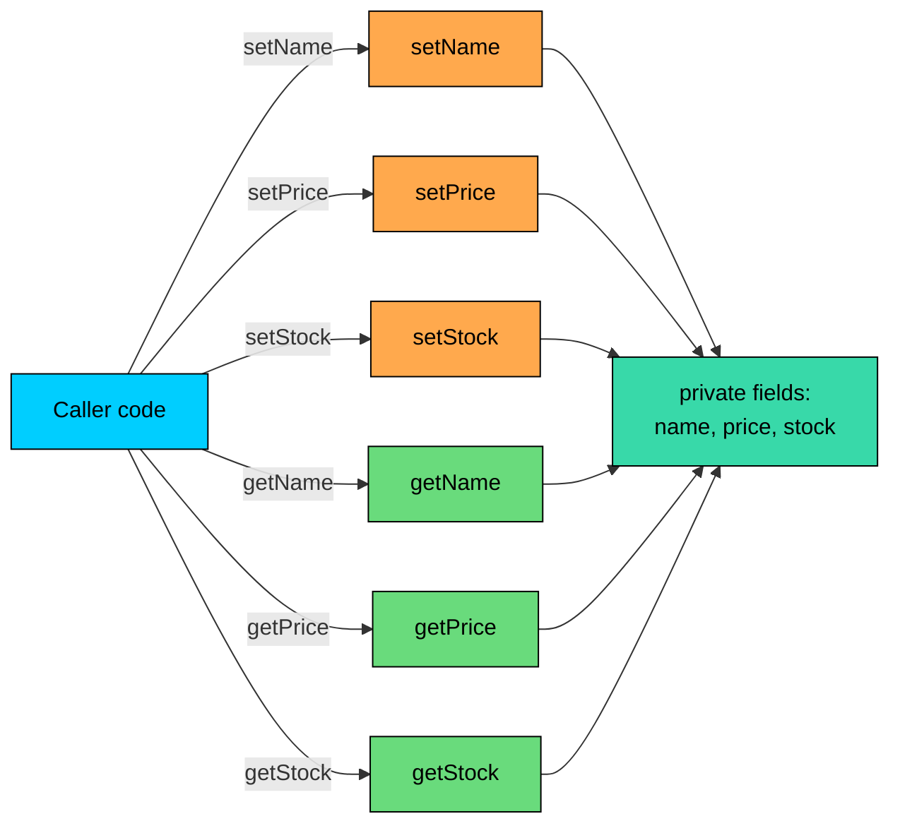

import React from 'react';
import CodeBlock from '../../../../components/ui/CodeBlock';
import Callout from '../../../../components/ui/Callout';

<div className="article-header">
  <div className="breadcrumb">
    <a href="/">Curated Notes</a>
    <span className="breadcrumb-separator">›</span>
    <span className="breadcrumb-current">Getters & Setters</span>
  </div>
  <h1>Getters & Setters</h1>
  <p style={{ color: 'var(--text-muted)', fontSize: '1.1rem', marginBottom: '16px', lineHeight: '1.6' }}>
    Master the essentials of Getters & Setters in this curated guide.
  </p>
  <div className="meta-info">
    <span className="meta-item">
      <svg width="14" height="14" viewBox="0 0 24 24" fill="none" stroke="currentColor" strokeWidth="2"><circle cx="12" cy="12" r="10"/><polyline points="12 6 12 12 16 14"/></svg>
      10 min read
    </span>
    <span className="difficulty-badge difficulty-badge--intermediate">Intermediate</span>
  </div>
</div>

<section className="content-section">

A class can hold data in two ways: expose it directly as public fields, or hide it behind methods that read and write the data on the caller's behalf. Java code typically picks the second approach, and the read and write methods have standard names: `getX` and `setX`. This lesson covers why hiding fields behind methods is the default, how to write getters and setters cleanly, and the cases where one or both should be left out.

---

## Why Methods Instead of Public Fields

A `Product` with everything public looks tempting. It's the shortest code possible.


```java
public class ProductPublic {
    public String name;
    public double price;
    public int stock;

    public static void main(String[] args) {
        ProductPublic mouse = new ProductPublic();
        mouse.name = "Wireless Mouse";
        mouse.price = 29.99;
        mouse.stock = 50;
        System.out.println(mouse.name + " costs $" + mouse.price + ", stock " + mouse.stock);
    }
}
```


This works. It also fails the moment any of the following happens:

- A bug somewhere in the codebase sets `mouse.price = -5.0`. Nothing stops it. The catalog now has a product with a negative price.
- A rule says `stock` should never go below zero. There is no single place to enforce that, because every caller writes directly to the field.
- A new requirement says "price is stored in cents internally, but the public API still exposes dollars". Every line of code that touches `price` must change.
- A logging team wants every change to `stock` recorded for an audit. There is no hook to add the logging to.

A getter and a setter sidestep all of these. The field becomes `private`, callers go through methods, and the methods can validate, transform, log, or change their underlying storage without breaking any caller. The field is an implementation detail. The methods are the contract.


```java
public class ProductWithAccessors {
    private String name;
    private double price;
    private int stock;

    public String getName() { return name; }
    public void setName(String name) { this.name = name; }

    public double getPrice() { return price; }
    public void setPrice(double price) { this.price = price; }

    public int getStock() { return stock; }
    public void setStock(int stock) { this.stock = stock; }

    public static void main(String[] args) {
        ProductWithAccessors mouse = new ProductWithAccessors();
        mouse.setName("Wireless Mouse");
        mouse.setPrice(29.99);
        mouse.setStock(50);
        System.out.println(mouse.getName() + " costs $" + mouse.getPrice() + ", stock " + mouse.getStock());
    }
}
```


Same behavior at the call site, more flexibility internally. There's no validation yet, but the door is open. The validation section is next.

Three benefits this pattern provides:

- **Validation.** Setters can reject bad input before it corrupts the object.
- **Computed values.** Getters can return data that isn't directly stored, like a discounted price.
- **A stable external API.** The class can change how it stores data internally without breaking callers. As long as `getPrice()` still returns a `double`, the caller doesn't care whether the storage is in cents or dollars.

The standard setup is `private` for fields and `public` for accessor methods.

---

## JavaBean Naming Conventions

Java has firm conventions for accessor method names, originally formalized by the JavaBeans specification. Tools, frameworks, and IDEs all expect them.


| Field declaration | Getter name | Setter name |
| --- | --- | --- |
| `private String name` | `getName()` | `setName(String name)` |
| `private double price` | `getPrice()` | `setPrice(double price)` |
| `private int stockCount` | `getStockCount()` | `setStockCount(int stockCount)` |
| `private boolean available` | `isAvailable()` | `setAvailable(boolean available)` |


The pattern:

- A getter takes no arguments and returns the field's type. Its name is `get` followed by the field name with its first letter uppercased.
- A setter takes one argument of the field's type, returns `void`, and is named `set` followed by the same uppercased field name.
- For a boolean field, the getter is conventionally named `is` instead of `get`. `isAvailable()` reads naturally inside an `if`: `if (product.isAvailable()) { ... }`. The setter still uses `set`.

The compiler doesn't enforce these names. `fetchName()` and `assignName(String)` would compile fine. But every reflection-based framework (Spring, Jackson, Hibernate, the older JavaBeans tools), every IDE that generates accessors, and every developer reading the code expects the standard names. Deviating from them costs compatibility for no real benefit.

---

## A Standard Product Class

Putting the conventions together, here is the canonical shape of an e-commerce `Product`. Fields are `private`, accessors are `public`, and a small `main` method exercises them.


```java
public class Product {
    private String name;
    private double price;
    private int stock;

    public String getName() {
        return name;
    }
    public void setName(String name) {
        this.name = name;
    }

    public double getPrice() {
        return price;
    }
    public void setPrice(double price) {
        this.price = price;
    }

    public int getStock() {
        return stock;
    }
    public void setStock(int stock) {
        this.stock = stock;
    }

    public static void main(String[] args) {
        Product headphones = new Product();
        headphones.setName("Wireless Headphones");
        headphones.setPrice(89.99);
        headphones.setStock(25);

        System.out.println(headphones.getName());
        System.out.println("Price: $" + headphones.getPrice());
        System.out.println("Stock: " + headphones.getStock());
    }
}
```


The class has a clear external surface: six methods, three pieces of data. A caller can do exactly two things with each piece of data, read it or write it, and the class controls how both operations behave. That control is what the rest of the lesson builds on.

A diagram of the same idea: the fields sit behind a wall of accessors. Callers only touch the methods, never the fields directly.





The fields live in the middle. Setters on the left write to them; getters on the right read from them. Callers stay on the outside. This separation is what people mean when they call this pattern encapsulation.

---

## Validation in Setters

The first practical benefit of using setters is that they can reject bad input. A setter is the one and only path that writes the field, so validation placed there is impossible to bypass.

A negative price doesn't make sense. Neither does a negative stock count. An email address without an `@` is almost certainly a bug. All three checks belong inside the corresponding setters.


```java
public class ValidatedProduct {
    private String name;
    private double price;
    private int stock;
    private String contactEmail;

    public String getName() { return name; }
    public void setName(String name) {
        if (name == null || name.isBlank()) {
            throw new IllegalArgumentException("name must not be blank");
        }
        this.name = name;
    }

    public double getPrice() { return price; }
    public void setPrice(double price) {
        if (price < 0) {
            throw new IllegalArgumentException("price must not be negative, got " + price);
        }
        this.price = price;
    }

    public int getStock() { return stock; }
    public void setStock(int stock) {
        if (stock < 0) {
            throw new IllegalArgumentException("stock must not be below zero, got " + stock);
        }
        this.stock = stock;
    }

    public String getContactEmail() { return contactEmail; }
    public void setContactEmail(String contactEmail) {
        if (contactEmail == null || !contactEmail.contains("@")) {
            throw new IllegalArgumentException("contactEmail must contain @, got " + contactEmail);
        }
        this.contactEmail = contactEmail;
    }

    public static void main(String[] args) {
        ValidatedProduct mouse = new ValidatedProduct();
        mouse.setName("Wireless Mouse");
        mouse.setPrice(29.99);
        mouse.setStock(50);
        mouse.setContactEmail("seller@store.com");
        System.out.println("Created: " + mouse.getName() + " @ $" + mouse.getPrice());

        try {
            mouse.setPrice(-1.0);
        } catch (IllegalArgumentException e) {
            System.out.println("Rejected: " + e.getMessage());
        }
    }
}
```


Three details:

- The check happens **before** the assignment. With `this.price = price; if (price < 0) throw ...`, the bad value would already be in the field by the time the check ran.
- The error message includes the offending value. When a setter rejects input from somewhere deep in a call stack, the value is the most useful thing to know.
- The exception type is `IllegalArgumentException`. It's a standard unchecked exception meant for exactly this situation: "the caller passed an argument the method refuses to accept". The Exception Handling section covers exceptions in depth.

Validation in setters runs on every single write. For hot paths that set a field millions of times per second, this might add up. For ordinary object creation and updates, the cost is negligible compared to the cost of having a corrupted object.

#### A Common Bad Habit: Swallowing Errors

Validation is only useful if a rejected setter call is loud. A common mistake is to validate and then do nothing on bad input.

**What's wrong with this code?**


```java
public void setPrice(double price) {
    if (price < 0) {
        return; // ignore bad input
    }
    this.price = price;
}
```


The setter returns `void`, so the caller has no way to know whether the assignment happened. A buggy caller passes `-5.0`, the setter does nothing, the caller moves on assuming the price was set, and the rest of the program runs with a stale value. The bug shows up much later, far from its source.

**Fix:**


```java
public void setPrice(double price) {
    if (price < 0) {
        throw new IllegalArgumentException("price must not be negative, got " + price);
    }
    this.price = price;
}
```


Throwing is louder. The caller can't ignore it; the program either handles the exception explicitly or crashes at the exact point where the bad value showed up. That's much easier to debug than a stale field.

---

## Read-Only Fields: Getter Only

Not every field needs a setter. Some values are set once when the object is created and should never change. A product's permanent identifier is a good example. The system assigns it, it appears on receipts and in databases, and changing it would silently break every reference to that product elsewhere.

For a read-only field, give it a getter and skip the setter. Set the value in the constructor, then leave it alone.


```java
public class ProductWithId {
    private final String productId;
    private String name;
    private double price;

    public ProductWithId(String productId, String name, double price) {
        this.productId = productId;
        this.name = name;
        this.price = price;
    }

    public String getProductId() {
        return productId;
    }

    public String getName() { return name; }
    public void setName(String name) { this.name = name; }

    public double getPrice() { return price; }
    public void setPrice(double price) {
        if (price < 0) {
            throw new IllegalArgumentException("price must not be negative");
        }
        this.price = price;
    }

    public static void main(String[] args) {
        ProductWithId headphones = new ProductWithId("P-1042", "Wireless Headphones", 89.99);
        System.out.println("ID: " + headphones.getProductId());

        headphones.setName("Wireless Headphones Pro");
        headphones.setPrice(99.99);
        System.out.println(headphones.getName() + " is now $" + headphones.getPrice());
    }
}
```


Two things make `productId` read-only here:

- There's no `setProductId` method. A caller has no way to change the value after construction.
- The field is declared `final`. That tells the compiler the field can only be assigned once, in the constructor. Even code inside the class can't accidentally reassign it later. `final` isn't strictly required for a read-only field (the absence of a setter is enough for external callers), but it's a useful belt-and-braces signal.

For now, treat `final` as a way to say "this value is set once and never changes".

Read-only fields are common for anything that identifies an object: order IDs, customer IDs, timestamps for when something was created. Once the system assigns them, changing them would break every reference that uses them.

---

## Write-Only Fields: Setter Only

The opposite case, a field with only a setter and no getter, exists but is rare. The classic example is a password reset. The class accepts a new password, but no code should be able to read the stored password back out.


```java
public class CustomerCredentials {
    private String username;
    private String passwordHash;

    public CustomerCredentials(String username) {
        this.username = username;
    }

    public String getUsername() { return username; }

    public void setPassword(String newPassword) {
        if (newPassword == null || newPassword.length() < 8) {
            throw new IllegalArgumentException("password must be at least 8 characters");
        }
        this.passwordHash = hash(newPassword);
    }

    // No getPassword() method. The hashed password is internal only.

    private String hash(String raw) {
        // Real code would use a proper hash algorithm here.
        return "hash:" + raw.hashCode();
    }

    public boolean verify(String attempt) {
        return passwordHash != null && passwordHash.equals(hash(attempt));
    }

    public static void main(String[] args) {
        CustomerCredentials creds = new CustomerCredentials("alice");
        creds.setPassword("hunter2x9");
        System.out.println("Login user: " + creds.getUsername());
        System.out.println("Correct password? " + creds.verify("hunter2x9"));
        System.out.println("Wrong password? " + creds.verify("wrong"));
    }
}
```


The class accepts a password through `setPassword` but never lets a caller read it back. Anything that needs to use the password (logging in, for example) does so through other methods like `verify`, which takes a candidate password and compares it to the stored hash without revealing it.

Write-only setters are a useful sanity check for security-sensitive data: secrets, tokens, internal keys. The pattern is rare because most fields have at least one legitimate reader. Use it only when the data should never leave the object.

---

## Computed Getters: Returning Derived Values

A getter doesn't have to return a field directly. It can compute a value on the fly from one or more fields and return that. This is the second big reason to expose state through methods rather than fields: the caller doesn't have to know whether the value is stored or calculated.

A discounted price is a good example. The base price is stored. The discount percentage is stored. The discounted price is whatever those two add up to, computed when someone asks.


```java
public class DiscountedProduct {
    private String name;
    private double price;
    private double discountPercent;

    public DiscountedProduct(String name, double price, double discountPercent) {
        this.name = name;
        this.price = price;
        this.discountPercent = discountPercent;
    }

    public String getName() { return name; }
    public double getPrice() { return price; }
    public double getDiscountPercent() { return discountPercent; }

    public double getDiscountedPrice() {
        return price * (1 - discountPercent / 100);
    }

    public static void main(String[] args) {
        DiscountedProduct mouse = new DiscountedProduct("Wireless Mouse", 29.99, 10.0);
        System.out.println(mouse.getName());
        System.out.println("Base price:       $" + mouse.getPrice());
        System.out.println("Discount:         " + mouse.getDiscountPercent() + "%");
        System.out.println("Discounted price: $" + mouse.getDiscountedPrice());
    }
}
```


`getDiscountedPrice` isn't backed by a field. Each call recomputes the value. From outside the class, it looks identical to any other getter: take no arguments, return a `double`. The fact that it's derived is an implementation detail the caller doesn't need to know.

Computed getters are useful for:

- Values that can drift if stored separately, like a total that's the sum of line items.
- Values that depend on something other than fields, like the current date.
- Unit conversions, like a price stored in cents but exposed in dollars.

A computed getter does its work on every call. If the computation is expensive (loops over a list, walks a tree) and gets called inside a tight loop, consider caching the result or computing it once and storing it. For arithmetic on a couple of doubles, the cost is invisible.

---

## Side Effects in Setters

A setter's job is to set a field. Anything beyond that, logging, sending notifications, recalculating other fields, talking to a database, is a **side effect**. A small amount of side-effect logic is reasonable (the validation we already wrote is technically a side effect). A lot of it is a code smell.

Consider this overcooked setter.


```java
public class HeavySetterProduct {
    private double price;

    public void setPrice(double price) {
        logPriceChange(this.price, price);
        notifySubscribers(price);
        updateRecommendationEngine(price);
        rebuildSearchIndex();
        this.price = price;
    }

    private void logPriceChange(double oldPrice, double newPrice) {
        System.out.println("Price change: " + oldPrice + " -> " + newPrice);
    }
    private void notifySubscribers(double newPrice) {
        System.out.println("Notifying 4,200 subscribers");
    }
    private void updateRecommendationEngine(double newPrice) {
        System.out.println("Recomputing recommendations");
    }
    private void rebuildSearchIndex() {
        System.out.println("Rebuilding search index");
    }
}
```


Setting a price now triggers four pieces of business logic. A caller writing `product.setPrice(29.99)` cannot tell from the call site that they're also triggering a search rebuild. The setter has also become impossible to use in tests or in any context where those side effects shouldn't fire.

The fix isn't to add side effects to a setter; it's to move the side effects out of it.


```java
public class CleanSetterProduct {
    private double price;

    public double getPrice() { return price; }
    public void setPrice(double price) {
        if (price < 0) {
            throw new IllegalArgumentException("price must not be negative");
        }
        this.price = price;
    }

    public void updatePriceAndNotify(double newPrice) {
        double oldPrice = this.price;
        setPrice(newPrice);
        System.out.println("Price change: " + oldPrice + " -> " + newPrice);
        System.out.println("Notifying subscribers");
    }
}
```


`setPrice` is back to its small, predictable shape. The orchestration that wants logging and notifications has its own clearly-named method, `updatePriceAndNotify`, for callers that want all that to happen.

The rule of thumb: a setter should be safe to call without considering cascading effects. Light validation belongs there. Heavy work, especially anything that talks to the network, the database, or other services, does not.

---

## Records and Immutable Classes

Two related shapes are worth a brief mention before we wrap up.

**Records** are a Java feature (introduced in Java 16) for classes that exist mainly to carry data. Fields are declared once, and the compiler generates accessors automatically. The accessor naming differs from the standard convention: a record with a field `name` exposes it as `product.name()` rather than `product.getName()`. When a class is nothing but private fields and standard accessors, a record may be the better tool.

**Immutable classes** deliberately have no setters at all. Every field is `final`, set once in the constructor, and there's no way to change it afterward. A new value means a new object. This is the design behind `String`, `LocalDate`, and many other core Java types. The takeaway is that "always provide getters and setters" is a starting point, not a law. Sometimes the answer is no setters at all.

---

## Putting It All Together

A more complete `Product` class uses every idea from this lesson: a read-only ID, validated setters for price and stock, a computed discounted price, and no surprise side effects.


```java
public class CatalogProduct {
    private final String productId;
    private String name;
    private double price;
    private int stock;
    private double discountPercent;

    public CatalogProduct(String productId, String name, double price, int stock) {
        this.productId = productId;
        setName(name);
        setPrice(price);
        setStock(stock);
        this.discountPercent = 0.0;
    }

    public String getProductId() { return productId; }

    public String getName() { return name; }
    public void setName(String name) {
        if (name == null || name.isBlank()) {
            throw new IllegalArgumentException("name must not be blank");
        }
        this.name = name;
    }

    public double getPrice() { return price; }
    public void setPrice(double price) {
        if (price < 0) {
            throw new IllegalArgumentException("price must not be negative");
        }
        this.price = price;
    }

    public int getStock() { return stock; }
    public void setStock(int stock) {
        if (stock < 0) {
            throw new IllegalArgumentException("stock must not be below zero");
        }
        this.stock = stock;
    }

    public double getDiscountPercent() { return discountPercent; }
    public void setDiscountPercent(double discountPercent) {
        if (discountPercent < 0 || discountPercent > 100) {
            throw new IllegalArgumentException("discountPercent must be between 0 and 100");
        }
        this.discountPercent = discountPercent;
    }

    public double getDiscountedPrice() {
        return price * (1 - discountPercent / 100);
    }

    public boolean isInStock() {
        return stock > 0;
    }

    public static void main(String[] args) {
        CatalogProduct mouse = new CatalogProduct("P-1042", "Wireless Mouse", 29.99, 50);
        mouse.setDiscountPercent(15.0);

        System.out.println("ID:          " + mouse.getProductId());
        System.out.println("Name:        " + mouse.getName());
        System.out.println("Price:       $" + mouse.getPrice());
        System.out.println("After 15%:   $" + mouse.getDiscountedPrice());
        System.out.println("Stock:       " + mouse.getStock());
        System.out.println("Available?   " + mouse.isInStock());
    }
}
```


The constructor calls the setters rather than assigning the fields directly. That way, the validation rules apply to construction too. A `CatalogProduct` can't be built with a blank name or a negative price, because the constructor would throw the same exception a later `setName(null)` would throw.

The class has five fields, but its external API is the set of public methods: six getters, four setters, and two boolean / computed helpers. That collection of methods is the contract. The fields behind them are an implementation detail.

</section>
