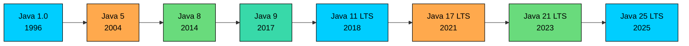
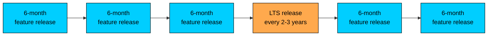

import React from 'react';
import CodeBlock from '../../../../components/ui/CodeBlock';
import Callout from '../../../../components/ui/Callout';

<div className="article-header">
  <div className="breadcrumb">
    <a href="/">Curated Notes</a>
    <span className="breadcrumb-separator">›</span>
    <span className="breadcrumb-current">History of Java</span>
  </div>
  <h1>History of Java</h1>
  <p style={{ color: 'var(--text-muted)', fontSize: '1.1rem', marginBottom: '16px', lineHeight: '1.6' }}>
    Master the essentials of History of Java in this curated guide.
  </p>
  <div className="meta-info">
    <span className="meta-item">
      <svg width="14" height="14" viewBox="0 0 24 24" fill="none" stroke="currentColor" strokeWidth="2"><circle cx="12" cy="12" r="10"/><polyline points="12 6 12 12 16 14"/></svg>
      10 min read
    </span>
    <span className="difficulty-badge difficulty-badge--intermediate">Intermediate</span>
  </div>
</div>

<section className="content-section">

Java didn't start as a web language, a server language, or an interview language. It started as an experiment to control consumer electronics like cable boxes and smart TVs. The path from that experiment to the language running most of today's banks, retailers, and online stores explains a lot about why Java looks the way it does. This chapter walks that timeline from 1991 to today.

---

## Origins at Sun Microsystems

In 1991, a small group inside Sun Microsystems started a secret project called the **Green Project**. The team was led by **James Gosling**, with **Mike Sheridan** and **Patrick Naughton** as the other founding members. Their goal had nothing to do with the web. They wanted a language to power smart consumer devices: set-top boxes, handheld controllers, things that needed to run reliably on tiny hardware made by many different manufacturers.

The problem they kept running into was portability. Code written in C or C++ depended on the exact processor and operating system it was compiled for. If one cable box used a different chip than another, the code had to be recompiled, retested, and often rewritten. For a team trying to ship software to hundreds of device types, that was a dead end.

The team decided to build something new. A language with the look and feel of C++, but without the parts that made C++ hard to port: manual memory management, pointer arithmetic, and tight coupling to a specific machine. Instead, code would compile to an intermediate format that ran inside a small virtual machine. Get the virtual machine working on a device, and any program would run on it.

That idea, "compile once, run anywhere there's a virtual machine," is the seed of everything that followed.

---

## The Oak Project and the Rename to Java

The language the Green Team built was originally called **Oak**. The name came from an oak tree outside Gosling's office window. By 1994, the team had a working prototype and even a demo device, a handheld controller called the Star7, but the consumer electronics market wasn't biting. Cable companies weren't ready to rebuild their systems around a brand-new language from a workstation vendor.

Around the same time, the World Wide Web was taking off. The team realized their portable, sandboxed language was a much better fit for the web than for set-top boxes. A browser could embed the virtual machine and run small programs (called **applets**) downloaded from any web page, on any operating system.

There was just one problem with the name. "Oak" was already trademarked by another company. The team brainstormed alternatives over coffee, and **Java**, named after the coffee from the Indonesian island, stuck. The language was renamed in 1995 and announced publicly at the SunWorld conference that same year. Netscape Navigator, the dominant browser at the time, agreed to support Java applets, which gave the language massive early reach.

---

## Java 1.0 and "Write Once, Run Anywhere"

**Java 1.0** was released in January 1996. It was modest by today's standards: a small standard library, basic networking, AWT for graphical interfaces, and applet support. But it shipped with one promise that defined its identity for the next thirty years: **Write Once, Run Anywhere** (WORA).

Java source code compiles to platform-neutral **bytecode**. Any machine running a **Java Virtual Machine** (JVM) can execute that bytecode, whether it's a Windows PC, a Linux server, or a Sun workstation.

In a world where every other language tied developers to a specific operating system, WORA was a serious selling point. Banks and enterprises noticed quickly. By the late 1990s, Java had moved off the browser and onto servers, where it found its primary home running web applications, payment processors, and order management systems for online stores.

---

## Major Versions Through the Years

Once Java 1.0 shipped, Sun started adding features at a steady pace. The biggest releases each redefined what idiomatic Java code looked like. The timeline at a high level:





The diagram above marks the releases that mattered most. Java 1.0 was the starting point. Java 5 was the first major rewrite of how the language felt to use. Java 8 changed how people wrote everyday code. Java 9 changed the release model itself. Java 11, 17, 21, and 25 are the long-term support versions most teams actually deploy on.

**Java 5** (released 2004) was a turning point. It introduced **generics**, so collections like `List<Product>` could carry type information at compile time instead of forcing casts everywhere. It also added **enums**, **autoboxing**, the enhanced `for` loop, varargs, and annotations. Code written before Java 5 looks distinctly older than code written after.

**Java 8** (released March 2014) is one of the most influential releases in the language's history. It brought **lambda expressions**, the **Stream API**, **default methods** on interfaces, and a new **Date and Time API**. Filter, map, and reduce could be expressed in a few lines instead of nested loops with mutable counters. For many teams, Java 8 is still the baseline they target today.

**Java 9** (released September 2017) introduced the **Java Platform Module System** (JPMS, also called Project Jigsaw), which split applications and libraries into explicit modules with declared dependencies. Java 9 was also the release where Sun's successor, Oracle, changed how Java itself shipped, more on that below.

**Java 11** (released September 2018) was the first **long-term support** (LTS) release under the new cadence. It removed some old browser-era pieces (like Java Web Start and the browser plugin) and added a modern HTTP client. For a long time, "are we on 8 or 11?" was the upgrade question at many Java shops.

**Java 17** (released September 2021) was the next LTS. It standardized **sealed classes**, which let a class explicitly list the subclasses allowed to extend it. It also brought pattern matching for `instanceof` and finalized records as a way to write small data-carrier classes with very little boilerplate.

**Java 21** (released September 2023) introduced **virtual threads** from Project Loom, which make it cheap to run hundreds of thousands of concurrent tasks. It also finalized **pattern matching for switch**, sequenced collections, and other features that pull modern functional-style code further into the language.

**Java 25** (released September 2025) is the latest LTS. It finalized features like compact source files and instance main methods, scoped values, and module imports, smoothing out the on-ramp for new learners while continuing the modernization push.

The same information as a table for quick reference:


| Version | Year | LTS | Signature Feature                       |
| ------- | ---- | --- | --------------------------------------- |
| Java 1.0 | 1996 | No  | Initial release, applets, WORA          |
| Java 5  | 2004 | No  | Generics, enums, autoboxing             |
| Java 8  | 2014 | Yes | Lambdas, streams, default methods       |
| Java 9  | 2017 | No  | Module system (JPMS)                    |
| Java 11 | 2018 | Yes | First LTS under the 6-month cadence, HTTP client |
| Java 17 | 2021 | Yes | Sealed classes, finalized records       |
| Java 21 | 2023 | Yes | Virtual threads, pattern matching for switch |
| Java 25 | 2025 | Yes | Compact source files, scoped values, module imports |


The rows above cover most "what version brought X?" interview questions.

---

## The Oracle Era and the 6-Month Cadence

In **2010**, Oracle Corporation acquired Sun Microsystems. With the acquisition, Oracle inherited Java, the JVM, and the trademarks. Stewardship of the language moved from Sun to Oracle, but the technical work continued through **OpenJDK**, the open-source reference implementation, which most other Java distributions (Amazon Corretto, Eclipse Temurin, Azul Zulu, Red Hat OpenJDK) are built from.

For the first twenty years, Java releases came in big multi-year drops. Java 6 came two years after Java 5. Java 7 came five years after Java 6. Java 8 came almost three years after Java 7. The problem with this model was visible by Java 9: features kept slipping, and a single delayed feature could hold up the entire release.

Starting with **Java 9 in 2017**, Oracle moved to a **six-month release cadence**. Whatever features are ready when the calendar hits the release date ship. Whatever isn't, waits for the next train six months later. A new feature version drops every March and every September.





The diagram above shows the rhythm. Most releases are short-lived "feature" releases. Every two to three years, one release is marked **Long-Term Support** (LTS) and gets several years of patches and security fixes. LTS releases are what enterprises run in production. The non-LTS releases are useful for previewing what's coming, but few teams ship payment processors on them.

The current LTS lineage is **Java 8, 11, 17, 21, and 25**. For a new project, the latest LTS supported by the tooling is a reasonable default.

---

## The Java SE and OpenJDK Ecosystem

The names in this ecosystem get confusing fast.

**Java SE** (Standard Edition) is the specification. It defines the language, the core libraries, and the JVM behavior. Oracle, in coordination with the Java Community Process, owns and publishes this specification.

**OpenJDK** is the open-source reference implementation of Java SE. It's the actual source code that gets built into the JVM and the standard library. Almost every Java distribution you can download today, including Oracle's own, is built from OpenJDK sources.

**Java distributions** are the prebuilt binaries available for install. Some popular ones:


| Distribution      | Maintainer | Notes                                            |
| ----------------- | ---------- | ------------------------------------------------ |
| Oracle JDK        | Oracle     | Commercial license for production in some cases  |
| Eclipse Temurin   | Eclipse    | Free, widely used, drop-in OpenJDK build         |
| Amazon Corretto   | Amazon     | Free, long support windows, used by AWS          |
| Azul Zulu         | Azul       | Free community builds, paid commercial support   |
| Red Hat OpenJDK   | Red Hat    | Ships with Red Hat Enterprise Linux              |


All of them implement the same Java SE specification, so a program that runs on one usually runs on the others.

A program written today still goes through the same compile-then-run-on-a-JVM flow that Java 1.0 introduced in 1996:


```java
public class StoreYear {
    public static void main(String[] args) {
        int founded = 1996;
        int currentYear = 2026;
        System.out.println("Java has been running online stores for "
                + (currentYear - founded) + " years.");
    }
}
```


The example is trivial, but the surface of the language has stayed stable. Code written for Java 1.1 still compiles and runs on Java 25, which is a big part of why so many enterprise systems are still on the JVM.

</section>
